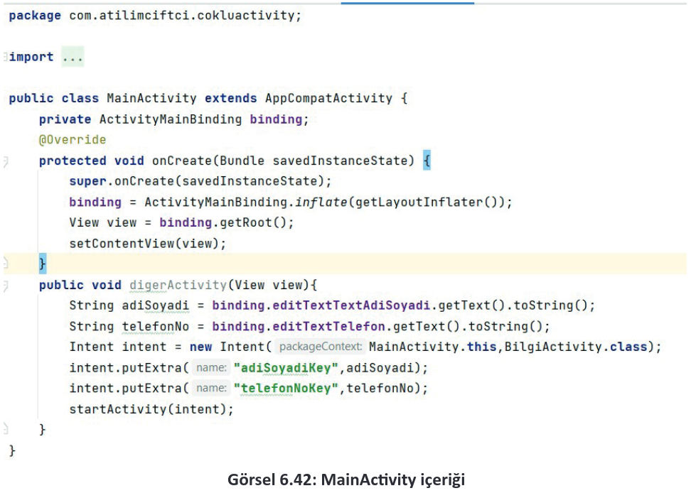

<h1 style="color:#a8d14f">6.3 ACTIVITY YAPISI</h1>

- <a href="#6.3.1.">6.3.1. Activity Yaşam Döngüleri (Activity Life Cycle)</a>
- <a href="#6.3.2.">6.3.2. Çoklu Aktiviteler</a>
  
Activity, bir kullanıcı arayüzüne (UI) sahip mobil uygulama ekranını temsil eder. Bir sosyal medya uygulamasında arkadaş listesini gösteren bir Activity, mesajlar sayfasında kişilerin mesajlarını gösteren bir Activity, üye girişi için Activity örnek olarak gösterilebilir. Bir mobil uygulamada en az bir tane Activity olmalıdır. Bu Activity, "Ana Aktivite", "Başlatıcı Aktivite" veya "Main Activity" olarak adlandırılır. Bir mobil uygulama birden fazla Activity içerse de bunlardan biri ana aktivite olmak zorundadır. Uygulama ilk başlatıldığında ana aktivite devreye girmelidir. Birden fazla Activitye sahip mobil uygulamalarda, uygulama ilk çalıştırıldığında yüklenecek Activity, AndroidManifest.xml içinde Görsel 6.31’de belirtilen bölümden değiştirilebilir.

<div style='display:block;text-align:center'>


</div>

<h2 id="6.3.1." style="color:#a8d14f">6.3.1. Activity Yaşam Döngüleri (Activity Life Cycle)</h2>

Activityler, belirli bir döngü içinde çalışan yapılardır. Ekranın çevrilmesi, uygulamanın arka planına bakılması, başka bir Activity açılması, geri tuşuna basılması vb. eylemler sırasında uygulamanın arka planında yaşam döngüsü denilen bir yapıya göre işlemler yapılır. Yaşam döngüsünde yer alan her bir işleme yönelik bir metot bulunur. Bu metotlar, Görsel 6.32’de verilmiştir.

<div style='display:block;text-align:center'>


</div>

<h3 style="color:#a8d14f">6.3.1.1. onCreate()</h3>

onCreate(), bir Activity çağrıldığı zaman arka planda ilk olarak devreye giren metottur. Yapı itibarıyla constructera (kurucu metot) benzetilebilir. Uygulama çalışır çalışmaz Activity içinde gerçekleşmesi istenen her olay onCreate metoduna yazılır. Activity her başlatıldığında yalnızca bir defa çalışır.
<h3 style="color:#a8d14f">6.3.1.2. onStart()</h3>

onStart(), onCreate() metodu çalıştıktan sonra veya Activity tekrar çalıştırıldıktan sonra devreye girer. Arka plandaki başka bir uygulamaya geçip tekrar mobil uygulamada Activity’ye dönüldüğünde de çalıştırılır.
<h3 style="color:#a8d14f">6.3.1.3. onResume()</h3>

onResume(), onStart() metodundan sonra kullanıcının odağı Activity’den uzaklaşıncaya kadar çalışan bölümdür. Örneğin telefon çalarsa, arka plandaki uygulamalar kontrol edilirse, Activity’den çıkılırsa, başka uygulamalara geçiş yapılırsa bu metottan çıkılır. İlgili mobil uygulamada Activity’ye dönülürse onResume() metodu tekrar çalıştırılır.

<span style="color:#a8d14f">onPause()</span>

onPause(), Activity arka plana alındığı zaman çalışacak metottur. Uygulama içinde bir olayın arkaplana alındığında çalışması istenirse onPause() metodu kullanılır. Uygulama arka plana her alındığında tekrar tekrar çalışır.
<h3 style="color:#a8d14f">6.3.1.5. onStop()</h3>

onStop(), Activity arka plana alındığında onPause() metodundan hemen sonra çalışır. onStop() metodu çalıştıktan sonra ya Activity’ye tekrar dönülür ve sırasıyla onStart(), onResume() metotları çalıştırılır ya da Activity kapatılır ve onDestroy() metodu çalıştırılır.
<h3 style="color:#a8d14f">6.3.1.6. onDestroy()</h3>

onDestroy(), mobil uygulama veya Activity tamamen yok edildiğinde (kapatıldığında) çalışan metottur.

**12. UYGULAMA**: İşlem adımlarına göre yaşam döngüsü metotları çalıştığında Logcat ekranında uyarı veren uygulamayı tasarlayınız.

**1. Adım**: Mobil uygulama geliştirme platformundan yeni bir proje açarak Empty Activity seçiniz.\
**2. Adım**: Uygulama ismini My Application olarak bırakınız.\
**3. Adım:** Uygulama tasarım ekranına bir şey eklemeden MainActivity.java ekranında onStart() metodunu tanımlayınız. Bunun için onCreate() metodunun dışına çıkarak "onStart" yazılırsa otomatik tamamlama gelir. Görsel 6.33’te işaretlenen önerinin üzerine gelerek Enter tuşuna basınız.

<div style='display:block;text-align:center'>


</div>

**4. Adım:** Enter tuşundan sonra onStart metodu MainActivity.java dosyasına override edilir. Görsel 6.34’te olduğu gibi "`System.out.println("onStart Çalıştı!");`" şeklinde kodu giriniz.

<div style='display:block;text-align:center'>


</div>

**5. Adım:** onResume(), onPause(), onStop(), onDestroy() metotları için de aynı işlemleri uygulayınız. Uygulama metotları şu şekilde görünür:

```java
@Override
protected void onCreate(Bundle savedInstanceState) {
    super.onCreate(savedInstanceState);
    setContentView(R.layout.activity_main);
    System.out.println("onCreate Çalıştı!");
}
@Override
protected void onStart() {
    super.onStart();
    System.out.println("onStart Çalıştı!");
}
@Override
protected void onResume() {
    super.onResume();
    System.out.println("onResume Çalıştı!");
}
@Override
protected void onPause() {
    super.onPause();
    System.out.println("onPause Çalıştı!");
}
@Override
protected void onStop() {
    super.onStop();
    System.out.println("onStop Çalıştı!");
}
@Override
protected void onDestroy() {
    super.onDestroy();
    System.out.println("onDestroy Çalıştı!");
}
```

**6. Adım:** Uygulamayı çalıştırınız ve Logcat ekranını açınız. Logcat ekranının filtreleme bölümüne System yazarak filtreleme yapınız. Bu sayede System.out.println komutlarının tamamı görünür. Görsel 6.35’te olduğu gibi uygulama açılınca onCreate(), onStart() ve onResume() metotlarının çalıştığını gözlemleyiniz.

<div style='display:block;text-align:center'>


</div>

**7. Adım:** Uygulamayı Görsel 6.36’da olduğu gibi önce arka plana alıp sonra ana ekrana dönünüz.

<div style='display:block;text-align:center'>


</div>

**8. Adım:** Ana ekrana dönüp Logcat ekranında Görsel 6.37’de olduğu gibi onPause() ve onStop() metotlarının çalıştığını gözlemleyiniz.

<div style='display:block;text-align:center'>


</div>

**9. Adım:** Uygulama arka planında Görsel 6.38’de olduğu gibi tekrar Activity’ye dönünüz. Görsel 6.39’daki gibi Logcat ekranında onStart(), onResume() yaşam döngülerinin yeniden çalıştığını gözlemleyiniz.

<div style='display:block;text-align:center'>


</div>

**NOT:**

>Activity’ye dönüldüğünde onStart() ve onResume metotları yeniden çalışır fakat onCreate() metodu çalışmaz. Bunun nedeni Activity kapatılmadığı sürece (Destroy) onCreate() metodunun sadece ilk Activity yüklemesinde çalışmasıdır.

**10. Adım:** Activity’yi arka plana alıp sonra da direkt kapatınız. Logcat ekranını kontrol ediniz. onDestroy() metodunun çalıştığını görünüz.

**NOT:**

>Uygulamada belirtilen Activity tamamen kapatıldıktan sonra yeniden çalıştırılırsa onCreate() metodu tekrar çalışır ve Activity yeniden kurulur.

<h2 id="6.3.2." style="color:#a8d14f">6.3.2. Çoklu Aktiviteler</h2>

Mobil uygulamalar için vazgeçilemez bir yapı olan aktiviteler, bir mobil uygulamada sadece bir tane olabileceği gibi sınırsız sayıda da olabilir. Oluşturulan her Activity’nin AndroidManifest.xml dosyası içinde tanımlanması gerekir. Ayrıca ana aktivite de "**\<intent-filter>**" etiketleri arasında tanımlanmalıdır. Bu intent-filter etiketi içinde ise "action" olarak "MAIN" özelliği, "category" olarak da "LAUNCHER" özelliği almalıdır.

Bir uygulama birden fazla aktivite içerirse zorunlu olan husus, aktiviteler birbirleri arasında bilgi alışverişi yapmasıdır. Örneğin kullanıcı adı ve şifresiyle uygulamaya giriş yapacak kullanıcı önce giriş ekranındaki aktivite ile ilgilenirken kullanıcı adı ve şifresi doğruysa mobil uygulama bir sonraki aktiviteye tüm bilgileri aktarmalıdır. Bu aktarım için de birden fazla yol bulunur.

<h3 style="color:#a8d14f">6.3.2.1. Intent Yöntemiyle Activityler Arası Veri Taşıma</h3>

Intent, aktiviteler arasında veri taşımada en yaygın olarak bilinen yöntemdir. Kolay bir kullanımı olmakla birlikte Java dilinde sadece "Primitive değişken" olarak adlandırılan değişken türlerini taşıyabilir (int, short, byte, long, float, double, String, boolean, char). Object veya referans tipler için bu veri taşıma yöntemi uygulanamaz. Doğal olarak daha büyük projelerde bu veri taşıma yolu çok fazla tercih edilmez.

Intent kullanımı için birinci Activity, belirlediği değişkenleri gönderme işlemi yapmalıdır. Bunun için Intent sınıfından öncelikle bir nesne üretmelidir. Bu nesne üretilirken parametre olarak "**Package Context**" ve verinin gönderileceği sınıf (Activity ismi) referans olarak girilmelidir. Ardından bu nesneye "**putExtra**" metodu kullanılarak öncelikle gönderilecek verinin anahtar ismi sonrasında da verinin kendisi referans verilip yüklenmelidir. startActivity() metodu ile diğer Activity başlatılmalı ve oluşturulan intent nesnesi referans olarak yüklenmelidir.

```java
Intent intent = new Intent(this, DigerActivity.class);
intent.putExtra("Key", data); //veri gönderiliyor
startActivity(intent);
```

**NOT:**

>Intent sınıfından üretilen intent nesnesine referans olarak gönderilen **this**, Context’i işaret eder. **Key**, datanın anahtar ismini, **data** ise verinin tutulduğu değişkeni veya veriyi ifade eder.

İkinci Activity ise gelen verileri karşılamalıdır. Bunun için açılan ikinci Activity’de Intent sınıfından bir nesne üretilmeli fakat bu nesne new ile tanımlanmamalıdır. Bu nesne, getIntent metodu kullanılarak tanımlanmalıdır. Tanımlanan nesne sıfır bir nesne değil, ilk Activity’den gelen veriyi alacak bir nesnedir. Daha sonra da getStringExtra, getIntExtra, getBooleanExtra vb. metotlarla karşılanmalıdır. Kullanılan metoda göre referans değişir. getStringExtra metodunda sadece verinin anahtar adını isterken getIntExtra metodunda hem verinin anahtar ismini hem de default değerini ister. Gelen verileri almak için Intent yönteminin kullanımı şu şekildedir:

```java
Intent intent = getIntent();
String data = intent.getStringExtra("Key"); //Alınan veri String’e çevrilerek aynı tipli data değişkenine atanıyor.
```


**13. UYGULAMA:** İşlem adımlarına göre "CokluActivity" isimli yeni bir proje açınız. "activity_main.xml" isimli layout içinde "Plain Text" olarak tanımlanmış "adiSoyadi"ve"Phone" olarak tanımlanmış "telefonNumarasi" şeklinde iki adet EditText ekleyiniz. Bir adet button tanımlayarak, buttona tıklandığında EditText içindeki verilerin, girildiği MainActivity sınıfından DigerActivity sınıfına gönderimini yapınız. "activity_diger.xml" içinde de iki adet TextView oluşturunuz. Gönderilen bilgileri bu TextViewlerde gösteren uygulamayı tasarlayınız.

**1. Adım**: Mobil geliştirme platformu üzerinden yeni bir proje dosyası açınız. Proje ismine "CokluActivity" ismini veriniz. Empty Activity seçerek proje dosyasının oluşturulmasını tamamlayınız.

**2. Adım**: Görsel 6.40’ta görüldüğü gibi bir adet "PlainText" şeklinde EditText ekleyerek id’sine "editTextText_AdiSoyadi" giriniz. Hint özelliğine "Adı Soyadı" şeklinde giriniz. Text özelliğini siliniz. Bir adet "Phone" şeklinde EditText ekleyerek id’sine "editText_Telefon" giriniz. Hint özelliğine de "Telefon No" giriniz. Bir adet de button ekleyerek id’sine "button_DigerActivity", text özelliğine de "DİĞER ACTİVİTY" şeklinde giriniz. onClick özelliğine "digerActivity" şeklinde yazınız. layout_width özelliğini "match_parent" girerek ekranı yataydan tam ekran alınız. "Infer Constraint" seçeneğine basarak ögelerin yerlerini sabitleyiniz.

**3. Adım**: viewBinding yöntemini kullanmak için build.gradle (Module) dosyasını açınız. "android" etiketlerinin içine şu kodu giriniz:

```groovy
buildFeatures{
    viewBinding true
}
```

<div style='display:block;text-align:center'>


</div>

**4. Adım:** MainActivity’ye dönünüz. onCreate metodunun dışında ve üstünde, MainActivity sınıfı'nın blokları içindeyken "`private ActivityMainBinding binding;`" kodunu ekleyerek tanımlamayı yapınız. onCreate içini şu şekilde değiştiriniz:

```java
private ActivityMainBinding binding;
@Override
protected void onCreate(Bundle savedInstanceState) {
    super.onCreate(savedInstanceState);
    binding = ActivityMainBinding.inflate(getLayoutInflater());
    View view = binding.getRoot();
    setContentView(view);
}
```

**5. Adım:** Görsel 6.41’de olduğu gibi java klasörü altında yer alan paket adına (com.atilimciftci.cokluactivity) sağ tuş ile tıklayınız. New>Activity>Empty Activity seçiniz. İsmine "BilgiActivity" giriniz.

<div style='display:block;text-align:center'>


</div>

**6. Adım:** digerActivity metodunun içeriğini yazmak için MainActivity.java sınıfına giriniz. Sınıf blokları arasındayken digerActivity metodunu şu şekilde oluşturunuz:

```java
public void digerActivity(View view){
    String adiSoyadi = binding.editTextTextAdiSoyadi.getText().toString();
    String telefonNo = binding.editTextTelefon.getText().toString();
    Intent intent = new Intent(MainActivity.this,BilgiActivity.class);
    intent.putExtra("adiSoyadiKey",adiSoyadi);
    intent.putExtra("telefonNoKey",telefonNo);
    startActivity(intent);
}
```

MainActivity içeriğinin son şekli Görsel 6.42’de verilmiştir.

<div style='display:block;text-align:center'>


</div>

**7. Adım:** "BilgiActivity" sınıfına ait olan "activity_bilgi.xml" layout dosyasını açınız. Görsel 6.43’te olduğu gibi basit bir sayfa tasarımı yapınız. Sayfanın içine sadece iki adet TextView ekleyiniz. Bunlardan birini "textView_AdiSoyadi" diğerini ise "textView_TelefonNo" id’leri ile adlandırınız. Infer Constraint’e basarak yerlerini sabitleyiniz.

<div style='display:block;text-align:center'>


</div>

**8. Adım:** "BilgiActivity" sınıfını açınız. Daha önce gradle.build (Module) içine viewBinding eklendiği için tekrar gradle içine ekleme yapılmasına gerek yoktur. activity_bilgi.xml içine eklenen TextView ögelerine ulaşılabilmek adına viewBinding yönteminin sınıf içinde yapılması gereken değişikliklerini "BilgiActivity" sınıfı için gerçekleştiriniz. onCreate metodunun içeriğini şu şekilde yapınız:

```java
private ActivityBilgiBinding binding;
@Override
protected void onCreate(Bundle savedInstanceState) {
    super.onCreate(savedInstanceState);
    binding = ActivityBilgiBinding.inflate(getLayoutInflater());
    View view = binding.getRoot();
    setContentView(view);
}
```
**9. Adım:** Veri aktarımı için onCreate içine Intent sınıfından bir nesne tanımlaması yapınız. Bu nesneyi "new" parametresi ile değil, "getIntent" ile oluşturunuz. Bu sayede önceki activityden gelen verilerin oluşturulan nesne aracılığı ile yakalanmasını sağlayınız. Gelen verileri, girilen key numaralarına göre bir değişkene yükleyiniz. Bunları da ilgili TextViewlerde gösteriniz. İçeriğe girilecek kod şu şekildedir:

```java
private ActivityBilgiBinding binding;
@Override
protected void onCreate(Bundle savedInstanceState) {
    super.onCreate(savedInstanceState);
    binding = ActivityBilgiBinding.inflate(getLayoutInflater());
    View view = binding.getRoot();
    setContentView(view);
    Intent intent = getIntent();
    String bilgiAdiSoyadi = intent.getStringExtra("adiSoyadiKey");
    String bilgiTelefonNo = intent.getStringExtra("telefonNoKey");
    binding.textViewAdiSoyadi.setText(bilgiAdiSoyadi);
    binding.textViewTelefonNo.setText(bilgiTelefonNo);
}
```

Uygulama çalıştırıldığında ortaya çıkacak sonuç Görsel 6.44’te verilmiştir.

<div style='display:block;text-align:center'>


</div>

>**SIRA SİZDE**: 
>
>Kullanıcı adı ve şifresi isteyen "MainActivity.java" dosyasında bilgiler EditTextlere girildikten sonra buttona basıldığında "DetayActivity" dosyasına kullanıcı adı ve kullanıcı şifresi bilgilerini gönderen ve bunları TextViewde gösteren uygulamayı viewBinding yöntemini kullanarak tasarlayınız.
>
>**DEĞERLENDİRME**: 
>
>Çalışmanız aşağıda yer alan kontrol listesi kullanılarak değerlendirilecektir. Çalışmanızı yaparken değerlendirme ölçütlerini dikkate alınız.
>
><div style="text-align:center; font-weight:bold;">KONTROL LİSTESİ</div>
>
>| DEĞERLENDİRME ÖLÇÜTLERİ                                                                         | EVET | HAYIR |
>| :----------------------------------------------------------------------------------------------- | ---- | ----- |
>| 1. "MainActivity" isimli bir sınıf oluşturdu.                                                   |
>| 2. "DetayActivity" isimli yeni bir sınıf ve bu sınıfa ait bir layout dosyası oluşturdu.         |
>| 3. activity_main içinde gereken görsel tasarımları oluşturdu.                                   |
>| 4. viewBindinge uygun kodları hazırladı.                                                        |
>| 5. Button için MainActivity sınıfına uygun metodu oluşturdu.                                    |
>| 6. Intent oluşturarak aldığı verileri intent nesnesi üzerinden DetayActivity sınıfına gönderdi. |
>| 7. activity_detay üzerinde gerekli görsel tasarımları oluşturdu.                                |
>| 8. viewBindinge uygun kodları hazırladı.                                                        |
>| 9. MainActivity üzerinden intent ile gönderilen verileri DetayActivity üzerinden yakaladı.      |
>| 10. activity_detay üzerinde verileri görüntüledi.                                               |

<h3 style="color:#a8d14f">6.3.2.2. Singleton Sınıfıyla Activityler Arası Veri Taşıma</h3>
Singleton sınıfı sadece bir objeye sahip olan sınıf yapısıdır. Contructerlar yapısı itibarıyla diğer sınıflar üzerinden erişim sağlanabilmesi için normalde public tanımlanmalıdır. Singleton sınıfında ise constructerlar private tanımlanır. Yalnızca tek obje oluşturulduğu için bu sınıf üzerinden erişim sağlanmak istendiğinde yanlışlıkla başka bir objeye erişim sağlama ihtimali bulunmaz. Singleton ile veri taşıyabilmek için öncelikle Singleton özelliğine sahip bir sınıf tasarımı yapmak gerekir. Bu işlem için şu şekilde bir sınıf oluşturulur:

```java
Public class Singleton{
    //Tanımlanacak değişkenler
    private static Singleton singleton;
    //private şeklinde bir constuctor
    //public türünde getter ve setter
    public static Singleton getInstance(){
        if (singleton==null){
            singleton = new Singleton();
        }
        return singleton;
    }
}
```

Bu yapı sayesinde birinci Activity üzerinden bir nesne üretilir ve setter ile bu sınıfa gönderilir. Aynı nesne bir diğer Activity’ye geçildiğinde getter ile çağrılır. Tek nesne olduğu için veriler güvenli bir biçimde taşınır.

**14. UYGULAMA:** İşlem adımlarına göre MainActivity üzerinden "Kullanıcı Adı" ve "Kullanıcı Şifresi" istendiğinde onayla isimli buttona tıklandığı zaman bu kullanıcının Adı ve Şifre bilgilerini "Anasayfa.java" isimli sınıfa gönderip, "activity_ana_sayfa.xml" isimli layouttaki iki adet TextViewde gösteren uygulamayı viewBinding yapısı kullanarak tasarlayınız. Activity arasında veri gönderme işlemlerini Singleton metodu ile gerçekleştiriniz.

**1. Adım**: Yeni bir proje açınız. Empty Activity seçerek "KullaniciGirisi" ismini veriniz.

**2. Adım**: Görsel 6.45’teki gibi bir kullanıcı giriş ekranı oluşturunuz. Bu ekranı oluşturma esnasında iki adet "PlainText" özelliğinde EditText kullanınız. Bu EditTextlerin id’leri "editTextText_KullaniciAdi" ve "editTextText_KullaniciParola" olacaktır. Ayrıca bir adet button kullanarak id’si "button_Giris" onClick özelliği de "kullaniciGirisi" olarak eklemeleri bitiriniz. Infer Constraint’e tıklayarak yerlerini sabitleyiniz.


<div style='display:block;text-align:center'>


</div>

**3. Adım:** java klasöründeki paket ismine sağ tuş ile tıklayarak, "New>Class" seçeneğini seçerek bir sınıf oluşturunuz. Sınıf ismini "Singleton" olarak giriniz. Sınıfın içeriğinde private olarak String veri tipinde "kullaniciAdi" ve "kullaniciParola" ile iki adet değişken tanımlayınız. Ayrıca Singleton özelliği ekleyebilmek için private ve static özellikte Singleton sınıfının veri tipinden singleton isminde bir özellik tanımlayınız. Constructer, Getter-Setter, Singleton metot ile birlikte sınıf içeriği şu şekildedir:

```java
public class Singleton {
    private String kullaniciAdi;
    private String kullaniciParola;
    private static Singleton singleton;
    private Singleton(){

    }
    //Kullanıcı Adı için getter ve setter
    public String getKullaniciAdi(){
        return kullaniciAdi;
    }
    public void setKullaniciAdi(String kullaniciAdi){
        this.kullaniciAdi = kullaniciAdi;
    }
    // Kullanıcı Parolası için getter ve setter
    public String getKullaniciParola(){
        return kullaniciParola;
    }
    public void setKullaniciParola(String kullaniciParola){
        this.kullaniciParola=kullaniciParola;
    }
    //Singleton sınıfının nesne oluşturması
    public static Singleton getInstance(){
        if (singleton==null){
            singleton = new Singleton();
        }
        
        return singleton;
    }
}
```

**4. Adım:** build.gradle (Module) içeriğini açarak viewBinding için "`buildFeatures{ viewBinding true}`" kodunu ekleyiniz. MainActivity içine dönerek onCreate içeriğinde viewBinding için tanımlamaları bitiriniz. kullaniciGirisi isimli metodu oluşturarak içine Singleton tanımlamalarını yapınız.

```java
private ActivityMainBinding binding;
@Override
protected void onCreate(Bundle savedInstanceState) {
    super.onCreate(savedInstanceState);
    binding = ActivityMainBinding.inflate(getLayoutInflater());
    View view = binding.getRoot();
    setContentView(view);
}
    
public void kullaniciGirisi(View view){
    String kullaniciAdi = binding.editTextTextKullaniciAdi.getText().toString();
    String parola = binding.editTextTextKullaniciParola.getText().toString();
    //Singletoon tanımlama ve değer atamaları
    Singleton singleton = Singleton.getInstance();
    singleton.setKullaniciAdi(kullaniciAdi);
    singleton.setKullaniciParola(parola);
    //Diğer Activity’ye geçiş
    Intent intent = new Intent(this,AnaSayfa.class);
    startActivity(intent);
}
```

**5. Adım:** Yeni bir Activity oluşturunuz ve "AnaSayfa" ismini veriniz. Layout içine iki adet TextView ekleyiniz. Id özelliklerini "textView_KullaniciAdi" ve "textView_KullaniciSifresi" şeklinde veriniz.
   
**6. Adım:** AnaSayfa içeriğindeki viewBinding için tanımlamaları yapınız ve Singleton içinden getter metodunu kullanarak nesne içindeki ögeleri çekiniz. Uygulamayı çalıştırınız.

```java
private ActivityAnaSayfaBinding binding;
@Override
protected void onCreate(Bundle savedInstanceState) {
    super.onCreate(savedInstanceState);
    binding = ActivityAnaSayfaBinding.inflate(getLayoutInflater());
    View view = binding.getRoot();
    setContentView(view);
    String kullaniciAdi = Singleton.getInstance().getKullaniciAdi();
    String parola = Singleton.getInstance().getKullaniciParola();
    binding.textViewKullaniciAdi.setText(kullaniciAdi);
    binding.textViewKullaniciSifresi.setText(parola);
}
```

>**SIRA SİZDE:**
>
>Sınıf arkadaşlarınızdan üç kişinin adını, soyadını, okul numarasını, telefon numarasını MainActivity.java sınıfına kaydediniz. activity_main.xml’de üç adet button oluşturunuz. Her bir button ile bir arkadaşınızın bilgilerini "Detay.java" isimli sınıfa Singleton sınıfı yöntemi ile gönderip "activity.detay.xml" layout dosyasında gösteren uygulamayı viewBinding yöntemini de kullanarak tasarlayınız.
>
>**DEĞERLENDİRME:**
>
>Çalışmanız aşağıda yer alan kontrol listesi kullanılarak değerlendirilecektir. Çalışmanızı yaparken değerlendirme ölçütlerini dikkate alınız.
>
><div style="text-align:center;"><b>KONTROL LİSTESİ</b></div>
>
>| DEĞERLENDİRME ÖLÇÜTLERİ                                                                 | EVET | HAYIR |
>| :--------------------------------------------------------------------------------------- | ---- | ----- |
>| 1. "MainActivity" isimli bir sınıf oluşturdu.                                           |
>| 2. "DetayActivity" isimli yeni bir sınıf ve bu sınıfa ait bir layout dosyası oluşturdu. |
>| 3. DetayActivity içinde alanlar ve Constructer yapıları oluşturdu.                      |
>| 4. Singleton yapısı ile bir sınıf hazırladı.                                            |
>| 5. activity_main içinde gereken görsel tasarımları oluşturdu.                           |
>| 6. viewBindinge uygun kodları hazırladı.                                                |
>| 7. MainActivity içinde buttonlara ait metotları oluşturdu.                              |
>| 8. Metotlar içinde Singleton ile çalışacak intentler hazırladı.                         |
>| 9. Singleton ile verileri "DetayActivity"e gönderdi.                                    |
>| 10. DetayActivity üzerinden verileri görüntüledi.                                       |

<h3 style="color:#a8d14f">6.3.2.3. Serializable Yöntemiyle Activityler Arası Veri Taşıma</h3>

"Primitive" değişkenler (int, String, bool, char vb.) nasıl ki intent ile aktiviteler arası gönderilirse object bir türde öge göndermek istendiğinde de Serializable yöntemi kullanılır. Serializable aslında bir interfacedir. Öncelikle nesnesi oluşturulan bir sınıfa implement edilmesi gerekir. Bu implement edilen interface sayesinde sınıf içindeki nesneler (intence) bir paket hâline dönüşür. Serializable yöntemi kullanılırken veriler intent ile gönderilir fakat bu kez bir paket şeklinde gönderilir. Bu paket, aktiviteler arasında gönderildiğinde ise gittiği Activity’de "**getSerializableExtra()**" metodu ile alınır ve serialize işlemi yapılmış sınıf veri türünden bir değişkene atılır. Burada dikkat edilmesi gereken husus, gelen veri Serializable ama atılan Class tipi olduğu için Casting (tip dönüşümü) işleminin gerekliliğidir. Casting işlemi uygulanır ve paket açılır. Paket içindeki veriler tek tek alınabilir duruma gelir.

**15. UYGULAMA:** İşlem adımlarına göre dördüncü uygulamaya benzer biçimde mobil uygulama ekranından alınan adı soyadı, e-mail ve telefon no bilgilerini buttona tıklandığı zaman Serializable yöntemi ile ikinci Activity’ye gönderen ve bunları TextView ile gösteren uygulamayı viewBinding yöntemini de kullanarak tasarlayınız.

**1. Adım**: Yeni bir proje açarak Empty Activity oluşturunuz. Görsel 6.46’ya benzer bir tasarım oluşturunuz. Tasarım ekranında üç adet "PlainText" özellikli EditText ve bir adet Buttona yer veriniz. Id’leri "editTextText_AdiSoyadi", "editTextText_Email", "editText_Telefon" şeklinde giriniz. Hint özelliklerini Görsel 6. 46’daki gibi gösteriniz. Buttonun id’sini "button_Onayla" şeklinde oluşturup onClick özelliğine de "digerActivity" giriniz.

<div style='display:block;text-align:center'>


</div>

**2. Adım:** build.gradle (Module) dosyasında android etiketi içine `buildFeatures{viewBinding true}` kodunu ekleyiniz ve senkronizasyonunu yapınız.

**3. Adım:** Bilgiler isimli bir sınıf oluşturunuz. Serializable interface’ini sınıfa implement ediniz. Ardından private erişime sahip String tipte adıSoyadi, telefonNo, eMail nesneleri tanımlayınız. Sınıfa ait bir constructer tanımlayınız. Her nesnenin getter metodunu oluşturunuz.

```java
package com.atilimciftci.myapplication;
import java.io.Serializable;
public class Bilgiler implements Serializable {
    private String adiSoyadi;
    private String telefonNo;
    private String eMail;
    public Bilgiler(String adiSoyadi, String telefonNo, String eMail){
        this.adiSoyadi = adiSoyadi;
        this.eMail = eMail;
        this.telefonNo = telefonNo;
    }
    public String getAdiSoyadi(){
        return adiSoyadi;
    }
    public String getTelefonNo(){
        return telefonNo;
    }
    public String geteMail(){
        return eMail;
    }
}
```

**4. Adım:** Activity2 isminde ikinci bir Activity oluşturunuz ve Görsel 6.47’ye benzer bir biçimde tasarımını gerçekleştiriniz. Id’ler "textView_AdiSoyadi", "textView_TelefonNo", "textView_Email" şeklinde olur.

<div style='display:block;text-align:center'>


</div>

**5. Adım:** MainActivity.java sınıfına girerek viewBinding kullanımı için onCreate içindeki değişiklikleri gerçekleştiriniz. Buttona tıklanınca çalışacak digerActivity metodunu oluşturunuz. Metot içinde değişkenlere EditTextlerdeki bilgileri atayınız. Bilgiler sınıfından bir nesne üretiniz ve contructer yardımı ile girilen değerleri sınıftaki nesnelere yükleyiniz. Sınıftan üretilen nesneyi oluşturulan Activity2’ye Intent yardımıyla gönderiniz.

```java
package com.atilimciftci.myapplication;
import androidx.appcompat.app.AppCompatActivity;
import android.content.Intent;
import android.os.Bundle;
import android.view.View;
import com.atilimciftci.myapplication.databinding.ActivityMainBinding;
    public class MainActivity extends AppCompatActivity {
    private ActivityMainBinding binding;
    @Override
    protected void onCreate(Bundle savedInstanceState) {
        super.onCreate(savedInstanceState);
        binding = ActivityMainBinding.inflate(getLayoutInflater());
        View view = binding.getRoot();
        setContentView(view);
    }
    public void digerActivity(View view){
        String adiSoyadi = binding.editTextTextAdiSoyadi.getText().toString();
        String eMail= binding.editTextTextEmail.getText().toString();
        String telefonNo= binding.editTextTelefon.getText().toString();
        Bilgiler bilgilerSerializable = new Bilgiler(adiSoyadi,eMail,telefonNo);
        Intent intent = new Intent(this.getApplicationContext(),Activity2.class);
        intent.putExtra("bilgiler",bilgilerSerializable);
        startActivity(intent);
    }
}
```

**6. Adım:** viewBinding kullanımında Activity2 için onCreate içindeki değişimleri yapınız. Intent sınıfından gelen intentleri yakalayacak bir nesne üretiniz. Bilgiler sınıfı tipinde bir nesne oluşturunuz. Bu nesne içine intente ait nesnenin getSerializableExtra() metodu ile gelen bilgileri yakalayınız. İşlem bittiğinde uygulamayı çalıştırınız.

**NOT:**

>Serializable ile gelen bilgiler Bilgiler sınıf tipinde olduğu için Casting işlemi yapılır.

```java
package com.atilimciftci.myapplication;
import androidx.appcompat.app.AppCompatActivity;
import android.content.Intent;
import android.os.Bundle;
import android.view.View;
import com.atilimciftci.myapplication.databinding.Activity2Binding;
public class Activity2 extends AppCompatActivity {
    private Activity2Binding binding;
    @Override
    protected void onCreate(Bundle savedInstanceState) {
        super.onCreate(savedInstanceState);
        binding = Activity2Binding.inflate(getLayoutInflater());
        View view = binding.getRoot();
        setContentView(view);
        Intent intent = getIntent();
        Bilgiler bilgiler = (Bilgiler) intent.getSerializableExtra("bilgiler");
        binding.textViewAdiSoyadi.setText(bilgiler.getAdiSoyadi());
        binding.textViewEmail.setText(bilgiler.geteMail());
        binding.textViewTelefonNo.setText(bilgiler.getTelefonNo());
    }
}
```

