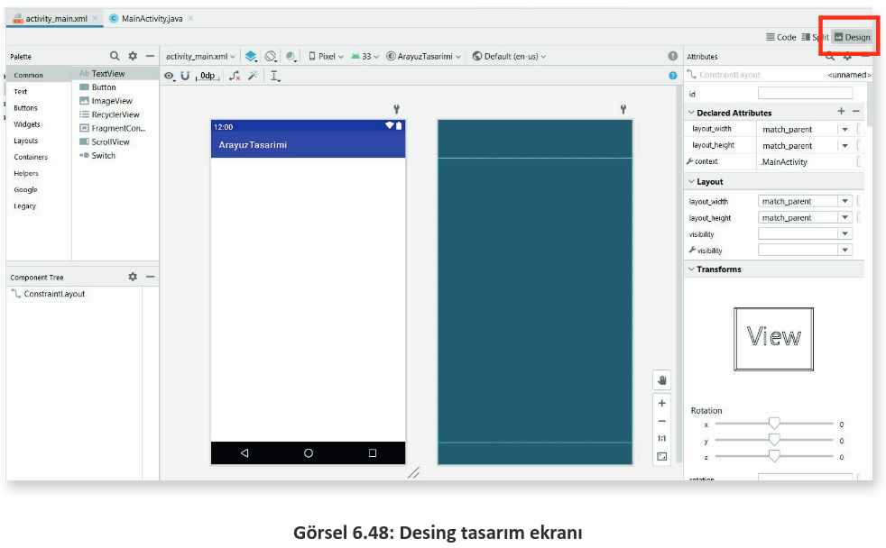
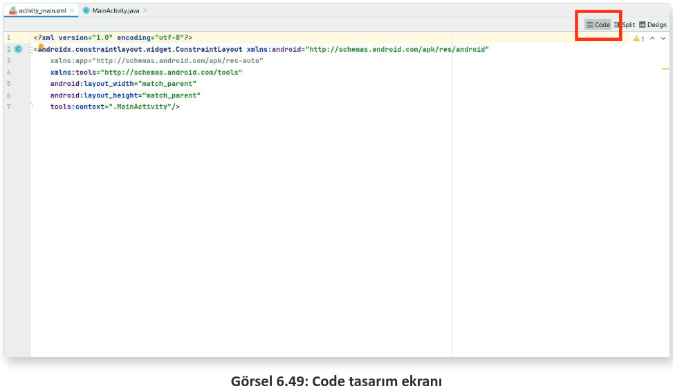
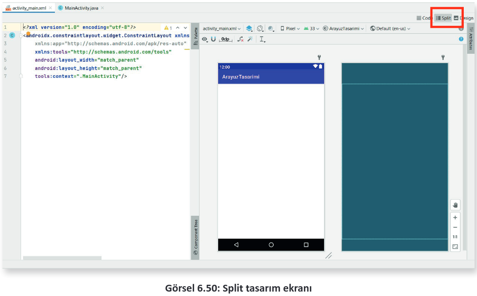
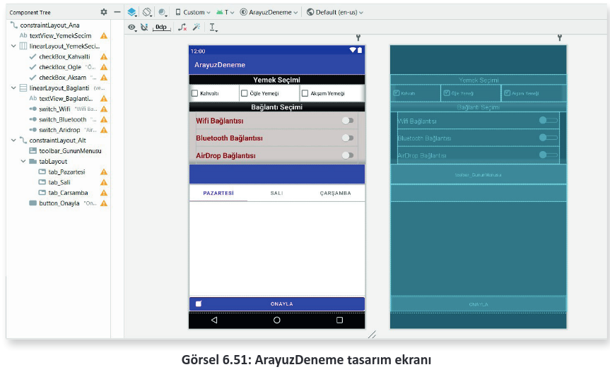
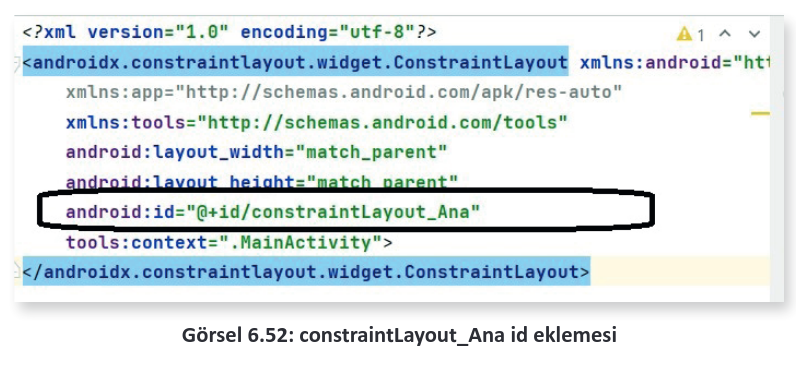
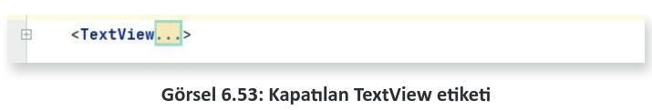

<h1 style="color:#a8d14f">6.4. ARAYÜZ TASARIMI</h1>

Arayüz, kullanıcıların tasarlanan uygulamaları kullandıkları esnada gördükleri veya etkileşime girdikleri ögelerin ve bu ögelerin barındırdığı tasarımların genel ismidir. Mobil uygulama tasarım programı, tasarım esnasında birden fazla arayüz tasarım yolu sunar. Bu tasarım yolları şunlardır:

- Desing

- Code

- Split
  
Desing; şimdiye kadar kullanılan, sürükle bırak mantığı ile çalışan ve ögelerin bire bir görülüp özelliklerinin değiştirilebildiği tasarım ekranıdır (Görsel 6.48). Bu ekran için herhangi bir kod yazılmaz. Eklenen ögelerin özellikleri de ögelerin üzerine tıklanıp seçim yapıldıktan sonra "Attributes" penceresinden düzenlenir.

<div style='display:block;text-align:center'>


</div>

Code tasarım ekranı, Desing ekranın tam tersine hiçbir ögeyi görsel şekilde göstermeden sadece kodlar vasıtası ile eklemeyi ve düzenlemeyi sağlar (Görsel 6.49). Kullanılan kodlar "xml" kodlarıdır. "xml" ile oluşturulan ögeler düzenlenmek istendiğinde ögelerin bloklarının arasına girilerek, özellikleri tek tek kodlanarak yazılır. Genelde Desing ekranı kullanılmış olsa da bazı işlemler Code ekranında daha kolay ve daha hızlı bir biçimde yapılabilir. Bu nedenle Code ekranına da hâkim olunması oldukça önemlidir.

<div style='display:block;text-align:center'>


</div>

Split tasarım ekranı ise kendine ait bir özellik barındırmaz. Bu tasarım ekranı aslında Code tasarım ekranı ile Desing tasarım ekranının birleşiminden meydana gelir (Görsel 6.50). Split ekranı kullanılırken tasarım yapıldığı sırada Code ekranından kod yazılarak eklenen öge aynı anda Desing görüntüsünde de görünür, değiştirilen özellikleri aynı anda Desing ekranına da yansır. Bu durumun tersi de geçerlidir. Desing ekranında oluşturulan ögenin kod hâli, Code tasarım ekranına da eklenir ve Attributes menüsünden değiştirilen özellikleri de Code ekranına yansır.

<div style='display:block;text-align:center'>


</div>

**16. UYGULAMA:** İşlem adımlarına göre Görsel 6.51’de görünen tasarımı Component_tree’deki şekli ile Desing tasarım ekranında hazırlayınız.

<div style='display:block;text-align:center'>


</div>

**1. Adım:** File>New>New Project menüsünden Empty Activity oluşturunuz. İsmini "ArayuzDeneme" şeklinde giriniz. Açılan sayfada activity_main içinde Desing bölümüne geçiniz. Constaint_Layout id’sini **constraintLayout_Ana** olarak ayarlayınız. ConstraintLayout içine öncelikle bir TextView ekleyiniz. Constraint sınırlarını ayarlamak için sağ, sol ve üst köşelerinden çekip ConstraintLayout sınırlarına götürünüz. Bu sayede layout içinde yeri sabitlenir. layout_with özelliğini match_parent yaparak tüm satırı kaplamasını sağlayınız. layout_height özelliğini de wrap_content olarak girerek içerik kadar yükseklik olmasını sağlayınız. Alt köşesine dokunmayınız. Attributes menüsü altında id değerini "<span style='color:#00C800;'>textView_YemekSecim</span>" şeklinde giriniz. Background özelliğini bulunuz ve arka planındaki siyahlık için menüden siyah seçiniz veya değerini "<span style='color:#00C800;'>#090909</span>" şeklinde ayarlayınız. Text özelliğine "<span style="color:#00C800;">Yemek Seçimi</span>" giriniz. TextAligment özelliğini **center** yaparak yazıyı ortalayınız. TextSize özelliğini **20 sp**, TextSytle özelliğini de **bold** ayarlayınız.

**2. Adım:** ConstraintLayout içine Palette menüsünden Layouts seçeneği altından bir LinearLayout(horizontal) ekleyiniz. Bu layout, yan yana ögeler oluşturulmasını sağlar. Id değerine "<span style="color:#00C800;">linearLayout_YemekSecimi</span>" giriniz. layout_width özelliğini "match_parent", layout_height özelliğini de "wrap_content" olarak ayarlayınız. Eklenen LinearLayout, ConstraintLayouta ait bir öge olması nedeniyle sınır değerleri verilerek sabitlenmelidir. LinearLayoutun sağ, sol ve üst bölgelerinde çıkan noktalardan sabitlemeyi oluşturunuz. Sabitlemeyi ConstraintLayout yerine textView_YemekSecim ögesine yapınız. Bu sayede textView_YemekSecim hareket ederse linearLayout da onunla birlikte hareket eder. Linear_Layoutun sağ noktasını textView_YemekSecim’in sağ noktasına, Linear_Layoutun sol noktasını textView_YemekSecim’in sol noktasına, Linear_Layoutun üst noktasını da textView_YemekSecim ögesinin alt noktasına sabitleyiniz.

**3. Adım:** Palette menüsünde yer alan Buttons menüsü altındaki CheckBox ögesini linearLayout_YemekSecimi içine sürükle bırak ile ekleyiniz. Üç defa bu işlemi tekrar ediniz.Id değerlerini "<span style="color:#00C800;">checkBox_Kahvalti</span>", "<span style="color:#00C800;">checkBox_Ogle</span>", "<span style="color:#00C800;">checkBox_Aksam</span>" şeklinde giriniz. layout_width özelliklerini wrap_content, layout_height özelliklerini de wrap_content olarak ayarlayınız. Text özelliklerini de sırasıyla "<span style="color:#00C800;">Kahvaltı</span>", "<span style="color:#00C800;">Öğle Yemeği</span>", "<span style="color:#00C800;">Akşam Yemeği</span>" şeklinde giriniz.

**4. Adım:** linearLayout_YemekSecimi dışına çıkarak constraintLayout_Ana içine bir LinearLayout daha ekleyiniz. Ögelerin alt alta dizilebilmesi için bu LinearLayout vertical özellikli olmalıdır. Id’sini "<span style="color:#00C800;">linearLayout_Baglanti</span>" şeklinde giriniz. layout_widht özelliğine match_parent, layout_height özelliğine de wrap_content giriniz. Background özelliğine gri renk veya "<span style="color:#00C800;">#D6CDCD</span>" kodunu giriniz. constraintLayout_Baglanti içinde yerleşim için linearLayouta tıkladığında çıkan sol, sağ ve üst noktalarını linearLayout_YemekSecimi’nin sol, sağ ve üst noktalarına götürünüz. Bu sayede linearLayout_Baglanti da diğer ögelere bağlanır.

**NOT:**

>Yerleşimlerde problem yaşanırsa Component Tree üzerinden ögeler sürükle bırak ile birbirleri içine taşınabilir.

**5. Adım:** linearLayout_Baglanti içine id’si "<span style="color:#00C800;">textView_BaglantiSecim</span>" olarak bir adet TextView ekleyiniz. layout_widht özelliğine match_parent, layout_height özelliğine de wrap_content giriniz. Background özelliğine siyah renk seçiniz veya "<span style="color:#00C800;">#090909</span>" kodunu giriniz. Text özelliğine "<span style="color:#00C800;">Bağlantı Seçimi</span>" yazınız. Id’si "<span style="color:#00C800;">textView_BaglantiSecim</span>" olarak oluşturunuz. textAligment özelliğini "<span style="color:#00C800;">center</span>" yaparak yazıyı ortalayınız. textColor özelliğini beyaz seçiniz veya "<span style="color:#00C800;">#EFEAEA</span>" kodunu yazınız. textSize özelliğini 20 sp, textSytle özelliğini de bold ayarlayınız.

**6. Adım:** Palette menüsü altındaki Button içinde yer alan Switch ögesinden linearLayout_Baglanti içine üç adet ekleyiniz. Id’lerini "<span style="color:#00C800;">switch_Wifi</span>", "<span style="color:#00C800;">switch_Bluetooth</span>", "<span style="color:#00C800;">switch_Aridrop</span>" şeklinde ayarlayınız. layout_width özelliklerini "<span style="color:#00C800;">match_parent</span>", layout_height özelliğini de <span style="color:#00C800;">wrap_content</span> olarak ayarlayınız. Margin_Left ve Margin_Right özelliklerini "<span style="color:#00C800;">20dp</span>" olarak ayarlayıp iç boşluk veriniz. minHeight özelliğini "48dp" olarak ayarlayınız. Bu özellik ile minimum yazı yüksekliği ayarlanır. Text özelliklerine sırasıyla "<span style="color:#00C800;">Wifi Bağlantısı</span>", "<span style="color:#00C800;">Bluetooth Bağlantısı</span>", "<span style="color:#00C800;">AirDrop Bağlantısı</span>" veriniz. TextColor özelliğini bordo seçiniz veya "<span style="color:#00C800;">#850408</span>" kodunu giriniz. TextSize özelliklerini "<span style="color:#00C800;">20sp</span>" olarak ayarlayınız ve TextStyle özelliğini bold yapınız.

**7. Adım:** linearLayout_Baglanti’dan çıkarak constraintLayout_Ana’ya dönünüz. İçine bir constraint_layout daha ekleyiniz. Id’sini "**constraintLayout_Alt**" olarak giriniz. layout_width özelliğini "**484dp**", layout_height özelliğini "**410dp**" olarak giriniz. Bu ölçü uygun gelmezse emülatörünüze uygun değerleri giriniz. constraintLayout_Alt’ın sabitlemesini sol, sağ ve üst noktalarından linearLayout_Baglanti’ya yapınız.

**8. Adım:** Palette üzerinde Containers menüsü altında yer alan Toolbar ögesini constraintLayout_Alt’ın içine sürükle bırak ile ekleyiniz. Id özelliğini "<span style="color:#00C800;">toolbar_GununMenusu</span>" şeklinde giriniz. layout_width özelliğini "<span style="color:#00C800;">match_parent</span>", layout_height özelliğini "<span style="color:#00C800;">wrap_content</span>" olarak ayarlayınız. Background özelliğini mor renk olarak seçiniz veya "**?attr/colorPrimary**" olarak kodu giriniz. Sınır genişliklerini de constraintLayout_Alt’a sınırlayınız.

**9. Adım:** Palette üzerinde Containers menüsü altında yer alan tabLayout ögesini constraintLayout_Alt’ın içine ekleyiniz. Id değeri "<span style="color:#00C800;">tabLayout</span>", layout_width özelliği "<span style="color:#00C800;">match_parent</span>", layout_height özelliği "<span style="color:#00C800;">wrap_content</span>" olacak şekilde giriniz. Sınırlarını da Toolbar nesnesine göre ayarlayınız. ComponentTree üzerinde, tabLayout altında yer alan ögeler mevcuttur. Bu ögelere tabItem adı verilir. Birinci tabItema tıklayarak text üzerinde yazan "Monday" kısmını "**Pazartesi**" olarak değiştiriniz ve id’sini "**tab_Pazartesi**" yapınız. İkinci tabItema tıklayarak text üzerinde yazan "**Tuesday**" kısmını "**Salı**" olarak değiştiriniz ve id’sini "**tab_Sali**" yapınız. Üçüncü tabItema tıklayarak text üzerinde yazan "**Wednesday**" kısmını "**Çarşamba**" olarak değiştiriniz ve id’sini "**tab_Carsamba**" yapınız.

**NOT:**

>tabLayout, aynı activity içinde farklı işlemler yapılmasını sağlayan bir ögedir.

**10. Adım:** Son olarak yeniden constraintLayout_Alt içine bir adet Button ögesi ekleyiniz. Id özelliğini "<span style="color:#00C800;">button_Onayla</span>", layout_width özelliğini "<span style="color:#00C800;">match_parent</span>", layout_height özelliğini "<span style="color:#00C800;">wrap_content</span>" olacak şekilde ayarlayınız. Text özelliğini "<span style="color:#00C800;">Onayla</span>" yapınız ve icon olarak "<span style="color:#00C800;">checkbox_on_background</span>" iconunu seçiniz. Sağ, sol ve üst sınırlarını da "<span style="color:#00C800;">parent</span>" olarak ayarlayınız.


**<span style="color:#f00;">UYARI:</span>**

>Altıncı uygulama tamamen Desing ortamında yapılmıştır. Bazı durumlarda sadece Code ekranını kullanarak tasarım oluşturmak veya tasarımda yapılması gereken değişiklikler için Code ekranını kullanmak daha uygun olabilir.

**17. UYGULAMA:** İşlem adımlarına göre Görsel 6.51’de gösterilip altıncı uygulamada Desing ortamında yapılan uygulamayı Code ekranında yeniden tasarlayınız.
    
**1. Adım:** File>New>New Project menüsünden Empty Activity oluşturunuz. İsmini "ArayuzDenemeCode" şeklinde giriniz. Açılan sayfada activity_main içinde Code bölümüne geçiniz. ConstraintLayout tagı arasında id yazınız ve çıkan "**android:id**" önerisine Enter tuşu ile basınız. Çıkan "**@+id**" önerisine de Enter tuşu ile basınız. Tırnak işaretlerinin içindeyken "**constraintLayout_Alt**" yazınız (Görsel 6.52).

<div style='display:block;text-align:center'>


</div>

**NOT:**

>"```</androidx.constraintlayout.widget.ConstraintLayout>```" yazan kod constraintLayoutun bitişi anlamına gelir. Bu kodun bir üst satırında kalındığı sürece constraintLayout içinde olunduğunu gösterir.

**NOT:**

>Code bölümünde tasarım oluşturulurken öneriler sıkça kullanılır. Bu nedenle yapılması gereken iş ile ilgili kilit kelimeler unutulmalıdır. Bu kilit kelimeler sayesinde mobil uygulama geliştirme ortamının sunduğu önerilerle kodun bütünlüğü sağlanır.

**2. Adım:** constraintLayout_Ana içine textView oluşturunuz. Bunun için "\<te" yazıldığında çıkan TextView önerisine Enter tuşu ile basınız. Width ve hight özellikleri ekrana geldiğinde width kısmına "**match_parent**", height kısmına "**wrap_content**" yazınız. İşlem bittikten sonra en son satırın sonuna "**>**" işareti veya "**/**" işareti koyunuz. İki işaret de TextView ögenizi bitirdiğinizin işaretidir. Bu işaret öncesi yapacağınız her değişiklik TextViewi etkiler. İşareti alt satıra alınız ve aralığa girerek boş satıra id yazınız. "**android:id**" önerisine Enter tuşu ile basınız. Gelen "**@+id**" önerisinede Enter tuşu ile basınız ve "<span style="color:#00C800;">textView_YemekSecim</span>" yazınız. Boş bir yere tıklayarak "background" yazınız ve öneriye Enter tuşu ile basınız. İçeriğe "<span style="color:#00C800;">#090909</span>" yazarak renk kodunu veriniz. Arka plan siyah olur. Alt satıra inerek "text" yazınız. Gelen öneriye Enter tuşu ile basarak "Yemek Seçimi" yazınız. Tekrar alt satıra inerek "textAlignment" yazınız ve öneriye Enter tuşu ile basarak "<span style="color:#00C800;">center</span>" yazınız. Textcolor yazdıktan sonra öneriyi kabul ederek, "<span style="color:#00C800;">#EFEAEA</span>" kodunu yazıp beyaz yapınız veya beyaz rengi öneriler arasında seçiniz. Code ekranında ConstraintLayout sınırlarının belirlenmesi için right, left, top gibi anahtar kelimeler kullanılıp önerilerle tamamlanır. Parent, aile anlamına gelir. Sınırları verilen öge, içinde bulunduğu constraintLayouta bağlı olduğu için o contraintLayout ailesidir gibi kabul edilir. Bu nedenle yazılan parent kodu, ögenin içinde bulunduğu ConstraintLayoutu işaret eder ve ona göre ögenin sınırlarını belirler. Bir başka ögeye sınırlamak için referans alınması istenen ögenin id’si yazılır. Oluşturulan kodlar şu şekildedir:

```xml
<TextView
    android:id="@+id/textView_YemekSecim"
    android:layout_width="match_parent"
    android:layout_height="wrap_content"
    android:background="#090909"
    android:text="Yemek Seçimi"
    android:textAlignment="center"
    android:textColor="#EFEAEA"
    android:textSize="20sp"
    android:textStyle="bold"
    app:layout_constraintEnd_toEndOf="parent"
    app:layout_constraintStart_toStartOf="parent"
    app:layout_constraintTop_toTopOf="parent" />
```

<div style='display:block;text-align:center'>


</div>

**3. Adım:** Görsel 6.53’te olduğu gibi yazılan "TextView" etiketini kodların karışmaması için sol tarafında bulunan "**–**" işaretine basarak küçültünüz. Oluşan "**+**" işaretine bastığınızda görünüm eski hâline gelir. TextView dışına çıkıp ConstraintLayout içindeyken bir LinearLayout oluşturunuz. Bunun için ikinci adımdaki önerilere göre kodları şu şekilde yazınız:

```xml
<LinearLayout
    android:id="@+id/linearLayout_YemekSecimi"
    android:layout_width="match_parent"
    android:layout_height="wrap_content"
    android:orientation="horizontal"
    app:layout_constraintEnd_toEndOf="@+id/textView_YemekSecim"
    app:layout_constraintTop_toBottomOf="@+id/textView_YemekSecim">
</LinearLayout>
```

**NOT:**

>Ögenin içine girilmesi, kapatma etiketinden "**/>**" öncesine gidilmesi anlamı taşır.

**4. Adım:** Oluşturulan "**textView_YemekSecim**" layoutunun içine giriniz. **Checkbox** oluşturunuz. id’sini "<span style="color:#00C800;">checkBox_Kahvalti</span>", genişlik ve yüksekliğini de "<span style="color:#00C800;">wrap_content</span>" olarak ayarlayınız. Textide "<span style="color:#00C800;">Kahvaltı</span>" şeklinde yazınız.

```xml
<LinearLayout
    android:id="@+id/linearLayout_YemekSecimi"
    android:layout_width="match_parent"
    android:layout_height="wrap_content"
    android:orientation="horizontal"
    app:layout_constraintEnd_toEndOf="@+id/textView_YemekSecim"
    app:layout_constraintTop_toBottomOf="@+id/textView_YemekSecim">
</LinearLayout>
```

**NOT:**

>LinearLayout bir constraintLayout ögesi olduğu için sınırları belirlenir fakat CheckBox bir linearLayout ögesi olduğu için sınır belirtmeye gerek yoktur.

**5. Adım:** Diğer iki CheckBox ögesini de şu kodları yazarak ekleyiniz:

```xml
<LinearLayout
    android:id="@+id/linearLayout_YemekSecimi"
    android:layout_width="match_parent"
    android:layout_height="wrap_content"
    android:orientation="horizontal"
    app:layout_constraintEnd_toEndOf="@+id/textView_YemekSecim"
    app:layout_constraintTop_toBottomOf="@+id/textView_YemekSecim">
    <CheckBox
        android:id="@+id/checkBox_Kahvalti"
        android:layout_width="wrap_content"
        android:layout_height="wrap_content"
        android:layout_weight="1"
        android:text="Kahvaltı" />
    <CheckBox
        android:id="@+id/checkBox_Ogle"
        android:layout_width="wrap_content"
        android:layout_height="wrap_content"
        android:layout_weight="1"
        android:text="Öğle Yemeği" />
    <CheckBox
        android:id="@+id/checkBox_Aksam"
        android:layout_width="wrap_content"
        android:layout_height="wrap_content"
        android:layout_weight="1"
        android:text="Akşam Yemeği" />
</LinearLayout>
```

**6. Adım:** linearLayout_YemekSecimi ögesinin dışına çıkarak constraintLayout_Ana’nın içeriğine giriniz. Bir linearLayout daha ekleyiniz. Bu sefer **orientation (yerleşim)** özelliğinin **vertical (dikey)** olmasını sağlayınız.

```xml
<LinearLayout
    android:id="@+id/linearLayout_Baglanti"
    android:layout_width="match_parent"
    android:layout_height="wrap_content"
    android:background="#D6CDCD"
    android:orientation="vertical"
    app:layout_constraintEnd_toEndOf="@+id/linearLayout_YemekSecimi"
    app:layout_constraintStart_toStartOf="@+id/linearLayout_YemekSecimi"
    app:layout_constraintTop_toBottomOf="@+id/linearLayout_YemekSecimi">
</LinearLayout>
```

**7. Adım:** Oluşturulan layout içine girerek TextView oluşturunuz.

```xml
<TextView
    android:id="@+id/textView_BaglantiSecim"
    android:layout_width="match_parent"
    android:layout_height="wrap_content"
    android:background="#090909"
    android:text="Bağlantı Seçimi"
    android:textAlignment="center"
    android:textColor="#EFEAEA"
    android:textSize="20sp"
    android:textStyle="bold" />
```

**8. Adım:** TextView etiketinin bitişinin alt satırına girerek devam ediniz ve üç adet Switch ögesi oluşturunuz. Oluşturulan ögelerde bir sınır bulunmaz çünkü bunlar constraintLayout ögeleri değil, linearLayouta ait ögelerdir.

```xml
<LinearLayout
    android:id="@+id/linearLayout_Baglanti"
    android:layout_width="match_parent"
    android:layout_height="wrap_content"
    android:background="#D6CDCD"
    android:orientation="vertical"
    app:layout_constraintEnd_toEndOf="@+id/linearLayout_YemekSecimi"
    app:layout_constraintStart_toStartOf="@+id/linearLayout_YemekSecimi"
    app:layout_constraintTop_toBottomOf="@+id/linearLayout_YemekSecimi">
    <TextView
        android:id="@+id/textView_BaglantiSecim"
        android:layout_width="match_parent"
        android:layout_height="wrap_content"
        android:background="#090909"
        android:text="Bağlantı Seçimi"
        android:textAlignment="center"
        android:textColor="#EFEAEA"
        android:textSize="20sp"
        android:textStyle="bold" />
    <Switch
        android:id="@+id/switch_Wifi"
        android:layout_width="match_parent"
        android:layout_height="wrap_content"
        android:layout_marginLeft="20dp"
        android:layout_marginRight="20dp"
        android:minHeight="48dp"
        android:text="Wifi Bağlantısı"
        android:textColor="#850408"
        android:textSize="20sp"
        android:textStyle="bold" />
    <Switch
        android:id="@+id/switch_Bluetooth"
        android:layout_width="match_parent"
        android:layout_height="wrap_content"
        android:layout_marginLeft="20dp"
        android:layout_marginRight="20dp"
        android:minHeight="48dp"
        android:text="Bluetooth Bağlantısı"
        android:textColor="#850408"
        android:textSize="20sp"
        android:textStyle="bold" />
    <Switch
        android:id="@+id/switch_Aridrop"
        android:layout_width="match_parent"
        android:layout_height="wrap_content"
        android:layout_marginLeft="20dp"
        android:layout_marginRight="20dp"
        android:minHeight="48dp"
        android:text="AirDrop Bağlantısı"
        android:textColor="#850408"
        android:textSize="20sp"
        android:textStyle="bold" />
</LinearLayout>
```

**9. Adım:** linearLayout_Baglantı’nın dışına çıkarak constraintLayout_Ana yerleşiminin içine geçiniz. constraintLayout_Ana yerleşiminin içine bir constraintLayout daha oluşturunuz ve id’sine "constraintLayout_Alt" giriniz.

```xml
<androidx.constraintlayout.widget.ConstraintLayout
    android:id="@+id/constraintLayout_Alt"
    app:layout_constraintTop_toBottomOf="@+id/linearLayout_Baglanti"
    app:layout_constraintLeft_toLeftOf="@+id/linearLayout_Baglanti"
    app:layout_constraintRight_toRightOf="@+id/linearLayout_Baglanti"
    android:layout_width="484dp"
    android:layout_height="410dp"
    tools:layout_editor_absoluteX="1dp"
    tools:layout_editor_absoluteY="247dp">
</androidx.constraintlayout.widget.ConstraintLayout>
```

**10.  Adım:** Yeni oluşturulan constraintLayout_Alt içine giriniz ve Toolbar ögesi ekleyiniz. Anahtar kelime kullanarak otomatik tamamlama ve akıllı koddan yardım alınız. "toolbar_GununMenusu" ismini id olarak veriniz.

```xml
<androidx.appcompat.widget.Toolbar
    android:id="@+id/toolbar_GununMenusu"
    android:layout_width="match_parent"
    android:layout_height="wrap_content"
    android:background="?attr/colorPrimary"
    android:minHeight="?attr/actionBarSize"
    android:theme="?attr/actionBarTheme"
    app:layout_constraintEnd_toEndOf="parent"
    app:layout_constraintStart_toStartOf="parent"
    app:layout_constraintTop_toTopOf="parent" />
```

**11. Adım:** constraintLayout_Alt’ın içindeyken "tabLayout" oluşturunuz. tabLayout oluşturduktan sonra sınırlılıklarını, genişlik ve yükseklik değerlerini veriniz. Ayrıca bu tabLayouta ait "tabItem"lerin eklenmesi gerekir. tabLayout içindeyken "\<tabItem" yazınız ve öneriyi Enter tuşu ile onaylayınız. Gelen kod yapısı hata verir ve öncekiler gibi height ve width özelliklerini açmaz. Hatanın üzerindeki resme tıklayarak bunları ekleyiniz veya onları da el ile yazınız.

**NOT:**

>constraintLayout etiketleri arasında direkt olarak yazılan her bir ögenin sınırlarının belirlenmesi zorunludur. Bu nedenle iç içe oluşturulan layoutlarda, kendine ait layout ailesi constraintLayout olan her bir ögede sınır belirtilmelidir.

```xml
<androidx.appcompat.widget.Toolbar
    android:id="@+id/toolbar_GununMenusu"
    android:layout_width="match_parent"
    android:layout_height="wrap_content"
    android:background="?attr/colorPrimary"
    android:minHeight="?attr/actionBarSize"
    android:theme="?attr/actionBarTheme"
    app:layout_constraintEnd_toEndOf="parent"
    app:layout_constraintStart_toStartOf="parent"
    app:layout_constraintTop_toTopOf="parent" />
<com.google.android.material.tabs.TabLayout
        android:id="@+id/tabLayout"
        android:layout_width="match_parent"
        android:layout_height="wrap_content"
        app:layout_constraintEnd_toEndOf="parent"
        app:layout_constraintStart_toStartOf="parent"
        app:layout_constraintTop_toBottomOf="@+id/toolbar_GununMenusu">
    <com.google.android.material.tabs.TabItem
        android:id="@+id/tab_Pazartesi"
        android:layout_width="wrap_content"
        android:layout_height="wrap_content"
        android:text="Pazartesi" />
    <com.google.android.material.tabs.TabItem
        android:id="@+id/tab_Sali"
        android:layout_width="wrap_content"
        android:layout_height="wrap_content"
        android:text="Salı" />
    <com.google.android.material.tabs.TabItem
        android:id="@+id/tab_Carsamba"
        android:layout_width="wrap_content"
        android:layout_height="wrap_content"
        android:text="Çarşamba" />
</com.google.android.material.tabs.TabLayout>
```

**12. Adım:** constraintLayout_Alt içine tekrar girerek bir adet Button oluşturunuz.

```xml
<Button
    android:id="@+id/button_Onayla"
    android:layout_width="match_parent"
    android:layout_height="wrap_content"
    android:text="Onayla"
    app:icon="@android:drawable/checkbox_on_background"
    app:layout_constraintBottom_toBottomOf="parent"
    app:layout_constraintEnd_toEndOf="parent"
    app:layout_constraintStart_toStartOf="parent"
    tools:ignore="TouchTargetSizeCheck" />
```

Yazılan kodlar topluca şu şekilde görülür:

```xml
<androidx.constraintlayout.widget.ConstraintLayout
    android:id="@+id/constraintLayout_Alt"
    app:layout_constraintTop_toBottomOf="@+id/linearLayout_Baglanti"
    app:layout_constraintLeft_toLeftOf="@+id/linearLayout_Baglanti"
    app:layout_constraintRight_toRightOf="@+id/linearLayout_Baglanti"
    android:layout_width="484dp"
    android:layout_height="410dp"
    tools:layout_editor_absoluteX="1dp"
    tools:layout_editor_absoluteY="247dp">
    <androidx.appcompat.widget.Toolbar
        android:id="@+id/toolbar_GununMenusu"
        android:layout_width="match_parent"
        android:layout_height="wrap_content"
        android:background="?attr/colorPrimary"
        android:minHeight="?attr/actionBarSize"
        android:theme="?attr/actionBarTheme"
        app:layout_constraintEnd_toEndOf="parent"
        app:layout_constraintStart_toStartOf="parent"
        app:layout_constraintTop_toTopOf="parent" />
    <com.google.android.material.tabs.TabLayout
        android:id="@+id/tabLayout"
        android:layout_width="match_parent"
        android:layout_height="wrap_content"
        app:layout_constraintEnd_toEndOf="parent"
        app:layout_constraintStart_toStartOf="parent"
        app:layout_constraintTop_toBottomOf="@+id/toolbar_GununMenusu">
        <com.google.android.material.tabs.TabItem
            android:id="@+id/tab_Pazartesi"
            android:layout_width="wrap_content"
            android:layout_height="wrap_content"
            android:text="Pazartesi" />
        <com.google.android.material.tabs.TabItem
            android:id="@+id/tab_Sali"
            android:layout_width="wrap_content"
            android:layout_height="wrap_content"
            android:text="Salı" />
        <com.google.android.material.tabs.TabItem
            android:id="@+id/tab_Carsamba"
            android:layout_width="wrap_content"
            android:layout_height="wrap_content"
            android:text="Çarşamba" />
    </com.google.android.material.tabs.TabLayout>
    <Button
        android:id="@+id/button_Onayla"
        android:layout_width="match_parent"
        android:layout_height="wrap_content"
        android:text="Onayla"
        app:icon="@android:drawable/checkbox_on_background"
        app:layout_constraintBottom_toBottomOf="parent"
        app:layout_constraintEnd_toEndOf="parent"
        app:layout_constraintStart_toStartOf="parent"
        tools:ignore="TouchTargetSizeCheck" />
</androidx.constraintlayout.widget.ConstraintLayout>
```