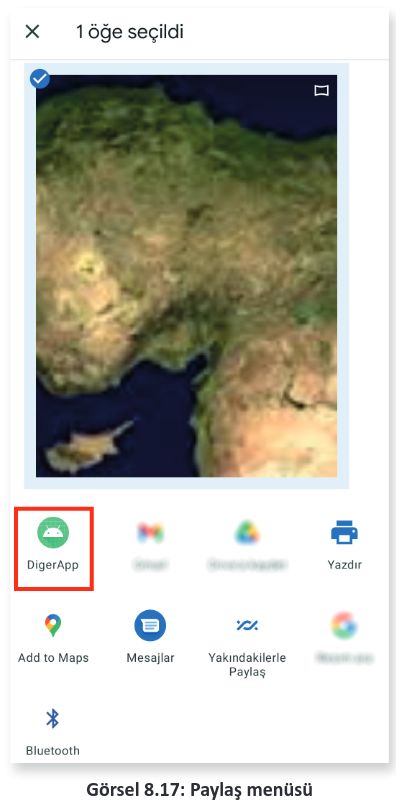
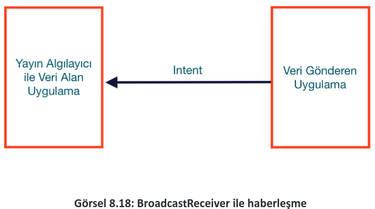
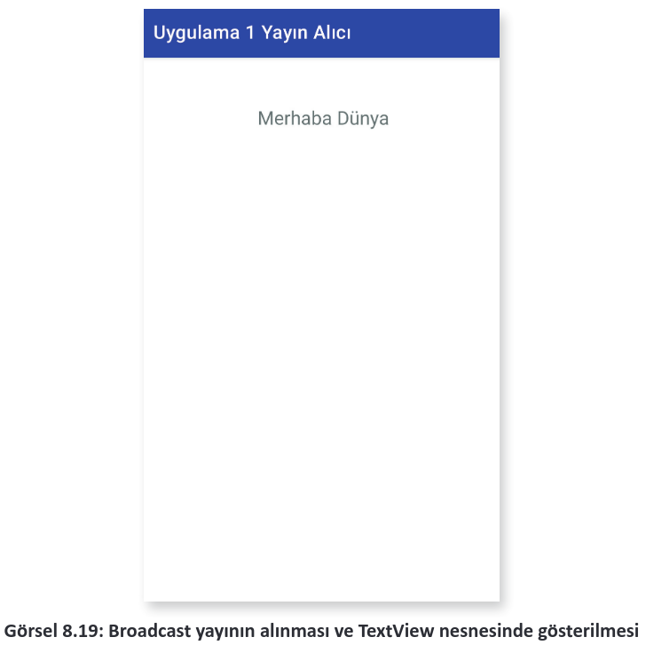

# 8.4. BAŞKA UYGULAMALARLA ETKİLEŞİM KURMAK

<a href="#8.4.1.">8.4.1. Paylaş Butonuyla Diğer Uygulamalardan Veri Almak </a>\
<a href="#8.4.2.">8.4.2. BroadcastReceiver Kullanarak Uygulamaların Arasında Haberleşmek </a>

Implicit Intent kullanımı, mobil uygulama geliştirme ortamında başka uygulamalarla iletişim kurabilmek için kullanılan en kolay yöntemdir. Örneğin internet tarayıcısı ile iletişim şu şekilde kurulur:

```java
Uri adres = Uri.parse("https://meb.gov.tr/");
Intent intent = new Intent(Intent.ACTION_VIEW,adres);
startActivity(intent);
```

Implicit Intent kullanımında seçilen IntentFilter nesnesi önemlidir. Veriler, intenti çalıştıracak IntentFilter nesnesine uygun bir şekilde ayarlanmalıdır.

<h2 id="8.4.1.">8.4.1. Paylaş Butonuyla Diğer Uygulamalardan Veri Almak</h2>

Günümüzde hemen her uygulamada Paylaş butonu bulunur. Paylaş butonu sayesinde bir uygulama kullanılırken beğenilen bir içerik başka bir uygulamaya gönderilebilir. Mobil uygulama geliştirme ortamında IntentFilter nesnesi sayesinde bu özelliğin kullanımı sağlanır. Paylaşılan verinin türüne göre Paylaş menüsünde uygulamalar görüntülenir. Örneğin bir resim paylaşılırsa resim işleyebilen uygulamalar Paylaş menüsünde görünür. PDF paylaşılacağı zaman da bu listede PDF açabilen uygulamalar görünür. Bu özellik, IntentFilter nesneleri ile sağlanır.

Başka uygulamalardan bir resim alabilmek için manifest dosyasında IntentFilter ayarlanır. Resim almak için IntentFilter ayarı şu şekilde yapılır:

```xml
<intent-filter>
    <action android:name="android.intent.action.SEND" />
        <category android:name="android.intent.category.DEFAULT" />
    <data android:mimeType="image/*" />
</intent-filter>
```

Manifest dosyasında yazılan IntentFilter, herhangi bir uygulamada Paylaş butonuna basıldığında uygulamanın Paylaş menüsünde görünmesini sağlar. IntentFilter nesnesinde data olarak istenen dosya tipi ayarlanır. Dosya türü olarak image seçilmişse ve sadece resim paylaşılırsa Paylaş menüsünde uygulamanın adı görünür.

Diğer MIME tipleri şunlardır:
- **Text Dosyaları:** text/plain, text/rtf, text/html, text/json ve tüm türler için text/* kullanılır.
- **Resim Dosyaları:** image/jpg, image/png, image/gif ve tüm resim dosyası türleri için image/* kullanılır.
- **Video Dosyaları:** video/mp4, video/3gp ve tüm video dosya türleri için video/* kullanılır.
- **Özel Dosyalar:** Uygulamaların dosya türleri kayıt altına alınmışsa application/pdf şekilde kullanılır.
  
Uygulamaya dosya gönderilirse şu şekilde alınır:

```java
Intent intent = getIntent();
String action = intent.getAction();
String type = intent.getType();
if (action.equals(Intent.ACTION_SEND) && type != null) {
    doyayiAl(intent);
}
```

**9. UYGULAMA:** İşlem adımlarına göre mobil uygulama ekranına bir ImageView yerleştirerek uygulama arabirimi tasarımı yapınız. Uygulamanın başka bir dosyadan resim dosyası almasını ve gelen resmi göstermesini sağlayınız.

**1. Adım:** Empty Activity şablonunu kullanarak yeni bir proje oluşturunuz. Projenin adını "DigerApp" yapınız.

**2. Adım:** build.gradle dosyasını açarak viewBinding özelliğini aktif ediniz.

**3. Adım:** activity_main.xml dosyasını açarak şu şekilde düzenleyiniz:

```xml
<?xml version="1.0" encoding="utf-8"?>
<androidx.constraintlayout.widget.ConstraintLayout xmlns:android="http://schemas.android.com/apk/res/android"
    xmlns:app="http://schemas.android.com/apk/res-auto"
    xmlns:tools="http://schemas.android.com/tools"
    android:layout_width="match_parent"
    android:layout_height="match_parent"
    tools:context=".MainActivity">
    <ImageView
        android:id="@+id/imageView"
        android:layout_width="0dp"
        android:layout_height="0dp"
        android:layout_marginStart="32dp"
        android:layout_marginTop="32dp"
        android:layout_marginEnd="32dp"
        android:layout_marginBottom="32dp"
        app:layout_constraintBottom_toBottomOf="parent"
        app:layout_constraintEnd_toEndOf="parent"
        app:layout_constraintStart_toStartOf="parent"
        app:layout_constraintTop_toTopOf="parent"
        tools:src="@drawable/ic_baseline_image_24" />
</androidx.constraintlayout.widget.ConstraintLayout>
```

**4. Adım:** Manifest dosyasını açıp activity bölümüne şu şekilde ekleme yapınız:

```xml
<intent-filter>
    <action android:name="android.intent.action.SEND" />
        <category android:name="android.intent.category.DEFAULT" />
    <data android:mimeType="image/*" />
</intent-filter>
```

**5. Adım:** MainActivity.java dosyasını açınız ve viewBinding nesnesi oluşturarak gerekli ayarlamaları yapınız.

**6. Adım:** dosyaAl isimli bir metot oluşturarak metodun kodlarını şu şekilde yazınız:

```java
public void dosyaAl(Intent intent) {
    Uri imageUri = (Uri) intent.getParcelableExtra(Intent.EXTRA_STREAM);
    if (imageUri != null) {
        binding.imageView.setImageURI(imageUri);
    }
}
```

**7. Adım:** MainActivity.java dosyasını açınız ve onCreate metodunun kodlarını şu şekilde yazınız:,

```java
super.onCreate(savedInstanceState);
binding = ActivityMainBinding.inflate(getLayoutInflater());
View view = binding.getRoot();
setContentView(view);
Intent intent = getIntent();
String action = intent.getAction();
String type = intent.getType();
if (action.equals(Intent.ACTION_SEND) && type != null) {
    dosyaAl(intent);
}
```

**8. Adım:** Uygulamayı çalıştırınız. Emülatörde uygulama açıldıktan sonra uygulamayı kapatıp fotoğraf uygulamasını açınız. Emülatörde herhangi bir görsel dosyası yoksa internetten telifsiz bir görsel indiriniz.

**9. Adım:** Fotoğraf uygulamasında bir görsel seçip Paylaş butonuna basınız. Paylaş menüsü açıldıktan sonra listede geliştirilen uygulamayı seçiniz (Görsel 8.17).

<div style='display:block;text-align:center'>


</div>

>**SIRA SİZDE:**
>
>video/* MIME tipini kullanarak uygulamanıza bir video gönderilmesini sağlayınız.
>
>**DEĞERLENDİRME:**
>
>Çalışmanız aşağıda yer alan kontrol listesi kullanılarak değerlendirilecektir. Çalışmanızı yaparken değerlendirme ölçütlerini dikkate alınız.
>
><div style="text-align:center;font-weight:bold;">KONTOL LİSTESİ</div>
>
>| DEĞERLENDİRME ÖLÇÜTLERİ                                      | EVET | HAYIR |
>| ------------------------------------------------------------ | ---- | ----- |
>| 1. Yeni Empty Activity ile proje oluşturdu.                  |
>| 2. Video almak için gerekli kodları yazdı.                   |
>| 3. Manifest dosyasına gerekli IntentFilter ayarlarını girdi. |

<h2 id="8.4.2.">8.4.2. BroadcastReceiver Kullanarak Uygulamaların Arasında Haberleşmek</h2>

BroadcastReceiver sınıfları her ne kadar dinleme işlemi yapsa da veri gönderip almak için de kullanılır. Bir Broadcast sınıfı oluşturulurken parametre olarak Context ve Intent kullanılır. Intent nesneleri veri taşımak için elverişli nesnelerdir. putExtra metotları kullanılarak Intent nesneleri ile veri taşıma Görsel 8.18’deki gibi yapılır.

<div style='display:block;text-align:center'>


</div>

Veri gönderecek uygulama bu işlemleri şu şekilde yapar:

```java
Intent intent = new Intent("com.example.broadcast.app.signal");
Bundle bundle = new Bundle();
bundle.putString("data1","Merhaba");
bundle.putString("data2","Dünya");
intent.putExtras(bundle);
sendBroadcast(intent,"com.example.broadcast.app.permission");
```

Intent nesnesi oluşturulurken kullanılan anahtar, dinlemede kullanılacak özel anahtardır. sendBroadcast metodu ile yayın başlatılır ve bu metot, ikinci bir parametre olarak başka bir anahtar alır. İkinci parametre olarak dinleme yapabilmek için izin anahtarı oluşturulur.

Dinleme yapan uygulama bu işlemleri şu şekilde yapar:

```java
public void onReceive(Context context, Intent intent) {
    Bundle bundle = intent.getExtras();
    Toast.makeText(context, bundle.getString("data1")+"-" +bundle.getString("data2"),Toast.LENGTH_LONG).show();
    MainActivity.binding.textView.setText(bundle.getString("data1") + " " + bundle.getString("data2"))
}
```

Broadcast sınıfında onReceive metodu ile mesaj alınıp Intent nesnesi ile gelen veriler hem Toast mesajı hem de MainActivity dosyasında bir TextView nesnesine yazılır. Alıcı uygulamanın manifest dosyası da şu şekildedir:

```xml
<uses-permission android:name="com.example.broadcast.app.permission"/>
<receiver android:name=".BroadCasting" android:exported="true">
    <intent-filter>
        <action android:name="com.example.broadcast.app.signal"/>
    </intent-filter>
</receiver>
```

**10. UYGULAMA:** İşlem adımlarına göre alıcı ve verici şeklinde iki tane uygulama oluşturarak bir uygulamadan diğer uygulamaya veri gönderen uygulamaları yazınız.

**1. Adım:** Empty Activity şablonunu kullanarak yeni bir proje oluşturunuz. Projenin adını "Uygulama01" yapınız.

**2. Adım:** build.gradle dosyasını açarak viewBinding özelliğini aktif ediniz.

**3. Adım:** activity_main.xml dosyasını şu şekilde düzenleyiniz:

```xml
<?xml version="1.0" encoding="utf-8"?>
<androidx.constraintlayout.widget.ConstraintLayout xmlns:android="http://schemas.android.com/apk/res/android"
    xmlns:app="http://schemas.android.com/apk/res-auto"
    xmlns:tools="http://schemas.android.com/tools"
    android:layout_width="match_parent"
    android:layout_height="match_parent"
    tools:context=".MainActivity">
    <TextView
        android:id="@+id/textView"
        android:layout_width="wrap_content"
        android:layout_height="wrap_content"
        android:textSize="20sp"
        app:layout_constraintBottom_toBottomOf="parent"
        app:layout_constraintHorizontal_bias="0.498"
        app:layout_constraintLeft_toLeftOf="parent"
        app:layout_constraintRight_toRightOf="parent"
        app:layout_constraintTop_toTopOf="parent"
        app:layout_constraintVertical_bias="0.072" />
</androidx.constraintlayout.widget.ConstraintLayout>
```

**4. Adım:** MainActivity.java dosyasını açınız ve viewBinding nesnesi oluşturup gerekli ayarlamaları yapınız.

**5. Adım:** binding nesnesini static olarak şu şekilde tanımlayınız:

```java
static ActivityMainBinding binding;
```

**6. Adım:** Broadcasting.java dosyası oluşturunuz ve Broadcasting sınıfını BroadcastReceiver sınıfından türetiniz.

**7. Adım:** Manifest dosyasına şu bilgileri giriniz:

```xml
<uses-permission android:name="com.example.broadcast.app.permission"/>
    <receiver android:name=".BroadCasting" android:exported="true">
    <intent-filter>
        <action android:name="com.example.broadcast.app.signal"/>
    </intent-filter>
</receiver>
```

**8. Adım:** Uygulamayı çalıştırınız.

**9. Adım:** Yeni bir proje daha oluşturunuz. Empty Activity seçip uygulamanın adını "Uygulama02" yapınız.

**10. Adım:** build.gradle dosyasını açarak viewBinding özelliğini aktif ediniz.

**11. Adım:** activity_main.xml dosyasını şu şekilde düzenleyiniz:

```xml
<?xml version=»1.0» encoding="utf-8"?>
<androidx.constraintlayout.widget.ConstraintLayout xmlns:android="http://schemas.android.com/apk/res/android"
    xmlns:app="http://schemas.android.com/apk/res-auto"
    xmlns:tools="http://schemas.android.com/tools"
    android:layout_width="match_parent"
    android:layout_height="match_parent"
    tools:context=".MainActivity">
    <Button
        android:id="@+id/button"
        android:layout_width="wrap_content"
        android:layout_height="wrap_content"
        android:layout_marginStart="16dp"
        android:layout_marginTop="16dp"
        android:layout_marginEnd="16dp"
        android:layout_marginBottom="16dp"
        android:text="Mesaj Gönder"
        app:layout_constraintBottom_toBottomOf="parent"
        app:layout_constraintEnd_toEndOf="parent"
        app:layout_constraintStart_toStartOf="parent"
        app:layout_constraintTop_toTopOf="parent" />
</androidx.constraintlayout.widget.ConstraintLayout>
```

**12. Adım:** MainActivity.java dosyasını açınız ve viewBinding nesnesi oluşturup gerekli ayarlamaları yapınız.

**14. Adım:** Button nesnesi için bir onClickListener tanımlayınız.

**15. Adım:** onClick olayına şu kodları yazınız:

```java
Intent intent = new Intent("com.example.broadcast.app.signal");
Bundle bundle = new Bundle();
bundle.putString("data1","Merhaba");
bundle.putString("data2","Dünya");
intent.putExtras(bundle);
sendBroadcast(intent,"com.example.broadcast.app.permission");
```

**16. Adım:** Manifest dosyasını açıp şu bilgileri giriniz:

```xml
<permission android:name="com.example.broadcast.app.permission" android:protectionLevel="signature"/>
```

**17. Adım:** Uygulamayı çalıştırınız. Uygulama01’in açık olduğundan emin olunuz.

**18. Adım:** Uygulama02 açıkken butona basınız. Hem bir Toast mesajı ekranda görülür hem de Görsel 8.19’daki gibi Intent ile gönderilen veri, Uygulama01'de yer alan TextView nesnesinde gösterilir.

 
<div style='display:block;text-align:center'>


</div>

