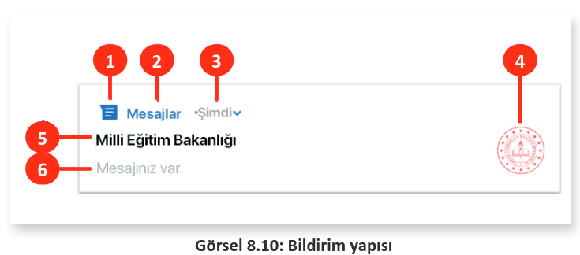
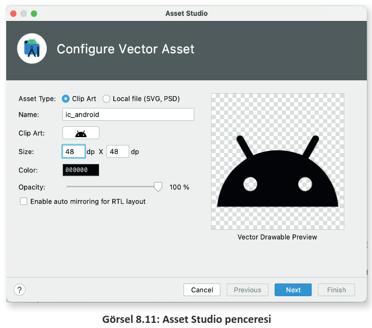
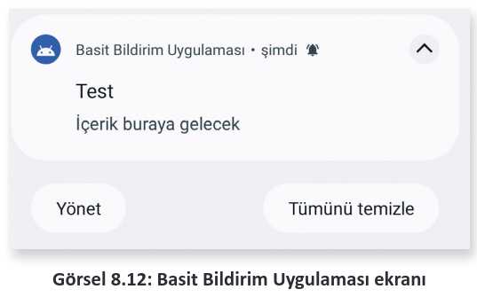
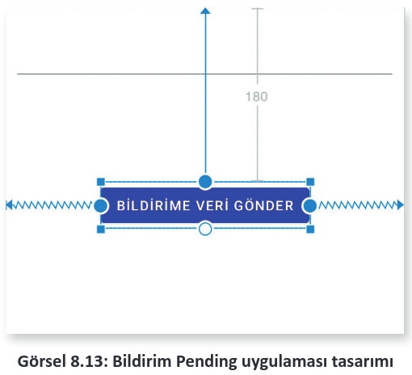
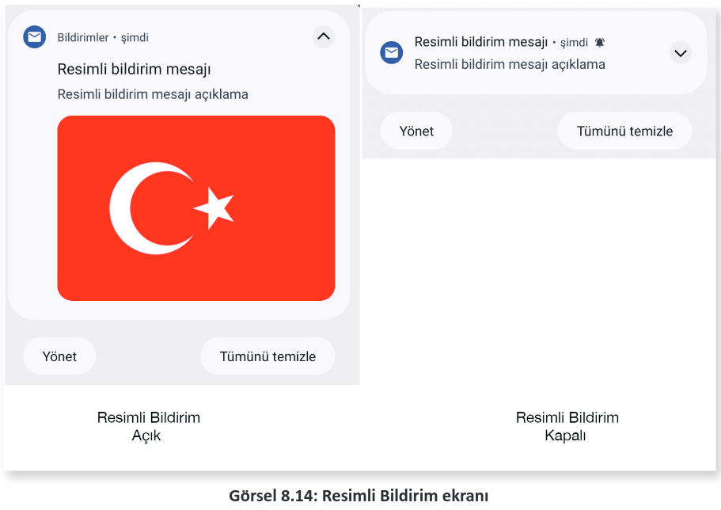
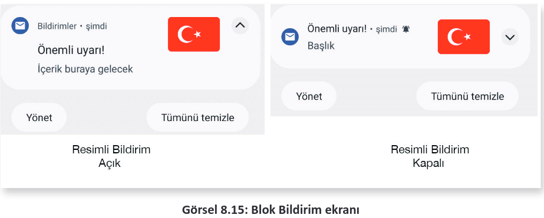
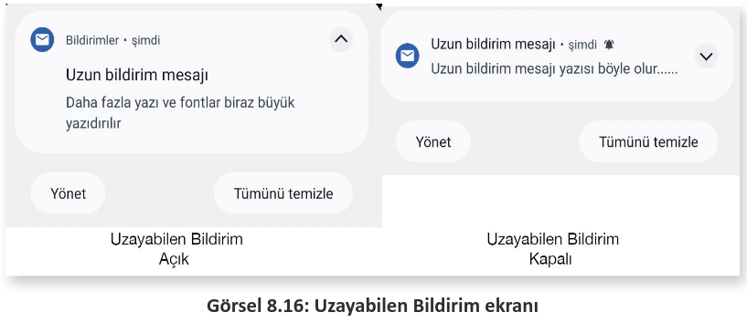

# 8.3. BİLDİRİMLERLE ÇALIŞMAK
- <a href="#8.3.1.">8.3.1. Bildirimlerden Veri Almak</a>

Bildirimler, kullanıcı ile etkileşime geçmenin en kısa yoludur. Bildirimler, kullanıcılar açısından çok büyük bir kolaylık sağladığı için hemen her uygulamada kullanılır. Kullanıcı, uygulamayı açmadan da uygulamadan bildirimler alabilir.

Bildirim ekranları mobil uygulama geliştirme ortamında NotificationManager sınıfıyla kontrol edilir. Notification nesnesiyle özellikleri belirlenen bildirim ekranı NotificationManager ile gösterilir. Android API 26 ve üzeri sürümlerde NotificationChannel kullanmak gereklidir. Channel ile bildirimin önem derecesi belirlenir. API 26 ile birlikte bildirim ekranlarının yönetimi kullanıcılara verildiği için API 26 ve üstü sürümlerde NotificationChannel kullanılmalıdır. Kullanıcı istemediği bildirimleri kanal adı seçerek kapatabilir. Görsel 8.10’da standart bir bildirim ekranının bölümleri verilmiştir.

<div style='display:block;text-align:center'>


</div>


**1:** Bildirim ekranının küçük simgesidir. Bir bildirim ekranı tanımlanırken mutlaka belirtilmelidir. Notification nesnesinde setSmallIcon icon ile ayarlanır. Küçük simge, bildirim geldiğinde açılmasa bile ekranın en üstünde sadece simge olarak görünür.

**2:** Bildirimi gönderen uygulamanın adıdır.

**3:** Zaman damgası etiketi bildirimin ne zaman çıktığını gösterir. Notification nesnesinin setWhen metodu ile kapatılabilir veya setShowWhen ile gizlenebilir.

**4:** Bildirim ekranının büyük simgesidir. İsteğe bağlı olarak ayarlanmayabilir. Notification nesnesinin setLargeIcon metodu ile ayarlanır.

**5:** Bildirimin başlığıdır. İsteğe bağlı olarak kullanılmayabilir. Notification nesnesinin setContentTitle metodu ile ayarlanır.

**6:** Bildirimin mesaj kısmıdır. İsteğe bağlı olarak kullanılmayabilir. Notification nesnesinin setContentText metodu ile ayarlanır.

En basit hâli ile bir bildirim şu şekilde yapılır:

```java
KANAL_ID="Bildirim App";
if (Build.VERSION.SDK_INT >= Build.VERSION_CODES.O) {
    String kanal = KANAL_ID;
    String aciklama = "Bildirim yapılması sağlanacak";
    int bildirimOnemi = NotificationManager.IMPORTANCE_DEFAULT;
    NotificationChannel BildirimKanali = new NotificationChannel(KANAL_ID, kanal, bildirimOnemi);
    BildirimKanali.setDescription(aciklama);
    NotificationManager notificationManager = getSystemService(NotificationManager.class);
    notificationManager.createNotificationChannel(BildirimKanali);
}
NotificationCompat.Builder builder = new NotificationCompat
    .Builder(MainActivity.this, KANAL_ID)
    .setSmallIcon(R.drawable.ic_android)
    .setContentTitle("Teset")
    .setContentText("İçerik buraya gelecek")
    .setPriority(NotificationCompat.PRIORITY_DEFAULT);
```

```java
NotificationManagerCompat notificationManager = NotificationManagerCompat.from(MainActivity.this);
notificationManager.notify(1000,builder.build());
```

Öncelikle API 26 ve üstü kullanılıp kullanılmadığı belirlenir. Kullanılan sistem, API 26 ve üstü ise Channel nesnesi kullanılmalıdır. Channel nesnesi ile bildirimin önem seviyesi belirtilir. Uygulama, emülatörde veya cihazda kullanılıyorsa ayarlarda Bildirim bölümü açılarak bildirim yapılan uygulamalar incelenebilir. Channel nesnesi ile verilen bilgiler burada görünür. Channel nesnesi, NotificationManager sınıfı ile kaydedilir. Kullanılan işletim sistemi API 26’dan önceki bir sürüm ise bir Channel nesnesi oluşmaz ve uygulama, if blokunun dışından devam eder.

Bildirim mesajını oluşturmak için NotificationCompat veya Notification nesneleri kullanılır. NotificationCompat, tüm Android sürümlerine uyumlu bildirim oluşturur. Notification nesnesi ise en son Android sürümü ile gelir. Builder nesnesi ile bildirim mesajı oluşturulur. Builder nesnesinin setSmallIcon özelliği ile küçük simge, setContentTitle özelliği ile mesaj başlığı ve setContentText özelliği ile mesajın içeriği hazırlanır. Builder nesnesi ile bildirimin önem derecesi ayarlanabilir ancak Channel nesnesi tanımlanmışsa öncelik değerinin bir önemi yoktur. Bildirim, NotificationManager sınıfının notify metodu ile gösterilir. notify metodunun ilk parametresi sayısal bir değerdir. Bu değer, bildirimin id numarasıdır. Bildirim yok edilecekse bu numara kullanılır. Bir bildirim şu şekilde yok edilir:

```java
NotificationManager.cancel(1000);
```

**6. UYGULAMA:** İşlem adımlarına göre mobil uygulama ekranına bir buton ekleyip uygulama oluşturunuz. Butona basıldığında basit bir bildirim yayınlayacak kodları yazınız.

**1. Adım:** Empty Activity seçerek yeni bir proje oluşturunuz. Projenin adını "BildirimBasit" veriniz.

**2. Adım:** activity_main.xml dosyasını açarak ekrana sadece bir tane Button yerleştiriniz. Button nesnesinin id bilgisini btnGonder olarak değiştiriniz.

**3. Adım:** app>values>strings.xml dosyasını açıp uygulamanın adını "Basit Bildirim Uygulaması" yapınız.

**4. Adım:** gradle.build dosyasını açarak viewBinding özelliğini aktif ediniz.

**5. Adım:** drawable klasörüne sağ tıklayıp menüden New>Vector Assets seçeneğini seçiniz.

**6. Adım:** Açılan pencereden Android simgesi seçiliyken diğer ayarları Görsel 8.11’deki gibi yapınız.

**7. Adım:** MainActivity.java dosyasını açınız. viewBinding nesnesi tanımlayıp gerekli ayarlamaları yapınız.

<div style='display:block;text-align:center'>


</div>

**8. Adım:** btnGonder Buttonu için onClickListener oluşturup onClick olayına şu kodları yazınız:

```java
if (Build.VERSION.SDK_INT >= Build.VERSION_CODES.O) {
    String kanal = KANAL_ID;
    String aciklama = "Bildirim yapılması sağlanacak";
    int bildirimOnemi = NotificationManager.IMPORTANCE_DEFAULT;
    NotificationChannel BildirimKanali = new NotificationChannel(KANAL_ID, kanal, bildirimOnemi);
    BildirimKanali.setDescription(aciklama);
    NotificationManager notificationManager = getSystemService(NotificationManager.class);
    notificationManager.createNotificationChannel(BildirimKanali);
}
NotificationCompat.Builder builder = new NotificationCompat.Builder(MainActivity.this, KANAL_ID)
    .setSmallIcon(R.drawable.ic_android)
    .setContentTitle("Teset")
    .setContentText("İçerik buraya gelecek")
    .setPriority(NotificationCompat.PRIORITY_DEFAULT);
NotificationManagerCompat notificationManager = NotificationManagerCompat.from(MainActivity.this);
notificationManager.notify(1000,builder.build());
```

**9. Adım:** Uygulamayı çalıştırıp butona bastığınızda bildirim ekranının Görsel 8.12’deki gibi göründüğünü kontrol ediniz.

<div style='display:block;text-align:center'>


</div>

<h2 id ="8.3.1.">8.3.1. Bildirimlerden Veri Almak</h2>

Bildirimlerden veriler intent nesneleri kullanılarak alınabilir. Bu nesneler genellikle aktiviteler arasında dolaşmak veya servisleri başlatmak için kullanılır. Android sistemi, işi biter bitmez intent nesnelerini yok eder. Hemen yok olan bir nesneden veri almak mümkün değildir. PendingIntent nesneleri, intent nesnelerinin aksine hemen yok olmaz. Bu nesneler, kullanıcı bir işlem yapıncaya kadar bekler. Bundan dolayı bildirim mesajlarında bu nesneler kullanılır. Bildirim mesajı, kullanıcıdan bir eylem gelinceye kadar bildirim ekranında kalır.

PendingIntent ve intent nesneleri şu şekilde tanımlanır:

```java
Intent intent = new Intent(MainActivity.this, MainActivity.class);
intent.putExtra("mesaj","Bu mesaj bildirim ile geldi");
intent.setFlags(Intent.FLAG_ACTIVITY_CLEAR_TASK);
PendingIntent pendingIntent = PendingIntent.getActivity(MainActivity.this,0, intent, PendingIntent.FLAG_MUTABLE);
```

Intent nesnesine bir mesaj eklenir ve intent nesnesi, PendingIntent nesnesine parametre olarak verilir. Asıl veriyi taşıyan intent nesnesidir. PendingIntent, Notification nesnesine şu şekilde eklenir:

```java
NotificationCompat.Builder builder = new NotificationCompat.Builder(MainActivity.this,KANAL_ID)
    .setSmallIcon(R.drawable.ic_android)
    .setContentTitle("Bildirimler Pending")
    .setContentText("Bu bildirimden ana activity'ye mesaj taşıyacağız.")
    .setPriority(NotificationCompat.PRIORITY_DEFAULT)
    .setContentIntent(pendingIntent)
    .setAutoCancel(true);
```

PendingIntent nesnesi Notification.Builder sınıfına setContentIntent metodu ile eklenir. PendingIntent kullanıldığı için Builder sınıfında setAutoCancel metodu ile bildirim mesajının otomatik kapanması sağlanır. Kullanıcı, bildirimi okuyunca mesaj kapanır. Intent ile gelen veri hedef olarak belirtilen aktiviteye ktarılır. Bu sayede kullanıcının mesajı okuyup okumadığı anlaşılabilir. setCancelAuto, true olarak ayarlanmazsa bildirim mesajı kod ile kapatılır.

**7. UYGULAMA:** İşlem adımlarına göre mobil uygulama ekranına bir EditText ve Button nesnesi ekleyerek bildirim alanına gizli bir mesaj gönderiniz. Kullanıcı, mesajı tıklayınca mesajdaki gizli bilgiyi yakalayan uygulamayı yazınız.

**1. Adım:** Empty Activity seçerek yeni bir proje oluşturunuz. Projenin adını "BildirimPending" veriniz.

**2. Adım:** activity_main.xml dosyasını açarak ekrana sadece bir EditText ve Button yerleştiriniz (Görsel 8.13).

<div style='display:block;text-align:center'>


</div>

**3. Adım:** EditText nesnesinin id bilgisini "editMesaj" olarak ayarlayınız. Button nesnesinin id bilgisini "button" olarak ayarlayınız.

**4. Adım:** gradle.build dosyasını açarak viewBinding özelliğini aktif ediniz.

**5. Adım:** drawable klasörüne sağ tıklayıp menüden New>Vector Assets seçeneğini seçiniz.

**6. Adım:** Açılan pencereden Android simgesini seçip diğer ayarları Görsel 8.11’deki gibi yapınız.

**7. Adım:** MainActivity.java dosyasını açınız. viewBinding nesnesi tanımlayıp gerekli ayarlamaları yapınız.

**8. Adım:** Button nesnesine bir onClickListener tanımlayınız.

**9. Adım:** Button nesnesinin onClick olayını şu şekilde yazınız:

```java
String KANAL_ID ="BildirimPending App";
if (Build.VERSION.SDK_INT >= Build.VERSION_CODES.O) {
    String kanal = KANAL_ID;
    String aciklama = "Bildirim yapılması sağlanacak";
    int bildirimOnemi = NotificationManager.IMPORTANCE_DEFAULT;
    NotificationChannel BildirimKanali = new NotificationChannel(KANAL_ID, kanal, bildirimOnemi);
    BildirimKanali.setDescription(aciklama);
    NotificationManager notificationManager = getSystemService(NotificationManager.class);
    notificationManager.createNotificationChannel(BildirimKanali);
}
Intent intent = new Intent(MainActivity.this, MainActivity.class);
intent.putExtra("mesaj","Bu mesaj bildirim ile geldi");
intent.setFlags(Intent.FLAG_ACTIVITY_CLEAR_TASK);
PendingIntent pendingIntent = PendingIntent.getActivity(MainActivity.this, 0, intent, PendingIntent.FLAG_MUTABLE);
NotificationCompat.Builder builder = new NotificationCompat.Builder(MainActivity.this, KANAL_ID)
    .setSmallIcon(R.drawable.ic_android)
    .setContentTitle("Bildirimler Pending")
    .setContentText("Bu bildirimden ana activity'ye mesaj taşıyacağız.")
    .setPriority(NotificationCompat.PRIORITY_DEFAULT)
    .setContentIntent(pendingIntent)
    .setAutoCancel(true);
NotificationManagerCompat notificationManager = NotificationManagerCompat.from(MainActivity.this);
notificationManager.notify(1000,builder.build());
```

**10. Adım:** MainActivity sınıfında **gelenVeri** isimli bir metodu şu şekilde oluşturunuz:

```java
private void gelenVeri() {
    Intent intent = getIntent();
    String mesaj = intent.getStringExtra("mesaj");
    if(mesaj != null){
        binding.editMesaj.setText(mesaj);
    }
}
```

**11. Adım:** gelenVeri metodunu MainActivity sınıfının onCreate metodunda şu şekilde yazınız:

```java
protected void onCreate(Bundle savedInstanceState) {
    super.onCreate(savedInstanceState);
    binding = ActivityMainBinding.inflate(getLayoutInflater());
    View view = binding.getRoot();
    setContentView(view);
    gelenVeri();
```

**12. Adım:** Uygulamayı çalıştırınız ve bildirime tıkladığınızda Intent içine yazılan mesajın editTextte görünüp görünmediğini kontrol ediniz.

**8. UYGULAMA:** İşlem adımlarına göre mobil uygulama ekranında çeşitli bildirimler göstermeyi sağlayınız.

**1. Adım:** Empty Activity şablonunu kullanarak yeni bir proje oluşturunuz. Projenin adını "Bildirimler" yapınız.

**2. Adım:** app>drawable klasörüne sağ tıklayıp New>Vector Asset seçeneğini seçiniz.

**3. Adım:** Asset Studio penceresinde bir mail simgesi bulup ic_base_email ismiyle kaydediniz.

**4. Adım:** build.gradle dosyasını açarak viewBinding özelliğini aktif ediniz.

**5. Adım:** activity_main.xml dosyasını açarak ekrana bir tane buton yerleştiriniz.

**6. Adım:** Butonun id bilgisini button olarak değiştiriniz.

**7. Adım:** MainActivity.java dosyasını açınız ve setKanal() isimli bir metot oluşturup şu şekilde kodlarını yazınız:

```java
private void Kanal () {
    String KANAL_ID="Bildirimler";
    if (Build.VERSION.SDK_INT >= Build.VERSION_CODES.O) {
        String kanal = KANAL_ID;
        String aciklama = "Bildirim yapılması sağlanacak";
        int bildirimOnemi = NotificationManager.IMPORTANCE_DEFAULT;
        NotificationChannel BildirimKanali = new NotificationChannel(KANAL_ID, kanal, bildirimOnemi);
        BildirimKanali.setDescription(aciklama);
        NotificationManager notificationManager = getSystemService(NotificationManager.class);
        notificationManager.createNotificationChannel(BildirimKanali);
    }
}
```

**8. Adım:** MainActivity.java dosyasını açınız ve viewBinding nesnesi tanımlayıp gerekli ayarlamaları yapınız.

**9. Adım:** MainActivity.java dosyasındaki onCreate olayında setKanal metodunu şu şekilde yazınız:

```java
Kanal();
```

**10. Adım:** Telif hakkı olmayan bir bayrak görselini drawable klasörüne kopyalayınız. Bitmap nesnesi oluştururken görsel adına dikkat ediniz.

**11. Adım:** Button için onClickListener yazınız.

**12. Adım:** onClick olayını şu şekilde yazınız:

```java
String KANAL_ID="Bildirimler";
Notification notification;
Bitmap bitmap = BitmapFactory.decodeResource(getResources(), R.drawable.tr);
notification = new NotificationCompat.Builder(MainActivity.this, KANAL_ID)
    .setSmallIcon(R.drawable.ic_baseline_email)
    .setContentTitle("Resimli bildirim mesajı")
    .setContentText("Resimli bildirim mesajı açıklama")
    .setStyle(new NotificationCompat.BigPictureStyle()
    .bigPicture(bitmap))
    .build();
NotificationManagerCompat notificationManager = NotificationManagerCompat.from(this);
notificationManager.notify(1, notification);
```

**13. Adım:** Uygulamayı çalıştırıp butona basınız. Uygulamanın Görsel 8.14’teki gibi görünüp görünmediğini kontrol ediniz.

<div style='display:block;text-align:center'>


</div>

**14. Adım:** Button nesnesinin onClick olayını şu şekilde değiştiriniz:

```java
String KANAL_ID = "Bildirimler";
Notification notification;
Bitmap bitmap = BitmapFactory.decodeResource(getResources(), R.drawable.tr);
NotificationCompat.Builder builder = new NotificationCompat.Builder(this, KANAL_ID)
    .setSmallIcon(R.drawable.ic_baseline_email)
    .setContentTitle("Uzun bildirim mesajı")
    .setContentText("Uzun bildirim mesajı yazısı böyle olur......")
    .setStyle(new NotificationCompat.BigTextStyle()
    .bigText("Daha fazla yazı ve fontlar biraz büyük yazıdırılır"))
    .setPriority(NotificationCompat.PRIORITY_DEFAULT);
NotificationManagerCompat notificationManager = NotificationManagerCompat.from(this);
notificationManager.notify(1, notification);
```

**15. Adım:** Uygulamayı çalıştırıp Button nesnesine basınız. Uygulamanın Görsel 8.15’teki gibi görünüp görünmediğini kontrol ediniz.

<div style='display:block;text-align:center'>


</div>

**16. Adım:** Button nesnesinin onClick olayını şu şekilde değiştiriniz:

```java
String KANAL_ID = "Bildirimler";
NotificationCompat.Builder builder = new NotificationCompat.Builder(this, KANAL_ID)
    .setSmallIcon(R.drawable.ic_baseline_email)
    .setContentTitle("Uzun bildirim mesajı")
    .setContentText("Uzun bildirim mesajı yazısı böyle olur......")
    .setStyle(new NotificationCompat.BigTextStyle()
    .bigText("Daha fazla yazı ve fontlar biraz büyük yazıdırılır"))
    .setPriority(NotificationCompat.PRIORITY_DEFAULT);
NotificationManagerCompat notificationManager = NotificationManagerCompat.from(this);
notificationManager.notify(1, notification.build());
```

**17. Adım:** Uygulamayı çalıştırıp Button nesnesine basınız. Uygulamanın Görsel 8.16’daki gibi görünüp görünmediğini kontrol ediniz.

<div style='display:block;text-align:center'>


</div>

>**SIRA SİZDE:**
>
>Yeni bir uygulama geliştirerek uygulamaya üç Button yerleştiriniz. Her Buttonda farklı bir bildirim gösteriniz.
>
>**DEĞERLENDİRME:**
>
>Çalışmanız aşağıda yer alan kontrol listesi kullanılarak değerlendirilecektir. Çalışmanızı yaparken değerlendirme ölçütlerini dikkate alınız.
>
><div style="text-align:center;font-weight:bold;">KONTOL LİSTESİ</div>
>
>| DEĞERLENDİRME ÖLÇÜTLERİ                            | EVET | HAYIR |
>| -------------------------------------------------- | ---- | ----- |
>| 1. Yeni Empty Activity ile proje oluşturdu.        |
>| 2. Tasarım ekranına üç tane Button yerleştirdi.    |
>| 3. Buttonlar için ayrı ayrı onClickListener yazdı. |