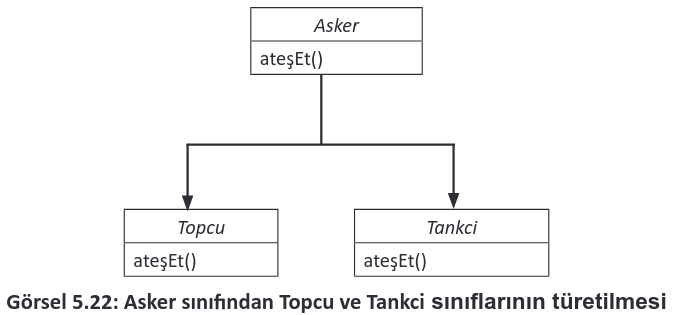
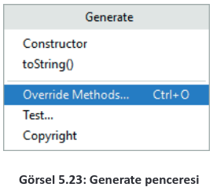
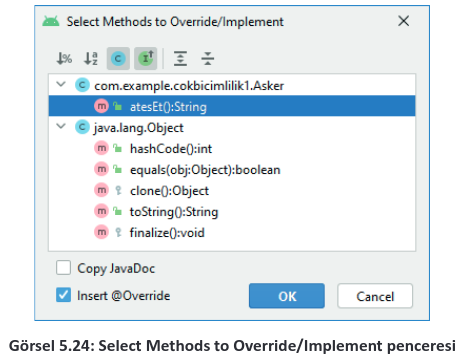

<h1 style="color:#ff5432">5.5. ÇOKBİÇİMLİLİK (POLYMORPHISM)</h1>

- <a href="#5.5.1.">5.5.1. Çokbiçimlilik Yapısı</a>
  
Çokbiçimlilik, yapılacak tek bir eylemin farklı şekillerde gerçekleştirilmesini sağlayan özelliklerden biridir. Bir başka deyişle bir nesnenin birden farklı nesne gibi davranmasıdır. Örneğin orduda birçok sınıf bulunur. Bu sınıflardan bazıları topçular ve tankçılardır. Topçular, top atarak savaşan ve topun başından ayrılmayan askerlerdir. Tankçılar ise tank kullanarak savaşan askerlerdir. Topçu ve tankçı askerler, ateş et emri aldıklarında farklı davranışlar sergiler. Topçular, top ile ateş ederken tankçılar, tank ile ateş eder. Görsel 5.22’de asker sınıfından türetilmiş topçu ve tankçı sınıfları verilmiştir. Çokbiçimliliğe ait bir kavram olan metot geçersiz kılma (method overriding) ile kalıtım yoluyla türemiş sınıflarda aynı isimli metotlar farklı komutlar çalıştırabilir. Askerler, topçular ve tankçılar aynı emri alırlar fakat farklı davranışlar sergiler.

<div style="display:block;text-align:center">


</div>

<h2 id = "5.5.1." style="color:#ff5432">5.5.1. Çokbiçimlilik Yapısı</h2>
Üst sınıftan bir alt sınıf türetilirken metotların geçersiz kılınması için @Override anahtar kelimesi kullanılmalıdır.

<span style="font-weight:bold; padding-top:1px; padding-bottom:1px; padding-left:8px; padding-right:8px; background-color:#ffdcce;">ÖRNEK</span>

<table>
  <thead>
    <tr>
      <th>ÜST SINIF</th>
      <th>ALT SINIF</th>
    </tr>
  </thead>
  <tbody>
    <tr>
      <td> <pre>
                    <code class="language-java">public class Asker {
    public String atesEt(){
        return "Asker eteş etti";
    }
}
                    </code>
                </pre></td>
      <td><pre>
                    <code class="language-java">public class Tankci extends Asker{
    @Override
    public String atesEt() {
        return "Tankçı ateş etti";
    }
}
                    </code>
                </pre></td>
    </tr>
  </tbody>
</table>

Asker sınıfında atesEt metodu mevcuttur. Asker sınıfından türetilmiş Tankci sınıfında da atesEt metodu vardır. Tankci sınıfında @Override anahtar kelimesi ile bir üst sınıfa ait atesEt metodu geçersiz kılınmıştır.

Türetilecek alt sınıflarda bazı metotların geçersiz kılınmasının engellenmesi gerekebilir. Bunun için üst sınıftaki metodun erişim belirleyicisine final anahtar kelimesi eklenmelidir.

<span style="font-weight:bold; padding-top:1px; padding-bottom:1px; padding-left:8px; padding-right:8px; background-color:#ffdcce;">ÖRNEK</span>

<table>
  <thead>
    <tr>
      <th>ÜST SINIF</th>
      <th>ALT SINIF</th>
    </tr>
  </thead>
  <tbody>
    <tr>
      <td> <pre>
                    <code class="language-java">public class Asker {
    public final String dur(){
        return "Asker durdu";
    }
}
                    </code>
                </pre></td>
      <td>Alt sınıfta dur metodu tanımlanmak istendiğinde hata verir.</td>
    </tr>
  </tbody>
</table>

**10. UYGULAMA**: İşlem adımlarına göre asker sınıfından türetilmiş tankçı sınıfıyla nesne oluşturan bir uygulama tasarlayınız.

**1. Adım**: Mobil uygulama geliştirme programında Empty Activity olacak şekilde bir proje oluşturunuz.\
**2. Adım**: Uygulama ekranında iki Button ve bir TextView oluşturan şu kodu activity_main.xml içine yazınız:

```xml
<LinearLayout
    android:layout_width="wrap_content"
    android:layout_height="wrap_content"
    android:orientation="vertical"
    app:layout_constraintBottom_toBottomOf="parent"
    app:layout_constraintEnd_toEndOf="parent"
    app:layout_constraintStart_toStartOf="parent"
    app:layout_constraintTop_toTopOf="parent">
    <TextView
        android:id="@+id/textViewMesaj"
        android:layout_width="wrap_content"
        android:layout_height="wrap_content"
        android:text="Mesaj"/>
    <Button
        android:id="@+id/buttonAsker"
        android:layout_width="wrap_content"
        android:layout_height="wrap_content"
        android:text="Asker Ateş Et" />
    <Button
        android:id="@+id/buttonTankci"
        android:layout_width="wrap_content"
        android:layout_height="wrap_content"
        android:text="Tankçı Ateş Et" />
</LinearLayout>
```

**3. Adım:** "Asker" adıyla yeni bir sınıf oluşturunuz.\
**4. Adım:** Asker.java dosyasına şu kodu yazınız:

```java
public class Asker {
public String atesEt(){
return "Asker ateş etti";
}
}
```

**5. Adım:** "Tankci" adıyla yeni bir sınıf oluşturunuz.\
**6. Adım:** Tankci.java dosyasını açınız.\
**7. Adım:** Tankci sınıfını Asker sınıfından türetecek şu kodu yazınız:

```java
public class Tankci extends Asker{

}
```

**8. Adım:** Alt+Ins tuşlarına basarak Generate penceresini açınız (Görsel 5.23).
<div style="display:block;text-align:center">


</div>

**9. Adım:** Override Methods komutunu tıklayınız.

**10. Adım**: Ekrana gelen Select Methods to Override/Implement penceresinde atesEt() komutunu seçip OK düğmesine tıklayınız (Görsel 5.24).

<div style="display:block;text-align:center">


</div>

**11. Adım:** Tankci.java dosyasına şu kodu yazınız:

```java
public class Tankci extends Asker{
    @Override
    public String atesEt() {
        return "Tankçı ateş etti";
    }
}
```

**12. Adım:** MainActivity.java dosyasına şu kodu yazınız:

```java
package com.example.cokbicimlilik1;
import androidx.appcompat.app.AppCompatActivity;
import android.os.Bundle;
import android.view.View;
import android.widget.Button;
import android.widget.TextView;
public class MainActivity extends AppCompatActivity {
    public Asker asker;
    public Tankci tankci;
    String mesaj = "";
    @Override
    protected void onCreate(Bundle savedInstanceState) {
        super.onCreate(savedInstanceState);
        setContentView(R.layout.activity_main);
        asker = new Asker();
        tankci = new Tankci();
        TextView textViewMesaj = findViewById(R.id.textViewMesaj);
        Button buttonAsker = findViewById(R.id.buttonAsker);
        Button buttonTankci = findViewById(R.id.buttonTankci);
        buttonAsker.setOnClickListener(new View.OnClickListener() {
        @Override
            public void onClick(View view) {
                mesaj = asker.atesEt();
                textViewMesaj.setText(mesaj);
            }
        });
        buttonTankci.setOnClickListener(new View.OnClickListener() {
            @Override
            public void onClick(View view) {
                mesaj = tankci.atesEt();
                textViewMesaj.setText(mesaj);
            }
        });
    }
}
```
**13. Adım:** Run düğmesine tıklayarak uygulamayı çalıştırınız.

>**SIRA SİZDE:**
>
>Asker sınıfından türemiş bir Topcu sınıfı ekleyen bir uygulama tasarlayınız.
>
>**DEĞERLENDİRME:** 
>
>Çalışmanız aşağıda yer alan kontrol listesi kullanılarak değerlendirilecektir. Çalışmanızı yaparken değerlendirme ölçütlerini dikkate alınız.
>
><div style="text-align:center;"><b>KONTROL LİSTESİ</b></div>
>
>| DEĞERLENDİRME ÖLÇÜTLERİ                                                                     | EVET | HAYIR |
>| :------------------------------------------------------------------------------------------- | ---- | ----- |
>| 1. Open Project komutunu tıkladı.                                                           |
>| 2. Onuncu uygulama projesini açtı.                                                          |
>| 3. Uygulama tasarım ekranına buttonTopcu adında bir Button ekledi.                          |
>| 4. Topcu sınıfını oluşturdu.                                                                |
>| 5. Topcu sınıfını Asker sınıfından türeten kodu yazdı.                                      |
>| 6. Metot geçersiz kılma ile atesEt metodunu yazdı.                                          |
>| 7. Uygulama kodunda findViewById yöntemiyle "buttonTopcu" nesnesini tanımladı.              |
>| 8. Topcu sınıfından yeni bir nesne oluşturdu.                                               |
>| 9. "buttonTopcu" nesnesine tıklanma olayını ekledi.                                         |
>| 10. "buttonTopcu" nesnesinin tıklanma olayına topcu.atesEt( ) komutunu veren kodları yazdı. |
>| 11. Run düğmesine tıklayarak uygulamayı çalıştırdı.                                         |