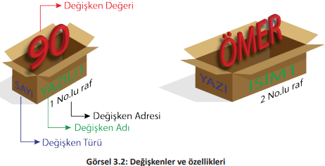
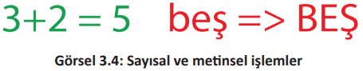
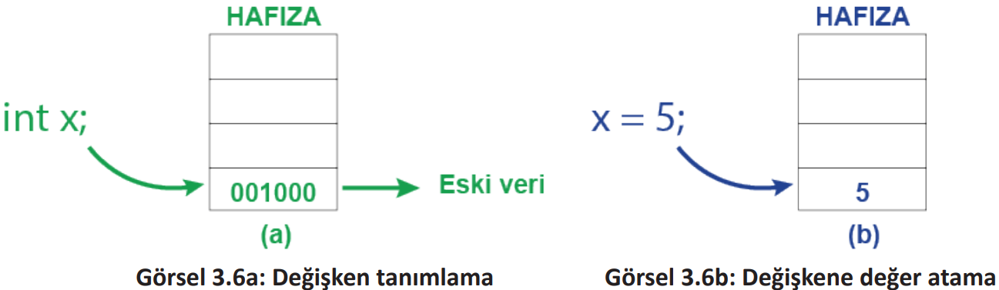

# 3.2. DEĞİŞKENLER
- <a href="#3.2.1.">3.2.1. Değişken Yapısı</a>
- <a href="#3.2.2.">3.2.2. Değişken Tanımlama ve Atama</a>
  
Yazılım geliştirme sürecindeki en temel konulardan biri değişkenlerdir. Akıllı cihazlar işlem yapabilmek için verilere ihtiyaç duyar. Akıllı cihazlar bu verileri hafızlarında muhafaza etmelidir çünkü gerektiğinde bu verilere ulaşabilmeli, verilerin üzerinde işlem yapabilmeli ve gerektiğinde verileri değiştirebilmelidir. Hafızada tutulan, gerektiğinde değerleri değişebilen bilgilere programcılık dünyasında değişken adı verilir. Değişkenler, içinde verileri tutan kutular olarak düşünülebilir. Bu kutuların büyüklüğü, içine alacağı verilere göre değişir (Görsel 3.1). 

Değişkenlerin dört özelliği bulunur (Görsel 3.2). Bu özellikler şu şekilde sıralanır:

- Değişkenin Türü: Kutuya konulacak verinin büyüklüğüne göre kutu tipi (sayı, yazı vb.)
- Değişkenin Adı: Kutunun ismi (YAZILI1, İSİM1)
- Değişkenin Değeri: Kutunun içeriği (90, ÖMER)
- Değişkenin Adresi: Kutunun yeri (1 No.lu raf, 2 No.lu raf) 

Mobil cihazların hafızası bir marketin reyonlarına benzetilebilir (Görsel 3.3). Bir markette farklı ürün türlerine ait farklı raflar bulunur. Her rafın içine yerleştirilecek ürün türüne göre belirli bir bölme ayarlanır. Her bir bölmeye en büyük ürün de en küçük ürün de konulabilir. Bu ürünler farklı olduğu için üzerinde yapılacak işlemler de farklılık gösterir.

>**SIRA SİZDE**:
>
>Görsel 3.3’teki değişkenlerin türünü, adresini ve değerini verilen örneklerdeki gibi yazınız.
>
>| Değişkenin Adı | Değişkenin Türü | Değişkenin Değeri | Değişkenin Adresi |
>| -------------- | --------------- | ----------------- | ----------------- |
>| Tam Yağlı Süt  | Süt             | 1 Kutu Süt        | 1 No.lu Bölme     |
>| A Marka Şeker  | Şeker           | Şeker 10 kg       | 7 No.lu Bölme     |
>
>**DEĞERLENDİRME**:
>
>Çalışmanız aşağıda yer alan kontrol listesi kullanılarak değerlendirilecektir. Çalışmanızı yaparken değerlendirme ölçütlerini dikkate alınız.
>
>
<b>KONTROL LİSTESİ</b>

>
>| DEĞERLENDİRME ÖLÇÜTLERİ     | EVET | HAYIR |
>| --------------------------- | ---- | ----- |
>| 1. Değişken adını yazdı.    |
>| 2. Değişken türünü yazdı.   |
>| 3. Değişken değerini yazdı. |
>| 4. Değişken adresini yazdı. |

Tanımlanan veri türlerine göre mobil cihazın hafızasında yerler tahsis edilir. Ayrılan bu alanlar, veri türüne göre farklı büyüklüktedir. Mobil cihaz hafızasının verimli kullanılması için mobil program içindeki veri türleri iyi analiz edilmelidir.

Veri türlerinin farklılığından dolayı bu veriler üzerinde gerçekleştirilecek işlemler de farklılık gösterir (Görsel 3.4). Sayı veri türleri ile toplama, çıkarma, çarpma ve bölme gibi matematiksel işlemler gerçekleştirilir. Metin veri türleri ile bir metni büyük veya küçük harflere çevirme gibi metinsel işlemler gerçekleştirilir. 

<h2 id="3.2.1.">3.2.1. Değişken Yapısı</h2>

Java kodlarıyla değişken tanımlama iki kısımdan oluşur. İlk kısım, saklanmak istenen bilgiye göre veri türüdür, ikinci kısım ise değişkenin adıdır (Görsel 3.5). 

**NOT**

>Java programlama dillinde noktalı virgül, derleyiciye talimatın nerede bittiğini gösterir. Böylelikle Java kodları bir satırda veya birden çok satırda yazılabilir.

<h2 id="3.2.2.">3.2.2. Değişken Tanımlama ve Atama</h2>

Değişkenin adını ve türünü belirtmeye **değişken tanımlama (declaration)** denir (Görsel 3.6a). Değişken tanımlama yapıldığında hafızada değişken türüne göre boş bir yer ayrılır. Bu yerin adresi ile değişkenin adı aynı şeyi ifade eder.

Değişkenin içindeki değerin değiştirilmesi işlemine **değişkene değer atama (assignment)** denir (Görsel 3.6b). Değişkene değer atama işleminde değişkene ait hafızadaki değer, yeni değer ile değiştirilir. Kod olarak değişkeni başlatma işlemi ile aynıdır fakat arka planda yapılan işlemler farklıdır.

Mobil uygulama geliştirme ortamında bir değişken tanımlanıp değişkenin içine bir değer atanmadığında program hata verir. Bunun nedeni, değişken tanımlandığında hafızada ayrılan bölümde daha önceden bir verinin var olma olasılığıdır. Java dili ile mobil programı yazılırken ilkel değişkenlere mutlaka bir değer ataması yapılmalıdır.

Değişken tanımlama ve değer atama işlemleri birlikte yapılabilir. 

**NOT**

>Bazı programlama dillerinde değişken tanımlanması yapıldığında değişkenin ilk değeri, o değişken türüne göre otomatik olarak verilir. Sayısal veri türleri için bu varsayılan değer 0’dır.

>**SIRA SİZDE**
>
>Tablodaki kodlara göre değişkeni başlatma ve değişkene değer atama işlemine onay işareti koyunuz.
>
>| Kod            | Değişken Başlatma | Değişken Atama |
>| -------------- | ----------------- | -------------- |
>| int puan;      |
>| puan = 80;     |
>| int puan = 80; |
>
>**DEĞERLENDİRME**: 
>
>Çalışmanız aşağıda yer alan kontrol listesi kullanılarak değerlendirilecektir. Çalışmanızı yaparken değerlendirme ölçütlerini dikkate alınız.
>
>
<b>KONTROL LİSTESİ</b>

>
>| DEĞERLENDİRME ÖLÇÜTLERİ                                | EVET | HAYIR |
>| ------------------------------------------------------ | ---- | ----- |
>| 1. Değişken başlatma kodlarını doğru olarak buldu.     |
>| 2. Değişkene değer atama kodlarını doğru olarak buldu. |