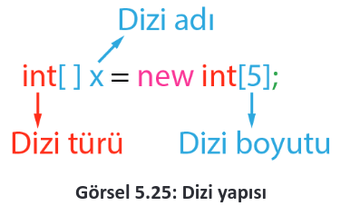
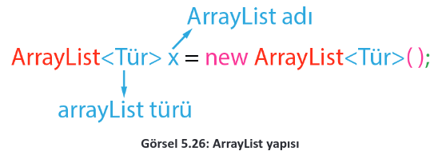
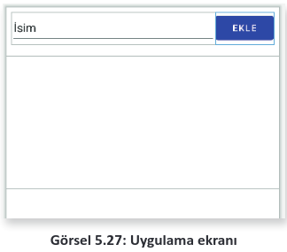
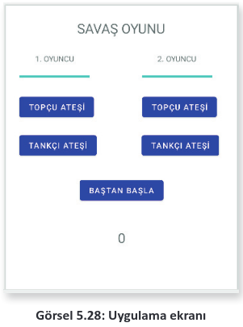

<h1 style="color:#ff5432">5.6. DİZİLER</h1>

- <a href="#5.6.1.">5.6.1. Diziye Değer Atama</a>
- <a href="#5.6.2.">5.6.2. ArrayList</a>
  
Diziler, içinde birden fazla değer barındırabilen değişkenlerdir. Uygulama geliştirilirken birçok değer ile işlem yapılması gerekebilir. Her değer için ayrı bir değişken tanımlamak zordur. Diziler sayesinde tek değişken tanımlanarak bu değişken içinde birden fazla değer kaydedilir.

Diziler bir değişken gibi tanımlanır. Değişken türünün yanına köşeli parantez işareti kullanılır. New anahtar kelimesinin yanına değişken türü ve köşeli parantez içine dizinin boyutu yazılır (Görsel 5.25).

<div style='display:block;text-align:center'>


</div>

Dizilerin türü, ilkel veri türü olabileceği gibi herhangi bir sınıf da olabilir.

<span style="font-weight:bold; padding-top:1px; padding-bottom:1px; padding-left:8px; padding-right:8px; background-color:#ffdcce;">ÖRNEK</span>

```java
Asker[] askerler = new Asker[10];
// İçinde 10 adet Asker sınıfı nesne barındıran bir dizi
```
Dizilerin boyutu oluşturulduktan sonra değiştirilemez, sabittir. Dizilerin içindeki her bir elemanın konumunu bildiren bir sıra numarası verilir. Bu sıra numarasına indis adı verilir. Java’da indisler 0’dan başlar.

<h2 id = "5.6.1." style="color:#ff5432">5.6.1. Diziye Değer Atama</h2>
Dizilere değer atamanın birden fazla yöntemi mevcuttur. İlk yöntem, dizi oluşturulurken değer atamasının yapılmasıdır. Bu yöntemde dizinin boyut değeri girilmez. Girilen elemanların sayısına göre dizinin boyutu otomatik olarak ayarlanır.

<span style="font-weight:bold; padding-top:1px; padding-bottom:1px; padding-left:8px; padding-right:8px; background-color:#ffdcce;">ÖRNEK</span>

```java
Integer[ ] sayilar = new Integer[]{1,3,5,7,9}; //Dizinin boyutu 5’tir.
```

Dizilere değer atamanın diğer yöntemi ise dizi oluşturulduktan sonra değer atamaktır. Dizinin elamanına değer atamak için dizi indis numarası kullanılır.

<span style="font-weight:bold; padding-top:1px; padding-bottom:1px; padding-left:8px; padding-right:8px; background-color:#ffdcce;">ÖRNEK</span>

```java
Integer[ ] sayilar = new Integer[5]; //Dizinin boyutu 5’tir.
sayilar[0] = 2; //Dizinin 0’ıncı elemanı
sayilar[1] = 4; //Dizinin 1’inci elemanı
sayilar[2] = 6; //Dizinin 2’nci elemanı
sayilar[3] = 8; //Dizinin 3’üncü elemanı
sayilar[4] = 10; //Dizinin 4’üncü elemanı
```

**11. UYGULAMA**: İşlem adımlarına göre diziler ile 6 sayıyı toplayan bir uygulama tasarlayınız.

**1. Adım**: Mobil uygulama geliştirme programında Empty Activity olacak şekilde bir proje oluşturunuz.\
**2. Adım**: Uygulama ekranında iki TextView, bir EditText ve iki Button oluşturan şu kodu activity_main.xml içine yazınız:

```xml
<TextView
    android:id="@+id/textViewIndis"
    android:layout_width="wrap_content"
    android:layout_height="wrap_content"
    android:text="İndis: 0"
    app:layout_constraintBottom_toBottomOf="parent"
    app:layout_constraintEnd_toEndOf="parent"
    app:layout_constraintStart_toStartOf="parent"
    app:layout_constraintTop_toTopOf="parent"
    app:layout_constraintVertical_bias="0.1" />
<TextView
    android:id="@+id/textViewToplam"
    android:layout_width="wrap_content"
    android:layout_height="wrap_content"
    android:layout_marginTop="20dp"
    android:text="Toplam: 0"
    app:layout_constraintEnd_toEndOf="parent"
    app:layout_constraintStart_toStartOf="parent"
    app:layout_constraintTop_toBottomOf="@+id/textViewIndis" />
<EditText
    android:id="@+id/editTextSayi"
    android:layout_width="wrap_content"
    android:layout_height="wrap_content"
    android:layout_marginTop="20dp"
    android:ems="10"
    android:inputType="number"
    app:layout_constraintEnd_toEndOf="parent"
    app:layout_constraintStart_toStartOf="parent"
    app:layout_constraintTop_toBottomOf="@+id/textViewToplam" />
<Button
    android:id="@+id/buttonEkle"
    android:layout_width="wrap_content"
    android:layout_height="wrap_content"
    android:layout_marginTop="20dp"
    android:text="Ekle"
    app:layout_constraintEnd_toEndOf="parent"
    app:layout_constraintStart_toStartOf="parent"
    app:layout_constraintTop_toBottomOf="@+id/editTextSayi" />
<Button
    android:id="@+id/buttonSifirla"
    android:layout_width="wrap_content"
    android:layout_height="wrap_content"
    android:layout_marginTop="20dp"
    android:text="Sıfırla"
    app:layout_constraintEnd_toEndOf="parent"
    app:layout_constraintStart_toStartOf="parent"
    app:layout_constraintTop_toBottomOf="@+id/buttonEkle" />
```

**3. Adım:** MainActivity.java dosyasına şu kodu yazınız:

```java
package com.example.diziler;
import androidx.appcompat.app.AppCompatActivity;
import android.os.Bundle;
import android.view.View;
import android.widget.Button;
import android.widget.EditText;
import android.widget.TextView;
public class MainActivity extends AppCompatActivity {
    public Integer[] notlar = new Integer[6];
    public int indis =0;
    @Override
    protected void onCreate(Bundle savedInstanceState) {
        super.onCreate(savedInstanceState);
        setContentView(R.layout.activity_main);
        TextView textViewIndis = findViewById(R.id.textViewIndis);
        TextView textViewToplam = findViewById(R.id.textViewToplam);
        EditText editTextSayi = findViewById(R.id.editTextSayi);
        Button buttonEkle = findViewById(R.id.buttonEkle);
        Button buttonSifirla = findViewById(R.id.buttonSifirla);
        buttonEkle.setOnClickListener(view -> {
            if (indis <6){
            int sayi;
            sayi = Integer.parseInt(editTextSayi.getText().toString());
            notlar[indis]=sayi;
            indis++;
            textViewIndis.setText("İndis: " + Integer.toString(indis));
            int toplam = 0;
            for (int i = 0; i < indis; i++) {
                toplam += notlar[i];
            }
            textViewToplam.setText("Toplam: " + Integer.toString(toplam));
            editTextSayi.getText().clear();
            }
            else{
                textViewIndis.setText("Dizi dolu");
            }
        });
        buttonSifirla.setOnClickListener(view -> {
            indis=0;
            textViewIndis.setText("İndis: 0");
            textViewToplam.setText("Toplam: 0");
            notlar = new Integer[6];
        });
    }
}
```

**4. Adım:** Run düğmesine tıklayarak uygulamayı çalıştırınız.

<h2 id="5.6.2." style="color:#ff5432">5.6.2. ArrayList</h2>

Dizilerin boyutu sabittir. Uygulama çalışırken dizilerin boyutu artırılamaz ve azaltılamaz. Mobiluygulama geliştirilirken uygulama çalışma zamanı esnasında boyutu daha önceden tahmin edilemeyecek dizi yapılarına ihtiyaç duyulur. Bu ihtiyacı karşılayacak birçok yapı vardır. Bunlardanen çok kullanılanı ArrayList yapısıdır. ArrayList, istenen sayıda öge eklenen veya silinen dinamikyapıdır. ArrayList yapısını kullanmak için uygulama paketine import komutu ile java.util.ArrayListeklenmelidir. ArrayList yapısına öge olarak sadece nesneler eklenebilir, ilkel veri türleri eklenemez. ArrayList tanımlaması Görsel 5.26’da verilmiştir.

<div style='display:block;text-align:center'>


</div>

<h3 id="5.6.2." style="color:#ff5432">5.6.2.1. ArrayList Yapısına Öge Ekleme (Add)</h3>

ArrayList yapısının sonuna öge eklemek için add metodu kullanılır.

<span style="font-weight:bold; padding-top:1px; padding-bottom:1px; padding-left:8px; padding-right:8px; background-color:#ffdcce;">ÖRNEK</span>

```java
ArrayList<Integer> aListesi = new ArrayList< >();
aListesi.add(2);
aListesi.add(4);
aListesi.add(6);
//aListesi içinde sırasıyla 2, 4 ve 6 vardır.
```

ArrayList yapısında araya öge eklemek için add metodunda iki parametre gönderilir. Birinci parametre eklenecek indis sırası, ikinci parametre ise eklenecek nesnedir.

<span style="font-weight:bold; padding-top:1px; padding-bottom:1px; padding-left:8px; padding-right:8px; background-color:#ffdcce;">ÖRNEK</span>

```java
ArrayList<Integer> aListesi = new ArrayList< >();
aListesi.add(2);
aListesi.add(4);
aListesi.add(6);
aListesi.add(1,3); //1 No.lu indise 3 sayısını ekler.
//aListesi içinde sırasıyla 2, 3, 4 ve 6 vardır.
```

<h3 id="5.6.2." style="color:#ff5432">5.6.2.2. ArrayList Yapısından Öge Silme (Remove)</h3>

ArrayList yapısından öge silmek için remove metodu kullanılır. Remove metodu iki farklı şekilde gerçekleştirilir. İlk kullanımda parametre olarak listeden çıkarılacak öge verilir. İkinci kullanımda ise parametre olarak çıkarılacak ögenin indisi verilir.

<span style="font-weight:bold; padding-top:1px; padding-bottom:1px; padding-left:8px; padding-right:8px; background-color:#ffdcce;">ÖRNEK</span>

```java
ArrayList<Integer> aListesi = new ArrayList< >();
aListesi.add(2);
aListesi.add(4);
aListesi.add(6);
aListesi.remove(1); //1 No.lu indisteki 4 sayısı listeden çıkartılır.
//aListesi içinde sırasıyla 2 ve 6 vardır.
```

<span style="font-weight:bold; padding-top:1px; padding-bottom:1px; padding-left:8px; padding-right:8px; background-color:#ffdcce;">ÖRNEK</span>

```java
ArrayList<Ogrenci> ogrenciler= new ArrayList< >();
ogrenciler.add(ogrenci1);
ogrenciler.add(ogrenci2);
ogrenciler.add(ogrenci3);
ogrenciler.remove(ogrenci2);
//Öğrenciler listesi içinde sırasıyla ogrenci1 ve ogrenci3 vardır.
```

<h3 id="5.6.2." style="color:#ff5432">5.6.2.3. ArrayList Yapısını Temizleme (Clear)</h3>

ArrayList içindeki tüm ögeleri silmek için clear metodu kullanılır.

<span style="font-weight:bold; padding-top:1px; padding-bottom:1px; padding-left:8px; padding-right:8px; background-color:#ffdcce;">ÖRNEK</span>
```java
ArrayList<Integer> aListesi = new ArrayList< >();
aListesi.add(2);
aListesi.add(4);
aListesi.add(6);
aListesi.clear();
//aListesi içinde hiçbir öge yoktur.
```

<h3 id="5.6.2." style="color:#ff5432">5.6.2.4. ArrayList Yapısında Arama (Contains)</h3>

ArrayList içindeki bir ögeyi aramak için contains metodu kullanılır. Contains metoduna parametre olarak aranacak nesne gönderilir.

<span style="font-weight:bold; padding-top:1px; padding-bottom:1px; padding-left:8px; padding-right:8px; background-color:#ffdcce;">ÖRNEK</span>

```java
ArrayList<Integer> aListesi = new ArrayList< >();
aListesi.add(2);
aListesi.add(4);
aListesi.add(6);
if(aListesi.contains(4))
    System.out.println("Var");
else
    System.out.println("Yok");
```

<h3 id="5.6.2." style="color:#ff5432">5.6.2.5. ArrayList Yapısını Kopyalama (Clone)</h3>

ArrayList yapısının tam olarak bir kopyasını almak için clone metodu kullanılır. Clone metodunu kullanmak için tip dönüşümü yapılmalıdır.

<span style="font-weight:bold; padding-top:1px; padding-bottom:1px; padding-left:8px; padding-right:8px; background-color:#ffdcce;">ÖRNEK</span>

```java 
ArrayList<Integer> aListesi = new ArrayList< >();
aListesi.add(2);
aListesi.add(4);
aListesi.add(6);
ArrayList<Integer> aListeKopyasi = (ArrayList<Integer>) aListesi.clone();
```

**12. UYGULAMA:** İşlem adımlarına göre eklenen isimleri ListViewde gösteren ve ListViewde tıklanan ismi listeden silen bir uygulama tasarlayınız.

**1. Adım:** Mobil uygulama geliştirme programında Empty Activity olacak şekilde bir proje oluşturunuz.\
**2. Adım:** Görsel 5.27’de verilen uygulama ekranını oluşturan şu kodu activity_main.xml içine yazınız.

<div style='display:block;text-align:center'>


</div>

```xml
<EditText
    android:id="@+id/editTextAd"
    android:layout_width="0dp"
    android:layout_height="wrap_content"
    android:layout_marginStart="8dp"
    android:layout_marginTop="8dp"
    android:ems="10"
    android:inputType="textPersonName"
    android:minHeight="48dp"
    android:text="İsim"
    app:layout_constraintEnd_toStartOf="@+id/buttonEkle"
    app:layout_constraintStart_toStartOf="parent"
    app:layout_constraintTop_toTopOf="parent" />
<Button
    android:id="@+id/buttonEkle"
    android:layout_width="wrap_content"
    android:layout_height="wrap_content"
    android:layout_marginTop="8dp"
    android:layout_marginEnd="8dp"
    android:text="Ekle"
    app:layout_constraintEnd_toEndOf="parent"
    app:layout_constraintTop_toTopOf="parent" />
<ListView
    android:id="@+id/listViewAdlar"
    android:layout_width="match_parent"
    android:layout_height="200dp"
    android:layout_marginTop="8dp"
    app:layout_constraintBottom_toBottomOf="parent"
    app:layout_constraintEnd_toEndOf="parent"
    app:layout_constraintStart_toStartOf="parent"
    app:layout_constraintTop_toBottomOf="@+id/editTextAd"
    app:layout_constraintVertical_bias="0.02" />
```

**3. Adım:** MainActivity.java dosyasına şu kodu yazınız:

```java
package com.example.arraylistkullanimi;
import androidx.appcompat.app.AppCompatActivity;
import android.os.Bundle;
import android.widget.ArrayAdapter;
import android.widget.Button;
import android.widget.EditText;
import android.widget.ListView;
import java.util.ArrayList;
public class MainActivity extends AppCompatActivity {
    Button buttonEkle;
    EditText editTextAd;
    ListView listViewAdlar;
    ArrayList<String> isimlerListesi = new ArrayList<>();
    ArrayAdapter<String> adapter;
    @Override
    protected void onCreate(Bundle savedInstanceState) {
        super.onCreate(savedInstanceState);
        setContentView(R.layout.activity_main);
        adapter = new ArrayAdapter<>(this, android.R.layout.simple_list_item_1, isimlerListesi);
        buttonEkle = findViewById(R.id.buttonEkle);
        editTextAd = findViewById(R.id.editTextAd);
        listViewAdlar = findViewById(R.id.listViewAdlar);
        listViewAdlar.setAdapter(adapter);
        buttonEkle.setOnClickListener(view -> {
            String ad = editTextAd.getText().toString();
            isimlerListesi.add(ad);
            adapter.notifyDataSetChanged();
            editTextAd.getText().clear();
        });
        listViewAdlar.setOnItemClickListener((adapterView, view, i, l) -> {
            isimlerListesi.remove(i);
            adapter.notifyDataSetChanged();
        });
    }
}
```

**4. Adım:** Run düğmesine tıklayarak uygulamayı çalıştırınız.

>**SIRA SİZDE:**
>
>Öğrenci numarası ve adından bir öğrenci sınıfı oluşturunuz. Öğrenci sınıfı nesnelerini alacak şekilde bir liste tanımlayınız. Bir Button ile öğrenci sınıfından yeni nesne oluşturup bu listeye ekleyiniz. Uygulama ekranında bu listeyi gösteren bir uygulama tasarlayınız.
>
>**DEĞERLENDİRME:**
>
>Çalışmanız aşağıda yer alan kontrol listesi kullanılarak değerlendirilecektir. Çalışmanızı yaparken değerlendirme ölçütlerini dikkate alınız.
>
><div style="text-align:center"><b>KONTROL LİSTESİ</b></div>
>
>| DEĞERLENDİRME ÖLÇÜTLERİ                                           | EVET | HAYIR |
>| :----------------------------------------------------------------- | ---- | ----- |
>| 1. New Project komutunu tıkladı.                                  |
>| 2. Empty Activity proje türünü seçti.                             |
>| 3. Uygulama adını belirledi.                                      |
>| 4. Uygulama tasarım ekranına iki EditText ekledi.                 |
>| 5. Uygulama tasarım ekranına bir Button ekledi.                   |
>| 6. Uygulama tasarım ekranına bir ListView ekledi.                 |
>| 7. "Ogrenci" adında yeni bir sınıf oluşturdu.                     |
>| 8. "Ogrenci" sınıfına numara özelliğini ekledi.                   |
>| 9. "Ogrenci" sınıfına ad özelliğini ekledi.                       |
>| 10. Uygulama kodunda findViewById yöntemiyle nesneleri tanımladı. |
>| 11. ArrayList oluşturdu.                                          |
>| 12. ArrayAdepter oluşturdu.                                       |
>| 13. ListView nesnesine ArrayAdepter nesnesini bağladı.            |
>| 14. Button nesnesine tıklanma olayı ekledi.                       |
>| 15. Button nesnesi tıklanma olayına listeye ekleme kodunu yazdı.  |
>| 16. Run düğmesine tıklayarak uygulamayı çalıştırdı.               |

**13. UYGULAMA:** İşlem adımlarına göre asker, tankçı ve topçu nesnelerini kullanarak iki kişilik basit bir oyun uygulaması tasarlayınız.

**1. Adım**: Mobil uygulama geliştirme programında Empty Activity olacak şekilde bir proje oluşturunuz.\
**2. Adım**: Görsel 5.28’de verilen uygulama ekranını oluşturan şu kodu activity_main.xml dosyası içine yazınız.

<div style='display:block;text-align:center'>


</div>

```xml
<?xml version="1.0" encoding="utf-8"?>
<androidx.constraintlayout.widget.ConstraintLayout 
    xmlns:android="http://schemas.android.com/apk/res/android"
    xmlns:app="http://schemas.android.com/apk/res-auto"
    xmlns:tools="http://schemas.android.com/tools"
    android:layout_width="match_parent"
    android:layout_height="match_parent"
    tools:context=".MainActivity">
    <TextView
        android:id="@+id/textView"
        android:layout_width="wrap_content"
        android:layout_height="wrap_content"
        android:layout_marginTop="24dp"
        android:text="SAVAŞ OYUNU"
        android:textSize="24dp"
        app:layout_constraintEnd_toEndOf="parent"
        app:layout_constraintHorizontal_bias="0.498"
        app:layout_constraintStart_toStartOf="parent"
        app:layout_constraintTop_toTopOf="parent" />
    <TextView
        android:id="@+id/textView2"
        android:layout_width="wrap_content"
        android:layout_height="wrap_content"
        android:layout_marginStart="52dp"
        android:layout_marginTop="28dp"
        android:text="1. OYUNCU"
        app:layout_constraintStart_toStartOf="parent"
        app:layout_constraintTop_toBottomOf="@+id/textView" />
    <TextView
        android:id="@+id/textView3"
        android:layout_width="wrap_content"
        android:layout_height="wrap_content"
        android:layout_marginEnd="72dp"
        android:text="2. OYUNCU"
        app:layout_constraintEnd_toEndOf="parent"
        app:layout_constraintTop_toTopOf="@+id/textView2" />
    <ProgressBar
        android:id="@+id/progressBar1"
        style="?android:attr/progressBarStyleHorizontal"
        android:layout_width="125dp"
        android:layout_height="20dp"
        android:layout_marginStart="24dp"
        android:layout_marginTop="12dp"
        app:layout_constraintStart_toStartOf="parent"
        app:layout_constraintTop_toBottomOf="@+id/textView2"
        android:max="100"
        android:progress="100"/>
    <ProgressBar
        android:id="@+id/progressBar2"
        style="?android:attr/progressBarStyleHorizontal"
        android:layout_width="125dp"
        android:layout_height="20dp"
        android:layout_marginTop="12dp"
        android:layout_marginEnd="44dp"
        app:layout_constraintEnd_toEndOf="parent"
        app:layout_constraintTop_toBottomOf="@+id/textView3"
        android:max="100"
        android:progress="100"/>
    <Button
        android:id="@+id/buttonTopcu1"
        android:layout_width="wrap_content"
        android:layout_height="wrap_content"
        android:layout_marginStart="24dp"
        android:layout_marginTop="20dp"
        android:text="Topçu Ateşi"
        app:layout_constraintStart_toStartOf="parent"
        app:layout_constraintTop_toBottomOf="@+id/progressBar1" />
    <Button
        android:id="@+id/buttonTankci1"
        android:layout_width="wrap_content"
        android:layout_height="wrap_content"
        android:layout_marginStart="24dp"
        android:layout_marginTop="20dp"
        android:text="Tankçı Ateşi"
        app:layout_constraintStart_toStartOf="parent"
        app:layout_constraintTop_toBottomOf="@+id/buttonTopcu1" />
    <Button
        android:id="@+id/buttonTopcu2"
        android:layout_width="wrap_content"
        android:layout_height="wrap_content"
        android:layout_marginTop="20dp"
        android:layout_marginEnd="36dp"
        android:text="Topçu Ateşi"
        app:layout_constraintEnd_toEndOf="parent"
        app:layout_constraintTop_toBottomOf="@+id/progressBar2" />
    <Button
        android:id="@+id/buttonTankci2"
        android:layout_width="wrap_content"
        android:layout_height="wrap_content"
        android:layout_marginTop="20dp"
        android:layout_marginEnd="32dp"
        android:text="Tankçı Ateşi"
        app:layout_constraintEnd_toEndOf="parent"
        app:layout_constraintTop_toBottomOf="@+id/buttonTopcu2" />
    <Button
        android:id="@+id/buttonReset"
        android:layout_width="wrap_content"
        android:layout_height="wrap_content"
        android:layout_marginTop="32dp"
        android:text="Baştan Başla"
        app:layout_constraintEnd_toEndOf="parent"
        app:layout_constraintStart_toStartOf="parent"
        app:layout_constraintTop_toBottomOf="@+id/buttonTankci1" />
    <TextView
        android:id="@+id/textViewIsabet"
        android:layout_width="wrap_content"
        android:layout_height="wrap_content"
        android:layout_marginTop="44dp"
        android:text="0"
        android:textSize="24dp"
        app:layout_constraintEnd_toEndOf="parent"
        app:layout_constraintStart_toStartOf="parent"
        app:layout_constraintTop_toBottomOf="@+id/buttonReset" />
</androidx.constraintlayout.widget.ConstraintLayout>
```

**3. Adım:** Asker sınıfı oluşturunuz.\
**4. Adım:** Asker.java dosyasına şu kodu yazınız:

```java
package com.example.savasoyunu;
import java.util.Random;
public class Asker {
    private Integer atesGucu;
    public Integer getAtesGucu() {
        return atesGucu;
    }
    public void setAtesGucu(Integer atesGucu) {
        this.atesGucu = atesGucu;
    }
    private Integer sans;
    public Integer getSans() {
        return sans;
    }
    public void setSans(Integer sans) {
        this.sans = sans;
    }
    public Asker(Integer atesGucu, Integer sans) {
        this.atesGucu = atesGucu;
        this.sans = sans;
    }
    public Integer atesEt(Oyuncu dusman){
        Random random = new Random();
        int isabet = random.nextInt(sans)*atesGucu;
        dusman.setCan(dusman.getCan()-isabet);

        return isabet;
    }
}
```

**5. Adım:** Tankci sınıfını oluşturunuz.\
**6. Adım:** Tankci.java dosyasına şu kodu yazınız:

```java
package com.example.savasoyunu;
public class Tankci extends Asker {
    public Tankci() {
        super(5,5);
    }
}
```

**7. Adım:** Topcu sınıfını oluşturunuz.\
**8. Adım:** Topcu.java dosyasına şu kodu yazınız:

```java
package com.example.savasoyunu;
public class Topcu extends Asker{
    private boolean topIsindi = false;
    public int getAtisSayisi() {
        return atisSayisi;
    }
    public void setAtisSayisi(int atisSayisi) {
        this.atisSayisi = atisSayisi;
    }
    public int atisSayisi;
    @Override
    public Integer atesEt(Oyuncu dusman) {
        if (topIsindi){
            topIsindi = false;
            atisSayisi = 0;

            return 0;
        }

        atisSayisi++;
        if (atisSayisi==3){
            topIsindi=true;
        }
        int isabet = super.atesEt(dusman);
        
        return isabet;
    }
    public Topcu() {
        super(3,7);
        atisSayisi = 0;
    }
}
```

**9. Adım:**Oyuncu sınıfını oluşturunuz.\
**10. Adım:** Oyuncu.java dosyasına şu kodu yazınız:

```java
package com.example.savasoyunu;
    public class Oyuncu {
    private String isim;
    private Integer can;
    public String getIsim() {
        return isim;
    }
    public void setIsim(String isim) {
        this.isim = isim;
    }
    public Integer getCan() {
        return can;
    }
    public void setCan(Integer can) {
        this.can = can;
    }
    public Oyuncu(String isim, Integer can) {
        this.isim = isim;
        this.can = can;
    }
    public Asker tankci = new Tankci();
    public Asker topcu = new Topcu();
}
```

**11. Adım:** MainActivity.java dosyasına şu kodu yazınız:

```java
package com.example.savasoyunu;
import androidx.appcompat.app.AppCompatActivity;
import android.os.Bundle;
import android.view.View;
import android.widget.Button;
import android.widget.ProgressBar;
import android.widget.TextView;
import java.util.ArrayList;
public class MainActivity extends AppCompatActivity {
    Oyuncu oyuncu1;
    Oyuncu oyuncu2;
    Button buttonTank1;
    Button buttonTank2;
    Button buttonTopcu1;
    Button buttonTopcu2;
    Button buttonReset;
    ProgressBar progressBar1;
    ProgressBar progressBar2;
    TextView textViewIsabet;
    Integer isabet;
    ArrayList<Oyuncu> oyuncular = new ArrayList<>();
    @Override
    protected void onCreate(Bundle savedInstanceState) {
        super.onCreate(savedInstanceState);
        setContentView(R.layout.activity_main);
        oyuncu1 = new Oyuncu("Oyuncu 1",100);
        oyuncu2 = new Oyuncu("Oyuncu 2",100);
        oyuncular.add(oyuncu1);
        oyuncular.add(oyuncu2);
        buttonTank1 = findViewById(R.id.buttonTankci1);
        buttonTank2 = findViewById(R.id.buttonTankci2);
        buttonTopcu1 = findViewById(R.id.buttonTopcu1);
        buttonTopcu2 = findViewById(R.id.buttonTopcu2);
        buttonReset = findViewById(R.id.buttonReset);
        progressBar1 = findViewById(R.id.progressBar1);
        progressBar2 = findViewById(R.id.progressBar2);
        textViewIsabet = findViewById(R.id.textViewIsabet);

        buttonTank1.setOnClickListener(view -> {
            isabet = oyuncu1.tankci.atesEt(oyuncu2);
            progressBar2.setProgress(oyuncu2.getCan());
            textViewIsabet.setText(isabet.toString());
            oyuncuKontrolet();
        });
        buttonTopcu1.setOnClickListener(view -> {
            isabet = oyuncu1.topcu.atesEt(oyuncu2);
            progressBar2.setProgress(oyuncu2.getCan());
            textViewIsabet.setText(isabet.toString());
            oyuncuKontrolet();
        });
        buttonTank2.setOnClickListener(view -> {
            isabet = oyuncu2.tankci.atesEt(oyuncu1);
            progressBar1.setProgress(oyuncu1.getCan());
            textViewIsabet.setText(isabet.toString());
            oyuncuKontrolet();
        });
        buttonTopcu2.setOnClickListener(view -> {
            isabet = oyuncu2.topcu.atesEt(oyuncu1);
            progressBar1.setProgress(oyuncu1.getCan());
            textViewIsabet.setText(isabet.toString());
            oyuncuKontrolet();
        });
        buttonReset.setOnClickListener(view -> {
            oyuncu1.setCan(100);
            oyuncu2.setCan(100);
            progressBar1.setProgress(oyuncu1.getCan());
            progressBar2.setProgress(oyuncu2.getCan());
            textViewIsabet.setText("0");
        });
        }
        private void oyuncuKontrolet() {
            for (Oyuncu oyuncu:oyuncular) {
                if (oyuncu.getCan()<=0 )
                    textViewIsabet.setText("Oyun Bitti");
            }
        }
    }
}
```

**12. Adım:** Run düğmesine tıklayarak uygulamayı çalıştırınız.