# 4.2. DÖNGÜ YAPILARI
- <a href="#4.2.1.">4.2.1. Sayaçlar</a> 
- <a href="#4.2.2.">4.2.2. for Döngüsü </a> 
- <a href="#4.2.3.">4.2.3. while Döngüsü</a> 
- <a href="#4.2.4.">4.2.4. do-while Döngüsü </a>
  
Döngüler, uygulama oluşturma aşamasında belirli şartlara bağlı olarak yazılan kod blokunu istendiği sayıda tekrar tekrar çalıştırmayı sağlayan yapılardır. Duruma göre bir kod iki defa çalıştırılabileceği gibi binlerce defa ve hatta sonsuz defa da çalıştırılabilir. Burada iş aslında uygulamanın tasarımcısının ne düşündüğü ile ilgilidir. Örneğin 30 kişinin bulunduğu bir sınıfın bilgilerinin girilmesi istendiğinde 30 kişi için ayrı ayrı isteme kodu yazılması yerine tek satır kodu 30 defa çalışacak bir döngüye sokarak bu iş daha kolay yapılabilir. Bilgilerin belirli bir şarta göre 30 kişi için getirilmesi istediğinde 30 ayrı "if" karar yapısı yazılması yerine 30 defa çalışacak bir döngünün blokları arasında tek bir "if" karar yapısı oluşturulabilir.

**NOT:**

>Uygulama parçacığı üretmekle uygulamanın bütününü oluşturmak arasında fark vardır. Uygulama parçacığı üretilirken yazılan kodlar az, oluşturulan yapılar kısa görünebilir ancak bir uygulamanın bütünü oluşturulurken binlerce satır kodlama yapılabilir. Her kod tek sefer çalışıp geçilirse veya istenen her bilgi için bir isteme kodu yazılırsa bu binlerce satırlık kod, on binlerce satırlık hâle dönüşür.

<h2 id="4.2.1.">4.2.1. Sayaçlar</h2>

Döngülerin çalışma mekanizması içinde yapının kaç defa çalıştığının veya çalışacağının tutulması gerekir. Bu işlemi kontrol eden, döngünün çalışma aralığını veya kaç defa çalıştığını anlık olarak hafızasına alan yapıya **sayaç** adı verilir. Sayaçlar yapısı itibarıyla birer değişkendir. Tek fark, sayaç döngü yapısı içinde tanımlanırsa döngü dışına çıkıldığında tanımlanan sayaç yok olacak şekilde ayarlanır.

Sayaçlar, döngü içinde sürekli artan veya sürekli azalan bir yapıda olmalıdır. Bu nedenle sayaçlar tanımlanırken en uygun olan yol tercih edilir. Uygulama tasarlanırken bir değişkenin değerini artırmak için "+", azaltmak için "-" aritmetiksel operatörler kullanılır. Bir x değişkeninin değerini 1 artırmak için "x=x+1" ifadesi yazılmalıdır. Bu ifadenin bir çeşidi "x++", bir diğeri de "x+=1" ifadesidir. 

Tablo 4.2’de görüldüğü gibi bir değişkenin değerini artırmak veya azaltmak için birden fazla seçenek olabilir. Bu seçeneklerden uygun olanı seçilip sayaç için döngü yapısında uygulanır.

**Tablo 4.2: Değişkenlerde Aritmetiksel İşlemler**

| x değişkeninin değerini 1 artırmak için | x=x+1 | x+=1 | x++ |
| --------------------------------------- | ----- | ---- | --- |
| x değişkeninin değerini 5 artırmak için | x=x+5 | x+=5 | Yok |
| x değişkeninin değerini 1 azaltmak için | x=x-1 | x-=1 | x-- |
| x değişkeninin değerini 5 azaltmak için | x=x-5 | x-=5 | Yok |

**NOT:**

>Sayaçlar yapı itibarıyla birer değişken olduğu için sayaçların isimlendirilmesinde değişken oluşturma kuralları geçerlidir ve sayaçlara verilecek isim önemli değildir. Sayaçlar isimlendirilirken uygun yöntem, programın akışına göre sayaçlara bir isim belirlemektir. Sayaçlar genellikle programlamada "i" veya "sayac" değişken ismi ile ifade edilir.

<h2 id="4.2.2.">4.2.2. for Döngüsü</h2>

for, uygulama tasarımlarında en çok kullanılan döngü çeşididir. Genellikle tekrar sayısının belli ve net olduğu ifadelerde kullanılır. Döngü yapısı oluşturulurken üç parametre değerine ihtiyaç vardır. Bunlardan ilki, sayaç tanımlama parametresi; ikincisi, şart oluşturma parametresi; üçüncüsü de sayacın artırma veya azaltma işlemi olan parametredir. Şart ifadesinin sonucu "true" ol-
duğu sürece for döngüsünün blokları tekrar tekrar çalışır. for döngüsü şu şekilde tanımlanır:

```java
for( sayaç tanımlama; şart ifadesi; sayaç arttırma veya azaltma)
{
    //kodlar
}
```

Örneğin 1’den 10’a kadar olan sayıların Logcat ekranında gösterilmesi istendiğinde uygulama geliştirme ortamında kodlar onResume yaşam döngüsünün içine Görsel 4.21’deki gibi yazılır.
<div style="display:block;text-align:center">

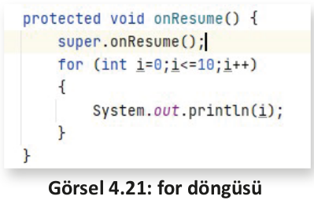
</div>

Görsel 4.21’de olduğu gibi "int i=0" komutu ile i isminde bir sayaç tanımlanır. Döngü yapısında yer alan bloklar arasındaki kodlar, sayacın değeri 0’dan başlayarak 10’a eşit veya 10’dan küçük olduğu sürece "i<=0" komutu ile tekrar tekrar çalışır. Her çalışma sonucunda tekrar başa döndüğünde ise "i++" komutu ile sayaç 1 sayı artarak yeniden şart ifadesinde karşılaştırılır. Blok içine yazılan "System.out.println(i);" komutu da Logcat ekranında Görsel 4.22’de olduğu gibi 0 ile 10 arasındaki değerleri gösterir.
<div style="display:block;text-align:center">

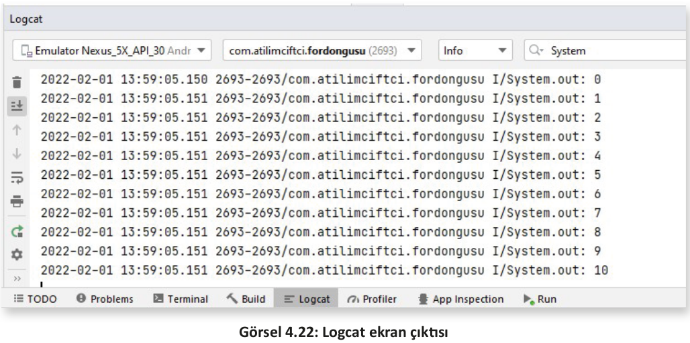
</div>

**NOT:**

>for döngüsü için çalışma mantığı incelendiğinde yanda göründüğü gibi parametre bölümleri numaralandırılırsa 1 numarada sayaç tanımlama bölümü görülür. Birinci bölüm, for döngüsü çalışır çalışmaz ilk olarak işleme girer ve döngü ne kadar tekrar ederse etsin sadece 1 defa çalışır. İki numaralı bölüm, şart ifadesinin yazılacağı bölümdür. İkinci bölüm, sayaç tanımlamasından hemen sonra çalışır. Sonuç true gelirse bloklar (kaşlı ayraç içi) arasına giriş yapar ve kodların çalıştırılmasını sağlar. Şart sonucu false gelirse de blok içine girmeden direkt for döngüsü dışına gider . Üç numaradada sayaç artırma veya azaltma bölümü yer alır . Döngü çalıştırıldıktan sonra blok içindeki işlem yapılmışsa, bir başka deyişle blok arasına girilirse işlem bittikten sonra bu bölüm devreye girer, belirtildiği şekilde değeri azaltır veya artırır. Hemen ardından tekrar şart ifadesine (2 numara) bakılır ve süreç bu sırayla devam eder.

```java
for( (1); (2); (3); )
{
    //kodlar
}
```

**7. UYGULAMA**: İşlem adımlarına göre 1’den 50’ye kadar olan sayıları Logcat ekranında gösteren mobil uygulamayı tasarlayınız.

**1. Adım**: File>New>New Project sekmesinden yeni proje açınız ve Empty Activity seçiniz.

**2. Adım**: MainActivity sınıfını açınız. "onResume" yaşam döngüsü metodunu oluşturunuz.

**3. Adım**: Yaşam döngüsünün içine bir for döngüsü oluşturunuz. Sayacı 1’den başlatıp sayaç 50’den küçük veya 50’ye eşit oldukça blok içindeki kodları çalıştıran ve her defasında sayacı 1 sayı artıran şekilde düzenleyiniz (Görsel 4.23).
<div style="display:block;text-align:center">

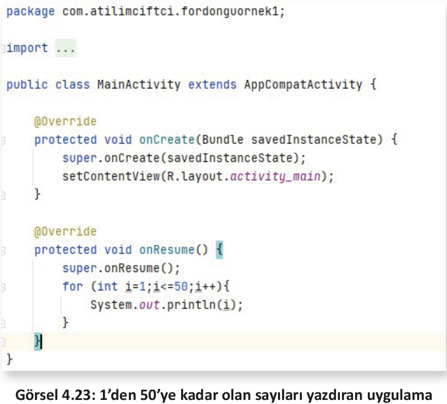
</div>

**4. Adım:** Uygulamayı çalıştırdığınızda uygulama geliştirme programına dönerek Logcat ekranını açınız. Arama çubuğuna "System.out" yazarak çıkan sonuçları filtreleyiniz. Tek satır kod yazılmasına rağmen (System.out.println(i)) 50 defa aynı kodun alıştırıldığını gözlemleyiniz (Görsel 4.24).
<div style="display:block;text-align:center">

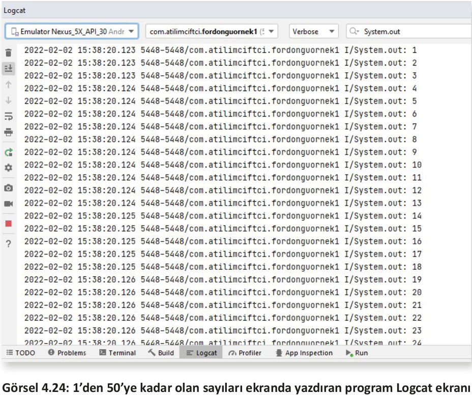
</div>

**8. UYGULAMA**: İşlem adımlarına göre yedinci uygulamaya benzer şekilde 0’dan 100’e kadar olan sayılardan üçün katı olanları Logcat ekranında gösteren mobil uygulamayı tasarlayınız.

**NOT**:

>Bu işlem, iki farklı yöntemle yapılabilir. Birinci yöntemde artış değeri üç olacak şekilde ayarlanır. İkinci yöntemde ise if karar yapısı da for döngüsüne dâhil edilerek kullanılır .

**1. Yöntem**

**1. Adım**: File>New>New Project sekmesinden yeni proje açınız ve Empty Activity seçiniz.

**2. Adım**: MainActivity sınıfını açınız . "onResume" yaşam döngüsü metodunu oluşturunuz.

**3. Adım**: Yaşam döngüsünün içine bir for döngüsü oluşturunuz. Sayacı 0’dan başlatıp sayaç 100’den küçük veya 100’e eşit oldukça blok içindeki kodları çalıştıran ve her defasında sayacı 3 sayı artıran olacak şekilde düzenleyiniz (Görsel 4.25).
<div style="display:block;text-align:center">

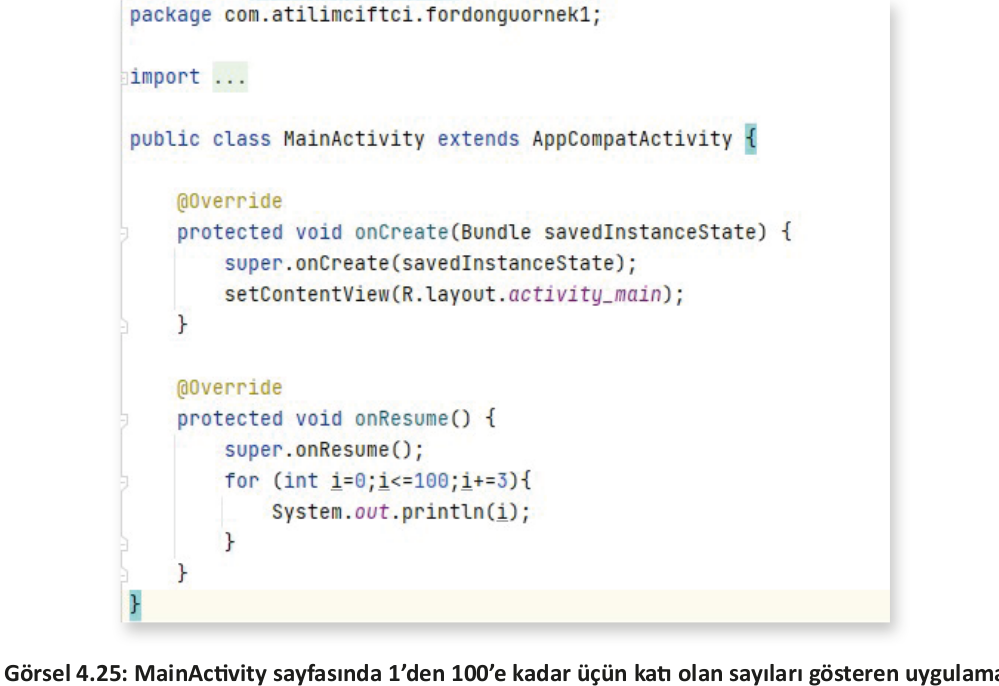
</div>

**4. Adım:** Uygulamayı çalıştırdığınızda Logcat ekranını açınız. Arama çubuğuna "System.out" yazarak çıkan sonuçları filtreleyiniz. Tek satır kod yazılmasına rağmen (System.out.println(i)) kodun tekrar tekrar çalıştığını gözlemleyiniz (Görsel 4.26).
<div style="display:block;text-align:center">

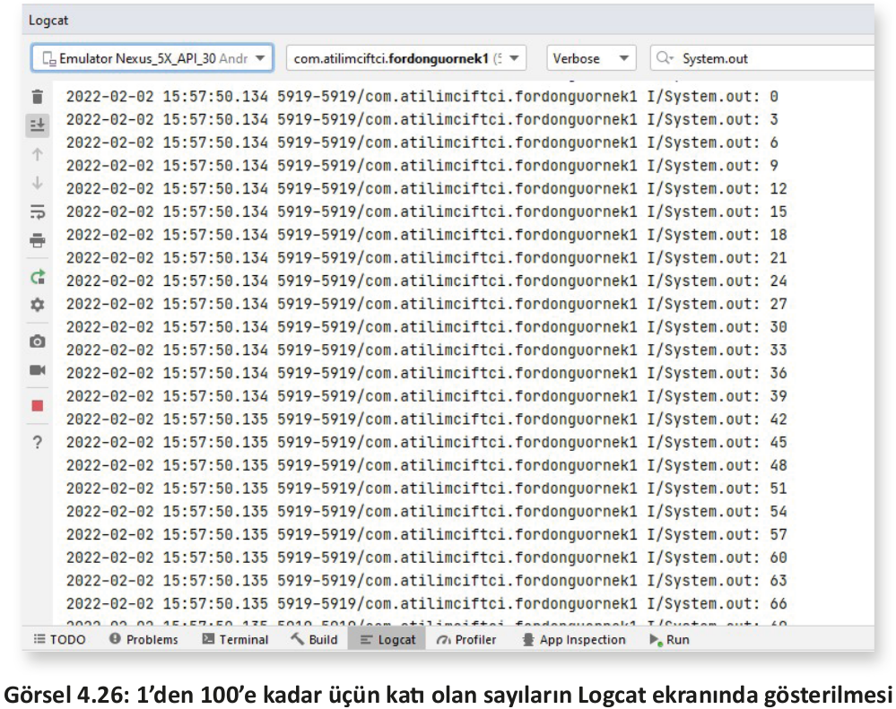
</div>

**2. Yöntem**

**1. Adım**: File>New>New Project sekmesinden yeni proje açınız ve Empty Activity seçiniz.

**2. Adım**: MainActivity sınıfını açınız . "onResume" yaşam döngüsü metodunu oluşturunuz.

**3. Adım**: Yaşam döngüsünün içine bir for döngüsü oluşturunuz . Sayacı 0’dan başlatıp sayaç
100’den küçük veya 100’e eşit oldukça blok içindeki kodları çalıştıran ve her defasında sayacı 1
sayı artıran olacak şekilde düzenleyiniz (Görsel 4.25).

**4. Adım**: for döngüsünün blokları arasına if karar yapısı oluşturunuz. Gelen her "i" sayacının 3 ile modunu aldırınız. İşlemin sonucu "0" olduğu takdirde ekrana yazdırma işlemi yapacak kodu yazınız (Görsel 4.27).
<div style="display:block;text-align:center">

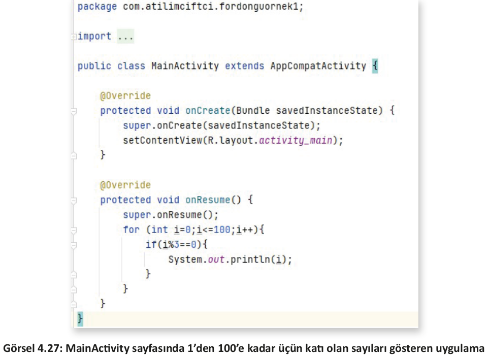
</div>

**5. Adım:** Uygulamayı çalıştırdığınızda Logcat ekranını açınız. Arama çubuğuna "System.out" yazarak çıkan sonuçları filtreleyiniz. Gelen sonucun Görsel 4.26 ile aynı şekilde olduğunu gözlemleyiniz.

**NOT:**

>Uygulama geliştirme aşamasında uygulanabilecek birden fazla yöntem vardır. Bu yöntemler aynı sonuca götürse de bunların bazısı daha uygun çalışmaya sahiptir. Sekizinci uygulamada yazılan for döngüsü 1. yöntemde 34 defa çalışırken 2. yöntemde 101 defa çalışır.

**9. UYGULAMA**: İşlem adımlarına göre mobil ekrandaki üç adet Button ile seçecek şekilde 0’dan 15’e kadar olan sayıların çift olanlarını, tek olanlarını ve hepsini alt alta yazdıran uygulamayı tasarlayınız.

**1. Adım**: File>New>New Project sekmesinden yeni proje açınız ve Empty Activity seçiniz.

**2. Adım**: Görsel 4.28’de görülen ekran tasarımını yapınız. Üst tarafta bir "Multiline Text" yer alır. Alt tarafta da üç adet button bulunur. Multiline Text’in "ConstraintLayout"ununu uygulama penceresine soldan ve sağdan yerleştirip 8 dp boşluk bırakınız. Yukarıdan da ekranın üstüne bağlayarak 8 dp boşluk bırakınız. "layout_width" özelliğine (genişlik özelliği) tamamını kaplaması için "match_parent" yazınız. Yükseklik değeri olan "layout_height" özelliğine ise yazıldığı kadar genişlemesini sağlayan "wrap_content" yazınız.
<div style="display:block;text-align:center">

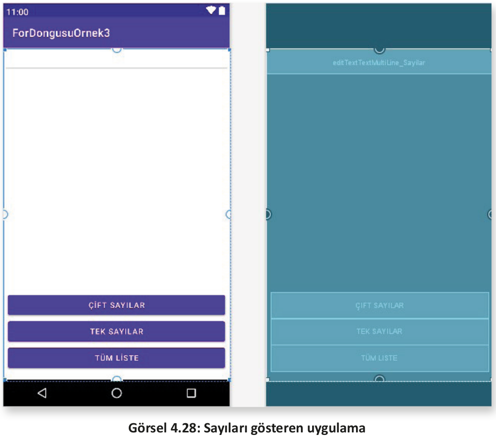
</div>

**3. Adım**: Buttonları da ekleyerek aynı şekilde genişlik özelliği olan "layout_width"e "match_parent", yükseklik özelliği olan "layout_height"e "wrap_content" yazınız. En alttaki buttonu yerleşimin alt çerçevesine bağlayıp 16 dp boşluk bırakınız. Soldan ve sağdan da 8 dp boşluk bırakarak yan çerçeveye sabitleyiniz. Diğer buttonları da sırasıyla birbirine bağlayarak hizalama işlemini bitiriniz.

**4. Adım**: Multiline Text’in id özelliğini "editTextTextMultiLine_Sayilar" şeklinde veriniz. Buttonların id özelliklerini de sırasıyla "button_CiftSayilar", "button_TekSayilar", "button_TumSayilar" şeklinde değiştiriniz. Ayrıca buttonların "onClick" özelliklerine üstten sırayla "ciftSayilar", "tekSayilar", "tumSayilar" olacak şekilde yazınız.

**5. Adım:** EditTexti ve buttonları tanımlayarak başlatmasını (initialize) onCreate metodunda yapınız (Görsel 4.29).
<div style="display:block;text-align:center">

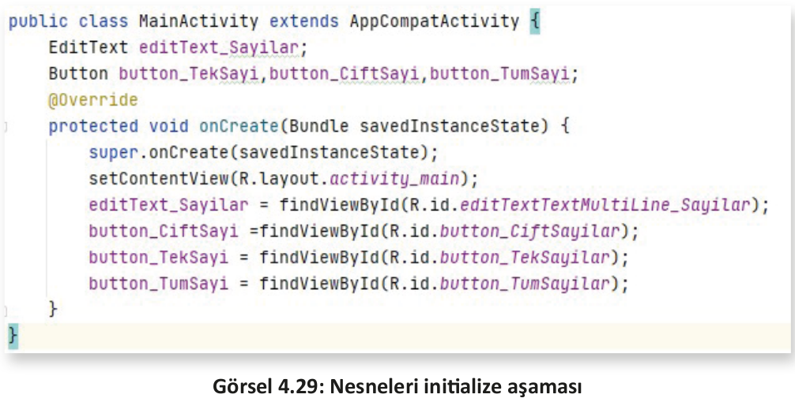
</div>

**6. Adım**: Buttonlara ait üç adet metodu yazınız.

**7. Adım**: Çift sayılar için yazılan metodun blokları arasına Multiline Text’i temizlemesi için gereken "`editText_Sayilar.setText("");`" kodunu yazınız. Bu komut, her button farklı bir amacı aynı Text üzerinde yapacağı için gereklidir. Ardından 0’dan 15’e kadar sayacı birer birer artırarak 16 defa dönen bir döngü açınız ve içinde if şart yapısını oluşturunuz. Sayacın modunu alınız . İşlem sonucu sıfıra eşit olursa modu alınan sayacın çift olduğu anlamına gelir. Sayaç çift olduğunda ekrana sayıyı yazmasını isteyiniz (Görsel 4.30).
<div style="display:block;text-align:center">

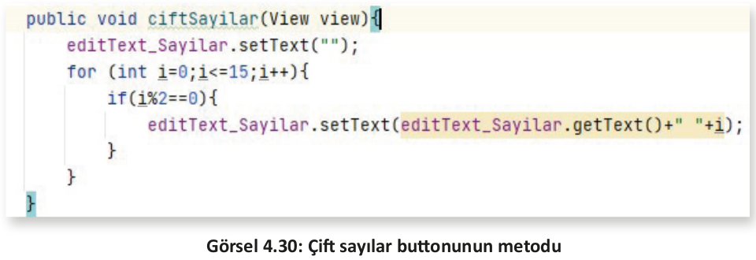
</div>

**8. Adım:** Yedinci adımdaki gibi tek sayılar buttonu için de bir metot yazınız. Bu metot içinde çift sayılar metoduna göre sadece şart ifadesi değişecektir. Şart ifadesini "mod işlemi sonucu 0’dan farklı olursa" şeklinde düzenleyerek tek olan sayıları gösteriniz (Görsel 4.31).
<div style="display:block;text-align:center">

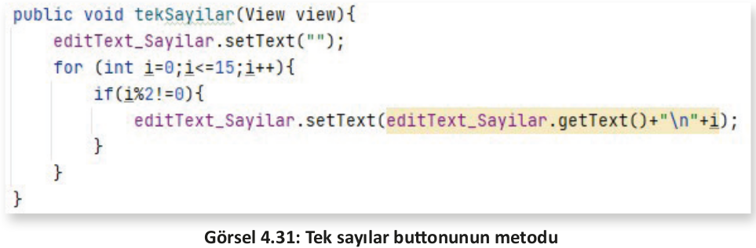
</div>

**9. Adım:** Yedinci adımdaki gibi tüm sayılar buttonu için de bir metot hazırlayınız . Bu metot içinde hiç şart ifadesi yazmayınız. Döngü içindeki tüm sayıları Multi Text’te gösteriniz (Görsel 4.32).
<div style="display:block;text-align:center">

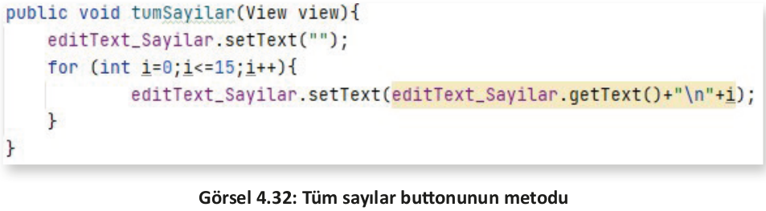
</div>

**10. Adım:** Tüm adımlar yapıldığına göre uygulamayı çalıştırınız. Uygulama çalıştırıldığında ve buttonlara tıklandığında çıkan sonuçlar da Görsel 4.33’te verilmiştir. Oluşturulan MainActivity’nin son şekli Görsel 4.34’te görülür.

**UYARI:** View, Button, EditTextlerden birinin altı kırmızı çizgi ile çizilmişse ona ait sınıf MainActivity içine import edilmelidir. Bu işlem için uyarı verilen yazının üstüne gelinip **Alt+Enter** tuşlarına birlikte basılırsa çözüm sağlanır.

**NOT:**

>"break" komutu tıpkı switch-case karar yapısında olduğu gibi burada da blok kırma görevinde yer alır. Döngünün belirli bir şarta bağlı olarak zamanından önce bitirilmesi istenirse "break" komutu aynı şekilde kullanılabilir. Örneğin bu komut sayesinde veri tabanında 10.000 kişinin yer aldığı bir listede T.C. Kimlik Numarası ile arama yapılırsa ve aranan kayıt tüm liste bitirilmeden bulunursa listenin devamını aratmaya gerek kalmayacağı için döngü orada bitirilebilir. Bu sayede de gereksiz iş yükü önlenir.
<div style="display:block;text-align:center">

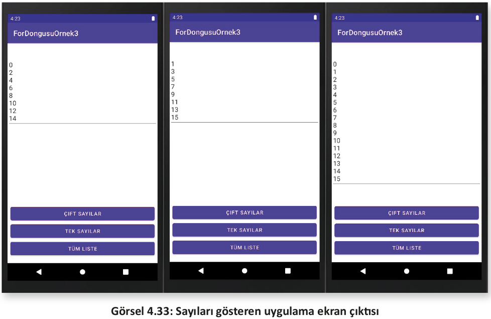
</div>
<div style="display:block;text-align:center">

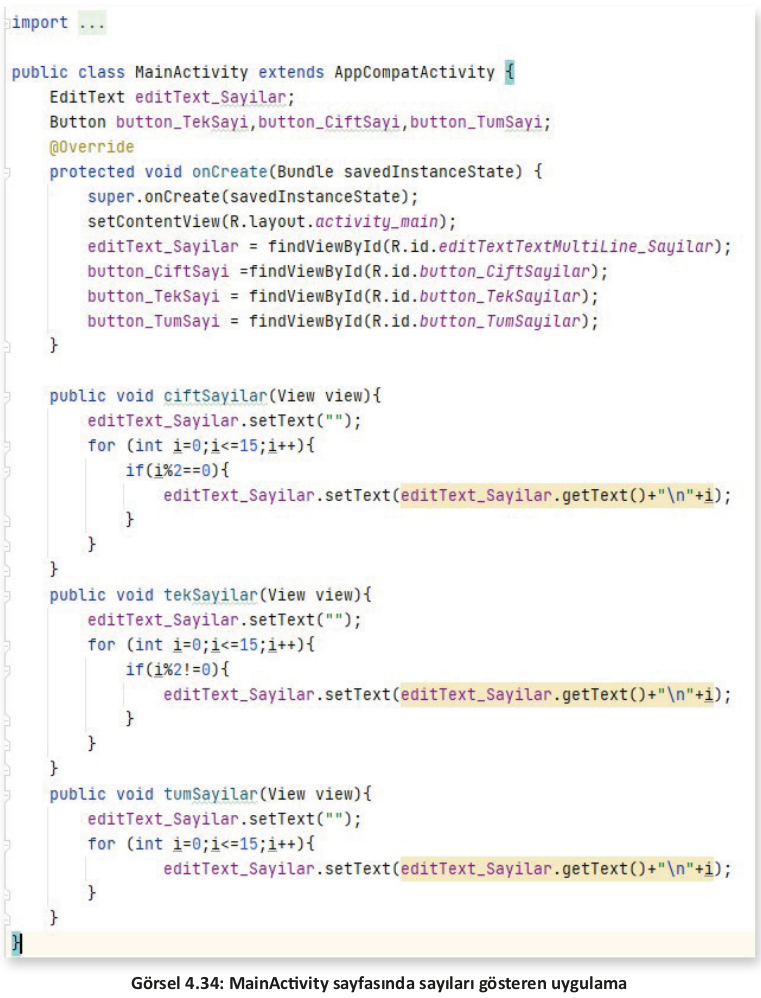
</div>

>**SIRA SİZDE:**
>
>Dokuzuncu uygulamadaki ekran tasarımına benzer şekilde 1 ile 100 arasındaki sayılar için "8’e Tam Bölünebilen", "12’ye Tam Bölünebilen" ve "15’e Tam Bölünebilen" sayılar için üç adet Button, sayıları göstermek için de bir adet ListView tasarlayarak uygulamayı geliştiriniz. 
>
>**DEĞERLENDİRME:** 
>
>Çalışmanız aşağıda yer alan kontrol listesi kullanılarak değerlendirilecektir. Çalışmanızı yaparken değerlendirme ölçütlerini dikkate alınız.
>
><div style="text-align:center;"><b>KONTROL LİSTESİ</b></div>
>
>| DEĞERLENDİRME ÖLÇÜTLERİ                                                          | EVET | HAYIR |
>| -------------------------------------------------------------------------------- | ---- | ----- |
>| 1. Palette menüsünü kullanarak istenen üç adet Button ögesini oluşturdu.         |
>| 2. Palette menüsünü kullanarak sayıları göstermek için ListView ögesi oluşturdu. |
>| 3. Ögelerin ConstraintLayout içinde sınırlarını belirledi.                       |
>| 4. Ögeleri yaşam döngüsü içinde initalize etti.                                  |
>| 5. Buttonlara tıklandığında çalışacak metodu hazırladı.                          |
>| 6. for döngü yapısını amacına uygun olarak hazırladı .                           |
>| 7. for içinde if karar yapısını amacına uygun olacak bir biçimde oluşturdu.      |
>| 8. Buttonlara tıklandığında ListView içinde sayıları doğru biçimde gösterdi.     |

<h2 id= "4.2.3.">4.2.3. while Döngüsü</h2>

Bir veya birden fazla kod blokunun belirtilen şart sağlandığı sürece tekrar ettiği döngü yapısıdır. while içinde belirtilen şart sonucu **true** olduğu sürece bloklar (kaşlı ayraç içi) arasındaki kod tekrar tekrar çalışır. Bu döngü yapısında sayaç, for döngü yapısında olduğu gibi parantez içinde belirtilmez . while yapısından önce sayacın tanımlanması gerekir. Ayrıca sayacı artırma veya azaltma işlemleri de blok içindeki kodlarla birlikte yapılır. Bu nedenle de for döngüsünden ayrışır.Döngü yapısı, for döngüsüne göre daha esnek biçimde kurulur.

Yapının oluşturulması genellikle aşağıdaki şekilde olduğu gibi yapılır. Sayacı artırma veya azaltma
işlemleri unutulursa çok kolay bir biçimde sonsuz bir döngüye girecek ve mantık hatasına neden
olabilecek bir tasarım yapısı bulunur.

```java
//sayaç tanımlaması
while(şart)
{
    //kodlar
    //Sayaç artırma veya azaltma
}
```

**10. UYGULAMA:** İşlem adımlarına göre mobil uygulama ekranındaki EditTextNumber objesine girilen sayının faktöriyelini hesaplayan bir uygulama tasarlayınız .

**NOT:**

>Bir sayının faktöriyeli, 1’den o sayıya kadar olan tüm sayıların çarpılması ile oluşur. Örneğin 5’in faktöriyeli, 1 x 2 x 3 x 4 x 5 = 120 şeklinde ifade edilebilir.

**1. Adım:** Görsel 4.35’teki uygulama ekranını tasarlayınız. Bu tasarım ekranında bir adet EditTextNumber objesi, bir adet Button ve bir adet TextView bulunur. EditTextNumber objesinin id’sini editTextNumber_Sayi şeklinde, onayla buttonunun id’sini button_Onayla şeklinde, TextView’in id’sini de textView_Sonuc şeklinde yapınız. EditTextNumber objesinin hint özelliğine "Sayınızı Giriniz" şeklinde yazı yazınız. Buttonun da text özelliğine "ONAYLA" şeklinde, TextView’in text özelliğine de "Sonuç :" şeklinde yazınız. Button tıklandığında çalışacak olan metodu aktif etmek için buttonun onClick özelliğine "onayla" ifadesi ekleyiniz.
<div style="display:block;text-align:center">

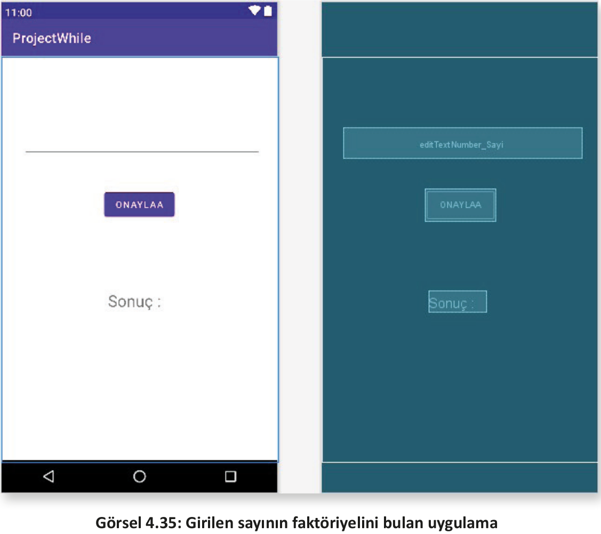
</div>

```java
EditText number;
Button button;
TextView textView;

@Override
protected void onCreate(Bundle savedInstanceState) {
    super.onCreate(savedInstanceState);
    setContentView(R.layout.activity_main);
    number = findViewById(R.id.editTextNumber_Sayi);
    button = findViewById(R.id.button_Onayla);
    textView = findViewById(R.id.textView_Sonuc);
}
```

**3. Adım:** Button tıklandığı zaman çalışacak olan onayla isimli metodu tanımlayınız. Metodun içine EditTexte girilen sayı değerini okuması için integer bir değişken tasarlayınız. Bu değişkeni de EditTextten okuttuğunuz veriyi integer veri tipine çevirerek doldurunuz.

```java
public void onayla(View view) {
    int sayi = Integer.parseInt(number.getText().toString());
}
```

**4. Adım**: Tanımlanan **sayi** değişkeninin altında **sayac** ve **sonuc** isimli iki adet değişken tanımlayınız. Değişkenlerden sayac int veri tipinde tanımlanıp içine 1 değeri atanırken, sonuc isimli değişken long veri tipinde tanımlanarak içine 1 değeri atanır. Özellikle 10’dan sonra girilebilecek her değer oldukça büyük sonuçlar döndürür. Ayrıca çarpmada 0 yutan eleman olduğu için de sonucun ilk değeri 1 olarak girilir.

**5. Adım**: while döngüsünü hazırlayınız . Bu döngüyü oluşturmak için while yazıp parantezlerini açınız. Parantezin içine şart olarak **"sayac<=sayi"** şeklinde yazınız. Burada sayaç 1’den başlayarak (ilk çarpım değeri 1 olacağı için) girilen sayı değerine eşit oluncaya kadar döner. while döngüsünün blokları içinde ise **"sonuc= sonuc*sayac"** yazarak, her bir dönmede sonuç değeri ile sayaç değerini çarpıp tekrar sonucun içine atmayı sağlayınız. Bloklar içindeyken sayacı bir artırıp işleme devam ediniz.

**6. Adım**: while döngüsünün dışına çıkarak textView ögesinin setText metodunda sonucu göstermesi için "onayla" metodunun içinde fakat while döngüsü dışında **"textView.setText("Sonuç:" + sonuc);"** kodunu ekleyiniz.

```java
public void onayla(View view) {
    int sayi = Integer.parseInt(number.getText().toString());
    int sayac = 1;
    long sonuc = 1;
    while(sayac <= sayi){
        sonuc = sonuc * sayac;
        sayac++;
    }
    textView.setText("Sonuç: "+sonuc);
}
```

MainActivity’nin son hâli Görsel 4.36’da yer alırken uygulamanın son çıktısı Görsel 4.37’de gösterildiği şekilde olacaktır.
<div style="display:block;text-align:center">

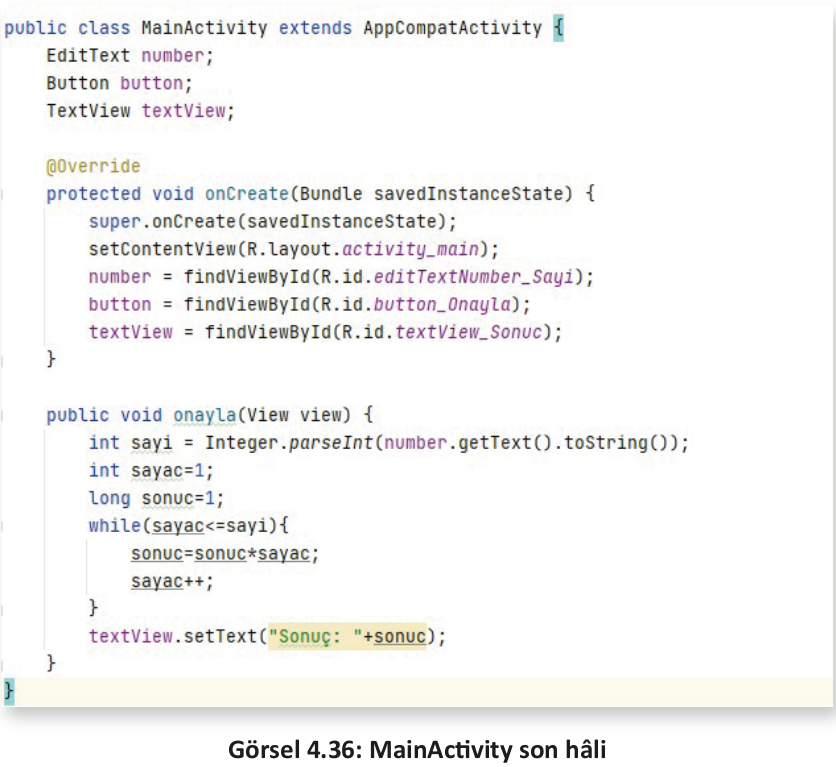
</div>
<div style="display:block;text-align:center">

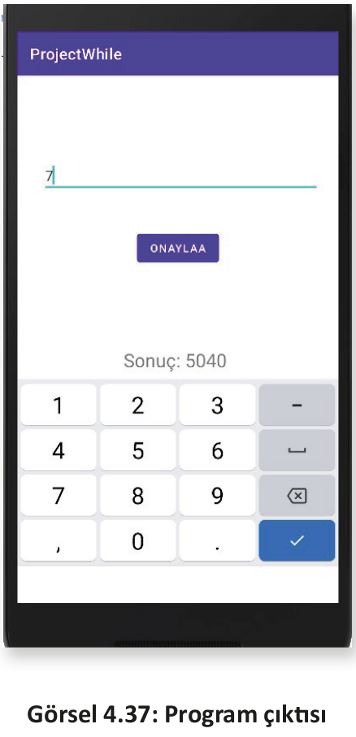
</div>

**NOT:**

>Bu ve diğer uygulamalarda textView.setText metodunun içinde sadece int değer yazdırılmak istenirse uygulama çöker. Java yazılım dilinde bunu yapabilmenin yolu, String ifadeye integer ifadenin eklenmesidir. Bu nedenle sadece sonuç olarak gösterilmek istenirse setText parantezi içine **"" + sonuc** şeklinde belirtilmelidir.

<h2 id="4.2.4.">4.2.4. do-while Döngüsü</h2>

Bu döngü yapısı aslında **while** döngüsüne çok benzer . Tek fark, while döngüsünde blok içinde yazılan kodlar şarta bağlı olarak çalıştığı için şart sağlanmadıkça döngü çalışmaz. Doğal olarak döngünün hiç çalışmama ihtimali vardır. Yapı gereği **do-while** döngüsü ise blok içine yazılan kodları en az bir defa çalıştırır ve sonrasında şarta bakar. Şart sağlandığı sürece döngü çalışmaya devam eder. Bir başka deyişle do-while döngüsü, blokları arasındaki kodları en az bir defa çalıştırırken while döngüsü, blokları arasındaki kodları şart sonucu true olmazsa çalıştırmaz. 

do-while döngüsünün yapısı aşağıda gösterildiği şekildedir. while döngü yapısında olduğu gibi sayaç, do ifadesinden önce tanımlanır ve yapıya ait bloklar içinde artırma veya azaltma işlemi gerçekleştirilir. Kodlar çalıştırıldıktan sonra şart incelenir ve şart sonucu true gelirse tekrar do ifadesine dönerek işlem yeniden gerçekleştirilir.

```java
do
{
    //kodlar
}while(şart);
```

**NOT:**

>do-while döngü yapısında diğer yapılardan farklı olarak ";" işareti kullanılır. while ifadesinin şart sonu ";" işaretiyle ile bitirilir.