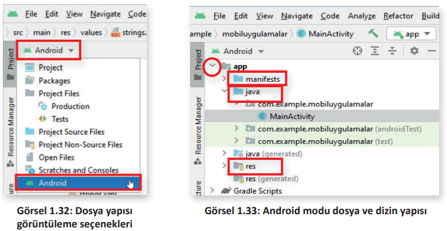
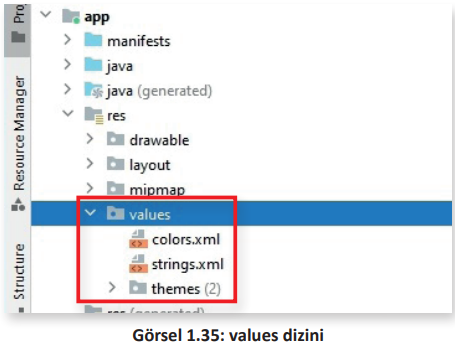

<h1 style="color:#cd2d98;">1.5. DOSYA VE DİZİN YAPILARI</h1>

Android uygulama geliştirilmeye başlanmadan önce temel dosya ve dizin yapıları iyi bilinmelidir. Bir Android projenin dosya yapısı farklı biçimlerde görüntülenebilir.

Mobil uygulama geliştirme ortamı ekranının sol üst köşesindeki düğmeye tıklandığında açılan seçim kutusunda yer alan dosya hiyerarşisi görüntüleme biçimlerinden biri tercih edilebilir. Varsayılan olarak gelen ve Android uygulama geliştirme için kullanımı en kolay olan "Android" modudur (Görsel 1.32).

"Android" modu seçildikten sonra Görsel 1.33’teki dosya ve dizin yapısı pencerenin sol üst kenarında görüntülenir.

Görsel 1.33’te yer alan daire içindeki simge tıklandığında dizinin içeriği görüntülenebilir. Aynı simge tıklandığında görüntülenen içerik kapatılır. Bir Android uygulamasındaki üç temel dizin şunlardır:

1. **manifests**: Bu dizin içinde AndroidManifest.xml dosyası yer alır. Bu dosyada proje ayar parametreleri, izinler, servisler ve ek kütüphaneler bulunur.

2. **java**: Java programlama dilinde yazılmış kaynak kodlar bu dizinde yer alır. "MainActivity. java" isimli dosya otomatik olarak oluşturulur. Activityler ana Java sınıflarıdır, içeriğinde geliştirilecek uygulamanın ne yapacağını belirten Android kodlar bulunur.

3. **res**: Kaynak dosyaları bu dizinde yer alır. Kaynak kod dosyaları dışında projenin ihtiyaç duyduğu resim, müzik vb. dosyalar bu dizinde bulunur. Bu dizin içinde uygulamada kullanılacak resimlerin bulunduğu drawable dizini, uygulamanın nasıl görüneceğini belirleyen layout dizini ve temel değerleri tutan values dizini yer alır.

- **drawable (Çizilebilir):** Uygulamada kullanılacak resimleri içeren dizindir.

- **layout (Yerleşim):** Uygulamanın nasıl görüneceğini belirleyen xml dosyası bu dizinde yer alır (Görsel 1.34).

- **values (Değerler):** Basit değerleri (metinler, tam sayılar, renkler vb.) içeren xml dosyalarıdır (Görsel 1.35). res/ alt dizininde yer alan XML kaynak dosyaları XML adına göre tek bir kaynak tanımlarken values/ dizinindeki dosyalar birden fazla kaynağı tanımlar. Bu dizinde oluşturulabilecek kaynaklar için bazı dosya adı kuralları şunlardır:
    - arrays.xml diziler için
    - colors.xml renk değerleri için
    - dimens.xml boyut değerleri için
    - strings.xml metin değerler için
    - styles.xml stiller için

