# 6.5. FRAGMENT YAPISI

Mobil uygulama geliştirirken çoklu aktivite ile birden fazla sayfa kullanmak yerine tek Activity içinde birden fazla sayfa kullanmak mümkündür. Bu tasarımı ortaya koyan yapıya Fragment denir. Bu yapılar alt Activity gibi düşünülebilir. Fragment yapılarının da tıpkı aktiviteler gibi kendine ait bir yaşam döngüsü vardır (Görsel 6.54).

<div style='display:block;text-align:center'>

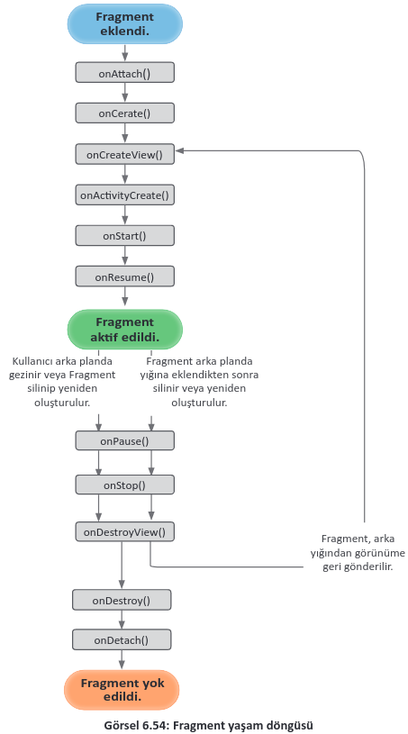
</div>

Görseldeki metotlardan çoğu, Activity yaşam döngülerindeki metotlarla aynı işleve sahiptir. Farklı
olan onAttach(), onCreateView(), onDestroyView() metotlarının açıklaması şu şekildedir:
- **onAttach()**: Mobil uygulama için sistem hiçbir şey yaratmadan önce bu metot çağrılır ve Fragment için yer ayrılır.
- **onCreateView()**: Bir Fragment’ı oluştururken layout tanımı yapmak için bu metot kullanılır. Fragment’ı ayakta tutmak için kullanılan tek callback metodu budur. Burada view değişkenleri atanabilir.
- **onActivityCreated()**: Her şey tamamlandıktan sonra en son başlatılması istenen işlemler için kullanılan metottur. onCreateView() metodundan hemen sonra çalıştırılır.

Her Fragment’in kendine özel bir sınıfı ve kendine özel de bir layout dosyası vardır. Ayrıca Fragment oluşturmanın da birden fazla yöntemi bulunur.

**18. UYGULAMA:** İşlem adımlarına göre bir Activity içinde bulunan iki adet buttondan birincisine tıklandığında birinci Fragment’i açıp ekranda "1.Fragment Ekranı", ikincisine tıklanınca da ikinci Fragment’i açarak "2. Fragment Ekranı" yazan uygulamayı tasarlayınız (Görsel 6.55).

**1. Adım**: Yeni bir proje açınız ve Empty Activity seçiniz.

**2. Adım**: "activity_main.xml" layout dosyasını açınız ve Code ekranına geçiniz. Gerekli tüm eklemeleri Code ekranında yapınız.

<div style='display:block;text-align:center'>

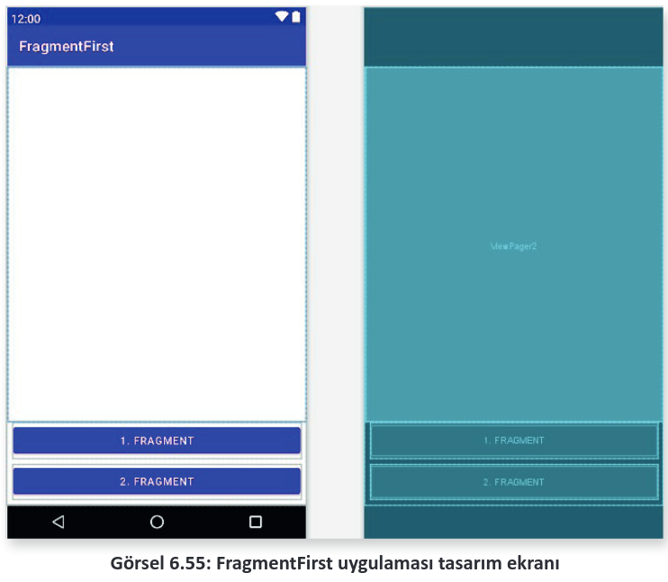
</div>

**3. Adım:** "constraintlayout" olarak devam edecek kodlama yapılacaktır. Kodlama sonucunda Görsel 6.56’daki kodlama yapısı oluşturulmalıdır. Code ekranında constraintlayout arasına girerek önce "1. Fragment" buttonunu sonra da "2. Fragment" buttonunu oluşturunuz. Her button oluşturma işleminde genişlik, yükseklik, id, onClick, constraintlayout yerleşimleri, boşluk ayarları tek tek kodla yazılır. Görsel 6.56’da açıklamaları mevcut olan ve "2. Fragment" buttonunu oluşturmak için yazılan kodlar şunlardır:

```xml
<Button
    android:id="@+id/button_IkinciFragment"
    android:layout_width="match_parent"
    android:layout_height="wrap_content"
    android:layout_marginLeft="8dp"
    android:layout_marginRight="8dp"
    android:layout_marginBottom="8dp"
    android:onClick="fragment2Gecis"
    android:text="2. Fragment"
    app:layout_constraintBottom_toBottomOf="parent"
    app:layout_constraintLeft_toLeftOf="parent"
    app:layout_constraintRight_toRightOf="parent">
</Button>
```

<div style='display:block;text-align:center'>

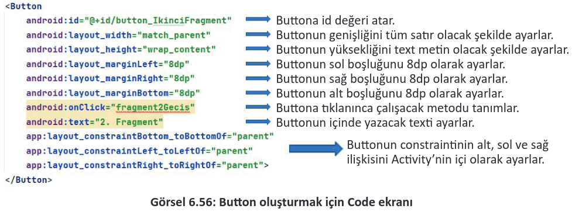
</div>

**4. Adım:** "1. Fragment" isimli buttonu oluşturmak için şu kodları constraintlayout içine yazınız:

```xml
<Button
    android:id="@+id/button_IlkFragment"
    android:layout_width="match_parent"
    android:layout_height="wrap_content"
    android:onClick="fragment1Gecis"
    android:text="1. Fragment"
    android:layout_marginBottom="8dp"
    android:layout_marginRight="8dp"
    android:layout_marginLeft="8dp"
    app:layout_constraintBottom_toTopOf="@id/button_IkinciFragment"
    app:layout_constraintLeft_toLeftOf="@id/button_IkinciFragment"
    app:layout_constraintRight_toRightOf="@id/button_IkinciFragment">
</Button>
```

**5. Adım:** Mobil uygulama ekranının altında iki adet button oluşturulduğuna göre bu buttonlara tıklandığı zaman değişecek Fragment ekranını tasarlanan buttonlar üzerine yerleştiriniz. Uygulama içinde tek bir Activity bulunur. Bu Activity içinde de değişen Fragment ekranları vardır. Değişen Fragment ekranlarının içinde bulunduğu bir layout eklenmesi gerekir. Eklenecek layout içinde tek bir öge bulunacağı için "framelayout," tasarımı yapılır. Oluşturulması istenen framelayout için constraintlayout kodları arasına giriniz ve şu kodları yazınız:

```xml
<FrameLayout
    android:layout_width="match_parent"
    android:layout_height="490dp"
    android:id="@+id/frameLayout_Main"
    app:layout_constraintBottom_toTopOf="@+id/button_IlkFragment"
    app:layout_constraintEnd_toEndOf="parent"
    app:layout_constraintStart_toStartOf="parent"
    app:layout_constraintTop_toTopOf="parent">
</FrameLayout>
```

**NOT:**

>İç içe layout oluşturulabilir. Uygulamada da constraintlayout içinde bir framelayout oluşturulur. Ayrıca oluşturulan framelayoutun yüksekliği Split ekranında kontrol edilerek yazılır. Burada 490 dp verilmiştir. Framelayout yapısı, mobil ekranın başlangıcından buttonun olduğu bölmeye kadardır. Görsel 6.57’de tasarımın son hâli bulunur. Bu tasarım için kodlar şu şekildedir:

<div style='display:block;text-align:center'>

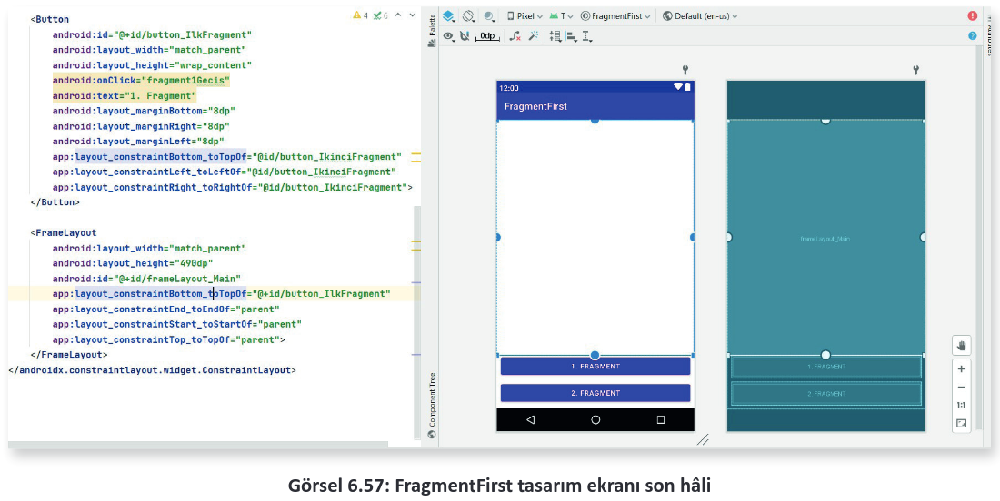
</div>

**NOT:**

>Tasarım ekranında detaylı çalışma için hem Code hem Desing hem de Split ekranlarda çalışılır. Sekizinci uygulama bu nedenle Code ekranında tasarlanmış ve Split ekranda tasarımlar kontrol edilmiştir.

<div style='display:block;text-align:center'>

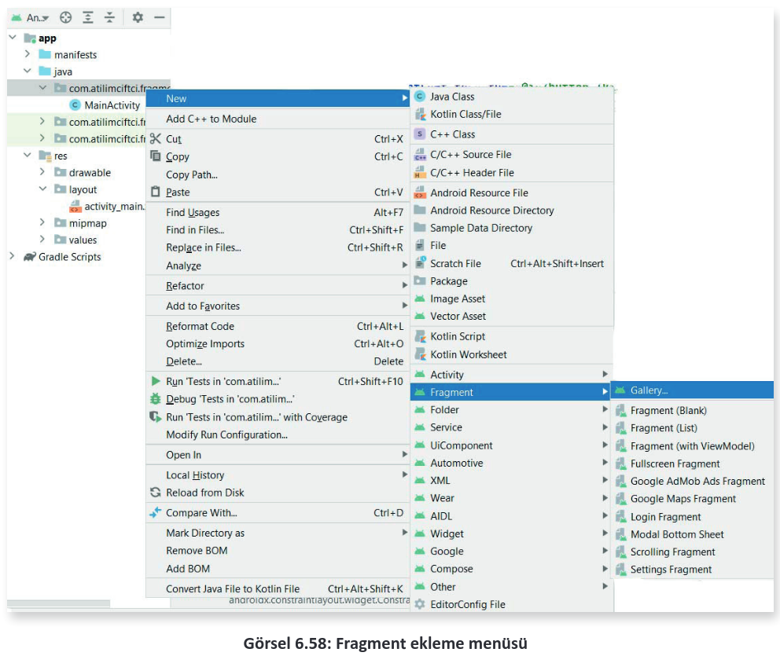
</div>

**6. Adım:** Fragment için bir sınıf bir de layout açılacaktır. Bu işlem tek tek sınıf ve layout oluşturup bağlanarak veya Görsel 6.58’de görüldüğü gibi otomatik olarak yapılabilir. Otomatik olarak Fragment oluşturmak için paket ismine mouse sağ tuşu ile tıklayınız. New sekmesinden Fragment sekmesine geliniz. Gallery seçeneğinden tüm Fragment seçenekleri görülebileceği gibi alt seçeneklerden uygun olanlardan biri de seçilebilir. Bu uygulamada Fragment’in içeriğini tam olarak anlayabilmek adına tek tek class ve layout ekleyerek sayfalar oluşturulacaktır. Bunun için de paket ismine sağ tuş ile tıklayıp **New>Java Class** seçeneğini seçiniz ve ismine de "BirinciFragment" giriniz. Aynı işlemi tekrar ederek bir sınıf daha oluşturunuz ve ismine de "IkinciFragment" giriniz. Bu sınıfların bağlanacağı layout dosyalarını oluşturmak için de layout klasörüne mouse sağ tuşu ile tıklayarak **New>Layout Resource** File seçeneğini tıklayınız ve "fragment_birinci" isminde layout dosyası oluşturunuz. Aynı işlemi tekrar ederek "fragment_ikinci" isminde de bir layout daha oluşturunuz. İşlem sonucu Görsel 6.59’da verilmiştir.

<div style='display:block;text-align:center'>

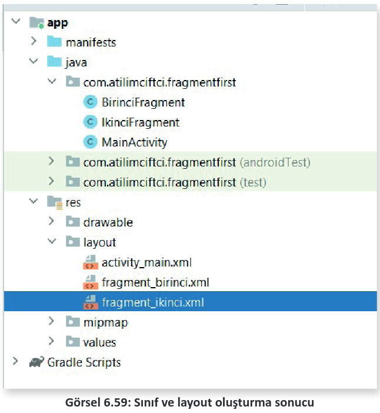
</div>

```java
public class BirinciFragment extends Fragment {
    @Nullable
    @Override
    public View onCreateView(@NonNull LayoutInflater inflater, @Nullable ViewGroup container, @Nullable Bundle savedInstanceState) {
        return inflater.inflate(R.layout.fragment_birinci,container,false);
    }
}
```

**7. Adım:** Oluşturulan sınıfı ve layout dosyalarını birbirine bağlamak için "BirinciFragment" sınıfına girerek bunu Fragment sınıfına extends ediniz. **Extends** işlemi sonucunda onCerateView() yaşam döngüsü oluşturulup burada layouta bağlanır. Metodu oluşturmak için sınıf bloklarının içinde "onCreateView" yazınız ve önerilen koda Enter tuşu ile basınız. Burada "`return super. onCreateView(inflater, container, savedInstanceState);`" satırını siliniz. Sildiğiniz kodun yerine "`return inflater.inflate(R.layout.fragment_birinci,container,false);`" kodunu ekleyiniz. Aynı işlemi "IkinciFragment" için de tekrarlayarak "fragment_ikinci" isimli layouta bağlayınız.

**8. Adım:** Activitye Fragment’lerin eklenmesi için "FragmentManager" isimli bir yönetici sınıfı kullanılır. Öncelikle Fragment’leri ayırabilmek için "fragment_birinci" isimli layout dosyasına giderek Code ekranına geçiniz ve constraintlayout içinde bir adet ImageView bir adet de TextView oluşturunuz. Oluşum bittikten sonra ImageViewe sağ tuş tıklayarak "Set Sample Data" seçeneğinden bir resim ekleyiniz (Görsel 6.60).

```xml
<ImageView
    android:layout_width="200dp"
    android:layout_height="200dp"
    android:id="@+id/imageViewFr1"
    android:layout_marginTop="25dp"
    app:layout_constraintLeft_toLeftOf="parent"
    app:layout_constraintRight_toRightOf="parent"
    app:layout_constraintTop_toTopOf="parent"
    ></ImageView>
<TextView
    android:layout_width="match_parent"
    android:layout_height="wrap_content"
    android:id="@+id/textViewFr1"
    app:layout_constraintLeft_toLeftOf="@id/imageViewFr1"
    app:layout_constraintRight_toRightOf="@id/imageViewFr1"
    app:layout_constraintTop_toBottomOf="@id/imageViewFr1"
    android:layout_marginTop="25dp"
    android:layout_marginLeft="8dp"
    android:layout_marginRight="8dp"
    android:text="Fragment 1 İçinde"
    android:textAlignment="center"
    android:textSize="28sp"
    android:textStyle="bold"
    ></TextView>
```

<div style='display:block;text-align:center'>

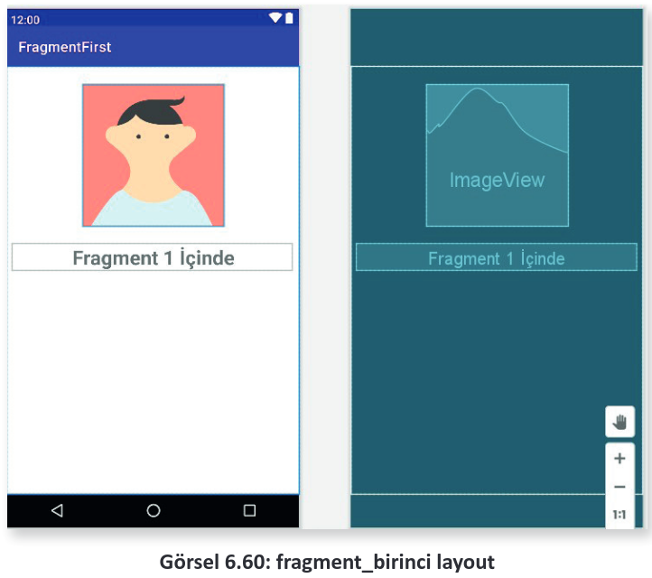
</div>

**9. Adım:** Benzer biçimde "fragment_ikinci" isimli layoutta da dosya oluşturunuz.

```xml
<ImageView
    android:id="@+id/imageViewFr2"
    android:layout_width="200dp"
    android:layout_height="200dp"
    android:layout_marginTop="25dp"
    app:layout_constraintLeft_toLeftOf="parent"
    app:layout_constraintRight_toRightOf="parent"
    app:layout_constraintTop_toTopOf="parent"
    tools:srcCompat="@tools:sample/avatars[1]"/>
<TextView
    android:id="@+id/textViewFr2"
    android:layout_width="match_parent"
    android:layout_height="wrap_content"
    android:text="Fragment 2 İçinde"
    android:textAlignment="center"
    android:textSize="28sp"
    android:textStyle="bold"
    android:layout_marginTop="25dp"
    android:layout_marginLeft="8dp"
    android:layout_marginRight="8dp"
    app:layout_constraintEnd_toEndOf="@+id/imageViewFr2"
    app:layout_constraintStart_toStartOf="@+id/imageViewFr2"
    app:layout_constraintTop_toBottomOf="@+id/imageViewFr2"/>
```

**10. Adım:** MainActivity sınıfına giderek buttonlar tıklandığında çalışacak metotları oluşturunuz. Fragment’leri aktivitelere bağlamak için FragmentManager’dan bir nesne oluşturunuz ve getSupportFragment ile içeriğini getiriniz. "FragmentTransaction" sınıfını kullanarak oluşturulan nesneyi başlatınız. Ardından BirinciFragment sınıfından bir nesne türetip bu Fragment nerede gösterilecekse (Uygulama için MainActivity’de FrameLayout’ta gösterilecektir.) orayı FragmentTransaction’a eklemek ve bağlantı kurmak gerekir.

```java
public void fragment1Gecis(View view){
    FragmentManager fragmentManager = getSupportFragmentManager();
    FragmentTransaction fragmentTransaction = fragmentManager.beginTransaction();
    BirinciFragment birinciFragment = new BirinciFragment();
    fragmentTransaction.replace(R.id.frameLayout_Main,birinciFragment);
    fragmentTransaction.commit();
}
```

**11. Adım:** Onuncu adıma benzer durumu fragment2Gecis metodu için de yaparak ikinciFragment’i getiriniz. Daha sonra uygulamayı çalıştırarak denemesini yapınız.

**NOT:**

>Bu uygulamada fragmentTransaction.add metodu da kullanılabilir fakat o durumda iki Fragment üst üste geçer. "replace()" metoduyla yerine yerleştirme yapılır.

```java
public void fragment2Gecis(View view){
    FragmentManager fragmentManager = getSupportFragmentManager();
    FragmentTransaction fragmentTransaction =fragmentManager.beginTransaction();
    IkinciFragment ikinciFragment = new IkinciFragment();
    fragmentTransaction.replace(R.id.frameLayout_Main,ikinciFragment);
    fragmentTransaction.commit();
}
```

**Fragment’ler Arası Veri Paylaşımı:** Aktiviteler arasındaki veri paylaşımında nasıl ki birden fazla aktivite, verilerini birbirine aktarabiliyorsa Fragment’ler de alt aktivite olmalarından ötürü içinde tuttukları bilgileri birbirleriyle paylaşabilir ve işleyebilir. Bu paylaşımı "ViewModel" denilen bir yapı ile sağlarlar. ViewModel, kendine ait bir sınıfı olan yapıdır. Bir Fragment elinde bulundurduğu bilgileri bu yapıya gönderir ve bilgiler sınıf içinde tutulur. Bu sayede de diğer Fragment bu bilgilere ulaşabilir ve kullanıcı için bu bilgileri işleyebilir. ViewModel yapısında da getter ve setter metotları ile çalışılır.

**19. UYGULAMA:** İşlem adımlarına göre TabbedActivity ile oluşturulan Activity içinde iki adet Fragment ile kullanıcı girişi yapan, kullanıcı adı ve şifresi editTextlere doğru girilmesi hâlinde herhangi bir buttona basmadan 2. Fragment’te "Hoşgeldiniz (KullanıcıAdı)" şeklinde belirten uygulamayı mobil uygulama tasarım programında hazırlayınız.

**1. Adım: File>New>New Project** seçeneğinden **TabbedActivity** seçiniz. İsmini de "FragmentDataTransfer" şeklinde oluşturunuz. Oluşan dosyanın yapısı Görsel 6.61’de verilmiştir.

<div style='display:block;text-align:center'>

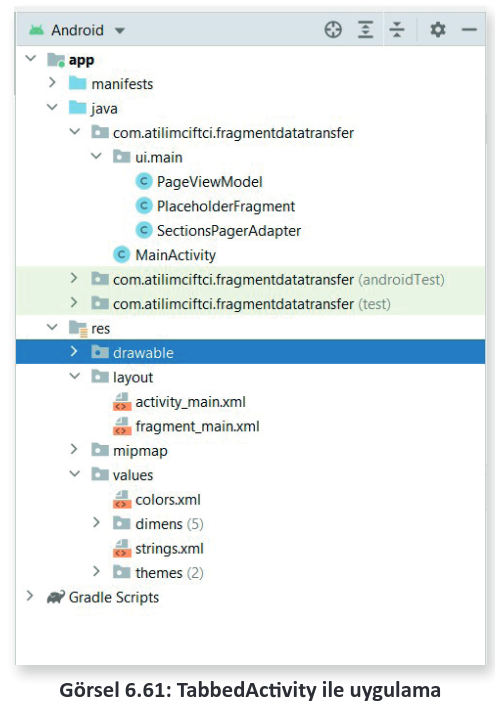
</div>

**NOT:**

>TabbedActivity sıkça kullanılan bir Activity seçeneğidir. Uygulama ekranının üst kısmında oluşan tablardan meydana gelir ve istendiği miktarda tablar artırılabilir. Hazır bir biçimde oluşturulan PageViewModel sınıfı anlık olarak fragmentlerdeki verileri tutmak için tasarlanır. PlaceHolderFragment hazır olarak getirilmiş bir Fragment’tir. SectionPageAdapter ise TabbedActivity’ye ait verilerin tutulduğu bölümdür.

**2. Adım:** İki tabbed nesnesinin altında görünmesi için iki ayrı Fragment oluşturunuz. Bunun için otomatik olarak oluşturmayı seçiniz. **"ui.main"** klasörüne sağ tuş ile tıklayarak **New>Fragment>Fragment(Blank)** seçeneğini seçiniz. İsim olarak "BirinciFragment" diğerine "IkinciFragment" ismini veriniz.
   
**3. Adım:** fragment_birinci.xml içine giriniz. Split ekranını açınız. Oluşturulan FrameLayout etiketini ConstraintsLayout olarak değiştiriniz. İçerikteki TextViewi siliniz. "<span style='color:#00C800; font-weight:bold;'>editText_KullaniciAdi</span>" ve "<span style='color:#00C800'>editText_KullaniciSifresi</span>" id’lerine sahip bir adet kullanıcı adı girişi için, bir adet de kullanıcı şifresi için EditText oluşturunuz (Görsel 6.62).

```xml
<EditText
    android:layout_width="match_parent"
    android:layout_height="wrap_content"
    android:hint="Kullanıcı Adı Giriniz... : "
    android:id="@+id/editText_KullaniciAdi"
    app:layout_constraintLeft_toLeftOf="parent"
    app:layout_constraintRight_toRightOf="parent"
    app:layout_constraintTop_toTopOf="parent"
    android:layout_marginTop="150dp"
    android:layout_marginRight="50dp"
    android:layout_marginLeft="50dp"
    ></EditText>
<EditText
    android:layout_width="match_parent"
    android:layout_height="wrap_content"
    android:id="@+id/editText_KullaniciSifresi"
    app:layout_constraintLeft_toLeftOf="@+id/editText_KullaniciAdi"
    app:layout_constraintRight_toRightOf="@+id/editText_KullaniciAdi"
    app:layout_constraintTop_toBottomOf="@+id/editText_KullaniciAdi"
    android:layout_marginLeft="50dp"
    android:layout_marginRight="50dp"
    android:layout_marginTop="25dp"
    android:hint="Kullanıcı Şifresi Giriniz... :"
    ></EditText>
```

<div style='display:block;text-align:center'>

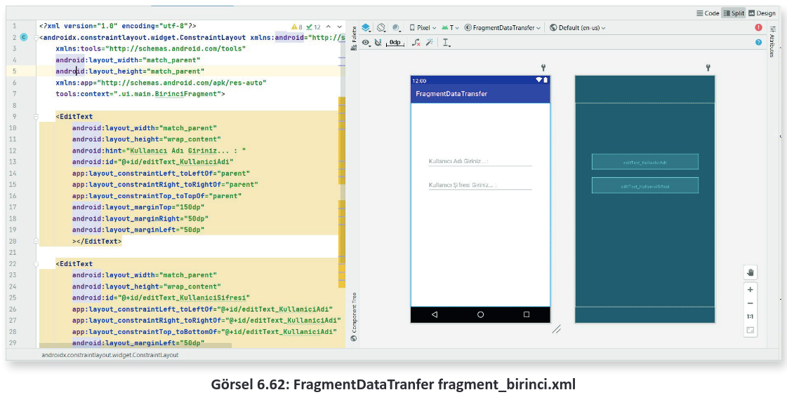
</div>

**4. Adım:** fragment_ikinci.xml içine giriniz. Split ekran tasarımına geçiniz. Kod bölümünden FrameLayout kısmını değiştirip ContraintLayout yapınız. KullanıcıAdını göstermesi için bir adet TextView tasarımı oluşturunuz. Id’si "<span style="color:#00C800;">textView_KullaniciBilgileri</span>" olacaktır. TextView ögesini ekranın sağ üst köşesine konumlandırınız (Görsel 6.63).

```xml
<?xml version="1.0" encoding="utf-8"?>
    <androidx.constraintlayout.widget.ConstraintLayout xmlns:android="http://schemas.android.com/apk/res/android"
    xmlns:tools="http://schemas.android.com/tools"
    android:layout_width="match_parent"
    android:layout_height="match_parent"
    xmlns:app="http://schemas.android.com/apk/res-auto"
    tools:context=".ui.main.IkinciFragment">
    <TextView
        android:layout_width="wrap_content"
        android:layout_height="wrap_content"
        android:id="@+id/textView_KullaniciBilgileri"
        android:hint="Kullanıcı Bilgileri"
        android:textSize="18sp"
        android:textStyle="bold"
        app:layout_constraintTop_toTopOf="parent"
        app:layout_constraintRight_toRightOf="parent"
        android:layout_marginTop="5dp"
        android:layout_marginRight="10dp"
        ></TextView>
</androidx.constraintlayout.widget.ConstraintLayout>
```

<div style='display:block;text-align:center'>

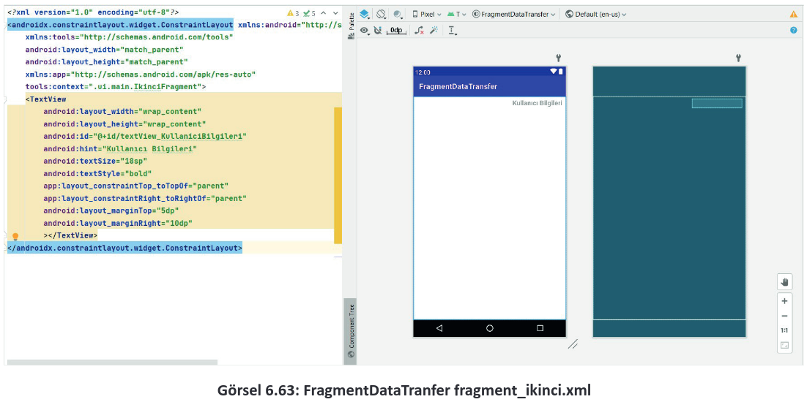
</div>

**5. Adım:** PageViewModel sınıfının içeriğini inceleyiniz. PageViewModel sınıfının içinde "MutableLiveData" ve "LiveData" adı verilen yapılar bulunur. Bu yapılar dışında getter ve setter metotları vardır. Bu yapılar ve metotlar silinip sınıf içeriğini daha iyi anlamak adına PageViewModel sınıfı baştan yazılır. "`public class PageViewModel extends ViewModel { }`" haricinde içerideki tüm metotları siliniz. Ardından kullanıcı adı ve şifresi olarak bir sabit tanımlama yapınız. MutableLi ve Data oluşturarak kullaniciAdi ve kullaniciSifre için new parametresi ile açınız. kullaniciAdi ve kullaniciSifre private olarak tanımlandığı için dışarıdan gönderildiğinde içeriğine değer girecek setter metotları olan setKullaniciAdi ve setKullaniciSifre metotlarını oluşturunuz. LiveData tipinden veri döndüren bir metot tanımlanmalıdır. LiveData, canlı veri anlamına gelir. Bir başka deyişle işlemleri anlık olarak döndürür. private tanımlanan kullaniciAdi ve kullaniciSifre için dışarıdan erişim istendiğinde verileri alabilecek getter metotları olan getKullaniciAdi ve getKullaniciSifre metotlarını hazırlayınız. kullaniciSifrenin aslında fragment_ikinci.xml içinde gösterileceği için bir if kontrol yapısı ile şifre ve kullanıcı adı sorgulanır, doğru ise dönüş yapılır.

**NOT:**

>MutableLiveData, değiştirilebilen canlı veri anlamına gelir. kullaniciAdi ve kullaniciSifresi bu nedenle MutableLiveData\<String> veri tipinde tanımlanır.

```java
public class PageViewModel extends ViewModel {
    private static final String name = "atilimciftci";
    private static final String sifre = "12345";
    private MutableLiveData<String> kullaniciAdi = new MutableLiveData<>();
    private MutableLiveData<String> kullaniciSifre = new MutableLiveData<>();
    public void setKullaniciAdi(String kullaniciAdi) {
        this.kullaniciAdi.setValue(kullaniciAdi);
    }
    public void setKullaniciSifre(String kullaniciSifre) {
        this.kullaniciSifre.setValue(kullaniciSifre);
    }
    public LiveData<String> getKullaniciAdi() {
        return kullaniciAdi;
    }
    public LiveData<String> getKullaniciSifre(){
        return kullaniciSifre;
    }
    public static String getName() { return name; }
    public static String getSifre(){ return sifre; }
}
```

**6. Adım:** Fragment sınıflarının düzenlenmesi gerekir. BirinciFragment sınıfını açınız. Karşınıza birçok karmaşık metot gelir. Bunları anlamak için en baştan yazılması daha uygundur. Bu nedenle içerideki tüm kodları silerek sadece "`public class BirinciFragment extends Fragment {}`" kalacak şekilde oluşumu düzenleyiniz. Sınıf tanımının olduğu bloka giriniz. Öncelikle **onCreate** sonrasında da **onCreateView** metodunu oluşturunuz. Bunun için onCreate yazarak önerilen metot yapısına Enter tuşu ile basınız. Sonrasında onCreate metodunun dışına çıkarak onCreateView yazınız ve öneriye Enter tuşu ile basınız. Yapı oluşturulduktan sonra onCreateView bloku içindeki return ile başlayan satırı silip yerine "`return inflater.inflate(R.layout.fragment_birinci,container,false);`" kodunu ekleyiniz.

```java
public class BirinciFragment extends Fragment {
    @Override
    public void onCreate(@Nullable Bundle savedInstanceState) {
    super.onCreate(savedInstanceState);
    }
    @Nullable
    @Override
    public View onCreateView(@NonNull LayoutInflater inflater, @Nullable ViewGroup container, @Nullable Bundle savedInstanceState) {
        return inflater.inflate(R.layout.fragment_birinci,container,false);
    }
}
```

**7. Adım:** BirinciFragment sınıfının içinde ViewModel yapısının tanıtılıp başlatılması gerekir. Yaşam döngülerinin dışına çıkınız ve onCreate metodunun üstüne geliniz. PageViewModel sınıfından pageViewModel nesnesini oluşturunuz. Bu nesneyi de onCreate yaşam döngüsünün içinde initialize ediniz. Initialize işlemi "`pageViewModel = new ViewModelProvider(requireActivity()).get(PageViewModel.class);`" şeklinde olacaktır. Bu kodda ViewModelProvider yapısını kullanarak geçerli olan Activity üzerine PageViewModel içindeki dataların bağlanması belirtilir.

**8. Adım:** onCreatedView metodunu tanımlayınız. Tüm metotların dışına çıkarak onCreatedView yazınız ve çıkan öneriye Enter tuşu ile basınız. Bu metot içinde, metoda ait layout dosyasında bulunan ögelerin tanımlanması ve işleme alınması uygulamalarını gerçekleştiriniz. Bir başka deyişle fragment_birinci.xml dosyasında yer alan editText_KullaniciAdi ve ditText_KullaniciSifresi’nin tanımlamalarını yapınız. Ardından bu editTextteki anlık değişimleri kontrol eden metodu uygulayınız. Bunun için de "**addTextChangedListener**" metodu kullanılır. Bu metoda parametre olarak istenen "**TextWatcher**" ögesi new ile yazılır ve "**new TextWatcher**" şeklinde gönderilir. EditText ögesine ait tanımlanan EditText nesnesi kullanılarak oluşturulan addTextChangedListener metodu üç ayrı metot döndürerek override edecektir. Bunlar; text değişmeden önce, text değişmeden sonra ve text değişirken yapılacak işlemlere ait metotlardır.

**NOT:**

>EditText sınıfından nesne üretilirken layout dosyasında bulunanEditTexte ulaşmak için öncelikle onViewCreated sınıfına View ile gönderilen parametre kullanılır. findViewById ile tanımlama yapılmadan önce **view.findViewById** ile erişim sağlanmalıdır.

**9. Adım:** Bu sınıf için son olarak constructer oluşturulması gerekir. Bu constructer sayesinde SectionPagerAdapter sınıfı içinde hangi Tab bölümü seçilirse o Tab bölümüne ait Fragment çağrılır. Bu da bir başka Fragment çağırma yöntemidir. BirinciFragment içeriği şu şekildedir:

```java
public class BirinciFragment extends Fragment {
    PageViewModel pageViewModel;
    public static BirinciFragment birinciFragment(){
        return new BirinciFragment();
    }
    @Override
    public void onCreate(@Nullable Bundle savedInstanceState){
        super.onCreate(savedInstanceState);
        pageViewModel = new ViewModelProvider(requireActivity()).(PageViewModel.class);
    }
    @Nullable
    @Override
    public View onCreateView(@NonNull LayoutInflater inflater, @Nullable ViewGroup container, @Nullable Bundle savedInstanceState) {
        return inflater.inflate(R.layout.fragment_birinci,container,false);
    }
    @Override
    public void onViewCreated(@NonNull View view, @Nullable Bundle savedInstanceState) {
        super.onViewCreated(view, savedInstanceState);
        EditText editText_KullaniciAdi = view.findViewById(R.id.editText_KullaniciAdi);
        EditText editText_KullaniciSifre = view.findViewById(R.id.editText_KullaniciSifresi);
        editText_KullaniciAdi.addTextChangedListener(new TextWatcher() {
            @Override
            public void beforeTextChanged(CharSequence charSequence, int i, int i1, int i2) {

            }
            @Override
            public void onTextChanged(CharSequence charSequence, int i, int i1,int i2) {
                pageViewModel.setKullaniciAdi(charSequence.toString());
            }
            @Override
            public void afterTextChanged(Editable editable) {

            }
        });
        editText_KullaniciSifre.addTextChangedListener(new TextWatcher() {
            @Override
            public void beforeTextChanged(CharSequence charSequence, int i, int i1, int i2) {
            }
            @Override
            public void onTextChanged(CharSequence charSequence, int i, int i1,int i2) {
                pageViewModel.setKullaniciSifre(charSequence.toString());
            }
            @Override
            public void afterTextChanged(Editable editable) {
            }
        });
    }
}
```

```xml
<?xml version="1.0" encoding="utf-8"?>
<androidx.constraintlayout.widget.ConstraintLayout xmlns:android="http://schemas.android.com/apk/res/android"
    xmlns:tools="http://schemas.android.com/tools"
    android:layout_width="match_parent"
    android:layout_height="match_parent"
    xmlns:app="http://schemas.android.com/apk/res-auto"
    tools:context=".ui.main.IkinciFragment">
    <TextView
    android:layout_width="wrap_content"
    android:layout_height="wrap_content"
    android:id="@+id/textView_KullaniciBilgileri"
    android:hint="Kullanıcı Bilgileri"
    android:textSize="18sp"
    android:textStyle="bold"
    app:layout_constraintTop_toTopOf="parent"
    app:layout_constraintRight_toRightOf="parent"
    android:layout_marginTop="5dp"
    android:layout_marginRight="10dp"
    ></TextView>
</androidx.constraintlayout.widget.ConstraintLayout>
```

**10. Adım:** BirinciFragment sınıfının içeriği ve fragment_birinci.xml layoutuna benzer şekilde IkinciFragment sınıfı ve fragment_ikinci.xml oluşturulur. fragment_ikinci.xml için içerik tasarlanırken Code ekranında Frame_Layoutu, Constraint_Layout şeklinde değiştirilir. İçeriğe bir TextView eklenir (Görsel 6.64). fragment_ikinci.xml Code ekranı şu şekildedir:

<div style='display:block;text-align:center'>

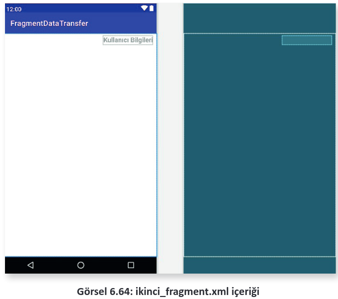
</div>

**11. Adım:** IkinciFragment.java içeriğini şu şekilde tasarlayınız:

```java
public class IkinciFragment extends Fragment {
    PageViewModel pageViewModel;
    public static IkinciFragment ikinciFragment(){
        return new IkinciFragment();
    }
    @Override
    public void onCreate(@Nullable Bundle savedInstanceState) {
        super.onCreate(savedInstanceState);
        pageViewModel = new ViewModelProvider(requireActivity()).get(PageViewModel.class);
    }
    @Nullable
    @Override
    public View onCreateView(@NonNull LayoutInflater inflater, @Nullable ViewGroup container, @Nullable Bundle savedInstanceState) {
        return inflater.inflate(R.layout.fragment_ikinci,container,false);
    }
    @Override
    public void onViewCreated(@NonNull View view, @Nullable Bundle savedInstanceState) {
        super.onViewCreated(view, savedInstanceState);
        TextView textView_KullaniciAdi = view.findViewById(R.id.textView_KullaniciBilgileri);
        pageViewModel.getKullaniciAdi().observe(requireActivity(), new Observer<String>(){
            @Override
            public void onChanged(String s) {
                if(pageViewModel.getName().equals(s)){
                    pageViewModel.getKullaniciSifre().observe(requireActivity(), new Observer<String>() {
                        @Override
                        public void onChanged(String t) {
                            if (pageViewModel.getSifre().toString().equals(t)){
                                textView_KullaniciAdi.setText(s);
                            }else{
                                textView_KullaniciAdi.setText("Kullanici Bilgileri");
                            }
                        }
                    });
                }
                else{
                    textView_KullaniciAdi.setText("Kullanici Bilgileri");
                }
            }
        });
    }
}
```

**NOT:**

>Bu kodlar arasındaki **observe()**, yeni bir metottur. LiveData türünün en önemli özelliği de buradaki observe() metodudur. Bu metot sayesinde anlık olarak diğer Fragment’teki değişim takip edilir, TextWatcher parametresi ile izlenir. BirinciFragment ögesinden dönen kullaniciAdi bilgisi doğru ise kullaniciSifresi bilgisine anlık olarak bakılır ve o da doğru olduğu takdirde IkinciFragment ögesine PageViewModel sınıfı üzerinden veriler getirilip kullaniciAdi bilgisi IkinciFragment’teki TextViewe yazılır. Bu şart gerçekleşmezse TextViewde "Kullanici Bilgileri" yazar.

**12. Adım:** TabbedActivity ile otomatik gelen Tab1, Tab2 isimlendirmesi SectionsPagerAdapter sınıfı içinde TAB_TITLES ile verilmiş olsa da elemanlara tıklandığında da görüleceği gibi dizinin elemanları strings.xml üzerinden gelir. İsimleri strings.xml üzerine giderek "Kullanıcı Girişi" ve "Ana Sayfa" şeklinde düzenleyiniz. Daha sonra uygulamayı çalıştırarak Görsel 6.65’tekine benzer bir görüntü alınız.

<div style='display:block;text-align:center'>

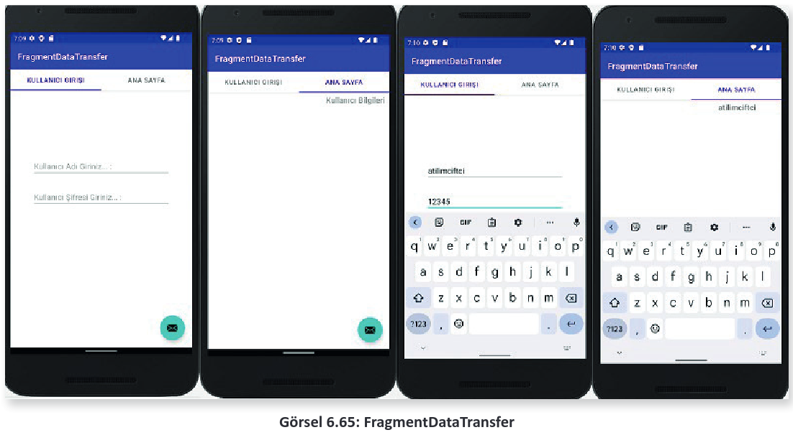
</div>

**NOT:**

>**TabbedActivity** ile otomatik yüklenen **PlaceHolderFragment** sınıfı ve bu sınıfın bağlı olduğu **fragment_main** örnek üzerinde kullanılmamıştır. Bu sınıfın silinmesi bir sorun oluşturmaz. Yirmi birinci uygulamada canlı verilerle çalışılmış ve Fragment’ler arasında veri transferi yapılmıştır.

<span style="color:#f00; font-weight:bold;">UYARI:</span> Fragment, mobil uygulamaları arasında oldukça gelişmiş ve üst düzey bir yapıdır