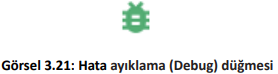
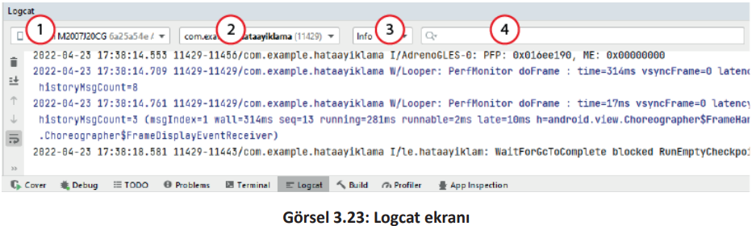

<h1 style="color:#ffc034">3.7. HATA AYIKLAMA</h1>

- <a href="#3.7.1.">3.7.1. Logcat</a>
- <a href="#3.7.2.">3.7.2. Durak Noktası</a>
- <a href="#3.7.3.">3.7.3. Değişken İzleme (Watch)</a>

Mobil uygulama geliştirirken çeşitli hatalardan dolayı uygulama istenen şekilde çalışmayabilir. Bu hatalar genellikle iki şekilde meydana gelir.

   1. **Yazım Yanlışı Hatası (Syntax Error)**: Bu hatalar mobil uygulama geliştirme programı tarafından otomatik olarak tespit edilir. Mobil uygulama geliştirme yazılımı uygulamanın çalıştırılmasına izin vermez. Öncelikle bu yazım yanlışı hatalarının giderilmesi gerekir.

   2. **Çalışma Zamanı Hatası (Run-Time Error)**: Uygulamanın çalışması sırasında meydana gelen hatalardır. Bu tür hataların ne zaman meydana geleceğini önceden tespit etmek zordur.Çalışma zamanında hata vermeyen bir uygulama bazen bir sonraki çalıştırılmasında hata verebilir. Örneğin internet üzerinden anlık mesajlaşma uygulaması, internet bağlantısı kontrol kodlarını barındırmadan bir mesaj gönderildiğinde çalışma zamanı hatası verir.

Çalışma zamanı hatalarını gidermek için **hata ayıklama (Debug)** işlemi yapılır. Hata ayıklama işlemi için uygulama, hata ayıklama modunda çalıştırılmalıdır. Hata ayıklama modu uygulamada gerçekleşen olayları günlük kayıtlarından (log) izleyebilmeyi, kod satılarına durak noktası (break-point) koyup kodu adım adım çalıştırabilmeyi, uygulama içindeki değişken ve nesnelerin durumlarını izleyebilmeyi sağlar. Çalışma zamanında uygulamanın davranışlarını izlemek için uygulama, hata ayıklama modunda çalıştırılmalıdır. Görsel 3.21 ve Görsel 3.22’de hata ayıklama modunda uygulamayı başlatma verilmiştir.
<div style="display:block;text-align:center">


</div>
<div style="display:block;text-align:center">


</div>

<h2 id="3.7.1." style="color:#ffc034">3.7.1. Logcat</h2>

Logcat, çalışma zamanında uygulama ile ilgili çıktıları izlemeye yarayan geliştirici aracıdır (Görsel 3.23). Logcat penceresini açmak için menüden View>Tool Windows>Logcat komutu seçilir.
<div style="display:block;text-align:center">


</div>

Görsel 3.23’te 1 numara ile gösterilen kısım, uygulamanın çalıştığı cihazı gösterir. 2 numaralı kısım, çalıştırılan uygulamayı gösterir. 3 numaralı kısım, log sınıfını gösterir (Tablo 3.7).

<div style="font-weight:bold;text-align:center">Tablo 3.7: Log Sınıfları</div>

| Log Sınıfı | Anlamı        | Kullanımı                |
| ---------- | ------------- | ------------------------ |
| Verbose    | Ayrıntılı     | Log.v("etiket","mesaj"); |
| Debug      | Hata Ayıklama | Log.d("etiket","mesaj"); |
| Info       | Bilgi         | Log.i("etiket","mesaj"); |
| Warn       | Uyarı         | Log.w("etiket","mesaj"); |
| Error      | Hata          | Log.e("etiket","mesaj"); |

Görsel 3.23’te 4 numaralı kısım ise günlük kaydında filtreleme yapmak için kullanılır. Genellikle etiket ile filtreleme yapılır. 

Log komutu iki kısımdan oluşur. Birinci bölüm, TAG (etiket) olarak adlandırılır. İkinci kısım ise mesajdan oluşur. Logcat ekranında birçok mesaj bulunur. Bu mesajlara farklı etiketler verilerek birbirinden ayrılması sağlanır.

**11. UYGULAMA**: İşlem adımlarına göre EditTexte girilen sayıya 2 ekleyen ve Logcat
ekranında yapılan işlemleri gösteren bir uygulama tasarlayınız.

**1. Adım**: Mobil uygulama geliştirme programında Empty Activity olacak şekilde bir proje oluşturunuz.\
**2. Adım**: activity_main.xml içine şu kodu yazınız:

```xml
<LinearLayout
    android:layout_width="wrap_content"
    android:layout_height="wrap_content"
    android:orientation="vertical"
    app:layout_constraintBottom_toBottomOf="parent"
    app:layout_constraintEnd_toEndOf="parent"
    app:layout_constraintStart_toStartOf="parent"
    app:layout_constraintTop_toTopOf="parent">
    <EditText
        android:id="@+id/editText"
        android:layout_width="match_parent"
        android:layout_height="wrap_content"
        />
    <Button
        android:id="@+id/button"
        android:layout_width="match_parent"
        android:layout_height="wrap_content"
        android:text="İşlem Yap"
        android:onClick="islemYap"
    />
</LinearLayout>
```

**3. Adım**: MainActivity.java dosyasına şu kodu yazınız:

```java
public class MainActivity extends AppCompatActivity {
    private final String TAG = "Etiket";
    private int sayi = 0;
    @Override
    protected void onCreate(Bundle savedInstanceState) {
        super.onCreate(savedInstanceState);
        setContentView(R.layout.activity_main);
        Log.d(TAG,"debug (hata ayıklama)");
    }
    public void islemYap(View view) {
        Log.i(TAG,"Düğmeye tıklandı");
        EditText editText = (EditText) findViewById(R.id.editText);
        Log.i(TAG,"Edit Text tanımlandı");
        String s1 = editText.getText().toString();
        Log.i(TAG,"Edit Text içindeki yazı alındı");
        sayi = Integer.parseInt(s1);
        Log.i(TAG,"Yazı sayıya çevrildi");
        sayi = sayi + 2;
        Log.i(TAG,"sayıya 2 eklendi");
    }
}
```

**4. Adım**: Debug’a tıklayarak uygulamayı çalıştırınız.\
**5. Adım**: Metin kutusuna Merhaba yazıp İşlem Yap düğmesine tıklayınız.\
**6. Adım**: Görsel 3.24’teki Logcat ekranında düğmeye tıklanma, EditText tanımlama ve EditText içindeki yazı alınma çalıştığı hâlde yazıyı sayıya çevirme ve sayıya 2 eklemenin çalışmadığını, hatanın yazıyı sayıya çevirme işleminde olduğunu gözlemleyiniz.

<div style="display:block;text-align:center">


</div>

**7. Adım**: Debug modunda tekrar uygulamayı çalıştırınız.\
**8. Adım**: Metin kutusuna herhangi bir sayı yazıp İşlem Yap düğmesine tıklayınız.\
**9. Adım**: Logcat ekranını gözlemleyiniz (Görsel 3.25).

<div style="display:block;text-align:center">


</div>

>**SIRA SİZDE**:
>
>Birbirinden farklı etiketler ile Log sınıflarını kullanan bir uygulama tasarlayınız ve Logcat ekranında filtreleme uygulayarak bu Logları bulunuz.
>
>**DEĞERLENDİRME**:
>
>Çalışmalarınız aşağıda yer alan kontrol listesi kullanılarak değerlendirilecektir. Çalışmanızı yaparken değerlendirme ölçütlerini dikkate alınız.
>
><div style="text-align:center;"><b>KONTROL LİSTESİ</b></div>
>
>| DEĞERLENDİRME ÖLÇÜTLERİ               | EVET | HAYIR |
>| :------------------------------------- | ---- | ----- |
>| 1. Log.v komutunu kullandı.           |
>| 2. Log.d komutunu kullandı.           |
>| 3. Log.i komutunu kullandı.           |
>| 4. Log.w komutunu kullandı.           |
>| 5. Log.e komutunu kullandı.           |
>| 6. Logcat ekranında filtreleme yaptı. |

<h2 id="3.7.2." style="color:#ffc034">3.7.2. Durak Noktası</h2>

Hata ayıklama yöntemlerinden biri de durak noktası (break-point) eklemektir. Durak noktası eklemek için ilgili kodun satır numarasının hemen yanına fare ile tıklamak yeterlidir. Kod satır numarasının yanında kırmızı bir daire belirir. Durak noktasına tekrar tıklandığında durak noktası silinir.

Hata ayıklama modunda iken çalıştırılacak kod sırası durak noktası konulan yere geldiğinde uygulama çalışmaya ara verir. Uygulamanın o anki durumu hakkında Debug penceresinden bilgi verilir (Görsel 3.26). Variables bölümünde değişkenlerin durumu yer alır. 
<div style="display:block;text-align:center">


</div>

Uygulamanın çalışmaya devam etmesi için Debug penceresinde Resume Program komutu veya klavyeden F9 tuşuna basılır. Programı adım adım çalıştırmak için Step Into ve Step Over düğmeleri kullanılır (Görsel 3.27).
<div style="display:block;text-align:center">


</div>

<h2 id="3.7.3." style="color:#ffc034">3.7.3. Değişken İzleme (Watch)</h2>

Uygulama kodu durak noktasına geldiğinde Debug penceresinde Variables bölümünden değişkenlerin durumu izlenebilir. Buraya özellikle durumu izlenecek değişkenler eklenir. Kod ekranında izlenecek değişken üzerine sağ tıklanıp, Add to Watches komutu verilerek gözcü eklenir. 