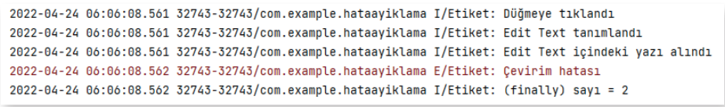

# 3.8. HATA DÜZELTME

Çalışma zamanı hatalarını düzeltmek için birçok yöntem vardır. Bunlardan en çok kullanılanı Try-Catch-Finally yapısıdır. Hata verebilecek kodlar Try (Dene) bloku içine alınır. Böylelikle herhangi bir istisna (Exception) meydana geldiğinde kod çalışmaya devam eder. Bir istisna meydana gelirse Catch (Yakala) bloku içindeki kodlar çalışır. Finally (En sonunda) bloku herhangi bir istisna oluşup oluşmadığına bakılmaksızın Try-Catch-Finally yapısında en son olarak çalıştırılacak kodların bulunduğu bölümdür. Finally blokunun kullanılması zorunlu değildir.

Catch blokunda FileNotFoundException (Dosya bulunamadı istisnası), ArithmeticException (Aritmetik istisnası) vb. özel istisnalar yakalanabileceği gibi genel istisnalar (Exception) da yakalanabilir. 

Try-Catch-Finally blokunun kullanımı şu şekildedir:

```java
try {

}
catch (İstisnaTipi istisnaAdi){

}
finally {

}
```

**12. UYGULAMA**: İşlem adımlarına göre EditTexte girilen sayıya 2 ekleyen uygulamayı Try-Catch-Finally ile yeniden tasarlayınız.

**1. Adım**: On birinci uygulamadaki MainActivity.java kodunu şu şekilde değiştiriniz:

```java
public class MainActivity extends AppCompatActivity {
    private final String TAG = "Etiket";
    private int sayi = 0;
    @Override
    protected void onCreate(Bundle savedInstanceState) {
        super.onCreate(savedInstanceState);
        setContentView(R.layout.activity_main);
    }
    public void islemYap(View view) {
        Log.i(TAG,"Düğmeye tıklandı");
        EditText editText = (EditText) findViewById(R.id.editText);
        Log.i(TAG,"Edit Text tanımlandı");
        String s1 = editText.getText().toString();
        Log.i(TAG, "Edit Text içindeki yazı alındı");
        try {
            sayi = Integer.parseInt(s1);
            Log.i(TAG,"Yazı sayıya çevrildi");
        }
        catch (Exception e){
            Log.e(TAG,"Çevirim hatası");
            sayi = 0;
        }
        finally {
            sayi = sayi + 2;
            Log.i(TAG, "(finally) sayı = " +sayi);
        }
    }
}
```

**2. Adım**: Debug’a tıklayarak uygulamayı çalıştırınız.

**3. Adım**: Metin kutusuna Merhaba yazıp İşlem Yap düğmesine tıklayınız.

**4. Adım**: Logcat ekranını gözlemleyiniz.
<div style="display:block;text-align:center">


</div>

>**SIRA SİZDE**:
>
>İki sayıyı birbirine bölen uygulamayı Try-Catch-Finally yapısını kullanarak tasarlayınız.
>
>**DEĞERLENDİRME**:
>
>Çalışmanız aşağıda yer alan kontrol listesi kullanılarak değerlendirilecektir. Çalışmanızı yaparken değerlendirme ölçütlerini dikkate alınız.
>
><div style="text-align:center;"><b>KONTROL LİSTESİ</b></div>
>
>| DEĞERLENDİRME ÖLÇÜTLERİ                                                   | EVET | HAYIR |
>| ------------------------------------------------------------------------- | ---- | ----- |
>| 1. Uygulamaya iki adet EditText ekledi.                                   |
>| 2. Uygulamaya bir adet TextView ekledi.                                   |
>| 3. Uygulamaya bir adet Button ekledi.                                     |
>| 4. Button tıklama olayını yazdı.                                          |
>| 5. Button tıklama olayına bölme işlemi kodlarını yazdı.                   |
>| 6. Metni sayıya çevirme kodları için Try-Catch-Finally yapısını kullandı. |
>| 7. Sıfıra bölme hatası için Try-Catch-Finally yapısını kullandı.          |
>| 8. Logcat ekranını kullandı.                                              |