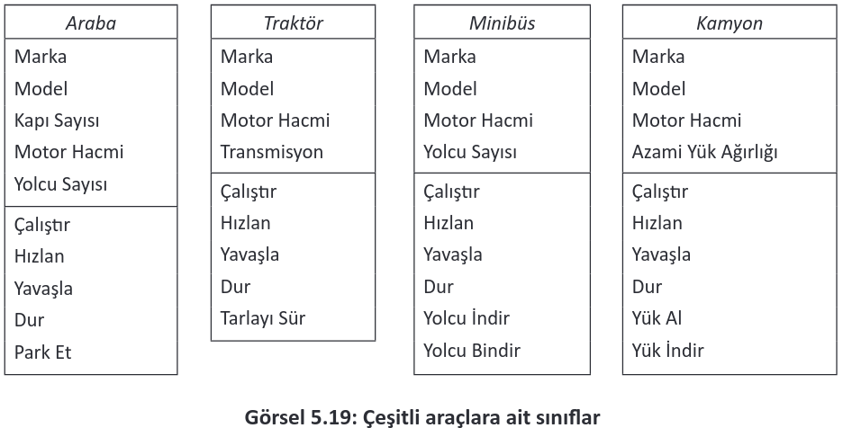
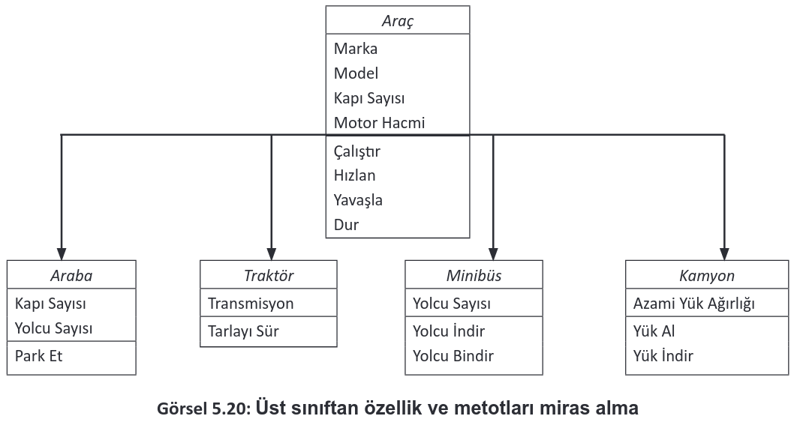
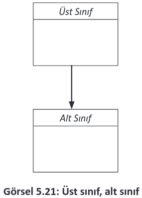

# 5.4. KALITIM (INHERITANCE)

Bir sınıf yapısının özellik ve metotlarını farklı bir sınıfa aktarma işlemine kalıtım denir. Kalıtım, çocukların ebeveynlerinden saç rengi, boy, göz rengi vb. özellikleri almaları gibi düşünülebilir. Örneğin trafikteki araçlar ile ilgili bir uygulama yapılması istenirse bazı araçlar (araba, traktör,minibüs ve kamyon) sınıf olarak modellenmelidir. Her araç için ayrı bir sınıf tanımlanmalıdır. Görsel 5.19’da bu sınıflara ait özellikler ve metotlar verilmiştir. Buradaki bazı özellik ve metotlar ortaktır. Sınıfların bu şekilde oluşturulması kod tekrarına neden olur.

<div style="display:block;text-align:center">


</div>

Kod tekrarını engellemek için ortak özellik ve metotlara sahip bir üst sınıf tanımlanmalıdır. Diğer sınıflar, bu ortak özellikleri üst sınıftan miras almalıdır (Görsel 5.20).
<div style="display:block;text-align:center">


</div>

Özellik ve metotlarını aktaran sınıfa üst sınıf denir. Özellik ve davranışların aktarıldığı sınıfa ise alt sınıf denir (Görsel 5.21).
<div style="display:block;text-align:center">


</div>

Alt sınıf tanımlanırken "extends" kodu ile alt sınıfın üst sınıftan özellik ve metotları miras alacağı belirtilir.

```java
public class AltSınıf extends ÜstSınıf {

}
```

**8. UYGULAMA:** İşlem adımlarına göre trafik araçlarını kalıtım kullanarak modelleyen bir uygulama tasarlayınız.

**1. Adım:** Mobil uygulama geliştirme programında Empty Activity olacak şekilde bir proje oluşturunuz.

**2. Adım:** Uygulama ekranında bir TextView, sekiz Button oluşturan şu kodu activity_main.xml içine yazınız:

```xml
<LinearLayout
    android:layout_width="wrap_content"
    android:layout_height="wrap_content"
    android:orientation="vertical"
    app:layout_constraintBottom_toBottomOf="parent"
    app:layout_constraintEnd_toEndOf="parent"
    app:layout_constraintStart_toStartOf="parent"
    app:layout_constraintTop_toTopOf="parent">
    <TextView
        android:id="@+id/textViewBilgi"
        android:layout_width="wrap_content"
        android:layout_height="wrap_content"
        android:text="Araç Bilgisi"/>
    <Button
        android:id="@+id/buttonArabaKapi"
        android:layout_width="wrap_content"
        android:layout_height="wrap_content"
        android:text="Araba Kapı Sayısı"/>
    <Button
        android:id="@+id/buttonArabaHiz"
        android:layout_width="wrap_content"
        android:layout_height="wrap_content"
        android:text="Araba maksimum hızı"/>
    <Button
        android:id="@+id/buttonArabaCalistir"
        android:layout_width="wrap_content"
        android:layout_height="wrap_content"
        android:text="Araba’yı Çalıştır"/>
    <Button
        android:id="@+id/buttonArabaIseGit"
        android:layout_width="wrap_content"
        android:layout_height="wrap_content"
        android:text="Araba İşe Git"/>
    <Button
        android:id="@+id/buttonMinibusKapi"
        android:layout_width="wrap_content"
        android:layout_height="wrap_content"
        android:text="Minibüs Kapı Sayısı"/>
    <Button
        android:id="@+id/buttonMinibusHiz"
        android:layout_width="wrap_content"
        android:layout_height="wrap_content"
        android:text="Minibüs maksimum hızı"/>
    <Button
        android:id="@+id/buttonMinibusCalistir"
        android:layout_width="wrap_content"
        android:layout_height="wrap_content"
        android:text="Minibüs’ü Çalıştır"/>
    <Button
        android:id="@+id/buttonMinibusYolcuIndir"
        android:layout_width="wrap_content"
        android:layout_height="wrap_content"
        android:text="Minibüs Yolcu İndir"/>
</LinearLayout>
```

**3. Adım:** "Arac" adıyla yeni bir sınıf oluşturunuz.

**4. Adım:** Arac.java dosyasına şu kodu yazınız:

```java
package com.example.kalitim;
public class Arac {
    private Integer kapiSayisi;
    private Integer maksimumHiz;
    public Integer getKapiSayisi() {
        return kapiSayisi;
    }
    public void setKapiSayisi(Integer kapiSayisi) {
        this.kapiSayisi = kapiSayisi;
    }
    public Integer getMaksimumHiz() {
        return maksimumHiz;
    }
    public void setMaksimumHiz(Integer maksimumHiz) {
        this.maksimumHiz = maksimumHiz;
    }
    public String kapiSayisiniGoster(){
        return "Aracın kapı sayısı :" + this.kapiSayisi.toString();
    }
    public String maksimumHizGoster(){
        return "Aracın maksimum hızı :" + this.maksimumHiz.toString();
    }
    public String calistir(){
        return "Araç çalışıyor";
    }
}
```

**5. Adım:** "Araba" adıyla yeni bir sınıf oluşturunuz.

**6. Adım:** Araba.java dosyasına şu kodu yazınız:

```java
package com.example.kalitim;
public class Araba extends Arac {
    public String iseGit(){
        return "Araba işe gidiyor";
    }
}
```


**7. Adım:** "Minibus" adıyla yeni bir sınıf oluşturunuz.

**8. Adım:** Minibus.java dosyasına şu kodu yazınız:

```java
public class Minibus extends Arac{
    public String yolcuIndir(){
        return "Yolcular indiriliyor";
    }
}
```

**9. Adım:** MainActivity.java dosyasına şu kodu yazınız:

```java
package com.example.kalitim;
import androidx.appcompat.app.AppCompatActivity;
import android.os.Bundle;
import android.view.View;
import android.widget.Button;
import android.widget.TextView;
public class MainActivity extends AppCompatActivity {
    @Override
    protected void onCreate(Bundle savedInstanceState) {
        super.onCreate(savedInstanceState);
        setContentView(R.layout.activity_main);
        TextView textViewBilgi = findViewById(R.id.textViewBilgi);
        //Araba düğmeleri
        Button buttonArabaKapi = findViewById(R.id.buttonArabaKapi);
        Button buttonArabaHiz = findViewById(R.id.buttonArabaHiz);
        Button buttonArabaCalistir = findViewById(R.id.buttonArabaCalistir);
        Button buttonArabaIseGit = findViewById(R.id.buttonArabaIseGit);
        //Minibüs düğmeleri
        Button buttonMinibusKapi = findViewById(R.id.buttonMinibusKapi);
        Button buttonMinibusHiz = findViewById(R.id.buttonMinibusHiz);
        Button buttonMinibusCalistir = findViewById(R.id.buttonMinibusCalistir);
        Button buttonMinibusYolcuIndir = findViewById(R.id.buttonMinibusYolcuIndir);
        //Yeni bir araba nesnesi oluşturuldu.
        Araba araba = new Araba();
        //Araba koltuk sayısı ve hız tanımlanır.
        araba.setKapiSayisi(5);
        araba.setMaksimumHiz(210);
        //Yeni bir minibüs nesnesi oluşturuldu.
        Minibus minibus = new Minibus();
        //Minibüs koltuk sayısı ve hız tanımlanır.
        minibus.setKapiSayisi(3);
        minibus.setMaksimumHiz(170);
        //Düğme tıklanma olayları
        buttonArabaKapi.setOnClickListener(new View.OnClickListener() {
            @Override
            public void onClick(View view) {
                textViewBilgi.setText(araba.kapiSayisiniGoster());
            }
        });
        buttonArabaHiz.setOnClickListener(new View.OnClickListener() {
            @Override
            public void onClick(View view) {
                textViewBilgi.setText(araba.maksimumHizGoster());
            }
        });
        buttonArabaCalistir.setOnClickListener(new View.OnClickListener() {
            @Override
            public void onClick(View view) {
                textViewBilgi.setText(araba.calistir());
            }
        });
        buttonArabaIseGit.setOnClickListener(new View.OnClickListener() {
            @Override
            public void onClick(View view) {
                textViewBilgi.setText(araba.iseGit());
            }
        });
        buttonMinibusKapi.setOnClickListener(new View.OnClickListener() {
            @Override
            public void onClick(View view) {
                textViewBilgi.setText(minibus.kapiSayisiniGoster());
            }
        });
        buttonMinibusHiz.setOnClickListener(new View.OnClickListener() {
            @Override
            public void onClick(View view) {
                textViewBilgi.setText(minibus.maksimumHizGoster());
            }
        });
        buttonMinibusCalistir.setOnClickListener(new View.OnClickListener() {
            @Override
            public void onClick(View view) {
                textViewBilgi.setText(minibus.calistir());
            }
        });
        buttonMinibusYolcuIndir.setOnClickListener(new View.OnClickListener() {
        @Override
            public void onClick(View view) {
                textViewBilgi.setText(minibus.yolcuIndir());
            }
        });
    }
}
```

**10. Adım:** Run düğmesine tıklayarak uygulamayı çalıştırınız.

**9. UYGULAMA:** İşlem adımlarına göre kalıtım ile eşkenar üçgen ve karenin çevresini bulan bir uygulama tasarlayınız.

**1. Adım**: Mobil uygulama geliştirme programında Empty Activity olacak şekilde bir proje oluşturunuz.

**2. Adım**: Uygulama ekranında bir EditText, iki Button ve bir TextView oluşturan şu kodu activity_main.xml içine yazınız:

```xml
<LinearLayout
    android:layout_width="wrap_content"
    android:layout_height="wrap_content"
    app:layout_constraintBottom_toBottomOf="parent"
    app:layout_constraintEnd_toEndOf="parent"
    app:layout_constraintStart_toStartOf="parent"
    app:layout_constraintTop_toTopOf="parent"
    android:orientation="vertical">
    <EditText
        android:id="@+id/editTextUzunluk"
        android:layout_width="wrap_content"
        android:layout_height="wrap_content"
        android:inputType="number"
        android:hint="Kenar Uzunluğu"/>
    <Button
        android:id="@+id/buttonUcgen"
        android:layout_width="match_parent"
        android:layout_height="wrap_content"
        android:text="Üçgen"/>
    <Button
        android:id="@+id/buttonKare"
        android:layout_width="match_parent"
        android:layout_height="wrap_content"
        android:text="Kare"/>
    <TextView
        android:id="@+id/textViewCevre"
        android:layout_width="match_parent"
        android:layout_height="wrap_content"
        android:text="Çevre"/>
</LinearLayout>
```

**1. Adım:** "Sekil" adıyla yeni bir sınıf oluşturunuz.

**2. Adım:** Sekil.java dosyasına şu kodu yazınız:

```java
package com.example.geometriksekiller;
public class Sekil {
    public Integer kenarSayisi;
    public Integer kenarUzunlugu;
    public Integer cevre(){
        return kenarSayisi*kenarUzunlugu;
    }
}
```

**5. Adım:** "Ucgen" adıyla yeni bir sınıf oluşturunuz.

**6. Adım:** Ucgen.java dosyasına şu kodu yazınız:

```java
package com.example.geometriksekiller;
public class Ucgen extends Sekil{
    public Ucgen(Integer uzunluk) {
        this.kenarUzunlugu = uzunluk;
        this.kenarSayisi = 3;
    }
}
```

**7. Adım:** "Kare" adıyla yeni bir sınıf oluşturunuz.

**8. Adım:** Kare.java dosyasına şu kodu yazınız:

```java
package com.example.geometriksekiller;
public class Kare extends Sekil{
    public Kare(Integer uzunluk) {
        this.kenarUzunlugu = uzunluk;
        this.kenarSayisi = 4;
    }
}
```

**9. Adım:** MainActivity.java dosyasına şu kodu yazınız:

```java
package com.example.geometriksekiller;
import androidx.appcompat.app.AppCompatActivity;
import android.os.Bundle;
import android.view.View;
import android.widget.Button;
import android.widget.EditText;
import android.widget.TextView;
public class MainActivity extends AppCompatActivity {
    @Override
    protected void onCreate(Bundle savedInstanceState) {
        super.onCreate(savedInstanceState);
        setContentView(R.layout.activity_main);
        EditText editTextUzunluk = findViewById(R.id.editTextUzunluk);
        Button buttonUcgen = findViewById(R.id.buttonUcgen);
        Button buttonKare = findViewById(R.id.buttonKare);
        TextView textViewCevre = findViewById(R.id.textViewCevre);
        buttonUcgen.setOnClickListener(new View.OnClickListener() {
            @Override
            public void onClick(View view) {
                Integer uzunluk = Integer.parseInt(editTextUzunluk.getText().toString());
                Ucgen ucgen = new Ucgen(uzunluk);
                Integer cevre = ucgen.cevre();
                textViewCevre.setText(cevre.toString());
            }
        });
        buttonKare.setOnClickListener(new View.OnClickListener() {
            @Override
            public void onClick(View view) {
                Integer uzunluk = Integer.parseInt(editTextUzunluk.getText().toString());
                Kare kare = new Kare(uzunluk);
                Integer cevre = kare.cevre();
                textViewCevre.setText(cevre.toString());
            }
        });
    }
}
```

**10. Adım:** Run düğmesine tıklayarak uygulamayı çalıştırınız.