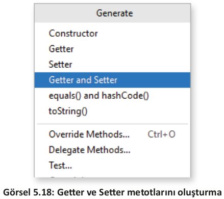

# 5.3. KAPSÜLLEME (ENCAPSULATION)
- <a href="#5.3.1.">5.3.1. Kapsülleme Yapısı</a>
- <a href="#5.3.2.">5.3.2. Getter ve Setter Metotları</a>
  
Nesne tabanlı programlama kavramlarından biri de kapsüllemedir. Kapsülleme, sınıf içindeki özelliklerin saklanarak doğrudan erişime kapatılması anlamına gelir. Buradaki asıl amaç, özellikleri gizlemek yani güvenlik değildir. Kapsülleme, sınıflar arasındaki bağımlılığı en aza indirir. Kapsüllemenin amacının daha iyi anlaşılabilmesi için kapsülleme üç açıdan incelenir.

1. **Doğruluk Açısından:** Sınıf içindeki özelliklerin sınıf dışına açık bırakılması iyi bir fikir değildir. Örneğin public erişim belirleyicisi ile dışarıya açık bırakılan bir Personel sınıfının yaş özelliğine -10 girilmesi sorunlara neden olur. Gerçek hayatta herhangi bir personelin yaşının -10 olması mümkün değildir.

<table>
    <tbody>
        <tr>
            <td>
                <pre>
                    <code class="language-java">public class Personel {
    public int yas;
}
                    </code>
                </pre>
            </td>
            <td>
                <pre>
                    <code class="language-java">public class Muhasebe {
    Personel personel1 = new Personel();
    personel1.yas = -10;
}
                    </code>
                </pre>
            </td>
        </tr>
    </tbody>
</table>

2. **Güvenlik Açısından:** Sınıf tanımlanırken güvenlik düşünülmelidir. Örneğin Personel sınıfın-
daki maaş özelliği public erişim belirleyici olarak tanımlandığında sınıf dışından maaş bilgisi
istendiği gibi değiştirilebilir. Bu tür durumlar güvenlik açığı oluşturur.

<table>
    <tbody>
        <tr>
            <td>
                <pre>
                    <code class="language-java">public class Personel {
    public int yas;
    public int maas = 4253;
}
                    </code>
                </pre>
            </td>
            <td>
                <pre>
                    <code class="language-java">public class Muhasebe {
    Personel personel1 = new Personel();
    personel1.yas = -10;
    personel1.maas = 10000;
}
                    </code>
                </pre>
            </td>
        </tr>
    </tbody>
</table>

3. **Bağımlılık Açısından**: Kapsüllemenin asıl amacı, bağımlılıkları en aza indirmektir. Nesneler
birbirleriyle etkileşim içindedir. Bağımlılık, bir nesnenin diğer nesneler ile olan ilişkisidir.
İlişki ne kadar sıkı olursa bağımlılık o kadar artar. Örneğin Personel sınıfı içindeki yaş özel-
liğinin ismi değiştirildiğinde Muhasebe sınıfından personel sınıfına bağımlık olduğu için
uygulama hata verir.

<table>
    <tbody>
        <tr>
            <td>
                <pre>
                    <code class="language-java">public class Personel {
    public int personelYas;
    public int maas = 4253;
}
                    </code>
                </pre>
            </td>
            <td>
                <pre>
                    <code class="language-java">public class Muhasebe {
    Personel personel1 = new Personel();
    personel1.yas = -10; //Hata verir.
    personel1.maas = 10000;
}
                    </code>
                </pre>
            </td>
        </tr>
    </tbody>
</table>

Kapsülleme; kodun yeniden kullanılabilirliğini, esnekliğini ve sürdürebilirliğini artıran avantajlara sahiptir.
- Esneklik: Kapsüllenmiş kodu yeni gereksinimlere göre değiştirmek esnek ve kolaydır. Örneğin bir kişinin maaş bilgisini belirleme gereksinimi değişirse setMaas() Setter metodunu
değiştirmek yeterlidir.
- Yeniden Kullanılabilirlik: Aynı veya farklı uygulamalarda kapsüllenmiş kod yeniden kullanılabilir.
- Sürdürülebilirlik: Kapsüllenmiş uygulama kodu üzerindeki bir değişiklik, uygulamanın diğer bölümlerini etkilemez.

<h2 id="5.3.1.">5.3.1. Kapsülleme Yapısı</h2>

Kapsülleme iki adımda gerçekleştirilir. Bu adımlar şunlardır:
- Sınıf içindeki özelliklerin erişim belirleyicisi private olarak ayarlanır.
- Bu private üyelere erişmek ve değerlerini değiştirmek için sırasıyla public Getter ve Setter yöntemleri tanımlanır.

<table>
    <tbody>
        <tr>
            <td>
                <pre>
                    <code class="language-java">public class Personel {
    private int yas;
    public int getYas() {
        return yas;
    }
    public void setYas(int yas) {
        this.yas = yas;
    }
}
                    </code>
                </pre>
            </td>
            <td>
                <pre>
                    <code class="language-java">public class Muhasebe {
    Personel personel1 = new Personel();
    personel1.setYas(18);
}
                    </code>
                </pre>
            </td>
        </tr>
    </tbody>
</table>

<h2 id="5.3.2.">5.3.2. Getter ve Setter Metotları</h2>

Mobil uygulama hazırlama programı, Getter ve Setter metotlarını tanımlamaya yardımcı olur. Getter ve Setter eklenecek sınıf dosyası açıkken Code menüsünden Generate komutu seçilir veya klavyeden Alt+Ins tuşlarına basılır. Ekrana gelen Generate penceresinden Getter and Setter seçilir (Görsel 5.18). İstenen özellikler seçilerek OK düğmesine tıklanır.

<div style="display:block;text-align:center">


</div>

**ÖRNEK**

```java
public class Personel {
    private String ad;
    public String getAd() {
        return ad;
    }
    public void setAd(String ad) {
        this.ad = ad;
    }
}
```

Setter metodu parametresi ile kapsüllenen özellik aynı adı taşır. Kod içinde karışıklık yaşanmaması için this deyimi kullanılır. This, üzerinde işlem yapılan nesneyi ifade eder. Sınıf içinde yer alan "this.ad" kodu, sınıfın private ile kapsüllenmiş ad özelliğidir. Getter metodu, kapsüllenmiş özelliğin değerini almaya yarar. Getter metodunda özellik değiştirilmeden alınabileceği gibi manipüle ederek de alınabilir.

**ÖRNEK**

Personel sınıfında ad bilgisine ulaşılırken ad bilgisi büyük harfe çevrilerek alınır.

```java
public class Personel {
    private String ad;
    public String getAd() {
        return ad.toUpperCase();
    }
}
```

Setter metodu, kapsüllenmiş özelliğin değerini girmeye yarar. Setter metodu da manipüle edilmeye açıktır.

**ÖRNEK**

Personel sınıfında ad bilgisi girilirken adın başına Sayın kelimesi getirilir.

```java
public class Personel {
    private String ad;
    public void setAd(String ad) {
        this.ad = "Sayı" " " ad;
    }
}
```

**7. UYGULAMA**: İşlem adımlarına göre personel yaş bilgisinin girildiği bir uygulama tasarlayınız. Personel sınıfının yaş özelliğini kapsülleyiniz. Personel sınıfının yaş özelliğini 18’den küçük, 55’ten büyük girilmeyecek şekilde ayarlayınız.

**1. Adım**: Mobil uygulama geliştirme programında Empty Activity olacak şekilde bir proje oluşturunuz.

**2. Adım**: Uygulama ekranında bir EditText, bir Button ve bir TextView oluşturan şu kodu activity_main.xml içine yazınız:

```xml
<LinearLayout
    android:layout_width="wrap_content"
    android:layout_height="wrap_content"
    android:orientation="vertical"
    app:layout_constraintBottom_toBottomOf="parent"
    app:layout_constraintEnd_toEndOf="parent"
    app:layout_constraintStart_toStartOf="parent"
    app:layout_constraintTop_toTopOf="parent">
    <EditText
        android:id="@+id/editTextYas"
        android:layout_width="wrap_content"
        android:layout_height="wrap_content"
        android:minHeight="48dp"
        android:minWidth="100dp"
        android:hint="Yaş" />
    <Button
        android:id="@+id/buttonKaydet"
        android:layout_width="wrap_content"
        android:layout_height="wrap_content"
        android:text="Kaydet"/>
    <TextView
        android:id="@+id/textViewSonuc"
        android:layout_width="match_parent"
        android:layout_height="wrap_content"
        android:text="Sonuç"/>
</LinearLayout>
```

**3. Adım:** "Personel" adıyla yeni bir sınıf oluşturunuz.

**4. Adım:** Personel.java dosyasına şu kodu yazınız:

```java
package com.example.kapsulleme;
public class Personel {
    private int yas;
}
```

**5. Adım:** Alt+Ins tuşlarına basarak Generate penceresinden Getter and Setter komutunu çalıştırınız.

**6. Adım:** setYas metodunu şu kod ile değiştiriniz:

```java
public void setYas(int yas) {
    if(yas<18 || yas>55){
        Log.e("Kapsülleme", "Hatalı yaş");
        yas = 18;
    }
    this.yas = yas;
}
```

**7. Adım:** MainActivity.java dosyasına şu kodu yazınız:

```java
package com.example.kapsulleme;
import androidx.appcompat.app.AppCompatActivity;
import android.os.Bundle;
import android.view.View;
import android.widget.Button;
import android.widget.EditText;
import android.widget.TextView;
public class MainActivity extends AppCompatActivity {
    @Override
    protected void onCreate(Bundle savedInstanceState) {
        super.onCreate(savedInstanceState);
        setContentView(R.layout.activity_main);
        EditText editTextYas = findViewById(R.id.editTextYas);
        Button buttonKaydet = findViewById(R.id.buttonKaydet);
        TextView textViewSonuc = findViewById(R.id.textViewSonuc);
        buttonKaydet.setOnClickListener(new View.OnClickListener() {
            @Override
            public void onClick(View view) {
                int yas = Integer.parseInt(editTextYas.getText().toString());
                Personel personel = new Personel();
                personel.setYas(yas);
                textViewSonuc.setText(Integer.toString(personel.getYas()));
            }
        });
    }
}
```

**8. Adım:** Run düğmesine tıklayarak uygulamayı çalıştırınız.

**9. Adım:** Değerleri girerek KAYDET düğmesine tıklayınız.

>**SIRA SİZDE:**
>
>"Personel" sınıfına maaş özelliğini kapsüllemeyle ekleyiniz. Maaş değerini 4.253’ten az olmayacak şekilde ayarlayınız.
>
>**DEĞERLENDİRME:** 
>
>Çalışmanız aşağıda yer alan kontrol listesi kullanılarak değerlendirilecektir. Çalışmanızı yaparken değerlendirme ölçütlerini dikkate alınız.
>
><div style="text-align:center"><b>KONTROL LİSTESİ</b></div>
>
>| DEĞERLENDİRME ÖLÇÜTLERİ                                               | EVET | HAYIR |
>| --------------------------------------------------------------------- | ---- | ----- |
>| 1. New Project komutunu tıkladı.                                      |
>| 2. Empty Activity proje türünü seçti.                                 |
>| 3. Uygulama adını belirledi.                                          |
>| 4. Uygulama tasarım ekranına iki EditText ekledi.                     |
>| 5. Uygulama tasarım ekranına bir Button ekledi.                       |
>| 6. Uygulama tasarım ekranına bir TextView ekledi.                     |
>| 7. "Personel" adında yeni bir sınıf oluşturdu.                        |
>| 8. "Personel" sınıfının özelliklerini belirledi.                      |
>| 9. Maaş özelliğini erişim belirleyici olarak private seçti.           |
>| 10. Maaş için Getter ve Setter metotlarını oluşturdu.                 |
>| 11. Uygulama kodunda findViewById yöntemiyle nesneleri tanımladı.     |
>| 12. Button nesnesine tıklanma olayını ekledi.                         |
>| 13. Maaş bilgisini değişkenlere atadı.                                |
>| 14. "Personel" sınıfından "personel" adlı yeni bir nesne türetti.     |
>| 15. "personel" nesnesinin setMaas metodu ile maaş bilgisini gönderdi. |
>| 16. Personel maaşını getMaas ile aldı.                                |
>| 17. Maaş bilgisini TextView içinde gösterdi.                          |
>| 18. Run düğmesine tıklayarak uygulamayı çalıştırdı.                   |