# KARAR YAPILARI
- <a href="#4.1.1.">4.1.1. if Karar Yapısı</a> 
- <a href="#4.1.2.">4.1.2. if-else Karar Yapısı </a> 
- <a href="#4.1.3.">4.1.3. if-else-if Karar Yapısı</a> 
- <a href="#4.1.4.">4.1.4. Switch-Case Yapısı </a> 

## 4.1. KARAR YAPILARI

Üst seviye yazılım geliştirme aşamalarının vazgeçilmezi olan karar ifadeleri, belirlenen koşul veya koşulların sonuçlarına göre yazılımların gidiş yolunu çizen yapılardır. Bu yapılar sayesinde oluş turulan uygulamalar daha esnektir. Örneğin not girişlerinin yapıldığı bir uygulamada, ortalama hesaplandıktan sonra öğrencinin dersi geçip geçmediğini belirlemek için ortalamanın, dersi geçme sınırından büyük mü yoksa küçük mü olduğu karşılaştırma operatörleri ile kontrol edilmelidir. Buna bağlı olarak öğrencinin dersi geçtiğine veya dersten kaldığına karar verilmelidir. Yazılım geliştirme ortamında Java programlama diliyle uygulama oluşturulurken "if" ve "switch-case" karar yapıları kullanılır.

<h2 id="4.1.1.">4.1.1. if Karar Yapısı</h2>

Programlama dillerinde en sık kullanılan if karar yapısı kelime olarak **eğer** anlamına gelir. Yapı oluşturulacağı zaman blok içindeki kodlar çalıştırılmak istendiğinde "eğer şart sağlanıyorsa" ifadesi if karar yapısı ile karşılanır. Yazılan öncülün sonucunda evet (true) cevabı verilirse if karar yapısının blokları arasındaki işlem yapılır. Hayır (false) cevabı verilirse if karar yapısının blokları arasına uğramadan işlemlere devam edilir.

```java
if(şart ifadesi){
    //Şart sonucu true ise yapılacaklar
}
```

**1. UYGULAMA**: İşlem adımlarına göre TextView ögesine not girişi yapıp butona tıklandığında notun 100’den büyük olması durumunda "Yanlış Giriş" Toast mesajı veren bir uygulama tasarlayınız.

**1. Adım**: Yazılım geliştirme ortamında Empty Activity açınız.

**2. Adım**: İçeriye bir adet sadece sayı girilen "EditText" bir adet de "Button" ögesi ekleyiniz. Daha sonra "Infer Constraints" butonuna tıklayarak ögelerin yerini sabitleyiniz (Görsel 4.1).

**3. Adım**: Button ögesinin "onClick" özelliğine "kontrolEt" yazınız (Butona tıklandığında çalışacak "kontrolEt" isimli metot sonradan yazılacaktır.).

**4. Adım**: MainActivity’yi açınız ve eklenen ögeleri "findViewById" ile onCreate metoduna ait blokların içinde tanımlayınız.

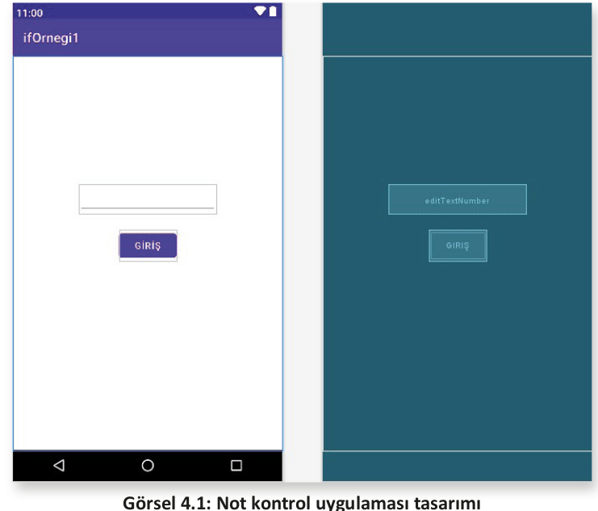

```java
public class MainActivity extends AppCompatActivity {
    EditText number;
    Button button;
    @Override
    protected void onCreate(Bundle savedInstanceState) {
        super.onCreate(savedInstanceState);
        setContentView(R.layout.activity_main);
        button=findViewById(R.id.button);
        number=findViewById(R.id.editTextNumber);
    }
}
```

**5. Adım**: MainActivity sınıfının içinde, onCreate metodunun dışında olacak şekilde, geri dönüş değeri olmayan "kontrolEt" isminde bir metot tasarlayınız. Parametre olarak da View sınıfından view isimli bir nesne türetiniz. Bu metodun ismi, bir görünüme tıklandığında çalışacağı için buttonun onClick özelliği içinde yazılmalıdır.

**6. Adım**: Oluşturulan metot içinde integer türünden "sayi" isimli bir değişken tasarlayıp içine EditTextten gelen değeri alınız. Değeri alırken EditTextten gelen "String" tipini öncelikle "int" veri tipine çeviriniz. Karar yapısını kullanarak sayi isimli değişkenin içindeki değerin 100’den büyük olması durumunda şu Toast mesajını gönderiniz:

```java
public void kontrolEt(View view){
    int sayi = Integer.parseInt(number.getText().toString());
    if(sayi > 100){
    Toast.makeText(this, "100’den Büyük Not Olamaz", Toast.LENGTH_SHORT).show();
    }
}
```

**7. Adım:** Uygulamanın son şekli Görsel 4.2’de verilmiştir. Shift+F10 tuşlarıyla veya Başlat ikonuyla uygulamayı çalıştırınız.

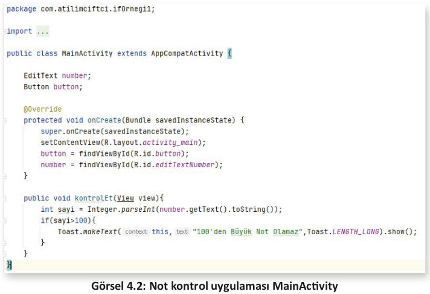

**NOT**:

>**kontrolEt** ismi verilip yazılan metot ile buttonun **onClick** olayına yazılan metot aynıdır. Bunların biri oluşturma amaçlı, diğeri ise oluşturulan o metodu kullanmak için çağırma amaçlı yazılmıştır. Bu nedenle metotların isminin de aynı olması gerekir. Bu örnekte girilen not değeri 100’den büyük olursa küçük bir Toast mesajı çıkacaktır.

**NOT:**

>Toast mesajları, küçük birer mesaj kutucuğudur. Bu mesajı oluştururken üç parametreye ihtiyaç vardır. İlk parametre değeri **this**, varolan Activity’yi context olarak hedef gösterir. Bu ifade,**MainActivity.this** olarak da yazılabilir. İkinci parametre, mesajın içeriğini oluşturur. Üçüncü parametre ise mesajın ekranda ne kadar kalacağını belirler.

**2. UYGULAMA**: İşlem adımlarına göre mobil uygulama ekranında birinci ve ikinci sayı girişlerini yaparak bu sayılardan hangisinin büyük olduğunu bulan ve büyük sayıyı ekranda Toast mesajı ile gösteren uygulamayı tasarlayınız.

**1. Adım**: Görsel 4.3’te görülen tasarımı Empty Activity açarak hazırlayınız.

**2. Adım**: İçeriye iki adet sadece sayı girilen "EditText" ögesi, bir adet "Button" ögesi, iki adet de 1. Sayı ve 2. Sayı yazan "TextView" ögesi ekleyiniz. Daha sonra "Infer Constraints" butonuna tıklayarak ögelerin yerini sabitleyiniz (Görsel 4.3).

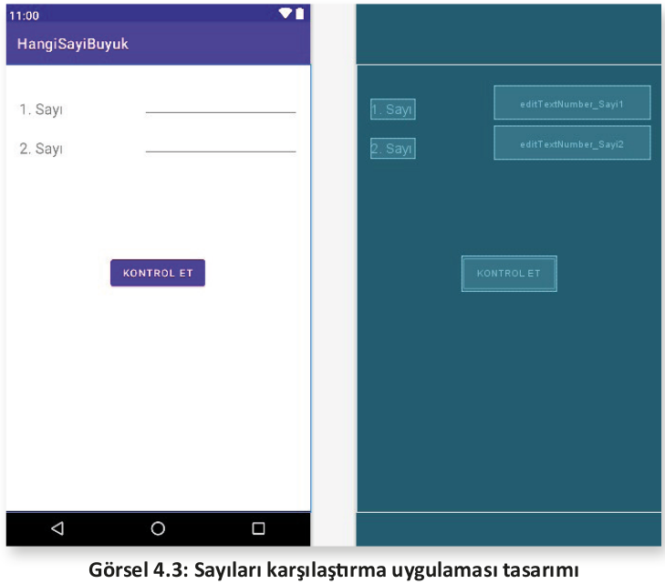

**3. Adım**: Button ögesinin "onClick" özelliğine "kontrol" yazınız.

**4. Adım**: MainActivity’yi açınız ve eklenen ögeleri "findViewById" metodu ile "onCreate"i şu şekilde tanımlayınız:

```java
public class MainActivity extends AppCompatActivity {

    EditText editText_sayi1;
    EditText editText_sayi2;
    Button button;
    @Override
    protected void onCreate(Bundle savedInstanceState) {
        super.onCreate(savedInstanceState);
        setContentView(R.layout.activity_main);
        button = findViewById(R.id.button_Kontrol);
        editText_sayi1 = findViewById(R.id.editTextNumber_Sayi1);
        editText_sayi2 = findViewById(R.id.editTextNumber_Sayi2);
    }
}
```

**5. Adım:** MainActivity sınıfının içinde, onCreate metodunun dışında olacak şekilde, geri dönüş değeri olmayan (void) bir metot tasarlayınız. Metoda "kontrol" adını veriniz. Parametre olarak da View sınıfından view isimli bir nesne gönderen şu kodları yazınız:

```java
public void kontrol(View view){
    int sayi1 = Integer.parseInt(editText_sayi1.getText().toString());
    int sayi2 = Integer.parseInt(editText_sayi2.getText().toString());
    if(sayi1 > sayi2){
        Toast.makeText(MainActivity.this,"1. Sayı Daha Büyüktür.",Toast.LENGTH_LONG).show();
    }
    if(sayi2 > sayi1){
        Toast.makeText(MainActivity.this,"2. Sayı Daha Büyüktür.",Toast.LENGTH_LONG).show();
    }
    if(sayi1 == sayi2){
        Toast.makeText(MainActivity.this,"İki Sayı Birbirine Eşittir.",Toast.LENGTH_LONG).show();
    }
}
```

**6. Adım**: Oluşturulan metot içinde integer türünden "sayi1" ve "sayi2" değişkenleri tasarlayıp değişkenlerin içine EditTextlerden gelen değerleri alınız. Değerleri alırken EditTextten gelen "String" tipini öncelikle "int" veri tipine çeviriniz. Karar yapısını üç defa kullanarak 1. sayının büyük olması durumunda bir Toast mesajı, 2. sayının büyük olması durumunda farklı bir Toast mesajı ve sayıların birbirlerine eşit olması durumunda da ayrı bir Toast mesajı gönderiniz.
 
**7. Adım**: Uygulamanın son şekli Görsel 4.4’te verilmiştir. Shift+F10 tuşlarıyla veya Başlat ikonuyla uygu-
lamayı çalıştırınız.

**NOT:**

>Bundan sonraki uygulamalarda eklenen nesnelerin varsayılan isimleri (id) değiştirilerek işlemyapılacaktır. Bu uygulamada da bu nedenle EditTextlerin ve buttonun id’leri değiştirilmiş ve uygun isimler verilmiştir. Bu isimler de ögelerin başlatması yapılırken yazılan findViewByld metodunda görülür.

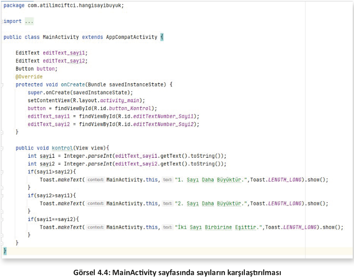

<h2 id="4.1.2.">4.1.2. if-else Karar Yapısı</h2>

Oluşturulan şartın "true" olması durumunda if karar yapısının blokları arasındaki işlem gerçekleşir. Şart sonucu "false" ise uygulamanın çalışma prensibi, oluşturulan if blokuna giriş yapılmadan sonrasındaki satırların çalışmaya devam etmesi şeklindedir. Buradaki problem, şart "true" olduğunda blok içine girilip işlemler yapıldıktan sonra blok dışındaki ifadelerin de çalıştırılmasıdır. "else" ifadesi **aksi hâlde** anlamı taşır. "if-else" karar yapısında ise "true" ve "false" durumları ayrı ayrı yazılır. Bu sayede "true" ile "false" işlemleri birbirinden tamamen ayrılıp iki farklı yolda işlenebilir.

```java
if(şart ifadesi){
    //Şart sonucu true ise yapılacaklar
}
else{
    //Şart sonucu false ise yapılacaklar
}
```

**3. UYGULAMA:** İşlem adımlarına göre bir EditText ile kullanıcıdan "kullanıcı adı" ve "şifre" isteyiniz. Girilen kullanıcı adı ve şifresi, programın içinde belirtilen kullanıcı adı ve şifreye eşitse Toast mesajı ile "Giriş Başarılı", eşit değilse "Giriş Başarısız" mesajı veriniz.

**4. Adım:** Yeni bir proje açıp Empty Activity ekleyiniz. Görsel 4.5’teki tasarımı oluşturunuz. Tasarıma bir adet "PlainText" ögesi, bir adet "Password" ögesi bir adet de "Button" ögesi ekleyiniz. PlainTextin id’sine "editText_KullaniciAdi", hint özelliğine de "Kullanıcı Adı :" yazınız. Password ögesinin id’sine "editText_Sifre", hint özelliğine de "Şifre :" yazınız. Buttonun id’sini "button_Onayla",text özelliğini ise "Onayla" şeklinde değiştiriniz. Ardından "Infer Constraints" seçeneğine tıklayınız.

**NOT:** 

>"PlainText" ve "Password" ögeleri aslında birer EditText ögesi olmasına rağmen farklı özellikleri nedeniyle ayrıştırılır.

**NOT:**

>Hint özelliği, o ögeye tıklanmadığı sürece görünen fakat tıklandığında kaybolan, ipucu şeklinde yer alan text mesajıdır.

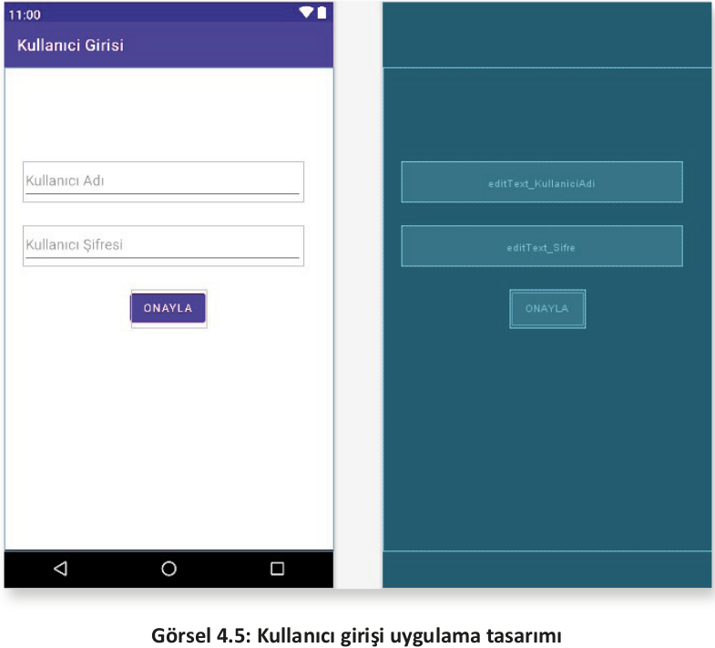

**2. Adım:** Button nesnesinin "onClick" özelliğine "onayla" yazınız.

**3. Adım:** MainActivity’yi açınız ve eklenen ögeleri "findViewById" metodu ile onCreate blokları içinde şu şekilde tanımlayınız:

```java
public class MainActivity extends AppCompatActivity {
    EditText editText_KullaniciAdi, editText_Sifresi;
    Button button_Onayla;
    @Override
    protected void onCreate(Bundle savedInstanceState) {
    super.onCreate(savedInstanceState);
    setContentView(R.layout.activity_main);
    
    editText_KullaniciAdi = findViewById(R.id.editText_KullaniciAdi);
    editText_Sifresi = findViewById(R.id.editText_Sifre);
    button_Onayla = findViewById(R.id.button_Onayla);
    }
}
```

**4. Adım**: MainActivity sınıfının içinde, onCreate metodunun dışında olacak şekilde, geri dönüş değeri olmayan bir metot tasarlayınız. Metoda "onayla" adını veriniz. Parametre olarak da View sınıfından "view" isimli bir nesne gönderiniz.
   
**5. Adım**: MainActivity sınıfının blokları arasına "kullanıcıAdi" ve "sifre" isminde iki adet sabit tanımlayıp istediğiniz kullanıcı adı ve şifre bilgilerini buraya giriniz.


```java
final String kullaniciAdi = "atilimciftci";
final String sifre = "12345";
```

**6. Adım:** "onayla" isminde geri dönüş değeri olmayan (void) bir metot tanımlayınız. editText_KullaniciAdi ve editText_Sifre ögelerinden aldığınız bilgileri, bu metot blokları içinde String tipte tanımladığınız "kullaniciAdiGiris" ve "sifreGiris" isimli değişkenlerin içine atınız.

```java
public void onayla(View view){
    String kullaniciAdiGiris = editText_KullaniciAdi.getText().toString();
    String sifreGiris = editText_Sifresi.getText().toString();
}
```

**7. Adım:** if-else karar yapısında sabit olarak tanımlanan "kullaniciAdi" ile yine sabit olarak tanım-
lanan "sifre" bilgilerini "kullaniciAdiGiris" ve "sifreGiris" değişkenleri ile karşılaştırınız. Karşılaştır-
ma işleminde "ve operatörünü (&&)" kullanınız.

```java
if(kullaniciAdi.equals(kullaniciAdiGiris) && sifre.equals(sifreGiris)) {
}
else {
}
```

**NOT:**

>Diğer programlama dillerinde sıklıkla kullanılan "==" karşılaştırma operatörü ile tam olarak referans eşitliği kontrol edilir. Bir başka deyişle iki taraftaki sorgulanan bilgilerin aynı object türünden olup olmadığı kontrol edilir. Bu nedenle Java programlama dilinde String tipteki bilgiler bu karşılaştırma operatörü ile değil, **equals()** metodu ile karşılaştırılır. Bu metot ile değer eşitliği kontrol edilir. Bir başka deyişle kıyaslanan iki String ifadenin içeriklerinin aynı olup olmadığına bakılır.

**8. Adım:** Karşılaştırılan ifadelerin "true" olması durumunda "Kullanıcı Girişi Başarılı", "false" olması durumunda ise "Kullanıcı Adı veya Şifresi Hatalı" şeklinde bir Toast mesajı hazırlayınız.

```java
if(kullaniciAdi.equals(kullaniciAdiGiris) && sifre.equals(sifreGiris)) {
    Toast.makeText(this,"Kullanıcı Girişi Başarılı",Toast.LENGTH_LONG).show();
}
else {
    Toast.makeText(this,"Kullanıcı Adı veya Şifresi Hatalı",Toast.LENGTH_LONG).show();
}
```

**9. Adım:** Uygulamanın son şekli Görsel 4.6’da verilmiştir. Buna göre Shift+F10 tuşlarıyla veya Başlat ikonuyla uygulamayı çalıştırınız.

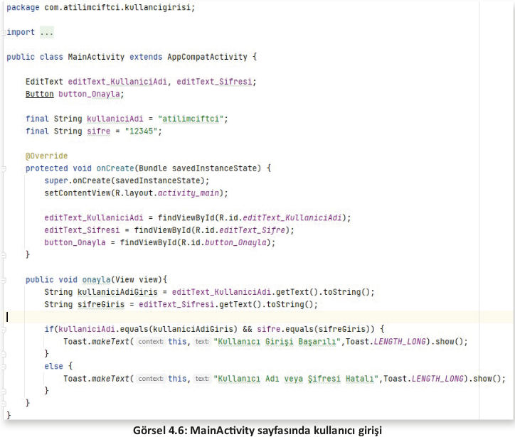

**4. UYGULAMA**: İşlem adımlarına göre mobil uygulama ekranına üç adet "switch" ögesi ekleyiniz. Birinci switch ögesi olan "Konum Servisleri" açık ise "Konum Bilgilerini Al" ve "Konum Bilgilerini Gönder" switchlerini kontrol ederek açık ve kapalı olanları Toast mesajında gösteren uygulamayı tasarlayınız.

**1. Adım**: Üç adet switch ve bir adet button ile Görsel 4.7’yi oluşturunuz. Birinci switchi; id’si "switch_KonumServisi", layouth_with özelliği "match_parent", Left Margin özelliği ise 8 dp olacak şekilde ayarlayınız. İkinci switchi; id’si "switch_KonumAl", layouth_with özelliği "match_parent", Left Margin özelliği ise 50 dp olacak şekilde ayarlayınız. Üçüncü switchi; id’si "switch_KonumGonder", layouth_with özelliği "match_parent", Left Margin özelliği ise 50 dp olacak şekilde ayarlayınız.

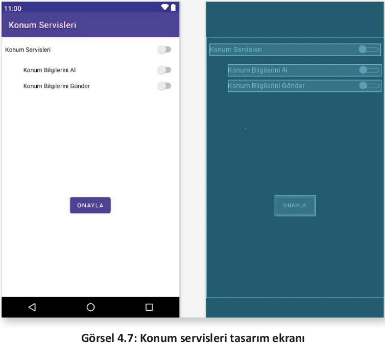

**2. Adım:** Oluşturulan ögeleri MainActivity sayfasında tanımlayıp onCreate blokları içinde findViewById metodu ile initialize (başlatma) ediniz.

```java
Switch konumServisleri,konumGonder,konumAl;
@Override
protected void onCreate(Bundle savedInstanceState) {
    super.onCreate(savedInstanceState);
    setContentView(R.layout.activity_main);
    
    konumServisleri = findViewById(R.id.switch_KonumServisi);
    konumAl = findViewById(R.id.switch_KonumAl);
    konumGonder = findViewById(R.id.switch_KonumGonder);
}
```

**3. Adım:** Uygulama ilk açıldığında konum servislerinin durumunu kontrol etmek için bir if-else karar yapısı uygulayınız. Bunun için onCreate metodu içine Görsel 4.8’deki kodu ekleyiniz.

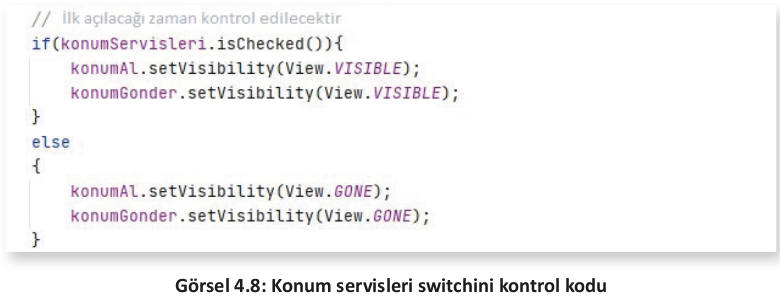

**4. Adım:** Yaşam döngülerinden olan "onResume" metodunu oluşturunuz. Konum servisleri switchi anlık olarak kapatılıp açıldığında alt switchlerin ona göre hareketler yapması istenir. Bunun için onCreate metodundan çıkılıp MainActivity sınıfı bloklarındayken onResume yazılırsa Görsel 4.9’da olduğu gibi bir görüntü elde edilir. Enter tuşuna basıldığında onResume yaşam döngüsü oluşturulur.

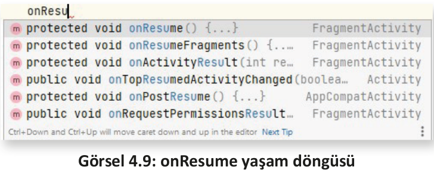

**5. Adım:** Oluşturulan onResume içinde "konumServisleri" isimli switchin anlık durumunun değişimi kontrol edilmelidir. Bunun için de switchin "setOnCheckedChangeListener" metodu kullanılır. Bunlar tıpkı onCreate, onResume gibi interface’den gelen gövdeli metotlardır. Bu nedenle bunlar da override edilir. Kullanımı için "onResume" metodu blokları içindeyken "konumServisleri.setOnCheckedChangeListener()" yazınız. Parametre girmek için Görsel 4.10’da görüldüğü gibi new yazınız. Çıkan "onCheckedChangeListener" seçeneğine Enter tuşu ile basınız ve Görsel 4.11’de görülen yapıyı oluşturunuz.

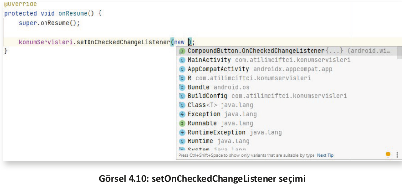

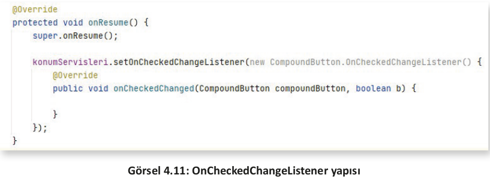

**6. Adım:** "onCheckedChanged" metodunun blokları arasına girilerek karar ve kontrol yapıları oluşturulur. Buradaki kontroller bire bir şekilde onCreate blokları arasında yazılan if-else karar yapılarıdır. Öncelikle konumServisleri switchinin açık olup olmadığı kontrol edilir. Açık olursa alt switchlerin (Konum Al ve Konum Gönder) görünümü aktif, kapalı olursa da pasif edilir. Bunun için "setVisibility" metodunu kullanarak içine View sınıfından parametre gönderiniz (Görsel 4.12).

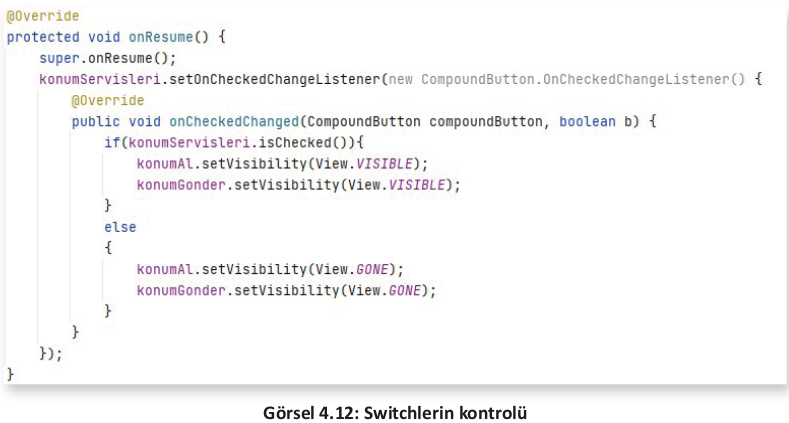

**7. Adım:** Buton işleri için buttonun onClick özelliğine "onayla yazınız ve MainActivity’yi açıp orada da geri dönüş değeri olmayan bir metot tanımlayınız. Bu metodun içinde switchin kontrolünü yapınız. Switch pasif durumdaysa diğer alt switchlere bakmadan Toast mesajı ile "Konum Servisleri Kapalı mesajı veriniz. Switch aktif durumdaysa alt switchleri kontrol ediniz ve bu switchlerin durumunu Toast mesajı ile bildiriniz (Görsel 4.13).

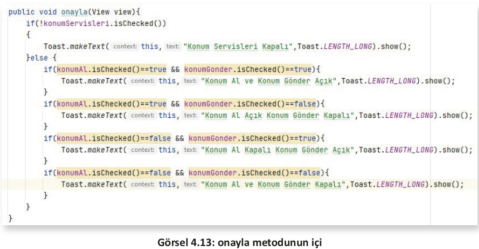

**NOT:**

>konumServisleri önünde bulunan "!" işareti durumu terslemek için kullanılır. Bir başka deyişle olumlu olan durumu olumsuza çevirir. Ayrıca else karar yapısı içinde farklı durumlarda ne yapılacağını anlatmak için if’ler yeniden kullanılır ve iç içe karar yapıları oluşturulur.

MainActivity içindeki kodların bütün hâli Görsel 4.14’te görülür.


<h2 id="4.1.3.">4.1.3. if-else-if Karar Yapısı</h2>

Birden fazla şartın olduğu durumlarda "if-else-if" karar yapısı kullanılır. Örneğin dördüncü uygulama için onayla isimli metot içinde dört adet şart vardır (Görsel 4.14). Bunlar, tek tek "if" ile yazılabileceği gibi "if-else-if" yapısıyla da oluşturulabilir. "if-else-if" karar yapısı şu şekildedir:

```java
if(şart){
    //true ise yapılacaklar
}else if(şart)
    //true ise yapılacaklar
}else if(şart)
    //true ise yapılacaklar
}
```

**5. UYGULAMA:** İşlem adımlarına göre mobil uygulama ekranında kullanıcı tarafından bir derse ait üç not girişi yapıldığında dersin ortalamasını alan ve Toast mesajı ile ortalamanın karşılığını veren uygulamayı tasarlayınız.
   
**1. Adım:** Görsel 4.15’teki tasarımı yaparak "Infer Constraints" ile otomatik constraint veriniz. Üç adet number ögesi (EditText), 1 adet button ögesi ekleyiniz. EditTextlerin id’lerini "editTextNumber_Not1", "editTextNumber_Not2", "editTextNumber_Not3" şeklinde, buttonun id’sini ise "button_Onayla" biçiminde oluşturunuz. EditTextlerin hint özelliğine ilgili yazıları giriniz . Buttonun onClick özelliğine de "onayla" yazınız.

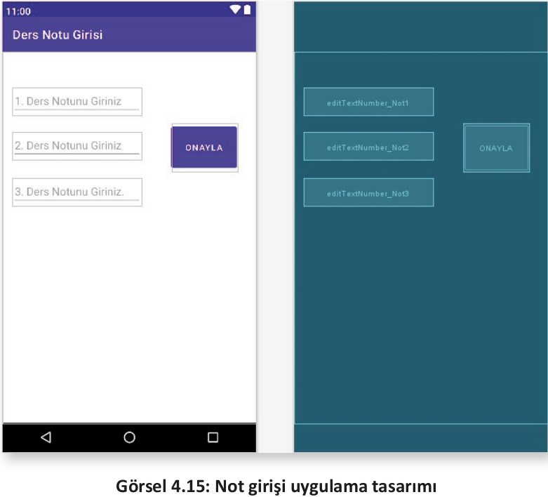

**2. Adım:** MainActivity sınıfında nesneleri tanımlayıp onCreate blokları içinde başlatınız.

**3. Adım:** "onayla" isminde void tipteki metodu tanımlayarak View sınıfından view isimli bir parametre gönderiniz.

**4. Adım**: Metot içinde integer tipte not1, not2, not3 isimlerindeki değişkenleri tanımlayınız . EditTextlerden gelen verileri integer veri tipine çevirerek oluşturulan değişkenlerin içlerine atınız. Float tipte ort isminde bir değişken tanımlayıp girilen üç notun hesaplamasını bu değişkende yapınız.

**5. Adım**: if-else-if karar yapısını oluşturarak Görsel 4.16’daki gibi şartları yazınız.

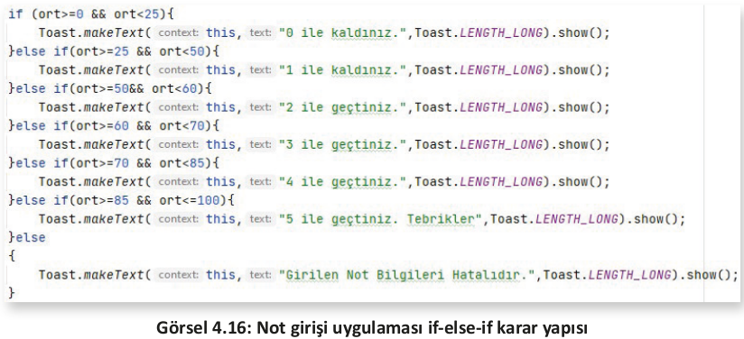

**6. Adım:** MainActivity sınıfının içi Görsel 4.17a ve Görsel 4.17b’deki hâle geldikten sonra uygulamayı başlatarak test ediniz.

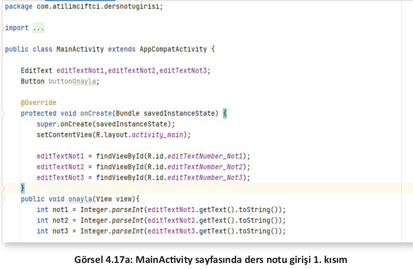

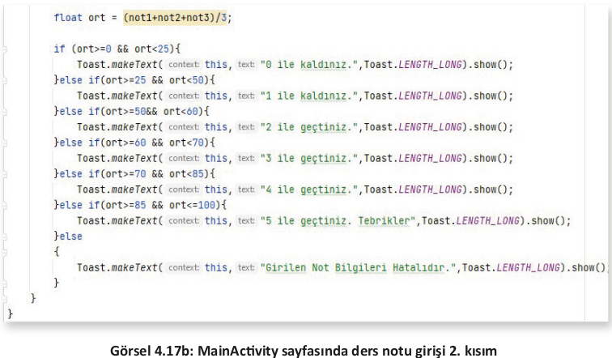

<h2 id="4.1.4.">4.1.4. Switch-Case Yapısı</h2>

Switch-case, bir başka karar yapısıdır. Burada olay, switch içinde verilen ifadenin değeri hangi case içinde yer alırsa o case blokunun çalışması üzerine kuruludur. Her case ifadesi "break" komutuyla bitirilir. "break" komutu, işlem bittikten sonra bir alt case ifadesi çalıştırılmadan switch-case yapısından çıkmak için kullanılır. C dili zamanından bu yana değişiklik göstermeyen bu karar yapısı,birçok farklı dilde aynı şekilde kullanılır (Tablo 4.1). Switch ifadesinde belirtilen parametrenin veri türü ile case içinde belirtilen verinin türü aynı olmak zorundadır.

**Tablo 4.1: Switch-Case Kullanımı**

<table>

<tbody>
  <tr>
    <td>
    <pre><code class="language-java">switch (integer ifade){
        case integer değer:
            //kodlar
            break;
        case integer değer:
            //kodlar
            break;
        case integer değer:
            //kodlar
            break;
        default:
            //kodlar
            break;
        }</code></pre>
    </td>
    <td>
    <pre><code class="language-java">switch (String ifade){
        case "metinsel değer":
            //kodlar
            break;
        case "metinsel değer":
            //kodlar
            break;
        case "metinsel değer":
            //kodlar
            break;
        default:
            //kodlar
            break;
        }</code></pre>
    </td>
    <td>
    <pre><code class="language-java">switch (integer ifade){
        case 'char değer':
            //kodlar
            break;
        case 'char değer':
            //kodlar
            break;
        case 'char değer':
            //kodlar
            break;
        default:
            //kodlar
            break;
        }</code></pre>
    </td>
  </tr>
</tbody>
</table>

**NOT:**

>Default değeri, case ifadelerinden hiçbiri uygun değilse çalışacak blok kısmıdır.

**6. UYGULAMA**: İşlem adımlarına göre mobil uygulama ekranında kullanıcı tarafından ay bilgisi bir EditTexte sayı olarak girildikten sonra "Onayla" buttonuna basıldığı zaman hangi ay olduğunu yazıyla bir TextViewde gösteren mobil uygulamayı switch-case karar yapısını kullanarak tasarlayınız.

**1. Adım**: File>New>New Project sekmesinden yeni proje açınız ve Empty Activity seçiniz.

**2. Adım**: Açılan ekranda activity_main içine Görsel 4.18’deki ekran tasarımını yapınız. Tasarımda bir adet "Number", bir adet "Button" ve bir adet de "TextView" bulundurunuz. Number ögesini tasarım ekranının üst kısmına sabitleyiniz. Boşluk olarak 24 dp bırakınız. Aynı şekilde sağ ve sol yanı da çerçeveye sabitleyerek sağdan ve soldan tasarıma ortalayınız. Boşluk değeri olarak 0 dp bırakınız. Button ögesini de Number nesnesine sabitleyip arada 100 dp bırakınız. Soldan ve sağdan sabitleyip onu da tasarımda ortalayınız. TextView ögesinin layout_width (genişlik) özelliğini "match_parent" şeklinde ayarlayıp, tasarım içinde tek satırda tek öge olarak kendini büyütmesini sağlayınız. Sağdan ve soldan 8 dp boşluk bırakarak çerçeveye sabitleyiniz. Üstten ise buttona sabitleyip arada 200 dp bırakınız. Yazı tipi boyutu textSize özelliğini 50 sp olarak ayarlayıp, "textAlignment" özelliğinden "Align Center"ı işaretleyerek TextView yerleşimini ortalayınız.

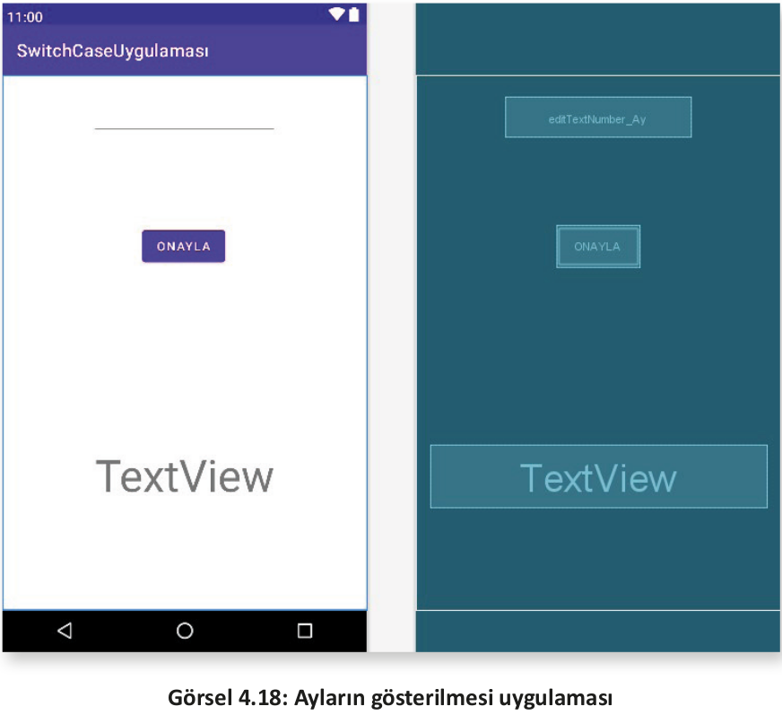

**3. Adım:** Number ögesinin id’sini "editTextNumber_Ay" şeklinde değiştiriniz. Button ögesinin id’sini "button_Onayla", text özelliğini "Onayla" olarak değiştiriniz. "onClick" özelliğine de "onayla" yazınız.

**4. Adım:** Ögeleri Görsel 4.19’da görüldüğü şekilde initialize yapınız.

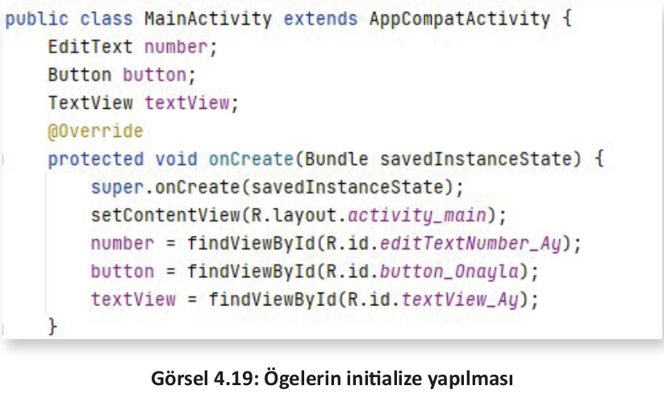

**5. Adım:** onayla isimli buttona tıklandığı zaman çalışacak metodu Görsel 4.20’de olduğu gibi hazırlayınız. Görselde sayfa ikiye ayrılmış durumdadır. Bu ayrılma kodlama esnasında yapılmaz,case 7 ifadesi case 6’dan sonra alt alta yazılarak işleme devam edilir. "onayla" isimli metodun içinde switch-case oluşturulur. Metot içinde önce sayı okutulur sonra switch ile karşılaştırma yapılır. Case olarak gelebilecek değerler 1 ile 12 arasında değişir. Bunlar dışında bir değer gelirse de default olarak ayrılan bölüm çalışır. Buttona her tıklamada number nesnesinin içeriğinin de silinmesi için "number.setText("");" kodunu yazınız ve metot bittikten sonra uygulamayı çalıştırınız.


>**SIRA SİZDE:**
>
>Mobil uygulama ekranında EditText ile yaş bilgisi, switch ögesi ile de ehliyet kursunu tamamlama bilgisi istenen kişi için buttona basıldığında yaşı 18 ve daha büyükse ve ehliyet sınavından geçmişse ekrana Toast mesajı olarak "Ehliyet Alabilirsiniz", değilse "Ehliyet Alamazsınız" mesajı veren uygulamayı hazırlayınız.
>
>**DEĞERLENDİRME:** 
>
>Çalışmanız aşağıda yer alan kontrol listesi kullanılarak değerlendirilecektir. Çalışmanızı yaparken değerlendirme ölçütlerini dikkate alınız.
>
>**KONTROL LİSTESİ**
>
>| DEĞERLENDİRME ÖLÇÜTLERİ                                                                     | EVET | HAYIR |
>| ------------------------------------------------------------------------------------------- | ---- | ----- |
>| 1. Palette menüsünü kullanarak yaş bilgisini girmek için EditText ögesi oluşturdu.          |
>| 2. Palette menüsünü kullanarak ehliyet kursu tamamlama bilgisi için switch ögesi oluşturdu. |
>| 3. Palette menüsünü kullanarak Button ögesi oluşturdu.                                      |
>| 4. Ögelerin ConstraintLayout içinde sınırlarını belirledi.                                  |
>| 5. Ögeleri yaşam döngüsü içinde initalize etti.                                             |
>| 6. Buttona tıkladığında çalışacak metodu hazırladı.                                         |
>| 7. Gereğine uygun olacak biçimde "if" karar yapısını oluşturdu.                             |
>| 8. Şart yapısında ve (&&) operatörünü amacına uygun olarak kullandı.                        |
>| 9. Toast mesaj ögesini amacına uygun olarak oluşturdu.                                      |