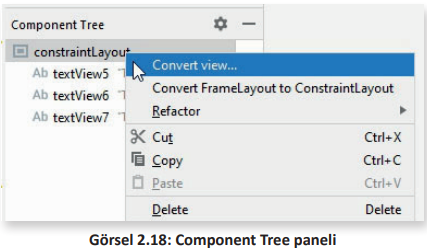
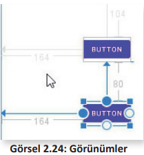
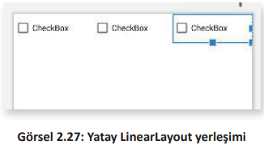
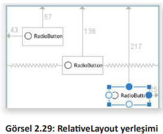

# 2.6. LAYOUT ÇEŞİTLERİ

- <a href="#2.6.1.">2.6.1. ConstraintLayout</a>
- <a href="#2.6.2.">2.6.2. LinearLayout</a>
- <a href="#2.6.3.">2.6.3. RelativeLayout</a>
- <a href="#2.6.4.">2.6.4. FrameLayout</a>
  
Layout, alt görünümlerin ekranda nasıl konumlandırılacağını kontrol eden kapsayıcı bir yerleşimdir. Bu alt görünümler; TextView, Button veya ImageView gibi görünüm bileşenleridir. Mobil uygulama geliştirilirken layout kullanılarak görünümler düzenli bir şekilde ekrana yerleştirilir.

Kullanıcı arayüzü tasarlamak için Android SDK’nin sağladığı layout yerleşimleri vardır. Bunlardan bazıları şunlardır:

- ConstraintLayout (Kısıtlamalı Yerleşim)
- LinearLayout (Doğrusal Yerleşim)
- RelativeLayout (Bağıl Yerleşim)
- FrameLayout (Çerçeve Yerleşim)

Mobil uygulama geliştirme ortamında yerleşimlerin türünü değiştirmek için Component Tree paneli kullanılır. Component Tree paneli açık değilse ismi dikey yazılı olan sekmeye tıklanır. Açılan panelin en üstündeki layout üzerinde sağ fare tuşuna basılır. Açılan listeden Convert view… menüsü seçilir (Görsel 2.18). 



Bu aşamada istenen yerleşim ismi seçilir ve Apply düğmesine tıklanır (Görsel 2.19).


**6. UYGULAMA**: İşlem adımlarına göre mobil uygulama geliştirme ortamında yerleşim türünü LinearLayout olarak değiştiriniz.

**1. Adım**: Fare ok işareti Component Tree panelinden değiştirilecek yerleşim isminin üzerindeyken sağ tuşa basınız.

**2. Adım**: Açılan menü listesinden Convert view… seçeneğini tıklayınız.

**3. Adım**: Gelen liste penceresinden LinearLayout yerleşimini seçiniz.

**4. Adım**: Apply düğmesine tıklayınız.

**5. Adım**: Klavyeden Shift+F10 tuşlarıyla uygulamanın ön izlemesini yapınız.

>**SIRA SİZDE:**
>
>Mobil uygulama geliştirme ortamında yerleşim türünü RelativeLayout olarak değiştiriniz.
>
>**DEĞERLENDİRME**: 
>
>Çalışmanız aşağıda yer alan kontrol listesi kullanılarak değerlendirilecektir. Çalışmanızı yaparken değerlendirme ölçütlerini dikkate alınız.
>
>**KONTROL LİSTESİ**
>
>| DEĞERLENDİRME ÖLÇÜTLERİ                                                                                   | EVET | HAYIR |
>| --------------------------------------------------------------------------------------------------------- | ---- | ----- |
>| 1. Fare ok işareti Component Tree panelinden değiştirilecek yerleşim isminin üzerindeyken sağ tuşa bastı. |
>| 2. Açılan menü listesinden Convert view… seçeneğini tıkladı.                                              |
>| 3. RelativeLayout yerleşimini seçti.                                                                      |
>| 4. Apply düğmesine tıkladı.                                                                               |
>| 5. Klavyeden Shift+F10 tuşlarıyla ön izleme yaptı.                                                        |

<h2 id="2.6.1.">2.6.1. ConstraintLayout</h2>

ConstraintLayout, Android işletim sisteminin 7. sürümü ile sunulan bir yerleşimdir. En yeni yerleşim türüdür ve getirdiği yeniliklerle en çok kullanılanıdır. Esnek olduğu, alt görünümleri ekrandan istenen yere konumlandırdığı ve çoğu yerleşim gereksinimlerini karşıladığı için tercih edilir. Basit kısıtlama ayarlarıyla bileşenler birbirinin içine yerleştirilmeden hızlı ve kolay bir şekilde kullanıcı arayüzü tasarlanabilir. Ayrıca Android Studio tasarım editörü kullanılarak basit sürükle bırak işlemleriyle tüm bir layout tasarlanabilir (Görsel 2.20). 


Palette paneli içinde sürükle bırak yöntemiyle alt görünümler tasarım ekranına yerleştirilir. Alt görünümün etrafındaki yuvarlaklar kullanılarak sürükle bırak yöntemiyle ya kenar boşluklarına ya da diğer görünümlere bağlanır. Bu sayede ekranın istenen bir konumuna görünüm yerleştirilebilir. 

ConstraintLayout yerleşimi oluşturulmak istenirse XML kod olarak şunlar yazılır:

```XML
<?xml version="1.0" encoding="utf-8"?>
<androidx.constraintlayout.widget.ConstraintLayout
    xmlns:android="http://schemas.android.com/apk/res/android"
    xmlns:app="http://schemas.android.com/apk/res-auto"
    xmlns:tools="http://schemas.android.com/tools"
    android:layout_width="match_parent"
    android:layout_height="match_parent"
    tools:context=".MainActivity">
    <!--
    Bu bölüme View ve ViewGroup
    XML kodları yazılır.
    -->
</androidx.constraintlayout.widget.ConstraintLayout>
```

**UYARI**: XML kodları yazılırken <!-- ve --> sembolleri arasına yorum satırları yazılabilir. Yorum satırları,
kodların çalışmasını etkilemez.

**7. UYGULAMA**: İşlem adımlarına göre mobil uygulama geliştirme ortamında ConstraintLayout yerleşimine iki adet Button görünümü ekleyiniz ve constraint ayarlarını yaparak alt alta yerleştiriniz.

**1. Adım**: activity_main.xml dosyasının içindeki tüm kodları siliniz.

**2. Adım**: activity_main.xml dosyasının içinde ConstraintLayout oluşturmak için şu XML kodlarını yazınız:

```xml
<?xml version="1.0" encoding="utf-8"?>
<androidx.constraintlayout.widget.ConstraintLayout
    xmlns:android="http://schemas.android.com/apk/res/android"
    xmlns:app="http://schemas.android.com/apk/res-auto"
    xmlns:tools="http://schemas.android.com/tools"
    android:layout_width="match_parent"
    android:layout_height="match_parent"
    tools:context=".MainActivity">
</androidx.constraintlayout.widget.ConstraintLayout>
```

**3. Adım**: Palette panelini kullanarak birinci Button görünümünü sürükle bırak ile tasarım ekranına yerleştiriniz.

**4. Adım**: Palette panelini kullanarak ikinci Button görünümünü sürükle bırak ile tasarım ekranına yerleştiriniz.

**5. Adım**: Birinci Button görünümünün sol tarafındaki yuvarlağa tıklayarak oluşan oku sürükle bırak ile sol kenara taşıyınız (Görsel 2.21).

**6. Adım**: Sol kenara yapışan birinci Button görünümünü sürükle bırak yöntemiyle sağa doğru ekranın ortasına getiriniz.

**7. Adım**: Birinci Button görünümünün üst tarafındaki yuvarlağa tıklayarak oluşan oku sürükle bırak ile üst kenara taşıyınız (Görsel 2.22).

**9. Adım**: Üst kenara yapışan birinci Button görünümünü sürükle bırak yöntemiyle aşağı doğru ekranın ortasına getiriniz.

**10. Adım**: İkinci Button görünümünün üst tarafındaki yuvarlağa tıklayarak oluşan oku birinci Button görünümünün alt tarafına taşıyınız (Görsel 2.23).


**11. Adım**: Üstteki Button görünümüne yapışan ikinci Button görünümünü sürükle bırak yöntemiyle aşağı doğru ekranın ortasına getiriniz.

**12. Adım**: İkinci Button görünümün sol tarafındaki yuvarlağa tıklayarak oluşan oku sürükle bırak ile sol kenara taşıyınız.

**13. Adım**: Sol kenara yapışan ikinci Button görünümünü sürükle bırak yöntemiyle sağa doğru ekranın ortasına getiriniz (Görsel 2.24).



**UYARI**: ConstraintLayout yerleşiminde birinci görünüme ikinci bir görünüm bağlandığında ikinci görünüm, birinci görünüme göre konumlandırılır. Bir görünüm sol kenar boşluğuna bağlanırsa bu görünümün sol kenar boşluğu korunur, sağ kenar boşluğu değişebilir.

<h2 id="2.6.2.">2.6.2. LinearLayout</h2>

LinearLayout, seçilen yatay veya dikey yönlendirmeye göre alt görünümleri tek bir satır veya tek bir sütuna yerleştiren bir yerleşim türüdür. LinearLayout yatay özelliği kullanılarak Palette panelinden getirilen TextView, Button1 ve Button2 alt görünümleri tek bir satırda yan yana yerleştirilir (Görsel 2.25).


LinearLayout dikey özelliği kullanılarak Palette panelinden getirilen TextView, Button1 ve Button2 alt görünümleri tek bir sütunda alt alta yerleştirilir (Görsel 2.26).


LinearLayout yerleşimi oluşturulmak istenirse XML kod olarak şunlar yazılır:

```xml
<?xml version="1.0" encoding="utf-8"?>
<LinearLayout xmlns:android="http://schemas.android.com/apk/res/android"
    android:orientation="vertical"
    android:layout_width="match_parent"
    android:layout_height="match_parent">
    <!--
    Bu bölüme View ve ViewGroup
    XML kodları yazılır.
    -->
</LinearLayout>
```

**UYARI**: LinearLayout yerleşimini dikey ayarlamak için **android:orientation="vertical"** veya yatay ayarlamak için **android:orientation="horizantal"** komutları yazılır.

**8. UYGULAMA**: İşlem adımlarına göre mobil uygulama geliştirme ortamında LinearLayout yerleşimine üç adet CheckBox görünümünü yatay olarak ekleyiniz.

**1. Adım**: activity_main.xml dosyasının içindeki tüm kodları siliniz.

**2. Adım**: activity_main.xml dosyasının içinde yatay LinearLayout oluşturmak için şu XML kodlarını yazınız:

```xml
<?xml version="1.0" encoding="utf-8"?>
<LinearLayout xmlns:android="http://schemas.android.com/apk/res/android"
    android:orientation="horizantal"
    android:layout_width="match_parent"
    android:layout_height="match_parent">
</LinearLayout>
```

**3. Adım**: Palette panelini kullanarak Buttons bölümünü seçiniz.

**4. Adım**: Birinci CheckBox görünümünü sürükle bırak yöntemiyle tasarım ekranına bırakınız.

**5. Adım**: İkinci CheckBox görünümünü sürükle bırak yöntemiyle tasarım ekranına bırakınız.

**6. Adım**: Üçüncü CheckBox görünümünü sürükle bırak yöntemiyle tasarım ekranına bırakınız (Görsel 2.27).



<h2 id="2.6.3.">2.6.3. RelativeLayout</h2>

RelativeLayout, ConstraintLayouttan sonra en esnek yerleşimdir. Alt görünümler, ekranda kenaruzaklıklarına göre yerleştirilebildiği gibi birbirlerine bağlı olarak da yerleştirilebilir. RelativeLayout içindeki üç adet TextView alt görünümü, kenarlardan mesafelerine göre tasarım ekranına yerleştirilir. Düğme1 alt görünümü, "Bilişim" TextView görünümüne bağlanır. Düğme2 alt görünümü ise "Teknolojileri" TextView görünümüne bağlanır (Görsel 2.28).


Bir alt görünümü diğer bir alt görünüme göre düzenlemek için Above (Yukarıda), Below (Aşağıda), Left (Solda) ve Right (Sağda) ifadeleri kullanılır.

RelativeLayout yerleşimi oluşturulmak istenirse XML kod olarak şunlar yazılır:

```xml
<?xml version="1.0" encoding="utf-8"?>
<RelativeLayout xmlns:android="http://schemas.android.com/apk/res/android"
    android:layout_width="match_parent"
    android:layout_height="match_parent">
    <!--
    Bu bölüme View ve ViewGroup
    XML kodları yazılır.
    -->
</RelativeLayout>
```

**9. UYGULAMA**: İşlem adımlarına göre mobil uygulama geliştirme ortamında RelativeLayout yerleşimine üç adet RadioButton görünümü ekleyiniz.

**1. Adım**: activity_main.xml dosyasının içindeki tüm kodları siliniz.

**2. Adım**: activity_main.xml dosyasının içinde yatay RelativeLayout oluşturmak için şu XML kodlarını yazınız:

```xml
<?xml version="1.0" encoding="utf-8"?>
<RelativeLayout xmlns:android="http://schemas.android.com/apk/res/android"
    android:layout_width="match_parent"
    android:layout_height="match_parent">
</RelativeLayout>
```

**3. Adım**: Palette panelini kullanarak Buttons bölümünü seçiniz.

**4. Adım**: Birinci RadioButton görünümünü sürükle bırak yöntemiyle tasarım ekranına bırakınız.

**5. Adım**: İkinci RadioButton görünümünü sürükle bırak yöntemiyle tasarım ekranına bırakınız.

**6. Adım**: Üçüncü RadioButton görünümünü sürükle bırak yöntemiyle tasarım ekranına bırakınız (Görsel 2.29).



<h2 id="2.6.4.">2.6.4. FrameLayout</h2>

FrameLayout, alt görünümleri en basit şekilde organize edebilecek yerleşim türüdür. Ekranın bir bölümü kaplanır ve alt görünüme atanacak **android:layout_gravity** niteliğiyle görünümlerin konumlandırılması sağlanır (Görsel 2.30). Bu nitelik atanmazsa alt görünümler üst üste yerleştirilir.


FrameLayout yerleşimi oluşturulmak istenirse XML kod olarak şunlar yazılır:

```xml
<?xml version="1.0" encoding="utf-8"?>
<FrameLayout xmlns:android="http://schemas.android.com/apk/res/android"
    android:layout_width="match_parent"
    android:layout_height="match_parent">
    <!--
    Bu bölüme View ve ViewGroup
    XML kodları yazılır.
    -->
</FrameLayout>
```

**10. UYGULAMA**: İşlem adımlarına göre mobil uygulama geliştirme ortamında FrameLayout yerleşimine üç adet TextView görünümü ekleyiniz.

**1. Adım**: activity_main.xml dosyasının içindeki tüm kodları siliniz.

**2. Adım**: activity_main.xml dosyasının içinde FrameLayout oluşturmak için şu XML kodlarını yazınız:

```xml
<?xml version="1.0" encoding="utf-8"?>
<FrameLayout xmlns:android="http://schemas.android.com/apk/res/android"
    android:layout_width="match_parent"
    android:layout_height="match_parent">
</FrameLayout>
```

**3. Adım**: Palette panelini kullanarak Common bölümünü seçiniz.

**4. Adım**: Birinci TextView görünümünü sürükle bırak yöntemiyle tasarım ekranına bırakınız.

**5. Adım**: İkinci TextView görünümünü sürükle bırak yöntemiyle tasarım ekranına bırakınız.

**6. Adım**: Üçüncü TextView görünümünü sürükle bırak yöntemiyle tasarım ekranına bırakınız.

**7. Adım**: Birinci TextView görünümüne XML android:layout_gravity="top|left" kodunu ekleyiniz.

**8. Adım**: İkinci TextView görünümüne XML android:layout_gravity="center" kodunu ekleyiniz.

**9. Adım**: Üçüncü TextView görünümüne XML android:layout_gravity="top|right" kodunu ekleyiniz (Görsel 2.31).


