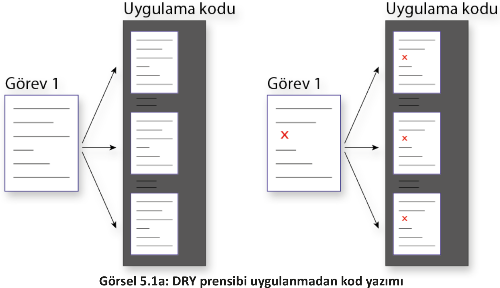
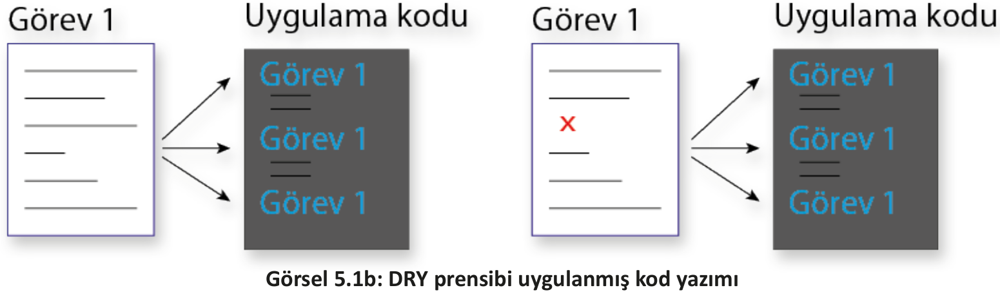
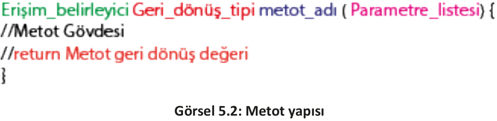

<h1 style="color:#ff5432;">5.1. METOT</h1>

- <a href="#5.1.1.">5.1.1. Metot Yapısı</a> 
- <a href="#5.1.2.">5.1.2. Değer Döndürmeyen Metotlar</a> 
- <a href="#5.1.3.">5.1.3. Değer Döndüren Metotlar</a> 
- <a href="#5.1.4.">5.1.4. Parametre Alan Metotlar </a> 
- <a href="#5.1.5.">5.1.5. Metotlarda Aşırı Yükleme </a> 

Programlama dünyasında birçok avantaja sahip yazılım prensipleri vardır. Bu ilkelerden en çok bilineni DRY (Don’t Repeat Yourself) "kendini tekrar etme" prensibidir. DRY prensibinin amacı,kod tekrarını önlemektir.

Aynı görevleri gerçekleştiren kodlar birden çok yerde yazıldığında bu görevdeki değişiklik, kodların tamamında değişiklik yapılması anlamına gelir (Görsel 5.1a). Bu durum, daha uzun kod satırlarına, daha uzun süreye ve hata yapma ihtimalinin artmasına neden olur.

Aynı görevleri gerçekleştiren kodların bir blok hâline getirilmesi ve buna uygulama içinde referans verilmesiyle DRY prensibi uygulanır (Görsel 5.1b). Bu kod bloku içinde herhangi bir değişiklik yapılması durumunda uygulama kodunda düzenlemeye gerek kalmaz.
<div style="display:block;text-align:center">



</div>

Aynı kod satırlarının tekrar tekrar yazılmasına gerek kalmadan çağrılabileceği kullanışlı kod parçalarına **metot** denir. Metot, belirli bir görevi yerine getiren bağımsız kod bloku olarak da ifade edilir. Metotlar, birçok kod satırı içerebilen uygulamadaki büyük ve karmaşık hesapları daha yönetilebilir parçalara böler.

<h2 id="5.1.1." style="color:#ff5432;">5.1.1 Metot Yapısı</h2>
Bir metot genellikle altı bölümden oluşur (Görsel 5.2).

- **Erişim Belirleyici (Düzeyleri):** Metoda uygulama içinden nerelerden erişebileceğini ifade eder.

- **Geri Dönüş Tipi:** Metodun geriye döndüreceği tip değeridir. Geri dönüş tipi olarak void belirlenmişse geriye bir değer döndürmez.

- **Metot Adı:** Metoda verilen isimdir. Java isimlendirme standartlarına göre Camel Case şeklinde yazılır.

- **Parametre Listesi:** Metoda gönderilecek değerleri ifade eder. Birden fazla değer gönderilecek ise aralarına virgül kullanılır. Metoda değer gönderilmeyecek ise parantez içine herhangi bir şey yazılmaz.

- **Metot Gövdesi:** Küme parantezleri arasındaki kısımdır. Bu bölüme metodun amaçladığı işi gerçekleştirilecek kodlar yazılır.

- **Geri Dönüş Değeri:** Metot işlevini yerine getirdikten sonra çağrıldığı yere geri döndüreceği değerin yazıldığı kısımdır. Geri dönüş değerinden önce return komutu yazılır. Metot herhangi bir değer geri döndürmüyor ise return komutunun kullanılması zorunlu değildir.
<div style="display:block;text-align:center">


</div>
<h2 id="5.1.2." style="color:#ff5432;">5.1.2. Değer Döndürmeyen Metotlar</h2>

Bir metot, yaptığı işlem sonucunda herhangi bir değer geri döndürmüyor ise bu metoda değer döndürmeyen metot denir. Bir metodu değer döndürmeyen metot şeklinde tanımlamak için geri dönüş tipi olarak void yazılır.

<span style="font-weight:bold; padding-top:1px; padding-bottom:1px; padding-left:8px; padding-right:8px; background-color:#FFE5DF;">ÖRNEK</span>

```java
private void selamVer() {
    Toast.makeText(getApplicationContext(),"Merhaba",Toast.LENGTH_LONG).show();
}
```

**1. UYGULAMA**: İşlem adımlarına göre Buttonlara tıklandığında Toast mesaja "Merhaba" yazan bir uygulama tasarlayınız.

**1. Adım**: Mobil uygulama geliştirme programında Empty Activity olacak şekilde bir proje oluşturunuz.\
**2. Adım**: activity_main.xml içine şu kodu yazınız:

```xml
<LinearLayout
    android:layout_width="wrap_content"
    android:layout_height="wrap_content"
    android:orientation="horizontal"
    app:layout_constraintBottom_toBottomOf="parent"
    app:layout_constraintEnd_toEndOf="parent"
    app:layout_constraintStart_toStartOf="parent"
    app:layout_constraintTop_toTopOf="parent">
    <Button
    android:id="@+id/button1"
        android:layout_width="wrap_content"
        android:layout_height="wrap_content"
        android:layout_marginHorizontal="10px"
        android:text="Selam Ver 1" />
    <Button
        android:id="@+id/button2"
        android:layout_width="wrap_content"
        android:layout_height="wrap_content"
        android:layout_marginHorizontal="10px"
        android:text="Selam Ver 2" />
</LinearLayout>
```

**3. Adım**: MainActivity.java dosyasına şu kodu yazınız:

```java
package com.example.metotkavrami;
import androidx.appcompat.app.AppCompatActivity;
import android.os.Bundle;
import android.view.View;
import android.widget.Button;
import android.widget.TextView;
import android.widget.Toast;
public class MainActivity extends AppCompatActivity {
    @Override
    protected void onCreate(Bundle savedInstanceState) {
        super.onCreate(savedInstanceState);
        setContentView(R.layout.activity_main);
        Button btn1 = findViewById(R.id.button1);
        btn1.setOnClickListener(new View.OnClickListener() {
            @Override
            public void onClick(View view) {
                selamVer();
            }
    });
    Button btn2 = findViewById(R.id.button2);
    btn2.setOnClickListener(new View.OnClickListener() {
            @Override
            public void onClick(View view) {
                selamVer();
            }
        });
    }
    private void selamVer() {
        Toast.makeText(getApplicationContext(),"Merhaba",Toast.LENGTH_LONG).show();
    }
}
```
**4. Adım:** Run düğmesine tıklayarak uygulamayı çalıştırınız.\
**5. Adım:** SELAM VER düğmesine tıklayınız.

>**SIRA SİZDE:**
>
>Bir Buttondan oluşan bir uygulama tasarlayınız. Buttona tıklandığında iki sayıyı toplayan kodu metot kullanarak yazınız.
>
>**DEĞERLENDİRME:** 
>
>Çalışmanız aşağıda yer alan kontrol listesi kullanılarak değerlendirilecektir. Çalışmanızı yaparken değerlendirme ölçütlerini dikkate alınız.
>
><div style="text-align:center;"><b>KONTROL LİSTESİ</b></div>
>
>| DEĞERLENDİRME ÖLÇÜTLERİ                                       | EVET | HAYIR |
>| :------------------------------------------------------------- | ---- | ----- |
>| 1. New Project komutunu tıkladı.                              |
>| 2. Empty Activity proje türünü seçti.                         |
>| 3. Uygulama adını belirledi.                                  |
>| 4. Uygulama tasarım ekranına bir Button ekledi.               |
>| 5. MainActivity.java dosyasında Button tıklama olayını yazdı. |
>| 6. Button tıklama olayında "topla" metodunu çağırdı.          |
>| 7. Metot adı "topla" olacak şekilde bir metot oluşturdu.      |
>| 8. Toplama kodlarını doğru şekilde yazdı.                     |
>| 9. Toplama sonucunu Toast mesajına doğru olarak yazdı.        |
>| 10. Run düğmesiyle uygulamayı çalıştırdı.                     |

<h2 id="5.1.3." style="color:#ff5432;">5.1.3 Değer Döndüren Metotlar</h2>

Bazı metotların yaptığı işlem sonucunda çağrıldığı yere değer döndürmesi gerekir. Metot, geri döndüreceği değerin türüne göre tanımlanmalıdır. Değer geri döndürmek için metot içinde return ifadesi kullanılır.

<span style="font-weight:bold; padding-top:1px; padding-bottom:1px; padding-left:8px; padding-right:8px; background-color:#FFE5DF;">ÖRNEK</span>

```java
private int topla() {
    return 5+10;
}
```

**2. UYGULAMA**: İşlem adımlarına göre butona tıklandığında Toast mesaja iki sayının toplamını yazan bir uygulama tasarlayınız.

**1. Adım**: Mobil uygulama geliştirme programında Empty Activity olacak şekilde bir proje oluşturunuz.\
**2. Adım**: Uygulama ekranında iki EditText ve bir Button oluşturan şu kodu activity_main.xml içine yazınız:

```xml
<LinearLayout
    android:layout_width="wrap_content"
    android:layout_height="wrap_content"
    app:layout_constraintBottom_toBottomOf="parent"
    app:layout_constraintEnd_toEndOf="parent"
    app:layout_constraintStart_toStartOf="parent"
    app:layout_constraintTop_toTopOf="parent">
    <EditText
        android:id="@+id/editText1"
        android:layout_width="100dp"
        android:layout_height="50dp"
        android:text="5"
        android:inputType="number"
        />
    <EditText
        android:id="@+id/editText2"
        android:layout_width="100dp"
        android:layout_height="50dp"
        android:text="10"
        android:inputType="number"/>
    <Button
        android:id="@+id/button1"
        android:layout_width="wrap_content"
        android:layout_height="wrap_content"
        android:text="Topla" />
</LinearLayout>
```

**3. Adım:** MainActivity.java dosyasına şu kodu yazınız:

```java
package com.example.metotkavrami2;
import androidx.appcompat.app.AppCompatActivity;
import android.os.Bundle;
import android.view.View;
import android.widget.Button;
import android.widget.EditText;
import android.widget.TextView;
import android.widget.Toast;
public class MainActivity extends AppCompatActivity {
    @Override
    protected void onCreate(Bundle savedInstanceState) {
        super.onCreate(savedInstanceState);
        setContentView(R.layout.activity_main);
        Button btn1 = findViewById(R.id.button1);
        EditText editText1 = findViewById(R.id.editText1);
        EditText editText2 = findViewById(R.id.editText2);
        btn1.setOnClickListener(new View.OnClickListener() {
            @Override
            public void onClick(View view) {
            int sonuc = topla();
                                
            Toast.makeText(getApplicationContext(),Integer.toString(sonuc),Toast.LENGTH_LONG).show();
            }
        });
    }
    private int topla() {
        return 5 + 10;
    }
}
```

**4. Adım:** Run düğmesine tıklayarak uygulamayı çalıştırınız.

**5. Adım:** TOPLA düğmesine tıklayınız.

<h2 id="5.1.4." style="color:#ff5432">5.1.4 Parametre Alan Metotlar</h2>

Bazı metotların işlem yapabilmesi için metot dışından bilgi alması gerekir. Metodun aldığı bu bilgilere parametre denir. Parametre, metot isminden sonra parantez içine bir değişken tanımlama gibi yazılır. Birden fazla parametre varsa parametreler arasına virgül kullanılır.

<span style="font-weight:bold; padding-top:1px; padding-bottom:1px; padding-left:8px; padding-right:8px; background-color:#FFE5DF;">ÖRNEK</span>

```java
private int topla(int sayi1, int sayi2) {
    return sayi1 + sayi2;
}
```

Metot çağrılırken parametreler girilmelidir.

<span style="font-weight:bold; padding-top:1px; padding-bottom:1px; padding-left:8px; padding-right:8px; background-color:#FFE5DF;">ÖRNEK</span>

```java
topla(5,10);
```

**3. UYGULAMA**: İşlem adımlarına göre iki sayının toplamını parametre kullanan metot ile gerçekleştiren bir uygulama tasarlayınız.

**1. Adım**: Mobil uygulama geliştirme programında Empty Activity olacak şekilde bir proje oluşturunuz.\
**2. Adım**: Uygulama ekranında iki EditText ve bir Button oluşturan şu kodu activity_main.xml içine yazınız:

```xml
<LinearLayout
    android:layout_width="wrap_content"
    android:layout_height="wrap_content"
    app:layout_constraintBottom_toBottomOf="parent"
    app:layout_constraintEnd_toEndOf="parent"
    app:layout_constraintStart_toStartOf="parent"
    app:layout_constraintTop_toTopOf="parent">
    <EditText
        android:id="@+id/editText1"
        android:layout_width="100dp"
        android:layout_height="50dp"
        android:text="5"
        android:inputType="number"
        />
    <EditText
        android:id="@+id/editText2"
        android:layout_width="100dp"
        android:layout_height="50dp"
        android:text="10"
        android:inputType="number"/>
    <Button
        android:id="@+id/button1"
        android:layout_width="wrap_content"
        android:layout_height="wrap_content"
        android:text="Topla" />
</LinearLayout>
```

**3. Adım:** MainActivity.java dosyasına şu kodu yazınız:

```java
package com.example.metotkavrami3;
import androidx.appcompat.app.AppCompatActivity;
import android.os.Bundle;
import android.view.View;
import android.widget.Button;
import android.widget.EditText;
import android.widget.TextView;
import android.widget.Toast;
public class MainActivity extends AppCompatActivity {
    @Override
    protected void onCreate(Bundle savedInstanceState) {
    super.onCreate(savedInstanceState);
    setContentView(R.layout.activity_main);
    Button btn1 = findViewById(R.id.button1);
    EditText editText1 = findViewById(R.id.editText1);
    EditText editText2 = findViewById(R.id.editText2);
    btn1.setOnClickListener(new View.OnClickListener() {
        @Override
        public void onClick(View view) {
            int sayi1;
            sayi1 = Integer.parseInt(editText1.getText().toString());
            int sayi2;
            sayi2 = Integer.parseInt(editText2.getText().toString());
            int sonuc = topla(sayi1,sayi2);
            Toast.makeText(getApplicationContext(),Integer.toString(sonuc),Toast.LENGTH_LONG).show();
            }
        });
    }
    private int topla(int sayi1, int sayi2) {
        return sayi1 + sayi2;
    }
}
```
**4. Adım:** Run düğmesine tıklayarak uygulamayı çalıştırınız.\
**5. Adım:** TOPLA düğmesine tıklayınız.

>**SIRA SİZDE**:
>
>Dört Button ve iki EditTextten oluşan bir uygulama tasarlayınız. Düğmelere tıklandığında toplama, çıkarma, çarpma ve bölme işlemini gerçekleştiren kodu parametre alan metotlar ile oluşturunuz.
>
>**DEĞERLENDİRME**: Çalışmanız aşağıda yer alan kontrol listesi kullanılarak değerlendirilecektir. Çalışmanızı yaparken değerlendirme ölçütlerini dikkate alınız.
>
><div style="text-align:center;"><b>KONTROL LİSTESİ</b></div>
>
>| DEĞERLENDİRME ÖLÇÜTLERİ                                                   | EVET | HAYIR |
>| :------------------------------------------------------------------------- | ---- | ----- |
>| 1. New Project komutunu tıkladı.                                          |
>| 2. Empty Activity proje türünü seçti.                                     |
>| 3. Uygulama adını belirledi.                                              |
>| 4. Uygulama tasarım ekranına dört Button ekledi.                          |
>| 5. Uygulama tasarım ekranına iki EditText ekledi.                         |
>| 6. MainActivity.java dosyasında Button tıklama olaylarını yazdı.          |
>| 7. Metin kutularındaki sayıları tip dönüşümü yaparak birer değişkene alan |
>| kodları yazdı.                                                            |
>| 8. Parametreleri alacak şekilde toplama metodunu yazdı.                   |
>| 9. Parametreleri alacak şekilde çıkarma metodunu yazdı.                   |
>| 10. Parametreleri alacak şekilde çarpma metodunu yazdı.                   |
>| 11. Parametreleri alacak şekilde bölme metodunu yazdı.                    |
>| 12. Toplama kodlarını doğru şekilde yazdı.                                |
>| 13. Çıkarma kodlarını doğru şekilde yazdı.                                |
>| 14. Çarpma kodlarını doğru şekilde yazdı.                                 |
>| 15. Bölme kodlarını doğru şekilde yazdı.                                  |
>| 16. Sonucu Toast mesajına doğru olarak yazdı.                             |
>| 17. Run düğmesine tıklayarak uygulamayı çalıştırdı.                       |

<h2 id="5.1.5." style="color:#ff5432">5.1.5. Metotlarda Aşırı Yükleme</h2>

Uygulama geliştirme standartları açısından metot adları önemlidir. Metotlar, yapacakları işlemlere göre isimlendirilmelidir. Bu standart, kod okunabilirliğini artırır. Örneğin topla adlı bir metodun yapacağı işin toplama olacağı tahmin edilebilir fakat bu metodun ismi islemYap şeklinde yazılırsa metodun yapacağı işin tahmin edilmesi güçtür. Bu nedenle metodun yapacağı işi anlamak için metodun koduna bakılmalıdır. 

Benzer işlemleri yapan metotlara isim verilirken zorluklar yaşanabilir. Örneğin iki sayının toplamını yapan metoda topla ismi verildiğinde üç sayının toplamını bulan başka bir metoda isim verilirken zorluk yaşanır. Bu uygulamada metotlar daha fazla sayı toplayan şeklinde düşünüldüğünde kodlama işlemi güçleşir. Bu tür problemleri çözmek için **Metot Aşırı Yükleme (Method Overloading)** kavramı devreye girer. Metot aşırı yükleme, aynı isme sahip metot tanımlamaya izin verir. Metotları birbirinden ayırmak için parametre sayısı ve tipleri kullanılır.

<span style="font-weight:bold; padding-top:1px; padding-bottom:1px; padding-left:8px; padding-right:8px; background-color:#FFE5DF;">ÖRNEK</span>

<br>

|                                                                                                                                               |                                                                |
| --------------------------------------------------------------------------------------------------------------------------------------------- | -------------------------------------------------------------- |
| <pre><code class="language-java">private int topla(int sayi1, int sayi2) {<br>    return sayi1 + sayi2; <br>}</code></pre>                    | <pre><code class="language-java">topla(5, 10);</code></pre>    |
| <pre><code class="language-java">private int topla(int sayi1, int sayi2, int sayi3) {<br>    return sayi1 + sayi2 + sayi3; <br>}</code></pre> | <pre><code class="language-java">topla(5, 10,15);</code></pre> |
| <pre><code class="language-java">private float topla(float sayi1, float sayi2) {<br>    return sayi1 + sayi2; <br>}</code></pre>              | <pre><code class="language-java">topla(2.3, 1.7);</code></pre> |

**4. UYGULAMA**: İşlem adımlarına göre iki ve üç sayının toplamını metot aşırı yükleme ile gerçekleştiren bir uygulama tasarlayınız.

**1. Adım**: Mobil uygulama geliştirme programında Empty Activity olacak şekilde bir proje oluşturunuz.\
**2. Adım**: Uygulama ekranında üç EditText ve iki Button oluşturan şu kodu activity_main.xml içine yazınız:

```xml
<LinearLayout
    android:layout_width="wrap_content"
    android:layout_height="wrap_content"
    android:orientation="vertical"
    app:layout_constraintBottom_toBottomOf="parent"
    app:layout_constraintEnd_toEndOf="parent"
    app:layout_constraintStart_toStartOf="parent"
    app:layout_constraintTop_toTopOf="parent">
    <EditText
        android:id="@+id/editText1"
        android:layout_width="100dp"
        android:layout_height="50dp"
        android:text="5"
        android:inputType="number"/>
    <EditText
        android:id="@+id/editText2"
        android:layout_width="100dp"
        android:layout_height="50dp"
        android:text="10"
        android:inputType="number"/>
    <EditText
        android:id="@+id/editText3"
        android:layout_width="100dp"
        android:layout_height="50dp"
        android:text="10"
        android:inputType="number"/>
    <Button
        android:id="@+id/button1"
        android:layout_width="wrap_content"
        android:layout_height="wrap_content"
        android:text="2 Sayıyı Topla" />
    <Button
        android:id="@+id/button2"
        android:layout_width="wrap_content"
        android:layout_height="wrap_content"
        android:text="3 Sayıyı Topla" />
    <TextView
        android:layout_width="match_parent"
        android:layout_height="wrap_content"
        android:text="Sonuç:"/>
    <TextView
        android:id="@+id/textView"
        android:layout_width="wrap_content"
        android:layout_height="wrap_content"/>
</LinearLayout>
```

**3. Adım:** MainActivity.java dosyasına şu kodu yazınız:

```java
package com.example.metotkavrami3;
import androidx.appcompat.app.AppCompatActivity;
import android.os.Bundle;
import android.view.View;
import android.widget.Button;
import android.widget.EditText;
import android.widget.TextView;
import android.widget.Toast;
public class MainActivity extends AppCompatActivity {
    @Override
    protected void onCreate(Bundle savedInstanceState) {
        super.onCreate(savedInstanceState);
        setContentView(R.layout.activity_main);
        Button btn1 = findViewById(R.id.button1);
        EditText editText1 = findViewById(R.id.editText1);
        EditText editText2 = findViewById(R.id.editText2);
        EditText editText3 = findViewById(R.id.editText3);
        TextView textView = findViewById(R.id.textView);
        btn1.setOnClickListener(new View.OnClickListener() {
            @Override
            public void onClick(View view) {
                int sayi1;
                sayi1 = Integer.parseInt(editText1.getText().toString());
                int sayi2;
                sayi2 = Integer.parseInt(editText2.getText().toString());
                int sonuc = topla(sayi1,sayi2);
                textView.setText(Integer.toString(sonuc));
            }
        });
        Button btn2 = findViewById(R.id.button2);
        btn2.setOnClickListener(new View.OnClickListener() {
            @Override
            public void onClick(View view) {
                int sayi1;
                sayi1 = Integer.parseInt(editText1.getText().toString());
                int sayi2;
                sayi2 = Integer.parseInt(editText2.getText().toString());
                int sayi3;
                sayi3 = Integer.parseInt(editText3.getText().toString());
                int sonuc = topla(sayi1,sayi2,sayi3);
                textView.setText(Integer.toString(sonuc));
            }
        });
    }

    private int topla(int sayi1, int sayi2) {
        return sayi1 + sayi2;
    }
    private int topla(int sayi1, int sayi2,int sayi3) {
        return sayi1 + sayi2 + sayi3;
    }
}
```
**4. Adım:** Run düğmesine tıklayara

>**SIRA SİZDE:**
>
>İki Button ve iki EditTextten oluşan bir uygulama tasarlayınız (Görsel 5.3). Birinci düğmeye tıklandığında "Merhaba Ad", ikincidüğmeye tıklandığında "İyi günler Ad Soyad" şeklinde mesaj veren kodları metotaşırı yükleme ile oluşturunuz.
><div style="display:block;text-align:center">  </div>
>
>**DEĞERLENDİRME:** 
>
>Çalışmanız aşağıda yer alan kontrol listesi kullanılarak değerlendirilecektir.Çalışmanızı yaparken değerlendirme ölçütlerini dikkate alınız.
>
><div style="text-align:center;"><b>KONTROL LİSTESİ</b></div>
>
>| DEĞERLENDİRME ÖLÇÜTLERİ                                           | EVET | HAYIR |
>| :----------------------------------------------------------------- | ---- | ----- |
>| 1. New Project komutunu tıkladı.                                  |
>| 2. Empty Activity proje türünü seçti.                             |
>| 3. Uygulama adını belirledi.                                      |
>| 4. Uygulama tasarım ekranına iki Button ekledi.                   |
>| 5. Uygulama tasarım ekranına iki EditText ekledi.                 |
>| 6. Uygulama kodunda findViewById yöntemiyle button1’i tanımladı.  |
>| 7. Uygulama kodunda findViewById yöntemiyle button2’yi tanımladı. |
>| 8. button1’e tıklanma olayını ekledi.                             |
>| 9. editTextAd içindeki yazıyı bir değişkene atadı.                |
>| 10. editTextSoyad içindeki yazıyı bir değişkene atadı.            |
>| 11. Tek parametreli selamVer metodunu oluşturdu.                  |
>| 12. İki parametreli selamVer metodunu oluşturdu.                  |
>| 13. Toast mesaj kodunu yazdı.                                     |
>| 14. Run düğmesine tıklayarak uygulamayı çalıştırdı.               |