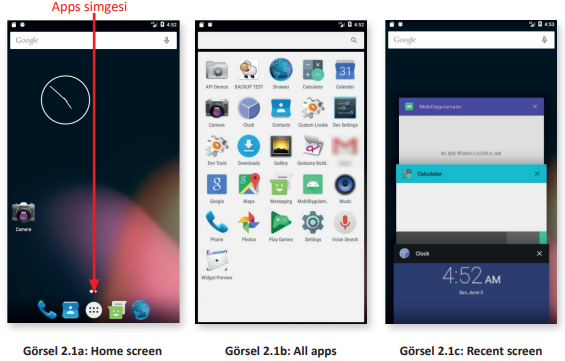

## 2.1. MOBİL UYGULAMA EKRAN TASARIMINA GİRİŞ

Android, taşınabilir cihazlarda yaygın olarak kullanılan bir işletim sistemidir. İngilizce Applications
(Uygulamalar) kelimesinin kısaltılmış hâli olan **Apps**, bu işletim sisteminde çalışan mobil uygulamaları ifade etmek için kullanılır. Kurulum ve çalıştırılabilir dosyalara **Android Package Kit (APK)**
adı verilir. Bu Android işletim sistemi dosyalarının uzantısı da **.apk** olarak belirlenir.
Bir mobil işletim sistemi arayüzünü temel olarak üçe ayırmak mümkündür.

- **Home screen (Ana Ekran)**: Taşınabilir cihaz açıldığında kullanıcıyı karşılayan ekrandır. Bu arayüz özelleştirilebilir veya arayüzün teması değiştirilebilir (Görsel 2.1a).

- **All apps (Tüm Uygulamalar)**: Taşınabilir cihaza kurulu tüm uygulamaların gösterildiği arayüz ekranıdır (Görsel 2.1b). Uygulamalar ekranına geçmek için ana ekranda bulunan Apps simgesine dokunulur veya tıklanır.

- **Recent screen (Son Kullanılan Uygulamalar Ekranı)**: Taşınabilir cihazda son kullanılan uygulamaların listesinin görüntülendiği arayüz ekranıdır (Görsel 2.1c).

**UYARI**: Bu üç temel mobil cihaz ekranının dışında saatin, bildirimlerin, mesajların gösterilebildiği **Lock screen (Kilit ekranı)** de vardır.

**SIRA SİZDE:**

>Mobil uygulama geliştirme ortamında emülatörü çalıştırdıktan sonra Home
screen, All apps ve Recent screen ekranlarına geçiş yapınız.

**DEĞERLENDİRME:**

>Çalışmanız aşağıda yer alan kontrol listesi kullanılarak değerlendirilecektir.
Çalışmanızı yaparken değerlendirme ölçütlerini dikkate alınız.

**KONTROL LİSTESİ**

|DEĞERLENDİRME ÖLÇÜLERİ|EVET|HAYIR|
|---|---|---|
|1. Mobil uygulama geliştirme ortamını çalıştırdı.|
|2. Ön izleme yapmak için klavyeden Shift+F10 kısayol tuşlarına bastı.|
|3. Açılan cihaza ait çerçeve işlev düğmelerinden Ev (Home) düğmesine tıkladı.|
|4. Açılan cihaza ait çerçeve işlev düğmelerinden Genel Bakış (Overview) düğmesine tıkladı.|
|5. Açılan cihazın işletim sisteminden Apps simgesine tıkladı.|