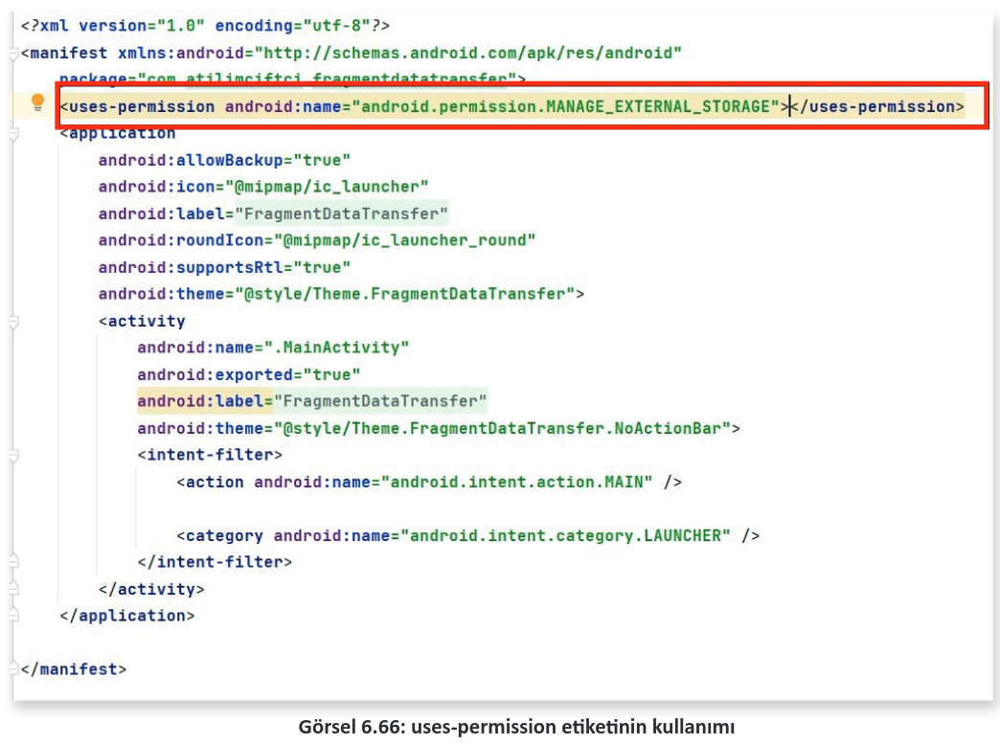
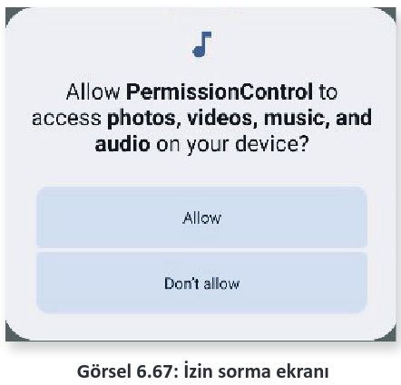
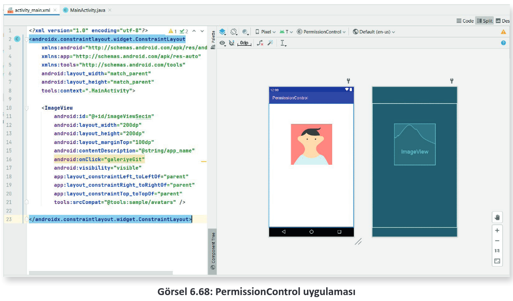
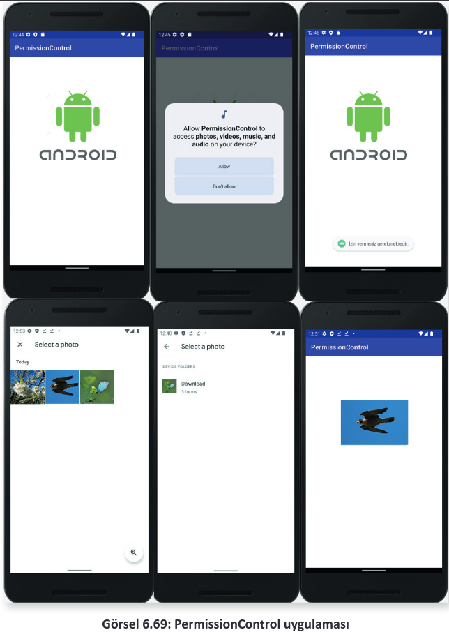
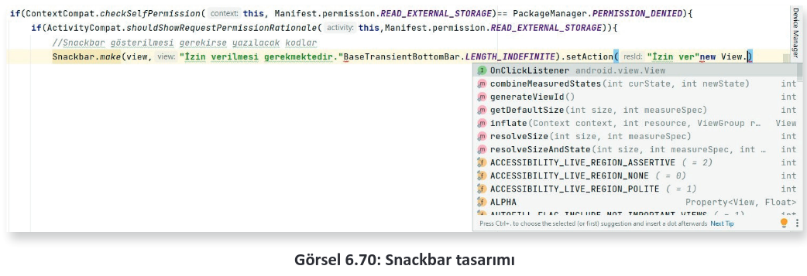
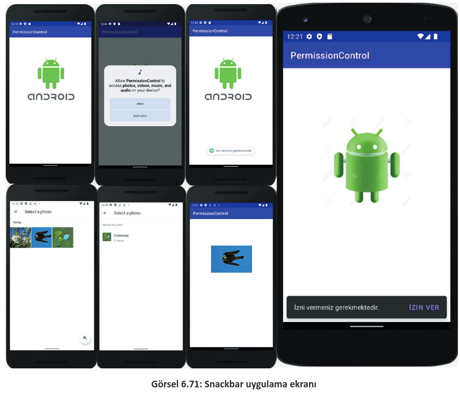

# 6.6. MOBİL UYGULAMADA İZİNLER VE İZİN YAPISI
- <a href="#6.6.1.">6.6.1. İzin Tanımlamaları Yapısı</a>
- <a href="#6.6.2.">6.6.2. İzin Onayları Almak</a>
  
Mobil uygulama platformunda "Android 6.0" (API level 23) sürümüne kadar sadece mobil uy-
gulama indirilirken kullanılacak durumlar için izinler sorulurdu. Onun dışında uygulama, kullanıcı tarafından kullanılırken izin sorulmaya gerek duyulmazdı. Bu durum, 6.0 ile birlikte değişiklik göstermiş ve tehlikeli izin olarak adlandırılan (dangerous permissions) izinlerin uygulama içinde de sorulması ve izin verilmedikçe kullanılmaması şartı getirilmiştir. Bu durum; rehbere erişim, kamera kullanımı, fotoğraf galerisine erişim, konum paylaşımı gibi olaylarda kullanıcının ekstra izin vermesi gerekliliğini ortaya çıkartmıştır. Kullanıcılar tarafından farkındalık düzeyi artırılarak sakıncalı olabilecek durumların önüne geçilmesi ve veri gizliliğinin sağlanması amaçlanmıştır.

İzinler için isimlendirilen dört seviye mevcuttur.

- **Normal**

Düşük seviyeli izinleri kapsar ve sistem tarafından otomatik olarak izin verilir. Genelde her uygulamada kullanılan ve kullanıcıya zararı olmayan izin çeşitleridir. Wi-Fi kullanımı, Bluetooth kullanımı bu seviyedeki izinlere örnektir. Bu seviyedeki izinlerin sadece uygulamayı marketten indirirken söylenmesi yeterlidir. Uygulama içinde tekrar sorulmasına gerek kalmadan kullanıma izin verilir.

- **Dangerous**

Kullanıcıya ait özel verilere erişim için gereken izin türüdür. Bu tür izin gerektiren durumlar, kullanıcı için uygulama içinde tehlikeli durum yaratabileceğinden dolayı uygulamada ayrıca sorulmadan içeriği görüntülemeye, verileri almaya veya dizine girmeye izin verilmez. Örneğin bir uygulama, tehlikeli olabilecek bir veriyi talep ettiyse bu veri etkileşimine izin verilmeden önce kullanıcıdan onay istenir. Rehbere erişim, galeriye erişim, konum kullanımı bu türdeki izinlere örnektir.

- **Signature**

Mobil uygulamada sistemin, yalnızca talep eden ve izin veren uygulamanın sertifikaları eşleşiyorsa vereceği izindir. Sertifikalar eşleşirse sistem, kullanıcı onayı olmadan otomatik şekilde izin verir.

- **SignatureOrSystem**

SignatureOrSystem izni, birden çok satıcının bir sistem görüntüsünde yerleşik uygulamalara sahip olduğu ve birlikte oluşturuldukları için belirli özellikleri açıkça paylaşmaları gerektiği özel durumlarda kullanılır. Bu izin türünün kullanılmasından mümkün mertebe kaçınmakta fayda vardır. İmza koruma düzeyine bakılmayacağı için kontrolü oldukça sorunlu olabilir.

**NOT:** 

>İzin seviyeleri hakkında detaylı bilgi için [https://developer.android.com/guide/topics/ permissions/overview#normal-dangerous doküman](https://developer.android.com/guide/topics/permissions/overview#normal-dangerous "Android Studio Resmi WEB sitesi") sayfasını inceleyiniz

Kullanılan mobil cihaz API level 23 ve daha üst bir sürüm ise marketten indirme aşamasında herhangi bir izin için onay kutucuğu göstermez fakat dangerious seviye olan izinler için uygulama içinde mecburi onay almak gerekir.

<h2 id="6.6.1.">6.6.1. İzin Tanımlamaları Yapısı</h2>

Mobil uygulamada kullanılan yapılara ait özelliklerin izninin hangi seviyede olursa olsun uygulama içinde belirtilmesi gerekir. Bunun için de "androidManifest.xml" dosyası kullanılır. Bu dosya içinde **\<manifest>** etiketi arasında **\<uses-permission>** etiketi kullanılarak izin tanımlaması yapılır (Görsel 6.66).

<div style='display:block;text-align:center'>


</div>

Kullanılan izin yapısı; doküman tarafından seviye olarak normal şeklinde tanımlanmışsa, ayrıca kullanıcı gizliliğini ihlal etmezse veya cihazın çalışmasına karşı risk oluşturmazsa sistem bu izinleri otomatik olarak verir. Kullanılmak istenen izin yapısı kullanıcı verilerine erişecek (SMS kullanımı, galeri erişimi, rehber erişimi vb. ) veya cihazın çalışması ile ilgili sorunlara neden olabilecek türde ise uygulama içinde kullanıcıdan ekstra izin alınması gerekir.

**NOT:**

>İzin çeşitleri hakkında daha detaylı bilgi için [https://developer.android.com/reference/android/Manifest.permission](https://developer.android.com/reference/android/Manifest.permission "Android Studio Resmi WEB sitesi") doküman sayfasını inceleyiniz. Doküman içinde tüm izinlerin nasıl kullanılacağı, ne amaçla kullanılacağı ve hangi düzeyde olduğu belirtilir.

<h2 id="6.6.2.">6.6.2. İzin Onayları Almak</h2>

Oluşturulan mobil uygulama içinde normal izin seviyesinde olan izinler için sadece androidManifest.xml dosyası içinde tanımlamak yeterliyken tehlikeli olarak nitelendirilen izinler için hem androidManifest.xml’de tanımlanması hem de kullanım içinde Görsel 6.67’de olduğu gibi **"İzin ver"**,**"Reddet"** buttonlarının olduğu bir diyalog ekranı ile izin alınması gerekir.

<div style='display:block;text-align:center'>


</div>

Kullanıcı, **"İzin ver" (Allow)** seçeneğini seçerse herhangi bir sıkıntı olmadan işlemlere devam edilir ve veri erişimine veya servis erişimlerine izin verilir. Kullanıcı, **"Reddet" (Don’t allow)** seçeneğini seçerse erişim sağlanmak istenen bölüm izin verilmeden iptal edilir. Aynı işlem tekrar edildiğinde aynı onay kutucuğu sorulur. **"Tekrar sorma" (Never ask again)** seçeneği seçilip **Reddet** tıklanırsa bu erişim istendiğinde işlem gerçekleşmez ve tekrar soru da sorulmaz. Bu tür durumlarda iki seçenek ele alınır. Tasarlayan kişi bunun önemini bildiren actionTab tarzı bir yapı oluşturabilir veya kullanıcı, mobil cihazının ayarlarından izinlere gidip, reddettiği izni bulup verebilir.

<span style="color:#f00;font-weight:bold;">UYARI:</span>

>Her kullanıcı aynı bilgi ve teknik donanım seviyesinde olmadığı için kullanıcının ayarlar üzerinden izinlere gitmesini ve izin ver seçeneğini oradan aktif etmesini beklemek doğru bir işlem değildir. Bu işlemi kullanıcıya bırakmaktansa tasarımcının uygulama içinde bu tür durumlara önlem alması ve izin vermeyen kullanıcılar için yeniden bağlantı oluşturması her zaman daha mantıklı bir seçenektir.

**20. UYGULAMA:** İşlem adımlarına göre mobil uygulama ekranındaki Activity içinde bir ImageViewe tıklanınca galeriye gitmek için izin isteyen ve izin verildiğinde galeriye ulaşarak seçilen fotoğrafı ImageViewe getiren uygulamayı tasarlayınız.

**1. Adım**: **New>Project>Empty** Activity ile yeni bir proje oluşturunuz. İsmini "Permission Control" olarak giriniz. activity_main.xml içine ConstraintLayout içine bir adet ImageView ögesi ekleyiniz. Görüntü olarak herhangi bir avatar seçerek Code ekranında tasarıma devam ediniz. id değerini "imageViewSecim" olarak giriniz. onClick özelliği için de "galeriyeGit" yazınız (Görsel 6.68).

<div style='display:block;text-align:center'>


</div>

**2. Adım:** AndroidManifest.xml dosyasını açınız. manifest etiketi arasına şu şekilde kodlamayı yazınız:

```xml
<uses-permission android:name="android.permission.READ_EXTERNAL_STORAGE"></uses-permission>
```

**NOT:**

>"READ_EXTERNAL_STORAGE" izni, mobil cihaz içinde yer alan depolama birimine erişim ve depolama biriminden veri okuma için gerekli olan izin isteğinde kullanılır. Detaylı bir liste için [https://developer.android.com/reference/android/Manifest.permission](https://developer.android.com/reference/android/Manifest.permission "Android Studio Resmi WEB sitesi") adresini inceleyiniz.

**3. Adım:** galeriyeGit isimli imageViewe tıklandığında çalışması gereken metodu MainActivity içinde tanımlayınız. Bu metot içinde öncelikle galeriye erişim için gerekli iznin verilip verilmediği kontrol edilir. Bu kontrol işlemi, **ContextCompat.checkSelfPermission()** metodu ile yapılır. Metoda parametre olarak da context ve izin arametreleri gönderilmelidir. Bu metot, dönüş tipi olarak izin verildi **(PackageManager.PERMISSION_GRANTED)** ya da izin verilmedi **(PackageManager.PERMISSION_DENIED)** şeklinde dönüş yapar.

```java
public void galeriyeGit(View view){
    if(ContextCompat.checkSelfPermission(this, Manifest.permission.READ_EXTERNAL_STORAGE) == PackageManager.PERMISSION_DENIED){
        //İzin yok, izin istenecektir.
    }else{
        //İzin var, galeriye gidilecektir.
        Intent galeri = new Intent(Intent.ACTION_PICK, MediaStore.Images.Media.EXTERNAL_CONTENT_URI);
    }
}
```

Galeriye gitme adımını yapınız. Galeriye de tıpkı farklı bir Activity’ye gitmek için kullanılan Intent ile gidilir. Buradaki fark, Activity açarken parametre olarak **context** ve **sınıf** gönderilir. Galeri gibi bir lokasyona giderken ise bir **action** bir de **URI** parametresi gönderilir. Galeriye gitmek için yazılması gereken şu kodu else bölümüne ekleyiniz:

```java
Intent galeri = new Intent(Intent.ACTION_PICK, MediaStore.Images.Media.EXTERNAL_CONTENT_URI);
```

"`Intent.ACTION_PICK`", intente git ve oradakini al anlamına gelen bir aksiyondur. "`MediaStore.Images.Media.EXTERNAL_CONTENT_URI`" ise resimlere ulaşmak için gerekli olan URI adresidir.

**NOT:**

>URI (Uniform Resource Identifier), URL’nin (Uniform Resource Locator ) detaylandırılmış hâlidir. URL, kaynağın yerine işaret eden standart bir formata uygun karakter dizisi iken URI, kaynağın tam yerine işaret eden (resim veya belge) standart formata uygun bir karakter dizisidir.

**4. Adım:** İzinleri istemek için gereken ve Android 11’den sonra izin konularında yapılan geliştirmelerle yeni kullanılmaya başlayan **ActivityResultLauncher** sınıfı kullanılır. Bu sınıftan üretilen nesne sayesinde hem izinlerin kontrolü yapılır hem de galeriye gidilip oradan veri döndürülebilir. Galeri için ayrı bir ActivityResultLauncher, izinler için ise ayrı bir ActivityResultLauncher tanımlanır. Bunları MainActivity blokları arasında, onCreate() metodunun dışında ve üst kısmında şu şekilde tanımlayınız:

```java
ActivityResultLauncher<Intent> galeryResultLauncher;
ActivityResultLauncher<String> izinlerResultLauncher;
```

Burada oluşturulan "galeryResultLauncher", izin alındığı takdirde galeriye gitmesi için yazılan nes-
nedir. Intent ile gönderim yapılacağı için de dönüş tipi Intent’tir. "izinlerResultLauncher" nesnesi
ise izin istemek için yazılır ve String tipte olmalıdır. Oluşturulan bu nesneler onCreate içinde tanımlanmalıdır fakat içerik biraz karışık olacağı için ayrı birer metotta bunları başlatıp sonrasında bu oluşturulan metotları onCreate() içinde çağırmak daha mantıklıdır. Galeriye gidebilmesi için gereken metodu ve bu metot kodlarını MainActivity içinde oluşturunuz. Nesne içeriği yazılırken öneri olarak seçenekler çıktığında Enter tuşuna basılırsa otomatik şekilde override edilir. **RESULT_OK**, galeride OK tuşuna basılarak dönüldüyse anlamını taşır ve gelen veri de boş değilse (null) veriyi URI sınıfından bir fotoVeri değişkenine kaydeder. Bu işlem için yazılması gereken kodlar şu şekildedir:

```java
public void metotGaleryResultLauncher(){
    galeryResultLauncher = registerForActivityResult(new ActivityResultContracts.StartActivityForResult(), new ActivityResultCallback<ActivityResult>() {
        @Override
        public void onActivityResult(ActivityResult result) {
            if(result.getResultCode()==RESULT_OK){
                Intent intentSonuc = result.getData();
                if(intentSonuc!=null){
                    Uri fotoVeri = intentSonuc.getData();
                }
            }
        }
    });
}
```

**5. Adım:** metotIzinlerResultLauncher isimli metodu oluşturunuz ve bu nesne ile izin işlemlerinin gerçekleşmesini sağlayınız. Kodlar dördüncü adımda olduğu gibi yazılırken önerilere Enter tuşu ile basıldığında çoğunluk otomatik şekilde oluşturulup override edilir. İzin verilmediğinde bir Toast mesajı ile hatırlatma yapılır.

```java
public void metotIzinlerResultLauncher(){
    izinlerResultLauncher = registerForActivityResult(new ActivityResultContracts.RequestPermission(), new ActivityResultCallback<Boolean>() {
        @Override
        public void onActivityResult(Boolean result) {
            if(result==true){
                //İzin var, galeriye gidilecektir.
                Intent galeri =new Intent(Intent.ACTION_PICK, MediaStore.Images.Media.EXTERNAL_CONTENT_URI);
            }else{
                //İzin istenmesi gerekecektir.
                Toast.makeText(MainActivity.this, "İzin vermeniz gerekir.", Toast.LENGTH_SHORT).show();
            }
        }
    });
}
```

**6. Adım:** MainActivity sınıfında onCreate() metodunun içinde, dördüncü ve beşinci adımda oluşturulan metotları çağırınız ve kayıt işlemini yapınız.

```java
@Override
protected void onCreate(Bundle savedInstanceState) {
    super.onCreate(savedInstanceState);
    setContentView(R.layout.activity_main);
    metotGaleryResultLauncher();
    metotIzinlerResultLauncher();
}
```

7. Adım: Intent ile galeriye erişim için "galeri" nesnesi oluşturulup henüz bu nesne kullanılmamıştır. Bu nedenle **metotIzinlerResultActivity** içinde, Intent ile nesnesi oluşturulan satırın bir alt satırında şu kodu kullanarak galeriye gidiniz:

```java
galeryResultLauncher.launch(galeri);
```

Aynı kodu galeriyeGit metodu içinde yazılan Intent’in bir alt satırına da ekleyiniz. Bu kod ile galeriye erişiniz.

**8. Adım:** Önceki adımlarda izin istenecek bölümlere yorum satırı eklenmiştir. Yorum satırı eklenen galeriyeGit metodunda izin istemek için şu kodu yazınız:

```java
izinlerResultLauncher.launch(Manifest.permission.READ_EXTERNAL_STORAGE);
```

**9. Adım:** ImageView ögesini ister binding yöntemi ister findViewById ile tanımlayınız. Burada öncelikle tek öge olduğu için findViewById ile tanımlanır. MainActivity sınıfının içine "`ImageView imageView;`" ekleyiniz. onCreate() metoduna da "`imageView=findViewById(R.id.imageViewSecim);`" şeklinde kodu ekleyerek imageView ögesini initialize ediniz.

**10. Adım:** Mobil uygulama geliştirme platformunun yeni güncellemesinde imageView nesnelerine öge atanmadığında ekranda göstermeme durumları oluşur. Ekranda imageView görünmediyse drawable klasörü içine uygun olan herhangi bir görsel ögesi koyarak onCreate içinde "`imageView.setImageResource(R.drawable.gorselsecim);`" görsel içeriğini atayınız.
    
**11. Adım:** Alınan verinin imageView içine gömülmesi gerekir. Bunun için **metotGaleryForResult()** metodu içinde fotoVeri değişkenini çektiğiniz satırın altına "`imageView.setImageURI(fotoVeri);`" kodunu ekleyerek seçilen görselin imageView içine yüklenmesini sağlayınız. Uygulamayı alıştırdığınızda Görsel 6.69’daki gibi bir görüntü ortaya çıkar.

<div style='display:block;text-align:center'>


</div>

Tüm MainActivity içeriği şu şekildedir:

```java
package com.atilimciftci.permissioncontrol;
public class MainActivity extends AppCompatActivity {
    ActivityResultLauncher<Intent> galeryResultLauncher;
    ActivityResultLauncher<String> izinlerResultLauncher;
    ImageView imageView;
    @Override
    protected void onCreate(Bundle savedInstanceState) {
        super.onCreate(savedInstanceState);
        setContentView(R.layout.activity_main);
        metotGaleryResultLauncher();
        metotIzinlerResultLauncher();
        imageView = findViewById(R.id.imageViewSecim);
        imageView.setImageResource(R.drawable.gorselsecim);
    }
    public void galeriyeGit(View view){
        if(ContextCompat.checkSelfPermission(this, Manifest.permission.READ_EXTERNAL_STORAGE) == PackageManager.PERMISSION_DENIED){
            //İzin yok, izin istenecektir.
            izinlerResultLauncher.launch(Manifest.permission.READ_EXTERNAL_STORAGE);
        }else{
            //İzin var, galeriye gidilecektir.
            Intent galeri = new Intent(Intent.ACTION_PICK, MediaStore.Images.Media.EXTERNAL_CONTENT_URI);
            galeryResultLauncher.launch(galeri);
        }
    }
    public void metotGaleryResultLauncher(){
        galeryResultLauncher = registerForActivityResult(new ActivityResultContracts.StartActivityForResult(), new ActivityResultCallback<ActivityResult>() {
            @Override
            public void onActivityResult(ActivityResult result) {
                if(result.getResultCode() == RESULT_OK){
                    Intent intentSonuc = result.getData();
                    if(intentSonuc != null){
                        Uri fotoVeri = intentSonuc.getData();
                        imageView.setImageURI(fotoVeri);
                    }
                }
            }
        });
    }
    public void metotIzinlerResultLauncher(){
        izinlerResultLauncher = registerForActivityResult(new ActivityResultContracts.RequestPermission(), new ActivityResultCallback<Boolean>() {
            @Override
            public void onActivityResult(Boolean result) {
                if(result == true){
                    //İzin var, galeriye gidilecektir.
                    Intent galeri =new Intent(Intent.ACTION_PICK, MediaStore.Images.Media.EXTERNAL_CONTENT_URI);
                    galeryResultLauncher.launch(galeri);
                }else{
                    //İzin istenmesi gerekecektir.
                    Toast.makeText(MainActivity.this, "İzin vermeniz gerekmektedir.", Toast.LENGTH_SHORT).show();
                }
            }
        });
    }
}
```

**NOT:**

>Uygulamada kullanılan emülatör içinde normal şartlarda görsel vb. bulunmaz. Emülatörün tarayıcısı ile internette görsel aratıp, üzerine basılı tutarak "Download" seçilirse seçilen görsel de galeriye iner. Bu sayede galeriye erişim sağlandığında görseller ortaya çıkar.

<span style = "color:#f00; font-weight:bold;">UYARI:</span>

>İzin uygulamalarında genel olarak karşılaşılan bir sorun vardır. Kullanıcı, bir daha gösterme seçeneği çıkarsa ve bunu işaretleyip izin vermezse veya Görsel 6.67’de olduğu gibi bir seçenekte iki defa izin vermezse kullanıcıya tekrar izin sorulmaz. Kullanıcı bu durumda Ayarlar üzerinden izinleri bulup,uygulamaya ait izne gelip bu izni kabul etmelidir. Her kullanıcının bunu yapabilmesi mümkün olmadığı için de bu durumu mobil uygulama geliştiricisi düşünmelidir. Bunun için gerekli mobil uygulama geliştirme platformunun yeni güncellemesiyle bir metot geliştirilmiştir. Bu, "shouldShowRequestPermissionRationale" metodudur. İzin isteme ekranı için Snackbar yazıldığında bu Snackbarın gösterilmesinin gerekli olup olmadığını sorgular. İlgili metodun içine yazılacak bir Snackbar ile de sadece gerekli olduğu durumlarda bir menü ile aynı izin çağrılabilir. Hâlihazırda var olan bir Snackbarı ilk izin istemede göstermez. "Yeniden gösterme" seçeneği tıklandığında veya iki defa normal izin verilmeyerek kapatıldığında sonrasında izin istemek için tıklandığı zaman bu Snackbar ile izin işlemlerine tekrardönülebilir. Bunun için onuncu uygulamaya şu eklemeler yapılmalıdır:

**1. Adım:** galeriyeGit() metodu içinde yer alan karar yapısında izin verilip verilmediği sorgulanır. İzin verilmediği durumda Snackbar göstergesinin gösterilmesi gerekip gerekmediğini belirten "shouldShowRequestPermissionRationale" ile karar yapısı yazınız.

```java
if(ContextCompat.checkSelfPermission(this, Manifest.permission.READ_EXTERNAL_STORAGE)== PackageManager.PERMISSION_DENIED){
    //Snackbar gösterilmesi gerekirse yazılacak kodlar
}else{
    //Snackbar gösterilmeden izin istenecek kodlar
}
```

<div style='display:block;text-align:center'>


</div>

**2. Adım:** Karar yapısının sonucu true olursa yapılacak işlemlerin olduğu blokun içine, Snackbar gösterilmesi gereken bölüme, Snackbar ögesini oluşturunuz. Oluşturma aşamasında parametre olarak Görsel 6.62’de yer alan parametreleri gönderiniz. Son bölümde yer alan "**.setAction**" metoduna gönderilen parametreler için de Görsel 6.70’te olduğu gibi "**View.**" yazıldığında öneri olarak gelen "**onClickListener**" üzerindeyken Enter tuşuna basıldığında yapı override edilir. Override işlemi sonrası .show() metodunu ekleyiniz. Eklenen karar yapısının else kısmını yazarak, Snackbar gerekmeden istenen iznin yazılacağı bölümü de oluşturunuz.

```java
if(ActivityCompat.shouldShowRequestPermissionRationale(this,Manifest.permission.READ_EXTERNAL_STORAGE)){
    //Snackbar gösterilmesi gerekirse yazılacak kodlar
    Snackbar.make(view,"İzni vermeniz gerekmektedir.",Snackbar.LENGTH_INDEFINITE).setAction("İzin ver", new View.OnClickListener() {
        @Override
        public void onClick(View view) {
            //Snackbar gösterilerek izin istenecektir.
        }
    }).show();
}else{
    //Snackbar gösterilmeden izin istenecek kodlar
}
```

**3. Adım:** onClick içinde de else içinde de aynı şekilde izin isteyiniz. "`izinlerResultLauncher.launch(Manifest.permission.READ_EXTERNAL_STORAGE);`" iznini bu bölümlere ekleyiniz. İzin verilmeyip tekrar tıklandığında Görsel 6.71’de olduğu gibi bir Snackbar ile tıklanıncaya kadar gösterir. İzin ver buttonuna tıklanırsa yeniden izin sorulur.

```java
public void galeriyeGit(View view){
    if(ContextCompat.checkSelfPermission(this, Manifest.permission.READ_EXTERNAL_STORAGE)== PackageManager.PERMISSION_DENIED){
        if(ActivityCompat.shouldShowRequestPermissionRationale(this,Manifest.permission.READ_EXTERNAL_STORAGE)){
            //Snackbar gösterilmesi gerekirse yazılacak kodlar
            Snackbar.make(view,"İzni vermeniz gerekmektedir.",Snackbar.LENGTH_INDEFINITE).setAction("İzin ver", new View.OnClickListener() {
            @Override
            public void onClick(View view) {
                //İzin istenecektir.
                izinlerResultLauncher.launch(Manifest.permission.READ_EXTERNAL_STORAGE);
            }
        }).show();
        }else{
            //Snackbar gösterilmeden izin istenecek kodlar
            izinlerResultLauncher.launch(Manifest.permission.READ_EXTERNAL_STORAGE);
        }
    }else{
        //İzin var, galeriye gidilecektir.
        Intent galeri = new Intent(Intent.ACTION_PICK, MediaStore.Images.Media.EXTERNAL_CONTENT_URI);
        galeryResultLauncher.launch(galeri);
    }
}
```

<div style='display:block;text-align:center'>


</div>