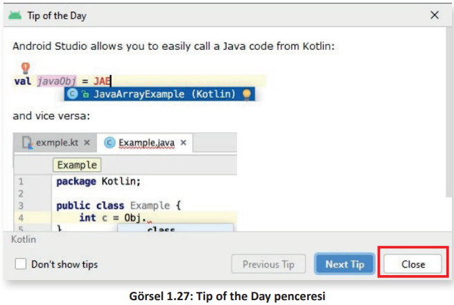
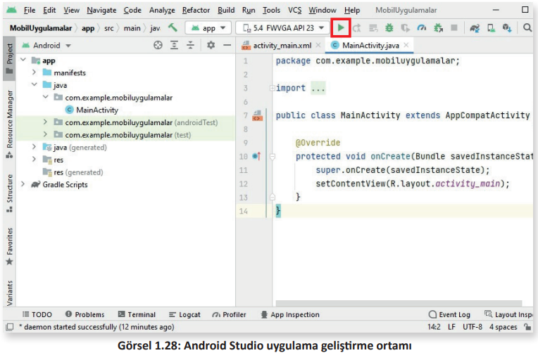
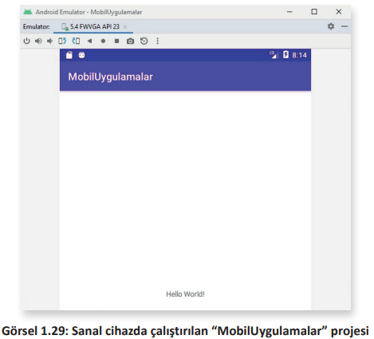

# 1.4. PROJE OLUŞTURMA

- <a href="#1.4.1.">1.4.1. Projenin Emülatörde Çalıştırılması</a> 
- <a href="#1.4.2.">1.4.2. Android Studio Tasarım Ekranı</a> 
- <a href="#1.4.3.">1.4.3. Ön İzleme Görünümünü Değiştirmek</a> 

Empty Activity seçildikten sonra Next düğmesine basılınca proje ayarlarının yapılabileceği bir pencere belirir (Görsel 1.26).

- **Name (İsim)**: Projenin ismi bu kutuda belirlenir. Uygulamanın ismi de projeye verilen bu isim olur.
- **Package name (Paket İsmi)**: Paket ismi otomatik olarak verilir. İstenirse sonradan değiştirilebilir.
- **Save location (Kaydetme Dizini)**: Projenin yerel kaydetme dizini bu kutuda belirlenir.
- **Language (Dil)**: Projenin hangi programlama dilinde kodlanacağı belirlenir. Java programlama dili seçilir.
- **Minimum SDK (En Alt Yazılım Geliştirme Kiti)**: Bu kutuda seçilecek API düzeyiyle uygulamanın hangi cihazlarda çalışacağı, hangi cihazlarda destekleneceği belirlenir. API düzeyi düşük olursa piyasadaki çoğu cihazda uygulama çalışır. Örneğin API 21 düzeyi seçilirse piyasadaki cihazların %98'inde uygulama çalışır. "Help me choosed" (Seçim için yardım et) düğmesine tıklanarak, hangi API düzeyinin hangi yüzde ile kullanıldığı güncel olarak listelenebilir.
- **Use legacy android.support.libraries (Eski Android Kütüphaneleri)** onay kutusu seçilirse son güncel servisler ve kütüphanelerin kullanılması engellenir.

Finish düğmesine tıklanır. Açılan Tip of the Day (Günün ipucu) penceresi, Close (Kapat) düğmesi ile kapatılır (Görsel 1.27).

**2. UYGULAMA**: İşlem adımlarına göre mobil uygulama geliştirme ortamında tasarım yapılarından Empty Activity seçerek MobilUygulamam isimli uygulamayı geliştiriniz.

**1. Adım**: Mobil uygulama geliştirme programını çalıştırınız.\
**2. Adım**: Karşılama ekranında New Project seçeneğine tıklayınız.\
**3. Adım**: Templates bölümünden Phone and Tablet seçiniz.\
**4. Adım**: Sağ taraftaki pencereden Empty Activity tasarım yapısını seçiniz.\
**5. Adım**: Yeni gelen pencerede Name kutusuna MobilUygulamam yazınız.\
**6. Adım**: Pencerenin sağ alt köşesindeki Finish düğmesine tıklayınız.\

>**SIRA SİZDE**: 
>
>Mobil uygulama geliştirme ortamında Fullscreen Activity seçerek TamEkranUygulamam isimli uygulamayı geliştiriniz.
>
>**DEĞERLENDİRME**: 
>
>Çalışmanız aşağıda yer alan kontrol listesi kullanılarak değerlendirilecektir. Çalışmanızı yaparken değerlendirme ölçütlerini dikkate alınız.
>
>**KONTROL LİSTESİ**
>
>|DEĞERLENDİRME ÖLÇÜLERİ|EVET|HAYIR|
>|---|---|---|
>|1. Mobil uygulama geliştirme ortamını çalıştırdı.|
>|2. Karşılama ekranında New Project seçeneğine tıkladı.|
>|3. Templates bölümünden Phone and Tablet seçti.|
>|4. Sağ taraftaki pencereden Fullscreen Activity tasarım yapısını seçti.|
>|5. Yeni gelen pencerede Name kutusuna TamEkranUygulamam yazdı.|
>|6. Pencerenin sağ alt köşesindeki Finish düğmesine tıkladı.|

<h2 id="1.4.1.">1.4.1. Projenin Emülatörde Çalıştırılması</h2>

"MobilUygulamalard" projesi oluşturulduktan sonra uygulama geliştirme ortamında Run 'app' simgesine veya Shift+F10 kısayol tuşlarına basılır (Görsel 1.28).

Daha önce oluşturulan sanal cihazda **Hello World!** yazısı görüntülenir ve oluşturulan projenin ilk denemesi yapılır (Görsel 1.29).

<h2 id="1.4.2.">1.4.2. Android Studio Tasarım Ekranı</h2>

Yeni bir mobil uygulama geliştirme ortam projesi açıldığında "MainActivity.javad" dosyası varsayılan olarak seçili gelir. Bu dosyada tasarlanan mobil uygulamanın işlevleri kodlanır. Mobil uygulamanın ekran tasarımı, bir başka deyişle kullanıcı arayüzü tasarlanacaksa sol tarafındaki "activity_main.xmld" dosyası seçilir (Görsel 1.30).

**Palette (1)**: Çeşitli View ve ViewGroup bileşenlerini içeren paneldir. Sürükle bırak yöntemiyle bu bileşenler tasarım ekranına yerleştirilir.\

**Component Tree (2)**: Tasarım ekranındaki bileşenin hiyerarşisini gösterir.\

**Toolbar (3)**: Buradaki düğmeler kullanılarak tasarım ekranının görünümü ve özellikleri değiştirilebilir.\

**Design Editor (4)**: Tasarım ekranının görünümünü sadece Tasarım (Design), sadece Taslak (Blueprint) veya her ikisi aynı anda şeklinde ayarlanabilir.\

**Attributes (5)**: Seçili view nesnesinin niteliklerinin düzenlendiği paneldir.\

**View mode (6)**: Tasarım ekranının Code (Kod), Design (Tasarım) ve Split (Böl) modunda gösterilmesini sağlar. Split modu hem Code hem de Design görünümünü aynı anda tek pencerede gösterir.\

**Zoom and pan controls (7)**: Buradaki düğmeler yardımıyla ön izlemenin boyutu ve konumu editör içinde ayarlanabilir.

**UYARI**: Code, Split ve Design görünümleri arasında geçiş yapmak için klavyeden Alt+Shift+Sağ/Sol Ok
tuşları kullanılır.

<h2 id="1.4.3.">1.4.3. Ön İzleme Görünümünü Değiştirmek</h2>

Tasarım ekranının en üstündeki düğmeler editör içindeki ön izleme görünümlerini değiştirmek için kullanılır (Görsel 1.31).

Bu simgelerle yapılan değişiklikler şunlardır:

**1: Select Design Surface (Tasarım Yüzeyini Seçin)** simgesi kullanılarak yerleşimin editörde nasıl
olacağı seçilir. Design modu seçilirse yerleşimin ön izlemesi görülür. Blueprint seçilirse birleşenlerin sadece dış çizgilerinin görüntülendiği bir yerleşim görülür. Design + Blueprint birlikte olduğu seçenek seçilirse hem tasarım hem de taslak yan yana görülür. Klavyeden **B** tuşuna basılarak bu görünümler arasında geçiş sağlanır.

**2: Orientation for Preview (Ön İzleme İçin Oryantasyon)** simgesi kullanılarak ekran yerleşimi Landscape (yatay) veya Portrait (dikey) olarak ayarlanır. Klavyeden **O** tuşuna basılarak bu görünümler arasında geçiş sağlanır.

**3: Changes the current Night Mode value (Geçerli Gece Modu Değerini Değiştir)** simgesiyle ön izlemenin gece veya gündüz modu arasında geçiş yapması sağlanır. Klavyeden **N** tuşuna basılarak bu görünümler arasında geçiş sağlanır.

**4: Device for Preview (Ön İzleme İçin Cihaz)** simgesi ile hem cihaz tipi (cep telefonu, tablet, akıllı TV veya akıllı saat) hem de ekran büyüklüğü (boyut ve yoğunluk) değiştirilebilir. Daha önceden kullanıcı tarafından tanımlanmış bazı cihazlar da buradan seçilebilir. Klavyeden **D** tuşuna basılarak cihazlar arasında geçiş sağlanır.

**5: API Version for Preview (Ön İzleme İçin API Sürümü)** simgesi ile yerleşimin ön izlemesinin yapılacağı Android sürümünün seçilmesi sağlanır.

**6: Theme for Preview (Ön İzleme Teması)** simgesi ile ön izlemede gösterilecek kullanıcı arayüzünün seçilmesi sağlanır.

**7: Locale for Preview (Ön İzleme İçin Yerel Dil)** simgesi ile yerel dil seçimi ve seçilen dile uygun çeviri yapılabilir.

**8: View Options (Görünüm Seçenekleri)** simgesi ile ön izlemede **Show All Constraints (Tüm Kısıtlamaları Göster), Show Margins (Kenar Boşluklarını Göster), Fade Unselected Views (Seçilmemiş Viewleri Soldur), Live Rendering (Canlı Görüntü), Show System UI (Sistem Arayüzünü Göster), Show Tooltips (Araç İpuçlarını Göster)** vb. seçeneklerin açılıp kapatılması sağlanır.

**9: Disable Autoconnection To Parent (Otomatik Bağlanmayı Kaldır/Etkinleştir)** simgesi ile otomatik bağlantı modu etkinleştirildiğinde, viewler ön izleme alanına sürüklendiğinde kısıtlamalar otomatik olarak yapılandırılır. Bileşenin hangi sınırlamalara sahip olması gerektiği tahmin edilir ve bunlar gerektiği gibi oluşturulmaya çalışılır.

**10: Default Margins (Varsayılan Kenar Boşlukları)** simgesi ile her bileşen için ayrı ayrı kenar boşlukları ayarlanabilir.

**11: Clear All Constraints (Tüm Kısıtlamaları Temizle)** simgesi ile yerleşimdeki tüm constraint ayarları kaldırılır.

**12: Infer Constraint (Kısıtlamaları Otomatik Ayarla)** simgesi ile otomatik olarak constraintler ayarlanır. Sadece bir düğmeye basılarak bu constraint ayarları yapılır.

**13: Guidelines (Kılavuz Çizgileri)** simgesi kullanılarak yatay ve dikey kılavuz çizgileri tasarım ekranına yerleştirilir.
