# 6.1. PROJE YAPILANDIRMA AYARLARI

- <a href="#6.1.1." >6.1.1. AndroidManifest.xml Dosya Yapısı</a>
- <a href="#6.1.2." >6.1.2. MainActivity </a>
- <a href="#6.1.3." >6.1.3. res</a>
- <a href="#6.1.4." >6.1.4. Gradle Scripts </a>

Proje olarak yeni bir mobil uygulama tasarımı oluşturulduğunda Project alanında karşılaşılan dosya ve klasör yapısını tanımak, buradaki dosyaların her birinin farklı bir işlevinin olduğunu bilmek, projeye hâkimiyet sağlar (Görsel 6.1).

<div style='display:block;text-align:center'>

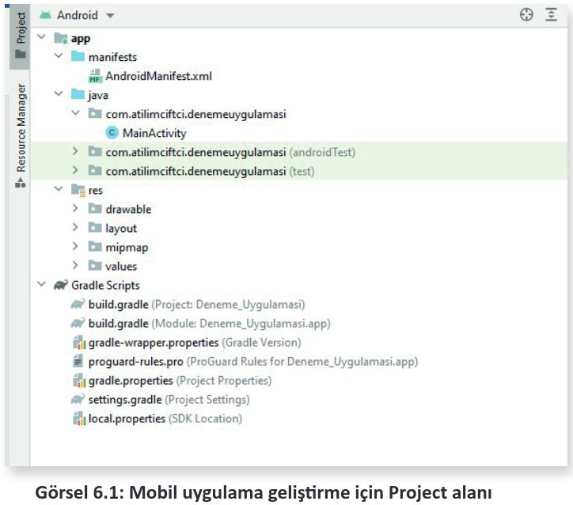
</div>

<h2 id="6.1.1.">6.1.1. AndroidManifest.xml Dosya Yapısı</h2>

AndroidManifest, **manifest** klasörünün içinde yer alan ve mobil uygulama geliştirme ortamında tasarlanan uygulamalar için vazgeçilmez dosya yapısıdır. Bu dosya içinde Activity, Service, eceiver vb. sınıfları ve projeye ait temel bilgiler bulunur. Dosya uzantısı, xml formatında uzantı olduğu için okunması ve değiştirilmesi oldukça kolaydır. Görsel 6.2’de yeni oluşturulmuş bir mobil uygulama geliştirme projesinin AndroidManifest.xml dosya içeriği verilmiştir. Burada kodlar "Tag" (etiket) denilen < > işaretleri arasında yazılır. Bu etiketler < > şeklinde başlayıp </> şeklinde kapatılır. Görsel 6.2’de kodlar içinde etiketler verilmiştir.

<div style='display:block;text-align:center'>

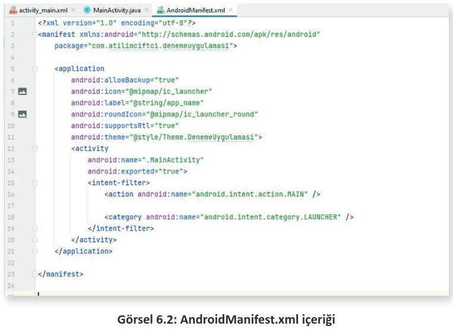
</div>


- **manifest**

Bu etiket ile uygulamaların versiyon numaraları, paket isimleri, uygulama izinleri gibi mobil uygulamanın en temel özellikleri girilir. Projenin içinde yer alan kütüphanelerden minimum ve maksimum sdk sürümlerine kadar bu bölümde ayarlanır.

- **package**

Uygulamanın paket adının bulunduğu yapı türüdür. Genellikle mobil uygulamalar Görsel 6.2’de görüldüğü gibi "com.atilimciftci.denemeuygulamasi" şeklinde bir domain olarak verilir. Bunun amacı, paket isminin **unique** (benzersiz) olarak tanımlanmasıdır.

**NOT:**

> AndroidManifest.xml içinde, manifest etiketi arasında yer alan package ile oluşturulmuş paket adının tamamen uygulama geliştiriciye ait olduğu unutulmamalıdır. Geliştirilen uygulama daha sonra markette yayımlanmak istediğinde de bu paket adı kullanılır. Bu nedenle geliştirilen her uygulamanın paket adının unique bir yapıda olmasına dikkat edilmelidir.

- **application**

Bu etiket ile geliştirilen mobil uygulamanın logosu (android:icon), adı (android:label), teması (android:theme) vb. temel özellikleri ayarlanır. Application etiketleri arasına donanım hızlandırma veya yedekleme gibi temel özellikler de eklenebilir. Görsel 6.2’de "application" etiketi arasına bakıldığında "android:" koduyla birlikte verilen özelliklerin girildiği görülür.

- **activity**

Geliştirilen mobil uygulamaya ait activitylerin ve bu activitylere ait özelliklerin yer aldığı etikettir.

- **intent-filter**

Activity, Service ve Broadcast Receiver bileşenlerine intent tipini belirtmek için kullanılan etikettir. intent-filter içinde \<action>, \<category>, \<data> etiketleri bulunur. intent-filter içine \<action> etiketinin mutlaka eklenmesi gerekir.

- **action**

Uygulama çalıştırıldığında ilk olarak çalışacak sınıfı belirtir. Bu etiket, Görsel 6.2’de görüldüğü gibi <pre><code class="language-xml">\<action android:name="android.intent.action.MAIN"/></code></pre>şeklinde tanımlanır. Bu kodun açılan etiketinin tekrar \<action> \</action> şeklinde kapatılmasına gerek yoktur. İlk açılan action etiketi içinde action etiketi kapatılmadan önce **/** tagının kullanılması, etiketlemenin kapatıldığını gösterir.

**NOT:**

>AndroidManifest.xml içinde verilen özellikler; manifest, package, application, activity, intent-filter, action ile sınırlı değildir. İzinler, Servisler, Broadcast Receiver vb. kullanılmak istenen yapıya göre o yapının etiketleri de AndroidManifest.xml içine eklenmelidir.

<h2 id="6.1.2.">6.1.2. MainActivity</h2>

Mobil uygulama geliştirme ortamında oluşturulan projenin ana activitysinin java uzantılı kodlama dosyasıdır. MainActivity, **java** klasörünün içindeki **paket adı** ile gösterilen klasörde yer alır. Geliştirilen  uygulamanın bu activity için gerekli olan java kodları bu dosya içine yazılır. Activityler aynı zamanda birer **xml** uzantıya sahip, dizayn (tasarım) dosyaları ile ilişkilidir. Açılan her activity için java uzantılı kod dosyası ve xml uzantılı tasarım dosyası bulunur. MainActivity için olan tasarım dosyası da **res** klasörü içinde bulunan **layout** klasöründeki **activity_main.xml** dosyasıdır.

MainActivity.java için yazılan her kod, activity_main.xml’i ve activity_main.xml içinde yazılan her kod veya oluşturulan her tasarım da MainActivity.java’yı ilgilendirir. Geliştirilen mobil uygulamaya yeni bir Activity eklenmesi için Görsel 6.3’te görüldüğü gibi java klasörü altında yer alan paket ismine farenin sağ tuşu ile tıklanıp, **New>Activity** üzerine gelinerek bir Activity seçilir veya **Gallery** seçeneğine tıklanarak açılan pencerede istenen bir Activity seçilir (Görsel 6.4).

<div style='display:block;text-align:center'>

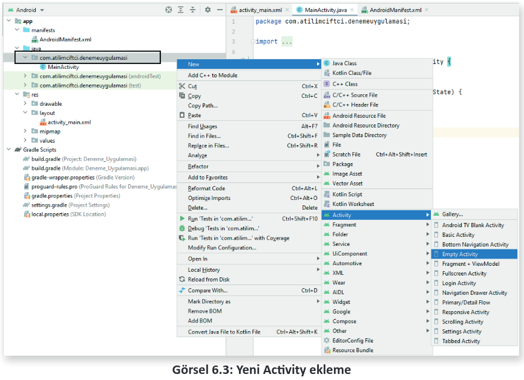
</div>

<div style='display:block;text-align:center'>

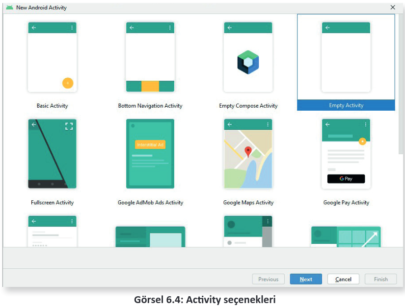
</div>

Activity seçimi yapıldıktan sonra Next tuşuna basılır veya seçilen Activity üzerine farenin sol tuşu ile çift tıklanır. Görsel 6.5’te olduğu gibi bir görüntü ile karşılaşılır.

<div style='display:block;text-align:center'>

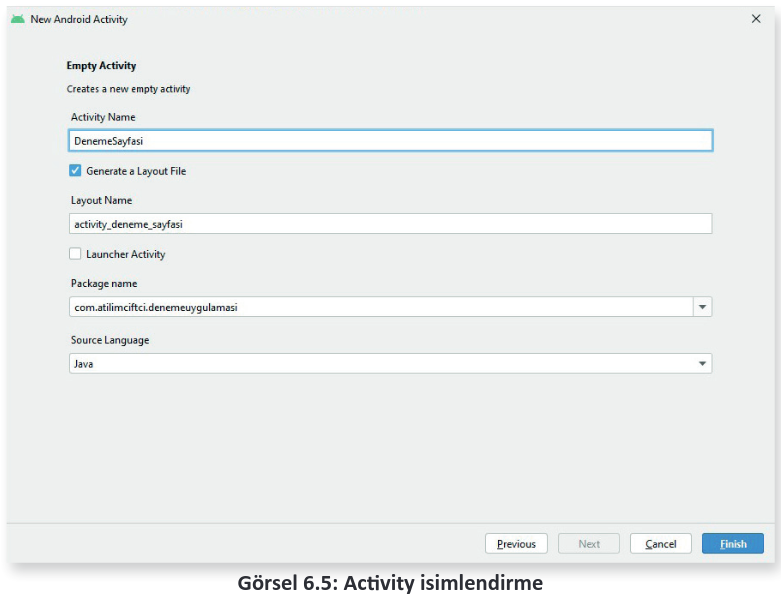
</div>

Activity Name alanına paket isminin altında yer alacak java uzantılı Activity’nin adı yazılır. **Generate a Layout File** seçeneği seçili olursa layout klasörü altında, oluşturulan Activity’ye ait bir tasarım dosyası (layout) oluşturulur ve tasarım dosyasının ismi de otomatik olarak Activity Name ile ilişkilendirilir. Package name seçeneğinde ise hangi pakete ait olduğu sorulur. **Source Language** seçeneğinde ise oluşturulacak Activity’nin hangi dili desteklediği seçilir. Java dilinde kodlama ile uygulama tasarlamak için Java seçeneği seçilir ve sonra **Finish** seçeneğine tıklanır. **DenemeSayfasi** isminde java uzantılı yeni bir Activity, paket adı altında oluşturulur. Bu Activitye ait bir tasarım dosyası da layout altında **activity_deneme_sayfasi** ismi ile oluşturulur (Görsel 6.6).

<div style='display:block;text-align:center'>

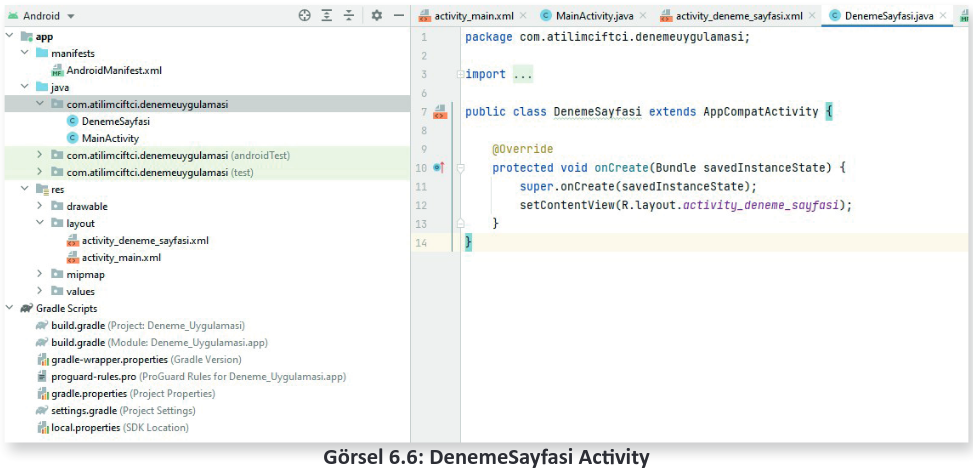
</div>

<h2 id="6.1.3.">6.1.3. res</h2>

res klasörü, **resources (kaynak)** kelimesinin kısaltılmış biçimi olarak adlandırılır. İçeriğinde yer alan dosya ve klasörler, mobil uygulamanın içerdiği ana dosyaları oluşturur (Görsel 6.7).

<div style='display:block;text-align:center'>

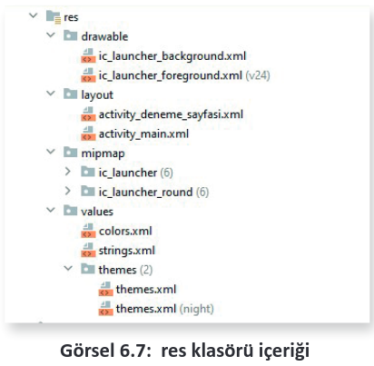
</div>

Resources klasörünün altında yer alan klasörlerin her biri farklı bir amaca hizmet eder. Buraya dışarıdan da ekleme yapılabilir.

### 6.1.3.1. drawable

Geliştirilen mobil uygulamaya ait bitmap (.png, .jpg, .gif) ve xml dosyaları drawable klasörü içine konumlandırılır. Yüklenen resimler, farklı ekran boyutlarında kullanılmak üzere şu şekilde klasörlenir:
- /drawable-ldpi: Düşük yoğunluklu ekranlar için
- /drawable-mdpi: Orta yoğunluklu ekranlar için
- /drawable-hdpi: Yüksek yoğunluklu ekranlar için
- /drawable-xhdpi: Ekstra yüksek yoğunluklu ekranlar için
- /drawable-xxhdpi: Ekstra-ekstra yüksek yoğunluklu ekranlar için
- /drawable-xxxhdpi: Ekstra-ekstra-ekstra yüksek yoğunluklu ekranlar için

### 6.1.3.2. layout
layout, mobil geliştirme platformunda geliştirilen uygulamanın görsel arayüzlerinin bulunduğu bölümdür. Oluşturulan bu arayüzler xml formattadır. Bu xml dosyaları Görsel 6.8’de görüldüğü gibi Code, Split veya Desing şekilde düzenlenebilir.

<div style='display:block;text-align:center'>

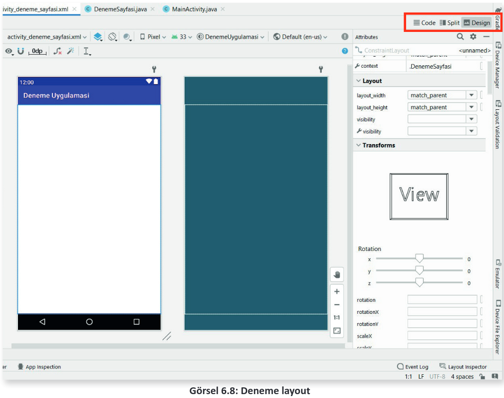
</div>

Code ekranında düzenleme istenirse Görsel 6.9’da olduğu gibi sadece xml kodları ile tasarım yapılan ekranla karşılaşılır. Bu ekrandan yeni ögeler oluşturabilir, bulunan ögelerin özellikleri de değiştirilebilir.

<div style='display:block;text-align:center'>

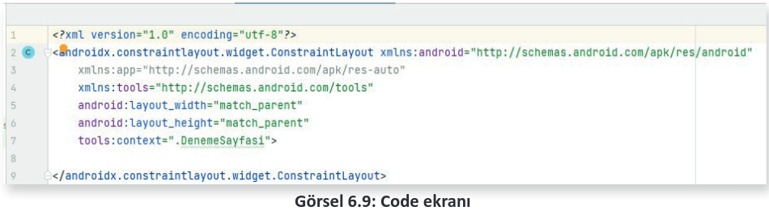
</div>

Split seçeneği ile düzenleme istenirse Görsel 6.10’da olduğu gibi hem xml kodlarının hem de tasarım ekranının göründüğü bir yapı ortaya çıkar. Kod ekranında yazılan xml kodları ile eş zamanlı olarak tasarım ekranına eklenen veya düzenlenen öge değişiklik gösterir. Tasarım ekranına eklenen veya değiştirilen öge de kod ekranında eş zamanlı olarak eklenir veya silinir.

<div style='display:block;text-align:center'>

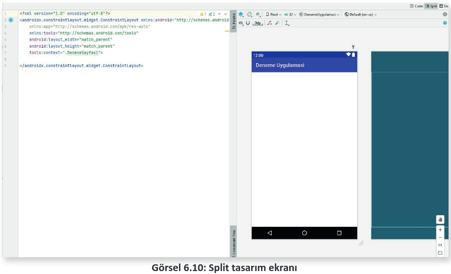
</div>

Desing ekranında düzenleme istenirse Palette bölümünden ögeler seçilerek tasarım ekranına eklenir ve **Component Tree** bölümünden de ögelerin yerleşimleri ayarlanır. Bu ekranda herhangi bir kodlama bölümü görülmez.

Üç tasarım ekranı da zaman zaman farklı şekillerde kullanılması uygun olan yapıdadır. Farklı işlemler, farklı şekillerde daha portatif çalışabilir.

### 6.1.3.3. mipmap

mipmap, mobil geliştirme ortamında geliştirilen uygulamanın başlatma simgelerinin yerleştirildiği bölümdür. Görsel 6.11’de görüldüğü gibi **ic_launcher** isimli default iconu farklı şekillerde kaydedilmiştir. Bu kayıtlar, drawable klasörleme biçimine benzer şekilde ve farklı yoğunluktaki (dp) ekran modlarına göre ayrı ayrı çalışır.

<div style='display:block;text-align:center'>

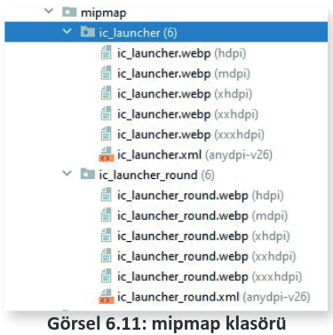
</div>

Burada eklenen iconlar, AndroidManifest içinde şu şekilde çağrılır:

### 6.1.3.4. values

```xml
android:icon="@mipmap/ic_launcher"
android:label="@string/app_name"
android:roundIcon="@mipmap/ic_launcher_round"
```

values klasörü içinde, mobil uygulama geliştirme ortamında geliştirilen projede kullanılan sabit değerler tutulur. Bir mobil uygulama geliştirildiğinde themes.xml, colors.xml, strings.xml şeklinde default olarak üç dosya oluşur. Tutulan değerler, klasik olarak "Anahtar ↔ Değer" mantığı ile tutulur. Tutulan bu değerlere daha sonra uygulama tasarım ekranlarından (layout) veya Activity-
lerden metotlar aracılığı ile ulaşılabilir.

- **themes.xml**

themes.xml, mobil geliştirme platformunda geliştirilen uygulamalarda kullanılan stiller ve temaların tutulduğu bölümdür.

```xml
<resources xmlns:tools="http://schemas.android.com/tools">
    <!-- Base application theme. -->
    <style name="Theme.DenemeUygulamasi" parent="Theme.MaterialComponents.Day-Night DarkActionBar">
        <!-- Primary brand color. -->
        <item name="colorPrimary">@color/purple_500</item>
        <item name="colorPrimaryVariant">@color/purple_700</item>
        <item name="colorOnPrimary">@color/white</item>
        <!-- Secondary brand color. -->
        <item name="colorSecondary">@color/teal_200</item>
        <item name="colorSecondaryVariant">@color/teal_700</item>
        <item name="colorOnSecondary">@color/black</item>
        <!-- Status bar color. -->
        <item name="android:statusBarColor" tools:targetApi="l">?attr/colorPri-maryVariant</item>
        <!-- Customize your theme here. -->
    </style>
</resources>
```

- **colors.xml**

colors.xml, geliştirilen mobil uygulamanın içinde kullanılmak üzere renklerin hexadecimal (16’lık sayı tipinde) değerlerini tutar.

```xml
<?xml version="1.0" encoding="utf-8"?>
<resources>
    <color name="purple_200">#FFBB86FC</color>
    <color name="purple_500">#FF6200EE</color>
    <color name="purple_700">#FF3700B3</color>
    <color name="teal_200">#FF03DAC5</color>
    <color name="teal_700">#FF018786</color>
    <color name="black">#FF000000</color>
    <color name="white">#FFFFFFFF</color>
</resources>
```

- **strings.xml**

strings.xml, mobil uygulama geliştirme platformunda geliştirilen mobil uygulama içinde kullanılacak stringlerin saklanıldığı dosyadır. Uygulamalarda birden fazla dil desteği sunulacaksa her dil için farklı bir string.xml dosyası oluşturmak gereklidir.

```xml
<resources>
    <string name="app_name">Deneme Uygulamasi</string>
</resources>
```

**NOT:**

>themes, colors, strings ismindeki xml uzantılı dosyalarda tanımlanan ögeler, layout içinden ulaşılarak kullanılabilir. Bunun için "@dosya_adı/name" ifadesi şeklinde çağrılması mümkündür.
>```XML
>android:textColor="@color/purple_500"
>android:text="@string/mesaj_bildirimi"
>```

**NOT:**

>values klasörü içine default değerler dışında dimension.xml (boyut değerleri için), bool. xml (bool tipi değerler için), integer.xml (int veri tipinde değerler tutmak için), integer_array.xml (birden fazla integer tipte sabit değerler için), typed_array.xml (birden fazla farklı tipte sabit değerler için) dosyaları da kullanılabilir ve layout içinden aynı şekilde ulaşılabilir.

<h2 id="6.1.4.">6.1.4. Gradle Scripts</h2>

Mobil yazılım geliştirme ortamında Gradle Scripts; geliştirilen uygulamalar için test, inşa, dağıtım gibi yapı sistemini oluşturur. Oluşturulan Gradle dosyaları, proje geliştirme aşamasında yazılım geliştiriciye büyük kolaylıklar sağlar. Gradle dosyaları, apk imzaları ekleyebilir ve hata ayıklama modları düzenleyebilir. Gradle Scripts altında default olarak **build.gradle (Project)**, **build.gradle (Module)** dosyaları bulunur (Görsel 6.12). Bu dosyalar içinde Gradle Scripts’e ait konfigürasyon yapısı bulunur. Project ve Module olan build dosyaları birbiriyle karıştırılmamalıdır.

<div style='display:block;text-align:center'>

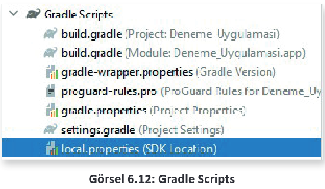
</div>

### 6.1.4.1. build.gradle (Project)

Procet isimli build.gradle, geliştirilen projeye ait build dosyasıdır. Bu dosya içinde yapılacak herhangi bir değişiklik, mobil uygulama projesindeki tüm modüllere uygulanır. Açılan uygulama, Görsel 6.13’teki yapıya benzer şekildedir.

<div style='display:block;text-align:center'>

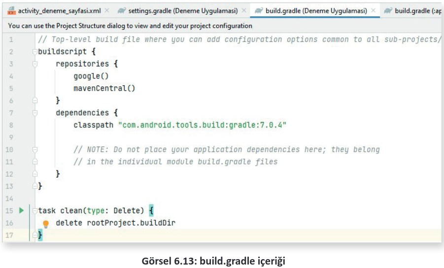
</div>

**NOT:**

>Gradle, sürekli güncellenir. Bu nedenle Görsel 6.13’teki classpath ile başlayan 7.0.4 zamanla değişiklik gösterir ve ileri versiyonlar uygulama tarafından önerilir.

### 6.1.4.2. build.gradle (Module)

Bu dosya, mobil geliştirme ortamında geliştirilen projenin her modülünde yer alır. Bu dosya içinde yapılacak değişiklikler, belirli bir uygulama modülünde geçerli olur. İçeriğinde geçerli modül için uygulama kimliği, sürüm adı, sürüm kodları, minimum ve maksimum sdk sürümleri, paket adları vb. içerir. Görsel 6.14’te açılan bir build.gradle (Module) içeriği yer alır.

<div style='display:block;text-align:center'>

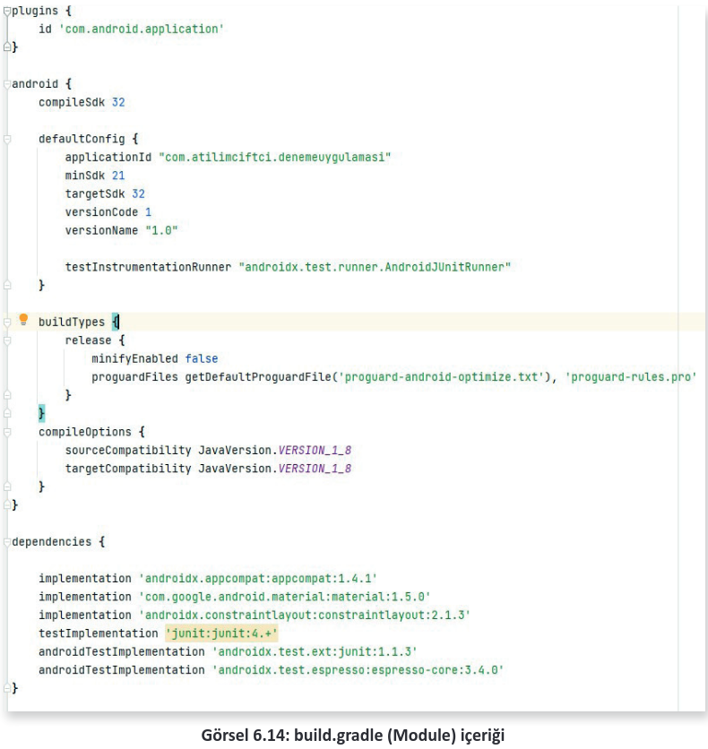
</div>

- **android**: Mobil uygulamasının oluşturma seçeneklerini yapılandırmak için kullanılır.
    - **compileSdk**: Mobil uygulamanın API (Application Programming Interface) seviyesini tanımlamak için kullanılır. Geliştirilen mobil uygulama burada tanımlanan seviyeyi veya daha alt seviyeleri destekler.
  
- **defaultConfig**: Geliştirilen mobil uygulamanın default konfigürasyon ayarlarını yapılandırmak için kullanılır.
    - **applicationId**: Geliştirilen mobil uygulamayı yayınlama sırasında kullanılan benzersiz kimliği tanımlamak için kullanılır.
    - **minSdk**: Geliştirilen mobil uygulamayı çalıştırabilmek için gereken en düşük API seviyesini belirtir.
    - **targetSdk**: Geliştirilen mobil uygulamayı test etmek için kullanılan API seviyesini belirtir.
    - **versionCode**: Geliştirilen mobil uygulamanın sürüm kodudur. Her güncellemede sürüm kodunun bir veya daha fazla artırılması gerekir.
    - **versionName**: Geliştirilen mobil uygulamanın sürüm adını tanımlar. Her güncellemede rastgele bir oranda artırılması gerekir.

- **buildTypes**: Mobil uygulamalar geliştirilirken, derlenirken ve imzalı versiyon hazırlanırken Gradle’ın kullandığı bazı özelliklerin düzenlenmesini ve kullanılacak bazı konfigürasyonların daha kolay yönetilmesini sağlar.
    - **release**: Geliştirilen mobil uygulamada açılan buildTypes, iki adet buildTypes tanımlar. Bunlardan biri release iken diğeri debugtır. Daha çok geliştirme aşamasında kullanılan debug modu, standart olarak açıkça gösterilmez. Release ise pro guard ayarlar uygulayıp standart güvenlik önlemi almayı sağlar.

- **compileOptions**: Geliştirilen mobil uygulamada java derleme seçeneklerinin yer aldığı bölümdür.
- **Dependencies**: Mobil uygulama geliştirme platformunda tasarlanan projenin beraberinde derlenmesi gereken kaynakları içeren bölümdür. Geliştirilen mobil uygulamada kullanılması istenen paketler vb. burada projeye implement edilir.

**UYARI:**

>Projede gradle içinde güncelleme varsa build.gradle içine girildiğinde güncellenmesi gereken paket, Görsel 6.15’te olduğu gibi sarı bir arka plan ile belirir

<div style='display:block;text-align:center'>

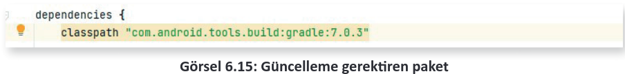
</div>

Paketin üzerine farenin sol tuşu ile tıklanıp birkaç saniye beklendiğinde yeni sürümünün ne olduğu gösterilir (Görsel 6.16).

<div style='display:block;text-align:center'>

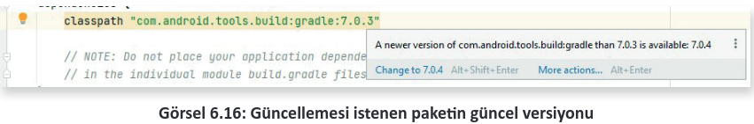
</div>

Eski paket versiyonu silinip önerilen yeni versiyon yazıldığında mobil uygulama geliştirme uygulamasının sağ üst köşesinde Görsel 6.17’de olduğu gibi seçenekler görülür.

<div style='display:block;text-align:center'>


</div>

Sync Now seçeneğine basıldığı zaman internet bağlıysa gradle dosyası içindeki paket güncellenir ve mobil uygulamaya senkronize edilir.

**NOT:**

>Proje dosya yapıları ve yapılandırma ayarları hakkında daha detaylı ve güncel bilgiler için [https://developer.android.com/docs](https://developer.android.com/docs "Android Studio Resmi WEB sitesi") adresinde yer alan dokümanları inceleyiniz.