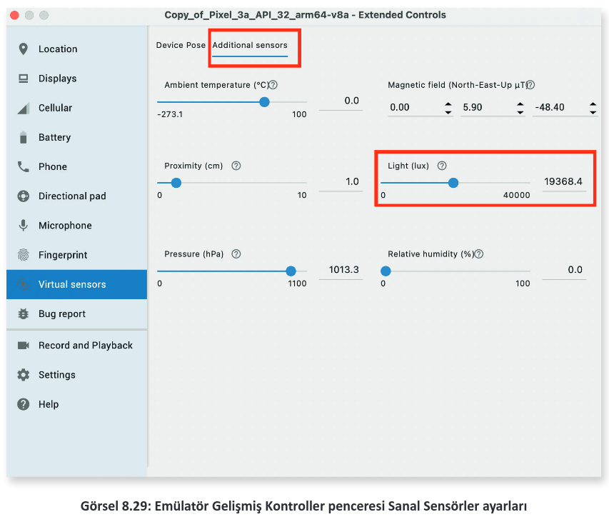
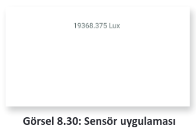

# 8.7. SENSÖRLERLE ÇALIŞMAK

- <a href="#8.7.1.">8.7.1. Tüm Sensörlere Erişmek </a>
- <a href="#8.7.2.">8.7.2. Sensör Olaylarıyla Çalışmak </a>

Mobil cihazlarda kullanıcının çevresindeki değişikleri ölçebilen algılayıcılar bulunur. Mobil uygulama geliştirme ortamı, sensörlerden gelen verileri alarak bu verilerin uygulama içinde kullanılmasını sağlar. Kullanılabilen sensör türleri şunlardır:
- **Hareket Sensörleri:** Bu sensörler, cihazın yer değiştirmesini tespit eder. İvmeölçer, jiroskop ve yerçekimi sensörleri bu tür sensörlerdendir.
- **Çevre Sensörleri:** Bu sensörler; sıcaklık, basınç, ışık ve nem değişimlerini tespit eder.
- **Konum Sensörleri:** Bu sensörler, cihazın konumunu tespit eder. Gerekli bilgileri manyetik sensörlerden alır.


Mobil uygulama geliştirme ortamında sensör işlemleri SensorManager sınıfı ile yapılır. SensorManager şu şekilde tanımlanır:

```java
SensorManager sensorManager;
sensorManager = (SensorManager) getSystemService(Context.SENSOR_SERVICE);
```

Bir ışık sensörü şu şekilde tanımlanır:

```java
Sensor sensorIsik;
sensorIsik = sensorManager.getDefaultSensor(Sensor.TYPE_LIGHT);
```

Sensör tipleri Sensor sınıfında tanımlanmıştır. Sensor.TYPE_LIGHT ile sensörün bir ışık sensörü belirtilir. Mobil uygulama geliştirme ortamının desteklediği sensör tiplerine [https://developer.android.com/reference/android/hardware/Sensor](https://developer.android.com/reference/android/hardware/Sensor "Android Studio Resmi WEB sitesi") adresinden bakılabilir.

Mobil uygulama geliştirme ortamında bulunan sensörlerin bazıları yazılım tabanlı bazıları ise donanım tabanlıdır (Tablo 8.3). Yazılım tabanlı sensörler, donanım tabanlı sensörleri taklit eder. Yazılım tabanlı sensörler, hız ve kesinlik olarak donanım tabanlı sensörler kadar iyi değildir.

<div style="text-align:center;font-weight:bold;">Tablo 8.3: Mobil Uygulama Geliştirme Ortamında En Çok Kullanılan Sensörler</div>


| Sensör                       | Tip | Tanım                                                                              | Ortak Kullanım Alanları |
| ---------------------------- | --- | ---------------------------------------------------------------------------------- | ----------------------- |
| **TYPE_ACCELEROMETER**       | D   | Cihazın x, y, z eksenini ve ivme kuvvetini tespit eder.                            | Hareket algılama        |
| **TYPE_AMBIENT_TEMPERATURE** | D   | Ortam oda sıcaklığını santigrat derece cinsinden ölçer.                            | Sıcaklık                |
| **TYPE_GRAVITY**             | Y/D | Bir cihaza x, y, z eksenlerinde uygulanan yerçekimini tespit eder.                 | Hareket algılama        |
| **TYPE_GYROSCOPE**           | D   | Bir aygıtın x, y, z eksenlerinde herbirinin kendi etrafında dönme hızını algılar.  | Dönme algılama          |
| **TYPE_LIGHT**               | D   | Ortam ışık seviyesini Lux cinsinden ölçer.                                         | Ekran parlaklığı        |
| **TYPE_LINEAR_ACCELERATION** | Y/D | Yerçekimi kuvveti hariç x, y, z eksenlerinde oluşan ivmeyi ölçer.                  | İvmeölçer               |
| **TYPE_MAGNETIC_FIELD**      | D   | Cihazın x, y, z eksenleri için ortamdaki jeomanyetik alanı μT cinsinden ölçer.     | Pusula                  |
| **TYPE_ORIENTATION**         | Y   | Bir aygıtın x, y, z tümü etrafında yaptığı dönüş derecelerini ölçer.               | Konum                   |
| **TYPE_PRESSURE**            | D   | Ortam hava basıncını hPa veya mbar cinsinden ölçer.                                | Basınç                  |
| **TYPE_PROXIMITY**           | D   | Bir cihazın görüntüleme ekranına göre bir nesnenin yakınlığını cm cinsinden ölçer. | Telefon konumu          |
| **TYPE_RELATIVE_HUMIDITY**   | D   | Bağıl ortam nemini yüzde (%) olarak ölçer.                                         | Nem                     |
| **TYPE_ROTATION_VECTOR**     | Y/D | Cihazın dönüş vektörünün üç ögesini sağlayarak bir cihazın yönünü ölçer.           | Hareket algılama        |
| **TYPE_TEMPERATURE**         | D   | Cihazın sıcaklığını santigrat derece cinsinden ölçer.                              | Sıcaklık                |

<h2 id="8.7.1.">8.7.1. Tüm Sensörlere Erişmek</h2>

Sistemde tanımlı tüm sensörler şu şekilde alınır:

```java
List<Sensor> deviceSensors = sensorManager.getSensorList(Sensor.TYPE_ALL);
```

Sensör listesi alındıktan sonra cihazın hangi sensörleri destekleyip desteklemediği tespit edilir. Cihazda hangi sensörlerin desteklendiği şu şekilde belirlenir:

```java
SensorManager sensorManager;
Sensor sensor;
sensorManager = (SensorManager) getSystemService(Context.SENSOR_SERVICE);
sensor = null;
if (sensorManager.getDefaultSensor(Sensor.TYPE_GRAVITY) != null) {
    List<Sensor> gravSensors = sensorManager.getSensorList(Sensor.TYPE_GRAVITY);
    for (int i = 0; i < gravSensors.size(); i++) {
        if ((gravSensors.get(i).getVendor().contains("Google LLC")) && (gravSensors.get(i).getVersion() == 3)) {
            sensor = gravSensors.get(i);
        }
    }
}
if (sensor == null) {
    if (sensorManager.getDefaultSensor(Sensor.TYPE_ACCELEROMETER) != null) {
        sensor = sensorManager.getDefaultSensor(Sensor.TYPE_ACCELEROMETER);
    } 
    else {
        Toast.makeText(this, "Sensör desteklenmiyor",Toast.LENGTH_SHORT).show();
    }
}
```

Bir sensörden veri almak için öncelikle cihazın, sensörü destekleyip desteklemediği tespit edilmelidir. Cihaz, sensörü desteklemezse uygulama çökebilir.

<h2 id="8.7.2.">8.7.2. Sensör Olaylarıyla Çalışmak</h2>

Sensör olayları kullanılarak sensörlerden gelen veriler eş zamanlı olarak elde edilir. Gelen verileri sağlıklı bir şekilde kullanmak için SensorEventListener arabirimi uygulanır. Arabirim ile onAccuracyChanged ve onSensorChanged metotları eklenir.

onAccuracyChanged olayı, sensörün doğruluğu değişirse çalışır. onSensorChanged olayında ise sensör verisi değiştiğinde metot çalışır.

Sensörler olaylara şu şekilde kaydedilir:

```java
@Override
protected void onResume() {
    super.onResume();
    sensorManager.registerListener(this, mLight, SensorManager.SENSOR_DELAY_NORMAL);
}
@Override
protected void onPause() {
    super.onPause();
    sensorManager.unregisterListener(this);
}
```

Kayıt işleminde üçüncü parametre olarak sensörün çalışma sıklığı belirlenir. Sensörler ne kadar yüksek çalışma sıklığında ölçüm yaparsa daha hatasız sonuçlar elde eder. Ancak yüksek çalışma sıklığı pilin çok çabuk bitmesine neden olur. Bundan dolayı bir sensörü yüksek çalışma sıklığında çalıştırmak için özel izin almak gereklidir.

<span style="color:#f00;font-weight:bold;">UYARI:</span> Olayların çalışması için uygulama başladığında kayıt yapılması gereklidir. Uygulama kapandığında ise kayıt işlemi onlandırılmalıdır. Kayıt işlemi sonlandırılmazsa sensör yine veri göndermeye devam eder. Bu durum, sensörün çok fazla pil tüketmesine neden olur.

Sensörün yüksek çalışma sıklığında olmasını sağlamak için manifest dosyasında şu değişiklik yapılarak izin alınır:

```xml
<uses-permission android:name="android.permission.HIGH_SAMPLING_RATE_SENSORS"/>
```

**18. UYGULAMA:** İşlem adımlarına göre bir ışık sensörü tanımlayarak sensörden gelen verileri okuyunuz.

**1. Adım:** Empty Activity şablonunu kullanarak yeni bir proje oluşturunuz. Projenin adını "LightSensorApp" yapınız.

**2. Adım:** build.gradle dosyasını açarak viewBinding özelliğini aktif ediniz.

**3. Adım:** main_activity.xml dosyasını açarak sadece bir tane TextView bırakınız. TextView nesnesine txtView id ismini veriniz.

**4. Adım:** MainActivity.java dosyasını açıp viewBinding nesnesi tanımlayınız ve viewBinding için gerekli ayarlamaları yapınız.

**5. Adım:** MainActivity.java dosyasını açarak SensorManager ve Sensor nesnelerini tanımlayınız.

**6. Adım:** MainActivity sınıfına SensorEventListener arabirimini şu şekilde tanımlayınız:

```java
public class MainActivity extends AppCompatActivity implements SensorEventListener
```

**7. Adım:** SensorEventListener metotlarının sınıf içinde oluşmasını sağlayınız.

**8. Adım:** MainActivity.java dosyasını şu şekilde düzenleyiniz:

```java
private SensorManager sensorManager;
Sensor mLight;
ActivityMainBinding binding;
@Override
protected void onCreate(Bundle savedInstanceState) {
    super.onCreate(savedInstanceState);
    binding = ActivityMainBinding.inflate(getLayoutInflater());
    View view = binding.getRoot();
    setContentView(view);
    sensorManager =  (SensorManager) getSystemService(Context.SENSOR_SERVICE);
    mLight = sensorManager.getDefaultSensor(Sensor.TYPE_LIGHT);
}
```

**9. Adım:** onSensorChanged olayını şu şekilde düzenleyiniz:

```java
@Override
public void onSensorChanged(SensorEvent sensorEvent) {
    float lux = sensorEvent.values[0];
    binding.txtView.setText(lux+" Lux");
}
```

**10. Adım:** Sensörü şu şekilde kaydediniz:

```java
@Override
protected void onResume() {
    super.onResume();
    sensorManager.registerListener(this,mLight,SensorManager.SENSOR_DELAY_NORMAL);
}
@Override
protected void onPause() {
    super.onPause();
    sensorManager.unregisterListener(this);
}
```

**11. Adım:** Uygulamayı çalıştırıp emülatörde Gelişmiş Kontroller penceresini açınız.

**12. Adım:** Gelişmiş Kontroller penceresinde Görsel 8.29’daki Virtual sensors sekmesini açınız. Additional sensors sekmesinde Light ayarları ile ayarlamalar yapınız.

<div style='display:block;text-align:center'>


</div>

**13. Adım:** Uygulamada Görsel 8.30’daki değişikliklerin olup olmadığını tespit ediniz.

<div style='display:block;text-align:center'>


</div>

**SIRA SİZDE:**

TYPE_AMBIENT_TEMPERATURE sensörünü kullanan bir uygulama yazınız.

**DEĞERLENDİRME:**

Çalışmanız aşağıda yer alan kontrol listesi kullanılarak değerlendirilecektir. Çalışmanızı yaparken değerlendirme ölçütlerini dikkate alınız.

<div style="text-align:center;font-weight:bold;">KONTOL LİSTESİ</div>

| DEĞERLENDİRME ÖLÇÜTLERİ                                                          | EVET | HAYIR |
| :-------------------------------------------------------------------------------- | ---- | ----- |
| 1. Yeni Empty Activity ile proje oluşturdu.                                      |
| 2. SensorManager tanımlandı.                                                     |
| 3. SensorManager ile TYPE_AMBIENT_TEMPERATURE değerlerinin dinlenmesini sağladı. |
| 3. SensorManager sınıfını aktiviteye kaydetti.                                   |