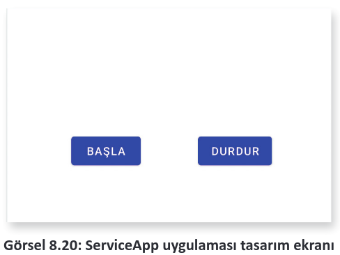
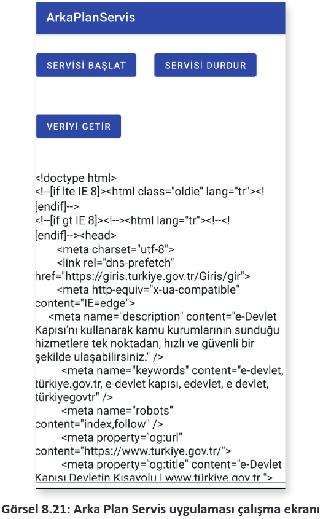
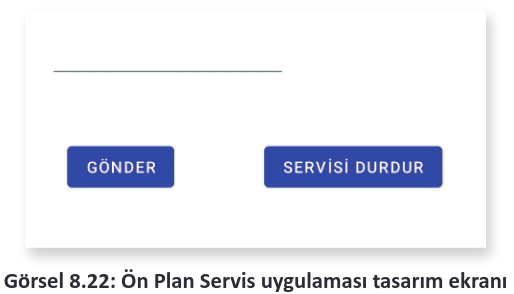
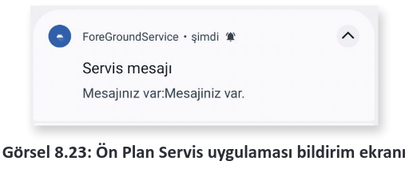
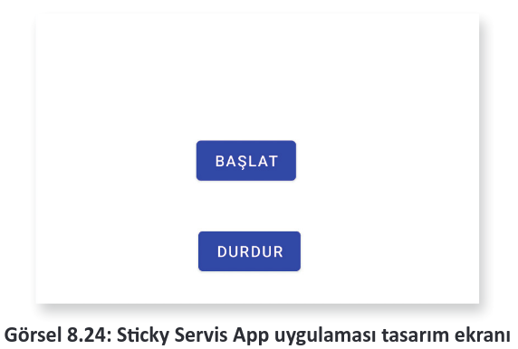
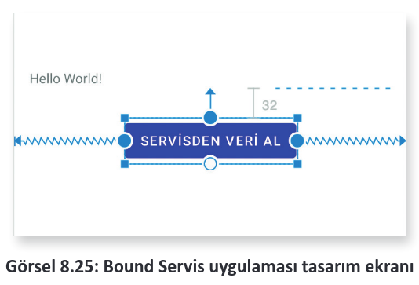
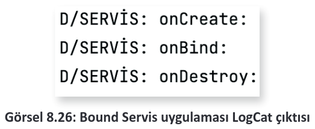
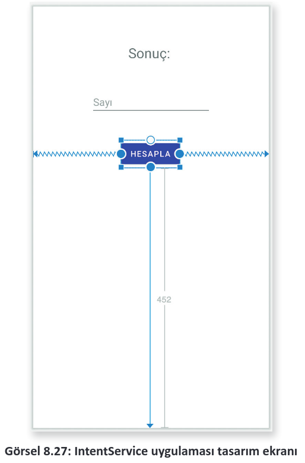

# 8.5. SERVİSLERLE ÇALIŞMAK

<a href="#8.5.1.">8.5.1. Arka Plan Servislerle Çalışmak </a>\
<a href="#8.5.2.">8.5.2. Ön Plan Servislerle Çalışmak </a>\
<a href="#8.5.3.">8.5.3. Sticky Servislerle Çalışmak </a>\
<a href="#8.5.4.">8.5.4. Bound Servislerle Çalışmak  </a>\
<a href="#8.5.5.">8.5.5. IntentServislerle Çalışmak </a>

Servisler, uygulamanın arabiriminden bağımsız çalışan ve arabirimi olmayan uygulamalardır. Servisler genellikle arka planda çalışmak için kullanılır. Örneğin veri tabanının yedeklenmesi veya internetten veri indirmek gibi uzun sürecek bir işlem varsa bu işlemler servisler yardımıyla yapılır. Servislerin çalışması için manifest dosyasına kaydedilmesi gereklidir. Manifest dosyasına eklenmemiş bir servis çalışmaz. Bir servis şu şekilde manifest dosyasına eklenir:

```xml
<service android:name=".YeniServis"/>
```

Servisler de aktiviteler gibi bir yaşam döngüsüne sahiptir. Bazı önemli servis metotları şunlardır:
- **onStartCommand():** Servis, aktiviteden startService metodu ile çalışmaya başlar. Servis kapatılıncaya kadar çalışır. Kullanıcı, servisi stopService veya stopSelf ile kapatıncaya kadar servisin onStartCommand metodu çalışmaya devam eder. onStartCommand ile yapılan işlemlerde dikkatli olmak gereklidir. Sisteme çok fazla iş yükü bindirilirse Google Play uygulamayı kabul etmeyebilir.
- **onBind():** Servislere görsel bileşenlerin bindService metodu ile bağlanmasını sağlar.
- **onUnBind():** Servis ile bağlanan bileşenin bağlantısı koptuğu zaman çalışır.
- **onRebind():** Servise yeni bir görsel bileşen bağlandığında çalışır.
- **onCreate():** Servis başlatıldığında çalışır.
- **onDestroy():** Servis kapatıldığı zaman çalışır. onDestroy çalıştıktan sonra servis yok edilir. Android servisleri üç gruba ayrılır.
- 
1. **Arka Plan Servisleri:** Bu servisler tamamen arka planda çalışır. Kullanıcılar bu servisleri göremezler. Arka plan servisleri tüm işlerini herhangi bir görsel bileşen kullanmadan yapar.İnternetten veri alma gibi işlemler çok sık yapılıyorsa genellikle arka plan hizmetleri tercih edilir.
2. **Ön Plan Servisleri**: Bir görsel bileşen ile çalışan servislerdir. Örneğin bir müzik çalar servisi kurularak uygulama kapansa bile müziğin çalışması sağlanır. Bazı ön plan servisleri Toast mesajı veya bir bildirim vererek çalışmayı durdurabilir.
3. **Bağlı Servisler**: Görsel bileşenin onBind metodu ile servise bağlandığı servislerdir. Görsel bileşen ile bağlantı koptuğunda servis otomatik olarak yok edilir. 
   
Servisler sadece startService metodunun kullanılması ile çalışmaya başlar. stopService ile durduruluncaya kadar çalışmaya devam eder. Arka planda bir servis çalıştığında uzun süreli bir işlem yapılacaksa mutlaka yeni bir iş parçacığı üzerinde gerçekleştirilmelidir. Servisler her ne kadar arkaplanda çalışsa da ana aktivitenin iş parçacığı üzerine işlem yapar. Uzun süren bir işlem, ayrı bir iş parçacığı üzerinde çalıştırılmazsa uygulama kilitlenir. Bir servis şu şekilde oluşturulur:

Bir servis şu şekilde oluşturulur:

```java
public class DataService extends Service {
    @Nullable
    @Override
    public IBinder onBind(Intent intent) {
        return null;
    }
}
```

Servis oluşturulduktan sonra mobil uygulama geliştirme ortamı sadece onBind metodunu kodlara ekler. Servise ait diğer metotlar yazılarak kullanılır. Servisin son hâli şu şekildedir:

```java
public class DataService extends Service {
    @Nullable
    @Override
    public IBinder onBind(Intent intent) {
        return null;
    }
    @Override
    public int onStartCommand(Intent intent, int flags, int startId) {
        return super.onStartCommand(intent, flags, startId);
    }
    @Override
    public void onCreate() {
        super.onCreate();
    }
    @Override
    public void onDestroy() {
        super.onDestroy();
    }
}
```

Servisle ilgili tüm işlemler onStartCommand metodunda yapılır. Servis hayatta olduğu sürece onStartCommand metodu çalışır.

Servisler de aktiviteler gibi bir Intent nesnesi ile başlatılır. Bir servis şu şekilde başlatılır:

```java
Intent intent = new Intent(MainActivity.this,SayiciServis.class);
startService(intent);
```

Servis başlatıldıktan sonra kapatılmazsa çalışmaya devam eder. Bir servis şu şekilde kapatılır:

```java
Intent intent = new Intent(MainActivity.this,SayiciServis.class);
stopService(intent);
```

Servisler sistem tarafından da kapatılabilir. Bir servis, sistem kaynaklarını çok fazla tüketirse işletim sistemi servisi kapatır.

**11. UYGULAMA:** İşlem adımlarına göre bir servis oluşturarak servisi çalıştıran uygulamayı yazınız.

**1. Adım:** Empty Activity şablonunu kullanarak yeni bir proje oluşturunuz. Projenin adını "ServisApp01" yapınız.

**2. Adım:** build.gradle dosyasını açarak viewBinding özelliğini aktif ediniz.

**3. Adım:** main_activity.xml dosyasına Görsel 8.20’deki gibi iki buton yerleştiriniz.

<div style='display:block;text-align:center'>


</div>

**4. Adım:** Butonlara btnBasla ve btnDur isimlerini veriniz.

**5. Adım:** build.gradle dosyasını açarak viewBinding özelliğini aktif ediniz.

**6. Adım:** MainActivity.java dosyasını açarak binding nesnesi tanımlayınız ve gerekli ayarlamaları yapınız.

**7. Adım:** btnBasla butonu için bir onClickListener tanımlayınız. onClick metodunu şu şekilde yazınız:

```java
binding.btnBasla.setOnClickListener(new View.OnClickListener() {
    @Override
    public void onClick(View view) {
        Intent intent = new Intent(MainActivity.this,YeniServis.class);
        startService(intent);
    }
});
```

**8. Adım:** btnDur butonu için bir onClickListener tanımlayınız. onClick metodunu şu şekilde yazınız:

```java
binding.btnDur.setOnClickListener(new View.OnClickListener() {
    @Override
    public void onClick(View view) {
        Intent intent = new Intent(MainActivity.this,YeniServis.class);
        stopService(intent);
    }
});
```

**9. Adım:** Service sınıfından türemiş yeni bir sınıf oluşturunuz ve adını "YeniServis" veriniz.

**10. Adım:** YeniServis sınıfının tüm metotlarını oluşturunuz. YeniServis sınıfına onStartCommand, onCreate ve onDestroy metotlarını ekleyiniz.

**11. Adım:** YeniServis sınıfını şu şekilde kodlayınız:

```java
private static final String TAG = "YeniServis";
@Nullable
@Override
public IBinder onBind(Intent intent) {
    return null;
}
@Override
public int onStartCommand(Intent intent, int flags, int startId) {
    Log.d(TAG, "onStartCommand: ");
    return super.onStartCommand(intent, flags, startId);
}
@Override
public void onCreate() {
    Log.d(TAG, "onCreate: ");
}
@Override
public void onDestroy() {
    Log.d(TAG, "onDestroy: ");
    super.onDestroy();
}
```

**12. Adım:** Manifest dosyasını açarak dosyaya şu eklemeyi yapınız:

```xml
<service android:name = ".YeniServis"/>
```

**13. Adım:** Uygulamayı çalıştırıp önce BAŞLA butonuna sonra DURDUR butonuna basınız. Logcat penceresinde servisin çalışıp çalışmadığını kontrol ediniz.

>YeniServis: onCreate: <br> YeniServis: onStartCommand: <br> YeniServis: onDestroy:

<h2 id="8.5.1.">8.5.1. Arka Plan Servislerle Çalışmak</h2>

Tüm servis türleri arka planda çalışır ancak arka planda çalışan bir servis, kullanıcı ile hiçbir etkileşime girmez. Servisin yaptığı işler bir yerde saklanırsa sonradan kullanılabilir. Arka plan servisleri başlatıldıktan sonra kapatılıncaya kadar çalışmaya devam eder.

Arka plan servislerinde işlemler yeni bir iş parçacığı oluşturularak yapılmalıdır. Herhangi bir işlem, yeni bir iş parçacığı ile şu şekilde çalıştırılır:

```java
new Thread(new Runnable() {
    @Override
    public void run() {
        getData();
    }
}).start();
```

Uzun işlemler, ana iş parçacığını sürekli meşgul eder ve uygulama, işlemler bitinceye kadar çalışamaz hâle gelir.

**12. UYGULAMA:** İşlem adımlarına göre bir servis yazarak servis ile "[https://turkiye.gov.tr](https://turkiye.gov.tr "e-Devlet Kapısı Resmi WEB sitesi")" internet sitesinin içeriğini arka planda alınız. Alınan verileri sharedPreferences nesnesini kullanarak kaydeden ve uygulamada sharedPreferences nesnesinden okuyup gösteren programı yazınız.

**1. Adım:** Empty Activity şablonunu kullanarak yeni bir proje oluşturunuz. Projenin adını "ArkaPlanServis" yapınız.

**2. Adım:** build.gradle dosyasını açarak viewBinding özelliğini aktif ediniz.

**3. Adım:** main_activity.xml dosyasını şu şekilde düzenleyiniz:

```xml
<?xml version="1.0" encoding="utf-8"?>
<androidx.constraintlayout.widget.ConstraintLayout xmlns:android="http://schemas.android.com/apk/res/android"
xmlns:app="http://schemas.android.com/apk/res-auto"
xmlns:tools="http://schemas.android.com/tools"
android:layout_width="match_parent"
android:layout_height="match_parent"
tools:context=".MainActivity">
    <EditText
        android:id="@+id/editTextTextMultiLine"
        android:layout_width="406dp"
        android:layout_height="509dp"
        android:ems="10"
        android:gravity="start|top"
        android:inputType="textMultiLine"
        app:layout_constraintBottom_toBottomOf="parent"
        app:layout_constraintEnd_toEndOf="parent"
        app:layout_constraintStart_toStartOf="parent" />
    <Button
        android:id="@+id/btnBaslat"
        android:layout_width="wrap_content"
        android:layout_height="wrap_content"
        android:layout_marginTop="24dp"
        android:text="Servisi Başlat"
        app:layout_constraintTop_toTopOf="parent"
        tools:layout_editor_absoluteX="26dp" />
    <Button
        android:id="@+id/btnDur"
        android:layout_width="wrap_content"
        android:layout_height="wrap_content"
        android:layout_marginStart="28dp"
        android:layout_marginTop="24dp"
        android:text="Servisi Durdur"
        app:layout_constraintStart_toEndOf="@+id/btnBaslat"
        app:layout_constraintTop_toTopOf="parent" />
    <Button
        android:id="@+id/btnGetir"
        android:layout_width="wrap_content"
        android:layout_height="wrap_content"
        android:layout_marginTop="48dp"
        android:text="Veriyi getir"
        app:layout_constraintTop_toBottomOf="@+id/btnBaslat"
        tools:layout_editor_absoluteX="139dp" />
</androidx.constraintlayout.widget.ConstraintLayout>
```

**4. Adım:** ArkaPlanServis.java dosyası oluşturunuz. Oluşturduğunuz sınıfı Service sınıfından türetiniz.

**5. Adım:** Manifest dosyasını açarak servisi kaydediniz.

```xml
<service android:name=".ArkaPlanServis"/>
```

**6. Adım:** Manifest dosyasında Internet izni alınız.

```xml
<uses-permission android:name="android.permission.INTERNET"/>
```

**7. Adım:** MainActivity.java dosyasını açarak viewBinding nesnesi tanımlayınız ve viewBinding için gerekli ayarlamaları yapınız.

**8. Adım:** btnBaslat butonuna bir onClickListener tanımlayınız. onClick metodunu şu şekilde yazınız:

```java
Intent intent = new Intent(MainActivity.this,ArkaPlanServis.class);
startService(intent);
```

**9. Adım:** btnDur butonuna bir onClickListener tanımlayınız. onClick metodunu şu şekilde yazınız:

```java
Intent intent = new Intent(MainActivity.this,ArkaPlanServis.class);
stopService(intent);
```

**10. Adım:** btnGetir butonuna bir onClickListener tanımlayınız. onClick metodunu şu şekilde yazınız:

```java
SharedPreferences sharedPreferences = MainActivity.this.getSharedPreferences("dosya",MODE_PRIVATE);
String veri = sharedPreferences.getString("data","");
binding.editTextTextMultiLine.setText(veri);
```

**11. Adım:** ArkaPlanServis.java dosyasını açınız ve getData isimli bir metot oluşturunuz.

**12. Adım:** getData metodunu şu şekilde yazınız:

```java
public void getData(){
    Context context=getApplicationContext();
    URL url;
    String sonuc="";
    HttpURLConnection httpURLConnection=null;
    try{
        url = new URL("https://www.turkiye.gov.tr/");
        URLConnection urlConnection=url.openConnection();
        httpURLConnection= (HttpURLConnection) url.openConnection();
        int lenghtData=urlConnection.getContentLength();
        InputStream inputStream = httpURLConnection.getInputStream();
        InputStreamReader inputStreamReader=new InputStreamReader(inputStream);
        int D=inputStreamReader.read();
        while(D!=-1){
            char c=(char) D;
            sonuc+=c;
            D=inputStreamReader.read();
        }
        SharedPreferences sharedPreferences=context.getSharedPreferences("dosya",MODE_PRIVATE);
        sharedPreferences.edit().putString("data",sonuc).apply();
    }catch (Exception e) {
        SharedPreferences sharedPreferences=context.getSharedPreferences("dosya",MODE_PRIVATE);
        sharedPreferences.edit().putString("data","Hata oluştu").apply();
    }
}
```

**13. Adım:** onStartCommand metodu yoksa oluşturunuz ve şu şekilde yazınız:

```java
@Override
public int onStartCommand(Intent intent, int flags, int startId) {
    new Thread(new Runnable() {
        @Override
        public void run() {
            getData();
        }
    }).start();
    return super.onStartCommand(intent, flags, startId);
}
```

**14. Adım:** Uygulamayı çalıştırınız. Önce SERVİSİ BAŞLAT butonuna basınız.

**15. Adım:** Biraz bekleyip VERİYİ GETİR butonuna basınız. Sonucun Görsel 8.21’deki gibi görünüp görünmediğini kontrol ediniz.

<div style='display:block;text-align:center'>


</div>

<span style="color:#f00;font-weight:bold">UYARI:</span> On ikinci uygulamada en temel veri okuma metotları kullanılmıştır. Başka bir web sitesi adresi yazıldığında hata alınabilir. Web sitesine herhangi bir tarayıcı yazılımı kullanılmadan bağlanıldığı için sunucular gelen bağlantıyı kabul etmeyebilir. Bu tür sitelerden veri okuma istendiğinde ekrana "Hata" yazacaktır. Web sitelerinden veri okumak için Retrofit gibi gelişmiş araçlar da kullanılabilir.

<h2 id="8.5.2.">8.5.2. Ön Plan Servislerle Çalışmak</h2>

Ön plan servisler, kullanıcılara herhangi bir bildirim vermek için kullanılır. Arka plan servislerde kullanıcı ile etkileşim mümkün değildir. Kullanıcı ile etkileşim kurulması gerekli ise ön plan servisler kullanılır.

Ön plan servisi herhangi bir uyarı vermezse 5 saniye içinde yok edilir. Ön plan servisleri manifest dosyasından izin alınarak çalıştırılır. Normal servisler startService metodu ile çalıştırılırken ön plan servisler startForegroundService metodu ile çalıştırılır.

**13. UYGULAMA:** İşlem adımlarına göre bir ön plan servis yazarak servise bir mesaj gönderiniz. Alınan mesajı bir servis bildirimi ile gösteren uygulamayı yazınız.

**1. Adım:** Empty Activity şablonunu kullanarak yeni bir proje oluşturunuz. Projenin adını "ArkaPlanServis" yapınız.

**2. Adım:** build.gradle dosyasını açarak viewBinding özelliğini aktif ediniz.

**3. Adım:** main_activity.xml dosyasını Görsel 8.22’deki gibi düzenleyiniz.

<div style='display:block;text-align:center'>


</div>

**4. Adım:** EditText için "EditText", butonlar için btnGonder ve btndUr id isimlerini veriniz.

**5. Adım:** MainActivity.java dosyasını açıp viewBinding nesnesi tanımlayınız ve viewBinding için gerekli ayarlamaları yapınız.

**6. Adım:** OnServis.java isimli bir dosya oluşturup Service sınıfından türetiniz.

**7. Adım:** Manifest dosyasını açarak ön plan servisi iznini şu şekilde alınız:

```xml
<uses-permission android:name="android.permission.FOREGROUND_SERVICE"/>
```

**8. Adım:** Manifets dosyasında servisi şu şekilde kaydediniz:

```xml
<service android:name=".OnServis"/>
```

**9. Adım:** MainActivity.java dosyasında bildirim için gerekli kanal ayarlarını onCreate metoduna şu şekilde ekleyiniz:

```java
if (Build.VERSION.SDK_INT >= Build.VERSION_CODES.O) {
    int bildirimOnemi = NotificationManager.IMPORTANCE_DEFAULT;
    NotificationChannel BildirimKanali = new NotificationChannel("ForeGroundServiceK1", "ForeGroundService", bildirimOnemi);
    BildirimKanali.setDescription("");
    NotificationManager notificationManager=getSystemService(NotificationManager.class);
    notificationManager.createNotificationChannel(BildirimKanali);
}
```

**10. Adım:** MainActivity.java dosyasında btnGonder için bir onClickListener tanımlayınız.

**11. Adım:** onClick metodunu şu şekilde yazınız:

```java
Intent intent = new Intent(MainActivity.this,OnServis.class);
intent.putExtra("mesaj",binding.editText.getText().toString());
startForegroundService(intent);
```

**12. Adım:** MainActivity.java dosyasında btnDur için bir onClickListener tanımlayınız.

**13. Adım:** onClick metodunu şu şekilde yazınız:

```java
Intent intent = new Intent(MainActivity.this,OnServis.class);
stopService(intent);
```

**14. Adım:** OnServis.java dosyasını açınız.

**15. Adım:** onStartComand dosyasını şu şekilde düzenleyiniz:

```java
@RequiresApi(api = Build.VERSION_CODES.O)
@Override
public int onStartCommand(Intent intent, int flags, int startId) {
    String mesaj = intent.getStringExtra("mesaj");
    Intent bildirimIntent = new Intent(this,MainActivity.class);
    PendingIntent pendingIntent = PendingIntent.getActivity(this, 0, bildirimIntent,PendingIntent.FLAG_MUTABLE);
    Notification notification = new NotificationCompat.Builder(this,"ForeGroundServiceK1")
        .setContentTitle("Servis mesajı")
        .setContentText("Mesajınız var:" + mesaj)
        .setSmallIcon(R.drawable.ic_launcher_foreground)
        .setContentIntent(pendingIntent)
        .build();
    startForeground(1,notification);
    return START_NOT_STICKY;
}
```

**16. Adım:** Uygulamayı çalıştırınız. Text kutusuna bir mesaj yazıp SERVİSİ BAŞLAT butonuna basınız.

**17. Adım:** Bildirim ekranında Görsel 8.23’teki bildirimi alıp almadığınızı kontrol ediniz.

<div style='display:block;text-align:center'>


</div>

<h2 id="8.5.3.">8.5.3. Sticky Servislerle Çalışmak</h2>

Bir işlemin sürekli olarak çalışması gereken durumda Sticky servisler kullanılır. onStartCommand metodu servis kapatılıncaya kadar sürekli çalışır. Bu tür servisler genellikle müzik oynatıcılarda kullanılır. Uygulama ekranı kapatılsa bile arka planda müzik çalmaya devam eder. Uygulama, sistem belleğinden tamamen kaldırıldığında servis de işletim sistemi tarafından kapatılır.

**14. UYGULAMA:** İşlem adımlarına göre bir servis oluşturarak herhangi bir müzik dosyası çalan uygulamayı yazınız.

**1. Adım:** Empty Activity şablonunu kullanarak yeni bir proje oluşturunuz. Projenin adını "StickyServisApp" yapınız.

**2. Adım:** build.gradle dosyasını açarak viewBinding özelliğini aktif ediniz.

**3. Adım:** main_activity.xml dosyasını Görsel 8.24’teki gibi düzenleyiniz.

<div style='display:block;text-align:center'>


</div>

**4. Adım:** Butonlara btnBaslat ve btnDur id adlarını veriniz.

**5. Adım:** MainActivity.java dosyasını açıp viewBinding nesnesi tanımlayınız ve viewBinding için gerekli ayarlamaları yapınız.

**6. Adım:** StickyServis.java dosyası oluşturunuz ve sınıfı Service sınıfından türetiniz.

**7. Adım:** Manifest dosyasını açarak servisi kaydediniz.

**8. Adım:** MainActivity.java dosyasını açınız ve butonlar için onClickListener tanımlayınız.

**9. Adım:** btnBaslat butonunun onClick olayını şu şekilde yazınız:

```java
Intent intent = new Intent(MainActivity.this,StickyServis.class);
startService(intent);
```

**10. Adım:** btnDur butonunun onClick olayını şu şekilde yazınız:
    
```java
Intent intent = new Intent(MainActivity.this,StickyServis.class);
stopService(intent);
```

**11.  Adım:** StickyServis.java dosyasını açınız. onStartCommand metodunu şu şekilde yazınız:

```java
MediaPlayer mediaPlayer;
@Override
public int onStartCommand(Intent intent, int flags, int startId) {
    mediaPlayer = MediaPlayer.create(this, Settings.System.DEFAULT_RINGTONE_URI);
    mediaPlayer.setLooping(true);
    mediaPlayer.start();
    return START_STICKY;
}
```

**12. Adım:** onDestroy metodunu şu şekilde yazınız:

```java
@Override
public void onDestroy() {
    mediaPlayer.stop();
    super.onDestroy();
}
```

**13. Adım:** Uygulamayı çalıştırınız.

**14. Adım:** Çalışan uygulamada önce BAŞLAT butonuna basınız. Uygulama ekranını kapattığınızda hâlâ sesin gelip gelmediğini kontrol ediniz.

<h2 id="8.5.4.">8.5.4. Bound Servislerle Çalışmak</h2>

Bound servisler bir aktivite ile bağlı olan servis türüdür. Servis ve aktivite birbirine bağlandıktan sonra aktivite yok oluncaya kadar servis kullanılmaya devam eder. Servis nesnesi aktivite nesnesinde tanımlandığı için veri almak çok kolaydır.

Bir Bound servis metoduna aktiviteden şu şekilde ulaşılabilir:

```java
public String veriAl(){
    Random r = new Random();
    int sayi = r.nextInt(1000);
    return ""+sayi;
}
```
Aktiviteden veriAl metodu çağrılarak veri alınabilir. Bound servisler, ServiceConnection nesnesi kullanılarak bağlanır. Ayrıca startService metodu ile de çalıştırılabilir. Servis, ServiceConnection nesnesi ile bağlandıktan sonra stopService ile durdurulmak istense bile çalışmaya devam eder. Activity ne zaman bağlantıyı keserse servis o zaman durur. ServiceConnection nesnesi tanımlandıktan sonra bindService metodu ile servis nesnesi çalıştırılır. unbindService metodu kullanılarak da servisin bağlantısı kesilir. Bound servisler diğer servislerden farklı olarak bir Inner Class ile beraber şu şekilde tanımlanır:

```java
public class BaglayiciSinif extends Binder {
    public BoundServis servisGetir(){
        return BoundServis.this;
    }
}
public IBinder baglayiciSinif = new BaglayiciSinif();
@Nullable
@Override
public IBinder onBind(Intent intent) {
    Log.d("SERVİS", "onBind: ");
    return baglayiciSinif;
}
```

Inner Class bir bağlayıcı sınıf olarak iş görür. Bağlayıcı sınıf, ServiceConnection nesnesi oluşturu-
lurken kullanılır. Bu sınıf aslında bir ara sınıftır. Sadece servis sınıfının çalışan örneğinin referansını
almayı sağlar.
ServiceConnection sınıfı şu şekilde kullanılarak servis bağlantısı yapılır:

```java
if(serviceConnection == null){
    serviceConnection = new ServiceConnection() {
        @Override
        public void onServiceConnected(ComponentName componentName, IBinder iBinder) {
            BoundServis.BaglayiciSinif baglayiciSinif = (BoundServis.BaglayiciSinif) iBinder;
            boundServis = baglayiciSinif.servisGetir();
            servisBaglimi = true;
        }
        @Override
        public void onServiceDisconnected(ComponentName componentName) {
            servisBaglimi = false;
        }
    };
}
```

Booelan bir değişken kullanılarak servisin bağlı olup olmadığı kontrol edilir ve aktivite içinde gerekli işlemler yapılır.

Bound servislerde servise işlem yaptırmak için startService kullanılmalıdır. ServiceConnection ile sadece servise bağlanılır, serviste onStartCommand metodu çalışmaz. onStartCommand metodunun çalışması için servisin startService ile başlatılması gereklidir.

**15. UYGULAMA:** İşlem adımlarına göre bir Bound servis yazarak servisten veri alan uygulamayı geliştiriniz.

**1. Adım:** Empty Activity şablonunu kullanarak yeni bir proje oluşturunuz. Projenin adını "BoundServiceApp" yapınız.

**2. Adım:** build.gradle dosyasını açarak viewBinding özelliğini aktif ediniz.

**3. Adım:** main_activity.xml dosyasını Görsel 8.25’teki gibi düzenleyiniz.

<div style='display:block;text-align:center'>


</div>

**4. Adım:** TextView için textView, Button için btnVerial id isimlerini veriniz.

**5. Adım:** MainActivity.java dosyasını açıp viewBinding nesnesi tanımlayınız ve viewBinding için gerekli ayarlamaları yapınız.

**6. Adım:** BoundServis.java dosyası oluşturunuz ve sınıfı Service sınıfından türetiniz.

**7. Adım:** BoundServis.java dosyasını şu şekilde düzenleyiniz:

```java
public class BoundServis extends Service {
    public class BaglayiciSinif extends Binder {
        public BoundServis servisGetir(){
            return BoundServis.this;
        }
    }
    public IBinder baglayiciSinif = new BaglayiciSinif();
    @Nullable
    @Override
    public IBinder onBind(Intent intent) {
        Log.d("SERVİS", "onBind: ");
        return baglayiciSinif;
    }
    public String veriAl(){
        Random r = new Random();
        int sayi = r.nextInt(1000);
        return ""+sayi;
    }
    @Override
    public void onCreate() {
        super.onCreate();
        Log.d("SERVİS", "onCreate: ");
    }
    @Override
    public void onDestroy() {
        super.onDestroy();
        Log.d("SERVİS", "onDestroy: ");
    }
    @Override
    public int onStartCommand(Intent intent, int flags, int startId) {
        Log.d("SERVİS", "onStartCommand: ");
        return super.onStartCommand(intent, flags, startId);
    }
}
```

**8. Adım:** Manifest dosyasını açarak servisi kaydediniz.

**9. Adım:** MainActivity.java dosyasını açınız. onCreate olayına şu kodları yazınız:

```java
if(serviceConnection == null){
    serviceConnection = new ServiceConnection() {
        @Override
        public void onServiceConnected(ComponentName componentName, IBinder iBinder) {
            BoundServis.BaglayiciSinif baglayiciSinif = (BoundServis.BaglayiciSinif) iBinder;
            boundServis = baglayiciSinif.servisGetir();
            servisBaglimi = true;
        }
        @Override
        public void onServiceDisconnected(ComponentName componentName) {
            servisBaglimi = false;
        }
    };
    Intent intent=new Intent(this,BoundServis.class);
    bindService(intent,serviceConnection,BIND_AUTO_CREATE);
}
```

**10. Adım:** MainActivity.java dosyasında btnVerial butonu için bir onClickListener tanımlayınız.

**11. Adım:** onClick olayını şu şekilde yazınız:

```java
public void onClick(View view) {
    if(servisBaglimi){
        binding.textView.setText(boundServis.veriAl());
    }
}
```

**12. Adım:** MainActivity.java dosyasında onDestroy olayına şu kodları yazınız:

```java
protected void onDestroy() {
    super.onDestroy();
    unbindService(serviceConnection);
}
```

**13. Adım:** Uygulamayı çalıştırınız. Butona tıklayarak servisten bir veri alınız.

**14. Adım:** Uygulamayı kapatınız ve uygulamanın hareketlerini Logcat penceresinde izleyiniz.

**15. Adım:** LogCat penceresinde Görsel 8.26’daki değişikliklerin olup olmadığını kontrol ediniz.

<div style='display:block;text-align:center'>


</div>

<h2 id="8.5.5.">8.5.5. IntentServislerle Çalışmak</h2>

Android servisleri bazı işlemleri kolaylaştırır ancak servislerden doğrudan veri alınması çok zordur. Bu sorunun daha kolay çözülmesini sağlayan IntentServis türüdür. IntentServisler oluşan sonucu olduğu gibi View nesnesine verebilir. IntentServislerde uzun süren işlemler için ayrıca bir iş parçacığı oluşturulmasına gerek yoktur. IntentServislerde tüm işlemler ayrı bir iş parçacığında yapılır.

IntentServislerin sadece onHandleIntent metodu vardır. Bu servisler de normal servis gibi startService ile başlatılır, stopService ile durdurulur.

IntentServisler bilgileri geriye ResultReceiver nesnesi ile gönderir. ResultReceiver, aktivite içinde Inner Class olarak şu şekilde tanımlanır:

```java
public class MyResultReceiver extends ResultReceiver{
    public MyResultReceiver(Handler handler) {
        super(handler);
    }
    @Override
    protected void onReceiveResult(int resultCode, final Bundle resultData) {
        if(resultCode == 1 && resultData != null){
            handler.post(new Runnable() {
                @Override
                public void run() {
                    String resultString = resultData.getString("data");
                    binding.textView2.setText("Sonuç:" + resultString);
                }
            });
        }
        super.onReceiveResult(resultCode, resultData);
    }
}
```

ResultReceiver, servis içinde şu şekilde veri gönderir:

```java
ResultReceiver resultReceiver = intent.getParcelableExtra("receiver");
Bundle bundle = new Bundle();
bundle.putString("data",r.nextInt(10)*sayi+"");
resultReceiver.send(1,bundle);
```

**16. UYGULAMA:** İşlem adımlarına göre bir IntentServis yazarak activity ile iletişim kurmasını sağlayınız. EditText kutusuna yazılan sayıyı servise gönderip, serviste rastgele bir sayı ile çarparak sonucu geri alan uygulamayı yazınız.


**1. Adım:** Empty Activity şablonunu kullanarak yeni bir proje oluşturunuz. Projenin adını "IntentServiceApp" yapınız.

**2. Adım:** build.gradle dosyasını açarak viewBinding özelliğini aktif ediniz.

**3. Adım:** main_activity.xml dosyasını Görsel 8.27’deki gibi düzenleyiniz.

<div style='display:block;text-align:center'>


</div>

**4. Adım:** Butonlara btnVerial, TextView nesnesine textSonuc, EditView nesnesine textSayi id adlarını veriniz.

**5. Adım:** MainActivity.java dosyasını açıp viewBinding nesnesi tanımlayınız ve viewBinding için gerekli ayarlamaları yapınız.

**6. Adım:** intentServis.java dosyasını oluşturunuz ve sınıfı IntentService sınıfından türetiniz.

**7. Adım:** Manifest dosyasını açarak servisi kaydediniz.

**8. Adım:** MainActivity.java dosyasını açıp şu şekilde Inner Class oluşturunuz:

```java
public class MyResultReceiver extends ResultReceiver{
    public MyResultReceiver(Handler handler) {
        super(handler);
    }
    @Override
    protected void onReceiveResult(int resultCode, final Bundle resultData) {
        if(resultCode == 1 && resultData != null){
            handler.post(new Runnable() {
                @Override
                public void run() {
                    String resultString=resultData.getString("data");
                    binding.textSonuc.setText("Sonuç:"+resultString);
                }
            });
        }
        super.onReceiveResult(resultCode, resultData);
    }
}
```

**9. Adım:** MainActivity.java dosyasında btnVerial butonu için onClickListener tanımlayınız.

**10. Adım:** onClick olayını şu şekilde yazınız:

```java
MyResultReceiver myResultReceiver = new MyResultReceiver(null);
Intent intent=new Intent(MainActivity.this, intentService.class);
intent.putExtra("sayi",binding.textSayi.getText().toString());
intent.putExtra("receiver",myResultReceiver);
startService(intent);
```

**11. Adım:** intentServis.java dosyasını açıp şu şekilde oluşturunuz:

```java
public class intentService extends IntentService {
    public intentService() {
        super("");
    }
    @Override
    protected void onHandleIntent(@Nullable Intent intent) {
    Random r = new Random();
    ResultReceiver resultReceiver = intent.getParcelableExtra("receiver");
    String s = intent.getStringExtra("sayi");
    int sayi = Integer.parseInt(s);
    Bundle bundle = new Bundle();
    bundle.putString("data",r.nextInt(10)*sayi+"");
    resultReceiver.send(1,bundle);
    }
}
```

**12. Adım:** Uygulamayı çalıştırınız ve sonuçlarını gözlemleyiniz.

>**SIRA SİZDE:**
>
>Uygulamanıza iki adet EditText yerleştiriniz. EditText nesnelerine yazılan sayıları IntentServise gönderip serviste matematiksel işlem yaptırınız. Sonucu ana ekrana alarak bir TextView nesnesine yazdırınız.
>
>**DEĞERLENDİRME:**
>
>Çalışmanız aşağıda yer alan kontrol listesi kullanılarak değerlendirilecektir. Çalışmanızı yaparken değerlendirme ölçütlerini dikkate alınız.
>
><div style="text-align:center;font-weight:bold;">KONTOL LİSTESİ</div>
>
>| DEĞERLENDİRME ÖLÇÜTLERİ                       | EVET | HAYIR |
>| --------------------------------------------- | ---- | ----- |
>| 1. Yeni Empty Activity ile proje oluşturdu.   |
>| 2. Ekran tasarımına iki adet EditText ekledi. |
>| 3. Ekran tasarımına bir tane Button ekledi.   |
>| 4. IntentServisi yazdı.                       |
>| 5. Verileri servise gönderip sonucu aldı.     |

