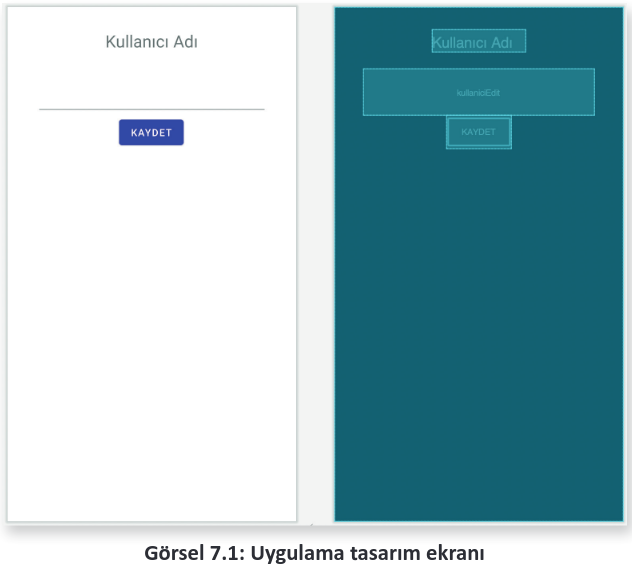
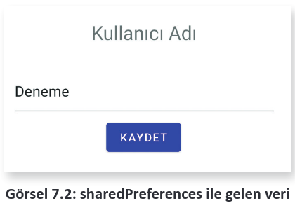
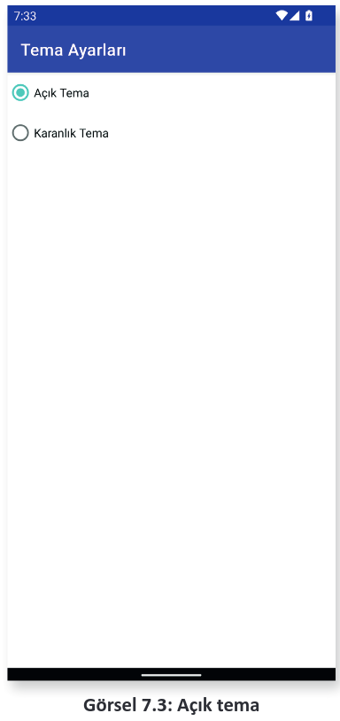
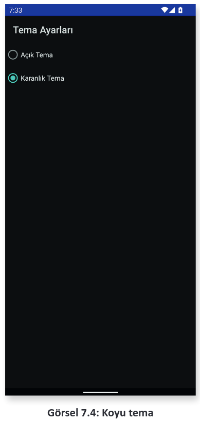

<h1 style="color:#632896">7.1. sharedpreferences KULLANIMI</h1>

Mobil uygulama geliştirme ortamında her zaman basit verileri kaydetmek gerekebilir. Örneğin kullanıcıdan alınan çeşitli bilgilerin yerel cihazda kaydedilip uygulama tekrar açıldığında kullanıcıya gösterilmesi gerekebilir. Bu tür basit veri kayıt işlemleri için **sharedPreferences** nesnesi kullanılabilir. Daha gelişmiş veri tabanları da kullanılabilir ancak basit bir veriyi kaydetmek için karmaşık bir veri tabanı kullanmaya gerek yoktur.

sharedPreferences ile **\<ANAHTAR>=\<DEĞER>** türünde kayıtlar yapılır. Bu durum, bir ayar paneli veya geçici olarak kaydedilmesi gereken veriler için oldukça uygundur.

Uygulama geliştirme ortamında sharedPrefrences iki şekilde kullanılır. Birden fazla dosyaya ihtiyaç varsa getSharedPreferences() ile çağrılır, sadece basit bir veri saklanacaksa **getPreferences()** kullanılmalıdır. Bir ayar paneli varsa ve birden fazla sekmeden oluşuyorsa her bir paneli farklı bir dosyaya kaydetmek için getSharedPreferences ile veri saklama işlemi gerçekleştirilebilir.

`sharedPreferences sharedPref=this.getSharedPreferences("menu1.ds",Context.MODE_PRIVATE);` şeklinde kullanıldığında ilk parametre olarak mutlaka bir dosya ismi girilmelidir. Bu nesne ile yapılan kayıtların hepsi belirtilen dosyaya kaydedilir.

`sharedPreferences sharedPreferences=this.getPreferences(Context.MODE_PRIVATE);` şeklinde kullanılırsa tüm kayıtlar ortak olarak bir dosyaya kaydedilir. En çok bu yöntem tercih edilir. İki şekilde oluşturulan nesnelerin türü aynı, sadece çağrılma şekilleri farklıdır. SharedPreferences nesnesi oluşturulduktan sonra bir tane de Editor nesnesi oluşturulmalıdır. Editor nesnesi, verilerin alınarak kaydedilmesini sağlar.

`sharedPreferences.Editor editor=sharedPreferences.edit();` Editor nesnesi oluşturulduktan sonra nesnenin metotları ile veriler hazırlanır.

```java
String veri="Herhangi bir veri";
editor.putString("anahtar",veri);
editor.apply();
```

Editor nesnesinin putString metodu ile önce bir anahtar isim sonra da saklanmak istenen veri yazılır. Bu anahtar isim, veriyi tekrar çağırmak için kullanılır. Anahtar isimler belirlenirken aynı olmamasına dikkat edilmelidir.

<span style="color:#f00;font-weight:bold;">UYARI:</span> 

>Aynı anahtar ismi kullanılırsa önceki veri kaybolur. Yeni veri, eski verinin üstüne yazılır (Tablo 7.1).

<div style="text-align: center; font-weight:bold;">Tablo 7.1: Editor Nesnesi Veri Ekleme Metotları</div>

|                |                                                     |
| :------------- | :-------------------------------------------------- |
| **putBoolean** | Editor nesnesine Boolean türünde veri ayarlar.      |
| **putInt**     | Editor nesnesine Int türünde veri ayarlar.          |
| **putLong**    | Editor nesnesine Long türünde veri ayarlar.         |
| **putString**  | Editor nesnesine String türünde veri ayarlar.       |
| **putFloat**   | Editor nesnesine Float türünde veri ayarlar.        |
| **clear**      | Tüm verileri siler.                                 |
| **remove**     | remove("anahtar") şeklinde belirtilen veriyi siler. |
| **apply**      | Ayarlanan tüm verileri dosyada saklar.              |

Editör nesnesine veri ayarlanırken veri tipine uygun olan metot seçilerek ayarlama yapılmalıdır. Örneğin String türünde bir veri, putInt veya putLong kullanılarak ayarlanamaz. String veri için en uygunu putString kullanımıdır. String veriler dosyadan şu kod ile alınır:

```java
String gelenveri=sharedPreferences.getString("anahtar","bos");
```

getString metodunun iki parametresi vardır. Bunlardan birincisi verilerin kaydedildiği anahtar kelime, ikincisi de bu veri yoksa varsayılan olarak değişkene verilecek değerdir. Varsayılan değer kontrol edilerek verinin kayıtlı olup olmadığı anlaşılır. gelenveri değişkeni "bos" değerine sahipse bu anahtar ile saklanan bir veri yoktur (Tablo 7.2 ).

<div style="text-align: center; font-weight:bold;">Tablo 7.1: Editor Nesnesi Veri Okuma Metotları</div>

|                |                                                                       |
| -------------- | --------------------------------------------------------------------- |
| **getBoolean** | Saklanan verilerden Boolean verisi alır.                              |
| **getInt**     | Saklanan verilerden Ant verisi alır.                                  |
| **getLong**    | Saklanan verilerden Long verisi alır.                                 |
| **getString**  | Saklanan verilerden String verisi alır.                               |
| **getFloat**   | Saklanan verilerden Float verisi alır.                                |
| **getAll**     | Tüm saklanan verileri alır.                                           |
| **contains**   | Saklanan verilerde belirtilen anahtarın olup olmadığını kontrol eder. |

Veri çağrılırken de saklanan verinin türüne göre bir metot kullanılmalıdır. String veri, getInt kullanılarak tekrar çağrılamaz.


**1. UYGULAMA:** İşlem adımlarına göre Kullanıcı Adı yazıp Kaydet buttonuna tıkladıktan sonra veriyi dosyaya kaydetme işlemini yapınız. Daha sonra uygulamayı tekrar başlatıp, bu veriyi dosyadan okuyarak EditText kutusuna yazınız.

**1. Adım:** Mobil uygulama geliştirme ekranında Empty Activity seçerek yeni bir proje oluşturunuz.\
**2. Adım:** MainActivity ekranına bir tane EditText, bir tane TextView ve bir tane Button ekleyerek Görsel 7.1’deki gibi yerleştiriniz. EditText için **kullaniciEdit** id bilgisini giriniz. Gerekli bilgiler değiştirildikten sonra **Infer Constraints** buttonuna tıklayınız ve otomatik olarak Constraints ayarlarının yapılmasını sağlayınız. Buttonun **Text** özelliğini "KAYDET", **onClick** özelliğini "btnKaydetClick" olarak ayarlayınız.

<div style='display:block;text-align:center'>


</div>

**3. Adım:** MainActivity.java dosyasına gelip bir EditText değişkeni oluşturunuz.
 
**4. Adım:** onCreate metodu içinde EditText nesnesini **findViewById** metodu ile bağlayınız. Daha sonra bir sharedPreferences nesnesi oluşturunuz. sharedPrefrences ile kaydettiğiniz veriyi okuyup herhangi bir veri yoksa EditText nesnesindeki veriyi yazınız.

**5. Adım:** Button nesnesi için public void btnKaydetClick(View view) metodunu yazarak kaydetme işlemlerine başlayınız. Bir String nesnesi oluşturarak EditText nesnesindeki veriyi alınız. Daha sonra bir sharedPrefrences nesnesi oluşturarak veri yazmaya hazırlık yapınız. sharedPrefrences ile bir Editör nesnesi oluşturarak EditTextten gelen veriyi yazınız.

```java
EditText kullaniciEdit;
@Override
protected void onCreate(Bundle savedInstanceState) {
    super.onCreate(savedInstanceState);
    setContentView(R.layout.activity_main);
    kullaniciEdit = findViewById(R.id.kullaniciEdit);
    SharedPreferences sharedPreferences = this.getPreferences(Context.MODE_PRIVATE);
    String gelenveri = sharedPreferences.getString("kullanici","");
    if(!gelenveri.isEmpty()){
        kullaniciEdit.setText(gelenveri);
    }
}
public void btnKaydetClick(View view){
    String veri;
    veri = kullaniciEdit.getText().toString();
    SharedPreferences sharedPreferences = this.getPreferences(Context.MODE_PRIVATE);
    SharedPreferences.Editor editor = sharedPreferences.edit();
    editor.putString("kullanici",veri);
    editor.apply();
}
```


**6. Adım:** Uygulamada öncelikle "kullanıcı" anahtar kelimesi ile kayıtlı herhangi bir kayıt olup olmadığına bakınız. Gelen veri varsa veriyi EditText nesnesine yazdırınız. EditText nesnesinin boş olup olmadığını String’lerin empty() metodunu çağırarak bulunuz.

**7. Adım**: Button nesnesine bir metot yazarak kaydetme işlemlerini yapınız. Uygulamayı emülatörde açıp, herhangi bir veriyi yazarak Kaydet buttonu ile kaydediniz. Uygulama kapatılıp tekrar açıldığında EditText içinde saklanan veri Görsel 7.2’deki gibi görünür.

<div style='display:block;text-align:center'>


</div>

**2. UYGULAMA:** İşlem adımlarına göre uygulamada ekran tema değişiklikleri yaparak bunu kayıt altında tutunuz.

**1. Adım**: Mobil uygulama geliştirme ekranında Empty Activity seçerek yeni bir proje oluşturunuz.

**2. Adım**: Ekran tasarım moduna geçmek için app>res>layout altında bulunan **main_activity.xml** dosyasını açınız. Görsel 7.3’teki gibi ana ekranınızı hazırlayınız. Bir radioGrup oluşturarak içine iki adet RadioButton yerleştiriniz. Birinci RadioButton için Text özelliğini "Açık Tema" ve id bilgisini radioAcik olarak ayarlayınız. İkinci RadioButton için Text özelliğini "Koyu Tema" ve id bilgisini radioKaranlik olarak ayarlayınız.

<div style='display:block;text-align:center'>


</div>

**3. Adım**: MainActivity.java dosyasını açarak sharedPrefrences ve sharedPreferences.Editor nesnelerini global olarak tanımlayınız.

**4. Adım**: onCreate metodu içinde iki tane RadioButton nesnesi tanımlayınız. Bu nesneleri findViewById metodu ile bağlayınız.

**5. Adım**: sharedPreferences ve Editor nesnelerini oluşturunuz.

**6. Adım**: Editor nesnesi ile "tema" isimli bir kayıt olup olmadığına bakınız. Herhangi bir değer yoksa varsayılan olarak AppcompatDelegate.MODE_NIGHT_NO değerini ayarlayınız.

**7. Adım:** Gelen veri MODE_NIGHT_NO ise radioAcik nesnesini seçili hâle getiriniz. Gelen veri MODE_NIGHT_NO değilse radioKaranlik nesnesini şu şekilde aktifleştiriniz:

```java
if(veri == AppCompatDelegate.MODE_NIGHT_NO)
    radioacik.setChecked(true);
else
    radioKaranlik.setChecked(true);
```

**8. Adım:** RadioButtonların davranışlarını kontrol etmek için onRadioClicked isimli metodu şu şekilde oluşturunuz:

```java
public void onRadioClicked(View view){
    boolean checked=((RadioButton)view).isChecked();
    switch (view.getId()){
        case R.id.radioAcik:
            if(checked){
                AppCompatDelegate.setDefaultNightMode(AppCompatDelegate.MODE_NIGHT_NO);
                editor.putInt("tema",AppCompatDelegate.MODE_NIGHT_NO);
                editor.apply();
            }
        break;
        case R.id.radioKaranlik:
            if(checked){
                AppCompatDelegate.setDefaultNightMode(AppCompatDelegate.MODE_NIGHT_YES);
                editor.putInt("tema",AppCompatDelegate.MODE_NIGHT_YES);
                editor.apply();
            }
        break;
    }
}
```

**9. Adım:** sharedPreferences nesnesini onDestroy metodunda yok ediniz.

```java
protected void onDestroy() {
    sharedPreferences=null;
    super.onDestroy();
}
```

**10. Adım:** Uygulamayı çalıştırınız. Koyu temayı seçtiğinizde uygulamanın Görsel 7.4’teki gibi görünüp görünmediğini kontrol ediniz.

<div style='display:block;text-align:center'>


</div>


>**SIRA SİZDE:**
>
>Yeni bir Empty Activity ile bir proje oluşturunuz. Projeye iki EditText ve bir Button ekleyerek adınızı ve soyadınızı bir sharedPreferences nesnesi ile kaydediniz. Uygulama her açılıp kapandığında verileri okuyarak EditText nesnelerine yazınız.
>
>**DEĞERLENDİRME:** 
>
>Çalışmanız aşağıda yer alan kontrol listesi kullanılarak değerlendirilecektir.Çalışmanızı yaparken değerlendirme ölçütlerini dikkate alınız.
><div style="text-align:center;font-weight:bold;">KONTROL LİSTESİ</div>
>
>| DEĞERLENDİRME ÖLÇÜTLERİ                                                | EVET | HAYIR |
>| :--------------------------------------------------------------------- | ---- | ----- |
>| 1. Yeni Empty Activity ile proje oluşturdu.                            |
>| 2. Ekran tasarımını yaptı.                                             |
>| 3. Görünüm nesnelerine id bilgilerini verdi.                           |
>| 4. sharedPreferences nesnesi tanımladı.                                |
>| 5. sharedPreferences nesnesinden veri gelip gelmediğini kontrol etti.  |
>| 6. sharedPreferences ile gelen veri varsa EditText nesnelerine yazdı.  |
>| 7. sharedPreferences nesnesi ile veri kayıt işlemini yaptı.            |