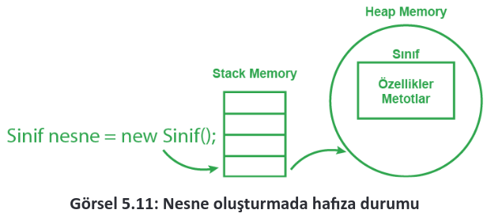

<h1 style="color:#ff5432">5.2. SINIF VE NESNE KAVRAMLARI</h1>

- <a href="#5.2.1.">5.2.1. Sınıf (Class)</a> 
- <a href="#5.2.2.">5.2.2. Nesne (Object) Oluşturma</a> 
- <a href="#5.2.3.">5.2.3. Sınıf Yapısı </a> 
- <a href="#5.2.4.">5.2.4. Erişim Belirleyiciler (Erişim Düzeyleri)</a> 
- <a href="#5.2.5.">5.2.5. Kurucu veya Yapıcı Metotlar (Constructors)</a> 


Java programlama dili, daha güçlü bir yapı sağlamak amacıyla prosedürel ve nesne yönelimlikavramlarını bir arada sunar. **Prosedürel programlama**, geleneksel programlama yöntemidir veprogramın yukarıdan aşağıya doğru sırasıyla komutları çalıştırması anlamına gelir. Program, prosedürel programlamada bir bütün hâlinde yazılır. Program büyüdükçe bu bütünlüğü sağlamakzorlaşır. Program yazımı bittikten sonra program üzerinde yapılacak bir değişiklik, programın bütünlüğüne zarar verebilir. Uygulamanın yapacağı işlemler karmaşıklaştıkça geleneksel programlama yöntemi uygulama geliştirmeyi zorlaştırır.

Program yazma işleminin ilk adımı, biri problemi analiz etmektir. Karmaşık problemleri gelenekselyöntemlerle analiz etmek zordur. Geleneksel yöntemin yerine problemi günlük hayattaki nesnelere benzeten nesne tabanlı programlama önerilir. **Nesne Tabanlı Programlama (Object Oriented Programming)**, problemi bütün olarak değil de parçalar hâlinde ele alır. Problemin her birparçası nesne olarak ifade edilir. Birçok nesne birbiriyle etkileşime geçerek bütünü oluşturur. Budurum, problemi daha iyi analiz etmeye ve daha hızlı çözüm üretmeye yarar. Örneğin bir havuzusu ile doldurma probleminde havuzu doldurmak için bir musluk ve havuzun dibinde suyu dışarısızdıran bir çatlak olduğu varsayılırsa havuzun büyüklüğüne, musluktan ve çatlaktan akan suyunhızlarına göre bir matematik formülü ile bu havuzun kaç saate dolacağı bulunabilir (Görsel 5.4).

<div style="display:block;text-align:center;">

</div>


```java
int musluk1=4;
int catlak1=5;
float birimDolum = 1/musluk1-1/catlak1;
float dolumSaati = 1/birimDolum;
```

Problem daha karmaşık hâle getirildiğinde, musluk ve çatlak sayıları artırıldığında elde edilecek formül de karmaşıklaşır (Görsel 5.5).
<div style="display:block;text-align:center">

</div>

```java
int musluk1=4;
int catlak1=5;
int musluk2=3;
int catlak2=6;
float birimDolum = 1/musluk1+1/musluk2-1/catlak1-1/catlak2;
float dolumSaati = 1/birimDolum;
```

<div style="clear:both;"></div>

Musluklardan birinin zaman ayarlı olduğu, çatlaklardan birinin havuzun zemininde değil de yan duvarda olduğu varsayılırsa problem çözümü için izlenecek yöntem de değişir. Havuzdaki ikinci çatlaktan hemen su sızmaz. Havuzun su seviyesi bu çatlağa varıncaya kadar çatlağın havuza bir etkisi olmaz. Problem karmaşıklaştıkça problemin çözümü daha da zorlaşır (Görsel 5.6).
<div style="display:block;text-align:center">

</div>


Problem çözümünde musluk ve çatlak birer nesne olarak düşünüldüğünde havuzu modellemek basitleşir. Havuz, musluk ve çatlak için birer sınıf modellemek, gerçek hayata benzetildiği için işlemleri kolaylaştırır. Problemin çözümünde nesne kullanımı, geleneksel programlamaya göre daha fazla kod yazılmasına karşın programın yönetilebilirliğini artırır. Problemin karmaşıklığı arttıkça sadece etkilenecek sınıflar üzerinde düzenlemeler yapılması, programın yönetilmesini kolaylaştırır (Görsel 5.7).

<div style="display:block;text-align:center">

</div>

<h2 id="5.2.1." style="color:#ff5432">5.2.1. Sınıf (Class)</h2>

Sınıf, nesneleri oluşturmak için kullanılan şablonlar veya prototiplerdir. Bu, bir evi yapmak için kullanılan ev planına benzetilebilir. Bu plana bakılarak evler inşa edilir. Üretilen evlerin genel görünüşü aynı olmakla birlikte renkleri farklılık gösterebilir (Görsel 5.8).
<div style="display:block;text-align:center">


</div>


Sınıflar, kurabiye kalıpları gibi de düşünülebilir. Kurabiye kalıbından çıkan şekiller ana hatlarıyla birbirlerine benzer fakat hamur içeriği ve kullanılan süsleme gibi özellikleri farklılık gösterebilir. Kurabiye kalıbı, sınıfı temsil ederken kalıptan türetilen kurabiyeler ise nesneleri ifade eder (Görsel 5.9).
<div style="display:block;text-align:center">


</div>


<h2 id="5.2.2." style="color:#ff5432">5.2.2. Nesne (Object) Oluşturma</h2>
Programlamada sadece sınıf oluşturmak yeterli değildir. Sınıf tek başına kullanılamaz. Sınıflar prototip olduğu için sınıflar üzerinde işlem yapmak mümkün değildir. Programda sınıflardan üretilecek nesnelere ihtiyaç duyulur. Nesneler birer varlık olarak ifade edildiği için nesneler üzerinde işlem yapmak mümkündür. Nesneler tanımlanırken ilkel değişkenler gibi tanımlama yapılır. Bu tanımlama sonucu yeni bir nesne oluşmaz. Nesne adı için hafızada yer ayrılır fakat bu hafıza yerinde herhangi bir değer bulunmaz (Görsel 5.10).
<div style="display:block;text-align:center">


</div>


Nesne tanımlama:

SinifAdi nesneAdi;

Yeni bir nesne tanımlamak için **"new"** anahtar kelimesi kullanılır. New anahtar kelimesi ile sınıftan bir nesne türetilir (Görsel 5.11).

<div style='display:block;text-align:center'>


</div>

Nesne oluşturma:

SinifAdi nesneAdi = new SinifAdi();

<h2 id="5.2.3." style="color:#ff5432">5.2.3. Sınıf Yapısı</h2>

Sınıflar dört bölümden oluşur (Görsel 5.12).

- **Erişim Belirleyici:** Sınıfa nereden ulaşılabileceğini ifade eder.

- **Class Anahtar Kelimesi:** Oluşturulan kodun sınıf olduğunu ifade etmek için class anahtar kelimesi kullanılır.

- **Sınıf Adı:** Sınıfa verilen isimdir. İsimlendirme standartlarına göre Pascal Case şeklinde isimlendirme yapılır.

- **Sınıf Gövdesi:** Sınıfın özellik ve metotlarının bulunduğu kısımdır.
<div style="display:block;text-align:center">


</div>


**5. UYGULAMA**: İşlem adımlarına göre sınıf oluşturarak bir elektrikli cihazın aylık tüketimini bulan bir uygulama tasarlayınız.

**1. Adım**: Mobil uygulama geliştirme programında Empty Activity olacak şekilde bir proje oluşturunuz.\
**2. Adım**: Görsel 5.13’te verilen uygulama ekranını oluşturan şu kodu activity_main.xml içine yazınız:
<div style="display:block;text-align:center">

,
</div>


```xml
<LinearLayout
    android:layout_width="wrap_content"
    android:layout_height="wrap_content"
    android:orientation="vertical"
    app:layout_constraintBottom_toBottomOf="parent"
    app:layout_constraintEnd_toEndOf="parent"
    app:layout_constraintStart_toStartOf="parent"
    app:layout_constraintTop_toTopOf="parent" >
    <EditText
        android:id="@+id/editTextCihazAdi"
        android:layout_width="wrap_content"
        android:layout_height="wrap_content"
        android:hint="Cihaz Adı"
        android:inputType="textPersonName"
        android:minHeight="48dp" />
    <EditText
        android:id="@+id/editTextKw"
        android:layout_width="wrap_content"
        android:layout_height="wrap_content"
        android:hint="Cihaz Gücü (KW)"
        android:inputType="number"
        android:minHeight="48dp" />
    <EditText
        android:id="@+id/editTextGunlukKullanimSaat"
        android:layout_width="wrap_content"
        android:layout_height="wrap_content"
        android:hint="Günlük kullanılan saat"
        android:inputType="number"
        android:minHeight="48dp" />
    <Button
        android:id="@+id/buttonHesapla"
        android:layout_width="wrap_content"
        android:layout_height="wrap_content"
        android:text="Hesapla"/>
    <TextView
        android:id="@+id/textViewSonuc"
        android:layout_width="wrap_content"
        android:layout_height="wrap_content"
        android:text=" "/>
</LinearLayout>
```

**3. Adım:** File>New>Java Class menü komutu ile "ElektrikliCihaz" adıyla yeni bir sınıf oluşturunuz (Görsel 5.14).
<div style="display:block;text-align:center">


</div>


**4. Adım:** ElektrikliCihaz.java dosyasına şu kodu yazınız:

```java
package com.example.elektriktuketimi;
public class ElektrikliCihaz {
    public String cihazAdi;
    public int cihazKW;
    public int gunlukSaatKullanim;
    public int aylikTuketim() {
        int aylikKullanim;
        aylikKullanim = cihazKW * gunlukSaatKullanim * 30;
        return aylikKullanim;
    }
}
```

**5. Adım:** MainActivity.java dosyasına şu kodu yazınız:

```java
package com.example.elektriktuketimi;
import androidx.appcompat.app.AppCompatActivity;
import android.os.Bundle;
import android.view.View;
import android.widget.Button;
import android.widget.EditText;
import android.widget.TextView;
public class MainActivity extends AppCompatActivity {
    @Override
    protected void onCreate(Bundle savedInstanceState) {
        super.onCreate(savedInstanceState);
        setContentView(R.layout.activity_main);
        Button btnHesapla = findViewById(R.id.buttonHesapla);
        btnHesapla.setOnClickListener(new View.OnClickListener() {
            @Override
            public void onClick(View view) {
                EditText editTextCihazAdi = findViewById(R.id.editTextCihazAdi);
                EditText editTextKW = findViewById(R.id.editTextKw);
                EditText editTextGunlukKullanimSaat = findViewById(R.id.edit,TextGunlukKullanimSaat);
                TextView textViewSonuc = findViewById(R.id.textViewSonuc);
                String cihazAdi = editTextCihazAdi.getText().toString();
                int kw = Integer.parseInt(editTextKW.getText().toString());
                int saat = Integer.parseInt(editTextGunlukKullanimSaat.getText().toString());
                ElektrikliCihaz cihaz1 = new ElektrikliCihaz();
                cihaz1.cihazAdi = cihazAdi;
                cihaz1.cihazKW = kw;
                cihaz1.gunlukSaatKullanim = saat;
                int sonuc = cihaz1.aylikTuketim();
                textViewSonuc.setText(Integer.toString(sonuc));
            }
        });
    }
}
```
**6. Adım:** Run düğmesine tıklayarak uygulamayı çalıştırınız.

**7. Adım:** Değerleri girerek HESAPLA düğmesine tıklayınız.

>**SIRA SİZDE:**
>
>"ElektrikliCihaz" sınıfını düzenleyerek elektrik tüketim bedelini hesaplayan uygulamayı oluşturunuz. Elektrik tüketim bedeli 1 kWh için 1,37 TL’dir.
>
>**DEĞERLENDİRME:** 
>
>Çalışmanız aşağıda yer alan kontrol listesi kullanılarak değerlendirilecektir.Çalışmanızı yaparken değerlendirme ölçütlerini dikkate alınız.
>
><div style="text-align:center;"><b>KONTROL LİSTESİ</b></div>
>
>|  DEĞERLENDİRME ÖLÇÜTLERİ                                              | EVET | HAYIR |
>| :-------------------------------------------------------------------- | ---- | ----- |
>| 1. New Project komutunu tıkladı.                                     |
>| 2. Empty Activity proje türünü seçti.                                |
>| 3. Uygulama adını belirledi.                                         |
>| 4. Uygulama tasarım ekranına üç EditText ekledi.                     |
>| 5. Uygulama tasarım ekranına bir Button ekledi.                      |
>| 6. Uygulama tasarım ekranına bir TextView ekledi.                    |
>| 7. "ElektrikliCihaz" adında yeni bir sınıf oluşturdu.                |
>| 8. "ElektrikliCihaz" sınıfının özelliklerini belirledi.              |
>| 9. "ElektrikliCihaz" sınıfına "tuketimBedeliHesapla" metodunu yazdı. |
>| 10. Uygulama kodunda findViewById yöntemiyle nesneleri tanımladı.    |
>| 11. Button nesnesine tıklanma olayını ekledi.                        |
>| 12. Nesnelerdeki yazıları değişkenlere atadı.                        |
>| 13. "ElektrikliCihaz" sınıfından cihaz1 adlı yeni bir nesne türetti. |
>| 14. cihaz1 nesnesinin özelliklerine değer atadı.                     |
>| 15. cihaz1 nesnesinin tuketimBedeliHesapla metodunu çağırdı.         |
>| 16. Tüketim bedelini TextView içinde gösterdi.                       |
>| 17. Run düğmesine tıklayarak uygulamayı çalıştırdı.                  |

<h2 id="5.2.4." style="color:#ff5432">5.2.4. Erişim Belirleyiciler (Erişim Düzeyleri)</h2>

Java programlama dilinde erişim belirleyiciler; bir sınıfın, özelliğin veya metodun erişilebilirliğini veya kapsamını belirtir. Dört tür Java erişim belirleyici vardır (Tablo 5.1).

1. **Private (Özel)**: Erişim düzeyi sınıf düzeyindedir. Sınıf dışından erişilemez.
2. **Default (Varsayılan)**: Varsayılan erişim düzeyi paketle sınırlıdır. Paket dışından erişilemez. Herhangi bir erişim belirleyici kullanılmazsa bu varsayılan erişim düzeyidir.
3. **Protected (Korumalı)**: Bir alt sınıf aracılığıyla hem paket içinden hem de paket dışından erişilir.
4. **Public (Genel)**: Her yerden ulaşılabilen erişim belirleyicisidir.

<div style="text-align:center;"><b>Tablo 5.1: Erişim Belirleyiciler</b></div>

| Erişim Belirleyici | Sınıf İçinde                        | Paket İçinde                         | Alt Sınıfla Aynı Paket İçinde        | Alt Sınıfla Aynı  Paket Dışında      | Genel                                |
| ------------------ | ----------------------------------- | ------------------------------------ | ------------------------------------ | ------------------------------------ | ------------------------------------ |
| Public             | <span style="color:#0f0">Evet<span> | <span style="color:#0f0">Evet<span>  | <span style="color:#0f0">Evet<span>  | <span style="color:#0f0">Evet<span>  | <span style="color:#0f0">Evet<span>  |
| Protected          | <span style="color:#0f0">Evet<span> | <span style="color:#0f0">Evet<span>  | <span style="color:#0f0">Evet<span>  | <span style="color:#0f0">Evet<span>  | <span style="color:#f00">Hayır<span> |
| Default            | <span style="color:#0f0">Evet<span> | <span style="color:#0f0">Evet<span>  | <span style="color:#0f0">Evet<span>  | <span style="color:#f00">Hayır<span> | <span style="color:#f00">Hayır<span> |
| Private            | <span style="color:#0f0">Evet<span> | <span style="color:#f00">Hayır<span> | <span style="color:#f00">Hayır<span> | <span style="color:#f00">Hayır<span> | <span style="color:#f00">Hayır<span> |

<h3 style="color:#ff5432">5.2.4.1. Private (Özel) Erişim Belirleyici</h3>

Özel erişim belirleyicisine yalnızca sınıfın üyeleri ulaşabilir.

<span style="font-weight:bold; padding-top:1px; padding-bottom:1px; padding-left:8px; padding-right:8px; background-color:#ffdcce;">ÖRNEK</span>\
A sınıfı içinde private olarak değer özelliği ve değiştir metodu tanımlanmıştır. Aynı sınıf içinde değiştir metodu private özelliğe ulaşılabilir. B sınıfı içinden private özellik veya metoda ulaşılmak istendiğinde uygulama hata verir.

<table>
    <tbody>
        <tr>
            <td>
                <pre>
                    <code class="language-java">package paket1;
public class A {
    int deger = 10;
    void degistir(){
        deger = 15;
    }
}
                    </code>
                </pre>
            </td>
            <td>
                <pre>
                    <code class="language-java">package paket2;
import paket1.*;
public class B {
    A a = new A();
    a.deger = 12; //Hata verir.
    a.degistir(); //Hata verir.
}
                    </code>
                </pre>
            </td>
        </tr>
    </tbody>
</table>

<h3 style="color:#ff5432">5.2.4.2. Default (Genel) Erişim Belirleyici</h3>

Herhangi bir erişim belirleyici kullanılmadığında default belirleyici tanımlanır.

<span style="font-weight:bold; padding-top:1px; padding-bottom:1px; padding-left:8px; padding-right:8px; background-color:#ffdcce;">ÖRNEK</span>\

Paket1 içindeki değer özelliği ve değiştir metodu default olarak tanımlanmıştır. Paket2 içinden bu
özellik veya metoda ulaşmak mümkün değildir. Bu özellik veya metoda erişilmeye çalışıldığında
uygulama hata verir.

<table>
    <tbody>
        <tr>
            <td>
                <pre>
                    <code class="language-java">package paket1;
    public class A{
    int deger = 10;
    void degistir(){
        deger=15;
    }
}
                    </code>
                </pre>
            </td>
            <td>
                <pre>
                    <code class="language-java">package paket2;
import paket1.*;
public class B{
    A a = new A();
    a.deger = 12; //Hata verir.
    a.degistir(); //Hata verir.
}
                    </code>
                </pre>
            </td>
        </tr>
    </tbody>
</table>

<h3 style="color:#ff5432">5.2.4.3. Protected (Korumalı) Erişim Belirleyici</h3>

Paket dışından özellik ve metotlara erişim bir alt sınıf aracılığıyla mümkündür. Alt sınıf tanımlamadan özellik ve metotlara paket dışından erişilemez.

<span style="font-weight:bold; padding-top:1px; padding-bottom:1px; padding-left:8px; padding-right:8px; background-color:#ffdcce;">ÖRNEK</span>\
Paket2 içindeki B sınıfı, A sınıfının alt sınıfıdır. Extends anahtar kelimesiyle B sınıfına A sınıfının alt sınıfı olduğu bilgisi verilmiştir. B sınıfı farklı paket içinde olmasına rağmen protected olan özellik veya metoda erişebilmiştir. Oysa C sınıfı protected özellik veya metoda erişmeye çalışınca uygulama hata verir.

<table>
    <tbody>
        <tr>
            <td>
                <pre>
                    <code class="language-java">package paket1;
public class A{
    protected int deger = 10;
    protected void degistir(){
        deger=15;
    }
}
                    </code>
                </pre>
            </td>
            <td>
                <pre>
                    <code class="language-java">package paket2;
import paket1.*;
public class B extends A{
    A a = new A();
    a.deger = 12;
    a.degistir();
}<br>
public class C{
    A a = new A();
    a.deger = 12; //Hata verir.
    a.degistir(); //Hata verir.
}
                    </code>
                </pre>
            </td>
        </tr>
    </tbody>
</table>

<h3 style="color:#ff5432">5.2.4.4. Public (Genel) Erişim Belirleyici</h3>

Public erişim belirleyicisine her yerden ulaşmak mümkündür. Herhangi bir kısıtlaması yoktur.

<span style="font-weight:bold; padding-top:1px; padding-bottom:1px; padding-left:8px; padding-right:8px; background-color:#ffdcce;">ÖRNEK</span>\
Paket2 içindeki B sınıfı, paket1 içindeki A sınıfının public özelliklerine veya metotlarına erişebilir.

<table>
    <tbody>
        <tr>
            <td>
                <pre>
                    <code class="language-java">package paket1;
public class A{
    public int deger = 10;
    public void degistir(){
        deger=15;
    }
}                 </code>
                </pre>
            </td>
            <td>
                <pre>
                    <code class="language-java">package paket2;
import paket1.*;
public class B {
    A a = new A();
    a.deger = 12;
    a.degistir();
}
                    </code>
                </pre>
            </td>
        </tr>
    </tbody>
</table>

<h2 id="5.2.5." style="color:#ff5432">5.2.5. Kurucu veya Yapıcı Metotlar (Constructors)</h2>

Yeni bir nesne oluşturulduğunda otomatik olarak çalıştırılan metotlardır. Genellikle nesne oluşturulduğunda başlangıç ayarlarının yapılması için kullanılır. Kurucu metotlar, ait olduğu sınıf ile aynı isimle tanımlanır. Bu metotların geri dönüş tipleri yoktur.

```java
public class SinifA {
    public SinifA() {
    }
}
```
Mobil uygulama geliştirme programında sınıfa ait dosya açıkken Alt+Ins tuşlarına basılarak yapıcı metot eklenebilir (Görsel 5.15).
<div style="display:block;text-align:center">


</div>


Metotları aşırı yükleme ile birden fazla kurucu metot tanımlanabilir.

<table>
    <tbody>
        <tr>
            <td>
                <pre>
                    <code class="language-java">public class SinifA {
private int sayi1;
private int sayi2;
    public SinifA() {
        sayi1=0;
        sayi2=0;
    }
    public SinifA (int sayi1) {
        this.sayi1 = sayi1;
        this.sayi2 = sayi1;
    }
    public SinifA (int sayi1, int sayi2) {
        this.sayi1 = sayi1;
        this.sayi2 = sayi2;
    }
}          </code>
                </pre>
            </td>
            <td>
                <pre>
                    <code class="language-java">SinifA a1 = new SinifA();
// a1 nesnesi için
// sayi1=0
// sayi2=0<br>
SinifA a2 = new SinifA(2);
// a2 nesnesi için
// sayi1=2
// sayi2=2<br>
SinifA a3 = new SinifA(3,4);
// a1 nesnesi için
// sayi1=3
// sayi2=4
                    </code>
                </pre>
            </td>
        </tr>
    </tbody>
</table>

**6. UYGULAMA:** İşlem adımlarına göre dörtgen sınıfı oluşturarak yapıcı metotlar ile
kare ve dikdörtgenin alanını bulan bir uygulama tasarlayınız.

**1. Adım:** Mobil uygulama geliştirme programında Empty Activity olacak şekilde bir proje oluşturunuz.\
**2. Adım:** Uygulama ekranında iki EditText, bir Button ve bir TextView oluşturan şu kodu activity_main.xml içine yazınız:

```xml
<LinearLayout
    android:layout_width="wrap_content"
    android:layout_height="wrap_content"
    android:orientation="vertical"
    app:layout_constraintBottom_toBottomOf="parent"
    app:layout_constraintEnd_toEndOf="parent"
    app:layout_constraintStart_toStartOf="parent"
    app:layout_constraintTop_toTopOf="parent">
    <EditText
        android:id="@+id/editTextKisaKenar"
        android:layout_width="wrap_content"
        android:layout_height="wrap_content"
        android:inputType="number"
        android:hint="Kısa Kenar"/>
    <EditText
        android:id="@+id/editTextUzunKenar"
        android:layout_width="wrap_content"
        android:layout_height="wrap_content"
        android:inputType="number"
        android:hint="Uzun Kenar"/>
    <Button
        android:id="@+id/buttonKareAlani"
        android:layout_width="wrap_content"
        android:layout_height="wrap_content"
        android:text="Kare Alanı" />
    <Button
        android:id="@+id/buttonDikdortgenAlani"
        android:layout_width="wrap_content"
        android:layout_height="wrap_content"
        android:text="Dikdörtgen Alanı"/>
    <TextView
        android:id="@+id/textViewAlan"
        android:layout_width="wrap_content"
        android:layout_height="wrap_content"
        android:text="Alan"/>
</LinearLayout>
```
**3. Adım:** "Dortgen" adıyla yeni bir sınıf oluşturunuz.\
**4. Adım:** Dortgen.java dosyasına şu kodu yazınız:

```java
package com.example.kurucumetot;
public class Dortgen {
    public Integer kisaKenar;
    public Integer uzunKenar;
    public Integer alanBul(){
        Integer alan;
        alan = kisaKenar * uzunKenar;
        return alan;
    }
}
```

**5. Adım**: Dortgen.java dosyasında Alt+Ins tuşlarına basarak kisaKenar parametreli bir kurucu me-
tot oluşturunuz (Görsel 5.16).
<div style="display:block;text-align:center">


</div>


**6. Adım**: Dortgen.java dosyasında Alt+Ins tuşlarına basarak kisaKenar ve uzunKenar parametreli
bir kurucu metot oluşturunuz (Görsel 5.17).
<div style="display:block;text-align:center">


</div>


**7. Adım:** MainActivity.java dosyasına şu kodu yazınız:

```java
package com.example.kurucumetot;
import androidx.appcompat.app.AppCompatActivity;
import android.os.Bundle;
import android.view.View;
import android.widget.Button;
import android.widget.EditText;
import android.widget.TextView;
public class MainActivity extends AppCompatActivity {
    @Override
    protected void onCreate(Bundle savedInstanceState) {
        super.onCreate(savedInstanceState);
        setContentView(R.layout.activity_main);
        EditText editTextKisaKenar = findViewById(R.id.editTextKisaKenar);
        EditText editTextUzunKenar = findViewById(R.id.editTextUzunKenar);
        Button buttonKareAlani = findViewById(R.id.buttonKareAlani);
        Button buttonDikdortgenAlani = findViewById(R.id.buttonDikdortgenAlani);
        TextView textViewAlan = findViewById(R.id.textViewAlan);

        buttonKareAlani.setOnClickListener(new View.OnClickListener() {
            @Override
            public void onClick(View view) {
                Integer kenar;
                Integer alan;
                kenar = Integer.parseInt(editTextKisaKenar.getText().toString());
                Dortgen kare = new Dortgen(kenar);
                alan = kare.alanBul();
                textViewAlan.setText(alan.toString());
            }
        });

        buttonDikdortgenAlani.setOnClickListener(new View.OnClickListener() {
            @Override
            public void onClick(View view) {
                Integer kisaKenar;
                Integer uzunKenar;
                Integer alan;
                kisaKenar = Integer.parseInt(editTextKisaKenar.getText().toString());
                uzunKenar = Integer.parseInt(editTextUzunKenar.getText().toString());
                Dortgen dikdortgen = new Dortgen(kisaKenar,uzunKenar);
                textViewAlan.setText(dikdortgen.toString());
            }
        });
    }
}
```

**8. Adım:** Run düğmesine tıklayarak uygulamayı çalıştırınız.

>**SIRA SİZDE:**
>
>Üçgen sınıfında eşkenar, ikizkenar ve çeşitkenar üçgenler için kurucu metotları oluşturunuz. Üçgenin çevresini hesaplayan bir "cevreBul" metodu yazınız.
>
>**DEĞERLENDİRME:** 
>
>Çalışmanız aşağıda yer alan kontrol listesi kullanılarak değerlendirilecektir. Çalışmanızı yaparken değerlendirme ölçütlerini dikkate alınız.
>
><div style="text-align:center;"><b>KONTROL LİSTESİ</b></div>
>
>| DEĞERLENDİRME ÖLÇÜTLERİ                                                   | EVET | HAYIR |
>| :------------------------------------------------------------------------- | ---- | ----- |
>| 1. New Project komutunu tıkladı.                                          |
>| 2. Empty Activity proje türünü seçti.                                     |
>| 3. Uygulama adını belirledi.                                              |
>| 4. Uygulama tasarım ekranına üç EditText ekledi.                          |
>| 5. Uygulama tasarım ekranına üç Button ekledi.                            |
>| 6. Uygulama tasarım ekranına bir TextView ekledi.                         |
>| 7. "Ucgen" adında yeni bir sınıf oluşturdu.                               |
>| 8. "Ucgen" sınıfına ait kenar1, kenar2 ve kenar3 özelliklerini belirledi. |
>| 9. "Ucgen" sınıfına "cevreBul" adında metot oluşturdu.                    |
>| 10. "Ucgen" sınıfına tek parametreli kurucu metot oluşturdu.              |
>| 11. "Ucgen" sınıfına iki parametreli kurucu metot oluşturdu.              |
>| 12. "Ucgen" sınıfına üç parametreli kurucu metot oluşturdu.               |
>| 13. Uygulama kodunda findViewById yöntemiyle nesneleri tanımladı.         |
>| 14. Düğmelere tıklanma olaylarını ekledi.                                 |
>| 15. "Ucgen" sınıfından eskenarUcgen adlı yeni bir nesne türetti.          |
>| 16. "Ucgen" sınıfından ikizkenarUcgen adlı yeni bir nesne türetti.        |
>| 17. "Ucgen" sınıfından cesitkenarUcgen adlı yeni bir nesne türetti.       |
>| 18. Çevre bilgisini TextView içinde gösterdi.                             |
>| 19. Run düğmesine tıklayarak uygulamayı çalıştırdı.                       |