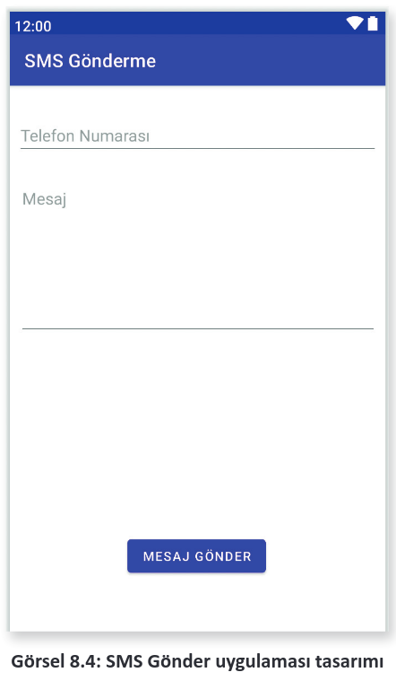
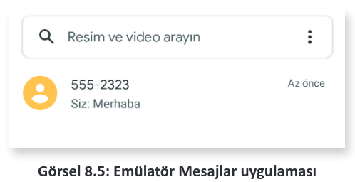
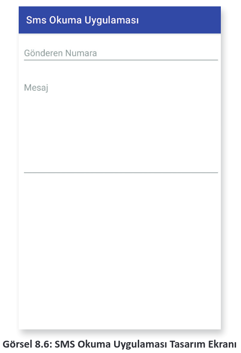
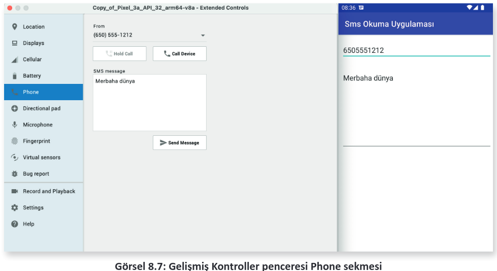
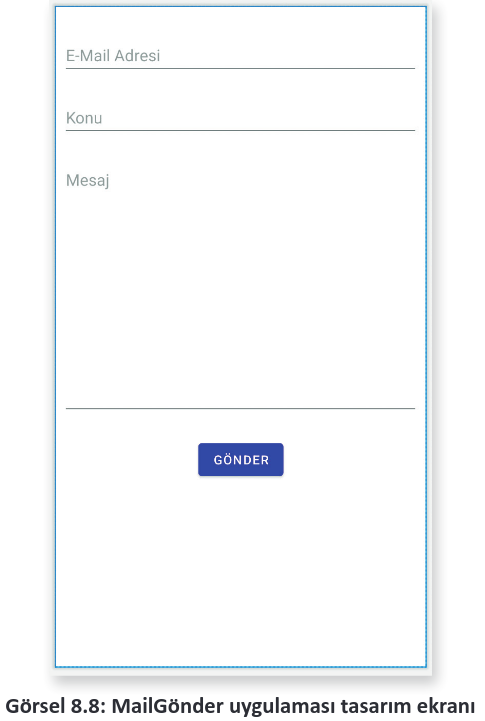
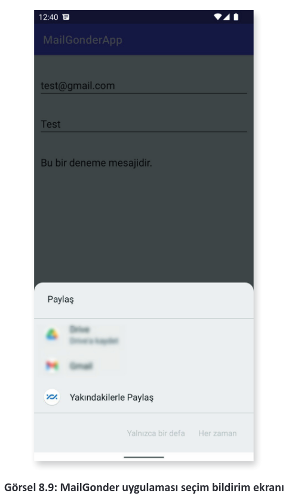

# 8.2. SMS VE İLETİ GÖNDERMEK
<a href="#8.2.1.">8.2.1. SMS Okumak</a>\
<a href="#8.2.2.">8.2.2. İleti Göndermek </a>

SMS gönderme işlemleri SmsManager sınıfı ile yapılır. SMS gönderilirken tehlikeli izinler için kullanıcıdan mutlaka izin alınmalıdır. SmsManager kullanılarak şu şekilde SMS gönderilir:

```java
SmsManager sm = SmsManager.getDefault();
sm.sendTextMessage(<NUMARA>, null, <MESAJ>.toString(), null, null);
```

<span style="font-weight:bold;color:#f00;">UYARI:</span> Android işletim sisteminde varsayılan olarak SMS gönderme işlemleri SmsManager ile yapılır. Ancak bazı cihaz üreticileri müşterilerinin mağdur olmaması için SmsManager ile SMS gönderilmesini engellemiştir. SMS ile ilgili kodlar emülatörde çalışır ancak gerçek bir cihazda çalışmayabilir.

**3. UYGULAMA:** İşlem adımlarına göre yeni bir uygulama oluşturarak uygulama ekranına iki adet editText nesnesi ve bir adet Button nesnesi yerleştiriniz. Button nesnesine tıkladığınızda istediğiniz numaraya SMS gönderen uygulamayı yazınız.

**1. Adım:** Empty Activity seçerek yeni bir proje oluşturunuz. Projenin adını "SmsGonder" veriniz.

**2. Adım:** activity_main.xml dosyasını açarak Görsel 8.4’teki gibi tasarlayınız. Numara yazılan EditTexte editTextNumara, mesaj yazılan EditTexte editTextMesaj adını veriniz.

**3. Adım:** Button nesnesinin id bilgisine btnGonder adını veriniz.

**4. Adım:** gradle.build dosyasını açarak viewBinding özelliğini aktif ediniz.

**5. Adım:** Manifest dosyasını açarak şu şekilde SMS izinleri alınız:

```xml
<uses-permission android:name="android.permission.SEND_SMS"/>
<uses-permission android:name="android.permission.RECEIVE_SMS"/>
<uses-permission android:name="android.permission.READ_SMS"/>
```

**6. Adım:** MainActivity.java dosyasını açarak viewBinding nesnesi oluşturunuz. Gerekli ayarlamaları yapınız.

**7. Adım:** SMS göndermek için kullanıcıdan şu şekilde izin alınız:

```java
ActivityCompat.requestPermissions(this,new String[]{Manifest.permission.SEND_SMS,Manifest.permission.READ_SMS},PackageManager.PERMISSION_GRANTED);
```

<div style='display:block;text-align:center'>


</div>

**8. Adım:** SMS göndermek için btnGonder butonuna şu şekilde bir onClickListener oluşturunuz:

```java
binding.btnGonder.setOnClickListener(new View.OnClickListener() {
    @Override
    public void onClick(View view) {
        if(ContextCompat.checkSelfPermission(MainActivity.this,Manifest.permission.SEND_SMS)==PackageManager.PERMISSION_GRANTED) {
            SmsManager sm = SmsManager.getDefault();
            sm.sendTextMessage(binding.editTextNumara.getText().toString(), null, binding.editTextMesaj.getText().toString(), null, null);
        }
        else{
            Toast.makeText(MainActivity.this, «İzin gerekli», Toast.LENGTH_LONG).show();
        }
    }
});
```

**9. Adım:** Uygulamanızı çalıştırınız. Emülatörden herhangi bir numara ve mesaj yazıp MESAJ GÖNDER butonuna basınız.

**10. Adım:** MESAJ GÖNDER butonuna bastıktan sonra ekranda herhangi bir bildirim görünmez. Uygulamayı kapatıp mesajlar uygulamasını açınız. Mesajlar uygulamasında Görsel 8.5’teki gibi mesajın gönderildiğini kontrol ediniz.

<div style='display:block;text-align:center'>


</div>

<h2 id="8.2.1.">8.2.1. SMS Okumak</h2>

SMS okuma işlemi, yayın alıcılar tam olarak kullanılmadan yapılamaz. Cihaza SMS gönderildiği zaman işletim sistemi SMS geldiğine dair bir SMS_RECEIVED Broadcast mesajı yayınlar. Uygulamada yapılması gereken husus, SMS_RECEIVED mesajını dinlemek ve mesaj geldiğinde Intent ile SMS’leri okumaktır. Broadcast sınıfı ile SMS okuyup bir View ile göstermek çok kolay değildir. Broadcast sınıfında MainActivity dosyasında bulunan nesnelere doğrudan ulaşılamaz. SMS mesajlarını okuyup MainActivity dosyasında göstermek için Broadcast sınıfı MainActivity içinde şu şekilde tanımlanmalıdır:

```java
public class MainActivity extends AppCompatActivity{
        .
        .
    public static class SmsAlici extends BroadcastReceiver {
        .
        .
    }
}
```

MainActivity dosyasına Broadcast sınıfı içinden ulaşılmak istendiğinde hata alınır. MainActivity dosyasının bir static nesne ile Broadcast sınıfına verilmesi gerekir. MainActivity static olarak şu şekilde çağrılır:

```java
static MainActivity mainActivity;
public static MainActivity getInstance(){
    return mainActivity;
}
```

MainActivity Broadcast sınıfı içinde şu şekilde çağrılır:

```java
MainActivity.getInstance()
```

Sisteme gelen SMS mesajları Intent nesnesine eklenir. Intent nesnesinde veriler bir Bundle nesnesine yerleştirilerek gelir. Bundle, "pdus" anahtarı ile bir pdus dizisi verir. pdus verileri SmsMessage nesnelerine dönüştürülür. SmsMessage nesnesinden istenen veriler alınarak gerekli işlemler yapılır.

**4. UYGULAMA:** İşlem adımlarına göre yeni bir uygulama oluşturarak iki adet editText nesnesi yerleştiriniz. SMS mesajlarını yakalayan bir sınıf yazarak gelen mesajları editText nesnelerinde gösteren uygulamayı yazınız.

**1. Adım:** Empty Activity seçerek yeni bir proje oluşturunuz. Projenin adını "SmsOkuma" veriniz

**2. Adım:** activity_main.xml dosyasını açarak Görsel 8.6’daki gibi tasarlayınız. EditText nesnesinin id bilgisine editTextGelenNumara adını veriniz. Mesaj EditText nesnesinin id bilgisini editTextSmsMesaj olarak veriniz.

<div style='display:block;text-align:center'>


</div>

**3. Adım:** activity_main.xml dosyasında numara yazılan EditTexte editTextNumara, mesaj yazılan EditTexte editTextMesaj adını veriniz.

**4. Adım:** gradle.build dosyasını açarak viewBinding özelliğini aktif ediniz.

**5. Adım:** Manifest dosyasını açarak gerekli izinleri şu şekilde isteyiniz:

```xml
<uses-permission android:name="android.permission.RECEIVE_SMS"/>
<uses-permission android:name="android.permission.READ_SMS"/>
```

**6. Adım:** MainActivity.java dosyasını açarak viewBinding nesnesi oluşturunuz. Gerekli ayarlamaları yapınız.

**7. Adım:** SMS göndermek için kullanıcıdan şu şekilde izin alınız:

```java
ActivityCompat.requestPermissions(this,new String[]{ Manifest.permission.READ_SMS,Manifest.permission.ECEIVE_SMS},PackageManager.PERMISSION_GRANTED);
```

**8. Adım:** static MainActivity nesnesi tanımlayınız. Tanımladığınız nesneyi gönderen getInstance isimli bir metot oluşturunuz.

**9. Adım:** MainActivity sınıfı içinde bir tane BroadcastReceiver sınıfından türemiş bir sınıf oluşturup sınıfın adını "SmsAlici" veriniz.

**10.  Adım:** Manifest dosyasını açınız ve Broadcast sınıfını şu şekilde kaydediniz:

```xml
<receiver android:name=".MainActivity$SmsAlici" android:exported="true" tools:ignore="Instantiatable">
    <intent-filter>
        <action android:name="android.provider.Telephony.SMS_RECEIVED"/>
    </intent-filter>
</receiver>
```

**11. Adım:** SmsAlici sınıfının onReceive metodunu açıp şu şekilde yazınız:

```java
public void onReceive(Context context, Intent intent) {
    if(intent.getAction().equals("android.provider.Telephony.SMS_RECEIVED")){
        Bundle bundle = intent.getExtras();
        SmsMessage[] mesajlar;
        String gonderen_numara;
        String mesaj;
        if(bundle != null){
            Object[] pdus = (Object[])bundle.get("pdus");
            mesajlar = new SmsMessage[pdus.length];
            for(int i = 0;i<pdus.length;i++){
                mesajlar[i] = SmsMessage.createFromPdu ((byte[])pdus[i],bundle.getString("format"));
                gonderen_numara = mesajlar[i].getDisplayOriginatingAddress();
                mesaj = mesajlar[i].getMessageBody();
                MainActivity.getInstance().
                binding.editTextSmsMesaj.setText(mesaj);
                MainActivity.getInstance().
                binding.editTextGelenNumara.setText(gonderen_numara);
            }
        }
    }
}
```

**12. Adım:** Uygulamayı çalıştırınız. Emülatörden Gelişmiş Kontroller penceresini açınız.

**13. Adım:** Görsel 8.7’deki Gelişmiş Kontroller penceresinde Phone sekmesini açınız ve SMS message kutusuna bir mesaj yazarak Send Message butonuna basınız.

<div style='display:block;text-align:center'>


</div>

**14. Adım:** Uygulamanızı kontrol ediniz.
- MainActivity.java

```java
public class MainActivity extends AppCompatActivity{
    ActivityMainBinding binding;
    static MainActivity mainActivity;
    @Override
    protected void onCreate(Bundle savedInstanceState) {
        super.onCreate(savedInstanceState);
        binding = ActivityMainBinding.inflate(getLayoutInflater());
        View view = binding.getRoot();
        setContentView(view);
        mainActivity = this;
        ActivityCompat.requestPermissions(this,new String[]{ Manifest.permission.READ_SMS, Manifest.permission.RECEIVE_SMS }, PackageManager.PERMISSION_GRANTED);
    }
    public static MainActivity getInstance(){
        return mainActivity;
    }
    public static class SmsAlici extends BroadcastReceiver {
        @Override
        public void onReceive(Context context, Intent intent) {
            if(intent.getAction().equals("android.provider.Telephony.SMS_RECEIVED")){
                Bundle bundle = intent.getExtras();
                SmsMessage[] mesajlar;
                String gonderen_numara;
                String mesaj;
                if(bundle != null){
                    Object[] pdus = (Object[])bundle.get("pdus");
                    mesajlar = new SmsMessage[pdus.length];
                    for(int i = 0;i<pdus.length;i++){
                        mesajlar[i] = SmsMessage.createFromPdu ((byte[])pdus[i] ,
                        bundle.getString("format"));
                        gonderen_numara = mesajlar[i].getDisplayOriginatingAddress();
                        mesaj = mesajlar[i].getMessageBody();
                        MainActivity.getInstance().
                        binding.editTextSmsMesaj.setText(mesaj);
                        MainActivity.getInstance().
                        binding.editTextGelenNumara.setText(gonderen_numara);
                    }
                }
            }
        }
    }
}
```

<h2 id="8.2.2.">8.2.2. İleti Göndermek</h2>

Mobil uygulama geliştirme ortamında SMTP (e-posta sunucusu) kullanarak e-posta göndermek için herhangi bir sınıf veya komut yoktur. Mutlaka e-posta göndermek gerekirse çeşitli kütüphaneler vardır. Mobil uygulama geliştirme ortamında e-posta göndermek için Gmail servisleri kullanılır. Bir Intent nesnesi hazırlanarak gönderilecek e-posta adresi, e-postanın başlığı ve mesajın içeriği nesneye eklenir. Intent için ACTION_SEND IntentFilter nesnesi seçilir. setType özelliği olarak "message/rfc822" seçilir. İleti gönderme işlemi şu şekilde yapılır:

```java
Intent intent = new Intent(Intent.ACTION_SEND);
String email = binding.editTextEmail.getText().toString();
String konu = binding.editTextKonu.getText().toString();
String mesaj = binding.editTextMesaj.getText().toString();
intent.putExtra(Intent.EXTRA_EMAIL,new String[]{email});
intent.putExtra(Intent.EXTRA_SUBJECT,konu);
intent.putExtra(Intent.EXTRA_TEXT,mesaj);
intent.setType("message/rfc822");
startActivity(intent);
```

**5. UYGULAMA:** İşlem adımlarına göre e-posta gönderebileceğiniz bir ekran tasarlayarak herhangi bir kullanıcıya ileti gönderen uygulamayı yazınız.

**1. Adım:** Empty Activity seçerek yeni bir proje oluşturunuz. Projenin adını "MailGonderApp" veriniz.

**2. Adım:** activity_main.xml dosyasını açarak Görsel 8.8’deki gibi tasarlayınız. Mail adresi EditText nesnesinin id bilgisine editTextEmail adını veriniz. Konu EditText nesnesinin id bilgisini editTextKonu yapınız. Mesaj EditText nesnesinin id bilgisini editMesaj olarak veriniz.

<div style='display:block;text-align:center'>


</div>

**3. Adım:** Tasarım ekranına bir tane Button ekleyip id bilgisini btnGonder yapınız.

**4. Adım:** gradle.build dosyasını açarak viewBinding özelliğini aktif ediniz.

**5. Adım:** MainActivity.java dosyasını açınız ve viewBinding nesnelerini tanımlayıp gerekli ayarlamaları yapınız.

**6. Adım:** btnGonder butonu için onClickListener metodunu şu şekilde yazınız:

```java
public void onClick(View view) {
    Intent intent=new Intent(Intent.ACTION_SEND);
    String email=binding.editTextEmail.getText().toString();
    String konu=binding.editTextKonu.getText().toString();
    String mesaj=binding.editTextMesaj.getText().toString();
    intent.putExtra(Intent.EXTRA_EMAIL,new String[]{email});
    intent.putExtra(Intent.EXTRA_SUBJECT,konu);
    intent.putExtra(Intent.EXTRA_TEXT,mesaj);
    intent.setType("message/rfc822");
    startActivity(intent);
}
```

**7. Adım:** Uygulamayı çalıştırıp GÖNDER butonuna tıklayınız. Görsel 8.9’daki gibi bir bildirim alıp almadığınızı kontrol ediniz.

<div style='display:block;text-align:center'>


</div>