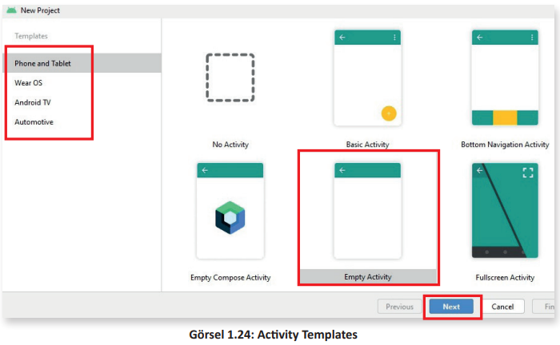

<h1 style="color:#cd2d98;">1.3. TASARIM YAPILARI (ACTIVITY TEMPLATES)</h1>

- <a href="#1.3.1.">1.3.1. Activity</a> 
- <a href="#1.3.2.">1.3.2. Activity Çeşitleri</a> 
- <a href="#1.3.3.">1.3.3. Activity Yaşam Döngüsü</a> 
- <a href="#1.3.4.">1.3.4. Activity Yaşam Döngüsü Metotları</a> 

Emülatör kurulumu tamamlanıp pencereler kapatıldıktan sonra Android Studio karşılama ekranına tekrar dönülür (Görsel 1.23).

Bu ekrandaki simgeler şunlardır:

- **New Project (Yeni Proje)**: En baştan yeni bir proje oluşturulacaksa bu simge tıklanır.

- **Open (Aç)**: Daha önce yerel sürücüye proje kaydedildiyse projeyi açmak için kullanılır.

- **Get from VCS (Sürüm Kontrol Sistemlerinden Yükle)**: Git, GitHub gibi sitelerde proje geliştirilirse buradan proje yüklenebilir.

New Project simgesi tıklandıktan sonra Templates (Şablonlar) bölümünden Phone and Tablet seçilir. Uygulamaya Activity Templates (Tasarım Yapıları) eklenebilen seçim penceresi gelir (Görsel 1.24).

Bu pencerede uygulama geliştirilecek cihaza göre **Phone and Tablet (Telefon ve Tablet)**, **Wear Os (Giyilebilir Cihaz)**, **Android TV (Akıllı Televizyon)** ve **Automotive (Otomotiv)** olarak kategorilere ayrılmış Activity Templates yer alır.

Uygulama geliştirilmek istenen cihaz olarak Phone and Tablet seçilir ve hazır activitylerden **Empty Activity (Boş Activity)** şablonu seçilir. Next düğmesine basılarak işleme devam edilir. 

>**SIRA SİZDE**: 
>
>Mobil uygulama geliştirme ortamında "Fullscreen Activity" tasarım yapısını seçerek uygulama geliştirmeye başlayınız.
>
>**DEĞERLENDİRME**:
>
>Çalışmanız aşağıda yer alan kontrol listesi kullanılarak değerlendirilecektir. Çalışmanızı yaparken değerlendirme ölçütlerini dikkate alınız.
>
>
<b>KONTROL LİSTESİ</b>

>
>| DEĞERLENDİRME ÖLÇÜLERİ                                            | EVET | HAYIR |
>| :----------------------------------------------------------------- | ---- | ----- |
>| 1. Mobil uygulama geliştirme ortamını çalıştırdı.                 |
>| 2. Karşılama ekranında More Actions seçeneğine tıkladı.           |
>| 3. Açılan pencerede Phone and Tablet seçeneğine tıkladı.          |
>| 4. Pencerenin sağ tarafındaki bölümden Fullscreen Activity seçti. |
>| 5. Next düğmesine tıkladı.                                        |

<h2 id="1.3.1." style="color:#cd2d98;">1.3.1. Activity</h2>

Activity, bir Android uygulamasında kullanıcıya gösterilen ve üzerinde kullanıcı arayüz bileşenleri (düğmeler, onay kutuları, radyo düğmeleri vb.) yer alan ekran olarak tanımlanabilir. Activity, işletim sistemlerinde bulunan pencerelerle benzerlikler taşır. Bir Android uygulaması bir veya daha fazla activity içerebilir. Bu durum, uygulamanın bir veya daha fazla ekrana sahip olması anlamın gelir.Android uygulaması geliştirilirken bir activity seçilip projeye dâhil edilir çünkü Android uygulamaları kullanıcıya göstermek için bir veya daha fazla kullanıcı arayüz bileşeni içerir. Kullanıcı, bu bileşenler sayesinde uygulama ile etkileşime girer.

<h2 id="1.3.2." style="color:#cd2d98;">1.3.2. Activity Çeşitleri</h2>

Yeni bir proje oluşturulurken hazır activitylerden biri seçilmelidir. Hazır activitylerden bazıları şunlardır:

- **No Activity (Activity Yok)**: Yeni bir boş proje oluşturmak anlamına gelir. Bu activity seçildiğinde ne bir XML dosyası ne de bir Java dosyası oluşturulur. Hiçbir dosya otomatik oluşturulmaz.

- **Basic Activity (Temel Activity)**: Temel activity seçildiğinde mobil uygulamada bir menü düğmesi ve kayan bir eylem düğmesi bulunur. Temel activity dosyaları otomatik olarak oluşturulur.

- **Bottom Navigation Activity (Alt Gezinme Activity)**: Alt gezinme activity seçildiğinde mobil uygulamanın alt tarafında üç adet düğme oluşur. Bu düğmelere çoğu sosyal medya uygulamasında yer alan işlevler verilebilir. Bu activity içinde dosyalar otomatik oluşturulur.

- **Empty Activity (Boş Activity)**: En çok kullanılan activitydir. Mobil uygulama geliştirilirken bu activity sık sık seçilir ve yeni bir boş activity oluşturulur.

- **Fullscreen Activity (Tam Ekran Activity)**: Genellikle tam ekran çalışması gereken mobil uygulamalarda kullanılır. Sistem kullanıcı arabiriminin ve eylem çubuğunun görünürlüğünü değiştirir. Birçok uygulama slayt göstermek, video göstermek vb. için ekranın tamamını kullanır. Bu activity için uygun dosyalar otomatik olarak oluşturulur.

- **Login Activity (Giriş Activity)**: Oturum açma mobil uygulaması geliştirmek için kullanılan activitydir. E-posta ve şifre girmek için alanlar ile bu alanları onaylamak için düğme bileşenleri ekranda yer alır. Bu activity için uygun dosyalar otomatik olarak oluşturulur.

<h2 id="1.3.3." style="color:#cd2d98;">1.3.3. Activity Yaşam Döngüsü</h2>

Android uygulaması içinde activitylerin bir yaşam döngüsü vardır. Program yazılırken yaşam döngüsünün iyi bilinmesi işleri kolaylaştırır.

Bir Android uygulaması ilk başlatıldığında main (ana) activity oluşturulur. Activity kullanıcıya hizmet vermeden önce **OLUŞTURULDU (CREATED), BAŞLATILDI (STARTED) ve SÜRDÜRÜLDÜ (RESUMED)** olmak üzere üç durumdan geçer (Görsel 1.25).

- Main activity, başka herhangi bir activity açarsa yeni açılan activityler de OLUŞTURULDU, BAŞLATILDI ve SÜRDÜRÜLDÜ durumlarından geçer.

- Bir A activity başka bir B activity açarsa A activity durumu **DURAKLATILDI (PAUSED)** hâline geçer. Kullanıcı, telefonun Geri (Back) tuşuna basarsa A activitye döner ve durumu SÜRDÜRÜLDÜ olur.

- Kullanıcı, Android cihazın ana ekranına dönerse tüm activityler önce DURAKLATILDI durumuna daha sonra da **DURDURULDU (STOPPED)** durumuna geçer. Kullanıcı, uygulamaya geri dönerse activity BAŞLATILDI ve SÜRDÜRÜLDÜ durumlarından geçer. Android cihazının hafızaya ihtiyacı olursa activitylerin durumu **YOK EDİLDİ (DESTROYED)** durumuna geçer. Bu sayede hafıza boşaltılır.

UYARI: 

>Durumlar, Görsel 1.25’te yer alan okları takip eder. Bir activity OLUŞTURULDU durumundan SÜRDÜRÜLDÜ durumuna zıplayamaz.Sırasıyla OLUŞTURULDU, BAŞLATILDI ve SÜRDÜRÜLDÜ durumlarını geçer. Activityler SÜRDÜRÜLDÜ durumundan DURAKLATILDI durumuna geçebilir veya DURAKLATILDI durumundan SÜRDÜRÜLDÜ durumuna geçebilir.DURAKLATILDI durumundan DURDURULDU durumuna geçebilir ve oradan da BAŞLATILDI durumuna geçebilir fakat asla DURDURULDU durumundan SÜRDÜRÜLDÜ durumuna zıplayamaz. 

<h2 id="1.3.4." style="color:#cd2d98;">1.3.4. Activity Yaşam Döngüsü Metotları</h2>

Java programlama dilinde programlar main() metoduyla başlar. Android uygulamalarda ise çok benzer şekilde çalıştırılan activitynin onCreate() metodunu çağırmasıyla OLUŞTURULDU durumuna geçilir. Tablo 1.1’de durumlar ve karşılığında çağrılacak metotlar verilmiştir.

<b>Tablo 1.1: Metotlar</b>

| Çağrılan Metot | Tanımı                                                                                    | Durum                 |
| -------------- | ----------------------------------------------------------------------------------------- | --------------------- |
| onCreate()     | Activity ilk oluştuğunda çağrılan metottur.                                               | OLUŞTURULDU           |
| onStart()      | Activity kullanıcı tarafından görülebilir hâle geldiğinde çağrılan metottur.              | BAŞLATILDI            |
| onResume()     | Kullanıcı activity ile etkileşime girdiğinde çağrılan metottur                            | SÜRDÜRÜLDÜ            |
| onPause()      | Geçerli activity duraklatılırken ve önceki activity devam ettirilirken çağrılan metottur. | DURAKLATILDI          |
| onStop()       | Activity artık görünür olmadığında çağrılan metottur.                                     | DURDURULDU            |
| onDestroy()    | Activity sistem tarafından yok edilmeden çağrılan metottur.                               | YOK EDİLDİ            |
| onRestart()    | Activity durdurulduktan sonra yeniden başlatıldığında çağrılan metottur.                  | DURDURULDU-BAŞLATILDI |