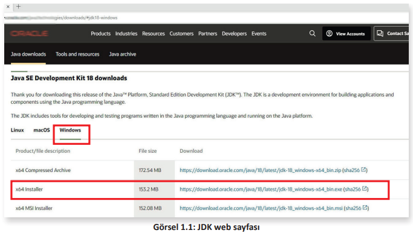
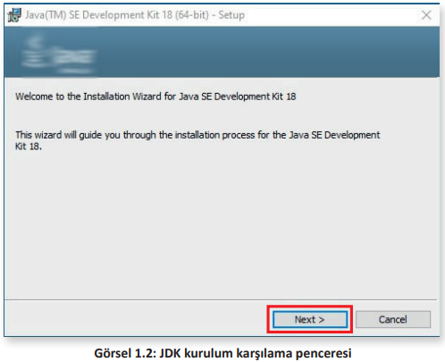
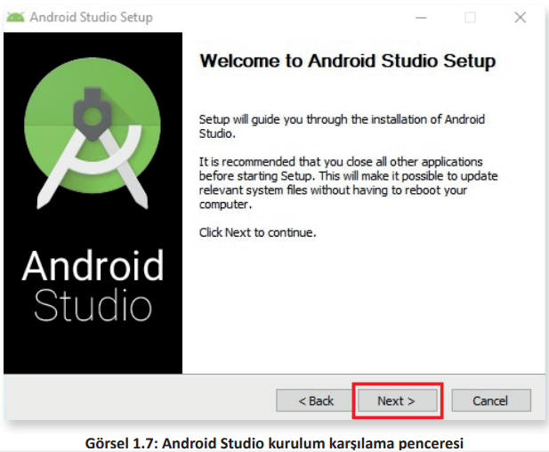
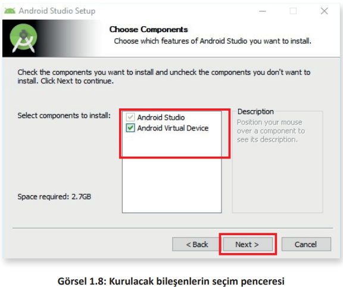
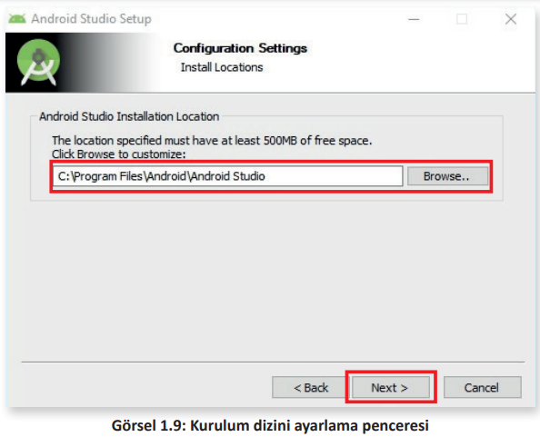
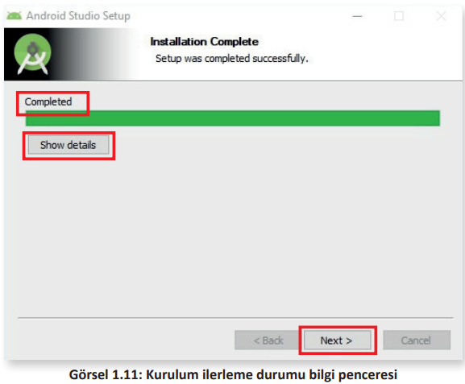

## 1.1. TEMEL BİLEŞENLER
Mobil uygulama kavramı, taşınabilir cihazlar için kodlanmış yazılımlardır. Taşınabilir cihazlar veya
mobil işletim sistemi kullanılan cihazlar denildiğinde ilk akla gelenler şunlardır:
- Akıllı telefonlar
- Tabletler
- E-kitap okuyucu
- Akıllı televizyonlar
- Otomobiller
- Akıllı saatler

Taşınabilir cihazlarda yaygın olarak kullanılan işletim sistemleri Android ve IOS’tur. Mobil uygulama geliştirilirken tercih edilebilecek yöntemler şunlardır:

- **Native (Yerel) Uygulama**: Belirli bir işletim sistemi veya cihaz için geliştirilen uygulamalardır. Bu uygulamalar, yazılımın tasarlandığı işletim sistemi ve cihazda çalışır, farklı işletim
sistemi ve cihazda çalışmaz.
- **Cross Platform (Çapraz Platform)** Uygulama: Birden fazla işletim sistemi veya cihazda çalışabilecek şekilde geliştirilen uygulamalardır.

Android işletim sistemi, Linux çekirdeğini kullanır ve açık kaynak kodludur. Bu işletim sistemi;
taşınabilir cihazlarda, akıllı televizyonlarda ve oyun konsollarında yaygın kullanımı nedeniyle Java
programlama diliyle birlikte tercih edilir.

Android işletim sisteminde Java programlama diliyle mobil uygulama geliştirmek için Java
Software Development Kit ve Android Studio + SDK olmak üzere iki temel programın bilgisayara
kurulması gerekir.

## 1.1.1. Java Software Development Kit (JDK) Kurulumu
Java Runtime Environment (JRE) ve Java Software Development Kit (JDK) olmak üzere iki farklı
Java paketi vardır. JRE, Java programlama dilinde yazılmış programları çalıştırmak için kullanılırken JDK ise yazılımcıların Java programları geliştirmesinde kullanılır.
Herhangi bir web tarayıcının adres çubuğunda https://www.oracle.com/java/technologies/downloads/ adresine gidildiğinde en güncel JDK sürümüne ulaşılır ve kurulum programı bilgisayara indirilir.

İşletim sistemine uygun JDK kurulum dosyası seçildikten sonra indirme bağlantısı tıklanır (Görsel 1.1).

Dosya indirildikten sonra dosyanın üzerine tıklanarak çalıştırılır. JDK kurulum dosyası çalıştırılınca
ilk olarak bir karşılama penceresi gelir. Bu pencerede kullanıcıya kurulum boyunca rehberlik yapılacağına dair bir bilgi verilir. Bu pencere **Next (İleri)** düğmesine tıklanarak geçilir (Görsel 1.2).

Karşılama penceresinden sonra kullanıcıyı JDK programının hangi klasörlere kurulacağını ifade eden ve **Change (Değiştir)** düğmesi ile bu klasörlerin değiştirilebileceği ikinci bir pencere gelir

Öngörülen kurulum klasörleri zorunlu değilse değiştirilmemelidir. Next düğmesiyle bu pencere de geçilir (Görsel 1.3).

Son olarak kurulumun başarıyla tamamlandığını ifade eden bir pencere ile kullanıcıya bilgi verilir.\
Bu pencerede yer alan **Close (Kapat)** düğmesine tıklanarak kurulum tamamlanır (Görsel 1.4).

**SIRA SİZDE**: 
> Java Software Development Kit kurulumunu yapınız.

**DEĞERLENDİRME**: 
> Çalışmanız aşağıda yer alan kontrol listesi kullanılarak değerlendirilecektir. Çalışmanızı yaparken değerlendirme ölçütlerini dikkate alınız.

**KONTROL LİSTESİ**

|DEĞERLENDİRME ÖLÇÜLERİ|EVET|HAYIR|
|---|---|---|
|1. Java Software Development Kit programının web sayfasına gitti.|
|2. Java Software Development Kit programını indirdi.|
|3. Java Software Development Kit kurulum programını çalıştırdı.|
|4. Java Software Development Kit programının kurulum aşamalarını yaptı.|

## 1.1.2. Android Studio ve Software Development Kit (SDK) Kurulumu

JDK kurulumu tamamlandıktan sonra Java diliyle mobil uygulama geliştirme ortamı olarak Android Studio programının kurulması gerekir. Android Studio programının güncel sürümünü https://developer.android.com/studio web adresinden indirmek mümkündür (Görsel 1.5).

Android Studio indirme sayfasındaki **Download Android Studio** düğmesine tıklanır. Yeni gelen
pencerede kullanıcı sözleşmesinin kabul edildiğini ifade eden onay kutusu işaretlendikten sonra
**Download Android Studio…** düğmesi tıklanarak indirme başlatılır (Görsel 1.6). 

Android Studio kurulum dosyasının indirme işlemi bittikten sonra dosya çalıştırılır. Kurulum dosyalarının doğruluğu kontrol edilir ve gelen karşılama penceresinde Next düğmesine tıklanarak
kurulum devam ettirilir (Görsel 1.7).

Kurulumun bir sonraki aşamasında hangi bileşenlerin kurulacağının seçilebileceği onay kutularının bulunduğu pencere gelir. Bu pencerede Android Studio onay kutusu zorunlu olarak seçilidir
ve işaret değiştirilemez ancak Android Virtual Device (Android Sanal Cihaz) isimli ikinci bileşenin
kurulumu isteğe bağlıdır. Bu aşamada her iki onay kutusu da işaretliyken Next düğmesine tıklanır
(Görsel 1.8).

Bir sonraki aşamada ise Android Studio programının kurulacağı dizin ile ilgili bilgilerin girilebileceği bir pencere gelir. Bu penceredeki dizin bilgileri zorunlu hâller dışında değiştirilmemelidir.
Next düğmesine tıklanarak bir sonraki aşamaya geçilir (Görsel 1.9).

Kullanıcı, bu aşamada Android Studio kısayollarının hangi klasörde oluşturulacağını veya yeni bir
isim belirleyerek oluşan klasörde kısayolların yer almasını sağlayabilir. Pencerenin altındaki **Do not create shortcuts (Kısayol oluşturma)** onay kutusu işaretlenerek kısayol oluşturulmaması da
seçilebilir (Görsel 1.10). Bu pencerede **Install (Yükle)** düğmesi tıklanarak kurulum başlatılır.

Kurulum başlatıldıktan sonra gelen pencerede kurulumun ne kadarının tamamlandığını ifade eden yeşil renkli yükleme çubuğu ve ayrıntıların gözlemlenebileceği **Show details (Ayrıntıları göster)** düğmesi yer alır. Kurulum işlemi bitince yeşil renkli yükleme çubuğunun üzerinde **Completed (Tamamlandı)** yazısı belirir. Next düğmesine tıklanır (Görsel 1.11).

Gelen son pencerede Android Studio programının kurulumunun bittiğini ifade eden bilgi ve **Finish (Bitir)** düğmesine tıklandıktan sonra programın başlatılmasını sağlayan **Start Android Studio (Android Studio Başlat)** onay kutusu yer alır. Bu onay kutusu işaretli olarak gelir. Finish düğmesine tıklandıktan sonra Android Studio başlatılmayacaksa bu onay kutusundaki işaret kaldırılır.
Android Studio başlatılacaksa onay kutusundaki işaret kaldırılmadan Finish düğmesine tıklanarak
kurulum sonlandırılır (Görsel 1.12).

**SIRA SİZDE:**

>Android Studio kurulumunu yapınız.

**DEĞERLENDİRME:**

>Çalışmanız aşağıda yer alan kontrol listesi kullanılarak değerlendirilecektir. Çalışmanızı yaparken değerlendirme ölçütlerini dikkate alınız.

**KONTROL LİSTESİ**

|DEĞERLENDİRME ÖLÇÜLERİ|EVET|HAYIR|
|---|---|---|
|1. Android Studio programının web sayfasına gitti.|
|2. Android Studio programını indirdi.|
|3. Android Studio kurulum programını çalıştırdı.|
|4. Android Studio programının kurulum aşamalarını yaptı.|