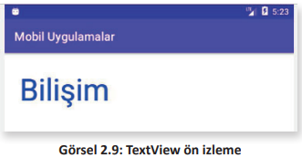
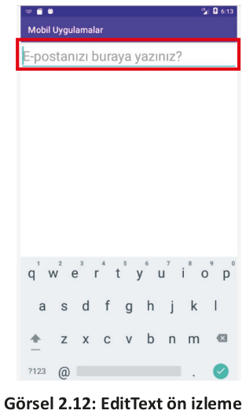
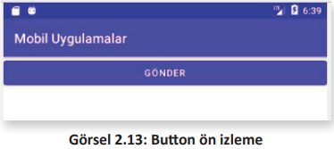
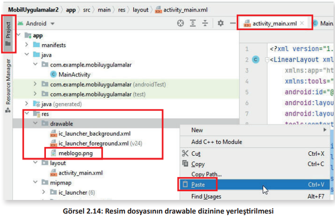
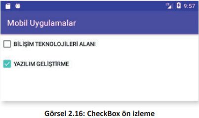
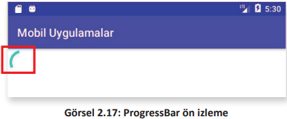

<h1 style="color:#00b9f2;">2.5. TEMEL GÖRÜNÜM SINIFLARI</h1>

- <a href="#2.5.1.">2.5.1 TextView</a> 
- <a href="#2.5.2.">2.5.2 EditText</a> 
- <a href="#2.5.3.">2.5.3 Button</a> 
- <a href="#2.5.4.">2.5.4 ImageView</a> 
- <a href="#2.5.5.">2.5.5 CheckBox</a> 
- <a href="#2.5.6.">2.5.6 ProgressBar</a> 

En çok kullanılan görünüm sınıfları şunlardır:
* TextView (Metin görünümü)
* EditText (Metin girişi)
* Button (Düğme)
* ImageView (Resim görünümü)
* CheckBox (Onay kutusu)
* ProgressBar (İlerleme çubuğu)

<h2 id="2.5.1." style="color:#00b9f2;">2.5.1 TextView</h2>

TextView, en temel bileşenlerden biridir ve mobil cihazın ekranında metin göstermek için kullanılır. TextView görünümüne ait niteliklerden en çok kullanılanları Tablo 2.1’de verilmiştir.

<div style="text-align:center;"><b>Tablo 2.1: TextView Görünümüne Ait Nitelikler</b></div>

| Nitelik                   | Tanım                                                                  |
| ------------------------- | ---------------------------------------------------------------------- |
| **android:id**            | Java kodlarının ulaşabilmesi için bir tanımlama ismi verilir.          |
| **android:text**          | Ekranda gösterilecek metin yazılır.                                    |
| **android:textSize**      | Metnin boyutu belirlenir.                                              |
| **android:padding**       | Metnin etrafında boşluk olması sağlanır                                |
| **android:textColor**     | Metnin rengi belirlenir.                                               |
| **android:textAllCaps**   | True değeri verilirse metin harflerinin tümünün büyük olması sağlanır. |
| **android:letterSpacing** | Metnin harfleri arasındaki boşluk belirlenir.                          |

TextView görünümünün XML kodu şu şekildedir:

```xml
<TextView
  android:id="@+id/MU_TextView_id"
  android:layout_width="wrap_content"
  android:layout_height="wrap_content"
  android:text="Bilişim"
  android:textSize="50sp"
  android:padding="25dp"
  android:textColor="#0000FF"/>
```

XML kodu bir yerleşim içine yazılıp emülatörde ön izleme yapılırsa mavi renkli, metin boyutu **50 sp**, metin etrafında boşluğu **25 dp** olan "Bilişim" yazısı görüntülenir (Görsel 2.9).
<div style="display:block;text-align:center">


</div>

**3. UYGULAMA**: İşlem adımlarına göre mobil uygulama geliştirme ortamında tasarım ekranına XML kodlarıyla kırmızı renkli, 55 sp boyutunda, kenar boşlukları 30 dp olan "Teknolojileri" yazısını yazdırınız.

**1. Adım**: Mobil uygulama geliştirme programını çalıştırınız.

**2. Adım:** Çalışma alanında activity_main.xml dosyasını seçiniz.

**3. Adım:** Hem kod ekranını hem de Design ekranını görmek için Code, Split ve Design sekmelerinden Split sekmesini tıklayınız.

**4. Adım:** Kod ekranında TextView görünümünü düzenleyen şu XML kodlarını Görsel 2.10’da belirtilen yere yazınız:

```xml
<TextView
 	android:id="@+id/MU_TextView_id"
 	android:layout_width="wrap_content"
 	android:layout_height="wrap_content"
 	android:text="Teknolojileri"
 	android:textSize="55sp"
 	android:padding="30dp"
 	android:textColor="#FF0000"/>
```
<div style="display:block;text-align:center">


</div>

**5. Adım**: XML görünüm kodları yazıldıktan sonra Design ekranında görünüm belirir (Görsel 2.11). Klavyeden Shift+F10 tuşlarıyla uygulamanın ön izlemesini yapınız. 
<div style="display:block;text-align:center">


</div>

>**SIRA SİZDE**: 
>
>Mobil uygulama geliştirme ortamında tasarım ekranına XML kodlarıyla yeşil renkli, 60 sp boyutunda, kenar boşlukları 25 dp olan "Yazılım Geliştirme" yazısını yazdırınız.
>
>**DEĞERLENDİRME**:
>
>Çalışmanız aşağıda yer alan kontrol listesi kullanılarak değerlendirilecektir. Çalışmanızı yaparken değerlendirme ölçütlerini dikkate alınız.
>
><div style="text-align:center;"><b>KONTROL LİSTESİ</b></div>
>
>| DEĞERLENDİRME ÖLÇÜLERİ                                                                                              | EVET | HAYIR |
>| ------------------------------------------------------------------------------------------------------------------- | ---- | ----- |
>| 1. Mobil uygulama geliştirme programını çalıştırdı.                                                                 |
>| 2. Çalışma alanında activity_main.xml dosyasını seçti.                                                              |
>| 3. Hem kod ekranını hem de Design ekranını görmek için Code, Split ve Design sekmelerinden Split sekmesini tıkladı. |
>| 4. Kod ekranında TextView görünümünü düzenleyen XML kodlarını layout kodlarının arasına yazdı.                      |
>| 5. Shift+F10 tuşlarıyla uygulamanın ön izlemesini çalıştırdı.                                                       |

<h2 id="2.5.2." style="color:#00b9f2;">2.5.2. EditText</h2>

EditText, bir çeşit TextView görünümü olmasına rağmen düzenlenebilir. EditText, TextView ile
hemen hemen aynı niteliklere sahiptir. Kullanıcının mobil uygulamaya metin girmesi gereken durumlarda EditText kullanılır. EditText görünümüne hem tek satırlı hem de çok satırlı metin girişi
yapılabilir. Mobil uygulamada bir EditText görünümüne dokunulduğunda klavye otomatik olarak
aktif hâle gelir. EditText görünümüne ait niteliklerden en çok kullanılanları Tablo 2.2’de verilmiştir.


<div style="text-align:center;"><b>Tablo 2.1: TextView Görünümüne Ait Nitelikler</b></div>

<table>
<thead>
  <tr>
    <th>Nitelik</th>
    <th>Tanım</th>
  </tr>
</thead>
<tbody>
 <tr>
    <td> <b>android:inputType</b> </td>
    <td>Kullanıcı tarafından girilen metnin nasıl olması gerektiği ve hangi amaçla kullanılacağı belirlenir.

- **Text**
- **textAutoComplete**: Kullanıcıya öneri metni sunulur.
- **textAutoCorrect**: Kullanıcının girdiği metinde otomatik düzeltme etkinleştirilir.
- **textPassword**: Kullanıcının girdiği metin ekranda gösterilmez.
- **textUri**: Klavyede web sayfa uzantıları görülür.
- **textEmailAddress**: Sadece e-posta girişi yapılmasına izin verilir.
- **phone**: Numerik klavyenin açılması sağlanır.</td>
  </tr>
  <tr>
    <td><b>android:minLines</b></td>
    <td>Ekranda gösterilecek en az satır sayısı belirlenir.</td>
  </tr>
  <tr>
    <td><b>android:maxLines</b></td>
    <td>Ekranda gösterilecek en fazla satır sayısı belirlenir.</td>
  </tr>
  <tr>
    <td><b>android:hint</b></td>
    <td>EditText görünümüne metin girişi yapılmadan önce ipucu mesajı gösterilir.</td>
  </tr>
   <tr>
    <td><b>android:maxLength</b></td>
    <td>Kullanıcının metne girebileceği en fazla karakter sayısı belirlenir.</td>
  </tr>
</tbody>
</table>

EditText görünümünün bir yerleşim içinde XML kodu şu şekildedir:

```xml
<EditText
  android:id="@+id/MU_EditText_id"
  android:layout_width="match_parent"
  android:layout_height="wrap_content"
  android:hint="E-postanızı buraya yazınız."
  android:textSize="30sp"
  android:inputType="textWebEmailAddress"
  android:maxLines="3"/>
```

EditText XML kodu bir yerleşim içine yazılıp emülatörde ön izleme yapılırsa e-posta metni girilebilecek bir ekran bileşeni görülür (Görsel 2.12).
<div style="display:block;text-align:center">


</div>

**4. UYGULAMA**: İşlem adımlarına göre mobil uygulama geliştirme ortamında tasarım
ekranına XML kodlarıyla kullanıcının girdiği metni göstermeyen "Şifrenizi yazınız." metin görünümünü yerleştiriniz.

**1. Adım**: Mobil uygulama geliştirme programını çalıştırınız.

**2. Adım**: Çalışma alanında activity_main.xml dosyasını seçiniz.

**3. Adım**: Hem kod ekranını hem de Design ekranını görmek için Code, Split ve Design sekmelerinden Split sekmesini tıklayınız.

**4. Adım**: Kod ekranında EditText görünümünü düzenleyen şu XML kodlarını layout kodlarının arasına yazınız:

```xml
<EditText
  android:id="@+id/MU_EditText_id"
  android:layout_width="match_parent"
  android:layout_height="wrap_content"
  android:hint="Şifrenizi yazınız."
  android:textSize="30sp"
  android:inputType="textPassword"
  android:maxLines="3"/>
```

**5. Adım**: XML görünüm kodları yazıldıktan sonra Design ekranında görünüm belirir. Klavyeden Shift+F10 tuşlarıyla uygulamanın ön izlemesini yapınız.

>**SIRA SİZDE**: 
>
>Mobil uygulama geliştirme ortamında tasarım ekranına kullanıcının metin girebildiği XML kodlarıyla kullanıcıya öneri metni sunan "Mesleğinizi yazınız." metin görünümünü yerleştiriniz.
>
>**DEĞERLENDİRME**: 
>
>Çalışmanız aşağıda yer alan kontrol listesi kullanılarak değerlendirilecektir. Çalışmanızı yaparken değerlendirme ölçütlerini dikkate alınız.
>
><div style="text-align:center;"><b>KONTROL LİSTESİ</b></div>
>
>| DEĞERLENDİRME ÖLÇÜTLERİ                                                                                             | EVET | HAYIR |
>| ------------------------------------------------------------------------------------------------------------------- | ---- | ----- |
>| 1. Mobil uygulama geliştirme programını çalıştırdı.                                                                 |      |       |
>| 2. Çalışma alanında activity_main.xml dosyasını seçti.                                                              |      |       |
>| 3. Hem kod ekranını hem de Design ekranını görmek için Code, Split ve Design sekmelerinden Split sekmesini tıkladı. |      |       |
>| 4. Kod ekranında EditText görünümünü düzenleyen XML kodlarını layout kodlarının arasına yazdı.                      |      |       |
>| 5. Shift+F10 tuşlarıyla uygulamanın ön izlemesini çalıştırdı.                                                       |      |       |

<h2 id="2.5.3." style="color:#00b9f2;">2.5.3. Button</h2>

Düğme bileşeni, üzerine tıklandığında veya dokunulduğunda bir eylem gerçekleştirir. TextView bileşeniyle aynı niteliklere sahip olmakla beraber Button görünümünün kendine has bazı nitelikleri de vardır. Button görünümüne ait niteliklerden en çok kullanılanı Tablo 2.3’te verilmiştir.

<div style="text-align:center;"><b>Tablo 2.3: Button Görünümüne Ait Nitelik</b></div>

| Nitelik             | Tanım                                                              |
| ------------------- | ------------------------------------------------------------------ |
| **android:onClick** | Düğme tıklandığı zaman çalıştırılacak Java metodunun ismi yazılır. |

Button görünümünün bir yerleşim içinde XML kodu şu şekildedir:

```xml
<Button
  android:id="@+id/MU_Button_id"
  android:layout_width="match_parent"
  android:layout_height="wrap_content"
  android:text="Gönder"
  android:onClick="java_metot"
 />
```

Button XML kodu bir yerleşim içine yazılıp emülatörde ön izleme yapılırsa ekranda bir düğme bileşeni görülür (Görsel 2.13).
<div style="display:block;text-align:center">


</div>

>**SIRA SİZDE**: 
>
>Mobil uygulama geliştirme ortamında tasarım ekranına üzerinde "Tamam" yazan ve tıklandığında "onayla" Java metodunu çağıran Button görünümünü yerleştiriniz.
>
>**DEĞERLENDİRME**: 
>
>Çalışmanız aşağıda yer alan kontrol listesi kullanılarak değerlendirilecektir. Çalışmanızı yaparken değerlendirme ölçütlerini dikkate alınız.
>
><div style="text-align:center;"><b>KONTROL LİSTESİ</b></div>
>
>| DEĞERLENDİRME ÖLÇÜTLERİ                                                                      | EVET | HAYIR |
>| -------------------------------------------------------------------------------------------- | ---- | ----- |
>| 1. Kod ekranında Button görünümünü düzenleyen XML kodlarını layout kodlarının arasına yazdı. |
>| 2. Shift+F10 tuşlarıyla uygulamanın ön izlemesini çalıştırdı.                                |
>| 3. Emülatörde çalışan uygulamadaki Button görünümüne tıkladı.                                |

<h2 id="2.5.4." style="color:#00b9f2;">2.5.4. ImageView</h2>

ImageView, kullanıcı arayüzünde resim gösterilmesi gerektiğinde kullanılan görünümdür. ImageView görünümüne ait niteliklerden en çok kullanılanları Tablo 2.4’te verilmiştir.

<div style="text-align:center;"><b>Tablo 2.4: ImageView Görünümüne Ait Nitelikler</b></div>

<table>
<thead>
  <tr>
    <th>Nitelik</th>
    <th>Tanım</th>
  </tr>
</thead>
<tbody>
 <tr>
    <td><b>android:maxHeight</b></td>
    <td>Resmin maksimum yüksekliği belirlenir.</td>
  </tr>
  <tr>
    <td><b>android:maxWidth</b></td>
    <td>Resmin maksimum genişliği belirlenir.</td>
  </tr>
  <tr>
    <td><b>android:src</b></td>
    <td>Ekranda gösterilecek resmin kaynağı belirtilir.</td>
  </tr>
  <tr>
    <td><b>android:scaleType</b></td>
    <td>Resmin boyutlandırılması veya taşınması kontrol edilir.

- **center**: Resim, merkeze yerleştirilir fakat ölçeklendirme yapılmaz.
- **centerCrop**: Resim, eşit şekilde ölçeklendirilir.
- **centerInside**: Resim, kapsayıcı içine yerleştirilir ve resmin kenarları ile kapsayıcının kenarları temas ettirilmez. Resim, kapsayıcının içinde bulunur.
- **fitCenter**: Resim, merkezden ölçeklendirilir.
- **fitEnd**: Resim, kapsayıcının sonundan, bir başka deyişle sağ taraftan ölçeklendirilir.
- **fitStart**: Resim, kapsayıcının başlangıcından, bir başka deyişle sol
taraftan ölçeklendirilir.
- **fitXY**: Resmin, kapsayıcının tamamına doldurulması sağlanır. Resmin en ve boy oranı bozularak, resim gerilerek veya sıkıştırılarak
kapsayıcıya yerleştirilir.
- **matrix**: Çizim yapılırken görüntü matrisiyle resmin ölçeklendirilmesi için kullanılır.</td>
  </tr>
   <tr>
    <td><b>android:tint</b></td>
    <td>Resmin renklendirilmesi sağlanır.</td>
  </tr>
</tbody>
</table>


Mobil uygulamaya yerleştirilmek istenen görüntü dosyası üzerinde sağ tuşla tıklanır ve **Kopyala** seçeneği seçilir. Resim dosyası kopyalandıktan sonra mobil uygulama geliştirme ortamında **Project** sekmesi seçili hâle getirilir. Dizinlerden **res** içinde **drawable** sağ tıklanır ve **Paste** seçeneği  işaretlenerek resim bu dizine yapıştırılır. Yapıştırılan **meblogo.png** resim dosyasının ismi, XML’de kaynak dosya adı belirtilirken **android:src="@drawable/meblogo"** şeklinde yazılır (Görsel 2.14).
<div style="display:block;text-align:center">


</div>

ImageView görünümünün bir yerleşim içinde XML kodu şu şekildedir:

```xml
<ImageView
  android:id="@+id/MU_ImageView_id"
  android:layout_width="match_parent"
  android:layout_height="wrap_content"
  android:scaleType="fitCenter"
  android:src="@drawable/meblogo"
/>
```

ImageView görünümü kullanılarak mobil uygulamada resim gösterilmesi için XML yazılıp ön izleme yapıldığında ekranda resim görülür (Görsel 2.15).
<div style="display:block;text-align:center">


</div>

**5. UYGULAMA**: İşlem adımlarına göre mobil uygulama geliştirme ortamında tasarım ekranına XML kodlarıyla resim görünümünü ekranın sağına yerleştiriniz.

**1. Adım**: Mobil uygulama ekranına yerleştirilecek resme fare sağ tuşu ile tıklayınız.

**2. Adım:** Açılan menü listesinden Kopyala seçeneğini tıklayınız.

**3. Adım**: Mobil uygulama geliştirme ortamını çalıştırınız.

**4. Adım:** Çalışma ekranında dosya ve dizinlere ulaşmak için ekranın sol üst kenarındaki Project sekmesini tıklayınız.

**5. Adım:** Sırasıyla **app>res** dizinleri açınız.

**6. Adım**: res dizinindeki drawable dizinine sağ tıklayarak açılan seçeneklerden Paste seçiniz.

**7. Adım:** Kod ekranında ImageView görünümünü düzenleyen şu XML kodlarını layout kodlarının arasına yazınız:

**8. Adım**: XML görünüm kodları yazıldıktan sonra Design ekranında görünüm belirir. Klavyeden Shift+F10 tuşlarıyla uygulamanın ön izlemesini yapınız.

>**SIRA SİZDE**: 
>
>Mobil uygulama geliştirme ortamında tasarım ekranına XML kodlarıyla resim görünümünü ekranın soluna yerleştiriniz.
>
>**DEĞERLENDİRME**: 
>
>Çalışmanız aşağıda yer alan kontrol listesi kullanılarak değerlendirilecektir.Çalışmanızı yaparken değerlendirme ölçütlerini dikkate alınız.
>
><div style="text-align:center;"><b>KONTROL LİSTESİ</b></div>
>
>| DEĞERLENDİRME ÖLÇÜTLERİ                                                                                     | EVET | HAYIR |
>| ----------------------------------------------------------------------------------------------------------- | ---- | ----- |
>| 1. Mobil uygulama ekranına yerleştirilecek resme fare sağ tuşu ile tıkladı.                                 |
>| 2. Açılan menü listesinden Kopyala seçeneğini tıkladı.                                                      |
>| 3. Mobil uygulama geliştirme ortamını çalıştırdı.                                                           |
>| 4. Çalışma ekranında dosya ve dizinlere ulaşmak için ekranın sol üst kenarındaki Project sekmesini tıkladı. |
>| 5. Sırasıyla app>res dizinlerini açtı.                                                                      |
>| 6. res dizinindeki drawable dizinine sağ tıklayarak açılan seçeneklerden Paste seçti.                       |
>| 7. Kod ekranında ImageView görünümünü düzenleyen XML kodlarını layout kodlarının arasına yazdı.             |
>| 8. Klavyeden Shift+F10 tuşlarıyla ön izleme yaptı.                                                          |


<h2 id="2.5.5." style="color:#00b9f2;">2.5.5. CheckBox</h2>

Mobil uygulamada kullanıcıya onay kutuları sunarak bunlardan bir tanesini, birkaçını veya hepsini seçebilmesi gereken durumlarda kullanılan görünümdür. CheckBox görünümüne ait niteliklerden en çok kullanılanı Tablo 2.5’te verilmiştir.

<div style="text-align:center;"><b>Tablo 2.5: CheckBox Görünümüne Ait Nitelik</b></div>

| Nitelik             | Tanım                                                          |
| ------------------- | -------------------------------------------------------------- |
| **android:checked** | Onay kutusunun işaretli olması istenirse "true" değeri atanır. |

İki seçenekle ekranda yer alan onay kutusu oluşturulması ve ikinci onay kutusunun seçili olması için yazılacak XML kodu şu şekildedir:

```xml
<CheckBox
  android:id="@+id/MU_cb1_id"
  android:layout_width="match_parent"
  android:layout_height="wrap_content"
  android:checked="false"
  android:text="BİLİŞİM TEKNOLOJİLERİ ALANI" />
  <CheckBox
  android:id="@+id/MU_cb2_id"
  android:layout_width="match_parent"
  android:layout_height="wrap_content"
  android:checked="true"
  android:text="YAZILIM GELİŞTİRME" />
```
ImageView görünümü kullanılarak mobil uygulamada resim gösterilmesi için XML kodlar yazılıp ön izleme yapıldığında ekranda resim görülür (Görsel 2.16).
<div style="display:block;text-align:center">


</div>

>**SIRA SİZDE**: 
>
>Mobil uygulama geliştirme ortamında tasarım ekranına XML kodlarıyla "Millî Eğitim Bakanlığı" metnine sahip bir onay kutusu yerleştiriniz.
>
>**DEĞERLENDİRME**: 
>
>Çalışmanız aşağıda yer alan kontrol listesi kullanılarak değerlendirilecektir.Çalışmanızı yaparken değerlendirme ölçütlerini dikkate alınız.
>
><div style="text-align:center;"><b>KONTROL LİSTESİ</b></div>
>
>| DEĞERLENDİRME ÖLÇÜTLERİ                                                                      | EVET | HAYIR |
>| -------------------------------------------------------------------------------------------- | ---- | ----- |
>| 1. Kod ekranında Button görünümünü düzenleyen XML kodlarını layout kodlarının arasına yazdı. |
>| 2. Shift+F10 tuşlarıyla uygulamanın ön izlemesini çalıştırdı.                                |
>| 3. Emülatörde çalışan uygulamadaki CheckBox görünümüne tıkladı.                              |


<h2 id="2.5.6." style="color:#00b9f2;">2.5.6. ProgressBar</h2>

ProgressBar, bir işlemin ilerleme durumunu göstermek için kullanılan görünümdür. Varsayılan olarak ProgressBar, dönen bir çember şeklinde mobil uygulamasında görüntülenir. ProgressBar görünümüne ait niteliklerden en çok kullanılanları Tablo 2.6’da verilmiştir.

<div style="text-align:center;"><b>Tablo 2.6: ProgressBar Görünümüne Ait Nitelikler</b></div>

| Nitelik               | Tanım                                                                         |
| --------------------- | ----------------------------------------------------------------------------- |
| **android:minHeight** | ProgressBar görünümünün olabilecek en düşük yüksekliği belirlenir.            |
| **android:minWidth**  | ProgressBar görünümünün olabilecek en düşük genişliği belirlenir.             |
| **android:max**       | ProgressBar görünümünün alabileceği en yüksek değer belirtilir.               |
| **android:progress**  | İlerleme değeri 0 ile en yüksek değer arasında bir tam sayı olarak belirlenir |

ProgressBar ile ilerlemeyi göstermek için Determinate (Belirli) ve Indeterminate (Belirsiz) olmak üzere iki biçim çeşidi vardır. Indeterminate ProgressBar, XML kodlamayla şu şekilde oluşturulur:

```xml
<ProgressBar
 android:id="@+id/MU_ProgressBar_id"
 android:layout_width="wrap_content"
 android:layout_height="wrap_content"
 android:indeterminate="true"/>
```

Yazılan XML kodlar emülatörde ön izleme yapıldığında cihazın ekranında dönen bir çember görüntülenir (Görsel 2.17)
<div style="display:block;text-align:center">

</div>
