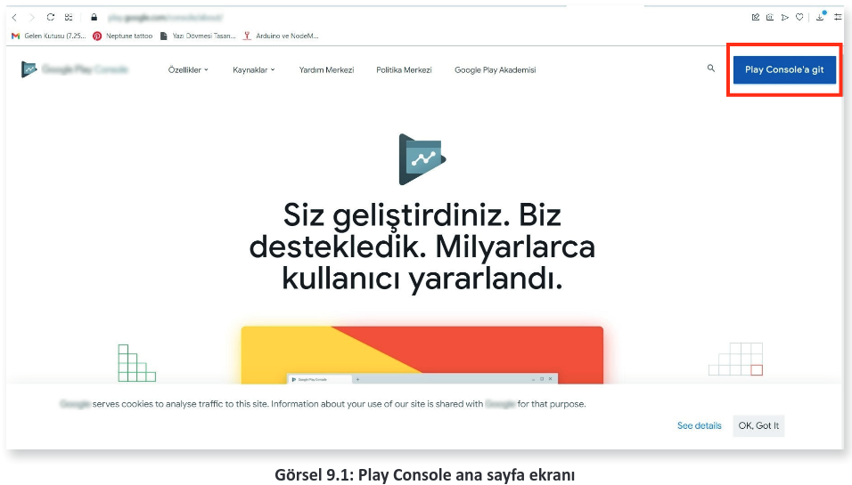
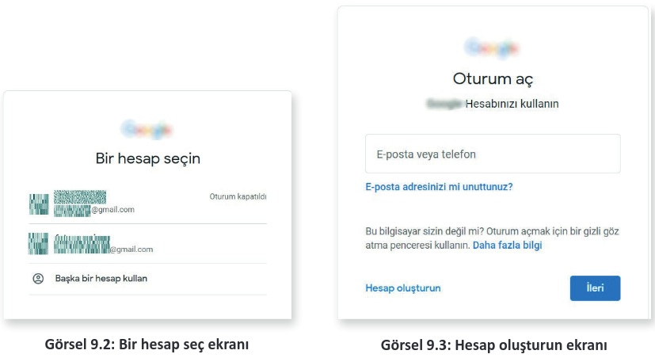
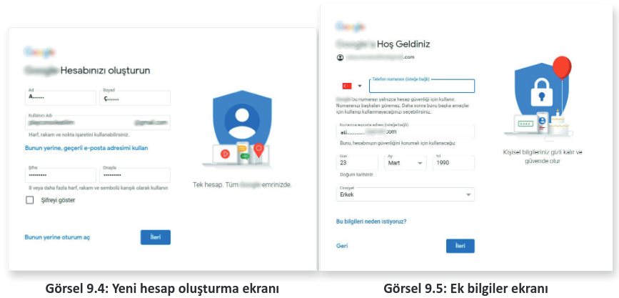
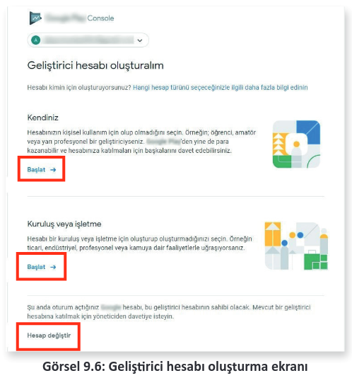
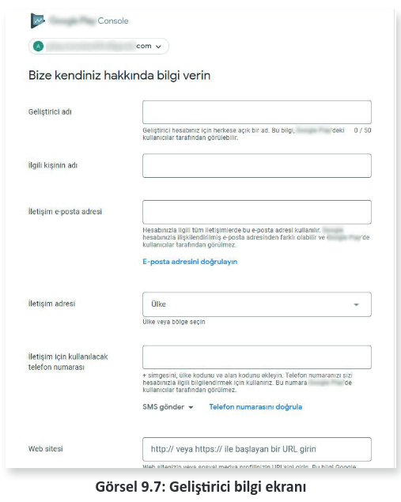
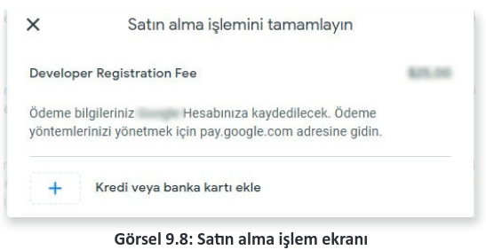
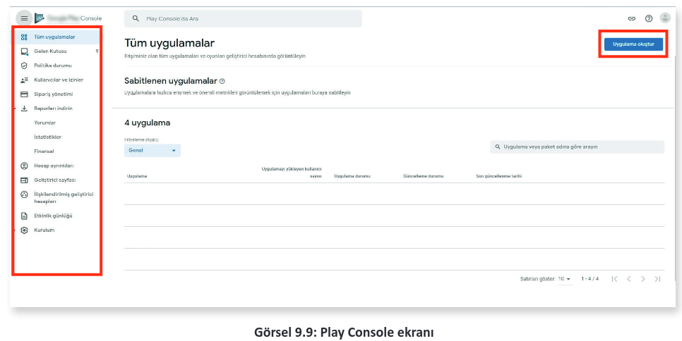
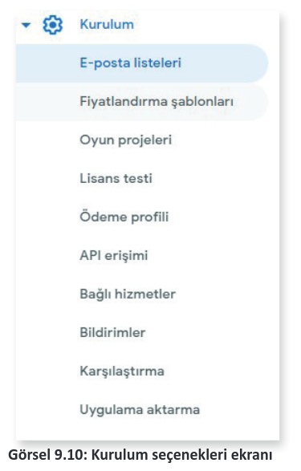

# 9.1. UYGULAMA MARKET GELİŞTİRİCİ AYARLARI

Mobil uygulama geliştirme platformu üzerinden tasarlanan uygulamalar her zaman taslak hâlindedir. **\*.apk** olarak çıktı alınmadıkça üzerinde değişiklikler yapılabilir. Geliştirilen mobil uygulamanın .apk uzantılı çıktısının alınması, başka bir Android işletim sistemine sahip cihazda kullanılmasını sağlar. Bu .apk dosyası herhangi bir yol ile başka bir Android cihaza gönderilebilir. Uygulama paketi çalışır hâldedir fakat bunun en işlevsel ve yayılmaya uygun yolu, market üzerinde uygulamanın yayımlanmasıdır.

Uygulamaların yayımlanmasını sağlamak için Android market web sitesi kullanılır. Uygulama marketine ulaşılıp "console" linkine giriş yapılır. Ayrıca bir uygulamayı yayımlayabilmek için de geliştirici hesabına sahip olmak gerekir. Her oluşturulmuş hesap, potansiyel şekilde bir geliştirici olabilecek düzeydedir. Bunun için yapılması gerekenler şunlardır:

- Verilen linkten Play Console sayfasına gidilerek "**Play Console’a git**" butonuna tıklanır (Görsel 9.1).

- Açılan sayfa üzerinden var olan bir hesap seçilir veya "Başka bir hesap kullan" butonuna basılır (Görsel 9.2).
- Yeni bir hesap oluşturulmak istenirse "Başka bir hesap kullan" tıklanır ve bir hesap girilir veya "Hesap oluşturun" butonuna tıklanır (Görsel 9.3).

- "Kendim için" seçeneği seçilir ve Görsel 9.4’teki gibi Ad, Soyad, Kullanıcı Adı ve Şifre bilgileri girilir. İleri butonuna basılır.
- İstenen bilgiler girilir ve İleri butonuna tıklanarak çıkan sözleşme kabul edilir (Görsel 9.5).Ekranda iki adımlı doğrulama çıkarsa kabul edilerek telefon numarası girilir.

- Play Console için verilen linke tekrar bağlanılarak "Play Console’a git" tıklanır ve yeni oluşturulan hesap seçilir. Ardından hesabı geliştirici hesabına dönüştürme adımlarına geçilir. Görsel 9.6’da uygun olan seçeneklerden biri seçilir.

- Kendiniz olarak "Başlat" butonuna tıklanır. Sonrasında gelen "Geliştirici Bilgi Ekranı"ndan geliştirici bilgileri girilir. Telefon numarası doğrulaması yapılır ve "Hesap oluştur ve öde" butonuna tıklanır (Görsel 9.7).

- Geliştirici hesabını tamamlamak için öğretmeniniz veya bir yetişkinle birlikte market ücreti olarak bir defaya mahsus belirtilen ücretin ödenmesi gerekir (Görsel 9.8).

- Satın alma işlemi sonrasında "Play Console" geliştirme ekranı açılır. Görsel 9.9’da sol tarafta menüler, sağ üst kısımda da "Uygulama oluştur" butonu bulunur.

- **Gelen Kutusu:** Firma tarafından gelen mesajların yer aldığı bölümdür. Erişim hesabı olarak geliştirici hesabının kendi tanımlanmış ise uygulamaya gönderilen mesajların da bulunduğu mesaj kutusudur.
- **Politika durumu:** Firmaya ait olan politikalara uygunsuz hareketlerden kaynaklı durumlar varsa bunların yer aldığı bölümdür. Ayrıca uygulama politika ihlalleri veya uygunluğu da bu bölümden görülüp incelenebilir.
- **Kullanıcılar ve izinler:** Play Console ekranını kullanabilecek maillere ait izinler bu bölümden ayarlanır. Birden fazla hesap ile oluşturulan üyeliğe ait Play Console kullanılabilir.
- **Sipariş yönetimi:** "Payments satıcı hesabı" oluşturulduktan sonra bu bölüm kullanılabilir. Adsence gibi yöntemlerle para kazanmak için ödeme planı bu bölümden yapılmalıdır.

- **Raporları indirin:** "Yorumlar", "İstatistikler", "Finansal" adında üç raporun yer aldığı bölümdür. Raporlar Google tarafından güncel şekilde bildirilir.
- **Hesap ayrıntıları:** Kişisel veya kurumsal hesap şeklinde düzenlenip telefon, adres, mail gibi birçok bilginin yeniden oluşturulabileceği bölümdür.
- **Geliştirici sayfası:** Geliştirici Adı, Fiziksel Adresi, web sitesi, promosyonlar, geliştirici simgesi, öne çıkan uygulamalar gibi ayarların düzenlendiği seçenektir.
- **İlişkilendirilmiş geliştirici hesapları:** Bir başka geliştirici hesabı ile ilişkilendirme yapılırsa ilişkilendirilmiş o hesap hakkında bilgilerin alındığı bölümdür.
- **Kurulum:** Görsel 9.10’da görülen menülerin yer aldığı, Play Console’a ayrıntılı bilgilerin detaylı biçimde düzenlendiği bölümdür.

