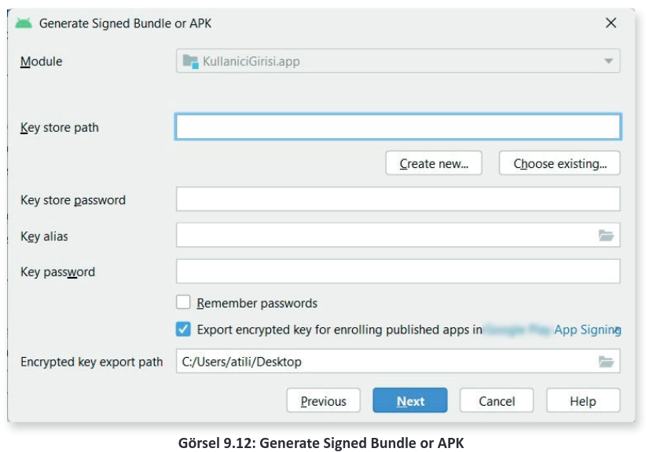

# 9.2. UYGULAMA YAYIMLAMA

Uygulama Yayımlama Firması, market olarak politikalarını oldukça sıkı tutar. İhlallere, hilelere, çalıntı uygulamalara karşı katı kuralları vardır. Örneğin 2019 yılında başlayan pandemide COVID-19 ile ilgili bir oyun vb. uygulamalar yayımlanmak istenirse öncelikle yüksek sağlık kuruluşlarından (Sağlık Bakanlığı vb.) alınmış izin belgeleri gerekir. Market, her türlü yanlış bilgilendirmeden kendini arındırmak ister ve böyle bir izin yoksa Covid imgesi, ismi, resmi, iconu bulunan uygulamayı reddeder. Uygulamaların market içinde yayımlanmadan önce de uygulamanın geliştiricisi tarafından imzalanması zorunluluğu bulunur. Mobil uygulama geliştirme ortamından sadece "APK" (Android Package Kit) olarak veya "Generate Signed APK" olarak iki türlü çıktı alınır.

Normal "APK" çıktısı, paketin başka bir Android cihaza yüklenmesini ve o cihazda kullanılmasını sağlar. Bu durumda önce cihazın "Ayarlar" menüsündeki "Gelişmiş" seçeneğinden "Bilinmeyen uygulamaları yükle" açılmalıdır. Ancak bu şekilde uygulama paketi o cihaza yüklenebilir. Bu paket, markete yüklenmek istendiğinde imza bulunmadığı için kabul edilmez. Bu nedenle uygulamanın markette paylaşılmadan önce "Generate Signed APK" olarak paket şekline getirilmesi gerekir. Öncelikle **Build** sekmesinden **Generate Signed Bundle/APK** seçeneği tıklanır. Görsel 9.11’deki pencere görünür. Android App Bundle seçeneği seçilerek Next butonuna tıklanır.

Görsel 9.12’deki gibi bir ekranla karşılaşılır.

- **Module:** Mobil uygulama ekranında açık olan ve APK imzası çıkarılacak uygulamayı temsil eder.
- **Key store path:** APK imzalama işleminden sonra çıkan imza dosyasının yolunun, şifresinin ve sertifikasının belirtildiği bölümdür. **Create New** butonuna tıklandığında "New Key Store" penceresi ile karşılaşılır (Görsel 9.13).

UYARI: Bu imza dosyası saklanmak zorundadır. Bu dosya olmadan market üzerinde uygulama ile ilgili güncelleştirmeler yapılamaz.

- **Key store path:** Anahtar dosyasının çıkartılacağı yol buradan seçilir.
- **Password:** Anahtar dosyasının kullanılabilmesi için gerekli olan şifre oluşturulur.
- **Confirm:** Anahtar dosyasının kullanılabilmesi için gerekli olan şifre tekrar edilir.
- **Alias:** Anahtara verilecek takma isim ifade edilir.
- **Password:** Anahtar dosyasının kullanılabilmesi için gerekli olan şifre oluşturulur.
- **Confirm:** Anahtar dosyasının kullanılabilmesi için gerekli olan şifre tekrar edilir.
- **Validity (Years):** Anahtar dosyasının geçerli olacağı yıl sayısı girilir.
- **Certificate:** Sertifika bilgilerini içerir. First and Last Name ile kişi adı soyadı, Organizational Unit ile şirketin birimi, Organization ile şirketin adı, City and Locality ile şehir, State or Province ile ilçe ve Country Code ile de ülke kodu girişi yapılır.

Bilgiler uygun şekilde doldurulur. Ardından "OK" butonuna tıklanır. Girilen bilgiler New Key Store penceresine gelir. Next butonuna tıklanır. Görsel 9.14’te görülen menü ile karşılaşılır.

"release" seçeneğine tıklanır ve Finish butonuna basılır. Bir süre beklendikten sonra imzalama işlemi tamamlanır ve mobil geliştirme ortamının sağ alt bölümünde imzalı çıktının oluşturulduğu bilgisi verilir (Görsel 9.15). locate seçeneği seçilirse dosyanın dizinine erişim sağlanır.

**NOT:**

>Oluşturulan dosya .aab uzantısındadır. Paket, .apk uzantılı istenirse Görsel 9.11’deki menüden Android App Bundle yerine APK seçeneği seçilmelidir.

İmzalanmış çıktısı alınan mobil uygulamanın markette yayımlanması için tarayıcı üzerinden geliştirici hesabı ile Play Console açılır. Görsel 9.9’da görülen **Uygulama oluştur** butonuna tıklanır. Görsel 9.16’da görülen sayfa açılır.

- **Uygulama adı:** Markette görüntülenecek isim bu bölüme girilir.
- **Varsayılan dil:** Dil seçeneği bu bölümden seçilir.
- **Uygulama veya oyun:** Geliştirilen uygulamanın bir program mı yoksa oyun mu olduğu seçilir.
- **Ücretsiz veya ücretli:** Geliştirilen uygulamanın markette ücretli olarak mı yoksa free olarak mı yayımlanacağı seçilir.

**NOT:** 

>Uygulamayı ücretsiz veya ücretli indirme özelliğinde yayımlama seçimi, uygulama yayımlanıncaya kadar değiştirilebilir. Uygulama yayımlandıktan sonra ücretsiz bir uygulama, ücretli olarak değiştirilemez.,

- **Beyanlar:** Geliştirici program politikalarına, Play uygulama imzalama ve ABD ihracat yasalarına uygun olduğuna dair beyan verilir. Tüm ayarlar yapılıp, girişler tamamlandığında "Oluştur" butonuna tıklanır ve uygulama, paylaşıma açılır. Görsel 9.17’deki ekranla karşılaşılır. Bu panele Kontrol paneli ismi verilir.

**NOT:** 

>Henüz uygulama paylaşılmamış sadece gerekli ayarlar ve isimlendirmeler yapılmıştır. Uygulamanın kurulumu, Kontrol paneli aracılığı ile bu aşamadan sonra yapılır.
 

Uygulamanın Play Console ekranına yüklenmesi ve markette yayımlanması için görevler verilir. Bu görevlerin sırasıyla yapılması gerekir.
- Görsel 9.18’de görüldüğü gibi Kontrol panelindeki "Uygulamanızın kurulumu" başlığı altında yer alan "Görevleri göster" sekmesine tıklanır. Görevlerin her biri tek tek yapılmalıdır. Görevler tamamlandıktan sonra tamamlanan her bir görevin üzeri sistem tarafından otomatik çizilerek onay işareti alınmalıdır. "Uygulama erişimine" tıklanır.

- Görsel 9.19’da yer alan sayfa açılır. "Tüm işlevler, özel erişim olmadan kullanılabilir" seçeneğine tıklanır. Diğer seçenek ile bazı işlevler kısıtlanabilir. Kaydet butonu tıklanır. "Değişiklikleriniz kaydedildi" mesajı sonrasında tekrar "Kontrol paneli" seçeneğine tıklanır ve görevlere dönülür.

- **Reklam** görevine tıklanır. Uygulama içinde reklam varsa "Evet, uygulamam reklam içeriyor" seçeneği seçilir. Bu durumda market içinde uygulamanın yanında "Reklam içerir" ibaresi yer alır. Uygulama içinde reklam yoksa "Hayır, uygulamam reklam içermiyor" seçeneği seçilir. Kaydet butonuna tıklanır (Görsel 9.20). "Değişiklik Kaydedildi" seçeneğinden sonra Kontrol paneline tıklanıp görevlere dönülür.

- **İçerik derecelendirmeleri** görevine tıklanır. Görsel 9.21’deki sayfa açılır. "Anketi başlat" seçeneğine tıklanır. Paylaşılan uygulamanın bir oyun mu yoksa uygulama mı olduğu sorulur. İlgili cevap verilip Kaydet seçeneği tıklanır ve İleri butonuna basılır. İçerik değerlendirme bölümü oldukça önemlidir. Uygulama hakkında birçok bilgi burada sorulur ve bu bölüme doğru bilgi girişi yapılmalıdır. Görsel 9.22’de bu bölümde sorulan sorular verilmiştir. Bilgiler girildikten sonra Kaydet seçeneği tıklanır ve İleri butonuna basılır.

Görsel 9.23’te görüldüğü gibi her ülkede geçerli olacak bir derecelendirme puanı ortaya çıkar. Bu derecelendirme puanı o ülkedeki yasal statüyü belirler. Gönder seçeneğine basılır ve görev tamamlanır.

- **Hedef Kitle** görevine tıklanır. Görsel 9.24’te görülen menü ile karşılaşılır. Hedef kitle olarak 13 yaş üzerinde seçim serbesttir fakat 13 yaş altındaki seçimler pasif durumdadır. Bunun nedeni, firmanın politikalarıdır. 13 yaş altındaki kitlelere uygulama paylaşılabilmesi için bir **gizlilik politikası** eklenmesi zorunludur. 13 yaş üzeri seçimlerle işleme devam edilir. 13 yaş altına hitap eden uygulamalar için gizlilik politikasına ait bir metin oluşturulup, bu metin Play Console üzerine yüklendiğinde daha sonradan hedef kitlede güncelleme yapılabilir. İleri butonuna tıklandığında "Mağaza girişiniz kasıtlı olmadan çocuklara hitap ediyor olabilir mi?" diye sorulur ve cevap beklenir. Seçim yapıldıktan sonra İleri butonuna tıklanır. Bir özet metni ortaya çıkar ve hedef kitle yaşının markette neden yer aldığının, aileler programına kayıtlı olunup olunmadığının bir özetini sunar. Kaydet butonuna basılır. "Değişiklikler Kaydedildi" mesajı görülür. Kontrol paneli seçeneğine tıklanır ve görevlere dönülür.

- **Haber uygulamaları** görevine tıklanır ve "Uygulamanız haber uygulaması mı?" sorusu PlayConsole tarafından sorulur. Hayır cevabı verilirse herhangi bir uyarı çıkmaz, Evet cevabı verilirse uygulamadaki haberlerin içeriği sorulup uygulama geliştiriciden "Haber Politikalarına uygunluğunu onaylıyorum" şeklinde bir taahhüt alınır. Uygun cevap verilir ve Kaydet butonuna basılır. Kontrol paneli seçeneğine tıklanır ve görevlere dönülür.
- **COVID-19 temas izleme ve durum uygulamaları** görevine tıklanır. Uygulamanın COVID-19 ile ilgili olup olmadığı Play Console tarafından sorulur. Uygulamanın COVID-19 ile ilgili olmadığı taahhüt edilir ve Kaydet butonuna tıklanır. Kontrol paneli seçeneğine tıklanır ve görevlere dönülür.
- **Veri güvenliği** görevine tıklanır. Bu görev, kullanıcıların verilerinin uygulama tarafından nasıl toplanıp paylaşıldığını anlamalarına yardımcı olur. Görsel 9.25’te görülen sayfa açılır.

Verilerin toplanıp toplanmadığı, veriler toplanıyorsa nasıl toplandığı ve paylaşıldığı soruları Görsel 9.26’da olduğu gibi sorulur.

Uygun şekilde cevap verilip İleri butonuna tıklanır. Ekrana **Gizlilik beyanının** olmadığı, bu nedenle görevin tamamlanamayacağını belirten bir mesaj gelir (Görsel 9.27).

**NOT:**

>Play Console İçin Gizlilik Politikası Metni Oluşturma şeklinde internet üzerinden dokümanlar aracılığı ile word dosyasında gizlilik politikası metni oluşturulmalı ve bilgisayara kaydedilmelidir. Bu belge, uygulama içinde gizlilik politikası olarak sisteme yüklenir.

- "Gizlilik politikasına git" seçeneğine tıklanır ve sayfadan çıkılır. Gizlilik Politikası sayfasında URL adresi sorulur. Oluşturulan Gizlilik Politikası metni herhangi bir upload sitesi yardımı ile sisteme internet ortamına yüklenir ve URL adresi bu bilgi kutusuna yazılır (Görsel 9.28).

**NOT:**

>Görsel 9.28’de görüldüğü gibi 13 yaş ve üzeri hedef kitlesi için nasıl bir gizlilik politikası eklenmesi gerektiğini bildiren bir doküman sistem üzerinde paylaşılır. Bu linke tıklanıp, ilgili doküman incelenerek uygulama için uygun bir Gizlilik Politikası metni oluşturulursa hedef kitle 13 yaş ve altı seçilebilir.

- Kontrol paneline dönüş yapılır ve veri güvenliği görevine geçilir. Veri güvenliği ile ilgili işlemler tekrar edilir. Gizlilik politikası metni paylaşıldığı için sistem ayrıca bir hata veya uyarı vermez. Kaydet butonu tıklanır. Kontrol paneli seçeneğine tıklanır ve görevlere dönülür.
- **Uygulamanızın kurulumu** başlığında yer alan görevler Görsel 9.29’da olduğu gibi çizgi ve onay işaretini alınca Test aşamasına geçilir.

- Görsel 9.30’da görülen Yeni sürüm oluşturun bağlantısına tıklanır.

- Görsel 9.31’de görüldüğü şekilde Yeni Sürüm kaydı yapılır. Bu işlem, uygulama ilk yüklenirken oluşturulur. Yükle seçeneğine tıklanıp imzalı çıktısı alınan mobil uygulama paketi seçilir.

**NOT:**

>Paket yükleme işlemi tamamlandığında uygulamanın imzalı paketi Play Console tarafından içeriye yüklenir. Bu paket yayımlanmaya başladığında imza paketi kaybedilirse (".jks" uzantılı dosya) uygulama güncelleme veya değişiklik işlemleri yapılamaz.

Paket içeriye yüklendikten, sürüm ve not bilgileri girildikten sonra Kaydet butonuna tıklanır. Ardından "Sürüm İncelemesi Başlat" butonuna tıklanır. Görsel 9.32’de görülen hata durumları ayıklanır ve uygulama gösterilir. "Dahili test kanalına sunumu başlat" seçeneğine tıklanır. Gelen mesaj üzerine "Kullanıma Sun" seçeneğine tıklanır.

- Kontrol paneline dönüş yapılır. Uygulamanızın kurulumu başlığı altında yer alıp henüz tamamlanmayan iki adet görevi tamamlamak üzere "Bir uygulama kategorisi seçip iletişim bilgilerini sağlayın" seçeneğine tıklanır. Yüklenen mobil uygulama paketinin uygulama mı, oyun mu olduğu tekrar girilir. Kategori bilgisi sorulur ve etiket girilmesi istenir. Ayrıca kullanıcılara gösterilecek mail adresi ve telefon numarası gibi bilgiler istenir. Mail adresi zorunlu iken telefon numarası opsiyonel bir seçenektir. Girilmesi zorunlu değildir. Bilgiler girildikten sonra Kaydet butonuna tıklanır. Kontrol paneline dönülür.
- "Uygulamanızın kurulumu" başlığı altında yer alan son görev yerine getirilir. "Mağaza girişinizi oluşturun" seçeneğine tıklanır. Bu bölümde şu bilgilerin girilmesi istenir:
- **Uygulamanın adı**
- Maksimum 80 harflik **kısa açıklama bilgisi**
- Maksimum 4.000 harflik **tam açıklama bilgisi**
- 512x512 en fazla 1 MB’lık şeffaf bir PNG veya JPEG **uygulama simgesi**
- 1024x500 piksel ölçülerinde, en fazla 1 MB’lık bir PNG veya JPEG **özellik grafiği**
- Opsiyonel olarak **video linki**
- Telefon, 7 inçlik Tablet ve 10 inçlik Tablet **ekranından görüntü**
İstenen tüm bilgiler yüklendikten sonra Kaydet seçeneğine tıklanır. "Değişiklikler Kaydedildi" mesajı görüldüğünde Kontrol paneline geri dönülür. Test ve Uygulama kurulumunda tüm görevler tamamlandığına göre uygulama yayımlanmaya hazırdır. Öncelikle Görsel 9.33’te görülen "Üretim" seçeneğine tıklanır. Bu seçenekten "Ülkeler ve Bölgeler" sekmesi altından yayımlanması istenen ülkeler seçilir ve kaydedilir. Görsel 9.33’teki Sürüm başlığı altında yer alan "Sürümlere genel bakış" menüsüne tıklanır. Ekrandaki sürüm bilgisinin Görsel 9.34’te görüldüğü şekilde sağ bölgesinde yer alan ok işaretine tıklanır. Açılan menü-den "Sürümü Yükselt" seçeneği seçilir. "Üretim" butonuna tıklanır.

- Üretim bölümüne geçen, menüdeki yüklenmiş sürüm güncellenmek istenirse “Yükle” seçeneğine tıklanır ve yeni sürüm yüklenir. Aynı sürüm ile devam edilmek istenirse “Sürümü inceleme” butonuna basılır ve inceleme aşamasına geçilir. Görsel 9.35’te görüldüğü gibi **Üretim kanalına sunumu başlat** seçeneğine tıklanır ve çıkan menüden **Kullanıma sun** seçeneği seçilir.
  

Bu noktadan sonra uygulama, market üzerinde yayımlanması için incelemeye gönderilir. Görsel 9.36’daki gibi “Tüm uygulamalarım” bölümünde uygulamanın “İncelemede” şeklinde görünmesi gerekir. İnceleme süreci, istisnai durumlar haricinde 1 saat ile 7 gün arasında sürebilir. İnceleme süreci sonrası uygulama reddedilebilir. Uygulama askıya alınıp bilgilendirme veya uygulamada düzenleme talep edilebilir. Uygulama doğrudan yayına da alınabilir. Uygulama durumunun bilgisi hem Play Console mesajlarına hem de mail adresine gönderilir.

