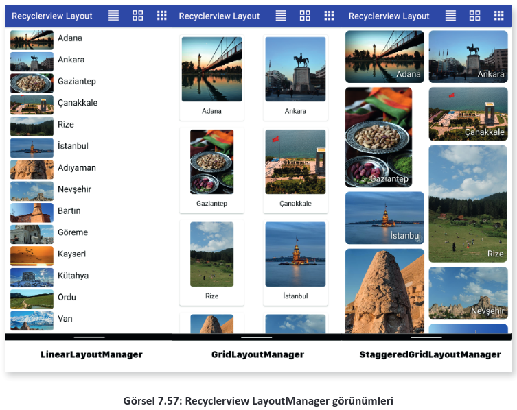

# 7.3 UZAK VERİ TABANIYLA ÇALIŞMAK

- <a href="#7.3.1.">7.3.1. JSON Veri Düzeni </a>
- <a href="#7.3.2.">7.3.2. Mobil Uygulama Geliştirme Ortamında Uzak Sunucu Yapılandırması </a>
- <a href="#7.3.3.">7.3.3. Uzak Veri Tabanı Yönetimi</a>
- <a href="#7.3.4.">7.3.4. Firestore Veri Tabanı Oluşturmak </a>
- <a href="#7.3.5.">7.3.5. Uzak Veri Tabanında Yetkilendirme İşlemleri </a>
- <a href="#7.3.6.">7.3.6. Mobil Uygulama Geliştirme Ortamında Uzak Veri Tabanıyla Çalışmak </a>
- <a href="#7.3.7.">7.3.7. Mobil Uygulama Geliştirme Ortamında RecyclerView Nesnesiyle Çalışmak </a>
- <a href="#7.3.8.">7.3.8. Uzak Veri Tabanından Veri Getirmek </a>
- <a href="#7.3.9.">7.3.9. Mobil Uygulama Geliştirme Ortamında Uzak Veri Tabanına Veri Eklemek </a>
- <a href="#7.3.10.">7.3.10. Uzak Veri Tabanından Veri Silmek </a>
- <a href="#7.3.11.">7.3.11. Uzak Veri Tabanında Veri Güncellemek </a>
- <a href="#7.3.12.">7.3.12. Firestore Veri Tabanında Kurallarla Çalışmak </a>

Uygulama marketinde en popüler uygulamalar genellikle paylaşımın çok kolay olduğu uygulamalardır. Mobil cihazlarda herhangi resim, yazı veya videoyu paylaşabilmenin en kolay yolu bunları bir sunucuya göndermek ve buradan diğer kullanıcıların almasını sağlamaktır.

Mobil uygulama geliştirme ortamı uzak veri tabanları ile çalışmaya olanak verir. Mobil uygulama geliştirme ortamında birçok uzak veri tabanı kullanılabilir ancak Firebase veri tabanına tam destek verilir. İlişkisel veri tabanında tablolar bulunur ve veri bu tablolara yazılır. Firebase veri tabanı ise **NoSQL** adı verilen bir veri tabanı türüdür. NoSQL veri tabanlarına doküman veri tabanı adı da verilir. Bu veri tabanının en önemli özelliği çok hızlı olmasıdır. İlişkisel veri tabanlarında tablolar arasında ilişkilere bakılıp, tüm veriler birleştirilerek geri gönderilir. NoSQL veri tabanında ise böyle bir işlem yapılmaz, veri olduğu gibi geri gönderilir. İlişkisel veri tabanları tüm veri işlemlerini SQL sorgusu ile yapar. Örneğin veri almak için "SELECT" ile başlayan bir SQL sorgusu yazılmalıdır. NoSQL veri tabanlarında SQL sorguları yoktur. Sunucudan bir veri almak için koleksiyon adını ve verinin uid numarasını bilmek yeterlidir. Gelen veri düzenlenir ve aynı uid numarası ile gönderilirse sunucu bunu "UPDATE" işlemi olarak kabul eder. Gönderilen verinin uid numarası yoksa bu işlem de "INSERT" olarak kabul edilir ve koleksiyona yeni bir kayıt eklenir. NoSQL veri tabanlarında veriler Javascript Nesne Gösterimi (JavaScript Object Notation) **JSON** formatına göre kaydedilir. Herhangi bir veri **"anahtar":"değer"** şeklinde gönderilirse NoSQL veritabanlarına kaydedilir.

<h2 id = "7.3.1.">7.3.1. JSON Veri Düzeni</h2>

JSON günümüzde en sık kullanılan dosya kaydetme ve taşıma formatıdır. Tamamen metin tabanlı olarak çalıştığı için kullanımı çok kolay ve hızlıdır. Tüm veriler "anahtar":"değer" şeklindedir. Örnek bir JSON verisi şu şekildedir:

```json
{
    "urunadi":"Bilgisayar",
    "fiyat": 12500.50,
    "adet":12
}
```

Bu şekilde oluşturulan herhangi bir JSON dokümanı bir NoSQL veri tabanına gönderilirse olduğu gibi kaydedilir. Tablo 7.4'te bulunan ürünler tablosundaki veriler bir JSON belgesine şu şekilde dönüştürülür:

```json
"urunler":[
    { "id":1,"urunadi":"Televizyon","fiyat":12500.00,"adet":12},
    { "id":2,"urunadi":"Monitör","fiyat":3500.00,"adet":25},
    { "id":3,"urunadi":"Bilgisayar","fiyat":10000.00,"adet":16},
    { "id":4,"urunadi":"Klavye","fiyat":125.50,"adet":134}
]
```

JSON belgesi tamamen metinlerden oluşturulabilir ancak burada oluşturulan "anahtar":"değer" çiftleri veri tipine göre düzenlenmelidir. Ürünler tablosunda bulunan veriler, veri türüne göre JSON belgesine dönüştürülmüştür. Tüm metin içeren alanlar " " işaretleri arasına yerleştirilmiş ve bunun bir metin olduğu verinin gönderilecek veri tabanına bildirilmiştir. Sayı içeren alanlarda ise veri olduğu gibi yazılmıştır. JSON belgesinin başında "urunler" ifadesi bulunur.

NoSQL veri tabanlarında tablolar bulunmadığı için tablo yerine koleksiyonlar kullanılır. Bir koleksiyon, köşeli ayraç "[ ]" işaretleri arasına yerleştirilir. Ürünler tablosu NoSQL veri tabanına taşındığında "urunler" koleksiyonu kullanılır. Tabloda bulunan bir satırlık kayda ise NoSQL veritabanında doküman adı verilir. Bir başka deyişle NoSQL veri tabanında "urunler" koleksiyonunun dokümanları üzerinde işlemler yapılır.

Ürünler tablosunda ürünlerin bir de kategorileri kaydedilmek istenirse bu işlemi aynı tabloda yapmak mümkün değildir. İkinci bir kategori tablosu oluşturulup kategoriler bu tabloya kaydedilmelidir. JSON dosyalarında bu işlemi yapmak çok kolaydır. JSON dosyalarında bir koleksiyonun içinde başka bir koleksiyon tanımlanabilir. Ürünler koleksiyonuna kategoriler isimli bir koleksiyon şu şekilde yerleştirilir:

```json
{
    "id":1,
    "urunadi":"Televizyon",
    "fiyat":12500.00,
    "adet":12,
    "kategoriler":["Elektronik","Görüntü Sistemleri","Ev/Sinema"]
}
```

JSON dosyaları; Sayı (Number), Metin (String), Koleksiyon (Array), Doğru/Yanlış (Boolean), Boş (Null) olmak üzere beş temel veri türüne sahiptir. NoSQL veri tabanlarında da bu veri türleri kullanılır. Veri örnekleri Tablo 7.9'da verilmiştir.

<div style="text-align:center;font-weight:bold;">Tablo 7.9: JSON Veri Türleri</div>

| JSON Veri Türü | Java'daki Karşılığı     | Örnek                          | Açıklama                                                                                                             |
| -------------- | ----------------------- | ------------------------------ | -------------------------------------------------------------------------------------------------------------------- |
| Number         | int, long,double, float | "deger" : 1 <br>"oran" : 0,5   | Sayısal değerler mutlaka bir sayı ile başlamalıdır. Ondalık sayılar 0 le başlasa bile sayının başına 0 yazılmalıdır. |
| String         | String                  | "urun":"klavye"                | Metinler " " işaretleri arasına yazılmalıdır.                                                                        |
| Boolean        | boolean                 | "durum":true <br>"durum":false | Doğru için **true**, yanlış için **false** yazılır.                                                                  |
| Array          | Array,List,ArrayList    | dongu":["bas":8, "bit":5]      | Koleksiyon verisi diğer JSON veri türleri ile uyumlu olarak istenen her veri yazılabilir.                            |
| Null           | Null                    | "sondeger":null                | Bir alan boş bırakılmak istenirse mutlaka null yazılmalıdır.                                                         |

JSON dosyalarında tür bağımlılığı yoktur. Örneğin { "deger" : "mobil" } gibi bir JSON dokümanı tanımlandığında bu veri daha sonra { "deger" : null } yapılabilir. Hatta { "deger" : 0,5 } gibi çok değişik bir tür ataması bile yapılabilir. Veri hangi şekilde NoSQL veri tabanına gönderilirse gönderilsin son hâli ile kaydedilir.

<h2 id = "7.3.2.">7.3.2. Mobil Uygulama Geliştirme Ortamında Uzak Sunucu Yapılandırması</h2>

Firebase veri tabanını kullanmak için mutlaka bir Google hesabına ihtiyaç vardır. Veri tabanı hizmetinin verildiği [https://firebase.google.com/](https://firebase.google.com/ "Firebase Resmi WEB sitesi") internet sitesine gidilerek Google hesabı ile oturum açılmalıdır. Oturum açıldıktan sonra veri tabanı yönetim konsoluna gidilerek bir proje oluşturulur. Proje için gerekli ayarlamaların yapıldığı bir ayar dosyası indirilerek mobil uygulamageliştirme ortamında doğru yere yüklenmelidir. İndirilen dosyanın isminde veya uzantısında herhangi bir değişiklik yapılmamalıdır.

**7. UYGULAMA:** İşlem adımlarına göre Firebase veri tabanını bir Android projesine dâhil ediniz.

**1. Adım**: Mobil uygulama geliştirme ortamında yeni bir proje oluşturup adını "urunlerfirebase" veriniz.

**2. Adım**: Herhangi bir internet tarayıcısından [https://firebase.google.com/](https://firebase.google.com/ "Firebase Resmi WEB sitesi") internet sitesini kullanarak Google hesabı ile oturum açınız. Hesap açtıktan sonra Görsel 7.29'daki Go to Console linkine tıklayınız.

<div style='display:block;text-align:center'>


</div>

**3. Adım:** Yeni bir proje oluşturmak için Görsel 7.30'daki **Add project** linkine tıklayınız.

**4. Adım:** Gelen sayfada Firebase projenize Görsel 7.31'deki gibi "urunlerfirebase" adını veriniz.Daha sonra **Continue** buttonuna basınız.

<div style='display:block;text-align:center'>


</div>

**NOT:**

>Firebase proje isimleri sadece konsolda görünen isimleri belirler. Mobil uygulama geliştirme ortamında herhangi bir önemi yoktur.

**5. Adım:** Firebase projenize "Google Analytics" hizmeti eklemek isterseniz Görsel 7.32'deki gibi spinner kontrolünü aktifleştiriniz. Daha sonra Continue buttonuna basınız.

<div style='display:block;text-align:center'>


</div>

**6. Adım:** "Google Analytics" projenizde aktifleştirdiğiniz için bir Analytics hesabı açınız. Bu işlem için urunlerfirebase ismini vererek ve diğer ayarları da Görsel 7.33'teki gibi bırakarak **Create project** buttonuna basınız.

<div style='display:block;text-align:center'>


</div>

**7. Adım:** Projenizi oluşturduktan sonra proje ana sayfasına yönlendirileceksiniz. Mobil uygulama geliştirme ortamında ayarların yapılması için Görsel 7.34'te bulunan Android simgesine basınız.

<div style='display:block;text-align:center'>


</div>

**8. Adım:** Mobil geliştirme ortamında oluşturduğunuz projeyi açınız. MainActivity.java dosyasını açınız. En üstte bulunan paket adını kopyalayıp Görsel 7.35'te bulunan **Android packege name** bölümüne yapıştırınız. Diğer ayarları da Görsel 7.35'teki gibi yapıp **Register app** buttonuna basınız.

<div style='display:block;text-align:center'>


</div>

**9. Adım:** Görsel 7.36'da bulunan **Download google-service.json** buttonuna basınız. Sunucudan bir ayar dosyası inecektir. **google-service.json** dosyasının adını kesinlikle değiştirmeyiniz.

<div style='display:block;text-align:center'>


</div>

**10. Adım:** google-service.json dosyasını indirildiği yerde bulunuz. Dosyanın üzerine sağ tıklayıp Kopyala seçeneğini seçiniz. Tekrar mobil uygulama geliştirme ortamını açınız. Proje dosyaları bölümünde Görsel 7.37'deki işaretlenmiş kısımdan görünüm modunu Project'e geçiriniz.

<div style='display:block;text-align:center'>


</div>

**11.Adım:** Project görünümünde **app** klasörünü bulunuz. Kopyaladığınız json dosyasını buraya yapıştırınız (Görsel 7.38). Bu işlemi yaptıktan sonra proje dosyaları modunu Android olarak ayarlayınız. Mobil uygulama geliştirme ortamında işlemleriniz bittikten sonra Firebase internet sitesine gelip Next buttonuna basınız.

<div style='display:block;text-align:center'>


</div>

**12. Adım:** Firebase kütüphanelerini projenize ekleyiniz. İnternet sitesinde çıkan yönergeleri yapınız. Mobil uygulama geliştirme ortamında bulid.gradle (Project) dosyasını açınız. build.gradle dosyasının en üstüne şu kodları ekleyiniz:

```json
buildscript {
    repositories {
        google()
    }
    dependencies {
        classpath 'com.google.gms:google-services:4.3.10'
    }
}
```

Mobil uygulama geliştirme ortamında **bulid.gradle (Module)** dosyasını açıp **dependencies** bölümüne şu kodları yazınız:

```groovy
implementation platform('com.google.firebase:firebase-bom:30.1.0')
implementation 'com.google.firebase:firebase-analytics'
```

**dependencies** bölümünün önüne ise şu kodları ekleyiniz:

```groovy
apply plugin: 'com.android.application'
apply plugin: 'com.google.gms.google-services'
```

Tüm kodları yazdıktan sonra projeyi kaydedip ekranın sağ üst köşesinde bulunan **Sync now** buttonuna basınız. Bütün kütüphanelerin indirilmesini ve Gradle işleminin başarılı tamamlanmasını bekleyiniz.

**13. Adım:** Gradle işlemi bittikten sonra uygulamanın Firebase sunucusuna bağlanıp bağlanmadığını test ediniz. Görsel 7.39'daki gibi Tools menüsünden Firebase aracını seçiniz.

<div style='display:block;text-align:center'>


</div>

**14. Adım:** Açılan menüden **Colud Firestore** seçeneğini bulunuz. Bu bölümde **Get started with cloud Firestore** linkine basınız. Görsel 7.40'taki gibi **Connected** yazısı görünürse uygulama, Firebase veri tabanı ile iletişim hâlindedir.

<div style='display:block;text-align:center'>


</div>

<h2 id = "7.3.3.">7.3.3. Uzak Veri Tabanı Yönetimi</h2>

Uzak veri tabanını kullanmak için konsolda çeşitli ayarlamalar yapılmalıdır. Yönetim konsolu Görsel 7.41'de görülen seçeneklerden oluşur.

<div style='display:block;text-align:center'>


</div>

- **Authentication**

Uzak veri tabanları internette çalıştığı için veri tabanı herkese açıktır. Veri tabanına herkesin erişmesi istenmeyen bir durumdur. Sadece yetkili kişilerin veri tabanına ulaşması için Authentication bölümü kullanılır. Authentication bölümünde yetkilendirme türünün belirlendiği ve kullanıcıların kayıtlı olduğu bir veri tabanı bulunur.

- **App Check**

Uzak veri tabanlarında en önemli sorunlardan biri yetkilendirme sahtekârlığıdır. Zararlı kullanıcılar yetki alabilmek türlü usulsüzler yaparak veri tabanına sızmaya çalışabilir. App Check bölümünde bu tür yetkisiz girişler tespit edilerek önlem alınması sağlanır.

- **Firestore Database**

Firestore veri tabanı, Google tarafından geliştirilen en güncel veri tabanıdır. Firestore veri tabanını kullanmak için gerekli hazır fonksiyonlar önceki veri tabanlarından tamamen farklıdır.

- **Realtime Database**

Realtime veri tabanı, Firestore veri tabanından daha önce kullanılan uzak veri tabanı sistemidir. Geriye uyumluluk için tüm versiyonlar hâlâ desteklenir. Realtime Database fonksiyonları Firestore veri tabanından tamamen farklıdır.

- **Extensions**

Uzak veri tabanına bağlanmak için çeşitli hazır fonksiyonlar bulunur. Bu fonksiyonların yetersiz geldiği durumlarda Extensions bölümü kullanılır.

- **Storage**

Storage, uzak veri tabanına kullanıcıların resim veya video gibi dosyalarını kaydetmelerini sağlar. Firestore ile beraber gelen bir özelliktir. Firestore veri tabanı aktif olduğunda Storage bölümü de aktifleşir.

- **Hosting**

Hosting, veri tabanı haricinde web sayfaları veya bir veri servisini internette paylaşmak için kullanılır. Hosting sistemi, isteklerin coğrafi konumuna göre yeniden düzenleyerek sunumu yapılacak web sayfalarının veya servislerinin daha hızlı açılmasını sağlar.

- **Functions**

Function bölümü, Typescript veya Javascript ile yazılmış kodların tetikleyici kullanarak Firebase hizmetlerini çalıştırmayı sağlar. Mobil uygulama geliştime ortamında kullanılmaz.

- **Machine Learning**

Machine Learning, uzak veri tabanına gelen veriler üzerinde yapay zekâ teknikleri kullanarak çeşitli analizler yapılmasını sağlar.

<h2 id="7.3.4.">7.3.4. Firestore Veri Tabanı Oluşturmak</h2>

Uzak veri tabanı kullanabilmek için öncelikle bir Firestore veri tabanı oluşturulmalıdır. Firestore Database bölümü açıldığında herhangi bir veri tabanı oluşturulmamışsa Görsel 7.42'deki ekran görülür.

<div style='display:block;text-align:center'>


</div>

Yeni bir veri tabanı oluşturmak için Görsel 7.42'deki **Create database** buttonuna basılır. Yeni bir veri tabanı oluşturulduktan sonra Görsel 7.43'teki gibi projenin hangi modda çalışacağı belirlenir.

<div style='display:block;text-align:center'>


</div>

Sadece geliştirme amaçlı olarak **Start in test mode** seçeneği seçilmelidir. Diğer mod seçilirse de taylı olarak güvenlik ayarları yazılmalıdır. Geliştirme amaçlı olarak Start in test mode ihtiyaçlar için yeterlidir. Next buttonuna basılarak sonraki ekrana geçildiğinde Görsel 7.44'teki ekranla karşılaşılır.

<div style='display:block;text-align:center'>


</div>

Görsel 7.44'te veri tabanının oluşturulacağı yer seçilir. Bu seçeneklerden coğrafi olarak en yakın bölge seçilebilir. Coğrafi bölge seçiminden sonra Enable buttonuna basılarak veri tabanı oluşturulur.

### 7.3.4.1. Uzak Veri Tabanında Koleksiyon ve Doküman Oluşturmak

Uzak veri tabanı sisteminde koleksiyon ve dokümanlar kod kullanılarak oluşturulabilir ancak uzak veri tabanı sisteminde de koleksiyon ve dokümanların nasıl oluşturulduğu bilinmelidir. Örneğin mobil uygulama geliştirme ortamında koleksiyon silmek için herhangi bir metot yoktur. Koleksi yonların yönetimi mecburen veri tabanı yöneticisi tarafından el ile yapılmalıdır. Start collection buttonuna basılarak yeni bir koleksiyon oluşturulur. Koleksiyona bir isim verildikten sonra Next buttonuna basılır. Bir sonraki adımda doküman oluşturma ekranı ile karşılaşılır (Görsel 7.45).

<div style='display:block;text-align:center'>


</div>

Doküman ekleme ekranında Document ID bölümü bulunur. NoSQL veri tabanlarında her bir doküman için bir ID numarası vermek zorunlu değildir ancak Firestore veri tabanında her doküman için bir ID numarası otomatik oluşturulur. Doküman ID numaraları ile çalışmak mobil uygulama geliştiricilerin işlerini oldukça kolaylaştırır. Sistem üzerinde bir doküman oluşturulduğunda Doküman ID numarası **Auto-ID** buttonuna basılarak otomatik olarak elde edilir. Kod ile bir doküman eklendiğinde ise Doküman ID numarası kayıt yapılırken otomatik verilir.

Doküman ekleme ekranında istendiği kadar alan oluşturulabilir. Alan ismi Field bölümüne yazıldıktan sonra **Type** bölümünden veri tipi seçilir. Görsel 7.46'daki gibi basit bir ürün veri tabanı oluşturulabilir. Tüm form doldurulduktan sonra **Save** buttonuna basılarak koleksiyon ve doküman oluşturulur.

<div style='display:block;text-align:center'>


</div>

Görsel 7.47'deki Add Document buttonuna basılarak sınırsız sayıda doküman koleksiyona eklenebilir.

<div style='display:block;text-align:center'>


</div>

### 7.3.4.2. Uzak Veri Tabanında Koleksiyon ve Doküman Silmek

Uzak veri tabanından koleksiyon silmek için Görsel 7.47'deki işaretli menü açılıp **Delete collection** seçeneği seçilir. Doküman silmek için ise aynı şekilde dokümanların üst tarafında bulunan menü simgesi açılarak açık olan doküman silinir.

<h2 id="7.3.5.">7.3.5. Uzak Veri Tabanında Yetkilendirme İşlemleri</h2>

Uzak veri tabanları internet üzerinde çalıştığı için internete bağlı her cihaz kullanabilir. Veri tabanı oluşturulduktan sonra internete bağlı her kullanıcının veri tabanına müdahale etmesi istenmez. Sadece yetkili kişilerin veri tabanına ulaşması için Authetication bölümü kullanılır. Herhangi bir yetkilendirme işlemi yapılmamışsa Görsel 7.48'deki ekranla karşılaşılır.

<div style='display:block;text-align:center'>


</div>

Yetkilendirme işlemleri için öncelikle giriş metodu seçilmelidir. Görsel 7.48'deki seçili buttonlara basılarak Görsel 7.49'da görülen yetkilendirme giriş metodu ekranı açılır.

<div style='display:block;text-align:center'>


</div>

Yetkilendirme işlemlerinde giriş metotlarından biri seçilir. Sosyal medya hesaplarından Google hesaplarına istenen her hesap ile yetkilendirme yapılabilir. Email/Password yetkilendirme metodu seçildikten sonra Görsel 7.50'deki ekranda giriş metodunun aktif edilmesi sağlanır. Save buttonuna basıldıktan sonra giriş metodu ayarlanır.

<div style='display:block;text-align:center'>


</div>

### 7.3.5.1. Uzak Veri Tabanına Kullanıcı Eklemek ve Kullanıcı İşlemleri

Firestore veri tabanında özellikle bir kullanıcı hakkındaki işlemler Users bölümünde yapılır. Görsel 7.51'deki Users bölümünde kullanıcılar oluşturulabilir.

 
<div style='display:block;text-align:center'>


</div>

Bir kullanıcı oluşturulduktan sonra Görsel 7.52'deki gibi sisteme kaydedilir. Kaydedilen her kullanıcı için bir User UID numarası verilir. Kullanıcılar için verilen User UID numaraları çok önemlidir. Ortak bir veri tabanı kullanıldığında hangi kullanıcının ne işlem yaptığı User UID bilgisinden belli olur. Mobil uygulama geliştirme ortamında uzak veri tabanına gönderilen her veriye User UID bilgisi eklenir.

<div style='display:block;text-align:center'>


</div>

### 7.3.5.2. Uzak Veri Tabanında Doğrulama E-Postalarını Yönetmek

Uzak veri tabanı sisteminde e-posta ve şifre ile yetkilendirme yapmak, iyi niyetli olmayan kişilerin sorumsuzca sistemi kullanmalarına neden olabilir. İyi niyetli olmayan kullanıcılar sahte bir e-posta adresi ile sisteme giriş yapabilir. Firebase veri tabanı sisteminde yetkisiz e-posta adreslerini engellemek için e-posta doğrulama servisi vardır. Kullanıcı, sisteme kaydolduktan sonra mobil uygulama geliştirici tarafından kullanıcıya doğrulama e-postası gönderilir. Bu arada mobil uygulama geliştirici isterse doğrulanmamış e-postaların sisteme girişini de engelleyebilir.

Kullanıcılara gönderilen herhangi bir doğrulama e-postası şu şekildedir:

>Hello, <br>
>Follow this link to verify your email address.<br>
>https://fir-urunler.firebaseapp.com/__/auth/action?...<br>
>If you didn't ask to verify this address, you can ignore this email.<br>
>Thanks,<br>
>Your project-156168565411 team<br>

Doğrulama e-postası varsayılan olarak İngilizce gönderilir. Authentication modülünün **Templates** bölümü açılarak doğrulama e-postalarının şablonları görüntülenir. Alt kısımda bulunan **Template** **Language** seçeceği ile Görsel 7.53'teki gibi istenirse doğrulama e-postası Türkçe olarak da ayarlanabilir.

<div style='display:block;text-align:center'>


</div>

Şablon dili Türkçe yapıldıktan sonra doğrulama e-postaları şu şekilde gönderilir:

>Sayın Kullanıcımız,<br>
>E-posta adresinizi doğrulamak için bu bağlantıyı tıklayın.<br>
>https://fir-urunler.firebaseapp.com/__/auth/action?...<br>
>Bu adresi doğrulamayı siz talep etmediyseniz bu e-postayı yoksayabilirsiniz.<br>
>Teşekkürler,<br>
>project-156168565411 destek ekibi<br>

Doğrulama e-postasının şablonu değiştirilebilir. Görsel 7.54'teki düzenleme buttonuna basılarak şablon tamamen özelleştirilebilir.

<div style='display:block;text-align:center'>


</div>

Gerekli değişikler yapıldıktan sonra Save buttonuna basılarak şablon düzenlenir. Şifre sıfırlama ve e-posta değiştirme şablonları da aynı şekilde değiştirilir.

<h2 id="7.3.6."> 7.3.6. Mobil Uygulama Geliştirme Ortamında Uzak Veri Tabanıyla Çalışmak </h2>

Mobil uygulama geliştirme ortamında Firebase veri tabanını kullanmak için çeşitli Firebase kütüphanelerinin yüklenmesi gereklidir. Firebase kütüphanelerinin tüm listesine [https://firebase.google.com/docs/android/setup#available-libraries](https://firebase.google.com/docs/android/setup#available-libraries "Firebase Resmi WEB sitesi") adresinden ulaşılabilir. Mobil uygulama geliştiriciler bu listeden ihtiyacı olan kütüphaneyi uygulamaya ekleyerek kullanabilir. 

Temel bir Firebase veri tabanını kullanmak için mobil uygulamaya Cloud Firestore, Cloud Storage ve Authentication kütüphanelerinin eklenmesi yeterlidir. Mobil uygulama geliştirici, ihtiyacına göre istediği kütüphaneyi uygulamaya ekleyebilir. Gerekli kütüphaneler şu kodlar kullanılarak build.gradle dosyasına eklenir:

```groovy
implementation 'com.google.firebase:firebase-analytics'
implementation platform('com.google.firebase:firebase-bom:30.1.0')
implementation 'com.google.firebase:firebase-auth'
implementation 'com.google.firebase:firebase-firestore'
implementation 'com.google.firebase:firebase-storage'
```

### 7.3.6.1. Mobil Uygulama Geliştirme Ortamında Kullanıcı İşlemleri
Mobil uygulama geliştirme ortamında Firebase veri tabanı kullanıcı işlemlerinin tamamı **FirebaseAuth** nesnesi ile yapılır.

Firebase nesnelerinin tümü asenkron olarak çalışır. Mobil uygulama geliştirme ortamında ise yazılan tüm kodlar senkron olarak çalışır. Bir başka deyişle satır sırasına göre önce yazılan komut bitmeden sonraki komut çalışmaz. Herhangi bir kod asenkron çalıştığında ise diğer kodların beklemesine gerek yoktur. Sonuç ne zaman gelirse ondan sonra veri kullanılabilir. Uzak veri tabanları internette çalıştığı için verinin sunucudan tekrar cihaza getirilmesi zaman alır. Veri getirme işlemleri senkron olarak yapılırsa sonuç daha gelmeden bir sonraki kod çalışmaz ve sonuç görünmez veya bir hatanın çıkmasına yol açar.

### 7.3.6.2. Mobil Uygulama Ortamında Kullanıcı Kaydetmek

FirebaseAuth nesnesi ile yeni bir kullanıcı **createUserWithEmailAndPassword** metodu kullanılarak oluşturulur. Metot, e-posta adresi ve şifre olmak üzere iki parola alır. İşlem sonucu asenkron çalışacağı için işlemin başarılı olması durumunda **onSuccess** olayı çalışır, işlemin başarısız olması durumunda ise **onFailure** olayı aktif olur. Örneğin "<u>test@test.com</u>" ve "123456" şifresine sahip bir kullanıcı kaydı şu şekilde yapılır:

```java
FirebaseAuth.getInstance()
    .createUserWithEmailAndPassword("test@test.com","123456")
    .addOnSuccessListener(new OnSuccessListener<AuthResult>() {
        @Override
        public void onSuccess(AuthResult authResult) {
            Toast.makeText(MainActivity.this, "Kullanıcı oluşturuldu",Toast.LENGTH_SHORT).show();
        }
    }).addOnFailureListener(new OnFailureListener() {
        @Override
        public void onFailure(@NonNull Exception e) {
            Toast.makeText(MainActivity.this, "Kullanıcı oluşturulamadı",Toast.LENGTH_SHORT).show();
    }
});
```

### 7.3.6.3. Mobil Uygulama Geliştirme Ortamında Kullanıcı Giriş İşlemleri

FirebaseAuth nesnesi ile kullanıcı giriş işlemi **signInWithEmailAndPassword** metodu kullanılarak yapılır. Metot, e-posta adresi ve şifre olmak üzere iki tane parametre alır. İşlem sonucu asenkron olarak gelir. Sonuç başarılı olursa onSuccess olayı çalışır, sonuç başarısız olursa onFailure olayı çalışır. "<u>test@test.com</u>" e-posta adresi ve "123456" şifresine sahip bir hesabın giriş işlemleri şu şekilde yapılır:

```java
FirebaseAuth.getInstance()
    .signInWithEmailAndPassword("test@test.com","123456")
    .addOnSuccessListener(new OnSuccessListener<AuthResult>() {
        @Override
        public void onSuccess(AuthResult authResult) {
            Toast.makeText(MainActivity.this, "Giriş başarılı",Toast.LENGTH_SHORT).show();
        }
    }).addOnFailureListener(new OnFailureListener() {
    @Override
    public void onFailure(@NonNull Exception e) {
        Toast.makeText(MainActivity.this, "Giriş başarısız",Toast.LENGTH_SHORT).show();
    }
});
```

### 7.3.6.4. Mobil Uygulama Geliştirme Ortamında Oturum Kapatmak

Mobil uygulama geliştirme ortamında oturum kapatmak için FirebaseAuth nesnesi şu şekilde kullanılır:

```java
FirebaseAuth.getInstance().signOut();
```

### 7.3.6.5. Mobil Uygulama Geliştirme Ortamında Doğrulama İletisi Göndermek

Mobil uygulama geliştirme ortamında doğrulama e-postası gönderebilmek için kullanıcının oturum açması gerekir. FirebaseAuth nesnesinin getCurrentuser metodu, oturum açmış kullanıcıyı verir. Oturum açmış kullanıcıya doğrulama e-postası şu şekilde gönderilir:

```java
FirebaseAuth.getInstance()
    .getCurrentUser()
    .sendEmailVerification()
    .addOnSuccessListener(new OnSuccessListener<Void>() {
        @Override
        public void onSuccess(Void unused) {
            Toast.makeText(MainActivity.this, "Doğrulama e-postası gönderildi",Toast.LENGTH_SHORT).show();
        }
    }).addOnFailureListener(new OnFailureListener() {
        @Override
        public void onFailure(@NonNull Exception e) {
            Toast.makeText(MainActivity.this, "Doğrulama e-postası gönderilemedi",Toast.LENGTH_SHORT).show();
    }
});
```

### 7.3.6.6. Mobil Uygulama Geliştirme Ortamında Şifre Sıfırlamak

Kullanıcılar belli bir süre sonra şifresini unutabilir. Uygulama içinde kullanıcıya şifre hatırlatması için birtakım seçenekler mutlaka verilmelidir. Mobil uygulama geliştirme ortamında Firebase şifre sıfırlama işlemleri şu şekilde yapılır:

```java
FirebaseAuth.getInstance()
    .sendPasswordResetEmail("test@test.com")
    .addOnSuccessListener(new OnSuccessListener<Void>() {
        @Override
        public void onSuccess(Void unused) {
            Toast.makeText(MainActivity.this,"Şifre değiştirme e-postası gönderildi",Toast.LENGTH_SHORT).show();
        }
        }).addOnFailureListener(new OnFailureListener() {
            @Override
        public void onFailure(@NonNull Exception e) {
            Toast.makeText(MainActivity.this,"Şifre değiştirme e-postası gönderilemedi",Toast.LENGTH_SHORT).show();
        }
});
```

### 7.3.6.7. Mobil Uygulama Geliştirme Ortamında Şifre Değiştirmek

Mobil uygulama geliştirme ortamında kullanıcıların şifrelerinin değiştirilmesi işlemi, FirebaseAuth nesnesinin **updatePassword** metodu ile yapılır. Mobil uygulama geliştirme ortamında kullanıcılar şifrelerini şu şekilde değiştirebilir:

```java
FirebaseAuth.getInstance()
    .getCurrentUser()
    .updatePassword("Gizlibilgi")
    .addOnSuccessListener(new OnSuccessListener<Void>() {
        @Override
        public void onSuccess(Void unused) {
            // İşlem başarılı
        }
        }).addOnFailureListener(new OnFailureListener() {
        @Override
        public void onFailure(@NonNull Exception e) {
            // İşlem başarısız
        }
});
```

### 7.3.6.8. Mobil Uygulama Geliştirme Ortamında Kullanıcı Silmek

Mobil uygulama geliştirme ortamında kullanıcı silmek için FirebaseAuth nesnesinin **delete** metodu kullanılır. Bir kullanıcının silinebilmesi için yakın zamanda oturum açmış olması gerekir. Kullanıcı yakın zamanda oturum açmamışsa silme işlemi başarısız olur. Kullanıcı silme işlemi şu şekilde yapılır:

```java
FirebaseAuth.getInstance()
    .getCurrentUser()
    .delete()
    .addOnSuccessListener(new OnSuccessListener<Void>() {
        @Override
        public void onSuccess(Void unused) {
            // İşlem başarılı
        }
        }).addOnFailureListener(new OnFailureListener() {
        @Override
        public void onFailure(@NonNull Exception e) {
            // İşlem başarısız
        }
});
```

Hata alınırsa kullanıcının yeniden oturum açması sağlanmalıdır. Örneğin "<u>test@test.com</u>" e-postasına sahip ve şifresi "123456" olan kullanıcının yeniden oturum açma işlemi şu şekilde yapılır:

```java
AuthCredential authCredential = EmailAuthProvider
    .getCredential("test@test.com","123456");
    FirebaseAuth.getInstance().getCurrentUser()
        .reauthenticate(authCredential)
        .addOnSuccessListener(new OnSuccessListener<Void>() {
            @Override
            public void onSuccess(Void unused) {
                // İşlem başarılı
            }
        }).addOnFailureListener(new OnFailureListener() {
            @Override
            public void onFailure(@NonNull Exception e) {
                // İşlem başarısız
            }
});
```

**8. UYGULAMA:** İşlem adımlarına göre yedinci uygulama ile bağlantı kurulan projeyi açarak bir kullanıcı giriş formu oluşturunuz. Kullanıcı kaydı yaparak giriş işlemi sağlayınız. Giriş işlemi başarılı ise sonraki Activity'nin açılmasını sağlayan uygulamayı hazırlayınız.

**1. Adım**: Yedinci uygulama ile yapılan projeyi açınız. Kaydedilmiş bir uygulama yoksa tüm adımları tekrarlayarak yedinci uygulamayı gerçekleştiriniz.

**2. Adım**: build.gradle dosyasını açarak şu kodları **dependencies** bölümüne ekleyiniz:

```groovy
implementation 'com.google.firebase:firebase-analytics'
implementation platform('com.google.firebase:firebase-bom:30.1.0')
implementation 'com.google.firebase:firebase-auth'
implementation 'com.google.firebase:firebase-firestore'
implementation 'com.google.firebase:firebase-storage'
implementation 'com.squareup.picasso:picasso:2.8'
```

**3. Adım:** viewBinding özelliğini aktifleştirmek için build.gradle dosyasına şu kodları ekleyiniz:

```groovy
buildFeatures{
    viewBinding true
}
```

**4. Adım:** res>values>strings.xml dosyasını açarak şu şekilde değiştiriniz:

```xml
<resources>
    <string name="app_name">Ürünler uygulaması</string>
</resources>
```

**5. Adım:** res>values>colors.xml dosyasını açarak şu şekilde değiştiriniz:

```xml
<?xml version="1.0" encoding="utf-8"?>
<resources>
    <color name="purple_200">#FFBB86FC</color>
    <color name="purple_500">#FF6200EE</color>
    <color name="purple_700">#FF3700B3</color>
    <color name="teal_200">#FF03DAC5</color>
    <color name="teal_700">#FF018786</color>
    <color name="black">#FF000000</color>
    <color name="white">#FFFFFFFF</color>
    <color name="lime">#d4e157</color>
    <color name="darkgreen">#2e7d32</color>
    <color name="lightgreen">#64dd17</color>
    <color name="orange">#ff8f00</color>
    <color name="lightred">#f50057</color>
</resources>
```

**6. Adım:** res>values>themes>themes.xml dosyasını açarak şu şekilde değiştiriniz:

```xml
<resources xmlns:tools="http://schemas.android.com/tools">
    <!-- Base application theme. -->
    <style name="Theme.Urunlerfirebase" parent="Theme.MaterialComponents.DayNight.DarkActionBar">
    <!-- Primary brand color. -->
    <item name="colorPrimary">@color/darkgreen</item>
    <item name="colorPrimaryVariant">@color/lime</item>
    <item name="colorOnPrimary">@color/white</item>
    <!-- Secondary brand color. -->
    <item name="colorSecondary">@color/teal_200</item>
    <item name="colorSecondaryVariant">@color/teal_700</item>
    <item name="colorOnSecondary">@color/black</item>
    <!-- Status bar color. -->
    <item name="android:statusBarColor" tools:targetApi="l">?attr/colorPrimaryVariant</item>
    <!-- Customize your theme here. -->
    </style>
</resources>
```

**7. Adım:** res>layout>activity_maim.xml dosyasını açarak Görsel 7.55'teki gibi tasarlayınız.

<div style='display:block;text-align:center'>


</div>

**8. Adım:** EditTextlerin id bilgilerini editEposta ve editSifre veriniz. Buttonlar için btnGiris, btnKayit ve btnSifremiUnuttum id bilgilerini veriniz. Alt tarafta bulunan TextView için ise txtDurum id bilgisini veriniz.

**9. Adım:** MainActivity.java dosyasını açarak viewBinding özelliğini şu şekilde aktifleştiriniz:

```java
ActivityMainBinding binding;
@Override
protected void onCreate(Bundle savedInstanceState) {
    super.onCreate(savedInstanceState);
    binding = ActivityMainBinding.inflate(getLayoutInflater());
    View view = binding.getRoot();
    setContentView(view);
}
```

<span style="color:#f00;font-weight:bold;">UYARI:</span> View nesnesini android.view.View; kütüphanesinden import ediniz.

**10. Adım:** btnKayit buttonuna bir onClickListener ekleyip onClick olayını şu şekilde yazınız:

```java
public void onClick(View view) {
    String eposta=binding.editEposta.getText().toString().trim();
    String sifre=binding.editSifre.getText().toString().trim();
    FirebaseAuth.getInstance()
    .createUserWithEmailAndPassword(eposta,sifre)
    .addOnSuccessListener(new OnSuccessListener<AuthResult>() {
        @Override
        public void onSuccess(AuthResult authResult) {
            binding.txtDurum.setTextColor(Color.parseColor("#2e7d32"));
            binding.txtDurum.setText("Kullanıcı oluşturuldu");
        }
    }).addOnFailureListener(new OnFailureListener() {
        @Override
        public void onFailure(@NonNull Exception e) {
            binding.txtDurum.setTextColor(Color.parseColor("#ff1744"));
            binding.txtDurum.setText("Kullanıcı oluşturulamadı\n" + e.getLocalizedMessage());
        }
    });
}
```

**11. Adım:** btnGiris buttonuna bir onClickListener ekleyip onClick olayını şu şekilde yazınız:

```java
public void onClick(View view) {
    FirebaseAuth firebaseAuth=FirebaseAuth.getInstance();
    String eposta=binding.editEposta.getText().toString().trim();
    String sifre=binding.editSifre.getText().toString().trim();
    if(eposta.equals("")||sifre.equals("")){
        binding.txtDurum.setTextColor(Color.parseColor("#ff1744"));
        binding.txtDurum.setText("E-posta veya Şifre boş olamaz");
    }else{
        firebaseAuth
        .signInWithEmailAndPassword(eposta,sifre)
        .addOnSuccessListener(new OnSuccessListener<AuthResult>() {
            @Override
            public void onSuccess(AuthResult authResult) {
                binding.txtDurum.setTextColor(Color.parseColor("#2e7d32"));
                binding.txtDurum.setText("Giriş başarılı");
            }
        }).addOnFailureListener(new OnFailureListener() {
            @Override
            public void onFailure(@NonNull Exception e) {
                binding.txtDurum.setTextColor(Color.parseColor("#ff1744"));
                binding.txtDurum.setText("Giriş başarısız\n" + e.getLocalizedMessage());
            }
        });
    }
}
```

**12. Adım:** btnSifremiUnuttum buttonuna bir onClickListener ekleyip onClick olayını şu şekilde yazınız:

```java
public void onClick(View view) {
    String eposta=binding.editEposta.getText().toString().trim();
    FirebaseAuth.getInstance()
    .sendPasswordResetEmail(eposta)
    .addOnSuccessListener(new OnSuccessListener<Void>() {
        @Override
        public void onSuccess(Void unused) {
            binding.txtDurum.setTextColor(Color.parseColor("#2e7d32"));
            binding.txtDurum.setText("Hatırlatma e-postası gönderildi");
        }
    }).addOnFailureListener(new OnFailureListener() {
        @Override
        public void onFailure(@NonNull Exception e) {
            binding.txtDurum.setTextColor(Color.parseColor("#ff1744"));
            binding.txtDurum.setText("Hatırlatma e-postası gönderilemedi\n" + e.getLocalizedMessage());
        }
    });
}
```

**13. Adım:** Uygulamayı çalıştırınız ve geçerli bir e-posta hesabı ile kayıt yapınız.

**14. Adım:** Uygulama çalışırken Firebase konsolunu açınız ve kullanıcı kaydının yapılıp yapılmadığını kontrol ediniz.

**15. Adım:** Uygulamayı kapatıp tekrar açarak kullanıcı adını, şifresini yanlış veya eksik yazarak gelen hata mesajlarını Görsel 7.56'daki gibi kontrol ediniz.

**16. Adım:** Uygulamayı tekrar açınız. Yeni bir Empty Activity ekleyiniz. Activity'nin adını UrunListele veriniz.

**17. Adım:** UrunListele.java dosyasını açıp viewBinding işlemleri için şu kodları yazınız:

```java
ActivityUrunListeleBinding binding = ActivityUrunListeleBinding.inflate(getLayoutInflater());
    View view = binding.getRoot();
    setContentView(view);
```

**18. Adım:** MainActivity.java dosyasını açıp onCreate olayına şu kodları ekleyiniz:

```java
if(FirebaseAuth.getInstance().getCurrentUser() != null){
    Intent intent = new Intent(this,UrunListele.class);
    startActivity(intent);
}
```

<div style='display:block;text-align:center'>


</div>

**18. Adım:** MainActivity.java dosyasını açıp onCreate olayına şu kodları ekleyiniz:

```java
if(FirebaseAuth.getInstance().getCurrentUser() != null){
    Intent intent = new Intent(this,UrunListele.class);
    startActivity(intent);
}
```

**NOT:**

>On sekizinci adım ile eklenen kod sayesinde kullanıcı bir defa oturum açtıktan sonra uygulamayı kapatıp açtığında otomatik olarak giriş yapması sağlanır. Uygulama her açıldığında kullanıcı adının ve şifresinin istenmesi tercih edilmeyen bir durumdur.

**19. Adım:** MainActivity.java dosyasında sisteme giriş yapılan kodları bulunuz. onSucces olayını şu şekilde değiştiriniz:

```java
public void onSuccess(AuthResult authResult) {
    Intent intent = new Intent(MainActivity.this,UrunListele.class);
    startActivity(intent);
}
```

<h2 id="7.3.7.">7.3.7. Mobil Uygulama Geliştirme Ortamında RecyclerView Nesnesiyle Çalışmak</h2>

RecyclerView, mobil uygulama geliştirme ortamında bulunan en gelişmiş listeleme nesnesidir. Daha önce kullanılan ListView nesnesinden çok daha hızlı çalışır. RecyclerView veri bağdaştırıcısına ne kadar veri gönderilirse gönderilsin sadece ekrana sığacak kadar veri gösterilir. Örneğin cihazın çözünürlüğüne ve ekran boyutuna bağlı olarak RecyclerView on satır veri gösterebilirse listeden sadece sıradaki on kayıt alınıp gösterilir. Bundan dolayı hem bellek tasarrufu sağlanır hem de çok büyük verilerde herhangi bir yavaşlama olmaz.

RecyclerView içinde veriler gösterilirken bir bağdaştırıcı kullanmak gereklidir. Nesne grubu bir XML dosyasında tanımlanarak bağdaştırıcı sayesinde RecyclerView içinde gösterilir. ListView nesnesinden farklı RecyclerView için bir LayoutManager tanımlanmalıdır. LayoutManager nesnesine göre veriler istenirse satır satır veya bir ızgara şeklinde gösterilir. RecyclerView için tanımlanabilecek LayoutManager nesneleri şunlardır:

- **LinearLayoutManager**: Verilerin satır satır görüntülenmesini sağlar.
- **GridLayoutManager**: Verilerin iki sütunlu bir ızgara şeklinde görüntülenmesini sağlar. Tüm satır ve sütunlar birbirine eşit olacak şekilde listelenir.
- **StaggeredGridLayoutManager**: GridLayoutManager ile benzer çalışır. Burada satır ve sütunların eşit olması zorunluluğu yoktur.
  
Aynı verilere sahip bir RecyclerView nesnesiyle LayoutManager nesneleri arasındaki farklar Görsel 7.57'de verilmiştir.

<div style='display:block;text-align:center'>


</div>

### 7.3.7.1. Mobil Uygulama Geliştirme Ortamında RecyclerView Nesnesi Tanımlamak

Mobil uygulama geliştirme ortamında RecyclerView nesnesiyle verileri göstermek için her bir LayoutManager nesnesine ekran tasarlamak gereklidir. res>layout bölümünde her bir LayoutManager için ayrı ayrı ekran tasarlanır. Daha sonra Recyclerview.Adapter sınıfından türemiş bir nesne ile verilerin tasarlanan ekranlardaki View nesnelerine bağlanması sağlanır.

Temel olarak LinearLayoutManager nesnesini kullanan bir RecyclerView nesnesi şu şekilde tanımlanır:

```java
adapter=new DataAdapter(Liste,UrunDetay.this,this);
binding.recyclerView.setLayoutManager(new LinearLayoutManager(this));
binding.recyclerView.setAdapter(adapter);
```

GridLayoutManager nesnesi için ikinci parametre olarak sütun sayısı belirtilir. GridLayoutManager nesnesi şu şekilde tanımlanır:

```java
binding.recyclerView.setLayoutManager(new GridLayoutManager(this,2));
```

StaggeredGridLayoutManager nesnesi için iki parametre verilir. Birinci parametre sütun sayısıdır. İkinci parametre ile görsellerin dikey veya yatay olarak görünmesi ayarlanır. StaggeredGridLayoutManager nesnesi şu şekilde tanımlanır:

```java
binding.recyclerView.setLayoutManager(new StaggeredGridLayoutManager( 2, StaggeredGridLayoutManager.VERTICAL));
```

### 7.3.7.2. RecyclerView Adapter Tanımlamak

Recyclerview.Adapter kullanımı, BaseAdapter ve ArrayAdapter kullanımından daha kolaydır. Recyclerview.Adapter metotları şunlardır:

- **onCreateViewHolder()**: Bağdaştırıcı bir liste ögesi oluşturacağı zaman ilk olarak bu metot çalışır. onCreateViewHolder metodu yeni bir ViewHolder nesnesi oluşturur. Bağdaştırıcı ile birlikte Inner Class olarak da bir ViewHolder nesnesi oluşturulur. ViewHolder nesnesinde liste ögesinin bağlanacağı tüm View nesneleri tanımlanır.
- **onBindViewHolder()**: onCreateViewHolder metodu çalıştıktan sonra oluşturulan ViewHolder nesnesi onBindViewHolder metoduna gönderilir. Bu metotta listedeki veriler View nesnelerine bağlanır.
- **getItemCount()**: Veri listesinde kaç tane kayıt olduğu bu metotla tespit edilir.Temel bir Recyclerview.Adapter şu şekilde tanımlanır:

```java
public class DataAdapter extends RecyclerView.Adapter<DataAdapter.ViewHolder> {
private String[] veriler;
/*
Her bir liste ögesinin bağlanacağı View nesnesi ViewHolder içinde
tanımlanır. Örnekte sadece String türünden veri olduğu için
sadece bir tane TextView tanımlanmıştır.
*/
public static class ViewHolder extends RecyclerView.ViewHolder {
    private final TextView textView;
        public ViewHolder(View view) {
            super(view);
            // View nesnesine click olayı yazılacaksa burada yazılabilir.
            textView = (TextView) view.findViewById(R.id.textView);
        }
        // View nesnesine ulaşmak için bir metot tanımlanır.
        public TextView getTextView() {
            return textView;
        }
    }
    /**
    Yapılandırıcı metot ile DataAdapter tanımlandığından Activityden veri
    alınması sağlanır.
    */
    public CustomAdapter(String[] data) {
        veriler = data;
    }
    // ViewHolder nesnesi oluşturulur.
    @Override
    public ViewHolder onCreateViewHolder(ViewGroup viewGroup, int viewType) {
        // Daha önceden tanımlanan View nesnesi oluşturulur.
        View view = LayoutInflater.from(viewGroup.getContext()).inflate(R.layout.text_row_item, viewGroup, false);
        return new ViewHolder(view);
    }
    // View nesnesine veriler bağlanır.
    @Override
    public void onBindViewHolder(ViewHolder viewHolder, final int position) {
        viewHolder.getTextView().setText(veriler s[position]);
    }
    // Veri listesinin büyüklüğü bulunur.
    @Override
    public int getItemCount() {
        return veriler.length;
    }
}
```

<h2 id="7.3.8.">7.3.8. Uzak Veri Tabanından Veri Getirmek</h2>

Firestore veri tabanında tek seferlik veya canlı olmak üzere iki türlü veri okunabilir. Canlı veri okuma, dokümanlarda herhangi bir değişiklik olduğunda tüm verileri getirir. Bundan dolayı uzak veritabanı ile çok fazla iletişim kurulmasını gerektirir. Firebase veri tabanının verdiği ücretsiz kullanım kotasının çok hızlı tükenmesine neden olur. Tek seferlik veri okuma da ise veriler gerektiği zaman uzak veri tabanından getirilir.

### 7.3.8.1. get() Metoduyla Veri Getirmek

Tek seferlik veri okuma şu şekilde yapılır:

```java
FirebaseFirestore.getInstance()
    .collection("urunler")
    .get()
    .addOnSuccessListener(new OnSuccessListener<QuerySnapshot>() {
        @Override
        public void onSuccess(QuerySnapshot queryDocumentSnapshots) {
            List<DocumentSnapshot> snapshotList=queryDocumentSnapshots.getDocuments();
            for (DocumentSnapshot document:snapshotList){
                Urun urun=new Urun(document.getString("user"),
                document.getString("urunadi"),
                document.getDouble("fiyat"),
                document.getLong("adet"),
                document.getId(),null);
                Liste.add(urun);
            }
            adapter.notifyDataSetChanged();
        }
    })
    .addOnFailureListener(new OnFailureListener() {
        @Override
        public void onFailure(@NonNull Exception e) {
            Toast.makeText(UrunDetay.this, "Veriler Alınamadı\n" + e.getLocalizedMessage(), Toast.LENGTH_LONG).show();
        }
    });
```

### 7.3.8.2. addSnapshotLisnener() Metoduyla Veri Getirmek

Canlı veri işlemi, addSnapshotListener metodunun tanımlanması ile şu şekilde gerçekleştirilir:

```java
FirebaseFirestore.getInstance()
    .collection("urunler")
    .addSnapshotListener(new EventListener<QuerySnapshot>() {
        @Override
        public void onEvent(@Nullable QuerySnapshot value, @Nullable FirebaseFirestoreException error) {
            for (DocumentSnapshot document:value.getDocuments()) {
                Urun urun=new Urun(document.getString("user"),
                document.getString("urunadi"),
                document.getDouble("fiyat"),
                document.getLong("adet"),
                document.getId(),null);
                Liste.add(urun);
            }
            adapter.notifyDataSetChanged();
        }
    })
    .addOnFailureListener(new OnFailureListener() {
        @Override
        public void onFailure(@NonNull Exception e) {
            Toast.makeText(UrunDetay.this, "Veriler Alınamadı\n" + e.getLocalizedMessage(), Toast.LENGTH_LONG).show();
        }
    });
```

### 7.3.8.3. Verileri Sıralamak

Firestore veri tabanında veriler orderBy metodu ile sıralanır. Herhangi bir sıralama şekli belirtilmezse varsayılan olarak küçükten büyüğe doğru veriler sıralanır. Veriler "urunadi" alanına göre küçükten büyüğe şu şekilde sıralanır:

```java
FirebaseFirestore.getInstance()
    .collection("urunler")
    .orderBy("urunadi")
    .get()
    ...
```

Sıralama yönü belirtilirse veriler şu şekilde sıralanır:

```java
FirebaseFirestore.getInstance()
    .collection("urunler")
    .orderBy("urunadi", Query.Direction.ASCENDING)
    .get()
    ...
```

Büyükten küçüğe doğru veri sıralama şu şekilde yapılır:

```java
FirebaseFirestore.getInstance()
    .collection("urunler")
    .orderBy("urunadi", Query.Direction.DESCENDING)
    .get()
    ...
```

Birden fazla alanda veri sıralaması şu şekilde yapılır:

```java
FirebaseFirestore.getInstance()
    .collection("urunler")
    .orderBy("urunadi")
    .orderBy("fiyat")
    .get()
    ...
```

### 7.3.8.4. Verileri Limitlemek

Firestore veri tabanında verileri limitlemek için limit() metodu kullanılır. Firestore veri tabanındaki ilk üç kaydın alınması şu şekilde yapılır:

```java
FirebaseFirestore.getInstance()
    .collection("urunler")
    .limit(3)
    .orderBy("urunadi", Query.Direction.ASCENDING)
    .get()
    ...
```

### 7.3.8.5. Verileri Filtrelemek

Verileri sunucu üzerinde filtrelemek için where ile başlayan sorgulama metotları kullanılır (Tablo 7.10).

<div style="text-align:center;font-weight:bold;">Tablo 7.10: Firestore Sorgulama Metotları</div>

| Firestore Metodu              | Metodun Matematik Karşılığı | Açıklama                                                          |
| ----------------------------- | --------------------------- | ----------------------------------------------------------------- |
| **whereEqualTo**              | =                           | Verilen değere eşit olan kayıtlar getirilir.                      |
| **whereNotEqualTo**           | !=                          | Verilen değere eşit olmayan kayıtlar getirilir.                   |
| **whereGreaterThan**          | >                           | Verilen değerden büyük kayıtlar getirilir.                        |
| **whereGreaterThanOrEqualTo** | >=                          | Verilen değere eşit veya büyük kayıtlar getirilir.                |
| **whereLessThan**             | <                           | Verilen değerden küçük kayıtlat getirilir.                        |
| **whereLessThanOrEqualTo**    | <=                          | Verilen değere eşit veya küçük kayıtlar getirilir.                |
| **whereArrayContains**        |                             | Dizi içinde bir kayıtla eşleşen sadece bir kayıt getirilir.       |
| **whereIn**                   |                             | Dizi içindeki herhangi bir kayıtla eşleşen kayıtlar getirilir.    |
| **whereNotIn**                |                             | Dizi içindeki herhangi bir kayıtla eşleşmeyen kayıtlar getirilir. |

Kullanıcının kendi eklediği ürünler uzak veri tabanından şu şekilde getirilir:

```java
FirebaseUser user=FirebaseAuth.getInstance().getCurrentUser();
FirebaseFirestore.getInstance()
    .collection("urunler")
    .whereEqualTo("user",user.getUid())
    .get()
    . . .
```

Fiyatı 100'den küçük olan ürünler uzak veri tabanından şu şekilde getirilir:

```java
FirebaseUser user=FirebaseAuth.getInstance().getCurrentUser();
FirebaseFirestore.getInstance()
    .collection("urunler")
    .whereLessThan("fiyat",100)
    .get()
    . . .
```

Bilgisayar olmayan ürünler uzak veri tabanından şu şekilde getirilir:

```java
FirebaseUser user=FirebaseAuth.getInstance().getCurrentUser();
FirebaseFirestore.getInstance()
    .collection("urunler")
    .whereNotIn("urunadi",Arrays.asList("Bilgisayar"))
    .get()
    . . .
```

Sadece stokta bulunan ürünler uzak veri tabanından şu şekilde getirilir:

```java
FirebaseUser user=FirebaseAuth.getInstance().getCurrentUser();
FirebaseFirestore.getInstance()
    .collection("urunler")
    .whereNotEqualTo("adet",0)
    .get()
    . . .
```

Sorgular bileşik olarak da kullanılabilir. Bileşik sorgu sınırlamaları şunlardır:

- Dizi kullanılarak yapılan whereIn, whereNotIn gibi ifadeler en fazla 10 zincir olacak şekilde yazılabilir.
- <, <=, >, >= sorguları sadece kendi aralarında zincir olarak kullanılabilir.
- = ve != sorguları da kendi aralarında zincir olarak kullanılır.

Sadece stokta bulunan ürünlerden fiyatı 1.000'den küçük olanlar uzak veri tabanından şu şekilde getirilir:

```java
FirebaseUser user=FirebaseAuth.getInstance().getCurrentUser();
FirebaseFirestore.getInstance()
    .collection("urunler")
    .whereGreaterThan("adet",0)
    .whereLessThan("fiyat",1000)
    .get()
    . . .
```

### 7.3.8.6. SearchView Nesnesi Kullanarak Filtreleme Yapmak

Her ne kadar sunucu üzerinde filtreleme yapmak çok büyük kolaylık sağlasa da uygulama sonuçta internet trafiğini kullanır. Cihaza alınmış veriler üzerinde filtreleme işlemi yapmak, internet trafiğini olumlu yönde etkiler ve daha hızlı sonuç verir. SearchView metin kutusu kullanılarak basit bir filtreleme işlemi şu şekilde yapılır:

```java
binding.editArama.setOnQueryTextListener(new SearchView.OnQueryTextListener() {
    @Override
    public boolean onQueryTextSubmit(String query) {
        return false;
    }
    @Override
    public boolean onQueryTextChange(String newText) {
        ArrayList<Urun> yedek=new ArrayList<>();
        for(Urun urun:Liste){
            if(urun.getUrunadi().toLowerCase().contains(newText.toLowerCase())){
                yedek.add(urun);
            }
            adapter.setData(yedek);
        }
        return true;
    }
});
```

DataAdapter sınıfına şu kodlar eklenerek işlem tamamlanır:

```java
public void setData(ArrayList<Urun> liste){
    Liste = liste;
    notifyDataSetChanged();
}
```

**9. UYGULAMA:** İşlem adımlarına göre sekizinci uygulama ile giriş işlemleri tamamlanmış uygulamaya kayıt listeleme işlemlerini ekleyiniz.

**1. Adım:** Sekizinci uygulama ile yapılan projeyi açınız. Kaydedilmiş bir uygulama yoksa tümadımları tekrarlayarak sekizinci uygulamayı gerçekleştiriniz.

**2. Adım:** Uygulamaya Urun isimli bir sınıf ekleyerek veri modelinizi şu şekilde tanımlayınız:

```java
public class Urun implements Serializable {
    public String kullaniciNo;
    public String eposta;
    public String urunadi;
    public long adet;
    public double fiyat;
    public String resim;
    public String documentId;
    public Urun(String kullaniciNo, String eposta,String urunadi, long adet,double fiyat, String resim) {
        this.kullaniciNo = kullaniciNo;
        this.eposta = eposta;
        this.urunadi = urunadi;
        this.adet = adet;
        this.fiyat = fiyat;
        this.resim=resim;
    }
    public Urun(){

    }
    public String getKullaniciNo() {
        return kullaniciNo;
    }
    public String getEposta() {
        return eposta;
    }
    public String getUrunadi() {
        return urunadi;
    }
    public long getAdet() {
        return adet;
    }
    public double getFiyat() {
        return fiyat;
    }
    public String getResim() {
        return resim;
    }
}
```

**3. Adım:** Yeni bir sınıf oluşturunuz ve sınıfın adını DataAdaptor.class veriniz.

**4. Adım:** DataAdaptor sınıfını şu şekilde tanımlayınız:

```java
public class DataAdaptor extends RecyclerView.Adapter<DataAdaptor.ViewHolder> {
    ArrayList<Urun> liste;
    Context context;
    public DataAdaptor(Context context,ArrayList<Urun> liste) {
        this.context=context;
        this.liste = liste;
    }
    @NonNull
    @Override
    public ViewHolder onCreateViewHolder(@NonNull ViewGroup parent,int viewType) {
        RecyclerviewSatirBinding binding = RecyclerviewSatirBinding.inflate(LayoutInflater.from(parent.getContext()),parent,false);
        return new ViewHolder(binding);
    }
    @Override
    public void onBindViewHolder(@NonNull ViewHolder holder, int position) {
        Urun urun=liste.get(position);
        if(urun.getResim()==null){
            holder.binding.satirResim.setImageResource(R.drawable.bos_resim);
        }else{
            Picasso.get().load(urun.resim).into(holder.binding.satirResim);
        }
        holder.binding.satirUrunadi.setText(urun.getUrunadi());
        holder.binding.satirAdet.setText(urun.getAdet()+"");
        holder.binding.satirFiyat.setText(urun.getFiyat()+"");
        holder.binding.satirEposta.setText(urun.getEposta());
        holder.itemView.setOnClickListener(new View.OnClickListener() {
            @Override
            public void onClick(View view) {
                Intent intent=new Intent(context,UrunDetay.class);
                intent.putExtra("urun",urun);
                context.startActivity(intent);
            }
        });
    }
    @Override
    public int getItemCount() {
        return liste.size();
    }
    public class ViewHolder extends RecyclerView.ViewHolder {
        RecyclerviewSatirBinding binding;
        public ViewHolder(@NonNull RecyclerviewSatirBinding binding) {
            super(binding.getRoot());
            this.binding=binding;
        }
    }
    public void setData(ArrayList<Urun> yliste){
        liste = yliste;
        notifyDataSetChanged();
    }
}
```

**5. Adım:** Projeye yeni bir Empty Activity ekleyiniz ve Activity adını UrunDetay veriniz.

**6. Adım:** Projeye yeni bir Empty Activity ekleyiniz ve Activity adını UrunEkle veriniz.

**7. Adım:** Projeye yeni bir Empty Activity ekleyiniz ve Activity adını Ayarlar veriniz.

**8. Adım:** Manifests dosyasını açıp dosyada şu değişiklikleri yapınız:

```xml
<uses-permission android:name="android.permission.READ_EXTERNAL_STORAGE"/>
<activity
    android:name=".UrunDetay"
    android:parentActivityName=".UrunListele"
    android:exported="false" />
<activity
    android:name=".UrunEkle"
    android:parentActivityName=".UrunListele"
    android:exported="false" />
<activity
    android:name=".Ayarlar"
    android:parentActivityName=".UrunListele"
    android:exported="false" />
```

**9. Adım:** res>drawable klasörüne gelerek Görsel 7.58'deki gibi menüyü açınız.

<div style='display:block;text-align:center'>


</div>

**10.  Adım:** Açılan pencereden Android simgesine tıklayıp, Select Icon penceresinden "Add Box" yazarak çıkan Görsel 7.59'daki simgeyi seçiniz. Simgenin rengini beyaz olarak ayarlayınız.

<div style='display:block;text-align:center'>


</div>

**11. Adım:** Simgeyi seçtikten sonra simgenin boyutunu 48x48 olarak ayarlayınız ve dosya ismini urun_ekle_simge olarak kaydediniz (Görsel 7.60).

<div style='display:block;text-align:center'>


</div>

**12. Adım:** Vector Assets menüsünden Asset Studio'yu açarak simge seçme ekranına geçiniz.

**13. Adım:** Açılan pencereden image yazarak boş resim için kullanılacak simgeyi seçiniz.

**14. Adım:** Resmi seçtikten sonra resmin rengini Görsel 7.61'deki gibi düzenleyip, bos_resim ismini vererek kaydediniz.

<div style='display:block;text-align:center'>


</div>

**15. Adım:** urun_listele.xml dosyasını açarak Görsel 7.62'deki gibi SearchView ve RecyclerView nesnelerini ekleyiniz.

<div style='display:block;text-align:center'>


</div>

**16. Adım:** SearchView id bilgisini editArama, RecyclerView nesnesinin id bilgisini recyclerView veriniz.
**17. Adım:** res klasörü üstünde sağ tıklayarak New menüsünden Android Resource Directory seçeneğini seçiniz.
**18. Adım:** Açılan pencereden Görsel 7.62'deki gibi menu seçeneğini seçiniz.
**19. Adım:** menu dizini geldikten sonra bu dizine sağ tıklayarak New menüsünden Menu Resource File seçeneğini seçiniz.
**20. Adım:** Açılan pencereden dosyaya urunlistemenu adını veriniz. Dosyayı şu şekilde tanımlayınız:

```xml
<?xml version="1.0" encoding="utf-8"?>
<menu xmlns:android="http://schemas.android.com/apk/res/android"
    xmlns:app="http://schemas.android.com/apk/res-auto">
    <item
        android:id="@+id/menuUrunEkle"
        android:icon="@drawable/urun_ekle_simge"
        app:showAsAction="ifRoom"
        android:title="Ürün Ekle">Ürün Ekle
    </item>
    <item
        android:id="@+id/menuOturumKapat"
        app:showAsAction="never"
        android:title="Oturum kapat"/>
    <item
        android:id="@+id/menuAyarlar"
        app:showAsAction="never"
        android:title="Kullanıcı Ayarları"/>
</menu>
```

**21. Adım:** UrunListele.java dosyasını açınız ve dosyayı şu şekilde düzenleyiniz:

```java
public class UrunListele extends AppCompatActivity {
    ActivityUrunListeleBinding binding;
    ArrayList<Urun> Liste;
    DataAdaptor dataAdaptor;
    @Override
    protected void onCreate(Bundle savedInstanceState) {
        super.onCreate(savedInstanceState);
        binding=ActivityUrunListeleBinding.inflate(getLayoutInflater());
        View view=binding.getRoot();
        setContentView(view);
        Liste=new ArrayList<>();
        dataAdaptor=new DataAdaptor(this,Liste);
        binding.recyclerView.setLayoutManager(new LinearLayoutManager(this));
        binding.recyclerView.setAdapter(dataAdaptor);
        FirebaseFirestore.getInstance().collection("urunler")
            .get()
            .addOnSuccessListener(new OnSuccessListener<QuerySnapshot>() {
        @Override
        public void onSuccess(QuerySnapshot queryDocumentSnapshots) {
            for(DocumentSnapshot document:queryDocumentSnapshots){
                Urun urun = document.toObject(Urun.class);
                urun.documentId=document.getId();
                Liste.add(urun);
            }
            dataAdaptor.notifyDataSetChanged();
        }
        }).addOnFailureListener(new OnFailureListener() {
            @Override
            public void onFailure(@NonNull Exception e) {
                Toast.makeText(UrunListele.this, "Veriler alınamıyor", Toast.LENGTH_SHORT).show();
            }
        });
        binding.editArama.setOnQueryTextListener(new SearchView.OnQueryTextListener() {
            @Override
            public boolean onQueryTextSubmit(String s) {
                return false;
            }
            @Override
            public boolean onQueryTextChange(String s) {
                ArrayList<Urun> yedek=new ArrayList<>();
                for(Urun urun:Liste){
                    if(urun.getUrunadi().toLowerCase().contains(s.toLowerCase())){
                        yedek.add(urun);
                    }
                    dataAdaptor.setData(yedek);
                }
                return true;
            }
        });
    }
    @Override
    public boolean onCreateOptionsMenu(Menu menu) {
        getMenuInflater().inflate(R.menu.urunlistemenu,menu);
        return true;
    }
    @Override
    public boolean onOptionsItemSelected(@NonNull MenuItem item) {
        if(item.getItemId()==R.id.menuOturumKapat){
            FirebaseAuth.getInstance().signOut();
            Intent intent=new Intent(UrunListele.this,MainActivity.class);
            startActivity(intent);
        }
        if(item.getItemId()==R.id.menuAyarlar){
            Intent intent=new Intent(UrunListele.this,Ayarlar.class);
            startActivity(intent);
        }
        if(item.getItemId()==R.id.menuUrunEkle){
            Intent intent=new Intent(UrunListele.this,UrunEkle.class);
            startActivity(intent);
        }
        return super.onOptionsItemSelected(item);
    }
}
```

22. Adım: Uygulamayı çalıştırınız.

**10. UYGULAMA:** İşlem adımlarına göre dokuzuncu uygulama ile tamamlanan UrunListele Activity uygulamasının Kullanıcı Ayarları bölümünü yapınız.

**1. Adım:** Dokuzuncu uygulama ile yapılan projeyi açınız. Kaydedilmiş bir uygulama yoksa tüm adımları tekrarlayarak dokuzuncu uygulamayı gerçekleştiriniz.

**2. Adım:** activity_ayarlar.xml dosyasını açınız. Kullanıcı Ayarları bölümünün ekranını Görsel 7.63'teki gibi tasarlayınız.

**3. Adım:** İki tane editText ve iki tane button ekleyiniz. editTextlerin adlarını **editAyarlarSifre** ve **editAyarlarYeniSifre** veriniz.

**4. Adım:** Buttonların adlarını **btnAyarlarSifreDegistir** ve **btnAyarlarDogrulamaEposta** veriniz.

**5. Adım:** Buttonların id bilgilerini **btnAyarlarSifreDegistir** ve **btnAyarlarDogrulamaEposta** veriniz.

**6. Adım:** Ayarlar.java dosyasını açarak dosyayı şu şekilde tanımlayınız:

```java
public class Ayarlar extends AppCompatActivity {
    ActivityAyarlarBinding binding;
    @Override
    protected void onCreate(Bundle savedInstanceState) {
        super.onCreate(savedInstanceState);
        binding=ActivityAyarlarBinding.inflate(getLayoutInflater());
        View view=binding.getRoot();
        setContentView(view);
        getSupportActionBar().setDisplayHomeAsUpEnabled(true);
        binding.btnAyarlarDogrulamaEposta.setOnClickListener(
        new View.OnClickListener() {
            @Override
            public void onClick(View view) {
            FirebaseAuth.getInstance().getCurrentUser()
                .sendEmailVerification()
                .addOnSuccessListener(new OnSuccessListener<Void>() {
                    @Override
                    public void onSuccess(Void unused) {
                        Toast.makeText(Ayarlar.this,"Doğrulama E-postası gönderildi",Toast.LENGTH_SHORT).show();
                    }
            }).addOnFailureListener(new OnFailureListener() {
                    @Override
                    public void onFailure(@NonNull Exception e) {
                        Toast.makeText(Ayarlar.this,"Doğrulama E-postası gönderilemedi",Toast.LENGTH_SHORT).show();
                    }
                });
            }
        });
        binding.btnAyarlarSifreDegistir.setOnClickListener(
        new View.OnClickListener() {
        @Override
        public void onClick(View view) {
            FirebaseUser user=FirebaseAuth.getInstance().getCurrentUser();
            AuthCredential authCredential = EmailAuthProvider.getCredential(user.getEmail(),binding.editAyarlarSifre.getText().toString());
            user.reauthenticate(authCredential).addOnSuccessListener(new OnSuccessListener<Void>() {
                @Override
                public void onSuccess(Void unused) {
                    user.updatePassword(binding.editAyarlarYeniSifre.getText().toString())
                        .addOnSuccessListener(new OnSuccessListener<Void>() {
                        @Override
                        public void onSuccess(Void unused) {
                            Toast.makeText(Ayarlar.this,"Kullanıcı şifresi değiştirildi",Toast.LENGTH_SHORT).show();
                        }
                    }).addOnFailureListener(new OnFailureListener() {
                        @Override
                        public void onFailure(@NonNull Exception e) {
                            Toast.makeText(Ayarlar.this,"Kullanıcı şifresi değiştirilemedi",Toast.LENGTH_SHORT).show();
                        }
                    });
                }
                }).addOnFailureListener(new OnFailureListener() {
                @Override
                public void onFailure(@NonNull Exception e) {
                    Toast.makeText(Ayarlar.this,"Tekrar giriş başarısız",Toast.LENGTH_SHORT).show();
                    }
                });
            }
        });
    }
}
```

**6. Adım:** Uygulamayı çalıştırınız. UrunListele bölümündeyken menüden Ayarları açınız ve şifrenizi değiştiriniz.

**7. Adım:** Menüden Oturumu Kapat seçeneğini seçip uygulamaya yeniden giriş yapınız.

<h2 id="7.3.9.">7.3.9. Mobil Uygulama Geliştirme Ortamında Uzak Veri Tabanına Veri Eklemek</h2>

Firestore veri tabanına **add** ve **set** metotları kullanılarak veri eklenebilir. Add metodu her ne olursa olsun veriyi dokümana ekler. Set metodu ise veri dokümanda yoksa ekleme yapar, veri dokümanda varsa var olan veriyi değiştirir. Kaydedilmek istenen veriler bir HashMap veya nesne modeli kullanılarak dokümana eklenir.

### 7.3.9.1. Nesne Modelini Kullanarak Veri Eklemek

Set metodu kullanarak veri eklemek için bir nesne modeli gereklidir. Nesne modelinin boş bir yapılandırıcı metodu mutlaka olmalıdır.

Sehir modeli şu şekilde oluşturulur:

```java
public class Sehir {
    public String ad;
    public long nufus;
    public Sehir() {

    }
    public Sehir(String ad, long nufus) {
        this.ad=ad;
        this.nufus=nufus;
    }
}
```

Sehir modeline göre bir dokümana şu şekilde veri eklenir:

```java
FirebaseFirestore.getInstance().collection("sehirler")
    .add(new Sehir("Ankara",3500000))
    .addOnSuccessListener(new OnSuccessListener<DocumentReference>() {
        @Override
        public void onSuccess(DocumentReference documentReference) {
            // İşlem Başarılı
        }
        }).addOnFailureListener(new OnFailureListener() {
            @Override
            public void onFailure(@NonNull Exception e) {
                // İşlem Başarısız
            }
        });
```

### 7.3.9.2. HashMap Kullanarak Veri Eklemek

HashMap kullanılarak dokümana şu şekilde veri eklenir:

```java
HashMap<String,Object> hashMap=new HashMap<>();
hashMap.put("ad","Ankara");
hashMap.put("Rufus",3500000);
FirebaseFirestore.getInstance().collection("sehirler")
    .add(hashMap)
    .addOnSuccessListener(new OnSuccessListener<DocumentReference>() {
        @Override
        public void onSuccess(DocumentReference documentReference) {
            // İşlem Başarılı
        }
        }).addOnFailureListener(new OnFailureListener() {
        @Override
        public void onFailure(@NonNull Exception e) {
            // İşlem Başarısız
        }
    });
```

**11. UYGULAMA:** İşlem adımlarına göre onuncu uygulama ile tamamlanan uygulamada veri ekleme bölümünü oluşturunuz.

**1. Adım:** Onuncu uygulama ile yapılan projeyi açınız. Kaydedilmiş bir uygulama yoksa tüm adımları tekrarlayarak onuncu uygulamayı gerçekleştiriniz.

**2. Adım:** activity_urun_ekle.xml dosyasını açınız. Activity'nin görünümünü Görsel 7.63'teki gibi tasarlayınız.

<div style='display:block;text-align:center'>


</div>

**3. Adım:** Üç adet EditText ve bir button ekleyiniz. EditTextlerin id bilgilerini editUrunadi, editFiyat ve editAdet veriniz.

**4. Adım:** Eklenen buttonun adını btnUrunEkle veriniz.

**5. Adım:** UrunEkle.java dosyasını şu şekilde kodlayınız:

```java
public class UrunEkle extends AppCompatActivity {
    ActivityUrunEkleBinding binding;
    Urun urun;
    @Override
    protected void onCreate(Bundle savedInstanceState) {
        super.onCreate(savedInstanceState);
        binding = ActivityUrunEkleBinding.inflate(getLayoutInflater());
        View views = binding.getRoot();
        setContentView(view);
        getSupportActionBar().setDisplayHomeAsUpEnabled(true);
        urun = (Urun) getIntent().getSerializableExtra("urun");
        if(urun != null){
            binding.editUrunadi.setText(urun.getUrunadi());
            binding.editFiyat.setText(urun.getFiyat()+"");
            binding.editAdet.setText(urun.getAdet()+"");
        }
        binding.btnUrunEkle.setOnClickListener(new View.OnClickListener() {
            @Override
            public void onClick(View view) {
                String urunadi = binding.editUrunadi.getText().toString();
                double fiyat = Double.parseDouble(binding.editFiyat.getText().toString());
                long adet = Long.parseLong(binding.editAdet.getText().toString());
                FirebaseUser kullanici = FirebaseAuth.getInstance().getCurrentUser();
                HashMap<String,Object> hashMap = new HashMap<>();
                hashMap.put("kullaniciNo",kullanici.getUid());
                hashMap.put("eposta",kullanici.getEmail());
                hashMap.put("urunadi",urunadi);
                hashMap.put("fiyat",fiyat);
                hashMap.put("adet",adet);
                hashMap.put("tarih",FieldValue.serverTimestamp());
                hashMap.put("resim",null);
                if(urun != null){
                    FirebaseFirestore.getInstance().collection("urunler")
                        .document(urun.documentId)
                        .update(hashMap)
                        .addOnSuccessListener(new OnSuccessListener<Void>() {
                            @Override
                            public void onSuccess(Void unused) {
                                Intent intent = new
                                Intent(UrunEkle.this,UrunListele.class);
                                startActivity(intent);
                            }
                            }).addOnFailureListener(new OnFailureListener() {
                                @Override
                                public void onFailure(@NonNull Exception e) {
                                    Toast.makeText(UrunEkle.this,"Güncelleme başarısız",Toast.LENGTH_SHORT).show();
                                }
                            });
                }else{
                    FirebaseFirestore.getInstance().collection("urunler")
                        .add(hashMap)
                        .addOnSuccessListener(newOnSuccessListener<DocumentReference>() {
                            @Override
                            public void onSuccess(DocumentReference
                            documentReference) {
                                Intent intent=new
                                Intent(UrunEkle.this,UrunListele.class);
                                startActivity(intent);
                            }
                        }).addOnFailureListener(new OnFailureListener() {
                            @Override
                            public void onFailure(@NonNull Exception e) {
                                Toast.makeText(UrunEkle.this,"Kayıt işlemi başarısız",Toast.LENGTH_LONG).show();
                            }
                        });
                }
            }
        });
    }
}
```

<h2 id="7.3.10.">7.3.10. Uzak Veri Tabanından Veri Silmek</h2>

Firestore veri tabanından veri silme işlemi, aslında doküman silme işlemidir. Silme işlemleri de asenkron olarak çalışır. Uzak veri tabanından veri silme işlemi şu şekilde yapılır:

```java
FirebaseFirestore.getInstance()
    .collection("urunler")
    .document("ADF45353FGFDFGFD89")
    .delete()
    .addOnSuccessListener(new OnSuccessListener<Void>() {
        @Override
        public void onSuccess(Void unused) {
            // İşlem Başarılı
        }
    }).addOnFailureListener(new OnFailureListener() {
        @Override
        public void onFailure(@NonNull Exception e) {
            // İşlem Başarısız
        }
    });
```

Bir doküman seçilip, delete metodu kullanılarak silme işlemi yapılır. Herhangi bir alanı silmek için FieldValue nesnesi kullanılır. Sadece bir alanı silmek için şu kod kullanılır:

```java
FirebaseFirestore.getInstance()
    .collection("urunler")
    .document("ADF45353FGFDFGFD89")
    .update("islem",FieldValue.Delete())
    .addOnSuccessListener(new OnSuccessListener<Void>() {
        @Override
        public void onSuccess(Void unused) {
            // İşlem Başarılı
        }
    }).addOnFailureListener(new OnFailureListener() {
        @Override
        public void onFailure(@NonNull Exception e) {
            // İşlem Başarısız
        }
    });
```

<h2 id="7.3.11.">7.3.11. Uzak Veri Tabanında Veri Güncellemek</h2>

Firestore veri tabanında güncelleme işlemleri update metodu ile yapılır. Update metoduna verilen HashMap türünde veriler dokümanda varsa değiştirilir, HashMap nesnesinden gelen veriler uzak veri tabanında yoksa olmayan veriler eklenir. Uzak veri tabanında güncelleme işlemi şu şekilde yapılır:

```java
HashMap<String,Object> hashMap=new HashMap<>();
hashMap.put("kull","test");
hashMap.put("eposta","test@test.com");
FirebaseFirestore.getInstance().collection("urunler")
    .document("ADF45353FGFDFGFD89")
    .update(hashMap)
    .addOnSuccessListener(new OnSuccessListener<Void>() {
        @Override
        public void onSuccess(Void unused) {
            // İşlem Başarılı
        }
    }).addOnFailureListener(new OnFailureListener() {
        @Override
        public void onFailure(@NonNull Exception e) {
            // İşlem Başarısız
        }
    });
```

Sadece bir alan güncellenmek istenirse şu şekilde yapılır:

```java
FirebaseFirestore.getInstance().collection("urunler")
    .document("ADF45353FGFDFGFD89")
    .update("kull","deneme")
    .addOnSuccessListener(new OnSuccessListener<Void>() {
        @Override
        public void onSuccess(Void unused) {
            // İşlem Başarılı
        }
    }).addOnFailureListener(new OnFailureListener() {
        @Override
        public void onFailure(@NonNull Exception e) {
            // İşlem Başarısız
        }
    });
```

**12. UYGULAMA:** İşlem adımlarına göre on birinci uygulama ile tamamlanan uygulamaya veri detay gösterme ve güncelleme bölümlerini ekleyiniz.

**1. Adım:** On birinci uygulama ile yapılan projeyi açınız. Kaydedilmiş bir uygulama yoksa tüm adımları tekrarlayarak on birinci uygulamayı gerçekleştiriniz.

**2. Adım:** urun_detay_xml dosyasını açarak güncelleme işlemi detay ekranını Görsel 7.64'teki gibi tasarlayınız.

<div style='display:block;text-align:center'>


</div>

**3. Adım:** ImageView için **detayUrunResim** id bilgisini veriniz. **srcCompat** özelliğini **@drawable/bos_resim** yapınız.

**4. Adım:** Sekiz tane TextView ekleyiniz. Verilerin yazılacağı TextView nesnelerinin id bilgilerini **txtDetayUrunadi**, **txtDetayFiyat**, **txtDetayAdet**, **txtDetayUrunSahibi** veriniz.

**5. Adım:** Üç tane button ekleyiniz. Buttonların id bilgilerini **btnDetayResimEkle**, **btnDetayKayitSil**, **btnDetayGuncelle** yapınız.

**6. Adım:** UrunDetay.java dosyasını açıp dosyayı şu şekilde kodlayınız:

```java
public class UrunDetay extends AppCompatActivity {
    ActivityUrunDetayBinding binding;
    ActivityResultLauncher<String> activityResultLauncher;
    Urun urun;
    Bitmap bitmap;
    private int YETKI_KODU=1;
    FirebaseStorage firebaseStorage;
    StorageReference storageReference;
    FirebaseFirestore firestore;
    @Override
    protected void onCreate(Bundle savedInstanceState) {
        super.onCreate(savedInstanceState);
        binding = ActivityUrunDetayBinding.inflate(getLayoutInflater());
        View view = binding.getRoot();
        setContentView(view);
        getSupportActionBar().setDisplayHomeAsUpEnabled(true);
        firebaseStorage = FirebaseStorage.getInstance();
        storageReference = firebaseStorage.getReference();
        firestore = FirebaseFirestore.getInstance();
        activityResultLauncher = registerForActivityResult(new ActivityResultContracts.GetContent(),
        new ActivityResultCallback<Uri>() {
            @Override
            public void onActivityResult(Uri result) {
                try {
                    if(result!=null){
                        if(Build.VERSION.SDK_INT>=28){
                            ImageDecoder.Source source = ImageDecoder.createSource(UrunDetay.this.getContentResolver(),result);
                            bitmap = ImageDecoder.decodeBitmap(source);
                            binding.detayUrunResim.setImageBitmap(bitmap);
                            ResimKaydet(result);
                        }else{
                            bitmap = MediaStore.Images.Media.getBitmap(UrunDetay.this.getContentResolver(),result);
                            binding.detayUrunResim.setImageBitmap(bitmap);
                            ResimKaydet(result);
                        }
                    }
                } catch (IOException e) {
                    e.printStackTrace();
                }
            }
        });
        if(getIntent().getSerializableExtra("urun") != null){
            urun = (Urun) getIntent().getSerializableExtra("urun");
            binding.txtDetayUrunadi.setText(urun.getUrunadi());
            binding.txtDetayAdet.setText(urun.getAdet()+"");
            binding.txtDetayFiyat.setText(urun.getFiyat()+"");
            binding.txtDetayUrunSahibi.setText(urun.getEposta());
            if(urun.resim != null){
                Picasso.get().load(urun.resim).into(binding.detayUrunResim);
            }
        }
        binding.btnDetayResimEkle.setOnClickListener(new View.OnClickListener(){
            @Override
            public void onClick(View view) {
                if(ContextCompat.checkSelfPermission(UrunDetay.this,Manifest.permission.READ_EXTERNAL_STORAGE) == PackageManager.PERMISSION_GRANTED){
                    activityResultLauncher.launch("image/*");
                }
                else{
                if(ActivityCompat.shouldShowRequestPermissionRationale(UrunDetay.this, Manifest.permission.READ_EXTERNAL_STORAGE)){
                    Snackbar.make(view,"Uygulamayı kullanabilmeniz için izin gerekli!",Snackbar.LENGTH_INDEFINITE).setAction("İzin ver",new View.OnClickListener() {
                    @Override
                    public void onClick(View view) {
                        ActivityCompat.requestPermissions(UrunDetay.this,new String[]{Manifest.permission.READ_EXTERNAL_STORAGE},YETKI_KODU);
                    }
                    }).show();
                }else{
                    ActivityCompat.requestPermissions(UrunDetay.this,new String[]{Manifest.permission.READ_EXTERNAL_STORAGE},YETKI_KODU);
                }
                }
            }
        });
        binding.btnDetayGuncelle.setOnClickListener(new View.OnClickListener() {
            @Override
            public void onClick(View view) {
                Intent intent=new Intent(UrunDetay.this,UrunEkle.class);
                intent.putExtra("urun",urun);
                startActivity(intent);
            }
        });
        binding.btnDetayKayitSil.setOnClickListener(new View.OnClickListener() {
            @Override
            public void onClick(View view) {
                FirebaseFirestore.getInstance().collection("urunler")
                    .document(urun.documentId)
                    .delete()
                    .addOnSuccessListener(new OnSuccessListener<Void>() {
                        @Override
                        public void onSuccess(Void unused) {
                            Intent intent = new Intent(UrunDetay.this,UrunListele.class);
                            startActivity(intent);
                        }
                    }).addOnFailureListener(new OnFailureListener() {
                        @Override
                        public void onFailure(@NonNull Exception e) {
                            Toast.makeText(UrunDetay.this,"Veri silinemedi", Toast.LENGTH_SHORT).show();
                        }
                    });
            }
        });
    }
    public void ResimKaydet(Uri bitmapUri){
        UUID uuid=UUID.randomUUID();
        final String dosyadi="resimler/"+uuid+".jpg";
        storageReference.child(dosyadi)
            .putFile(bitmapUri)
            .addOnSuccessListener(new OnSuccessListener<UploadTask.TaskSnapshot>() {
                @Override
                public void onSuccess(UploadTask.TaskSnapshot taskSnapshot) {
                    FirebaseStorage.getInstance()
                        .getReference(dosyadi)
                        .getDownloadUrl()
                        .addOnSuccessListener(new OnSuccessListener<Uri>() {
                            @Override
                            public void onSuccess(Uri uri) {
                                String resimUrl=uri.toString();
                                FirebaseFirestore.getInstance()
                                .collection("urunler")
                                .document(urun.documentId)
                                .update("resim",resimUrl)
                                .addOnSuccessListener(new OnSuccessListener<Void>() {
                                    @Override
                                    public void onSuccess(Void unused) {
                                        Intent intent = new Intent(UrunDetay.this,UrunListele.class);
                                        startActivity(intent);
                                    }
                                });
                            }
                        });
                }
            }).addOnFailureListener(new OnFailureListener() {
                @Override
                public void onFailure(@NonNull Exception e) {
                    Toast.makeText(UrunDetay.this,"Dosya gönderimi başarısız\n"+e.getLocalizedMessage(),Toast.LENGTH_SHORT).show();
            }
        });
    }
}
```

<h2 id="7.3.12.">7.3.12. Firestore Veri Tabanında Kurallarla Çalışmak</h2>

Bu bölüme kadar bütün işlemler bir test veri tabanında yapılmıştır. Test veri tabanları internete açıktır. Veri tabanında bulunan kayıtlara sadece yetkili kullanıcılar erişebilmelidir. Firestore veri tabanı Firebase internet sitesinden açılarak **Rules** bölümünde kısıtlama işlemleri yapılabilir.

Rules bölümü varsayılan olarak şu şekilde gelir:

```Firestore Security Rules
rules_version = '2';
service cloud.firestore {
    match /databases/{database}/documents {
        match /{document=**} {
            allow read, write: if
            request.time < timestamp.date(2022, 7, 14);
        }
    }
}
```

Kuralların bütünü **match** ile belli bir eşleşmeye göre yazılır. match /{document=**} ifadesi, koleksiyon altındaki bütün doküman ve alt koleksiyonları kapsar. Sadece belli bir koleksiyon için kural şu şekilde yazılır:

```Firestore Security Rules
rules_version = '2';
service cloud.firestore {
    match /databases/{database}/documents {
        match /urunler/{urun} {
            allow read, write: if true;
        }
    }
}
```

Yazılan ifade ile urunler koleksiyonunun tüm dokümanları ifade edilir. Urunler koleksiyonunda birden fazla doküman olduğu için kurallar da { } arasına yazılır.

Kurallarda bir işleme izin vermek için if ifadesinden sonra true yazmak yeterlidir. Herhangi bir işlem sonucu da true olursa izin verilmiş sayılır. Temel olarak tüm okuma işlemleri için read izni, yazma işlemleri için write izni verilir.

Verilen izinler şunlardır:

- read
    - get
    - list
- write 
    - update
    - delete
    - create

<span style="color:#f00;font-weight:bold;">UYARI:</span> Kurallarda write ile izin verilmişse altta kalan diğer izinlerin hiçbir hükmü yoktur.

Örnek kuralda write ile yazma izni verilmiş ancak update izni kapatılmıştır. Verilen örnekte write izni olduğu için update ile izin verilmemesinin hiçbir hükmü yoktur.

```Firestore Security Rules
rules_version = ‘2’;
service cloud.firestore {
    match /databases/{database}/documents {
        match /urunler/{urun} {
            allow write: if true;
            allow update: if false;
        }
    }
}
```

Kurallarda kullanıcıdan gelen veriler **request** nesnesiyle, sunucuda bulunan değerler ise **response** nesnesiyle elde edilir. Sadece tanımlı kullanıcıların işlem yapmasını sağlayan kurallar şu şekilde yazılır:

Sadece tanımlı kullanıcıların işlem yapmasını sağlayan kurallar şu şekilde yazılır:


```Firestore Security Rules
rules_version = ‘2’;
service cloud.firestore {
    match /databases/{database}/documents {
        match /urunler/{urun} {
            allow read, write: if request.auth!=null;
        }
    }
}
```

Tanımlı kullanıcıların veri okumasını ve sadece kayıt yapmasını sağlayan kurallar şu şekilde yazılır:

```Firestore Security Rules
rules_version = ‘2’;
service cloud.firestore {
    match /databases/{database}/documents {
        match /urunler/{urun} {
            allow read, create: if request.auth!=null;
        }
    }
}
```

Tanımlı kullanıcıların sadece kendi oluşturdukları kayıtları silmesini, başka kullanıcıların eklediği kayıtları silmemesini sağlayan kurallar şu şekilde yazılır:

```Firestore Security Rules
rules_version = ‘2’;
service cloud.firestore {
    match /databases/{database}/documents {
        match /urunler/{urun} {
            allow read, create: if request.auth != null;
            allow delete : if request.auth!=null && resource.data.user == request.auth.uid;
        }
    }
}
```

Tanımlı kullanıcıların sadece kendi oluşturdukları kayıtları düzenleyebilmesini sağlayan, başka kullanıcıların eklediği kayıtları değiştirmesini engelleyen kurallar şu şekilde yazılır:

```Firestore Security Rules
rules_version = ‘2’;
service cloud.firestore {
    match /databases/{database}/documents {
        match /urunler/{urun} {
            allow read, create: if request.auth != null;
            allow delete, update : if request.auth!=null &&
            resource.data.user == request.auth.uid;
        }
    }
}
```

**13. UYGULAMA:** İşlem adımlarına göre on ikinci uygulamada tamamlanan uygulama için Firestore veri tabanında kurallar yazarak veri tabanını güvenli hâle getiriniz.

**1. Adım:** Firebase internet sitesini açarak konsola gidiniz.

**2. Adım:** Urunlerfirebase veri tabanını açınız.

**3. Adım:** Firestore veri tabanını açıp Rules bölümüne geçiniz.

**4. Adım:** Rules bölümünü şu şekilde yazınız:

```Firestore Security Rules
rules_version = ‘2’;
service cloud.firestore {
    match /databases/{database}/documents {
        match /urunler/{urun} {
            allow read, create: if request.auth != null;
            allow delete, update : if request.auth!=null && resource.data.user == request.auth.uid;
        }
    }
}
```

**5. Adım:** Uygulamayı çalıştırınız. Farklı farklı kullanımlar ile sisteme girerek veri silme ve güncelleme işlemleri yapınız.

**6. Adım:** Silme ve güncelleme işlemlerinden dolayı çıkan hata mesajlarını kontrol ediniz.

>**SIRA SİZDE:**
>
>Yeni bir Empty Activity ile bir proje oluşturunuz. Projede bir günlük ödevlerinizi uzak veri tabanına kaydetmenizi ve resim eklemenizi sağlayacak bir model oluşturunuz. Modele ygun bir kayıt ekranı tasarlayarak verilerinizi uzak veri tabanına kaydeden bir uygulama geliştiriniz.
>
>**DEĞERLENDİRME:** 
>
>Çalışmanız aşağıda yer alan kontrol listesi kullanılarak değerlendirilecektir. Çalışmanızı yaparken değerlendirme ölçütlerini dikkate alınız.
><div style="text-align:center;font-weight:bold;">KONTROL LİSTESİ</div>
>
>| DEĞERLENDİRME ÖLÇÜTLERİ                                              | EVET | HAYIR |
>| :------------------------------------------------------------------- | ---- | ----- |
>| 1. Yeni Empty Activity ile proje oluşturdu.                          |
>| 2. Model oluşturdu.                                                  |
>| 3. Modele uygun ekran tasarımları yaptı.                             |
>| 4. Uzak veri tabanı oluşturdu.                                       |
>| 5. Uzak veri tabanında yetkilendirme ekranı tasarladı.               |
>| 6. Uzak veri tabanına veri kayıt ve düzenleme ekranlarını tasarladı. |
>| 7. Galeriden resim alma işlemlerini yaptı.                           |
>| 8. Uzak veri tabanında güvenlik için gerekli kodları yazdı.          |