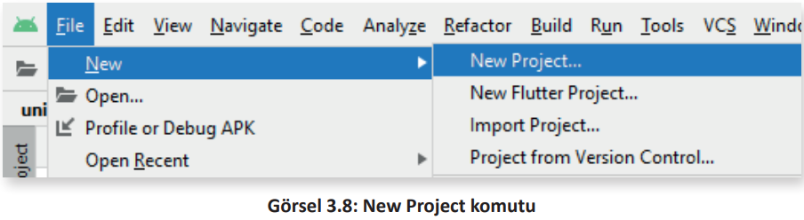
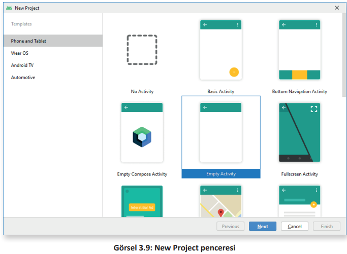
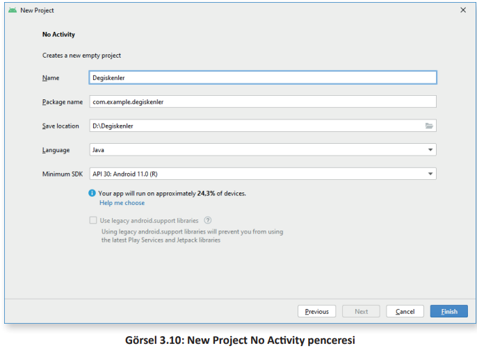
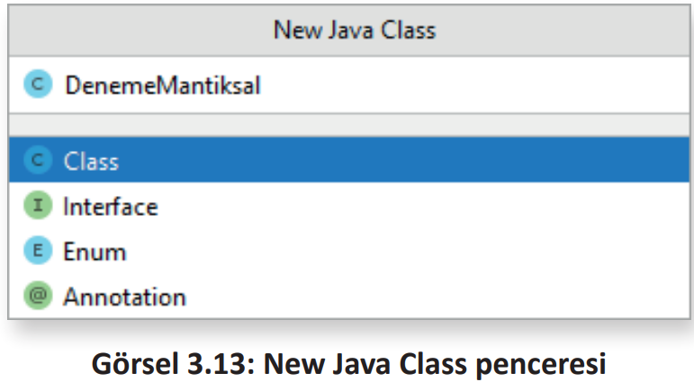
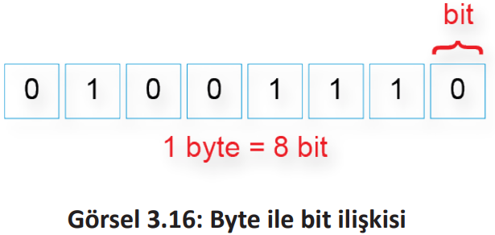
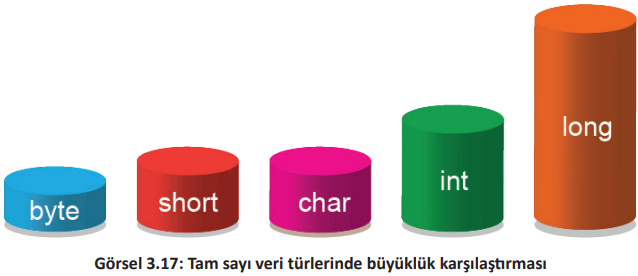
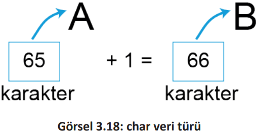

<h1 style="color:#ffc034">3.3. VERİ TİPLERİ</h1>

- <a href="#3.3.1.">3.3.1. İlkel (Temel) Veri Tipleri</a>
- <a href="#3.3.2.">3.3.2. Referans Veri Tipleri</a>
  
Java programlama dili, statik ve kesin olarak yazılmış (Strongly Typed) bir programlama dili olarak tanımlanır. Bu durum, değişkenin oluşturulması sırasında değişken türünün tanımlaması gerektiği ve daha sonra değişken türünün değiştirilemeyeceği anlamına gelir. Değişken türü ile değişkenin değeri farklı kavramlardır.

Java'da ilkel (primitive) veri tipleri ve referans veri tipleri olmak üzere iki değişken grubu vardır (Görsel 3.7).
<div style="display:block;text-align:center">


</div>

<h2 id="3.3.1." style="color:#ffc034">3.3.1. İlkel (Temel) Veri Tipleri</h2>

İlkel veri tipleri, içinde bir seferde tek bir değer tutan veri tipleridir. Java programlama dilinde ilkel veri tipleri program içinde ilk oluşturuldukları andan itibaren bir değere sahip olmak zorundadır

**NOT**: 

>İlkel veri tipleri küçük harflerle yazılır. 

<h3 id="3.3.1." style="color:#ffc034">3.3.1.1. Mantıksal Veri Tipi</h3>

Java'da boolean olarak isimlendirilen bir adet mantıksal veri tipi vardır.

**boolean**: boolean veri tipinin true (doğru) ve false (yanlış) olmak üzere sadece iki değeri vardır. boolean veri tipi, evet veya hayır şeklinde cevaplanabilecek soruların cevapları şeklinde düşünülebilir. 

**1. UYGULAMA**: İşlem adımlarına göre ilkel veri tiplerinin kullanıldığı bir uygulamayı tasarlayınız.

**1. Adım**: Mobil uygulama geliştirme programında File menüsünden New>New Project komutunu tıklayınız (Görsel 3.8).
<div style="display:block;text-align:center">


</div>


**2. Adım**: New Project penceresinden Empty Activity seçeneğini seçip Next düğmesine tıklayınız (Görsel 3.9).
<div style="display:block;text-align:center">


</div>

**3. Adım**: Ekrana gelen pencereden Name kısmına uygulamanıza vereceğiniz adı giriniz. Projenin kaydedileceği yolu Save Location kısmına giriniz. Finish düğmesine basınız (Görsel 3.10).
<div style="display:block;text-align:center">


</div>

**4. Adım**: Project penceresinde app>java üzerine sağ tıklayıp New>Java Class'ı tıklayınız (Görsel 3.11).
<div style="display:block;text-align:center">


</div>

**5. Adım**: Choose Destination Directory penceresinde sınıfınızın kaydedileceği klasör olarak app\src\main\java'yı seçiniz ve OK düğmesine tıklayınız (Görsel 3.12).
<div style="display:block;text-align:center">


</div>

**6. Adım**: New Java Class penceresinde Name kısmına "DenemeMantiksal" yazarak yeni bir sınıf oluşturunuz (Görsel 3.13). 
<div style="display:block;text-align:center">


</div>

**NOT**

>Java'da sınıf isimleri büyük harfle başlar.

**7. Adım**: DenemeMantiksal sınıfı içine şu kodu yazınız:

```java
public class DenemeMantiksal {
    public static void main(String[] args) {
        boolean degisken1 = true;
        System.out.println(degisken1);
    }
}
```

**NOT**: 


>```java 
>public static void main(String[ ] args)
>``` 
>yapısının oluşturulması için mobil uygulama geliştirme programında **main** yazılıp TAB tuşuna basılmalıdır.

**NOT**: 

>```java 
>System.out.println
>``` 
>kendisine iletilen bilgiyi yazdırmak için kullanılır.

**NOT**: 

>```java 
>System.out.println
>```  
>yapısının oluşturulması için mobil uygulama geliştirme programında **sout** yazılıp TAB tuşuna basılmalıdır.

**8. Adım**: Yazılan programı çalıştırmak için Run menüsünden Run "...." with Coverage komutunu tıklayınız (Görsel 3.14). Aynı işlem, kod editöründeki yeşil çalıştırma düğmesine tıklanarak da gerçekleştirilebilir. Proje, Run komutuyla çalıştırılırsa hata penceresiyle karşılaşılır. Bunun nedeni, bir Android yaşam döngüsünde projeyi çalıştırmak için main fonksiyonunun olmamasıdır. 
<div style="display:block;text-align:center">


</div>

**9. Adım**: Cover penceresinde çalışan kodun çıktısını inceleyiniz(Görsel 3.15).
<div style="display:block;text-align:center">


</div>

>**SIRA SİZDE**:
>
>"degisken2" adında yeni bir değişken tanımlayarak, değişkenin içine **false** değerini aktarıp yazdırınız.
>
>**DEĞERLENDİRME**
>
>Çalışmanız aşağıda yer alan kontrol listesi kullanılarak değerlendirilecektir. Çalışmanızı yaparken değerlendirme ölçütlerini dikkate alınız.
>
><div style="text-align:center;"><b>KONTROL LİSTESİ</b></div>
>
>| DEĞERLENDİRME ÖLÇÜTLERİ                                    | EVET | HAYIR |
>| ---------------------------------------------------------- | ---- | ----- |
>| 1. New Project komutunu tıkladı.                           |
>| 2. Empty Activity proje türünü seçti.                      |
>| 3. Uygulama adını belirledi.                               |
>| 4. Project penceresinde New Java Class komutunu seçti.     |
>| 5. Java sınıfı için hedef klasör seçti.                    |
>| 6. Java sınıfına "DenemeMantiksal" adını belirledi.        |
>| 7. Mantıksal değişken oluşturup değişkenin değerini atadı. |
>| 8. Run with Coverage komutuyla uygulamayı çalıştırdı.      |
>| 9. Cover penceresinde uygulama çıktısını gözlemledi.       |

<h3 style="color:#ffc034;">3.3.1.2. Tam Sayı Veri Tipleri</h3>

Değer olarak tam sayıları içinde barındırabilen veri tipleridir. Büyüklüklerine göre farklı sayı aralıklarına sahiptirler. 

**NOT**

>Bilgisayarlardaki en küçük veri boyutu bit'tir. Bitler 0 veya 1 ile temsil edilir (Görsel 3.16).
<div style="display:block;text-align:center">


</div>

Tam sayı veri türleri şunlardır (Tablo 3.1):

- **byte**: Değeri -128 ile 127 arasında olabilen tam sayı veri tipidir. Hafızada 1 byte (8 bit) yer
kaplar.

- **short**: Değeri -32.768 ile 32.767 arasında olabilen tam sayı veri tipidir. Hafızada 2 byte yer
kaplar.

- **int**: Değeri -2.147.483.648 ile 2.147.483.647 arasında olabilen tam sayı veri tipidir. Hafızada 4 byte yer kaplar. Programcılıkta en çok kullanılan tam sayı veri tipidir.

- **long**: Değeri -9.223.372.036.854.775.808 ile 9.223.372.036.854.775.807 arasında olabilen
tam sayı veri tipidir. Hafızada 8 byte yer kaplar.

- **char**: Türkçe karakter anlamına gelen İngilizce Character kelimesinin kısaltmasıdır. Bu değişken, içinde Unicode olarak sadece bir karakter barındırır. Değer aralığı 0 ile 65.535 arasındadır. Hafızada 2 byte yer kaplar. 

<div style="font-weight:bold;text-align:center;">Tablo 3.1: Tam Sayı Veri Türleri</div>

| Tam Sayı Türü | Kapladığı Alan | Değer Aralığı                                  |
| ------------- | -------------- | ---------------------------------------------- |
| byte          | 1 byte (8 bit) | -127,…,127                                     |
| short         | 2 byte         | -32768,…,32767                                 |
| int           | 4 byte         | -2147483648,…,2147483647                       |
| long          | 8 byte         | -9223372036854775808,…,9223372036854775807     |
| char          | 2 byte         | 0,…,65535 arası Unicode ile kodlanmış karakter |

Tam sayı veri tipleri büyüklükleri Görsel 3.17'de verilmiştir.
<div style="display:block;text-align:center">


</div>

Unicode, her bir karakterin sayısal olarak ifade edildiği endüstri standardıdır. Örnek olarak Unicode ile kodlanmış A karakterinin değeri 65"tir.

Tanımlanan bir char veri türü, hafızada değer olarak sayısal şekilde ifade edilir. Bundan dolayı char veri tipi, tam sayı veri tipleri içinde gruplandırılır.

Değişkenin tipi, değişken üzerinde gerçekleştirilecek işlemleri de belirtir. "char" veri tipi sayısal olduğu için üzerinde aritmetiksel işlemler gerçekleştirilir (Görsel 3.18). 
<div style="display:block;text-align:center">


</div>

**NOT**:

>Herhangi bir metin editörü açılıp, klavyeden Alt tuşu basılıyken klavyenin sağ tarafındaki rakamlardan 65 yazılarak Alt tuşu bırakıldığında A harfi elde edilir. Klavye üzerinde olmayan karakterler bu yolla yazılabilir.

**ETKİNLİK** : Verilen karakterleri ASCII tablosundan bulup yazınız.

| Karakter | ASCII Kodu |
| -------- | ---------- |
| ~        |            |
| &        |            |
| \|       |            |
| @        |            |


**ETKİNLİK**: Sırasıyla 77, 69 ve 66 değerlerine sahip char veri tipleri ile oluşan kelimeyi yazınız.

| ASCII Kodu | Karakter |
| ---------- | -------- |
| 77         |          |
| 69         |          |
| 66         |          |

**2. UYGULAMA**: İşlem adımlarına göre tam sayı veri tiplerinin kullanıldığı bir uygulamayı tasarlayınız.

**1. Adım**: "DenemeTamSayilar" adında yeni bir sınıf oluşturunuz.\
**2. Adım**: DenemeTamSayilar sınıfı içine şu kodu yazınız:

```java
public class DenemeTamSayilar {
    public static void main(String[] args) {
        byte kucukSayi = 127;
        short kisaSayi = 32767;
        int tamSayi = 2147483647;
        long uzunSayi = 9223372036854775807L;
        System.out.println("byte: "+ kucukSayi);
        System.out.println("short: " + kisaSayi);
        System.out.println("int: " + tamSayi);
        System.out.println("long: " + uzunSayi);
    }
}
```

**NOT**:

>Java programlama dilinde, long veri türünde yazılan sayının sonuna büyük L harfi yazılır. Java, sayının sonuna L yazılmaz ise sayıyı otomatik olarak int veri türüne çevirmeye çalışır. Sayı, int veri türünün alabileceği değerler dışına taşarsa program hata verir

**3. Adım**: Yazdığınız kodu Run menüsünden Run "DenemeTamSayilar.main()" with Coverage komutuyla çalıştırınız.

**Ekran Çıktısı** 

>byte: 127\
>short: 32767\
>int: 2147483647\
>long: 9223372036854775807

>**SIRA SİZDE**
>
>İşlem adımlarına göre ikinci uygulamayı yeniden tasarlayınız.
>- Uygulamadaki uzunSayi adlı değişkenin değerini 255 şeklinde değiştirip çalıştırınız.
>
>- Uygulamadaki uzunSayi adlı değişkenin değerini 2147483648 şeklinde değiştirip çalıştırınız.
>
>- Uygulamadaki uzunSayi adlı değişkenin değerini 2147483648L şeklinde değiştirip çalıştırınız.
>
>Sonuçları tabloya yazınız.
>
>| Değer       | Sonuç |
>| ----------- | ----- |
>| 255         |
>| 2147483648  |
>| 2147483648L |
>
>**DEĞERLENDİRME**: 
>
>Çalışmanız aşağıda yer alan kontrol listesi kullanılarak değerlendirilecektir.Çalışmanızı yaparken değerlendirme ölçütlerini dikkate alınız.
>
><div style="text-align:center;"><b>KONTROL LİSTESİ</b></div>
>
>| DEĞERLENDİRME ÖLÇÜTLERİ                                              | EVET | HAYIR |
>| -------------------------------------------------------------------- | ---- | ----- |
>| 1. Değişkenin değerini 255 olarak değiştirdi.                        |
>| 2. Uygulama sonucunu 255 olarak buldu.                               |
>| 3. Değişkenin değerini 2147483648 olarak değiştirdi.                 |
>| 4. Uygulama sonucu olarak "integer number too large" hatasını buldu. |
>| 5. Değişkenin değerini 2147483648L olarak değiştirdi.                |
>| 6. Uygulama sonucunu 2147483648 olarak buldu.                        |

**3. UYGULAMA**: İşlem adımlarına göre char veri tipinin kullanıldığı bir uygulamayı tasarlayınız.

**1. Adım**: "DenemeChar" adında yeni bir sınıf oluşturunuz.\
**2. Adım**: DenemeChar sınıfı içine şu kodu yazınız:

```java
public class DenemeChar {
    public static void main(String[] args) {
        char karakter = 'A';
        System.out.println("Karakter: " + karakter);
        karakter = 'A' + 1;
        System.out.println("Karakter: " + karakter);
    }
}
```

**3. Adım:** Yazdığınız kodu Run menüsünden Run "DenemeChar.main()" with Coverage komutuyla
çalıştırınız.

**Ekran Çıktısı** 

>Karakter: A\
Karakter: B

>**SIRA SİZDE**
>
>Üçüncü uygulamadaki toplama kısmında yer alan sayıyı artırarak çıkışı küçük harfle 'a' olacak şekilde veren sayıyı bulunuz (25 ile 35 arasındaki sayıları deneyiniz.). 
>
>| Sayı |
>| ---- |
>|      |
>
>**DEĞERLENDİRME**: 
>
>Çalışmanız aşağıda yer alan kontrol listesi kullanılarak değerlendirilecektir.Çalışmanızı yaparken değerlendirme ölçütlerini dikkate alınız.
>
><div style="text-align:center;"><b>KONTROL LİSTESİ</b></div>
>
>| DEĞERLENDİRME ÖLÇÜTLERİ        | EVET | HAYIR |
>| :------------------------------ | ---- | ----- |
>| 1. Toplam sayısını değiştirdi. |
>| 2. Doğru sayıyı buldu.         |

**4. UYGULAMA**: İşlem adımlarına göre char olarak verilen değişkenin ASCII kodunu bulan bir uygulamayı tasarlayınız.

**1. Adım**: "CharAscii" adında yeni bir sınıf oluşturunuz.\
**2. Adım**: CharAscii sınıfı içine şu kodu yazınız:

```java
public class CharAscii {
    public static void main(String[] args) {
        char karakter = 'a';
        int ascii = (int) karakter;
        System.out.println("Karakter: " + karakter);
        System.out.println("ASCII kodu: " + ascii);
    }
}
```

**3. Adım:** Yazdığınız kodu Run menüsünden Run "CharAscii.main()" with Coverage komutuyla çalıştırınız.

**Ekran Çıktısı**

>Karakter:  a<br> ASCII kodu: 97

>**SIRA SİZDE**:
>
>ASCII kodu verilen int tipindeki değişkenin karakterini bulan bir uygulamayı tasarlayınız. 
>
>**DEĞERLENDİRME**:
>
>Çalışmanız aşağıda yer alan kontrol listesi kullanılarak değerlendirilecektir. Çalışmanızı yaparken değerlendirme ölçütlerini dikkate alınız.
>
><div style="text-align:center;"><b>KONTROL LİSTESİ</b></div>
>
>| DEĞERLENDİRME ÖLÇÜTLERİ                                    | EVET | HAYIR |
>| ---------------------------------------------------------- | ---- | ----- |
>| 1. New Project komutunu tıkladı.                           |
>| 2. Empty Activity proje türünü seçti.                      |
>| 3. Uygulama adını belirledi.                               |
>| 4. Project penceresinde New Java Class komutunu seçti.     |
>| 5. Java sınıfı için hedef klasör seçti.                    |
>| 6. Java sınıfına "AsciiChar" adını belirledi.              |
>| 7. int veri tipinde bir değişken tanımlayarak değer atadı. |
>| 8. char veri tipinde bir değişken tanımladı.               |
>| 9. char değişkenine tür dönüşümü yaparak değer atadı.      |
>| 10. System.out.println komutu ile ASCII kodunu yazdırdı.   |
>| 11. System.out.println komutu ile karakteri yazdırdı.      |
>| 12. Run …. With Coverage ile uygulamayı çalıştırdı.        |
>| 13. Cover penceresinde uygulama çıktısını gözlemledi.      |

<h3 style="color:#ffc034;">3.3.1.3. Ondalık Veri Tipleri</h3>

Değer olarak içinde ondalık sayıları barındıran veri tipleridir (Tablo 3.2).

- float: Değer atanırken sayının sonuna **f** veya **F** yazılır.
  
- double: Değer atanırken sayının sonuna **d** veya **D** yazılır.

**Tablo 3.2: Ondalık Veri Tipleri**

| Ondalık Sayı Türü | Kapladığı Alan | Değer Aralığı          |
| ----------------- | -------------- | ---------------------- |
| float             | 4 byte         | 3.4e-038, … , 3.4e+038 |
| double            | 8 byte         | 1.7e-308, … , 1.7e+308 |

**5. UYGULAMA**: İşlem adımlarına göre ondalık sayı veri tiplerinin kullanıldığı bir uygulamayı tasarlayınız.

**1. Adım**: "DenemeOndalikliSayilar" adında yeni bir sınıf oluşturunuz.\
**2. Adım**: DenemeOndalikliSayilar sınıfı içine şu kodu yazınız:

```java
public class DenemeOndalikliSayilar {
    public static void main(String[] args) {
        float ondalik1 = 1f/3f;
        double ondalik2 = 1d/3d;
        System.out.println("float: (1/3) = " + ondalik1);
        System.out.println("double: (1/3) = " + ondalik2);
    }
}
```

**3. Adım**: Yazdığınız kodu Run menüsünden Run "DenemeOndalikliSayilar.main()" with Coverage
komutuyla çalıştırınız.

**Ekran Çıktısı**

>float: (1/3) = 0.33333334 <br>double: (1/3) = 0.3333333333333333

<h2 id="3.3.2.">3.3.2. Referans Veri Tipleri</h2>

İlkel ve referans değişkenler, akıllı cihazın stack hafıza adı verilen bölümünde bulunur. Görsel 3.19'un a ile belirtilen kısmında görüldüğü gibi ilkel veri tipleri stack hafıza içinde değerlerini barındırır.

İlkel veri tipleri, içinde birden fazla veri barındıramaz. İlkel veri tipi olarak tanımlanmış bir değişkenin boyutu hafızada sabittir, daha sonra değiştirilemez. Uygulama, içinde birden fazla veri tutacak yapılara ihtiyaç duyar. Bu verilerin boyutu sabit değildir. Uygulama çalışırken boyutu artırılabilir şekilde olmalıdır. Referans veri tipleri bu ihtiyaca cevap verir. 

Referans veri tipleri de stack hafızada yer alır. İlkel veri tiplerinden farklı olarak içinde değerleri yoktur. Görsel 3.19'un b ile belirtilen kısmında görüldüğü gibi değer yerine içinde bir hafıza adresi barındırır. 
<div style="display:block;text-align:center">


</div>

Görsel 3.19'daki x değişkeni bir ilkel değişkendir ve stack hafıza içinde yer alır. Değişkenin değerini de kendi içinde barındırır. Boyutu sabittir ve değiştirilemez. Referans veri tipi olan y değişkeni içerik olarak bir adres barındırır. Bu adresin gösterdiği heap hafıza bölümünde uygun alan y değişkeni için ayrılır. Görsel 3.19a'da y referans değişkenin değeri "M" harfidir. Buna uygun olarak heap hafızada bir harflik alan ayrılır. Görsel 3.19b'de y referans değişkenin değeri "MEB" olarak değiştirilmiştir. Buna uygun olarak heap bölümünde ayrılan alan da artırılmıştır.

En çok kullanılan referans tipi, karakter dizisidir (String). String, içinde birden fazla karakter barındırabilen referans veri tipidir.

<span style="font-weight:bold; padding-top:1px; padding-bottom:1px; padding-left:8px; padding-right:8px; background-color:#FFEEC4;">ÖRNEK</span>

String isim = "Aziz Emir";