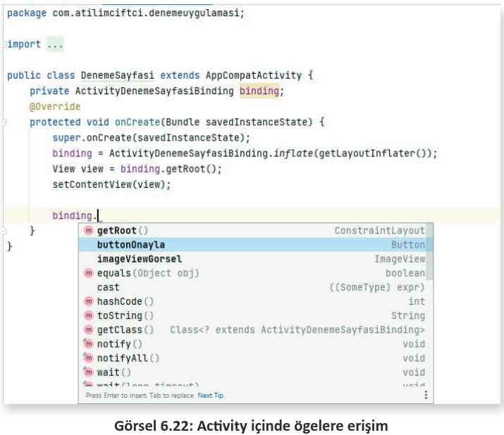

# 6.2 VIEW BINDING

View Binding, kullanıcı arayüzü (UI) bileşenlerini içinde barındıran layout dosyası ile ".java" uzantılı kod dosyasını birbirine bağlamayı hızlı ve kolay bir biçimde sağlayan Google’a ait bir kütüpha nedir. Bu tarz kütüphanelere de Jetpack ögesi ismi verilmiştir. Görsel 6.18’e benzer bir biçimde, UI’deki (kullanıcı arayüzü) tüm farklı görsel ögelerin bir kütüphanede belirli bir düzen içinde tutulması mantığı ile çalışır.

<div style='display:block;text-align:center'>


</div>

View Binding sayesinde layout dosyası içindeki mobil uygulama tasarım ekranına eklenen ögeler, "findViewBinding" metoduna gerek kalmadan her yerden erişilebilir hâle getirilir. Bu sayede hem hızlı bir çalışma ortamı sağlanır hem de birçok gereksiz kod yazılmaz. Küçük uygulamalarda fark edilmese de büyük uygulamalarda yer alan birçok ögenin findViewBinding ile tek tek eklenmesi çok uygun değildir.

View Binding kütüphanesinden önce çıkartılan ve bu işi yapan Data Binding kütüphanesi de vardır. Data Binding kullanımı, View Binding kadar esnek değildir. Derleme işlemi sırasında zaman açısından olumsuzluklara yol açar. Bu nedenle View Binding kütüphanesi üretilmiş ve bu sorunların da önüne geçilmiştir.

**NOT:**

>Jetpack, mobil uygulama geliştiricilerin daha kaliteli uygulamalar yazabilmesi Google tarafından üretilen, kütüphane ve araçları içinde barındıran bir pakettir. Daha detaylı bilgi için [https://developer.android.com/docs](https://developer.android.com/docs "Android Studio Resmi WEB sitesi") adresini ziyaret ederek dokümanları inceleyiniz.

View Binding kullanımı için [https://developer.android.com/topic/libraries/view-binding](https://developer.android.com/topic/libraries/view-binding "Android Studio Resmi WEB sitesi") adresine bakılırsa (Mobil uygulama geliştirme aşamasında yenilik ve kullanımdaki güncelleştirmeler, Google tarafından bu sitede paylaşılmaktadır.) **Setup instruction** seçeneğinde, Java dilinde geliştirme yapıldığı için **Groovy** seçeneği seçilir. Görünüm bağlama modül düzeyinde yapılır. Bu bağlamayı etkinleştirmek için de modül düzeyindeki **build.gradle** (Module) dosyası içinde viewBinding true olarak ayarlanır. Bir başka deyişle geliştirilen uygulamada öncelikle build.gradle (Module) dosyası açılır ve şu kod eklenir:

```groovy
android {
    ...
    buildFeatures {
        viewBinding true
    }
}
```

**NOT:**

>viewBinding kodu hâlihazırda android bloklarının arasına eklenir. Yeniden bir android bloku açmaya gerek yoktur. Ayrıca buildFeatures blokları da varsa tekrar bu bloku açmaya gerek yoktur. buildFeatures blokları içine viewBinding true yazılması yeterlidir.

View Binding için doküman sayfasında aşağıya inildiğinde Activity’de kullanımın nasıl olduğu belirtilir. Bu bölümde Java’ya tıklandığında şu kodlarla karşılaşılır:

```java
private ResultProfileBinding binding;

@Override
protected void onCreate(Bundle savedInstanceState) {
    super.onCreate(savedInstanceState);
    binding = ResultProfileBinding.inflate(getLayoutInflater());
    View view = binding.getRoot();
    setContentView(view);
}
```

Kod içindeki ResultProfileBinding bölümü, build.gradle dosyasına eklenen viewBinding özelliğisayesinde Binding türünden oluşturulan bir sınıfı temsil eder. Geliştirilen mobil uygulamasındakullanılan java uzantılı her Activity için bu Binding sınıfı oluşturulmuş durumdadır. Yapılması gereken işlem, açılan Activity’nin sınıf blokları içindeyken bu sınıftan bir nesne türetmektir. "privateBinding" yazılırsa Görsel 6.19’da görüldüğü gibi önerilerde ilgili Activity’ye uygun Binding sınıfıçıkacaktır. Activity ismi ile Activity ismine eklenmiş Binding kelimesi ile görülen (ör. ActivityDenemeSayfasiBinding) kütüphaneye tıklanarak seçilir. Sonrasında binding ismi ile bir nesne oluşturulur.

**NOT:**

>Nesne ismi önemli olmamakla birlikte profesyonel düzeyde uygulama geliştiriciler "binding" şeklinde kullanır. Her Activity için bu işlem bir defa yapılacağından ve "private" olarak tanımlanıp sadece bu Activity üzerinden erişilebileceğinden bir sorun oluşturmaz.

<div style='display:block;text-align:center'>


</div>


Sonrasında mobil uygulamanın içinde bulunulan Activity’ye ait "onCreate" yaşam döngüsünde değişiklik yapılması istenir. "`super.onCreate(savedInstance);`" kodu yerinde kalmakla birlikte, `setContentView(R.layout.activity_deneme_sayfasi);` kodunun değiştirilmesi gerekir. Uygulamanın default düzeyinde contentView, layout üzerinde yer alan xml uzantılı kullanıcı arayüzüne bağlanır fakat bu bağlantı kopartılarak yeni bir bağlantı oluşturulur. Activity’nin onCreate yaşam döngüsü blokları arasında bulunan setContentView(R.layout.activity_deneme_sayfasi); silinerek "`super.onCreate(savedInstanceState);`" altına kodlar şu şekilde eklenir:

```java
binding = ActivityDenemeSayfasiBinding.inflate(getLayoutInflater());
View view = binding.getRoot();
setContentView(view);
```

**NOT:**

>"ActivityDenemeSayfasiBinding", Activity’ye eklenen kütüphanenin adıdır. Oluşturulanher Activity’de farklılık gösterir. Oluşturulan Activity ismi neyse o isimle değişiklik gösterir. View kırmızı gösterirse de üzerine farenin sol tuşu ile tıklanıp "Alt+Enter" tuşlarına basılarak View kütüphanesi Activity’ye dâhil edilir.

Eklentinin son şekli Görsel 6.20’de verilmiştir.

<div style='display:block;text-align:center'>


</div>

Bu işlemden sonra layout üzerindeki her ögeye findViewById yazılmadan erişilebilir. İşlemin doğruluğunu denemek amacıyla "activity_deneme_sayfasi.xml" isimli layout dosyasına Görsel 6.21’de olduğu gibi bir imageView, bir de button nesnesi eklenir. Bu ögelere erişim sağlamak için "DenemeSayfasi.java" isimli Activity’de, **binding**. yazıldığında ögelerin erişilebilir olduğu görülür (Görsel 6.22).

<div style='display:block;text-align:center'>


</div>

<div style='display:block;text-align:center'>


</div>

**11. UYGULAMA:** İşlem adımlarına göre butonlara tıklandığında ImageView üzerinde fotoğrafların değiştiği ve altında da fotoğraflara ait bilgilerin oluştuğu uygulamayı viewBinding kullanarak yapınız.

**1. Adım**: Yeni bir proje açarak projenin ismine "GorselDegistir" yazınız. "activity_main.xml" içine Görsel 6.23’te görüldüğü gibi bir adet ImageView, bir adet TextView ve iki adet Button ögesi ekleyiniz. Geri buttonunun onClick özelliğine "**geriGelme**", ileri buttonunun onClick özelliğine de "**ileriGitme**" yazınız. ConstraintLayout kullanarak Görsel 6.23’tekine benzer şekilde ögeleri kilitleyiniz.

<div style='display:block;text-align:center'>


</div>

**2. Adım:** İnternetten telifsiz olarak kullanılan dört adet görsel bulunuz. Uygulamada balon, kuş, çiçek ve kelebek görselleri kullanınız. Görsellerinize mümkün olduğunca basit isimler (balon.jpg, cicek.jpg vb.) veriniz ve görselleri isimlendirirken Türkçe karakter kullanmayınız. Mobil uygulama geliştirme platformunda tasarlanan uygulamaların uzun ve karmaşık isimlendirmelerde hatalara yol açtığını unutmayınız.

**3. Adım:** Bulduğunuz görselleri isimlendirdikten sonra sürükle bırak ile res klasörü altındaki drawable klasörüne atınız. Klasör ismi olarak drawable-v24 vb. gelirse -v24’ü siliniz, klasörün isminin sadece drawable olmasına dikkat ediniz. Ögeler Görsel 6.24’te olduğu gibi geldikten sonra ögelere tıklayarak açınız ve görsellerin kullanılabilir olduğundan emin olunuz. Kullanılmayan görsel varsa o görseli silip yerine yenisini ekleyiniz.

<div style='display:block;text-align:center'>


</div>

**4. Adım:** Gradle Scripts altındaki build.gradle (Module) dosyasını açınız ve android blokları arasına girerek viewBinding etkinleştirmek için gereken şu kodu ekleyiniz:

```goovy
buildFeatures{
    viewBinding true;
}
```

Daha sonra Görsel 6.25’te görüldüğü gibi mobil geliştirme platformunun sağ üst köşesinde çıkan Sync Now kısmına tıklayarak projeye senkronize edilmesini sağlayınız. İşlem bittikten sonra build. gradle’ı kapatınız.

<div style='display:block;text-align:center'>


</div>

**5. Adım:** MainActivity içine dönerek MainActivity sınıfının blokları arasına giriniz ve "private Bindig" yazınız. Öneriler arasında gelen "private ActivityMainBinding"e tıklayınız ve boşluk bırakıp, binding yazarak nesnesini de belirtiniz.

**6. Adım:** MainActivity sınıfındayken onCreate yaşam döngüsüne giriniz ve "`setContentView(R.layout.activity_main);`" kodunu siliniz. Aynı blok içinde "`super.onCreate(savedInstanceState);`"kodunun altına geliniz ve şu kodları ekleyiniz:

```java
binding = ActivityMainBinding.inflate(getLayoutInflater());
View view = binding.getRoot();
setContentView(view);
```

İşlem adımlarının sonucu Görsel 6.26’da verilmiştir.

<div style='display:block;text-align:center'>


</div>

**7. Adım:** java klasörü altındaki paket ismine sağ tuş ile tıklayarak yeni bir sınıf oluşturunuz. Sınıfa "Gorsel" ismini veriniz. Bu sınıfta hem görseller hem de görsellerin bilgileri tutulacaktır. Açılan sınıf içine bir adet String veri tipinde "bilgi" isimli değişken, bir adet int veri tipinde "siraNo" isimli bir değişken bir de "int" veri tipinde "foto" isimli bir değişken tanımlayınız.

Görselleri tutacağınız foto isimli değişkenin int olmasının nedeni, drawable klasörüne atılan görsellerin her birine aslında birer "id" verilmesinden kaynaklanır. Bu numaralara Görsel 6.27’de görüldüğü gibi MainActivity’deki onCreate metodu içinde "**R.drawable.**" yazılırsa erişilebilir. Görsellere ait id’ler bu sınıf içinde tutulur.

<div style='display:block;text-align:center'>


</div>

**8. Adım:** Gorsel sınıfının içine bir constructer oluşturunuz. Constructer, bir sınıf çağrıldığında ilk olarak çalıştırılacak metottur. Kodlarınızı şu şekilde yazınız:

```java
public Gorsel(String bilgi,int siraNo,int foto){
    this.bilgi=bilgi;
    this.siraNo=siraNo;
    this.foto=foto;
}
```
Görsel sınıfının içeriği Görsel 6.28’de verilmiştir.

<div style='display:block;text-align:center'>


</div>

**9. Adım:** MainActivity.java sınıfının içine dönünüz. onCreate metodu içinde görselleri ve bilgileri sınıf üzerine ekleyiniz. Kodları şu şekilde yazınız:

```java
Gorsel balon = new Gorsel("Sarı Balon",1,R.drawable.balon);
Gorsel cicek = new Gorsel("Mavi Çiçek",2,R.drawable.cicek);
Gorsel kelebek = new Gorsel("Mavi Kelebek",3,R.drawable.kelebek);
Gorsel kus = new Gorsel("Yuvada Kuş",4,R.drawable.kus);
```

İşlemden sonra bu verileri bir ArrayListe yüklemek gerektiğini unutmayınız. Bunun için onCreate metodunun dışına çıkıp, onCreate metodunun üzerinde fakat MainActivity blokları arasında olacak şekilde "`ArrayList<Gorsel> gorselArrayList;`" yazarak Gorsel sınıfından türetilen nesneleri tutacak gorselArrayList isimli bir ArrayList tanımlayınız. Tekrar onCreate içine girerek bu ArrayListi "`gorselArrayList = new ArrayList<>();`" kodlarını yazarak başlatınız. Gorsel sınıfından oluşturulan nesnelerin altında olacak biçimde de bu ArrayListe verileri gönderiniz. Kodları şu şekilde yazınız:

```java
gorselArrayList.add(balon);
gorselArrayList.add(cicek);
gorselArrayList.add(kelebek);
gorselArrayList.add(kus);
```
Uygulama açılır açılmaz ilk görselin (0. kayıtlı olan balon) imageView üzerinde, ilk kayda ait bilginin de textView ekranında görünmesi için onCreate blokları arasında şu kodları yazınız:

```java
binding.imageViewGorsel.setImageResource(gorselArrayList.get(0).foto);
binding.textViewBilgi.setText("Bilgi : " + gorselArrayList.get(0).bilgi);
```

Ardından buttona tıkladıkça sıra numaralarını tutması için MainActivityde int veri tipinde **seciliSiraNo** isminde bir değişken tanımlayınız ve değişkenin değerini onCreate içinde **0** olarak atayınız. İşlem sonucu Görsel 6.29’da verilmiştir.

<div style='display:block;text-align:center'>


</div>

**10. Adım:** MainActivity.java dosyası içinde MainActivity sınıfı blokları arasına onCreate metodundan çıkarak "geriGelme" ve "ileriGitme" metotlarını hazırlayınız. Görünüme tıklandığı zaman çalışacağı için metotlar, View sınıfından view nesnesi şeklinde bir adet parametre alacaktır. Metotlar içinde secilenSiraNo değerini "geriGelme" metodunda 1 azaltıp "ileriGitme" metodunda 1 artırınız. Bu değişken sayesinde hangi ArrayList bilgisinin getirileceği bilinir. Ayrıca içeride birer kontrol kodu yazarak 0’dan büyük olmamasını veya ArrayListin eleman sayısından büyük olmamasını kontrol ediniz. "geriGelme" metodu için kodlar şu şekildedir:

```java
public void geriGelme(View view){
    if(seciliSiraNo>0){
        seciliSiraNo--;
        binding.imageViewGorsel.setImageResource(gorselArrayList.get(seciliSi-raNo).foto);
        binding.textViewBilgi.setText("Bilgi : " + gorselArrayList.get(secili-SiraNo).bilgi);
    }
}
```
**11. Adım:** "ileriGitme" metodu için kodlar şu şekildedir:

```java
public void ileriGitme(View view){
    if(seciliSiraNo<gorselArrayList.size()-1){
        seciliSiraNo++;
        binding.imageViewGorsel.setImageResource(gorselArrayList.get(seciliSi-raNo).foto);
        binding.textViewBilgi.setText("Bilgi : " + gorselArrayList.get(secili-SiraNo).bilgi);
    }
}
```

Uygulama çalıştırıldığındaki görüntü Görsel 6.30’da verilmiştir.

<div style='display:block;text-align:center'>


</div>

**NOT:**

gorselArrayList.size() metodu, ArrayListin içindeki eleman sayısını verir. Yazılan bu metottan dönen değer 4’tür fakat 4. eleman, 3. indist numarasında olduğu için program son görselde hata verir. Bu hatayı önlemek için **gorselArrayList.size()-1** ifadesi kullanılır.

>**SIRA SİZDE:**
>
>Sınıf arkadaşlarınızdan 10 tanesinin "Okul Numarası, Ad, Soyad, Sınıf ve Fotoğraf" bilgilerini "Arkadaslar" isimli bir class ile kodlama esnasında kaydedip, bu bilgileri mobil ekranda buttonlar ile tek tek ekrana getiren uygulamayı viewBinding yöntemini de kullanarak tasarlayınız.
>
>**DEĞERLENDİRME:** 
>
>Çalışmanız aşağıda yer alan kontrol listesi kullanılarak değerlendirilecektir. Çalışmanızı yaparken değerlendirme ölçütlerini dikkate alınız.
>
><div style="text-align:center;"><b>KONTROL LİSTESİ</b></b>
>
>| DEĞERLENDİRME ÖLÇÜTLERİ                                                                                 | EVET | HAYIR |
>| ------------------------------------------------------------------------------------------------------- | ---- | ----- |
>| 1. "Arkadaslar" isimli yeni bir sınıf oluşturdu.                                                        |
>| 2. "Arkadaslar" isimli sınıfta belirtilen alanları oluşturdu.                                           |
>| 3. "Arkadaslar" isimli sınıfta Constructor oluşturdu.                                                   |
>| 4. Görselleri drawable içine uygun biçimde yükledi.                                                     |
>| 5. activity_main üzerinde gereken tasarımı oluşturdu.                                                   |
>| 6. viewBinding yapısını oluşturdu.                                                                      |
>| 7. MainActivity sınıfında Arkadaslar sınıfından nesne türeterek içeriğindeki bilgilerin girişini yaptı. |
>| 8. Buttonlara ait metotları oluşturdu.                                                                  |
>| 9. Metotlar içinde bilgileri ögeler üzerine yükledi.                                                    |