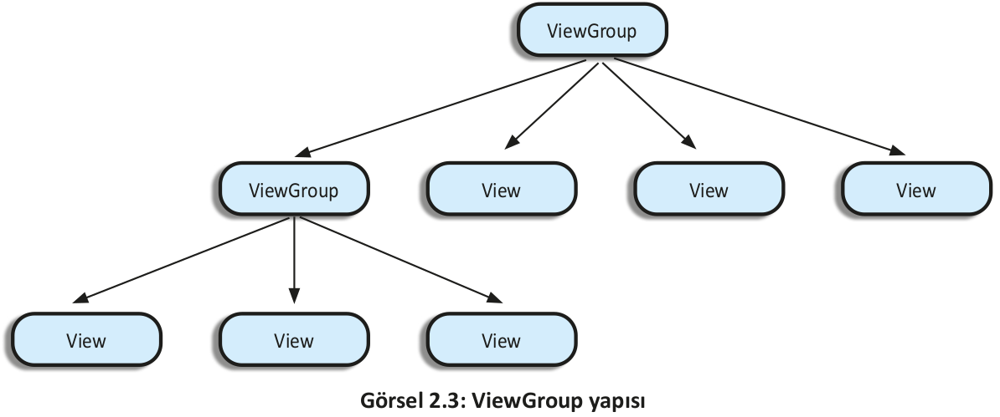
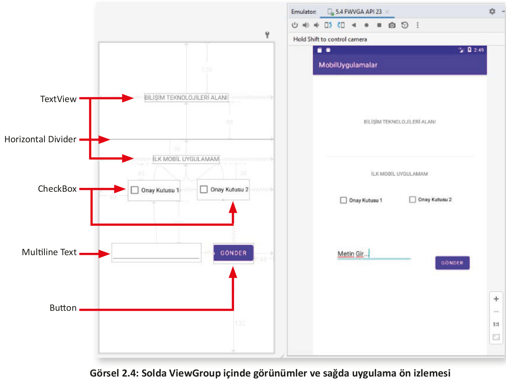

# 2.3. VIEW

Bir mobil uygulamada kullanıcıyla tüm etkileşim, kullanıcı arabirimi (user interface-UI) üzerinden olur. Kullanıcı arabirimi tasarlamak için Android SDK bir dizi hazır View (Görünüm) sağlar. Bu hazır görünümlerden bazıları; Button (Düğme), CheckBox (Onay kutusu), ProgressBar (İlerleme çubuğu) ve TextView (Metin görünümü) sınıflarıdır. Görünümler, aletler (widgets) veya bileşenler (components) isimleriyle de ifade edilir.

Görünümler, görünmez kalıp niteliğindeki kapsayıcıların içine yerleştirilir. Bu görünmez kalıba ViewGroup ismi verilir. Bir veya daha fazla görünüm, ViewGroup içinde yer alabilir. ViewGroup, görünümlerin yerleştirilebildiği ve konumlarının belirlenebildiği özel bir görünümdür. ViewGroup içinde başka ViewGrouplar da bulunur (Görsel 2.3).

Bir mobil uygulamada her ne kadar kök bileşen activity olsa da bir activityde birden fazla görünüm ve ViewGroup nesnesi olabilir. Görünüm, ekranda görülen tüm bileşenlerin üst sınıfıdır.Buna ViewGroup da dâhildir. Görsel 2.4’te sol kısımdaki tasarım ekranında görünmeyen ViewGroup içine yerleştirilmiş farklı viewler yer alır. Görselin sağ tarafında ise uygulamanın emülatörde çalışan hâli görülür. 

