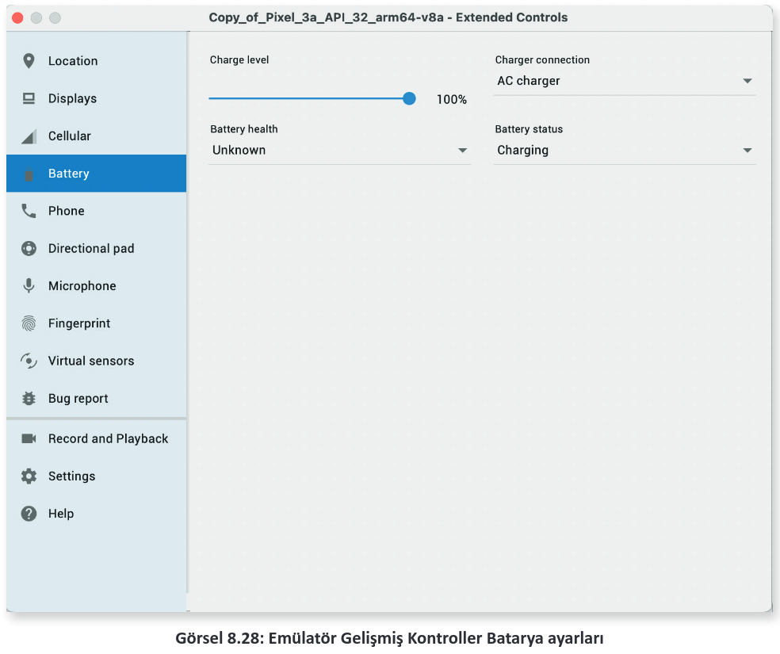

# 8.6. WORKMANAGERLE ÇALIŞMAK

- <a href="#8.6.1.">8.6.1. Kısıtlamaları Tanımlamak </a>
- <a href="#8.6.2.">8.6.2. Görevi Gecikmeli Başlatmak  </a>
- <a href="#8.6.3.">8.6.3. Zincirleme Çalışmak </a>
- <a href="#8.6.4.">8.6.4. Görevleri İzlemek </a>
- <a href="#8.6.5.">8.6.5. Görevlere Dışarıdan Veri Göndermek  </a>

Bazı uygulamalarda periyodik olarak bazı görevlerin yapılması gerekebilir. Bu tür işlemleri yapabilmek için mobil uygulama geliştirme ortamında birçok araç bulunur. WorkManager, zamanlanmış görev işlemlerinin çok kolay bir şekilde yapılması için oldukça uygundur. WorkManager; ertelenebilir görevler, anında yapılan görevler, periyodik olarak çalışan görevler olmak üzere üç türlü çalışmayı sağlar.

WorkManager basit ve tutarlı olmasının yanında çeşitli kurallar belirlenerek de çalıştırılabilir. Planlanmış tüm görevler cihazda bir veri tabanına kaydedilir. Zamanı geldiğinde tüm görevler kısıtlara uygun ise çalıştırılır.

WorkManager kullanabilmek için build.gradle dosyasının dependencies bölümüne şu kodlar eklenmelidir:

```groovy
def work_version = "2.7.1"
implementation "androidx.work:work-runtime:$work_version"
```

WorkerManager, Worker sınıfından türemiş iş sınıflarını kullanır. Tüm işler bu sınıfta yapılır. Worker sınıfı şu şekilde tanımlanır:

```java
public class YedekWorker extends Worker {
    public UploadWorker(@NonNull Context context, @NonNull WorkerParameters params) {
        super(context, params);
    }
    @Override
    public Result doWork() {
        logYedekle();
        return Result.success();
    }
}
```

Worker sınıfında asıl işi yapan doWork metodudur. Görevde gerekli tüm işler burada yapılır. Yapılması gereken tüm işlemler geliştirici tarafından belirtilmelidir. Görev sonunda bir sonuç gönderilmelidir. Görev sonuç çeşitleri şunlardır:
- **Result.success():** Görev başarılı olmuştur.
- **Result.failure():** Görev başarısız olmuştur.
- **Result.retry():** Görev başarısız olmuştur ancak tekrar başlatılabilir.

Görev tanımladıktan sonra WorkRequest nesnesi tanımlanır. WorkRequest, görev türünün nasıl olacağını belirler. Tek seferlik görev için OneTimeWorkRequest nesnesi, periyodik görevler için PeriodicWorkRequest nesnesi seçilir. Bir WorkRequest nesnesi şu şekilde tanımlanır:

```java
WorkRequest yedekleWorkRequest = new OneTimeWorkRequest
    .Builder(yedekWorker.class)
    .build();
```

Günde bir defa çalışacak periyodik bir görev şu şekilde oluşturulur:,

```java
WorkRequest yedekPerioadic=new PeriodicWorkRequest
    .Builder(yedekWork.class,1,TimeUnit.DAYS)
    .build();
```
WorkManager nesnesine WorkRequest nesnesi verilebilir. WorkManager şu şekilde oluşturulur:

```java
WorkManager
    .getInstance(myContext)
    .enqueue(uploadWorkRequest);
```

WorkManager, görev isteklerini enquee metodu ile listeye ekler. Aynı anda birden fazla görev tanımlanabilir. Her görev için bir id numarası otomatik olarak verilir. Görevleri karıştırmamak için görevlere etiket şu şekilde verilir:

```java
WorkRequest yedekWorkRequest = new OneTimeWorkRequest.Builder(yedekWork.class)
    .addTag("yedekle")
    .build();
```

Görevler id numaraları ile çağrıldığı gibi etiketleri ile de çağrılabilir. Görevlerin id ve etiket ile çağrılması şu şekildedir:

```java
WorkManager.getInstance(this).cancelWorkById(yedekleWorkRequest.getId());
WorkManager.getInstance(this).cancelAllWorkByTag("yedekle");
```

<h2 id="8.6.1.">8.6.1. Kısıtlamaları Tanımlamak</h2>

Görevler tanımlanırken görevin çalışması esnasında bazı kısıtlar tanımlanabilir. Örneğin görevin düşük batarya seviyesinde çalışması istenmeyebilir veya sunucuya yedek gönderilirken ağa bağlı olması istenebilir. Bu tür kısıtlar koymak için Constraints nesnesi kullanılır. Bir Constraints nesnesi şu şekilde oluşturulur:

```java
Constraints constraints = new Constraints
    .Builder()
    .setRequiredNetworkType(NetworkType.CONNECTED)
    .setRequiresCharging(true)
    .build();
WorkRequest myWorkRequest = new OneTimeWorkRequest
    .Builder(MyWork.class)
    .setConstraints(constraints)
    .build();
```

Birçok kısıtlama özelliği vardır. Tüm kısıtlamalara [https://developer.android.com/reference/androidx/work/Constraints.Builder](https://developer.android.com/reference/androidx/work/Constraints.Builder "Android Studio Resmi WEB sitesi") internet sitesinden bakılabilir. Tablo 8.1’de önemli bazı kısıtlamalar verilmiştir.

<div style="text-align:center;font-weight:bold">Tablo 8.1: Workrequest Nesnesi Kısıtları</div>

| Kısıt                        | Açıklama                                                           |
| ---------------------------- | ------------------------------------------------------------------ |
| **setRequiresCharging**      | Cihaz şarja bağlıysa görevin yapılmasını sağlar.                   |
| **setRequiresBatteryNotLow** | Cihazın bataryası azsa görevi başlatmaz.                           |
| **setRequiresDeviceIdle**    | Cihaz hiçbir işlem yapmadığı zaman görevin yapılmasını sağlar.     |
| **setRequiresStorageNotLow** | Cihazda yeterince depolama alanı varsa görevin yapılmasını sağlar. |
| **setRequiredNetworkType**   | Cihaz istenen ağa bağlıysa görevin yapılmasını sağlar.             |

<h2 id="8.6.2.">8.6.2. Görevi Gecikmeli Başlatmak</h2>

Görevler istendiği kadar gecikmeli başlatılabilir. Görevler gecikmeli olarak şu şekilde başlatılır:

```java
WorkRequest yedekWorkRequest = new OneTimeWorkRequest
    .Builder(yedekWork.class)
    .setInitialDelay(10, TimeUnit.MINUTES)
    .build();
```

Görevlerde zaman birimleri TimeUnit ile belirlenir. Gecikme tek seferlik görevler için uygulanır, periyodik görevlerde ise sadece ilk görev ertelenir. Tablo 8.2’de tüm TimeUnit birimleri verilmiştir.

<div style="text-align:center;font-weight:bold">Tablo 8.2: Periyodik Görevlerde Kullanılabilen Zaman Türleri</div>

| Birim            | Açıklama    |
| ---------------- | ----------- |
| **NANOSECONDS**  | Nanosaniye  |
| **MICROSECONDS** | Mikrosaniye |
| **MILLISECONDS** | Milisaniye  |
| **SECONDS**      | Saniye      |
| **MINUTES**      | Dakika      |
| **HOURS**        | Saat        |
| **DAYS**         | Gün         |

<h2 id="8.6.3.">8.6.3. Zincirleme Çalışmak</h2>

WorkManager nesnesi ile zincirleme işlemler yapılabilir. Bir görev başlatıldıktan sonra görevin bitmesi takip edilerek başka bir görevin çalıştırılması sağlanabilir. Zincir görevler sadece OneTimeWorkRequest görevleri ile yapılır. Periyodik görevler zincire eklenemez. Zincir bir görev şu şekilde oluşturulur:

```java
WorkManager
    .getInstance(this)
    .beginWith((OneTimeWorkRequest) p1WorkRequest)
    .then((OneTimeWorkRequest) p2WorkRequest)
    .then((OneTimeWorkRequest) p3WorkRequest)
    .enqueue();
```
Zincirleme görevlerde ilk görev bitinceye kadar diğer görevlerin talepleri engellenir. Görevler Result.success() ile biterse bir sonraki göreve geçilir. Herhangi bir görev başarısız olursa sonraki göreve geçilmez. Zincir görev esnasında sırası gelen görev, kısıtlardan birine takılırsa beklemeye alınır. Sonraki göreve geçilmez.

<h2 id="8.6.4.">8.6.4. Görevleri İzlemek</h2>
Görevleri izlemek için WorkManager nesnesinin observe özelliği kullanılır. Bu özellik, mevcut tüm görevler hakkında bilgi alınmasını sağlar. Hangi görevin ne aşamada olduğu observe sayesinde görüntülenir. Observer özelliği şu şekilde kullanılır:

```java
WorkManager
    .getInstance(this)
    .getWorkInfoByIdLiveData(myWorkRequest.getId())
    .observe(this, new Observer<WorkInfo>() {
            @Override
            public void onChanged(WorkInfo workInfo) {
                if(workInfo.getState() == WorkInfo.State.BLOCKED)
                    Toast.makeText(MainActivity.this, "Görev bloklandı",Toast.LENGTH_SHORT).show();
            }
        });
```

Görevler ile ilgili tüm bilgilere WorkInfo nesneleri ile ulaşılabilir.

<h2 id="8.6.5.">8.6.5. Görevlere Dışarıdan Veri Göndermek</h2>

Görevlere dışarıdan veri göndermek için Data sınıfı kullanılır. Data sınıfı ile göreve veri şu şekilde gönderilir:

```java
Data data = new Data.Builder().putInt("deger",100).build();
WorkRequest myPerioadic = new PeriodicWorkRequest
    .Builder(MyWork.class, 1, TimeUnit.DAYS)
    .setInputData(data)
    .build();
```

Veriyi görev içinde almak için şu kodlar kullanılır:

```java
public Result doWork() {
    Data data=getInputData();
    int deger=data.getInt("deger",0);
    return Result.success();
}
```

17. UYGULAMA: İşlem adımlarına göre bir WorkManager tanımlayarak Worker sınıfına rastgele bir sayı gönderiniz. Görev isteği için şu kısıtları tanımlayarak WorkManager ile her 15 dakikada periyodik görevler yapan uygulamayı yazınız:
- Batarya düşük olduğunda çalışmasın.
- Cihaz şarj edilirken görev çalışsın.
- Cihaz bir ağa bağlı olduğu zaman görev çalışsın.


**1. Adım:** Empty Activity şablonunu kullanarak yeni bir proje oluşturunuz. Projenin adını "WorkManagerApp" yapınız.

**2. Adım:** YedekWork.java dosyası oluşturunuz ve sınıfı Worker sınıfından türetiniz.

**3. Adım:** YedekWork.java dosyasını şu şekilde kodlayınız:

```java
public class YedekWork extends Worker {
    Context context;
    int deger;
    public YedekWork(@NonNull Context context, @NonNull WorkerParameters workerParams) {
        super(context, workerParams);
        this.context = context;
    }
    @RequiresApi(api = Build.VERSION_CODES.O)
    public void islemYap(){
        NotificationChannel channel = new NotificationChannel("Bildirim","Görev",NotificationManager.IMPORTANCE_DEFAULT);
        NotificationManager notificationManager=context.getSystemService(NotificationManager.class);
        notificationManager.createNotificationChannel(channel);
        Notification builder=new Notification
            .Builder(context,"Bildirim")
            .setContentTitle("Mesajınız var")
            .setContentText("WorkManager tarafından uyarıldınız! " + deger + " değeri size gönderildi.")
            .setSmallIcon(R.drawable.ic_launcher_foreground)
            .build();
        notificationManager.notify(1,builder);
    }
    @NonNull
    @Override
    public Result doWork() {
        Data data=getInputData();
        this.deger=data.getInt("deger",0);
        return Result.success();
    }
}
```

**4. Adım:** MainActivity.java dosyasını açarak şu şekilde tanımlayınız:

```java
protected void onCreate(Bundle savedInstanceState) {
    super.onCreate(savedInstanceState);
    setContentView(R.layout.activity_main);
    Constraints constraints = new Constraints
        .Builder()
        .setRequiredNetworkType(NetworkType.CONNECTED)
        .setRequiresCharging(true)
        .setRequiresBatteryNotLow(true)
        .build();
    Random r = new Random();
    Data data = new Data.Builder().putInt("deger",r.nextInt(100)).build();
    WorkRequest yedekPeriodic = new PeriodicWorkRequest.Builder(YedekWork.class,15, TimeUnit.MINUTES)
        .setInputData(data)
        .setConstraints(constraints)
        .build();
    WorkManager.getInstance(this).enqueue(yedekPeriodic);
    Toast.makeText(this, "Workmanager kuruldu",Toast.LENGTH_LONG).show();
}
```

**5. Adım:** Uygulamayı çalıştırıp emülatörde Gelişmiş Kontroller penceresini açınız.

**6. Adım:** Battery sekmesini açarak cihazın ayarlarını Görsel 8.28’deki gibi yapınız.

<div style='display:block;text-align:center'>


</div>

**7. Adım:** 15 dakika bekleyip bildirim çıkmasını gözlemleyiniz.

**SIRA SİZDE:**

Bir tane OneTImeWorkRequest oluşturup zincir şeklinde üç defa çalıştıran uygulamayı yazınız.

**DEĞERLENDİRME:**

Çalışmanız aşağıda yer alan kontrol listesi kullanılarak değerlendirilecektir. Çalışmanızı yaparken değerlendirme ölçütlerini dikkate alınız.

<div style="text-align:center;font-weight:bold;">KONTOL LİSTESİ</div>

| DEĞERLENDİRME ÖLÇÜTLERİ                                  | EVET | HAYIR |
| -------------------------------------------------------- | ---- | ----- |
| 1. Yeni Empty Activity ile proje oluşturdu.              |
| 2. Worker sınıfından bir sınıf oluşturdu.                |
| 3. Yeni bir OneTimeWorkRequest nesnesi oluşturdu.        |
| 4. WorkManager nesnesi oluşturdu.                        |
| 5. Görevleri zincir olarak WorkManager nesnesine ekledi. |