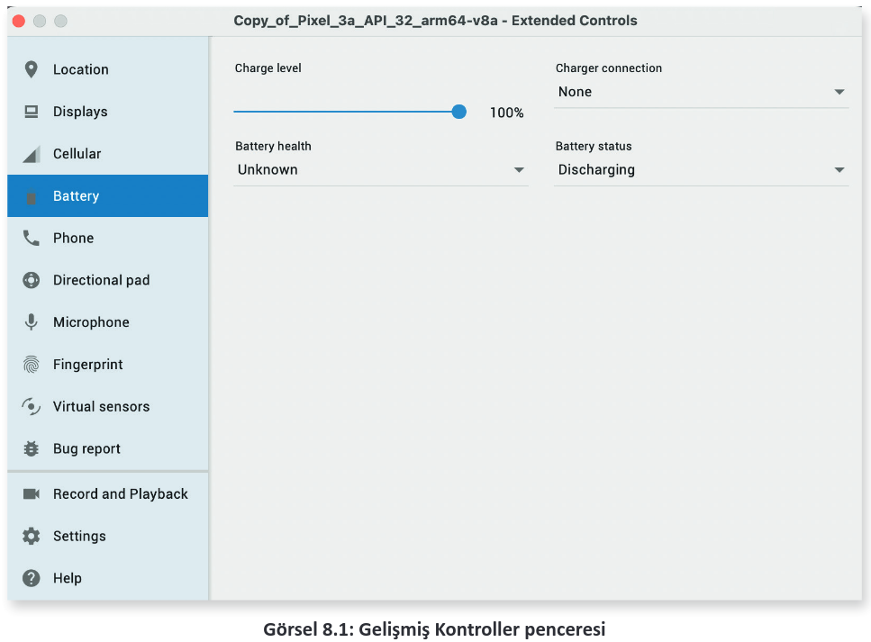
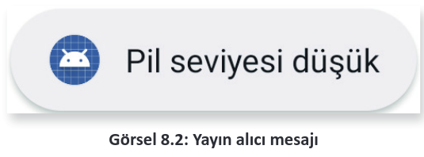
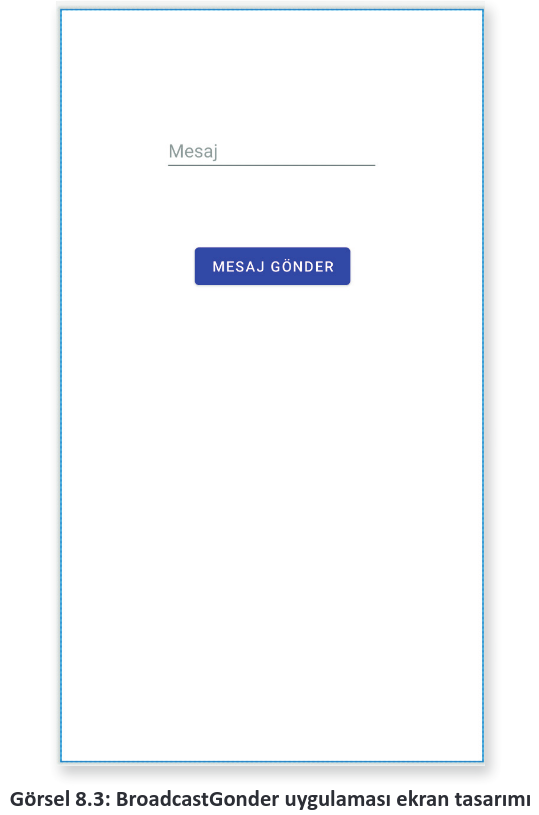

# 8.1. YAYIN ALGILAYICILARLA ÇALIŞMAK

<a href="#8.1.1.">8.1.1. BroadcastReceiver Sınıfı Oluşturmak  </a>\
<a href="#8.1.2.">8.1.2. Kodla Yayın Algılayıcıları Tetiklemek </a>

Android işletim sistemi; cihazın uçak moduna alınması, şarj edilmeye başlanması veya pil durumunun kritik seviyeye gelmesi gibi durumlarda tüm sisteme mesajlar gönderir. Bu mesajlara Broadcast Mesaj denir. Broadcast, yayın anlamına gelir. Uygulamalar bu mesajları alarak duruma göre davranışlarını değiştirebilir. Örneğin pil durumu düşük olan bir cihazda arka plan işlemlerine başlanmaz.

Mesajları alabilmek için manifest dosyasına kaydolmak gereklidir. Bazı mesajlar, kayda rağmen alınmayabilir. Bu tür mesajlar için izin alınmalıdır. Özellikle tehlikeli (dangerous) olarak işaretlenmiş izinler kullanıcıdan izin alınarak dinlenebilir.

<h2 id="8.1.1.">8.1.1. BroadcastReceiver Sınıfı Oluşturmak</h2>

Mesaj kaydı, manifest dosyasında tanımlanır. Örneğin pil seviyesi ile ilgili mesajları almak için manifest dosyasına şu eklemeler yapılır:

```xml
<receiver android:name=".PilSeviyesiAlgilayici" android:exported=»true»>
    <intent-filter>
        <action android:name="android.intent.action.ACTION_POWER_CONNECTED"/>
        <action android:name="android.intent.action.ACTION_POWER_DISCONNECTED"/>
    </intent-filter>
</receiver>
```

Kayıt işleminde BroadcastReceiver sınıfından türemiş bir sınıf şu şekilde tanımlanır:

```java
public class PilSeviyesiAlgilayici extends BroadcastReceiver {
    @Override
    public void onReceive(Context context, Intent intent) {
        Toast.makeText(context, "Pil seviyesi düşük", Toast.LENGTH_LONG).show();
    }
}
```

BroadcastReceiver sınıfı sadece onReceive metodunu oluşturur. onRecevie metodu, Context ve Intent nesnelerini parametre olarak alır. Mesaj alınır alınmaz onReceive metodu çalışır. Tehlikeli izin gerektiren özelliklerin dinlenmesi için şu şekilde izin alınmalıdır:

```java
ActivityCompat.requestPermissions(this,new String[]{Manifest.permission.BATTERY_STATS},PackageManager.PERMISSION_GRANTED);
```

Sadece manifest dosyasına kayıt yapılarak mesajlar alınmayabilir. Android 9 ve üzeri sistemlerde sistem mesajlarının çoğunun kod kullanılarak kaydedilmesi istenir. Activitynin onResume veya onStart olaylarında kayıt işlemi yapılır, onStop olayında ise kayıt işlemi iptal edilir. Kayıt işlemi için registerReceiver metodu kullanılır. registerReceiver metodu kullanılmadan önce IntentFilter nesnesi hazırlanır. IntentFilter nesnesinde hangi yayının dinleneceği addAction metodu ile belirtilir (Intent action daha fazla bilgi için [https://developer.android.com/reference/android/content/Intent](https://developer.android.com/reference/android/content/Intent "Android Studio Resmi WEB sitesi") sitesine bakılabilir.). Kayıt işlemi şu şekilde yapılır:

```java
@Override
protected void onResume() {
    super.onResume();
    IntentFilter intentFilter = new IntentFilter();
    intentFilter.addAction(Intent.ACTION_BATTERY_LOW);
    registerReceiver(pilSeviyesiAlgilayici,intentFilter);
}
```

Kayıt işlemini iptal etmek için unregisterReceiver metodu kullanılır. onStop olayının kullanımı şu şekildedir:

```java
@Override
protected void onStop() {
    super.onStop();
    unregisterReceiver(pilSeviyesiAlgilayici);
}
```

Uygulama test edilirken emülatörde Gelişmiş Kontroller açılır. Gelişmiş Kontroller penceresinde Battery sekmesi açılır. Charger connection ve Battery Status ayarları Görsel 8.1’deki gibi olmalıdır.

<div style='display:block;text-align:center'>


</div>

Charge level sürgü kontrolü %15 ve altına çekildiğinde emülatörde Görsel 8.2’deki mesaj alınır.

<div style='display:block;text-align:center'>


</div>

**1. UYGULAMA:** İşlem adımlarına göre bir yayın alıcı sınıf tanımlayıp pil seviyesi düşük olduğunda kullanıcıyı Toast mesajı ile uyarınız.

**1. Adım:** Empty Activity seçerek yeni bir proje oluşturunuz. Projenin adını "PilSeviyesiAlgilayiciApp" veriniz.

**2. Adım:** Yeni bir java dosyası oluşturunuz, adını "PilSeviyesiAlgilayici.java" olarak veriniz.

**3. Adım:** PilSeviyesiAlgilayici.java dosyasını açıp BroadcastReceiver sınıfından türetiniz ve gerekli metotları oluşturunuz.

**4. Adım:** PilSeviyesiAlgilayici.java dosyasında onReceive metoduyla Toast mesajı tanımlayınız.

**5. Adım:** Manifest dosyasını açarak yayın algılayıcı sınıfını kaydediniz.

**6. Adım:** MainActivity dosyasını açınız. Yayın algılayıcı sınıfından şu şekilde bir nesne oluşturunuz:

```java
PilSeviyesiAlgilayici pilSeviyesiAlgilayici;
```

**7. Adım:** onCreate metodunda pilSeviyesiAlgilayici nesnesini oluşturunuz.

**8. Adım**: onCreate metodunda gerekli izinleri alınız.

**9. Adım**: onResume metodunda yayın alıcıyı kaydediniz.

**10. Adım**: onStop metodunda yayın alıcının kaydını iptal ediniz.

**11. Adım**: Uygulamayı çalıştırıp emülatörü açınız ve Gelişmiş Kontroller panelini kullanarak gerekli gözlemleri yapınız.

<h2 id="8.1.2.">8.1.2. Kodla Yayın Algılayıcıları Tetiklemek</h2>

Yayın algılayıcılar gerektiği zaman harekete geçirilebilir. sendBroadcast metoduna bir Intent ve rilerek yayın alıcının çalışması sağlanır. Intent nesnesine herhangi bir veri eklenerek sendBroadcast metodu ile yayın alıcıya iletilebilir. onReceive metodu parametre olarak Context ve Intent nesnelerini alır.

**2. UYGULAMA:** İşlem adımlarına göre yeni bir sınıf oluşturarak BroadcastReceiver ’dan türetiniz. Uygulamanızdan bir EditText kutusuna mesaj yazıp oluşturduğunuz sınıfa gönderiniz.

**1. Adım:** Empty Activity seçerek yeni bir proje oluşturunuz. Projenin adını "BroadcastGonder" veriniz.

**2. Adım:** activity_main.xml dosyasını açarak Görsel 8.3’teki gibi bir EditText, bir de Button ekleyiniz.

<div style='display:block;text-align:center'>


</div>

**3. Adım:** EditText nesnesine "editMesaj", Button nesnesine "btnGonder" adını veriniz.

**4. Adım:** gradle.build dosyasını açarak viewBinding özelliğini aktif ediniz.

**5. Adım:** MesajAlgilayici isimli bir sınıf oluşturunuz ve bu sınıfı BroadcastReceiver sınıfından türetiniz.

**6. Adım:** MesajAlgilayici.java dosyasında onReceive metodunu şu şekilde düzenleyiniz:

```java
public class MesajAlgilayici extends BroadcastReceiver {
    @Override
    public void onReceive(Context context, Intent intent) {
        String mesaj=intent.getStringExtra("mesaj");
        Toast.makeText(context, mesaj, Toast.LENGTH_LONG).show();
    }
}
```

**7. Adım:** Manifest dosyasını açarak yayın alıcıyı şu şekilde kaydediniz:

```xml
<receiver android:name=".MesajAlgilayici"/>
```

**8. Adım:** MainActivity dosyasını açıp viewBinding özelliğini şu şekilde ekleyiniz:

```java
ActivityMainBinding binding;
@Override
protected void onCreate(Bundle savedInstanceState) {
    super.onCreate(savedInstanceState);
    binding = ActivityMainBinding.inflate(getLayoutInflater());
    View view = binding.getRoot();
    setContentView(view);
```

**9. Adım:** Button nesnesine şu şekilde bir onClickListener yazınız:

```java
binding.btnGonder.setOnClickListener(new View.OnClickListener() {
    @Override
    public void onClick(View view) {
        Intent intent = new Intent(MainActivity.this,MesajAlgilayici.class);
        intent.putExtra("mesaj",binding.editMesaj.getText().toString());
        sendBroadcast(intent);
    }
});
```

**10. Adım:** Uygulamayı çalıştırınız. EditText kutusuna bir mesaj yazıp MESAJ GÖNDER butonuna basınız.

>**SIRA SİZDE:**
>
>ACTION_AIRPLANE_MODE_CHANGED mesajını kullanarak cihazın uçak modu bilgisini dinleyen bir BroadcastReceiver yazıp test ediniz.
>
>**DEĞERLENDİRME:**
>
>Çalışmanız aşağıda yer alan kontrol listesi kullanılarak değerlendirilecektir. Çalışmanızı yaparken değerlendirme ölçütlerini dikkate alınız.
>
><div style="text-align:center;font-weight:bold;">KONTROL LİSTESİ</div>
>
>| DEĞERLENDİRME ÖLÇÜTLERİ                      | EVET | HAYIR |
>| :------------------------------------------- | ---- | ----- |
>| 1. Yeni Empty Activity ile proje oluşturdu.  |
>| 2. Manifest dosyasını düzenledi.             |
>| 3. BroadcastReceiver sınıfını yazdı.         |