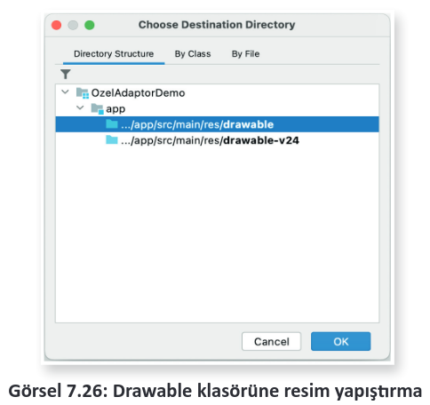

# 7.2. YEREL VERİ TABANIYLA ÇALIŞMAK

- <a href="#7.2.1."> 7.2.1. Sorgulama Komutları </a>
- <a href="#7.2.2."> 7.2.2. Mobil Uygulama Geliştirme Ortamında Yerel Veri Tabanı Kullanmak </a>
- <a href="#7.2.3."> 7.2.3. Mobil Uygulama Geliştirme Ortamında Kayıt Eklemek</a>
- <a href="#7.2.4."> 7.2.4. Mobil Uygulama Geliştirme Ortamında Kayıt Silmek </a>
- <a href="#7.2.5."> 7.2.5. Mobil Uygulama Geliştirme Ortamında Kayıt Güncellemek </a>
- <a href="#7.2.6."> 7.2.6. Mobil Uygulama Geliştirme Ortamında Tüm Kayıtları Listelemek  </a>
- <a href="#7.2.7."> 7.2.7. Özel Adaptör Kullanmak  </a>
- <a href="#7.2.8."> 7.2.8. Model Oluşturmak </a>
- <a href="#7.2.9."> 7.2.9. ArrayAdapter Sınıfıyla Özel Adaptör Oluşturmak </a>

Her ne kadar bazı veriler sharedPrefrences kullanılarak kaydedilebilse de bazı durumlarda sharedPreferences tek başına yeterli olmaz. Daha karmaşık verilerin kaydedilmesi gerekirse daha fazlası kullanmalıdır. Bunlardan bir tanesi, yerel bir veri tabanı kullanılmasıdır. Mobil işletim sisteminde yerel veri tabanı olarak SQLite kullanılır. SQLite kurmak için herhangi bir işlem yapılmasına gerek yoktur. SQLite, işletim sisteminde kurulu olarak gelir.

Yerel veri tabanları birçok veriyi kaydetmek için oldukça elverişlidir ancak yerel veri tabanlarının da dezavantajları vardır. Örneğin uygulama yanlışlıkla kaldırılırsa tüm veriler kaybolur veya yetkisiz bir erişimle başka bir uygulama verilerin silinmesine neden olabilir. Yerel veri tabanları, mobil uygulama geliştiriciler tarafından daha çok bir tür yedekleme işlemi yapmak için kullanılır. Çok önemli veriler bir sunucu veya uzak veri tabanında tutulmalıdır. Bunun da sıkıntıları vardır. Örneğin internet bağlantısı yoksa uzaktaki sunucudan veri alınamaz. Bu tür durumlarda yerel veritabanları imdada yetişir. Sunucudaki veriler yedeklenerek yerel veri tabanına kaydedilir. Kullanıcının interneti olmasa bile uygulama yine de kullanılır hâlde utulur.

Mobil işletim sisteminde varsayılan olarak SQLite veri tabanı kullanılır. SQLite veri tabanı tamamen SQL sorgu komutları ile işlem yapar. Mobil uygulama geliştirme ortamı, bu komutları kendi derleyicisinden geçirmez. Veri tabanı için yazılan sorgulama komutları düşük seviye bir sisteme aktarılır. Burada çalıştırılır ve sonucu döndürülür. Bundan dolayı sorgulama komutlarında herhangi bir hata yapılsa bile derleyici hata vermez. Bu durum, yerel veri tabanının en dezavantajlı hâlidir. Sorgulama komutları yazılırken çok dikkat edilmelidir. Uygulama çalıştırıldıktan sonra herhangi bir sonuç alınmazsa sorgulama komutlarından birinde hata yapılmıştır.

<h2 id="7.2.1."> 7.2.1. Sorgulama Komutları</h2>

Veri tabanı sorgu komutları OLUŞTURMA, OKUMA, GÜNCELLEME, SİLME (CREATE, READ, UPDATE, DELETE) olmak üzere dört temel unsur üzerine çalışır (Tablo 7.3).

<div style="text-align:center;font-weight:bold;">Tablo 7.3: Sorgu Komutları Türleri</div>

| Unsur      | İşlem           | SQL Karşılığı |
| ---------- | --------------- | ------------- |
| **CREATE** | Veri ekleme     | INSERT        |
| **READ**   | Veri okuma      | SELECT        |
| **UPDATE** | Veri güncelleme | UPDATE        |
| **DELETE** | Veri silme      | DELETE        |

Yerel veri tabanları tüm verileri bir tabloya kaydeder. Veri kayıt işleminden önce tablo oluşturulması gereklidir (Tablo 7.4 ).

<div style="text-align:center;font-weight:bold;">Tablo 7.4: Ürünler Tablosu</div>

| id   | urunadi    | fiyat    | adet |
| :--- | :--------- | :------- | :--- |
| 1    | Televizyon | 12500.00 | 12   |
| 2    | Monitör    | 3500.00  | 25   |
| 3    | Bilgisayar | 10000.00 | 16   |
| 4    | Klavye     | 125.50   | 134  |

Okulda veya sınıfta bulunan öğrenciler bir veri tabanına kaydedilmek istenirse Tablo 7.4’te görüldüğü gibi bir tablo oluşturulmalıdır. Tablonun üst tarafındaki alanlar, veri sütunlarıdır. Tablo oluşturulurken verilerin türleri önemlidir. Örneğin bir sütunun veri türü INTEGER olarak ayarlanmışsa buraya kişinin ad ve soyadı kaydedilemez. Yerel veri tabanında kullanılabilecek veri türleri Tablo 7.5’te verilmiştir.

<div style="text-align:center;font-weight:bold;">Tablo 7.5: Yerel Veri Tabanı Veri Türleri</div>

| Veri Türü   | Açıklama                                                       | Geliştirme Ortamı  Karşılığı |
| ----------- | -------------------------------------------------------------- | ---------------------------- |
| **INTEGER** | Tam sayılar ve Boolean türünde veri kaydetmek için kullanılır. | int, long, byte ...          |
| **REAL**    | Ondalık sayı türünden verileri kaydetmek için kullanılır.      | float, double                |
| **TEXT**    | Metin türünden (String) verileri kaydetmek için kullanılır.    | String                       |
| **BLOB**    | Resim, dosya gibi verileri kaydetmek için kullanılır.          | byte[]                       |

Verilerin kaydedileceği tablolar oluşturulurken birincil anahtar (Primary Key) belirlemeye dikkat edilmelidir. Bir tablodaki boş olmayan herhangi bir sütun, birincil anahtar olabilir. Birincil anahtar olarak belirlenecek alandaki kayıtların hepsi birbirinden farklı olmalıdır. Örneğin ad soyad alanı birincil anahtar yapılırsa aynı isimli birden fazla öğrenci ile karşılaşılabilir. Bu da çok büyük problemlere neden olabilir. Ülkemizde yaşayan her vatandaşın bir T.C. Kimlik Numarası vardır. Aynı isimli birden fazla vatandaş olsa bile T.C. Kimlik Numarası ile vatandaşlar birbirinden ayırt edilebilir. Veri tabanlarındaki birincil anahtar da bu amaçla kullanılır.

### 7.2.1.1. Yerel Veri Tabanında Tablo Oluşturmak
Sorgu dilinde bir tablo oluşturmak için CREATE TABLE komutu kullanılır. Sorgu komutlarını denemek için on-line birçok internet sitesi bulunur. Bunlardan herhangi biri ile sorgular test edilebilir. CREATE TABLE komutunun kullanımı şu şekildedir:

```sql
CREATE TABLE [IF NOT EXISTS] <tablo ismi> ( <sütun adı> <veri türü> , <diğer sütunlar>)
```

**NOT:**

>IF NOT EXISTS, tablo oluşturulmamış ise tabloyu oluştur anlamına gelir. Kullanma zorunluluğu yoktur.

**ÖRNEK**

```sql
CREATE TABLE IF NOT EXISTS urunler(id INTEGER PRIMARY KEY,
                                            urunadi TEXT,
                                            fiyat DOUBLE,
                                            adet INTEGER);
```

**NOT:**

>Sorgu komutunda Türkçe karakter kullanmamaya dikkat edilir. Veri olarak Türkçe karakter kullanılabilir ancak tablo adı ve sütun isimlerinde Türkçe karakter kullanılmamalıdır.

**NOT:**

>Sorgu komutu yazılırken temel komutlar büyük harflerle yazılmalıdır.

### 7.2.1.2. Yerel Veri Tabanına Veri Eklemek

Yerel veri tabanına veri eklemek için INSERT ifadesi kullanılır. INSERT komutunda önce tablo adı ve veri eklenecek alanlar belirtilir. Daha sonra VALUES anahtar kelimesi ile yazılması gereken ve riler eklenir. Örnek bir veri ekleme komutu şu şekilde yazılır:

```sql
INSERT INTO <tablo ismi> ( <sütun adı>, <diğer sütunlar>...) values(<değerler>)
```

**ÖRNEK**

```sql
INSERT INTO urunler(urunadi,fiyat,adet) VALUES("Televizyon",12500.00,12)
```

### 7.2.1.3. Yerel Veri Tabanında Veri Sorgulamak

SQL komutları içinde en kapsamlı olanı veri sorgulama komutlarıdır. Sadece SELECT komutu ile yapılmasına rağmen çok farklı şekillerde sorgular yazılabilir. SELECT komutunun kullanımı şu şekildedir:

```sql
SELECT <sütun adları> FROM <tablo adı> WHERE <kısıtlamalar> ORDER BY <sıralama türü>
```

SELECT komutunun en çok tercih edilen kullanımları Tablo 7.6’da verilmiştir.

<div style="text-align:center;font-weight:bold;">Tablo 7.6: SELECT Komutunun En Sık Kullanım Şekilleri</div>

| Sorgu                                                    | Sorgunun Amacı                                                             |
| -------------------------------------------------------- | -------------------------------------------------------------------------- |
| SELECT * FROM urunler                                    | Tablodaki tüm kayıtları listeler.                                          |
| SELECT urunadi FROM urunler                              | Tüm ürün isimlerini listeler.                                              |
| SELECT urunadi FROM urunler WHERE adet=12                | Adet bilgisi 12 olan ürünleri listeler.                                    |
| SELECT urunadi FROM urunler WHERE adet>=120              | Adet bilgisi 120’den büyük kayıtları listeler.                             |
| SELECT adet FROM urunler WHERE id>=2 AND adet>120        | id bilgisi 2 veya 2’den büyük, numarası 120’den büyük kayıtları listeler.  |
| SELECT urunadi FROM urunler WHERE urunadi LIKE "B%"      | Ürünadı "B" harfi ile başlayan kayıtları listeler.                         |
| SELECT urunadi FROM urunler WHERE urunadi LIKE "%D%"     | ÜrünAdı alanında içinde "D" harfi olan kayıtları listeler.                 |
| SELECT urunadi FROM urunler WHERE urunadi LIKE "%r"      | Sonu "r" ile biten kayıtları listeler.                                     |
| SELECT urunadi FROM urunler WHERE adet BETWEEN 10 and 50 | Adet bilgisi 10 ile 50 arasında olan kayıtları listeler.                   |
| SELECT urunadi FROM urunler ORDER BY urunadi ASC         | Tüm kayıtları ürün ismine göre küçükten büyüğe doğru sıralayarak listeler. |
| SELECT urunadi FROM urunler ORDER BY urunadi DESC        | Tüm kayıtları ürün ismine göre büyükten küçüğe doğru sıralayarak listeler. |

<h2 id="7.2.2."> 7.2.2. Mobil Uygulama Geliştirme Ortamında Yerel Veri Tabanı Kullanmak</h2>

Mobil uygulama geliştirme ortamı, SQLite yerel veri tabanını destekler. Mobil uygulama geliştirme ortamı, yerel veri tabanı kullanmak için **SQLiteDatabase** nesnesine sahiptir. Bu nesne ile tüm veri tabanı işlemleri yapılabilir.

Mobil uygulama geliştirme ortamında veri tabanı örneği şu şekilde oluşturabilir:

```java
SQLiteDatabase database;
```

Bu kod sadece bir SQLiteDatabase nesnesi verir. Yerel veri tabanını kullanabilmek için gerekli düzenlemeler yapılmalıdır. Nesne oluşturulduktan sonra ayarlamalar şu şekilde yapılır:

```java
database = this.openOrCreateDatabase(<Veri Tabanı Adı>, MODE_PRIVATE, null);
```

Veri tabanı nesnesi **Context** aracılığı ile oluşturulur. Context nesnesinin openOrCreateDatabase metodu ile gerekli parametreler verilerek nesne elde edilir.
- İlk parametre ile yerel veri tabanında kullanılacak dosya ismi belirtilir. Burada verilen isimle başka bir activity içinde yerel veri tabanına ulaşılabilir.
- İkinci parametre ile veri tabanının başka uygulamalara açılıp açılmayacağı belirlenir. Genellikle her uygulamanın özel bir veri tabanı olduğu için bu parametre **MODE_PRIVATE** olarak ayarlanır.
- Üçüncü parametre gelen bir imleç verisi varsa bunu almak için gerekli ayarlamalar yapılır. Böyle bir durum yoksa bu değer **null** olarak ayarlanır.

**ÖRNEK**

```java
String TABLO = "CREATE TABLE IF NOT EXISTS urunler(id INTEGER PRIMARY KEY,";
TABLO += "urunadi VARCHAR,";
TABLO += "fiyat DOUBLE,";
TABLO += "adet INTEGER)";
database.execSQL(TABLO);
```

Kodlar yazılırken kullanıcıya yardımcı olması açısından TABLO isimli bir String değişken kullanılır. TABLO değişkeni ile sorgulama komutu hazırlanır. Sorgulama komutu hazırlanırken çok dikkat edilmelidir. Uygulama çalıştırıldıktan sonra sorgulama kodlarında herhangi bir hata olsa bile uyarı alınmaz. Tablonun oluşup oluşmadığını anlamak için **App Inspection** penceresi açılır (Görsel 7.5).

<div style='display:block;text-align:center'>


</div>

App Inspection penceresindeki **Database Inspector** bölümünde tablo görünürse kodlar sorunsuz çalışmıştır.

Tablo oluşturulduktan sonra dosyanın nerede bulunduğuna bakılır. Bunun için View>Tool Windows>Device File Explorer seçeneği seçilir (Görsel 7.6).

<div style='display:block;text-align:center'>


</div>

Açılan pencereden Data>Data klasörüne gidilir. Data klasörü içinde Görsel 7.7’deki gibi uygulama için verilen paket ismi bulunur. Paket ismi ile başlayan klasörün içindeki **databases** klasöründe yerel veri tabanı dosyaları vardır. Herhangi bir sorun çıktığında buradaki dosya silinebilir veya uygulama tamamen silinip mobil uygulama geliştirme ortamında yeniden çalıştırılabilir.

<div style='display:block;text-align:center'>


</div>

<h2 id="7.2.3.">7.2.3. Mobil Uygulama Geliştirme Ortamında Kayıt Eklemek</h2>

Yerel veri tabanına bir kayıt eklemek için bir sorgu komutu oluşturulup gerekli parametreler bir SQLStatement nesnesi ile sorgu komutuna eklenmelidir. Daha sonra SQLStatement nesnesinin execute metodu çağrılır. Kayıt eklendikten sonra **id** numarası otomatik verilir. Mobil uygulama geliştirme ortamında herhangi bir kayıt şu şekilde eklenir:

```java
String SORGU = "INSERT INTO urunler(urunadi,fiyat,adet) VALUES(?,?,?)";
SQLiteStatement durumlar = database.compileStatement(SORGU);
durumlar.bindString(1,"Televizyon");
durumlar.bindString(2,12500.00);
durumlar.bindLong(3,12);
durumlar.execute();
```

SQLStatement nesnesi oluşturulmadan önce sorgu komutuna dışarıdan gelecek veriler için birer soru işareti (?) işareti kullanılır. Soru işareti (?) sayesinde SQLStatement nesnesi ile dışarıdan gelen veriler sorgu komutuna eklenir.

Kodlar yazılıp çalıştırıldıktan sonra ekranda herhangi bir işlem olmaz ancak App Inspection penceresi açılarak veri tabanına kayıt yapılıp yapılmadığı kontrol edilebilir (Görsel 7.8).

<div style='display:block;text-align:center'>


</div>

<h2 id="7.2.4.">7.2.3. Mobil Uygulama Geliştirme Ortamında Kayıt Silmek</h2>

Veri silmek için sorgu komutu hazırlanıp gerekli parametreler SQLStatement ile sorguya eklenir (Görsel 7.9).

<div style='display:block;text-align:center'>


</div>

Bu kayıtlardan id numarası 2 olanı silmek için şu kodlar kullanılır:

```java
String SORGU="DELETE FROM urunler WHERE id=?";
SQLiteStatement durumlar=database.compileStatement(SORGU);
durumlar.bindLong(1,2);
durumlar.execute();
```

Diğer alanlarda aynı veriler olabilir ancak birincil anahtarda kesinlikle aynı veri olamaz. Kayıt silme işleminden sonra App Inspection penceresi Görsel 7.10’daki gibi olur.

<div style='display:block;text-align:center'>


</div>

<h2 id="7.2.5.">7.2.5. Mobil Uygulama Geliştirme Ortamında Kayıt Güncellemek</h2>

Güncelleme yapılması için bir sorgu komutu hazırlanıp SQLStatement nesnesi ile veriler sorguya dâhil edilir. Görsel 7.10’daki verilerden id numarası 3 olan kaydın fiyat bilgisi 145 olarak şu şekilde değiştirilir:

```java
String SORGU="UPDATE ürünler SET fiyat=? WHERE id=?";
SQLiteStatement durumlar=database.compileStatement(SORGU);
durumlar.bindString(1,145);
durumlar.bindLong(2,3);
durumlar.execute();
```

Kodlar hazırlandıktan sonra uygulama çalıştırıldığında App Inspection penceresinden değişiklikler takip edilebilir (Görsel 7.11).

<div style='display:block;text-align:center'>


</div>

<h2 id="7.2.6.">7.2.5. Mobil Uygulama Geliştirme Ortamında Tüm Kayıtları Listelemek</h2>

Kayıt listelemek için bir sorgu hazırlanıp Cursor nesnesi ile verilere ulaşılır. Cursor nesnesi, tabloda bulunan tüm kayıtlar üzerinde gezinmeyi sağlar. Cursor nesnesi bir satır veri aldıktan sonra hangi kolona ait verinin okunması istenirse bunu belirtmek yeterlidir. Tüm verileri okumak için şu şekilde bir düzenleme yapılmalıdır:

```java
database=this.openOrCreateDatabase("urunler",MODE_PRIVATE,null);
Cursor cursor=database.rawQuery("SELECT urunadi,fiyat,adet FROM urunler",null);
String veriler="";
int kolonUrunadi=cursor.getColumnIndex("urunadi");
int kolonFiyat= cursor.getColumnIndex("fiyat");
int kolonAdet=cursor.getColumnIndex("adet");
while (cursor.moveToNext()){
    String urunadi=cursor.getString(kolonUrunadi);
    double fiyat=cursor.getDouble(kolonFiyat);
    int adet=cursor.getInt(kolonAdet);
    veriler+=urunadi+" "+fiyat+" "+adet+"\n";
}
cursor.close();
Toast.makeText(this, veriler, Toast.LENGTH_SHORT).show();
```

Cursor nesnesi, rawQuery metodu ile Database nesnesinden oluşturulur. Veri sorgulamak için rawQuery metodu kullanılır. rawQuery metodu, Cursor türünde bir nesne geri döndürür.

Bir sonraki adımda kolonların indeks numaraları bulunur. Cursor nesnesinin getColumnIndex metodu, kolonun indeks numarasını verir. Tablonun kolonlarının indeks numaraları en soldan itibaren 0’dan başlar (Tablo 7.7).

<div style="text-align:center;font-weight:bold;">Tablo 7.7: Tablo Kolonlarının İndeks Numaraları</div>

| 0   | 1          | 2     | 3    |
| --- | ---------- | ----- | ---- |
| id  | urunid     | fiyat | adet |
| 1   | Televizyon | 12000 | 12   |


`String urunadi=cursor.getString(kolonUrunadi)` ile `String urunadi=cursor.getString(1)` aynı sonucu verir. Tüm veriler okunurken bir döngü kurulup Cursor nesnesinin son kayda kadar gitmesi sağlanır. **cursor.moveNext** metodu ile bir sonraki kayda geçilir. Kayıt bitmişse **false** değeri gönderilerek döngü bitirilir. Tüm kayıtlar okunduktan sonra Cursor nesnesi mutlaka kapatılmalıdır. Kodlarda tüm veriler bir String içine eklenerek bir Toast mesajı ile ekranda gösterilir (Görsel 7.12).

<div style='display:block;text-align:center'>


</div>

<h2 id="7.2.7.">7.2.7. Özel Adaptör Kullanmak</h2>

Adaptörler, veri kaynağındaki verileri okur ve View nesnelerine bağlar. ListView nesnesi, hangi verinin hangi View nesnesine bağlanacağını bilemez. Mobil uygulama geliştiriciler adaptör kullanarak verileri View nesnelerine bağlar. Özel adaptör kullanabilmek için öncelikle bir veri modeli oluşturmak gereklidir.

<h2 id="7.2.8.">7.2.8. Model Oluşturmak </h2>

Tabloda bulunan her veri bir sınıf ile temsil edilebilir. Bu sınıfa **model** denir. Oluşturulacak model, tablodaki tüm veriler ile uygun olmalıdır. Örneğin tabloda bir sütun int türünden ise modelin bu özelliği de int türünden olmalıdır. Üçüncü uygulamada kullanılan tablo için örnek bir model şu şekilde oluşturulur:

```java
public class Urun {
    private int id;
    private String urunadi;
    private double fiyat;
    private int adet;
    private Bitmap resim;
}
```

Modelin özellikleri tanımlandıktan sonra model bir java data sınıfı hâline getirilmelidir. Bu işlemler için ekstra kod yazılmasına gerek yoktur.

Kodlar üzerinde boş bir yere tıklanır ve çıkan seçeneklerden **Generate** seçeneği seçilir (Görsel 7.13).

<div style='display:block;text-align:center'>


</div>

Generate menüsü açıldıktan sonra **Constructor** seçeneği Görsel 7.14’teki gibi seçilip model için bir yapılandırıcı metot hazırlanır.

Constructor metoduna hangi alanlar eklenecekse Görsel 7.15’teki gibi seçilir.

```java
public Urun(int id,String urunadi, double fiyat, int adet, Bitmap resim) {
    this.id=id;
    this.urunadi = urunadi;
    this.fiyat = fiyat;
    this.adet = adet;
    this.resim = resim;
}
```

Yapılandırıcı metot kullanılarak bir ürün nesnesi şu şekilde oluşturulur:

```java
Urun urun=new Urun(1,"Televizyon",12500,12);
```

Data sınıfı için Getter ve Setter metotları oluşturulur. Görsel 7.16’daki Generated menüsünden **Getter and Setter** seçeneği seçilir.

Görsel 7.17’deki pencereden alanların tümü seçilip OK buttonuna tıklanır. Mobil uygulama geliştirme ortamı için tüm Getter ve Setter metotları otomatik olarak oluşturulur.

Model ile oluşturulan bir nesnenin urunadi özelliğine erişim sağlamak için **urun.getadSoyad()** metodunu çağırmak yeterlidir. urunadi bilgisini değiştirmek için ise **urun.setadSoyad("Televizyon")** metodu çağrılır. Metot parametresi olarak değiştirilmek istenen değer verilir. **get** ile başlayan metotlar veriyi almak için, **set** ile başlayan metotlar ise veriyi değiştirmek için kullanılır.

<div style='display:block;text-align:center'>


</div>

Özel adaptör oluşturmak için yeni bir java sınıfı daha projeye eklenir. Özel adaptörler BaseAdapter sınıfından türetimelidir. Bir özel adaptör sınıfı şu şekilde oluşturulabilir:

```java
public class UrunAdaptor extends BaseAdapter
```

Özel adaptör sınıfı tanımladıktan sonra mobil uygulama geliştirme ortamından bir hata mesajı alınır (Görsel 7.18). Kalıtım yolu ile bir sınıf yazıldığı için BaseAdapter sınıfının metotları oluşturulmalıdır.

<div style='display:block;text-align:center'>


</div>

Kırmızı ampül simgesine basıldığında mobil uygulama geliştirme ortamı hatanın ortadan kalkması için kullanıcıya çeşitli seçenekler sunar. Açılan menüden Görsel 7.18’deki Implements method seçeneği seçilir.

```java
public class UrunlerAdapter extends BaseAdapter {
    @Override
    public int getCount() {
        return 0;
    }
    @Override
    public Object getItem(int i) {
        return null;
    }
    @Override
    public long getItemId(int i) {
        return 0;
    }
    @Override
    public View getView(int i, View view, ViewGroup viewGroup) {
        return null;
    }
}
```

Özel adaptöre listelenmek istenen veriler dışarıdan verilmelidir. Ayrıca XML dosyasından gerekli Viewları bulmak için Context nesnesine ihtiyaç duyulur. Bir java sınıfı içinde Contexte ulaşmak kolay değildir. Bu yüzden Context nesnesi de dışarıdan alınır. Bunun için özel adaptör sınıfına şu iki özellik eklenir:

```java
Context context;
ArrayList<Urun> liste;
public UrunlerAdapter(Context context, ArrayList<Urun> liste) {
    this.context = context;
    this.liste = liste;
}
```

Özellik olarak eklenen nesnelerin dışarıdan kolay alınabilmesi için bir yapılandırıcı metot tanımlanır. BaseAdapter sınıfından alınan metotlar Tablo 7.8’de verilmiştir.

<div style="text-align:center;font-weight:bold;">Tablo 7.8: BaseAdapter Metotları</div>

|                                                        |                                                                                                    |
| ------------------------------------------------------ | -------------------------------------------------------------------------------------------------- |
| **int getCount()**                                     | Veri listesinde kaç tane veri olduğunu geri gönderir.                                              |
| **object getItem(int i)**                              | Veri listesinde indeks numarası ile veri elde etmeyi sağlar. İndeksi girilen veriyi geri gönderir. |
| **long getItemId(int i)**                              | Verinin indeks numarasını gönderir.                                                                |
| **View getView(int i, View view,ViewGroup viewGroup)** | Viewlara verilerin yazıldığı kısımdır.                                                             |

Özel adaptörde her bir kaydın görüntüleneceği satır önceden tanımlanmalıdır. Mobil uygulama geliştirme ortamında app>res>layout üzerine sağ tıklanarak New>Layout Resource File seçeneği seçilir (Görsel 7.19).

<div style='display:block;text-align:center'>


</div>

Görsel 7.20’deki pencereden layout dosyasına bir isim verilir. Bu isim önemlidir. Bu isim özel adaptörde getView metodunda kullanılır. Oluşturulan layout dosyasında veri eklenmesi istenen nesnelere bir id verilmesi unutulmamalıdır.

<div style='display:block;text-align:center'>


</div>


**3. UYGULAMA:** İşlem adımlarına göre Görsel 7.21’deki gibi bir veri tabanı uygulaması geliştiriniz. Geliştirdiğiniz uygulamayı Tablo 7.4’teki verilere uygun olarak tasarlayınız.

**1. Adım:** Mobil uygulama geliştirme ortamında yeni bir proje açıp Empty Activity seçiniz.

**2. Adım:** app>res>values>strings.xml dosyasını açarak şu şekilde değiştiriniz:

```xml
<resources> 
    <string name="app_name">Ürünler Veri Tabanı</string>
</resources>
```

**3. Adım:** app>res>layout>activity_main.xml dosyasını açarak ana activitynin görünümünü Görsel 7.22’deki gibi tasarlayınız.

<div style='display:block;text-align:center'>


</div>

**4. Adım:** Tasarım ekranına bir tane ListView, bir tane de button ekleyiniz.

**5. Adım:** ListView için id bilgisi urunListe, button için btnYeniKayitEkle değerlerini veriniz.

**6. Adım:** Yeni bir java sınıfı oluşturunuz ve adını Urun.java veriniz.

**7. Adım:** Urun.java dosyasını şu şekilde kodlayınız:

```java
public class Urun {
    private int id;
    private String urunadi;
    private double fiyat;
    private int adet;
    private Bitmap resim;
    public Urun(int id,String urunadi, double fiyat, int adet, Bitmap resim) {
        this.id=id;
        this.urunadi = urunadi;
        this.fiyat = fiyat;
        this.adet = adet;
        this.resim = resim;
    }
    public int getId(){
        return this.id;
    }
    public void setId(int id){
        this.id=id;
    }
    public String getUrunadi() {
        return urunadi;
    }
    public void setUrunadi(String urunadi) {
        this.urunadi = urunadi;
    }
    public double getFiyat() {
        return fiyat;
    }
    public void setFiyat(double fiyat) {
        this.fiyat = fiyat;
    }
    public int getAdet() {
        return adet;
    }
    public void setAdet(int adet) {
        this.adet = adet;
    }
    public Bitmap getResim() {
        return resim;
    }
    public void setResim(Bitmap resim) {
        this.resim = resim;
    }
}
```

**8. Adım:** UrunlerAdapter isimli yeni bir sınıf oluşturunuz.

**9. Adım:** UrunlerAdapter sınıfını şu şekilde kodlayınız:

```java
public class UrunlerAdapter extends BaseAdapter {
    ArrayList<Urun> liste;
    Context context;
    public UrunlerAdapter(ArrayList<Urun> liste, Context context) {
        this.liste = liste;
        this.context = context;
    }
    @Override
    public int getCount() {
        return liste.size();
    }
    @Override
    public Object getItem(int i) {
        return liste.get(i);
    }
    @Override
    public long getItemId(int i) {
        return i;
    }
    @Override
    public View getView(int i, View view, ViewGroup viewGroup) {
        TextView satirUrunadi;
        TextView satirUrunFiyat;
        TextView satirUrunAdet;
        ImageView satirUrunResmi;
        Urun urun=liste.get(i);
        if(view == null){
            view = LayoutInflater.from(context).inflate(R.layout.listview_satir,viewGroup,false);
        }
        satirUrunadi=view.findViewById(R.id.satirUrunadi);
        satirUrunFiyat=view.findViewById(R.id.satirUrunFiyat);
        satirUrunAdet=view.findViewById(R.id.satirUrunAdet);
        satirUrunResmi=view.findViewById(R.id.satirUrunResmi);
        satirUrunadi.setText(urun.getUrunadi());
        satirUrunFiyat.setText(String.format("%.02f",urun.getFiyat())+ " TL");
        satirUrunAdet.setText(urun.getAdet()+"");
        if(urun.getResim()!=null)
            satirUrunResmi.setImageBitmap(urun.getResim());
        return view;
    }
}
```

**10. Adım:** res>layout dizinine gelerek dizin adına sağ tıklayınız. New menüsünden Layout Resource File seçeneğini seçiniz. Dosyayı listview_satir.xml yapınız (Görsel 7.23).

<div style='display:block;text-align:center'>


</div>

**11. Adım:** listview_satir.xml dosyasını şu şekilde kodlayınız:

```xml
<?xml version="1.0" encoding="utf-8"?>
<LinearLayout xmlns:android="http://schemas.android.com/apk/res/android"
    android:orientation="horizontal"
    android:layout_width="match_parent"
    android:layout_height="wrap_content">
    <ImageView
        android:id="@+id/satirUrunResmi"
        android:layout_width="80dp"
        android:layout_height="80dp"
        android:scaleType="fitCenter"
        android:src="@drawable/urun_resmi"/>
    <LinearLayout
        android:layout_width="230dp"
        android:layout_height="wrap_content"
        android:paddingLeft="20dp"
        android:orientation="vertical">
        <TextView
            android:id="@+id/satirUrunadi"
            android:layout_width="match_parent"
            android:layout_height="wrap_content"
            android:textColor="#212121"
            android:text="Ürün Adı"
            android:padding="5dp"
            android:textStyle="bold"
            android:textSize="20sp"/>
        <TextView
            android:id="@+id/satirUrunFiyat"
            android:textColor="#dd2c00"
            android:layout_width="match_parent"
            android:layout_height="wrap_content"
            android:text="Ürün Fiyatı"
            android:padding="5dp"
            android:textSize="16sp"/>
    </LinearLayout>
    <TextView
        android:id="@+id/satirUrunAdet"
        android:layout_width="match_parent"
        android:layout_height="match_parent"
        android:text="999"
        android:textColor="#f50057"
        android:textSize="27sp"
        android:padding="5dp"
        android:gravity="center"
        android:layout_marginTop="10dp"/>
</LinearLayout>
```

**12. Adım:** Uygulamaya yeni bir Empty Activity ekleyiniz ve adını UrunKayit veriniz.

**13. Adım:** Uygulamaya yeni bir Empty Activity ekleyiniz ve adını UrunDetay veriniz.

**14. Adım:** Uygulamayı çalıştırınız ve App Inspection penceresinden veri ekleyerek uygulamayı test ediniz.

**4. UYGULAMA:** İşlem adımlarına göre üçüncü uygulamadaki projeye veri kayıt bölümü ekleyiniz.

**1. Adım**: Üçüncü uygulamada yaptığınız projeyi açınız.

**2. Adım**: activity_urun_kayit.xml dosyasını açınız. Activity’yi Görsel 7.24’teki gibi tasarlayınız.

<div style='display:block;text-align:center'>


</div>

**3. Adım:** Üç tane EditText ve bir tane button ekleyiniz. EditTextlere editKayitUrunadi, editKayitFiyat ve editKayitAdet id bilgilerini veriniz.

**4. Adım:** Button id bilgisini btnKayit veriniz.

**5. Adım:** UrunKayit.java dosyasını açıp şu şekilde kodlayınız:

```java
public class UrunKayit extends AppCompatActivity {
    SQLiteDatabase database;
    EditText urunadi;
    EditText urunFiyat;
    EditText urunAdet;
    Button btnKaydet;
    int id;
    @Override
    protected void onCreate(Bundle savedInstanceState) {
        super.onCreate(savedInstanceState);
        setContentView(R.layout.activity_urun_kayit);
        urunadi=findViewById(R.id.editKayitUrunadi);
        urunFiyat=findViewById(R.id.editKayitFiyat);
        urunAdet=findViewById(R.id.editKayitAdet);
        btnKaydet=findViewById(R.id.btnKayit);
        Intent intent=getIntent();
        id=intent.getIntExtra("id",0);
        String mod=intent.getStringExtra("mod");
        database=this.openOrCreateDatabase("urunler",MODE_PRIVATE,null);
        if(mod.equals("degistir")){
            try {
                Cursor cursor=database.rawQuery("SELECT urunadi,fiyat,adet FROM urunler WHERE id=?",new String[]{String.valueOf(id)});
                int kolonUrunadi=cursor.getColumnIndex("urunadi");
                int kolonFiyat=cursor.getColumnIndex("fiyat");
                int kolonAdet=cursor.getColumnIndex("adet");
                while (cursor.moveToNext()){
                    urunadi.setText(cursor.getString(kolonUrunadi));
                    urunFiyat.setText(cursor.getString(kolonFiyat)+"");
                    urunAdet.setText(cursor.getInt(kolonAdet)+"");
                }
                cursor.close();
            }catch (Exception e){
                e.printStackTrace();
            }
        }
        btnKaydet.setOnClickListener(new View.OnClickListener() {
            @Override
            public void onClick(View view) {
                if(mod.equals("degistir")){
                    String SORGU="UPDATE urunler SET urunadi=?,fiyat=?,adet=? WHERE id=?";
                    SQLiteStatement durumlar=database.compileStatement(SORGU);
                    durumlar.bindString(1,urunadi.getText().toString());
                    durumlar.bindDouble(2,Double.parseDouble(urunFiyat.getText().toString()));
                    durumlar.bindLong(3,Integer.parseInt(urunAdet.getText().toString()));
                    durumlar.bindLong(4,id);
                    durumlar.execute();
                }else{
                    String SORGU="INSERT INTO urunler(urunadi,fiyat,adet) VALUES(?,?,?)";
                    SQLiteStatement durumlar=database.compileStatement(SORGU);
                    durumlar.bindString(1,urunadi.getText().toString());
                    durumlar.bindDouble(2,Double.parseDouble(urunFiyat.getText().toString()));
                    durumlar.bindLong(3,Integer.parseInt(urunAdet.getText().toString()));
                    durumlar.execute();
                }
                Intent intent=new Intent(UrunKayit.this, MainActivity.class);
                startActivity(intent);
            }
        });
    }
}
```

**6. Adım:** Uygulamayı çalıştırınız ve yeni kayıtlar ekleyiniz.

**5. UYGULAMA:** İşlem adımlarına göre dördüncü uygulama ile yaptığınız projeyi açınız. Dördüncü uygulamaya veri güncelleme, silme ve ürünlere görsel ekleme özelliklerini geliştiriniz.

**1. Adım:** activity_urun_detay.xml dosyasını açınız. Görsel 7.25’teki gibi ekran tasarımını yapınız.

<div style='display:block;text-align:center'>


</div>

**2. Adım:** Bir tane ImageView, dört tane button ekleyiniz.

**3. Adım:** ImageView için urunResim id bilgisini, buttonlar için btnResimEkle, btnDegistir, btnSil ve btnGeri id bilgilerini veriniz.

**4. Adım:** UrunDetay.java dosyasını açıp şu şekilde kodlayınız:

```java
    public class UrunDetay extends AppCompatActivity {
    SQLiteDatabase database;
    TextView urunadi;
    TextView urunFiyat;
    TextView urunAdet;
    Button btnDegistir;
    Button btnGeri;
    Button btnSil;
    Button btnResimEkle;
    ImageView urunResim;
    int id;
    ActivityResultLauncher<Intent> galleryLauncher;
    ActivityResultLauncher<String> galleryPermisson;
    Bitmap bitmap;
    @Override
    protected void onCreate(Bundle savedInstanceState) {
        super.onCreate(savedInstanceState);
        setContentView(R.layout.activity_urun_detay);
        urunadi=findViewById(R.id.txtUrunadi);
        urunFiyat=findViewById(R.id.txtUrunFiyati);
        urunAdet=findViewById(R.id.txtUrunAdet);
        btnDegistir=findViewById(R.id.btnDegistir);
        btnGeri=findViewById(R.id.btnGeri);
        btnSil=findViewById(R.id.btnSil);
        btnResimEkle=findViewById(R.id.btnResimEkle);
        urunResim=findViewById(R.id.urunResim);
        Intent intent=getIntent();
        id=intent.getIntExtra("id",0);

        try {
            database=this.openOrCreateDatabase("urunler",MODE_PRIVATE,null);
            Cursor cursor=database.rawQuery("SELECT * FROM urunler WHERE id=?",
            new String[]{String.valueOf(id)});
            int kolonUrunadi=cursor.getColumnIndex("urunadi");
            int kolonFiyat=cursor.getColumnIndex("fiyat");
            int kolonAdet=cursor.getColumnIndex("adet");
            int kolonResim=cursor.getColumnIndex("resim");
            while (cursor.moveToNext()){
                urunadi.setText(cursor.getString(kolonUrunadi));
                urunFiyat.setText(cursor.getString(kolonFiyat)+"");
                urunAdet.setText(cursor.getInt(kolonAdet)+"");
                byte[] bytes=cursor.getBlob(kolonResim);
                Bitmap bitmap= BitmapFactory.decodeByteArray(bytes,0,bytes.length);
                urunResim.setImageBitmap(bitmap);
            }
            cursor.close();
        }catch (Exception e){
            e.printStackTrace();
        }
        Log.d("SERVİS", "onCreate: "+ContextCompat.checkSelfPermission(this,Manifest.permission.READ_EXTERNAL_STORAGE));
        registerLauncher();
        if(ContextCompat.checkSelfPermission(this,Manifest.permission.READ_EXTERNAL_STORAGE) != PackageManager.PERMISSION_GRANTED){
            if(ActivityCompat.shouldShowRequestPermissionRationale(this,Manifest.permission.READ_EXTERNAL_STORAGE)){
                Toast.makeText(this, "İzin gerekli", Toast.LENGTH_SHORT).show();
            }
            else{
                galleryPermisson.launch(Manifest.permission.READ_EXTERNAL_STORAGE);
            }
        }
        btnResimEkle.setOnClickListener(new View.OnClickListener() {
            @Override
            public void onClick(View view) {
            Intent intentToGallery=new Intent(Intent.ACTION_PICK,
            MediaStore.Images.Media.EXTERNAL_CONTENT_URI);
            galleryLauncher.launch(intentToGallery);
            }
        });
        btnDegistir.setOnClickListener(new View.OnClickListener() {
            @Override
            public void onClick(View view) {
                Intent intent=new Intent(getApplicationContext(),UrunKayit.class);
                intent.putExtra("mod","degistir");
                intent.putExtra("id",id);
                startActivity(intent);
                finish();
            }
        });
        btnSil.setOnClickListener(new View.OnClickListener() {
            @Override
            public void onClick(View view) {
                try {
                    String SORGU="DELETE FROM urunler WHERE id=?";
                    SQLiteStatement durumlar=database.compileStatement(SORGU);
                    durumlar.bindLong(1,id);
                    durumlar.execute();
                }catch (Exception e){
                    e.printStackTrace();
                }
                finish();
            }
        });
        btnGeri.setOnClickListener(new View.OnClickListener() {
            @Override
            public void onClick(View view) {
                Intent intent1=new Intent(UrunDetay.this,MainActivity.class);
                startActivity(intent1);
                finish();
            }
        });
    }
    public Bitmap resimKucultucu(Bitmap b,int buyukluk){
        double oran=(double) b.getWidth()/(double) b.getHeight();
        double uzunluk=(double)buyukluk/oran;

        return bitmap.createScaledBitmap(bitmap,buyukluk,(int)uzunluk, true);
    }
    public void Kaydet(){
        Bitmap kucukResim = resimKucultucu(bitmap, 250);
        ByteArrayOutputStream byteArrayOutputStream = new ByteArrayOutputStream();
        kucukResim.compress(Bitmap.CompressFormat.PNG, 50, byteArrayOutputStream);
        byte[] bytes = byteArrayOutputStream.toByteArray();
        try {
            ContentValues contentValues=new ContentValues();
            contentValues.put("resim",bytes);
            database.update("urunler",contentValues,"id="+id,null);
        } catch (Exception e) {
            e.printStackTrace();
        }
    }
    public void registerLauncher(){
        galleryLauncher=registerForActivityResult(new ActivityResultContracts.StartActivityForResult(),new ActivityResultCallback<ActivityResult>() {
            @Override
            public void onActivityResult(ActivityResult result) {
                if(result.getResultCode() == RESULT_OK){
                    Intent intentResult=result.getData();
                    if(intentResult!=null){
                        Uri galleryUri=intentResult.getData();
                        try {
                            if(Build.VERSION.SDK_INT>=28){
                                ImageDecoder.Source source=ImageDecoder.createSource(getContentResolver(),galleryUri);
                                bitmap=ImageDecoder.decodeBitmap(source);
                                urunResim.setImageBitmap(bitmap);
                                Kaydet();
                            }else{
                                bitmap= MediaStore.Images.Media.getBitmap(getContentResolver(),galleryUri);
                                urunResim.setImageBitmap(bitmap);
                                Kaydet();
                            }
                        }catch (Exception e){
                            e.printStackTrace();
                        }
                    }
                }
            }
        });
        galleryPermisson=registerForActivityResult(new ActivityResultContracts.RequestPermission(),new ActivityResultCallback<Boolean>() {
            @Override
            public void onActivityResult(Boolean result) {
                if(result){
                    Intent intentToGallery=new Intent(Intent.ACTION_PICK, MediaStore.Images.Media.EXTERNAL_CONTENT_URI);
                    galleryLauncher.launch(intentToGallery);
                }else{
                    Toast.makeText(UrunDetay.this,"İzin vermeniz gerekli!",Toast.LENGTH_LONG).show();
                }
            }
        });
    }
}
```

**5. Adım:** Uygulamayı çalıştırınız ve veri tabanına veri ekleyiniz.

**6. Adım:** Eklenen kayıtlara galeriden görsel seçerek kayıtları güncelleyiniz.

<h2 id="7.2.9.">7.2.9. ArrayAdapter Sınıfıyla Özel Adaptör Oluşturmak</h2>
 
Özel adaptör olarak BaseAdapter sınıfından türetilen bir sınıf kullanılabileceği gibi ArrayAdapter sınıfından da türetilebilir. İki sınıfın da yöntemleri benzerdir ve en önemli işleri iki sınıf da getView metodu ile yapar. ListView ile çok fazla veri göstermek uygulamanın hızını düşürebilir. Mobil uygulama geliştirme ortamında tasarım kısmının XML olması sistem kaynaklarını tüketir. Adaptör ile yapılan her bir satırlık işlemde mobil uygulama geliştirme ortamı, XML dosyasını tarayarak Viewları bulur. XML dosyalarını tarama işlemi zaman alır. Listelenmesi gereken çok sayıda veri varsa uygulama yavaşlar. Yavaşlamaya neden olan durumu ortadan kaldırmak için ViewHolder nesnesi veya mobil uygulama geliştirme ortamının sunduğu RecyclerView kullanılır.

**6. UYGULAMA:** İşlem adımlarına göre ArrayAdapter sınıfından türemiş bir özel adaptör yazınız.

**1. Adım:** İnternet üzerinden telif hakkı olmayan ülke bayrakları ile ilgili resimleri temin ediniz.

**2. Adım:** Empty Activity ile yeni bir proje oluşturunuz.

**3. Adım:** app>res>values bölümünde strings.xml dosyasını açıp düzenleyiniz.

```xml
<resources>
    <string name="app_name">Ülke Bayrakları</string>
</resources>
```

**4. Adım:** Bayrak görüntülerini kopyalayıp mobil uygulama geliştirme ortamında Görsel 7.26’daki gibi app>res>drawable bölümüne yapıştırınız. Sadece drawable yazan seçeneği seçip OK buttonuna basınız.

<div style='display:block;text-align:center'>


</div>

**5. Adım:** Görsel 7.27’deki drawable klasöründe resimlerin göründüğünü kontrol ediniz.

<div style='display:block;text-align:center'>


</div>

**6. Adım:** app>res>layout bölümüne gelip sağ tıklayarak yeni bir Layout Resource File ekleyiniz. Dosyanın adını listview_satir olarak veriniz. Daha sonra listview_satir.xml dosyasını düzenleyiniz.

```xml
<?xml version="1.0" encoding="utf-8"?>
<LinearLayout
    xmlns:android="http://schemas.android.com/apk/res/android"
    xmlns:app="http://schemas.android.com/apk/res-auto"
    android:layout_width="match_parent"
    android:layout_height="wrap_content"
    android:orientation="horizontal">
    <ImageView
        android:id="@+id/listeViewSatirBayrak"
        android:layout_width="80dp"
        android:layout_height="50dp"
        android:layout_marginLeft="3dp"
        android:layout_marginTop="7dp"
        app:srcCompat="@drawable/tr" />
    <LinearLayout
        android:layout_width="wrap_content"
        android:layout_height="wrap_content"
        android:orientation="vertical">
        <TextView
            android:id="@+id/listViewAd"
            android:layout_width="wrap_content"
            android:layout_height="wrap_content"
            android:layout_margin="3dp"
            android:text="Türkiye"
            android:textSize="24sp"
            android:textStyle="bold" />
        <LinearLayout
            android:layout_width="wrap_content"
            android:layout_height="wrap_content"
            android:orientation="horizontal">
            <TextView
                android:id="@+id/listViewParaBirimi"
                android:layout_width="wrap_content"
                android:layout_height="wrap_content"
                android:layout_margin="3dp"
                android:text="Para birimi:Lira"
                android:textSize="14sp" />
            <TextView
                android:id="@+id/listViewNufus"
                android:layout_width="wrap_content"
                android:layout_height="wrap_content"
                android:layout_margin="3dp"
                android:text="Nüfus:87000000"
                android:textSize="14sp" />
        </LinearLayout>
    </LinearLayout>
</LinearLayout>
```

**7. Adım:** Modeli tasarlamak için Ulke.java isimli bir sınıf oluşturunuz. Modelin özelliklerini düzenleyip Generate menüsünden bir data sınıfına dönüştürünüz.

```java
public class Ulke {
    int bayrak;
    String ad;
    int nufus;
    String paraBirimi;
}
```

**8. Adım:** app>res>layout bölümünde activity_main.xml dosyasını açıp düzenleyiniz.

```xml
<?xml version="1.0" encoding="utf-8"?>
<androidx.constraintlayout.widget.ConstraintLayout xmlns:android="http://schemas.android.com/apk/res/android"
    xmlns:app="http://schemas.android.com/apk/res-auto"
    xmlns:tools="http://schemas.android.com/tools"
    android:layout_width="match_parent"
    android:layout_height="match_parent"
    tools:context=".MainActivity">
    <ListView
        android:id="@+id/listView"
        android:layout_width="match_parent"
        android:layout_height="match_parent"
        android:layout_marginStart="1dp"
        android:layout_marginTop="1dp"
        android:layout_marginEnd="1dp"
        android:layout_marginBottom="1dp"
        app:layout_constraintBottom_toBottomOf="parent"
        app:layout_constraintEnd_toEndOf="parent"
        app:layout_constraintStart_toStartOf="parent"
        app:layout_constraintTop_toTopOf="parent"
        app:layout_constraintVertical_bias="0.5" />
</androidx.constraintlayout.widget.ConstraintLayout>
```

**9. Adım:** Yeni bir java sınıf dosyası oluşturup adını OzelAdaptor.java olarak değiştiriniz. OzelAdaptor.java dosyasını düzenleyiniz.

```java
public class OzelAdaptor extends ArrayAdapter<Ulke> {
    private static class ViewHolder{
        TextView satir_ad;
        TextView satir_nufus;
        TextView satir_parabirimi;
        ImageView satir_bayrak;
    }
    public OzelAdaptor(Context context, ArrayList<Ulke> liste) {
        super(context,R.layout.listeview_satir,liste);
    }
    @Override
    public View getView(int i, View view, ViewGroup viewGroup) {
        Ulke ulke=getItem(i);
        ViewHolder viewHolder;
        if(view==null){
            viewHolder=new ViewHolder();
            LayoutInflater inflater = LayoutInflater.from(getContext());
            view=inflater.inflate(R.layout.listeview_satir,
            viewGroup,false);
            viewHolder.satir_ad=view.findViewById(R.id.listViewAd);
            viewHolder.satir_nufus= view.findViewById(R.id.listViewNufus);
            viewHolder.satir_parabirimi= view.findViewById(R.id.listViewParaBirimi);
            viewHolder.satir_bayrak=view.findViewById(R.id.listeViewSatirBayrak);
            view.setTag(viewHolder);
        }
        else{
            viewHolder=(ViewHolder) view.getTag();
        }
        viewHolder.satir_bayrak.setImageResource(ulke.getBayrak());
        viewHolder.satir_ad.setText(ulke.getAd());
        viewHolder.satir_nufus.setText("Nüfus:"+ulke.getNufus());
        viewHolder.satir_parabirimi.setText("Para Birimi:"+ulke.getParaBirimi());

        return view;
    }
}
```

**10. Adım:** MainActivity.java dosyasını açıp düzenleyiniz.

```java
public class MainActivity extends AppCompatActivity {
    ArrayList<Ulke> ulkeler;
    @Override
    protected void onCreate(Bundle savedInstanceState) {
        super.onCreate(savedInstanceState);
        setContentView(R.layout.activity_main);
        ListView listView=(ListView) this.findViewById(R.id.listView);
        ulkeler=new ArrayList<Ulke>(){{
            add(new Ulke(R.drawable.tr,"Türkiye",85000000,"Lira"));
            add(new Ulke(R.drawable.fr,"Fransa",6500000,"Euro"));
            add(new Ulke(R.drawable.br,"Brezilya",12000000,"Real"));
            add(new Ulke(R.drawable.de,"Almanya",8900000,"Euro"));
            add(new Ulke(R.drawable.it,"İtalya",55000000,"Liret"));
            add(new Ulke(R.drawable.jp,"Japonya",98000000,"Yen"));
        }};
        OzelAdaptor adaptor=new OzelAdaptor(this,ulkeler);
        listView.setAdapter(adaptor);
    }
}
```

**11. Adım:** Uygulamayı çalıştırınız. Görsel 7.28’deki gibi görünüp görünmediğini kontrol ediniz.

<div style='display:block;text-align:center'>


</div>

>**SIRA SİZDE:**
>
>Yeni bir Empty Activity ile bir proje oluşturunuz. Projede bir günlük ödevlerinizi kaydetmenizi sağlayacak bir model oluşturunuz. Modele uygun bir kayıt ekranı tasarlayarak verilerinizi yerel veri tabanına kaydeden bir uygulama geliştiriniz.
>
>**DEĞERLENDİRME:** 
>
>Çalışmanız aşağıda yer alan kontrol listesi kullanılarak değerlendirilecektir. Çalışmanızı yaparken değerlendirme ölçütlerini dikkate alınız.
><div style="text-align:center;font-weight:bold;">KONTROL LİSTESİ</div>
>
>| DEĞERLENDİRME ÖLÇÜTLERİ                                 | EVET | HAYIR |
>| :------------------------------------------------------ | ---- | ----- |
>| 1. Yeni Empty Activity ile proje oluşturdu.             |
>| 2. Model oluşturdu.                                     |
>| 3. Modele uygun ekran tasarımları yaptı.                |
>| 4. Yerel veri tabanı oluşturdu.                         |
>| 5. Yerel veri tabanına kayıt işlemlerini yaptı.         |
>| 6. Verilerin silme ve güncelleme işlemlerini tanımladı. |
>| 7. Özel adaptör oluşturarak verileri gösterdi.          |

